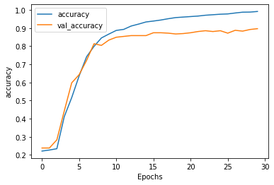
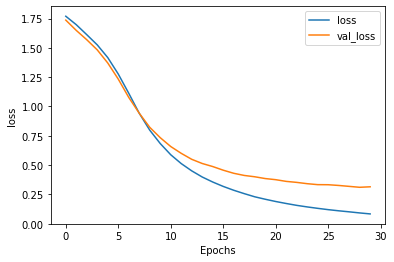
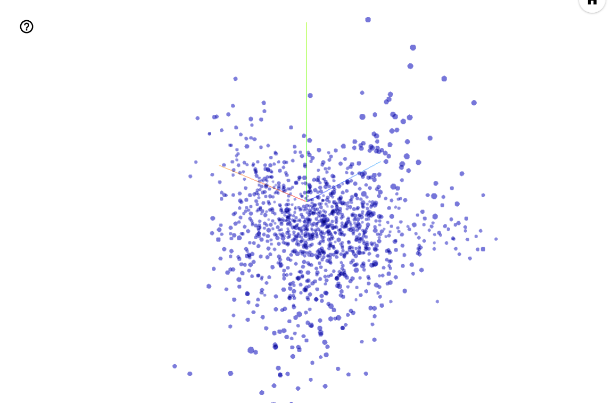

# Natural Language Processing of BBC news archive

This blog is to demonstrate how to use tensorflow to find relationship between words in the article and the categories to which they belong to.

You can use the [.ipnyb notebook](https://github.com/cyriacbijun/Tensorflow_NLP/blob/master/BBC_article_review/BBC_article_review.md) that is given with the repo by downloading and starting a kernel.


*   For local computer, use [jupyter notebook](https://jupyter.org/install)
*   For cloud usage, checkout [Google colab](https://colab.research.google.com/notebooks/intro.ipynb)


First, lets start off by importing the required libraries in python. Pandas is not actually required. It was just used to show the structure of the csv file we are going to use.


```python
import csv
import tensorflow as tf
import numpy as np
from tensorflow.keras.preprocessing.text import Tokenizer
from tensorflow.keras.preprocessing.sequence import pad_sequences
import pandas as pd
```

wget is a unix utility to download any file from the web. We use this to download our dataset to a file bbc-text.csv

`!wget` is written because, in notebooks, `!` is used to invoke a shell command.


```python
!wget --no-check-certificate \
    https://storage.googleapis.com/laurencemoroney-blog.appspot.com/bbc-text.csv \
    -O bbc-text.csv
```

    --2020-04-14 17:31:32--  https://storage.googleapis.com/laurencemoroney-blog.appspot.com/bbc-text.csv
    Resolving storage.googleapis.com (storage.googleapis.com)... 64.233.189.128, 2404:6800:4008:c00::80
    Connecting to storage.googleapis.com (storage.googleapis.com)|64.233.189.128|:443... connected.
    HTTP request sent, awaiting response... 200 OK
    Length: 5057493 (4.8M) [application/octet-stream]
    Saving to: ‘bbc-text.csv’
    
    bbc-text.csv        100%[===================>]   4.82M  --.-KB/s    in 0.04s   
    
    2020-04-14 17:31:32 (121 MB/s) - ‘bbc-text.csv’ saved [5057493/5057493]
    
    


```python
data = pd.read_csv('bbc-text.csv')
print("\nNo. of articles is " + str(len(data)))
print(data.head())

```

    
    No. of articles is 2225
            category                                               text
    0           tech  tv future in the hands of viewers with home th...
    1       business  worldcom boss  left books alone  former worldc...
    2          sport  tigers wary of farrell  gamble  leicester say ...
    3          sport  yeading face newcastle in fa cup premiership s...
    4  entertainment  ocean s twelve raids box office ocean s twelve...
    

From the above output we see that the number of rows in the csv file is 2225. The `data.head()` command gives the structure of csv file. It has 2 columns:
* category
* text

Now, let us set some parameters for processing and training of the csv file.


```python
vocab_size = 1250
embedding_dim = 16
max_length = 120
trunc_type='post'
padding_type='post'
oov_tok = "<OOV>"
training_portion = .8
```

* `vocab_size` gives the number of words we are going to consider in our experiment. The goal of the experiment is to find the relation of each word (out of 1250) with the given categories.

* `embedding_dim` is a little bit difficult to understand. It gives the dimension of the vector that represents the relation between the word and category.

* `max_length` is used to pad the input vector when we go for training. As you know, the input sentences all have to be of similar length, thus we need to pad before we feed it into the neural network.

* Both the `trunc_type='post'` and `padding_type='post'` denote that the truncation and padding of sentences should take place from sentence end.

* `oov_tok = "<OOV>"` is a special token that will take the place of a word if it is not found in the current word_index( The word_index created by the `Tokenizer`).

* `training_portion` is simply used to define the portion of data as train and test data.

We do not need to find relation between normal *stopwords* and categories. So, we define 153 of them before itself, so that they can be remove from the sentences.


```python
sentences = []
labels = []
stopwords = [ "a", "about", "above", "after", "again", "against", "all", "am", "an", "and", "any", "are", "as", "at", "be", "because", "been", "before", "being", "below", "between", "both", "but", "by", "could", "did", "do", "does", "doing", "down", "during", "each", "few", "for", "from", "further", "had", "has", "have", "having", "he", "he'd", "he'll", "he's", "her", "here", "here's", "hers", "herself", "him", "himself", "his", "how", "how's", "i", "i'd", "i'll", "i'm", "i've", "if", "in", "into", "is", "it", "it's", "its", "itself", "let's", "me", "more", "most", "my", "myself", "nor", "of", "on", "once", "only", "or", "other", "ought", "our", "ours", "ourselves", "out", "over", "own", "same", "she", "she'd", "she'll", "she's", "should", "so", "some", "such", "than", "that", "that's", "the", "their", "theirs", "them", "themselves", "then", "there", "there's", "these", "they", "they'd", "they'll", "they're", "they've", "this", "those", "through", "to", "too", "under", "until", "up", "very", "was", "we", "we'd", "we'll", "we're", "we've", "were", "what", "what's", "when", "when's", "where", "where's", "which", "while", "who", "who's", "whom", "why", "why's", "with", "would", "you", "you'd", "you'll", "you're", "you've", "your", "yours", "yourself", "yourselves" ]
print(len(stopwords))
```

    153
    


```python
with open('bbc-text.csv','r') as csvfile:
  reader = csv.reader(csvfile,delimiter = ',')
  next(reader)
  for row in reader:
    labels.append(row[0])
    sentence = row[1]
    for word in stopwords:
      token = " " + word + " "
      sentence.replace(token," ")
    sentences.append(sentence)

print(len(labels))
print(len(sentences))
print(sentences[0])
```

    2225
    2225
    tv future in the hands of viewers with home theatre systems  plasma high-definition tvs  and digital video recorders moving into the living room  the way people watch tv will be radically different in five years  time.  that is according to an expert panel which gathered at the annual consumer electronics show in las vegas to discuss how these new technologies will impact one of our favourite pastimes. with the us leading the trend  programmes and other content will be delivered to viewers via home networks  through cable  satellite  telecoms companies  and broadband service providers to front rooms and portable devices.  one of the most talked-about technologies of ces has been digital and personal video recorders (dvr and pvr). these set-top boxes  like the us s tivo and the uk s sky+ system  allow people to record  store  play  pause and forward wind tv programmes when they want.  essentially  the technology allows for much more personalised tv. they are also being built-in to high-definition tv sets  which are big business in japan and the us  but slower to take off in europe because of the lack of high-definition programming. not only can people forward wind through adverts  they can also forget about abiding by network and channel schedules  putting together their own a-la-carte entertainment. but some us networks and cable and satellite companies are worried about what it means for them in terms of advertising revenues as well as  brand identity  and viewer loyalty to channels. although the us leads in this technology at the moment  it is also a concern that is being raised in europe  particularly with the growing uptake of services like sky+.  what happens here today  we will see in nine months to a years  time in the uk   adam hume  the bbc broadcast s futurologist told the bbc news website. for the likes of the bbc  there are no issues of lost advertising revenue yet. it is a more pressing issue at the moment for commercial uk broadcasters  but brand loyalty is important for everyone.  we will be talking more about content brands rather than network brands   said tim hanlon  from brand communications firm starcom mediavest.  the reality is that with broadband connections  anybody can be the producer of content.  he added:  the challenge now is that it is hard to promote a programme with so much choice.   what this means  said stacey jolna  senior vice president of tv guide tv group  is that the way people find the content they want to watch has to be simplified for tv viewers. it means that networks  in us terms  or channels could take a leaf out of google s book and be the search engine of the future  instead of the scheduler to help people find what they want to watch. this kind of channel model might work for the younger ipod generation which is used to taking control of their gadgets and what they play on them. but it might not suit everyone  the panel recognised. older generations are more comfortable with familiar schedules and channel brands because they know what they are getting. they perhaps do not want so much of the choice put into their hands  mr hanlon suggested.  on the other end  you have the kids just out of diapers who are pushing buttons already - everything is possible and available to them   said mr hanlon.  ultimately  the consumer will tell the market they want.   of the 50 000 new gadgets and technologies being showcased at ces  many of them are about enhancing the tv-watching experience. high-definition tv sets are everywhere and many new models of lcd (liquid crystal display) tvs have been launched with dvr capability built into them  instead of being external boxes. one such example launched at the show is humax s 26-inch lcd tv with an 80-hour tivo dvr and dvd recorder. one of the us s biggest satellite tv companies  directtv  has even launched its own branded dvr at the show with 100-hours of recording capability  instant replay  and a search function. the set can pause and rewind tv for up to 90 hours. and microsoft chief bill gates announced in his pre-show keynote speech a partnership with tivo  called tivotogo  which means people can play recorded programmes on windows pcs and mobile devices. all these reflect the increasing trend of freeing up multimedia so that people can watch what they want  when they want.
    

Above cell opens the `bbc-text.csv` file in read mode and removes the stopwords before appending them to the sentence. The original data is also split into train and test using the `training_size` variable.


```python
training_size = int(len(sentences) * training_portion)

train_sentences = sentences[:training_size]
test_sentences = sentences[training_size:]

train_labels = labels[:training_size]
test_labels = labels[training_size:]

print(len(train_sentences))
print(len(train_labels))
print(len(test_sentences))
print(len(test_labels))
```

    1780
    1780
    445
    445
    

Here, we use the Tokenizer that we defined before to create a word_index. The sequences created from text are also padded using the constraints from before.

The `train_sequences[0]` gives the actual sequence. We pad it to limit it at 120 characters.


```python
tokenizer = Tokenizer(num_words = vocab_size, oov_token=oov_tok)
tokenizer.fit_on_texts(train_sentences)
word_index = tokenizer.word_index

train_sequences = tokenizer.texts_to_sequences(train_sentences)
train_padded = pad_sequences(train_sequences, padding=padding_type, maxlen=max_length)

print(len(train_sequences[0]))
print(len(train_padded[0]))
```

    750
    120
    

You can see the words which were tokenized by the `Tokenizer`. Any word that is out of this word_index will be replaced by the 1st token : `<OOV>`

Similarily, the test sentences are also made to sequences and then padded.


```python
print(word_index)
```

    {'<OOV>': 1, 'the': 2, 'to': 3, 'of': 4, 'and': 5, 'a': 6, 'in': 7, 's': 8, 'for': 9, 'is': 10, 'that': 11, 'it': 12, 'on': 13, 'said': 14, 'was': 15, 'he': 16, 'be': 17, 'with': 18, 'as': 19, 'has': 20, 'have': 21, 'at': 22, 'by': 23, 'will': 24, 'but': 25, 'are': 26, 'i': 27, 'not': 28, 'from': 29, 'they': 30, 'his': 31, 'mr': 32, 'we': 33, 'this': 34, 'an': 35, 'had': 36, 'which': 37, 'would': 38, 'been': 39, 'their': 40, 'year': 41, 'more': 42, 'up': 43, 'its': 44, 'also': 45, 'were': 46, 'who': 47, 'people': 48, 'new': 49, 'us': 50, 'there': 51, 'one': 52, 'about': 53, 'after': 54, 'out': 55, 'can': 56, 'or': 57, 'than': 58, 'all': 59, 'if': 60, 'over': 61, 'could': 62, 'you': 63, 'last': 64, 't': 65, 'first': 66, 'when': 67, 'time': 68, 'two': 69, 'government': 70, 'world': 71, 'into': 72, 'so': 73, 'now': 74, 'what': 75, 'other': 76, 'some': 77, 'uk': 78, 'she': 79, 'best': 80, 'years': 81, 'against': 82, 'no': 83, 'only': 84, 'do': 85, 'make': 86, 'just': 87, 'them': 88, 'being': 89, 'film': 90, 'told': 91, 'made': 92, 'get': 93, 'music': 94, 'game': 95, 'should': 96, 'like': 97, 'very': 98, 'such': 99, 'back': 100, 'many': 101, '000': 102, 'because': 103, 'labour': 104, 'before': 105, 'three': 106, 'her': 107, 'well': 108, '1': 109, 'next': 110, 'bbc': 111, 'most': 112, 'while': 113, 'any': 114, 'take': 115, 'my': 116, 'set': 117, 'number': 118, 'added': 119, 'way': 120, 'market': 121, '2': 122, 'company': 123, 'may': 124, 'our': 125, 'says': 126, 'him': 127, 'election': 128, 'home': 129, 'off': 130, 'party': 131, 'then': 132, 'good': 133, 'going': 134, 'much': 135, 'how': 136, 'work': 137, '2004': 138, 'those': 139, 'still': 140, 'win': 141, 'show': 142, 'think': 143, 'games': 144, 'go': 145, 'down': 146, 'top': 147, 'second': 148, 'won': 149, 'million': 150, '6': 151, 'england': 152, 'firm': 153, 'since': 154, 'week': 155, 'say': 156, 'play': 157, 'part': 158, 'public': 159, 'use': 160, 'blair': 161, 'under': 162, '3': 163, 'between': 164, 'want': 165, 'minister': 166, 'however': 167, 'did': 168, '10': 169, 'country': 170, 'both': 171, 'technology': 172, 'these': 173, 'see': 174, '4': 175, 'five': 176, 'british': 177, 'news': 178, 'through': 179, 'european': 180, 'high': 181, 'group': 182, 'tv': 183, 'where': 184, 'used': 185, 'end': 186, 'expected': 187, 'even': 188, 'players': 189, 'm': 190, 'me': 191, 'brown': 192, '5': 193, 'six': 194, 'old': 195, 'net': 196, 'already': 197, 'four': 198, 'plans': 199, 'put': 200, 'come': 201, 'half': 202, 'london': 203, 'sales': 204, 'growth': 205, 'don': 206, 'long': 207, 'economy': 208, 'service': 209, 'right': 210, 'months': 211, 'chief': 212, 'too': 213, 'day': 214, 'own': 215, 'mobile': 216, 'former': 217, 'during': 218, 'money': 219, 'britain': 220, 'director': 221, 'tax': 222, 'services': 223, '2005': 224, 'deal': 225, 'need': 226, 'help': 227, 'digital': 228, 'according': 229, 'big': 230, 'industry': 231, 'place': 232, 'companies': 233, 'users': 234, 'system': 235, 'business': 236, 'including': 237, 'team': 238, 'final': 239, 'based': 240, 'hit': 241, 'record': 242, 'report': 243, 'third': 244, 'called': 245, 'really': 246, 'international': 247, 'month': 248, 'move': 249, 'wales': 250, 'europe': 251, 'another': 252, '7': 253, 'life': 254, 'around': 255, 'economic': 256, 'start': 257, 'great': 258, 'future': 259, '2003': 260, 'firms': 261, 'came': 262, 'france': 263, 'open': 264, 'got': 265, 'spokesman': 266, 'software': 267, 're': 268, 'without': 269, 'general': 270, 'club': 271, 'took': 272, 'same': 273, 'ireland': 274, 'video': 275, 'howard': 276, 'know': 277, 'united': 278, 'online': 279, 'bank': 280, 'phone': 281, 'china': 282, 'far': 283, 'state': 284, 'campaign': 285, 'side': 286, 'law': 287, 'radio': 288, 'better': 289, 'court': 290, 'making': 291, 'decision': 292, 'executive': 293, 'real': 294, 'media': 295, 'offer': 296, 'give': 297, 'computer': 298, 'found': 299, 'action': 300, 'able': 301, 'president': 302, 'information': 303, 'despite': 304, 'office': 305, 'star': 306, 'lot': 307, 'o': 308, 'national': 309, 'line': 310, 'countries': 311, 'likely': 312, 'using': 313, 'away': 314, 'player': 315, 'internet': 316, 'saying': 317, 'every': 318, 'given': 319, 'security': 320, 'become': 321, 'left': 322, 'awards': 323, 'figures': 324, 'anti': 325, 'nations': 326, 'run': 327, 'eu': 328, '20': 329, 'cost': 330, 've': 331, 'prime': 332, 'role': 333, 'seen': 334, 'playing': 335, 'biggest': 336, 'man': 337, 'january': 338, 'data': 339, 'bill': 340, 'whether': 341, 'played': 342, 'later': 343, 'foreign': 344, 'although': 345, 'cup': 346, 'further': 347, 'hard': 348, 'award': 349, 'rise': 350, 'broadband': 351, 'times': 352, 'match': 353, 'chancellor': 354, 'oil': 355, 'pay': 356, 'lost': 357, 'taking': 358, 'house': 359, 'due': 360, 'past': 361, 'interest': 362, 'early': 363, 'never': 364, 'lord': 365, 'leader': 366, 'support': 367, 'case': 368, 'again': 369, 'prices': 370, 'look': 371, 'few': 372, 'microsoft': 373, 'shares': 374, 'does': 375, 'michael': 376, 'legal': 377, 'analysts': 378, 'control': 379, 'believe': 380, 'december': 381, 'less': 382, 'days': 383, 'cut': 384, 'recent': 385, 'season': 386, 'little': 387, 'children': 388, 'e': 389, 'ahead': 390, 'earlier': 391, 'increase': 392, 'thought': 393, 'free': 394, 'john': 395, 'face': 396, 'your': 397, 'research': 398, 'scotland': 399, 'important': 400, 'something': 401, 'current': 402, 'strong': 403, 'went': 404, 'issue': 405, 'am': 406, 'secretary': 407, 'south': 408, 'local': 409, 'tory': 410, 'rights': 411, 'working': 412, 'power': 413, 'budget': 414, 'each': 415, 'financial': 416, 'spending': 417, '12': 418, 'quarter': 419, 'access': 420, 'currently': 421, 'held': 422, 'major': 423, 'chance': 424, 'change': 425, 'trade': 426, 'films': 427, 'find': 428, 'looking': 429, 'try': 430, 'following': 431, 'sunday': 432, '0': 433, 'full': 434, 'tories': 435, 'yet': 436, 'return': 437, 'series': 438, 'latest': 439, 'meeting': 440, 'share': 441, 'different': 442, 'website': 443, 'david': 444, 'winning': 445, 'almost': 446, 'injury': 447, 'sale': 448, 'must': 449, 'lead': 450, 'enough': 451, 'personal': 452, 'programme': 453, 'might': 454, 'until': 455, 'police': 456, 'low': 457, 'band': 458, 'problems': 459, 'ever': 460, 'keep': 461, 'rate': 462, 'having': 463, 'announced': 464, 'always': 465, 'key': 466, 'coach': 467, 'williams': 468, 'sold': 469, 'across': 470, 'performance': 471, 'dollar': 472, '11': 473, 'among': 474, 'behind': 475, 'ago': 476, 'list': 477, '8': 478, '9': 479, 'clear': 480, 'here': 481, 'getting': 482, 'political': 483, 'victory': 484, '25': 485, 'mark': 486, 'chairman': 487, 'include': 488, 'women': 489, 'demand': 490, '30': 491, 'statement': 492, 'ms': 493, 'march': 494, 'february': 495, 'things': 496, 'term': 497, 'rather': 498, 'jobs': 499, 'minutes': 500, 'tuesday': 501, 'american': 502, 'chelsea': 503, 'claims': 504, 'done': 505, 'content': 506, 'continue': 507, 'point': 508, 'job': 509, 'manager': 510, 'means': 511, 'head': 512, 'problem': 513, 'title': 514, 'actor': 515, 'coming': 516, 'huge': 517, 'price': 518, 'asked': 519, 'released': 520, 'taken': 521, 'doing': 522, 'mail': 523, 'men': 524, 'union': 525, 'members': 526, 'india': 527, 'allow': 528, 'weeks': 529, 'wednesday': 530, 'act': 531, 'japan': 532, 'rugby': 533, 'plan': 534, 'tony': 535, 'global': 536, 'investment': 537, 'least': 538, 'result': 539, 'apple': 540, '50': 541, 'young': 542, 'network': 543, 'today': 544, 'within': 545, 'costs': 546, 'fans': 547, 'forward': 548, 'd': 549, 'bid': 550, 'why': 551, 'main': 552, 'french': 553, 'possible': 554, 'production': 555, 'needed': 556, 'running': 557, 'site': 558, 'beat': 559, 'november': 560, '18': 561, 'small': 562, 'war': 563, 'council': 564, 'consumer': 565, 'available': 566, 'saturday': 567, 'form': 568, 'warned': 569, 'thing': 570, 'monday': 571, 'cash': 572, 'vote': 573, 'hold': 574, 'several': 575, 'known': 576, 'wanted': 577, 'mps': 578, 'song': 579, 'pc': 580, 'issues': 581, 'total': 582, 'committee': 583, 'friday': 584, 'once': 585, '15': 586, 'level': 587, 'live': 588, 'football': 589, 'though': 590, 'evidence': 591, 'policy': 592, 'prize': 593, 'version': 594, 'success': 595, 'led': 596, 'league': 597, 'search': 598, 'trying': 599, '2001': 600, 'human': 601, 'calls': 602, 'previous': 603, 'buy': 604, 'sir': 605, 'recently': 606, 'saw': 607, 'web': 608, 'sony': 609, 'rates': 610, 'family': 611, 'parties': 612, 'aid': 613, 'single': 614, 'album': 615, 'centre': 616, 'eight': 617, 'name': 618, 'customers': 619, 'rules': 620, 'meet': 621, 'close': 622, 'development': 623, 'ministers': 624, 'others': 625, 'thursday': 626, 'health': 627, 'book': 628, 'competition': 629, 'stock': 630, 'agreed': 631, 'call': 632, 'phones': 633, '100': 634, 'difficult': 635, 'short': 636, 'let': 637, 'race': 638, 'yukos': 639, 'consumers': 640, 'popular': 641, 'comes': 642, 'co': 643, 'fact': 644, 'charles': 645, 'event': 646, 'hope': 647, 'failed': 648, 'fourth': 649, 'higher': 650, 'showed': 651, 'networks': 652, 'debt': 653, 'board': 654, 'actress': 655, 'commission': 656, 'trial': 657, 'city': 658, 'wants': 659, 'october': 660, 'italy': 661, 'choice': 662, 'york': 663, 'lib': 664, 'reported': 665, 'feel': 666, 'nothing': 667, 'conference': 668, 'project': 669, 'career': 670, 'bt': 671, 'sites': 672, 'boss': 673, 'didn': 674, 'points': 675, 'liberal': 676, 'late': 677, 'sure': 678, 'liverpool': 679, 'festival': 680, 'reports': 681, 'black': 682, 'received': 683, 'cannot': 684, 'annual': 685, 'together': 686, 'instead': 687, 'claim': 688, 'shows': 689, 'gaming': 690, 'tour': 691, 'dvd': 692, 'break': 693, 'launch': 694, 'claimed': 695, 'paid': 696, 'mean': 697, 'devices': 698, 'christmas': 699, 'jones': 700, 'movie': 701, 'boost': 702, 'goal': 703, 'virus': 704, 'growing': 705, 'stage': 706, 'release': 707, 'age': 708, 'largest': 709, 'september': 710, 'large': 711, 'leading': 712, 'summer': 713, 'champion': 714, '2002': 715, 'involved': 716, 'position': 717, 'arsenal': 718, 'west': 719, 'denied': 720, 'changes': 721, 'themselves': 722, 'russian': 723, 'believes': 724, 'manchester': 725, 'profits': 726, 'paul': 727, 'singer': 728, 'iraq': 729, 'needs': 730, 'fall': 731, 'television': 732, 'products': 733, 'idea': 734, 'stop': 735, 'gordon': 736, 'parliament': 737, '17': 738, 'australian': 739, 'pressure': 740, 'sport': 741, 'love': 742, 'germany': 743, 'africa': 744, 'started': 745, 'create': 746, 'order': 747, 'scottish': 748, 'talks': 749, 'giant': 750, 'potential': 751, '13': 752, 'german': 753, 'test': 754, 'pre': 755, 'weekend': 756, '16': 757, 'quite': 758, 'round': 759, 'opening': 760, 'whole': 761, 'squad': 762, 'martin': 763, 'association': 764, 'special': 765, 'senior': 766, 'launched': 767, 'box': 768, 'chart': 769, 'oscar': 770, 'seven': 771, 'street': 772, 'rose': 773, 'value': 774, 'conservative': 775, 'sent': 776, 'stars': 777, 'ball': 778, 'car': 779, 'v': 780, 'anything': 781, 'grand': 782, 'groups': 783, 'hours': 784, 'accused': 785, '40': 786, 'stand': 787, 'remain': 788, '2000': 789, 'cards': 790, 'either': 791, 'hopes': 792, 'ensure': 793, 'olympic': 794, 'simply': 795, 'robinson': 796, 'fight': 797, 'similar': 798, 'press': 799, 'smith': 800, 'range': 801, 'irish': 802, 'drive': 803, '2006': 804, 'exchange': 805, 'rock': 806, 'official': 807, '24': 808, '14': 809, 'results': 810, 'bit': 811, 'appeal': 812, 'turn': 813, 'dr': 814, 'provide': 815, 'ukip': 816, 'immigration': 817, 'period': 818, 'makes': 819, 'target': 820, 'helped': 821, 'investors': 822, 'standard': 823, 'wrong': 824, 'sell': 825, 'attack': 826, 'commons': 827, 'fell': 828, 'independent': 829, 'tsunami': 830, 'particularly': 831, 'meanwhile': 832, 'comedy': 833, 'proposals': 834, 'education': 835, 'average': 836, 'energy': 837, 'lords': 838, 'ban': 839, 'gave': 840, 'impact': 841, 'via': 842, 'moment': 843, 'compared': 844, 'school': 845, 'happy': 846, 'card': 847, 'forced': 848, 'll': 849, 'charge': 850, 'attacks': 851, 'spam': 852, 'generation': 853, 'force': 854, 'brought': 855, 'amount': 856, 'private': 857, 'community': 858, 'sector': 859, 'per': 860, 'bring': 861, 'fraud': 862, 'became': 863, 'fund': 864, 'euros': 865, 'extra': 866, 'systems': 867, 'everyone': 868, 'speech': 869, 'admitted': 870, 'poll': 871, 'history': 872, 'message': 873, 'numbers': 874, 'included': 875, 'widely': 876, 'gadget': 877, 'entertainment': 878, 'windows': 879, 'debate': 880, 'speaking': 881, 'selling': 882, 'hand': 883, 'bad': 884, 'department': 885, 'laws': 886, 'workers': 887, 'date': 888, 'australia': 889, 'charges': 890, 'markets': 891, 'night': 892, 'audience': 893, 'named': 894, 'russia': 895, 'comments': 896, 'soon': 897, 'worked': 898, 'staff': 899, 'agency': 900, 'view': 901, 'turned': 902, 'kilroy': 903, 'mike': 904, 'front': 905, 'member': 906, 'shot': 907, 'bush': 908, 'revealed': 909, 'areas': 910, 'download': 911, 'takes': 912, 'speed': 913, 'screen': 914, 'increased': 915, 'opposition': 916, 'university': 917, 'battle': 918, 'civil': 919, 'kennedy': 920, 'spend': 921, 'air': 922, 'finance': 923, 'newspaper': 924, 'opportunity': 925, 'concerns': 926, 'shown': 927, 'survey': 928, 'area': 929, 'cross': 930, 'white': 931, 'gone': 932, 'voters': 933, 'course': 934, 'original': 935, 'millions': 936, 'bought': 937, 'offered': 938, '£1': 939, 'poor': 940, 'alan': 941, 'followed': 942, 'east': 943, 'concerned': 944, 'leave': 945, 'often': 946, 'decided': 947, 'insisted': 948, 'authorities': 949, 'outside': 950, 'b': 951, 'favourite': 952, 'terms': 953, 'defence': 954, 'step': 955, 'whose': 956, 'june': 957, 'story': 958, 'reached': 959, 'analyst': 960, 'lives': 961, 'created': 962, 'designed': 963, 'mini': 964, 'process': 965, 'non': 966, 'risk': 967, 'itself': 968, '22': 969, 'america': 970, 'body': 971, 'quality': 972, 'easy': 973, 'spent': 974, 'cuts': 975, 'becoming': 976, 'remains': 977, 'unit': 978, 'majority': 979, 'raise': 980, 'pop': 981, 'attempt': 982, 'musical': 983, 'r': 984, 'drugs': 985, 'hollywood': 986, 'challenge': 987, 'experience': 988, 'example': 989, '19': 990, 'debut': 991, 'nominated': 992, 'states': 993, 'reach': 994, 'credit': 995, 'messages': 996, 'levels': 997, 'winner': 998, 'ray': 999, 'robert': 1000, 'silk': 1001, 'watch': 1002, 'andy': 1003, 'situation': 1004, 'focus': 1005, 'taxes': 1006, 'euro': 1007, 'songs': 1008, 'organisation': 1009, 'build': 1010, 'everything': 1011, 'believed': 1012, 'april': 1013, 'tough': 1014, 'central': 1015, 'anyone': 1016, 'himself': 1017, 'signed': 1018, 'j': 1019, 'pcs': 1020, 'captain': 1021, 'rival': 1022, 'device': 1023, 'indian': 1024, 'confirmed': 1025, 'james': 1026, 'titles': 1027, 'businesses': 1028, 'post': 1029, 'technologies': 1030, 'critics': 1031, 'matter': 1032, 'previously': 1033, 'trading': 1034, 'rest': 1035, 'met': 1036, 'began': 1037, 'longer': 1038, 'officials': 1039, 'response': 1040, 'probably': 1041, 'nine': 1042, 'hour': 1043, 'row': 1044, 'minute': 1045, 'light': 1046, 'cases': 1047, 'magazine': 1048, 'building': 1049, 'worth': 1050, 'account': 1051, 'voice': 1052, 'programs': 1053, 'ask': 1054, 'looked': 1055, 'mp': 1056, 'davis': 1057, 'aviator': 1058, 'threat': 1059, 'trust': 1060, 'confidence': 1061, 'looks': 1062, 'g': 1063, 'chinese': 1064, 'machine': 1065, 'gold': 1066, 'category': 1067, 'computers': 1068, 'premiership': 1069, 'host': 1070, 'measures': 1071, 'fast': 1072, 'person': 1073, 'ruled': 1074, 'towards': 1075, 'artists': 1076, 'double': 1077, 'training': 1078, 'missed': 1079, 'felt': 1080, 'care': 1081, 'agreement': 1082, 'allowed': 1083, 'madrid': 1084, 'scheme': 1085, 'zealand': 1086, 'fear': 1087, 'theatre': 1088, 'portable': 1089, 'newcastle': 1090, 'north': 1091, 'serious': 1092, 'spain': 1093, 'management': 1094, 'banks': 1095, 'program': 1096, 'figure': 1097, 'johnson': 1098, 'positive': 1099, 'affected': 1100, 'champions': 1101, 'file': 1102, 'deutsche': 1103, 'google': 1104, 'kept': 1105, 'rising': 1106, 'rule': 1107, 'argued': 1108, 'along': 1109, 'death': 1110, 'ceremony': 1111, 'code': 1112, 'income': 1113, 'near': 1114, 'approach': 1115, 'machines': 1116, 'built': 1117, 'domestic': 1118, 'moved': 1119, 'stay': 1120, 'profit': 1121, 'illegal': 1122, 'sound': 1123, 'de': 1124, 'doubt': 1125, 'confident': 1126, 'question': 1127, 'gadgets': 1128, 'defeat': 1129, 'dropped': 1130, 'lower': 1131, '27': 1132, 'described': 1133, 'society': 1134, 'effort': 1135, 'successful': 1136, 'websites': 1137, 'significant': 1138, 'thousands': 1139, 'wide': 1140, 'written': 1141, 'deficit': 1142, 'social': 1143, 'athens': 1144, 'crime': 1145, 'peter': 1146, 'predicted': 1147, 'couple': 1148, 'recovery': 1149, 'wireless': 1150, 'pair': 1151, 'announcement': 1152, 'protection': 1153, 'peer': 1154, 'mobiles': 1155, 'suggested': 1156, 'leaders': 1157, 'asia': 1158, 'daily': 1159, 'planning': 1160, 'appear': 1161, 'actually': 1162, 'giving': 1163, 'disaster': 1164, 'talk': 1165, 'democrats': 1166, 'offering': 1167, 'operating': 1168, 'files': 1169, 'someone': 1170, 'expect': 1171, 'parents': 1172, 'bankruptcy': 1173, 'taylor': 1174, 'send': 1175, 'judge': 1176, 'nearly': 1177, 'ways': 1178, 'effect': 1179, 'penalty': 1180, 'conservatives': 1181, 'present': 1182, 'talking': 1183, 'terror': 1184, 'richard': 1185, 'above': 1186, '5bn': 1187, 'controversial': 1188, 'takeover': 1189, 'speculation': 1190, 'road': 1191, 'clarke': 1192, 'facing': 1193, 'text': 1194, 'english': 1195, 'exports': 1196, 'child': 1197, 'drop': 1198, 'mac': 1199, 'leicester': 1200, 'ready': 1201, 'park': 1202, 'policies': 1203, 'spanish': 1204, 'edinburgh': 1205, 'golden': 1206, 'cabinet': 1207, 'massive': 1208, 'individual': 1209, 'add': 1210, 'died': 1211, 'especially': 1212, 'dems': 1213, 'students': 1214, 'blunkett': 1215, 'viewers': 1216, 'programmes': 1217, 'sullivan': 1218, 'airline': 1219, 'backed': 1220, 'stake': 1221, 'joined': 1222, 'hoping': 1223, 'ruling': 1224, 'king': 1225, 'suggests': 1226, 'wins': 1227, 'highest': 1228, 'voted': 1229, 'track': 1230, 'keen': 1231, '28': 1232, 'fox': 1233, 'thomas': 1234, 'mind': 1235, 'channel': 1236, 'shareholders': 1237, 'schools': 1238, 'id': 1239, 'doesn': 1240, 'seed': 1241, 'certainly': 1242, 'tournament': 1243, 'loss': 1244, 'continued': 1245, 'understand': 1246, 'elections': 1247, 'happen': 1248, 'billion': 1249, 'beyond': 1250, 'marketing': 1251, 'hands': 1252, 'common': 1253, '60': 1254, '21': 1255, 'fuel': 1256, 'unlikely': 1257, 'heart': 1258, 'accounts': 1259, 'finding': 1260, 'nominations': 1261, 'planned': 1262, 'paris': 1263, 'ferguson': 1264, 'compete': 1265, 'contract': 1266, 'sign': 1267, 'tried': 1268, 'maker': 1269, 'adding': 1270, 'politicians': 1271, 'gamers': 1272, 'ground': 1273, 'produced': 1274, 'kick': 1275, 'overall': 1276, 'producers': 1277, 'gm': 1278, 'criticised': 1279, 'damage': 1280, 'happened': 1281, 'copies': 1282, 'concern': 1283, 'commercial': 1284, 'producer': 1285, 'ability': 1286, 'save': 1287, 'receive': 1288, 'developed': 1289, 'field': 1290, 'chip': 1291, 'july': 1292, 'insurance': 1293, 'images': 1294, 'particular': 1295, 'pretty': 1296, 'separate': 1297, 'starting': 1298, 'suffered': 1299, 'manufacturing': 1300, 'poverty': 1301, 'follow': 1302, 'fair': 1303, 'drama': 1304, 'living': 1305, 'raised': 1306, 'faces': 1307, 'hits': 1308, 'comment': 1309, 'politics': 1310, 'stadium': 1311, 'operators': 1312, 'details': 1313, 'relief': 1314, 'orders': 1315, 'limited': 1316, 'nintendo': 1317, 'supporters': 1318, 'friends': 1319, 'picture': 1320, 'steve': 1321, 'buying': 1322, 'gerrard': 1323, 'moving': 1324, 'panel': 1325, 'kind': 1326, 'ipod': 1327, 'falling': 1328, 'shadow': 1329, 'sort': 1330, 'picked': 1331, 'offers': 1332, 'movies': 1333, 'powers': 1334, '500': 1335, 'seems': 1336, 'seconds': 1337, 'criminal': 1338, 'developing': 1339, 'experts': 1340, 'glazer': 1341, 'spyware': 1342, 'lack': 1343, 'protect': 1344, 'george': 1345, 'duty': 1346, 'families': 1347, 'closed': 1348, 'agree': 1349, 'singles': 1350, 'federal': 1351, 'homes': 1352, 'works': 1353, 'asian': 1354, 'subject': 1355, 'promised': 1356, 'unemployment': 1357, 'fellow': 1358, 'consider': 1359, 'referee': 1360, 'pensions': 1361, 'slam': 1362, 'product': 1363, 'advantage': 1364, 'straw': 1365, 'winners': 1366, 'ex': 1367, 'unveiled': 1368, 'lse': 1369, '26': 1370, 'decisions': 1371, 'progress': 1372, 'cardiff': 1373, 'matches': 1374, 'rejected': 1375, 'august': 1376, 'reason': 1377, 'published': 1378, 'capital': 1379, 'suspended': 1380, 'warning': 1381, 'xbox': 1382, 'woman': 1383, 'console': 1384, 'goes': 1385, 'limit': 1386, 'kelly': 1387, 'tackle': 1388, 'improve': 1389, 'true': 1390, 'urban': 1391, 'minimum': 1392, 'aimed': 1393, 'appeared': 1394, 'hunting': 1395, 'draw': 1396, 'travel': 1397, 'editor': 1398, 'slow': 1399, 'japanese': 1400, 'refused': 1401, 'standards': 1402, 'alongside': 1403, 'inquiry': 1404, 'changed': 1405, 'indoor': 1406, 'green': 1407, 'quickly': 1408, 'affairs': 1409, '23': 1410, 'campbell': 1411, 'definition': 1412, 'sky': 1413, 'straight': 1414, 'direct': 1415, 'andrew': 1416, 'lose': 1417, 'jamie': 1418, '200': 1419, 'targets': 1420, 'existing': 1421, 'spot': 1422, 'middle': 1423, 'increasing': 1424, 'sides': 1425, 'review': 1426, 'beginning': 1427, 'ended': 1428, 'below': 1429, 'writing': 1430, 'secure': 1431, 'traffic': 1432, 'certain': 1433, 'introduced': 1434, 'born': 1435, 'inflation': 1436, 'gets': 1437, 'reform': 1438, 'meant': 1439, 'technical': 1440, 'super': 1441, 'urged': 1442, 'argentina': 1443, 'wage': 1444, 'study': 1445, 'alone': 1446, 'starring': 1447, 'legislation': 1448, 'pension': 1449, 'earnings': 1450, 'feature': 1451, 'answer': 1452, 'efforts': 1453, '45': 1454, 'talent': 1455, 'housing': 1456, 'fears': 1457, 'advice': 1458, 'morgan': 1459, 'lions': 1460, 'tests': 1461, 'retail': 1462, 'hip': 1463, 'stone': 1464, 'design': 1465, 'pictures': 1466, 'revenue': 1467, 'tim': 1468, 'vice': 1469, 'decide': 1470, 'championship': 1471, 'fit': 1472, 'language': 1473, 'paper': 1474, 'operations': 1475, 'broken': 1476, 'bigger': 1477, 'isn': 1478, 'gives': 1479, 'includes': 1480, 'conditions': 1481, 'baby': 1482, 'piracy': 1483, 'asylum': 1484, 'electronics': 1485, 'interested': 1486, 'proved': 1487, 'output': 1488, 'missing': 1489, 'waiting': 1490, 'avoid': 1491, 'address': 1492, 'sports': 1493, 'source': 1494, 'oscars': 1495, 'considered': 1496, 'showing': 1497, 'telephone': 1498, 'electronic': 1499, 'dem': 1500, 'index': 1501, 'character': 1502, 'size': 1503, 'greater': 1504, 'mourinho': 1505, 'crucial': 1506, 'cable': 1507, 'perhaps': 1508, 'guilty': 1509, 'strategy': 1510, 'carry': 1511, 'dominated': 1512, 'losing': 1513, 'relationship': 1514, 'championships': 1515, 'increasingly': 1516, 'questions': 1517, 'capacity': 1518, 'uses': 1519, 'helping': 1520, 'onto': 1521, '3g': 1522, 'proposed': 1523, 'clearly': 1524, 'rivals': 1525, 'simon': 1526, 'property': 1527, 'records': 1528, 'fiat': 1529, 'hop': 1530, 'viruses': 1531, 'store': 1532, 'putting': 1533, 'tell': 1534, 'responsible': 1535, 'los': 1536, 'environment': 1537, 'red': 1538, 'seek': 1539, 'forecast': 1540, 'obviously': 1541, 'grow': 1542, '5m': 1543, 'continuing': 1544, 'justice': 1545, 'produce': 1546, 'voting': 1547, 'auction': 1548, 'jackson': 1549, 'operation': 1550, 'initially': 1551, 'terrorism': 1552, 'morning': 1553, 'driven': 1554, 'roddick': 1555, 'events': 1556, 'simple': 1557, 'benefit': 1558, 'harry': 1559, 'powerful': 1560, 'drug': 1561, 'welsh': 1562, 'natural': 1563, 'blog': 1564, 'academy': 1565, 'scored': 1566, 'van': 1567, 'transport': 1568, 'model': 1569, 'officer': 1570, 'continues': 1571, 'william': 1572, 'tie': 1573, 'lee': 1574, 'executives': 1575, '1997': 1576, 'hoped': 1577, 'deliver': 1578, 'self': 1579, 'division': 1580, 'claiming': 1581, 'caused': 1582, '1999': 1583, 'gazprom': 1584, 'basis': 1585, 'critical': 1586, 'tipped': 1587, '70': 1588, 'broadcast': 1589, 'lawyer': 1590, 'economist': 1591, 'else': 1592, 'birmingham': 1593, 'owned': 1594, 'korea': 1595, 'accept': 1596, 'faster': 1597, 'miss': 1598, 'join': 1599, 'suggest': 1600, 'smaller': 1601, 'estimated': 1602, 'projects': 1603, 'user': 1604, 'robbie': 1605, 'decade': 1606, 'scott': 1607, 'teams': 1608, 'fifth': 1609, 'responsibility': 1610, 'african': 1611, 'northern': 1612, 'chances': 1613, 'funding': 1614, 'makers': 1615, 'investigation': 1616, 'difference': 1617, 'nation': 1618, 'worldwide': 1619, 'stephen': 1620, 'cause': 1621, 'population': 1622, 'visitors': 1623, 'corporate': 1624, 'food': 1625, 'reduce': 1626, 'space': 1627, 'fighting': 1628, 'activity': 1629, 'favour': 1630, 'ian': 1631, 'replace': 1632, 'connection': 1633, 'airlines': 1634, 'aware': 1635, 'sense': 1636, 'queen': 1637, 'chris': 1638, 'unless': 1639, 'goals': 1640, 'victims': 1641, 'issued': 1642, 'striker': 1643, 'thinking': 1644, 'completely': 1645, 'royal': 1646, 'prince': 1647, 'managed': 1648, 'remained': 1649, 'features': 1650, 'behaviour': 1651, 'twice': 1652, 'amid': 1653, '3bn': 1654, 'greek': 1655, 'boerse': 1656, '80': 1657, 'finished': 1658, 'spokeswoman': 1659, 'inside': 1660, '31': 1661, 'interests': 1662, 'trouble': 1663, 'mails': 1664, 'gmt': 1665, 'wrote': 1666, 'unions': 1667, 'linked': 1668, 'opportunities': 1669, '£2': 1670, 'brian': 1671, 'read': 1672, 'finals': 1673, 'san': 1674, 'station': 1675, 'quit': 1676, 'storage': 1677, 'pass': 1678, 'kenteris': 1679, 'room': 1680, 'trend': 1681, 'display': 1682, 'knew': 1683, 'steven': 1684, 'wasn': 1685, 'tennis': 1686, 'cutting': 1687, 'plays': 1688, 'throughout': 1689, 'presented': 1690, 'evening': 1691, 'democrat': 1692, 'pace': 1693, 'funds': 1694, 'treasury': 1695, 'charity': 1696, 'interview': 1697, 'format': 1698, 'monthly': 1699, 'treatment': 1700, 'sharing': 1701, 'parry': 1702, 'revenues': 1703, 'multimedia': 1704, 'skills': 1705, 'fa': 1706, 'seeing': 1707, 'downing': 1708, 'fly': 1709, 'arrest': 1710, 'leadership': 1711, 'cinema': 1712, 'prevent': 1713, 'alleged': 1714, 'land': 1715, 'worst': 1716, 'aim': 1717, 'jump': 1718, 'faced': 1719, 'supporting': 1720, 'places': 1721, 'broke': 1722, 'israel': 1723, 'owen': 1724, 'telecoms': 1725, 'models': 1726, 'ebbers': 1727, 'finally': 1728, 'matt': 1729, 'angeles': 1730, 'pledged': 1731, 'milburn': 1732, 'score': 1733, 'jason': 1734, 'reuters': 1735, 'beating': 1736, 'finish': 1737, 'increases': 1738, 'organisations': 1739, 'failing': 1740, 'style': 1741, '1bn': 1742, 'jose': 1743, 'culture': 1744, 'paying': 1745, 'modern': 1746, 'questioned': 1747, 'chosen': 1748, 'handed': 1749, 'fully': 1750, 'sri': 1751, 'traditional': 1752, 'tries': 1753, 'words': 1754, 'extremely': 1755, 'com': 1756, 'ibm': 1757, 'olympics': 1758, 'athletics': 1759, 'expectations': 1760, 'hunt': 1761, 'discuss': 1762, 'connections': 1763, 'drawn': 1764, 'fine': 1765, 'opera': 1766, 'decline': 1767, 'courts': 1768, 'spread': 1769, 'serve': 1770, 'creating': 1771, 'accepted': 1772, 'handheld': 1773, 'improving': 1774, 'expects': 1775, 'creative': 1776, 'immediately': 1777, 'strength': 1778, 'wing': 1779, 'surprise': 1780, 'benefits': 1781, 'gara': 1782, 'foxx': 1783, 'holding': 1784, 'manifesto': 1785, 'bond': 1786, 'wenger': 1787, 'aids': 1788, 'happens': 1789, 'watching': 1790, 'bringing': 1791, 'follows': 1792, 'arrested': 1793, 'returned': 1794, 'maybe': 1795, 'securities': 1796, 'fantastic': 1797, 'administration': 1798, '1998': 1799, 'contest': 1800, 'watchdog': 1801, 'improved': 1802, 'federer': 1803, 'rises': 1804, 'strike': 1805, 'criticism': 1806, 'prepared': 1807, 'parliamentary': 1808, 'hewitt': 1809, 'dutch': 1810, 'rap': 1811, 'committed': 1812, 'constitution': 1813, 'malicious': 1814, 'dvds': 1815, 'brand': 1816, 'reality': 1817, 'older': 1818, 'fun': 1819, 'brother': 1820, 'blue': 1821, 'cell': 1822, 'yen': 1823, 'seeking': 1824, 'studios': 1825, 'provided': 1826, 'remaining': 1827, 'grew': 1828, 'effectively': 1829, 'absolutely': 1830, 'appears': 1831, 'playstation': 1832, 'intel': 1833, 'listen': 1834, 'expensive': 1835, '4bn': 1836, 'failure': 1837, 'joint': 1838, 'tech': 1839, 'touch': 1840, 'soul': 1841, 'leaving': 1842, 'currency': 1843, 'deputy': 1844, 'lewis': 1845, 'yahoo': 1846, '90': 1847, 'recorded': 1848, 'assets': 1849, 'science': 1850, 'camp': 1851, 'proposal': 1852, 'developers': 1853, 'heard': 1854, 'handsets': 1855, 'lets': 1856, 'suspects': 1857, 'artist': 1858, 'jonathan': 1859, 'ds': 1860, 'vital': 1861, 'setting': 1862, 'swiss': 1863, 'iaaf': 1864, 'goods': 1865, 'jack': 1866, 'opinion': 1867, 'italian': 1868, 'speeds': 1869, 'gain': 1870, 'blogs': 1871, 'indonesia': 1872, 'link': 1873, 'highly': 1874, 'female': 1875, 'reasons': 1876, 'seats': 1877, 'novel': 1878, 'imf': 1879, 'hd': 1880, 'lawyers': 1881, 'clubs': 1882, 'tom': 1883, 'directed': 1884, 'cast': 1885, 'basic': 1886, 'sydney': 1887, 'slightly': 1888, 'fresh': 1889, 'trillion': 1890, 'specific': 1891, 'achieved': 1892, 'word': 1893, 'closer': 1894, 'driving': 1895, 'explained': 1896, 'myself': 1897, 'greatest': 1898, 'dead': 1899, 'cap': 1900, 'roger': 1901, 'turning': 1902, 'medal': 1903, 'glasgow': 1904, 'wouldn': 1905, 'commissioner': 1906, 'mass': 1907, 'names': 1908, 'choose': 1909, 'surprised': 1910, 'risks': 1911, 'easier': 1912, 'safety': 1913, 'write': 1914, 'agenda': 1915, 'institute': 1916, 'gas': 1917, 'knows': 1918, 'holmes': 1919, 'documentary': 1920, 'losses': 1921, 'option': 1922, 'replacement': 1923, 'visit': 1924, 'carried': 1925, 'performed': 1926, 'parts': 1927, '35': 1928, 'aged': 1929, 'develop': 1930, 'optimistic': 1931, 'respect': 1932, 'winter': 1933, 'wimbledon': 1934, 'sending': 1935, 'seem': 1936, 'consoles': 1937, 'prison': 1938, 'monitor': 1939, 'partner': 1940, 'ran': 1941, 'settlement': 1942, 'rangers': 1943, 'savings': 1944, 'clean': 1945, 'region': 1946, 'weak': 1947, 'rosneft': 1948, 'sees': 1949, 'edwards': 1950, 'charts': 1951, 'stability': 1952, 'wilson': 1953, 'henry': 1954, 'bath': 1955, 'compensation': 1956, 'worldcom': 1957, 'books': 1958, 'semi': 1959, 'studio': 1960, '1m': 1961, 'appearance': 1962, 'push': 1963, 'hodgson': 1964, 'calling': 1965, 'pushed': 1966, 'supply': 1967, 'wife': 1968, 'crisis': 1969, 'profile': 1970, 'fallen': 1971, 'directors': 1972, 'california': 1973, 'regular': 1974, 'hill': 1975, 'mtv': 1976, 'complete': 1977, 'attorney': 1978, 'filed': 1979, 'psp': 1980, 'scale': 1981, 'century': 1982, 'type': 1983, 'allowing': 1984, 'retirement': 1985, 'transfer': 1986, 'injured': 1987, 'murray': 1988, 'boys': 1989, 'alliance': 1990, 'eventually': 1991, 'welcomed': 1992, 'rapper': 1993, '1980s': 1994, 'employment': 1995, 'communities': 1996, 'reforms': 1997, 'camera': 1998, 'actors': 1999, 'flight': 2000, 'providing': 2001, 'angels': 2002, 'la': 2003, '£5': 2004, '8bn': 2005, 'everton': 2006, 'campaigning': 2007, 'passed': 2008, 'mid': 2009, 'killed': 2010, 'easily': 2011, 'charged': 2012, 'introduce': 2013, 'statistics': 2014, 'overseas': 2015, 'alex': 2016, 'waste': 2017, 'asking': 2018, 'stronger': 2019, 'wall': 2020, 'borders': 2021, 'direction': 2022, 'runs': 2023, 'competing': 2024, 'cars': 2025, 'package': 2026, 'forecasts': 2027, 'foot': 2028, 'pro': 2029, 'marathon': 2030, 'water': 2031, 'crowd': 2032, 'correspondent': 2033, 'republic': 2034, 'mp3': 2035, 'disappointing': 2036, 'cheaper': 2037, 'bellamy': 2038, 'views': 2039, 'material': 2040, 'delivered': 2041, 'jail': 2042, 'signing': 2043, 'acting': 2044, 'struggling': 2045, 'banking': 2046, 'deals': 2047, 'quick': 2048, 'cover': 2049, 'foundation': 2050, 'cameras': 2051, 'expansion': 2052, 'deep': 2053, 'haven': 2054, 'willing': 2055, 'celtic': 2056, 'clash': 2057, 'p': 2058, 'larger': 2059, 'usually': 2060, 'graphics': 2061, 'fi': 2062, 'cent': 2063, 'sets': 2064, 'advertising': 2065, 'allegations': 2066, 'entry': 2067, 'medical': 2068, 'raising': 2069, 'sixth': 2070, 'stuff': 2071, 'employees': 2072, 'signs': 2073, 'task': 2074, 'l': 2075, 'veteran': 2076, 'aims': 2077, 'citizens': 2078, 'judges': 2079, 'writer': 2080, '60m': 2081, 'britons': 2082, 'reporters': 2083, 'hundreds': 2084, 'ten': 2085, 'lawsuit': 2086, 'learning': 2087, 'negotiations': 2088, 'steel': 2089, 'eye': 2090, 'c': 2091, 'journalists': 2092, 'influence': 2093, 'tool': 2094, 'lanka': 2095, 'useful': 2096, 'damages': 2097, 'davenport': 2098, 'image': 2099, 'owner': 2100, 'hotel': 2101, 'plus': 2102, 'thanou': 2103, 'athletes': 2104, 'directly': 2105, 'fiscal': 2106, 'worse': 2107, 'radcliffe': 2108, 'hiv': 2109, 'swank': 2110, 'satellite': 2111, 'allows': 2112, 'brands': 2113, 'false': 2114, 'whatever': 2115, 'backs': 2116, 'trip': 2117, 'famous': 2118, 'vision': 2119, 'replaced': 2120, 'heavy': 2121, 'attention': 2122, 'interesting': 2123, 'hopefully': 2124, 'merger': 2125, 'emerged': 2126, 'hugely': 2127, 'delighted': 2128, 'managing': 2129, 'classic': 2130, 'browser': 2131, 'factor': 2132, 'father': 2133, 'nice': 2134, 'donations': 2135, 'assembly': 2136, 'links': 2137, '300': 2138, 'thinks': 2139, 'associated': 2140, 'lists': 2141, 'phil': 2142, 'sun': 2143, 'payments': 2144, 'candidate': 2145, 'driscoll': 2146, 'fed': 2147, 'ross': 2148, 'hearing': 2149, 'approval': 2150, 'effects': 2151, 'yugansk': 2152, 'environmental': 2153, 'earned': 2154, 'upon': 2155, 'fees': 2156, 'scene': 2157, 'blues': 2158, 'christian': 2159, 'versions': 2160, 'innovation': 2161, 'desktop': 2162, 'computing': 2163, 'effective': 2164, 'poster': 2165, 'agencies': 2166, 'elected': 2167, 'worried': 2168, 'engine': 2169, 'reading': 2170, 'promise': 2171, 'considering': 2172, 'base': 2173, 'unable': 2174, 'audio': 2175, 'concert': 2176, 'sources': 2177, 'downloaded': 2178, 'professional': 2179, 'forsyth': 2180, 'class': 2181, '2007': 2182, 'risen': 2183, 'founder': 2184, 'encourage': 2185, 'cheap': 2186, 'attend': 2187, 'wait': 2188, 'lines': 2189, 'resources': 2190, 'challenges': 2191, 'corner': 2192, 'physical': 2193, 'sec': 2194, 'gap': 2195, 'relatively': 2196, 'enter': 2197, 'oliver': 2198, 'performances': 2199, 'pointed': 2200, 'speak': 2201, 'impressive': 2202, 'remember': 2203, 'adults': 2204, 'boeing': 2205, 'detailed': 2206, 'councils': 2207, 'prosecutors': 2208, '4m': 2209, 'frank': 2210, 'organised': 2211, 'definitely': 2212, 'demands': 2213, 'competitive': 2214, 'honour': 2215, 'scorsese': 2216, 'clive': 2217, 'opened': 2218, 'core': 2219, 'celebrity': 2220, 'marsh': 2221, 'votes': 2222, 'wider': 2223, 'reduced': 2224, 'tools': 2225, '75': 2226, '2bn': 2227, 'colleagues': 2228, 'wine': 2229, 'son': 2230, 'scrum': 2231, 'flanker': 2232, 'stopped': 2233, 'graham': 2234, 'targeted': 2235, 'comeback': 2236, 'originally': 2237, 'leg': 2238, 'hear': 2239, 'kevin': 2240, 'begin': 2241, 'boy': 2242, 'pick': 2243, 'ink': 2244, 'rumours': 2245, 'standing': 2246, 'interactive': 2247, 'doping': 2248, 'keeping': 2249, 'patents': 2250, 'door': 2251, 'davies': 2252, '29': 2253, 'controls': 2254, 'prove': 2255, 'thompson': 2256, '1994': 2257, 'actions': 2258, 'barcelona': 2259, 'rooney': 2260, 'murder': 2261, 'mci': 2262, 'communications': 2263, '1990s': 2264, 'spring': 2265, 'announce': 2266, 'contact': 2267, 'autumn': 2268, 'ideas': 2269, 'focused': 2270, 'partly': 2271, 'infected': 2272, 'exciting': 2273, 'suffering': 2274, 'friend': 2275, 'church': 2276, 'page': 2277, 'perform': 2278, 'everybody': 2279, 'episode': 2280, 'intended': 2281, 'crown': 2282, 'mortgage': 2283, 'art': 2284, 'wasps': 2285, 'defended': 2286, 'n': 2287, 'required': 2288, 'tobacco': 2289, 'offence': 2290, 'options': 2291, 'peace': 2292, 'nuclear': 2293, 'outstanding': 2294, 'employers': 2295, 'table': 2296, 'combined': 2297, '100m': 2298, '6bn': 2299, 'leigh': 2300, 'industries': 2301, 'laptop': 2302, 'euronext': 2303, 'engines': 2304, 'complex': 2305, 'factory': 2306, 'brazil': 2307, 'referendum': 2308, 'conducted': 2309, 'freedom': 2310, 'younger': 2311, 'flying': 2312, 'telling': 2313, 'couldn': 2314, '48': 2315, 'western': 2316, 'cope': 2317, 'recognise': 2318, 'multi': 2319, 'limits': 2320, 'dance': 2321, 'fixed': 2322, 'economists': 2323, 'slowdown': 2324, 'disappointed': 2325, 'yes': 2326, 'acts': 2327, 'solution': 2328, 'centres': 2329, 'determined': 2330, 'respond': 2331, 'gdp': 2332, 'dismissed': 2333, 'obvious': 2334, 'penalties': 2335, 'vera': 2336, 'safe': 2337, 'platform': 2338, 'backing': 2339, 'benitez': 2340, 'memory': 2341, 'stories': 2342, 'delta': 2343, 'attacked': 2344, 'milan': 2345, '32': 2346, '000m': 2347, 'joss': 2348, 'handle': 2349, 'sideways': 2350, 'balance': 2351, 'sheffield': 2352, 'beaten': 2353, 'leeds': 2354, 'session': 2355, 'wilkinson': 2356, 'moya': 2357, 'learn': 2358, 'ambitions': 2359, 'reducing': 2360, 'proper': 2361, 'defend': 2362, 'enjoy': 2363, 'changing': 2364, 'pulled': 2365, 'alternative': 2366, 'breakthrough': 2367, 'summit': 2368, 'expressed': 2369, 'apart': 2370, '800m': 2371, 'ministry': 2372, 'advance': 2373, 'fastest': 2374, 'controlled': 2375, 'phillips': 2376, 'thanks': 2377, 'vehicles': 2378, 'variety': 2379, 'houston': 2380, 'texas': 2381, 'mother': 2382, 'construction': 2383, 'nominees': 2384, 'sharp': 2385, 'sometimes': 2386, 'bafta': 2387, 'ethnic': 2388, 'granted': 2389, 'fan': 2390, 'spammers': 2391, 'drake': 2392, 'southern': 2393, 'owners': 2394, 'itunes': 2395, 'jewish': 2396, 'triple': 2397, 'collection': 2398, 'dublin': 2399, 'ea': 2400, 'ticket': 2401, 'movement': 2402, 'crude': 2403, 'cold': 2404, 'collins': 2405, 'necessary': 2406, 'desire': 2407, 'totally': 2408, 'bridge': 2409, 'shape': 2410, 'screens': 2411, 'vodafone': 2412, 'thailand': 2413, 'fee': 2414, 'assistant': 2415, 'capable': 2416, 'producing': 2417, 'neither': 2418, 'authority': 2419, 'reserve': 2420, 'shared': 2421, 'ferdinand': 2422, 'seriously': 2423, 'violence': 2424, 'therefore': 2425, 'edge': 2426, 'dollars': 2427, '34': 2428, 'hardware': 2429, 'feels': 2430, 'seat': 2431, 'khodorkovsky': 2432, 'joining': 2433, 'exactly': 2434, 'attacking': 2435, 'organisers': 2436, 'enjoyed': 2437, 'initiative': 2438, 'application': 2439, '200m': 2440, 'ones': 2441, 'blow': 2442, 'drinking': 2443, 'borrowing': 2444, 'disney': 2445, 'stores': 2446, 'arms': 2447, 'whom': 2448, 'essential': 2449, 'gary': 2450, 'providers': 2451, 'likes': 2452, 'recognised': 2453, 'declared': 2454, 'struck': 2455, 'placed': 2456, 'estimates': 2457, 'westminster': 2458, 'governments': 2459, 'henman': 2460, 'charlie': 2461, 'secret': 2462, 'closely': 2463, '36': 2464, 'finances': 2465, 'dicaprio': 2466, 'achievement': 2467, 'intelligence': 2468, 'x': 2469, 'settle': 2470, 'badly': 2471, 'infrastructure': 2472, 'musicians': 2473, 'individuals': 2474, 'moves': 2475, 'manufacturers': 2476, 'afford': 2477, '7bn': 2478, 'visa': 2479, 'woodward': 2480, 'pitch': 2481, 'shops': 2482, 'readers': 2483, 'ballot': 2484, 'colour': 2485, 'illegally': 2486, 'regularly': 2487, 'normal': 2488, '400': 2489, 'perfect': 2490, 'headed': 2491, 'broadcasting': 2492, 'un': 2493, 'plant': 2494, 'highlighted': 2495, 'split': 2496, 'creation': 2497, 'kong': 2498, 'sporting': 2499, 'patent': 2500, 'documents': 2501, 'buyers': 2502, 'attempts': 2503, 'outlook': 2504, 'block': 2505, 'rural': 2506, 'bob': 2507, 'reaching': 2508, 'staunton': 2509, 'u2': 2510, 'automatically': 2511, 'downloads': 2512, 'potentially': 2513, 'usual': 2514, 'eastwood': 2515, 'bell': 2516, 'gathered': 2517, 'channels': 2518, 'suit': 2519, 'knee': 2520, 'southampton': 2521, 'express': 2522, 'weather': 2523, 'mrs': 2524, 'arm': 2525, 'berlin': 2526, 'listed': 2527, 'owns': 2528, 'shut': 2529, 'tend': 2530, '£4': 2531, 'invest': 2532, 'cole': 2533, 'closing': 2534, 'roles': 2535, 'terrorist': 2536, 'indeed': 2537, 'wish': 2538, 'sensitive': 2539, 'ons': 2540, 'topped': 2541, 'earning': 2542, '800': 2543, 'equal': 2544, 'researchers': 2545, 'hospital': 2546, 'lewsey': 2547, 'maintain': 2548, 'tight': 2549, 'related': 2550, 'audiences': 2551, 'rich': 2552, 'forum': 2553, 'recover': 2554, 'ulster': 2555, 'measure': 2556, 'agent': 2557, 'minority': 2558, 'label': 2559, 'letter': 2560, 'lots': 2561, '2010': 2562, 'status': 2563, 'muslim': 2564, 'pocket': 2565, 'injuries': 2566, 'whilst': 2567, 'safin': 2568, 'industrial': 2569, 'yards': 2570, 'wi': 2571, 'hero': 2572, 'walk': 2573, 'vulnerable': 2574, 'quoted': 2575, 'damaging': 2576, 'square': 2577, 'cities': 2578, 'established': 2579, 'possibility': 2580, 'iran': 2581, 'breaking': 2582, 'excellent': 2583, 'campaigners': 2584, 'agassi': 2585, 'apologise': 2586, 'forget': 2587, 'distance': 2588, 'sentence': 2589, 'switch': 2590, 'premier': 2591, 'norwich': 2592, 'swansea': 2593, 'distribution': 2594, 'ordinary': 2595, 'commitment': 2596, 'canada': 2597, 'virgin': 2598, 'collapse': 2599, 'creditors': 2600, 'opposed': 2601, 'venture': 2602, 'contracts': 2603, 'complaint': 2604, 'popularity': 2605, 'completed': 2606, 'contribution': 2607, 'prompted': 2608, 'threats': 2609, 'trials': 2610, 'st': 2611, 'hot': 2612, 'americans': 2613, 'banned': 2614, 'addition': 2615, 'solid': 2616, 'sweden': 2617, 'globe': 2618, 'author': 2619, 'equipment': 2620, 'praised': 2621, 'additional': 2622, 'guy': 2623, 'incident': 2624, '65': 2625, 'declined': 2626, 'fire': 2627, 'henson': 2628, 'peel': 2629, 'capt': 2630, 'reportedly': 2631, 'murphy': 2632, 'miller': 2633, 'achieve': 2634, 'ownership': 2635, 'belief': 2636, 'sex': 2637, 'island': 2638, 'letwin': 2639, 'keeper': 2640, 'controversy': 2641, 'hurt': 2642, 'letting': 2643, 'ruddock': 2644, 'welcome': 2645, 'evans': 2646, 'entirely': 2647, 'blacks': 2648, 'jean': 2649, 'wonderful': 2650, 'danger': 2651, 'remove': 2652, 'stade': 2653, '7m': 2654, 'mary': 2655, 'fake': 2656, 'ces': 2657, 'accounting': 2658, 'blackburn': 2659, 'pack': 2660, 'stressed': 2661, 'heineken': 2662, 'opens': 2663, 'telegraph': 2664, 'threatened': 2665, 'papers': 2666, 'wake': 2667, 'speaker': 2668, 'processor': 2669, 'operator': 2670, 'detainees': 2671, 'becomes': 2672, 'pleased': 2673, 'firefox': 2674, 'instance': 2675, 'duo': 2676, 'nor': 2677, 'piece': 2678, 'albums': 2679, 'switzerland': 2680, 'gained': 2681, 'blamed': 2682, 'pensioners': 2683, 'households': 2684, 'newspapers': 2685, 'strongly': 2686, 'independence': 2687, 'daughter': 2688, 'uefa': 2689, 'lifted': 2690, 'keane': 2691, 'military': 2692, 'superb': 2693, 'largely': 2694, 'hong': 2695, 'abroad': 2696, 'commerce': 2697, 'wild': 2698, 'scheduled': 2699, 'nomination': 2700, 'testing': 2701, 'vast': 2702, 'nick': 2703, 'categories': 2704, 'tickets': 2705, 'shock': 2706, 'friendly': 2707, 'matters': 2708, 'represent': 2709, 'elvis': 2710, 'turkey': 2711, 'paula': 2712, 'lock': 2713, 'rover': 2714, 'passengers': 2715, 'jeeves': 2716, 'g8': 2717, 'legitimate': 2718, 'detained': 2719, 'leads': 2720, 'pushing': 2721, 'recording': 2722, 'gates': 2723, '8m': 2724, 'criminals': 2725, 'pull': 2726, 'returns': 2727, 'racist': 2728, 'stepped': 2729, 'falls': 2730, 'entire': 2731, 'helps': 2732, 'disease': 2733, 'practice': 2734, 'potter': 2735, 'fired': 2736, 'mouse': 2737, 'understood': 2738, 'efficient': 2739, '150': 2740, 'emergency': 2741, 'hughes': 2742, 'abuse': 2743, 'proving': 2744, 'dedicated': 2745, 'electoral': 2746, 'officers': 2747, 'suddenly': 2748, 'federation': 2749, 'arts': 2750, 'funded': 2751, 'investments': 2752, 'mcconnell': 2753, 'matthew': 2754, 'eyes': 2755, 'contrast': 2756, 'purchase': 2757, 'ukraine': 2758, 'kicked': 2759, 'moments': 2760, 'auto': 2761, 'ultimate': 2762, 'operate': 2763, 'discussions': 2764, '£3': 2765, 'remote': 2766, 'argentine': 2767, 'bay': 2768, '42': 2769, 'keys': 2770, 'mainstream': 2771, 'thank': 2772, 'desperate': 2773, 'lisbon': 2774, 'promises': 2775, 'earn': 2776, 'wanting': 2777, 'impossible': 2778, 'latin': 2779, 'universal': 2780, 'silver': 2781, 'trusted': 2782, 'seemed': 2783, 'screensaver': 2784, 'servers': 2785, 'seventh': 2786, 'nokia': 2787, 'smart': 2788, 'billions': 2789, 'premium': 2790, 'hi': 2791, 'adult': 2792, 'copy': 2793, 'male': 2794, 'prescott': 2795, 'kate': 2796, 'immediate': 2797, 'ronaldo': 2798, 'awarded': 2799, 'gardener': 2800, 'copyright': 2801, 'succeed': 2802, 'junk': 2803, 'edward': 2804, 'monetary': 2805, 'airport': 2806, 'resigned': 2807, 'tribunal': 2808, 'initial': 2809, 'laser': 2810, 'laptops': 2811, 'bnp': 2812, 'silicon': 2813, 'boom': 2814, 'bolton': 2815, 'holiday': 2816, 'bench': 2817, 'wars': 2818, 'ratings': 2819, '43': 2820, 'debts': 2821, 'importance': 2822, 'reputation': 2823, 'halo': 2824, 'ease': 2825, 'lowest': 2826, 'medium': 2827, 'loans': 2828, 'parker': 2829, 'select': 2830, 'constituency': 2831, 'candidates': 2832, 'welfare': 2833, 'prosecution': 2834, 'schemes': 2835, 'subsidies': 2836, 'ensuring': 2837, 'subscribers': 2838, 'cueto': 2839, 'conflict': 2840, 'scandal': 2841, 'w': 2842, 'prop': 2843, 'douglas': 2844, 'twickenham': 2845, 'smoking': 2846, 'era': 2847, 'extend': 2848, 'properly': 2849, 'honours': 2850, 'argue': 2851, 'yuganskneftegas': 2852, 'dispute': 2853, 'orange': 2854, 'alicia': 2855, 'goldsmith': 2856, 'resolution': 2857, 'ben': 2858, 'carefully': 2859, 'turns': 2860, 'knowledge': 2861, 'various': 2862, 'favourites': 2863, 'begun': 2864, 'stations': 2865, '2008': 2866, 'watched': 2867, 'lycos': 2868, 'encouraging': 2869, 'forces': 2870, 'defender': 2871, 'none': 2872, 'understanding': 2873, 'souness': 2874, 'simonetti': 2875, 'ac': 2876, 'laporte': 2877, 'flights': 2878, 'materials': 2879, 'affect': 2880, 'virtual': 2881, 'xp': 2882, 'streets': 2883, 'presley': 2884, 'da': 2885, 'pirated': 2886, 'dawson': 2887, 'promote': 2888, 'ordered': 2889, 'sequel': 2890, 'secured': 2891, 'guys': 2892, 'thrown': 2893, 'impressed': 2894, 'delayed': 2895, 'monitoring': 2896, 'overcome': 2897, 'loan': 2898, 'processing': 2899, 'anniversary': 2900, 'terrorists': 2901, '47': 2902, 'hosted': 2903, 'rome': 2904, 'bids': 2905, 'apology': 2906, 'extended': 2907, 'democracy': 2908, 'nature': 2909, 'prizes': 2910, 'bands': 2911, 'tested': 2912, 'indicated': 2913, 'argues': 2914, 'appointed': 2915, 'wto': 2916, 'regulator': 2917, 'aside': 2918, 'corp': 2919, 'netherlands': 2920, 'provides': 2921, 'shake': 2922, 'supported': 2923, 'sued': 2924, 'plenty': 2925, 'listing': 2926, 'attract': 2927, 'aiming': 2928, 'hilary': 2929, 'mixed': 2930, 'doubles': 2931, 'butler': 2932, 'kicking': 2933, 'recognition': 2934, 'selected': 2935, 'dial': 2936, 'export': 2937, 'signals': 2938, 'poorest': 2939, 'jim': 2940, 'elsewhere': 2941, 'stuart': 2942, 'angry': 2943, 'predict': 2944, 'boosted': 2945, 'provider': 2946, 'upgrade': 2947, 'relay': 2948, 'promising': 2949, 'adds': 2950, 'wonder': 2951, 'train': 2952, 'lies': 2953, 'commit': 2954, 'represents': 2955, 'photos': 2956, 'reveal': 2957, 'cd': 2958, 'motion': 2959, 'bmw': 2960, 'bloggers': 2961, 'boxes': 2962, 'slower': 2963, 'identity': 2964, 'broadcasters': 2965, 'ultimately': 2966, 'nobody': 2967, 'breaks': 2968, 'feeling': 2969, 'stocks': 2970, 'served': 2971, 'hague': 2972, 'dream': 2973, 'appropriate': 2974, 'lg': 2975, 'parent': 2976, 'purpose': 2977, 'approved': 2978, 'operates': 2979, 'wages': 2980, 'investigating': 2981, 'factors': 2982, 'keyboard': 2983, 'moore': 2984, 'chips': 2985, 'structure': 2986, 'spokesperson': 2987, 'scrutiny': 2988, 'generally': 2989, 'cleared': 2990, 'fewer': 2991, 'forms': 2992, 'resignation': 2993, 'chamber': 2994, 'mayor': 2995, 'departure': 2996, 'adopted': 2997, 'improvement': 2998, 'athlete': 2999, 'activities': 3000, 'arrived': 3001, 'franz': 3002, 'professor': 3003, 'receiving': 3004, 'joy': 3005, 'membership': 3006, 'complaints': 3007, 'proud': 3008, 'combination': 3009, 'malcolm': 3010, 'insists': 3011, 'craig': 3012, 'journalist': 3013, 'gains': 3014, '600': 3015, 'ofcom': 3016, 'customer': 3017, 'constitutional': 3018, 'disabled': 3019, 'removed': 3020, 'anfield': 3021, 'tribute': 3022, 'guantanamo': 3023, '39': 3024, 'spoke': 3025, 'ford': 3026, 'worrying': 3027, 'writers': 3028, 'tracks': 3029, 'reflects': 3030, 'runners': 3031, 'gallas': 3032, 'subs': 3033, 'bills': 3034, 'worry': 3035, 'sprinters': 3036, 'falconer': 3037, 'bernard': 3038, 'dogs': 3039, 'shop': 3040, 'drink': 3041, 'giggs': 3042, 'embargo': 3043, 'meetings': 3044, 'odds': 3045, '1500m': 3046, 'animals': 3047, 'aircraft': 3048, 'eastern': 3049, 'protected': 3050, 'compiled': 3051, 'items': 3052, 'bodies': 3053, 'betting': 3054, 'dec': 3055, 'commodore': 3056, 'kids': 3057, 'lane': 3058, 'tottenham': 3059, 'rings': 3060, 'dubbed': 3061, 'tells': 3062, 'judgement': 3063, 'headlines': 3064, 'perfectly': 3065, 'entitled': 3066, 'timing': 3067, 'equivalent': 3068, 'regime': 3069, 'shareholder': 3070, 'ambition': 3071, 'suffer': 3072, 'grown': 3073, 'amazing': 3074, 'surrounding': 3075, 'sacked': 3076, 'concluded': 3077, 'quarters': 3078, 'surge': 3079, 'detention': 3080, 'egypt': 3081, 'sensible': 3082, 'bruce': 3083, 'ourselves': 3084, 'ill': 3085, 'retailers': 3086, 'sparked': 3087, 'estimate': 3088, 'initiatives': 3089, 'absence': 3090, 'returning': 3091, 'cool': 3092, 'predicts': 3093, 'scots': 3094, 'facilities': 3095, 'college': 3096, 'steps': 3097, 'gavin': 3098, 'harm': 3099, 'caught': 3100, 'retired': 3101, 'dramatic': 3102, 'publish': 3103, 'photo': 3104, 'callaghan': 3105, 'decades': 3106, 'genre': 3107, 'weapons': 3108, 'destruction': 3109, 'gloucester': 3110, 'crash': 3111, 'chicago': 3112, 'lift': 3113, 'assess': 3114, 'flat': 3115, 'jupiter': 3116, 'begins': 3117, 'anywhere': 3118, 'terry': 3119, 'reserves': 3120, 'wright': 3121, '37': 3122, '53': 3123, 'jumped': 3124, 'payment': 3125, 'g7': 3126, 'theme': 3127, 'performing': 3128, 'deeply': 3129, 'starts': 3130, 'francis': 3131, 'hybrid': 3132, 'assault': 3133, 'acquisition': 3134, 'somebody': 3135, 'shell': 3136, 'elderly': 3137, 'suggestions': 3138, 'qualifying': 3139, 'defending': 3140, 'airbus': 3141, 'bollywood': 3142, 'domain': 3143, 'cairn': 3144, 'truth': 3145, 'economies': 3146, 'fail': 3147, 'featured': 3148, 'realise': 3149, 'applications': 3150, 'gun': 3151, 'moody': 3152, 'army': 3153, 'veritas': 3154, 'anybody': 3155, 'pleaded': 3156, 'upbeat': 3157, 'hitting': 3158, 'behalf': 3159, 'tommy': 3160, 'scenes': 3161, 'town': 3162, '55': 3163, 'incredible': 3164, 'equity': 3165, 'acknowledged': 3166, 'genuine': 3167, 'possibly': 3168, 'jimmy': 3169, 'handset': 3170, 'downloading': 3171, 'starred': 3172, 'discussed': 3173, 'bar': 3174, 'sought': 3175, 'reaction': 3176, 'earth': 3177, 'praise': 3178, 'victim': 3179, '250': 3180, 'brit': 3181, 'protest': 3182, 'suspension': 3183, 'represented': 3184, 'stands': 3185, 'stick': 3186, 'apply': 3187, 'optimism': 3188, 'recession': 3189, 'widespread': 3190, 'supplies': 3191, 'brussels': 3192, 'relations': 3193, 'selection': 3194, 'patients': 3195, 'recall': 3196, 'rupees': 3197, 'launching': 3198, 'freeze': 3199, 'governing': 3200, 'vehicle': 3201, 'hamstring': 3202, 'convicted': 3203, 'subsidiary': 3204, 'saved': 3205, 'beijing': 3206, 'sister': 3207, 'convention': 3208, 'cuba': 3209, 'faith': 3210, 'mistake': 3211, 'blocking': 3212, 'serena': 3213, 'ending': 3214, 'duff': 3215, 'robben': 3216, 'pledge': 3217, 'holder': 3218, 'shooting': 3219, 'formats': 3220, 'pilot': 3221, 'gartner': 3222, 'student': 3223, 'saving': 3224, 'messaging': 3225, 'enormous': 3226, 'preparing': 3227, 'worries': 3228, 'imelda': 3229, 'argument': 3230, 'legend': 3231, 'grammy': 3232, 'featuring': 3233, 'struggle': 3234, 'affair': 3235, 'iptv': 3236, 'wave': 3237, 'regulation': 3238, 'outcome': 3239, 'sounds': 3240, 'departments': 3241, 'climate': 3242, 'stored': 3243, 'barkley': 3244, 'addresses': 3245, 'islamic': 3246, 'bittorrent': 3247, 'adverts': 3248, 'adam': 3249, 'hidden': 3250, 'divide': 3251, 'utd': 3252, 'boston': 3253, 'roberts': 3254, 'triumph': 3255, 'coverage': 3256, 'hospitals': 3257, 'officially': 3258, 'eighth': 3259, 'booked': 3260, 'jonny': 3261, 'dark': 3262, 'fought': 3263, 'corporation': 3264, '62': 3265, 'lived': 3266, 'consortium': 3267, 'passion': 3268, 'bosses': 3269, 'suspected': 3270, 'fbi': 3271, 'connected': 3272, 'internal': 3273, 'ankle': 3274, 'significantly': 3275, 'realised': 3276, 'formed': 3277, 'string': 3278, '56': 3279, 'treated': 3280, 'metal': 3281, 'explain': 3282, 'denies': 3283, 'contained': 3284, 'picking': 3285, 'foster': 3286, 'peers': 3287, 'pound': 3288, 'covered': 3289, 'regulations': 3290, 'affordable': 3291, 'nhs': 3292, 'asset': 3293, 'defeated': 3294, 'connell': 3295, 'shane': 3296, 'note': 3297, 'soap': 3298, 'lessons': 3299, 'gross': 3300, 'chase': 3301, 'racing': 3302, 'repeatedly': 3303, 'spirit': 3304, '700': 3305, 'rapid': 3306, 'deserved': 3307, 'consumption': 3308, 'happening': 3309, 'chain': 3310, 'corry': 3311, 'scoring': 3312, 'stevens': 3313, 'atmosphere': 3314, 'circumstances': 3315, 'jet': 3316, 'rarely': 3317, 'imports': 3318, 'appointment': 3319, 'header': 3320, '1993': 3321, 'colin': 3322, 'normally': 3323, 'ignore': 3324, 'disasters': 3325, 'worlds': 3326, 'blind': 3327, 'involving': 3328, 'bennett': 3329, 'motorola': 3330, 'theft': 3331, 'characters': 3332, 'posted': 3333, 'reliance': 3334, 'frost': 3335, 'liam': 3336, 'wood': 3337, 'toshiba': 3338, 'incomes': 3339, 'fashion': 3340, 'resort': 3341, 'planes': 3342, 'munster': 3343, 'sophisticated': 3344, 'alexander': 3345, 'regional': 3346, 'stamp': 3347, 'directive': 3348, 'battery': 3349, 'studies': 3350, 'hearts': 3351, 'upset': 3352, '64': 3353, 'p2p': 3354, 'expert': 3355, 'branded': 3356, 'jury': 3357, 'highlight': 3358, 'aston': 3359, 'villa': 3360, 'ham': 3361, '38': 3362, 'tactics': 3363, 'somewhere': 3364, 'sustained': 3365, 'rating': 3366, 'rush': 3367, 'usa': 3368, 'bottom': 3369, 'korean': 3370, 'types': 3371, 'remarks': 3372, 'ongoing': 3373, 'headquarters': 3374, 'offices': 3375, 'ken': 3376, 'struggled': 3377, 'shoot': 3378, 'advanced': 3379, 'gig': 3380, 'oaten': 3381, 'liberty': 3382, '1985': 3383, 'thirds': 3384, 'heads': 3385, 'attempted': 3386, 'conduct': 3387, '£10': 3388, 'introduction': 3389, 'eurozone': 3390, 'challenging': 3391, 'elements': 3392, 'require': 3393, 'troubled': 3394, 'labels': 3395, 'snow': 3396, 'registered': 3397, 'mutual': 3398, 'dealt': 3399, 'midfielder': 3400, 'polls': 3401, 'refuse': 3402, 'strategic': 3403, 'tait': 3404, 'midfield': 3405, 'joe': 3406, 'h': 3407, 'f': 3408, 'unique': 3409, 'doctors': 3410, 'cautious': 3411, 'ignored': 3412, 'surgery': 3413, 'copper': 3414, 'telecommunications': 3415, 'sectors': 3416, 'section': 3417, 'aol': 3418, 'singapore': 3419, 'motorcycle': 3420, 'gear': 3421, 'filing': 3422, 'clark': 3423, 'johnny': 3424, 'legally': 3425, 'formal': 3426, 'dent': 3427, '33': 3428, 'feet': 3429, 'improvements': 3430, 'stages': 3431, 'spin': 3432, 'globally': 3433, 'czech': 3434, 'harder': 3435, 'audit': 3436, 'combat': 3437, 'telecom': 3438, '44': 3439, 'properties': 3440, 'statements': 3441, '87': 3442, 'intervention': 3443, 'unacceptable': 3444, 'hide': 3445, 'stewart': 3446, 'allies': 3447, 'neverland': 3448, 'gb': 3449, 'brazilian': 3450, 'withdraw': 3451, 'spoken': 3452, 'deficits': 3453, 'shoppers': 3454, 'fined': 3455, 'k': 3456, 'gather': 3457, 'worm': 3458, 'stayed': 3459, 'clint': 3460, 'screenplay': 3461, 'aviation': 3462, 'concept': 3463, 'tourism': 3464, 'mirza': 3465, 'mcletchie': 3466, 'rebate': 3467, 'skype': 3468, 'las': 3469, 'replay': 3470, 'reflect': 3471, 'client': 3472, 'knocked': 3473, 'joins': 3474, '2m': 3475, 'stance': 3476, 'discipline': 3477, 'decent': 3478, 'teenage': 3479, 'dubai': 3480, 'nicolas': 3481, 'upper': 3482, 'pact': 3483, '41': 3484, 'carlos': 3485, 'kim': 3486, 'multiple': 3487, 'horse': 3488, 'accident': 3489, 'ends': 3490, 'heading': 3491, 'delays': 3492, 'partners': 3493, 'contains': 3494, 'click': 3495, 'analysis': 3496, 'fitness': 3497, '3d': 3498, 'otherwise': 3499, 'swap': 3500, 'mainly': 3501, 'proof': 3502, 'adaptation': 3503, 'married': 3504, 'explorer': 3505, 'ie': 3506, 'pages': 3507, 'osbourne': 3508, 'itv1': 3509, 'grounds': 3510, 'al': 3511, 'informed': 3512, 'pupils': 3513, 'regarding': 3514, 'hurdles': 3515, 'enable': 3516, 'discussion': 3517, 'mikhail': 3518, 'discovered': 3519, 'fundamental': 3520, 'grant': 3521, 'convinced': 3522, 'tackling': 3523, 'representatives': 3524, 'intention': 3525, 'check': 3526, 'anger': 3527, 'servants': 3528, 'deserve': 3529, 'keeps': 3530, 'paterson': 3531, 'doubled': 3532, 'handling': 3533, 'print': 3534, 'exchanges': 3535, 'route': 3536, 'percentage': 3537, 'competitors': 3538, 'blogger': 3539, 'economics': 3540, 'rely': 3541, 'mcdonald': 3542, 'morris': 3543, 'engineering': 3544, 'chapter': 3545, 'fines': 3546, 'easterby': 3547, 'motivated': 3548, 'visiting': 3549, 'encouraged': 3550, 'inspired': 3551, 'roll': 3552, 'personally': 3553, 'saudi': 3554, 'lansdowne': 3555, 'equally': 3556, 'jay': 3557, 'attracted': 3558, 'broadcaster': 3559, 'mexico': 3560, 'listeners': 3561, 'founded': 3562, 'epic': 3563, 'skipper': 3564, 'forthcoming': 3565, 'olds': 3566, 'drogba': 3567, 'agriculture': 3568, 'pressures': 3569, 'citigroup': 3570, 'document': 3571, 'disc': 3572, 'article': 3573, 'guard': 3574, 'catch': 3575, 'holds': 3576, 'functions': 3577, 'andreas': 3578, 'nissan': 3579, 'positions': 3580, 'lie': 3581, 'opponents': 3582, 'neil': 3583, 'hunts': 3584, 'reasonable': 3585, 'pence': 3586, 'ryan': 3587, 'adventure': 3588, 'succession': 3589, 'lucrative': 3590, 'europeans': 3591, 'carrying': 3592, 'sit': 3593, 'magic': 3594, 'dominate': 3595, 'distribute': 3596, 'presence': 3597, 'awareness': 3598, 'entered': 3599, 'livingstone': 3600, 'conte': 3601, 'israeli': 3602, 'coalition': 3603, 'hole': 3604, 'trick': 3605, 'memories': 3606, 'revolution': 3607, 'biarritz': 3608, 'blu': 3609, 'airways': 3610, 'bowl': 3611, 'vegas': 3612, 'familiar': 3613, 'replied': 3614, 'substantial': 3615, 'prefer': 3616, 'carling': 3617, '1960s': 3618, 'dan': 3619, 'margaret': 3620, 'activists': 3621, 'historical': 3622, 'barrel': 3623, '51': 3624, 'hosts': 3625, 'nervous': 3626, 'rafael': 3627, 'bail': 3628, 'avoided': 3629, 'values': 3630, 'fierce': 3631, 'bandwidth': 3632, 'subscription': 3633, 'lindsay': 3634, 'background': 3635, 'prospect': 3636, 'causes': 3637, 'efficiency': 3638, 'pledges': 3639, '20th': 3640, 'hall': 3641, 'involvement': 3642, 'talented': 3643, 'mood': 3644, 'husband': 3645, 'stood': 3646, 'publicly': 3647, 'dean': 3648, 'itv': 3649, 'errors': 3650, 'museum': 3651, 'boosting': 3652, 'voter': 3653, 'accessible': 3654, 'prospects': 3655, 'notice': 3656, 'trophy': 3657, '1995': 3658, 'tiny': 3659, 'ellis': 3660, 'brits': 3661, 'invited': 3662, 'intentions': 3663, 'tps': 3664, 'privacy': 3665, 'kaplan': 3666, 'representing': 3667, 'congress': 3668, 'luxury': 3669, 'window': 3670, 'serving': 3671, 'bet': 3672, 'byrne': 3673, 'successive': 3674, 'experienced': 3675, 'jeremy': 3676, 'blogging': 3677, 'msn': 3678, 'suspicion': 3679, 'jp': 3680, 'consecutive': 3681, 'entering': 3682, 'martyn': 3683, 'rbs': 3684, 'politically': 3685, 'shortly': 3686, 'attempting': 3687, 'releases': 3688, 'dam': 3689, 'yuan': 3690, 'sea': 3691, 'confidential': 3692, 'robin': 3693, 'absolute': 3694, 'herself': 3695, 'delivery': 3696, 'heavily': 3697, 'negative': 3698, 'maria': 3699, 'ambitious': 3700, 'millan': 3701, 'exposure': 3702, 'lampard': 3703, 'mutu': 3704, 'linux': 3705, 'passport': 3706, '120': 3707, 'drm': 3708, 'encounter': 3709, 'greece': 3710, 'steal': 3711, 'comic': 3712, 'spider': 3713, 'iron': 3714, 'winger': 3715, 'chat': 3716, 'ranked': 3717, 'chose': 3718, 'offences': 3719, 'killing': 3720, 'shocked': 3721, 'advised': 3722, 'transactions': 3723, 'glad': 3724, 'wayne': 3725, 'imposed': 3726, 'die': 3727, '49': 3728, 'ashley': 3729, 'tonnes': 3730, 'prior': 3731, 'francisco': 3732, 'troops': 3733, 'wmc': 3734, 'mubanga': 3735, 'orchestra': 3736, 'simpson': 3737, 'wal': 3738, 'mart': 3739, 'sundance': 3740, 'southcorp': 3741, 'regiments': 3742, 'recorders': 3743, 'partnership': 3744, 'farrell': 3745, 'sunderland': 3746, 'blackpool': 3747, 'portsmouth': 3748, 'animated': 3749, 'marks': 3750, 'signal': 3751, 'afterwards': 3752, 'rob': 3753, 'sisters': 3754, 'patrick': 3755, '46': 3756, 'arrival': 3757, 'determination': 3758, 'schedule': 3759, 'moral': 3760, '52': 3761, 'merge': 3762, 'severe': 3763, 'attachment': 3764, 'breach': 3765, 'spell': 3766, 'celebrities': 3767, 'ice': 3768, 'admits': 3769, 'clients': 3770, 'guitarist': 3771, 'warnings': 3772, 'installed': 3773, 'cultural': 3774, 'brings': 3775, 'seeks': 3776, 'aren': 3777, 'sufficient': 3778, 'sitting': 3779, 'idol': 3780, 'amounts': 3781, '£100': 3782, 'consultation': 3783, 'oppose': 3784, 'maintained': 3785, 'yushchenko': 3786, 'vickery': 3787, 'kerr': 3788, 'impose': 3789, 'motors': 3790, 'giants': 3791, 'aspects': 3792, 'grid': 3793, 'roy': 3794, 'connor': 3795, 'bus': 3796, 'robot': 3797, 'rebuild': 3798, 'underground': 3799, 'booming': 3800, 'typical': 3801, 'olivier': 3802, 'grewcock': 3803, 'revised': 3804, 'suggesting': 3805, 'doors': 3806, '233': 3807, 'innovative': 3808, 'workforce': 3809, 'muslims': 3810, 'screened': 3811, 'applied': 3812, 'productions': 3813, 'expand': 3814, 'unfair': 3815, 'beckham': 3816, 'takings': 3817, 'damien': 3818, 'revival': 3819, 'philip': 3820, 'petrol': 3821, 'goalkeeper': 3822, 'investigate': 3823, 'drives': 3824, 'insurers': 3825, '400m': 3826, 'islands': 3827, 'assessment': 3828, 'marked': 3829, 'collected': 3830, 'eddie': 3831, 'forgotten': 3832, 'innocent': 3833, 'amazon': 3834, 'reporter': 3835, 'connect': 3836, 'peston': 3837, 'sorts': 3838, 'counter': 3839, 'insist': 3840, 'employee': 3841, 'secondary': 3842, 'democratic': 3843, '1970s': 3844, 'hardly': 3845, 'florida': 3846, 'tale': 3847, 'melbourne': 3848, 'wembley': 3849, 'responded': 3850, 'worker': 3851, 'interface': 3852, 'enjoying': 3853, 'truly': 3854, 'consistently': 3855, 'findings': 3856, 'bomb': 3857, 'wearing': 3858, 'sessions': 3859, 'clothes': 3860, 'palestinian': 3861, 'surely': 3862, 'feud': 3863, 'carroll': 3864, 'correct': 3865, 'gervais': 3866, 'recommended': 3867, 'neville': 3868, 'posters': 3869, 'bening': 3870, 'ebay': 3871, 'comfortable': 3872, 'capability': 3873, 'request': 3874, 'investor': 3875, 'burnley': 3876, 'wolves': 3877, 'charlton': 3878, 'rid': 3879, 'damaged': 3880, 'guidance': 3881, 'tragedy': 3882, 'drew': 3883, 'recovered': 3884, 'peak': 3885, 'remarkable': 3886, 'clay': 3887, 'constantly': 3888, 'extending': 3889, 'briton': 3890, 'attitude': 3891, 'engage': 3892, 'manner': 3893, 'lay': 3894, 'knock': 3895, 'donate': 3896, 'dip': 3897, '57': 3898, 'attended': 3899, '95': 3900, 'presenter': 3901, 'sharon': 3902, 'appearing': 3903, 'principle': 3904, 'shift': 3905, 'crack': 3906, 'loose': 3907, '£7': 3908, 'manage': 3909, 'walked': 3910, 'exercise': 3911, 'musician': 3912, 'religious': 3913, 'identify': 3914, 'oxford': 3915, 'anticipated': 3916, 'barry': 3917, '£6': 3918, 'aggressive': 3919, 'marigny': 3920, 'regulators': 3921, 'afternoon': 3922, 'managers': 3923, 'guardian': 3924, 'brothers': 3925, 'attractive': 3926, 'reynolds': 3927, 'appeals': 3928, 'sue': 3929, 'units': 3930, 'slot': 3931, 'rebuilding': 3932, 'apparent': 3933, 'representative': 3934, 'delivering': 3935, 'licence': 3936, 'baikal': 3937, 'fiction': 3938, 'putin': 3939, 'register': 3940, 'kings': 3941, 'reflected': 3942, 'eve': 3943, 'khan': 3944, 'occasion': 3945, 'brilliant': 3946, 'pieces': 3947, 'unfortunately': 3948, 'proportion': 3949, 'commissioned': 3950, 'ranging': 3951, 'publication': 3952, 'household': 3953, 'mcclaren': 3954, 'shortlist': 3955, 'authors': 3956, 'mention': 3957, 'eminem': 3958, '1984': 3959, 'roma': 3960, 'girl': 3961, 'warm': 3962, 'gudjohnsen': 3963, '85': 3964, 'reviews': 3965, 'weight': 3966, 'coast': 3967, 'chasing': 3968, 'staged': 3969, 'schroeder': 3970, 'singing': 3971, 'visual': 3972, 'unlike': 3973, 'malaysia': 3974, 'anthony': 3975, 'maps': 3976, 'studying': 3977, 'jobless': 3978, 'dame': 3979, 'directing': 3980, 'interviews': 3981, 'adoption': 3982, 'delegates': 3983, 'suicide': 3984, 'buildings': 3985, 'veto': 3986, 'rift': 3987, 'winslet': 3988, 'draft': 3989, 'throw': 3990, 'travelling': 3991, 'battled': 3992, 'resolve': 3993, 'frankfurt': 3994, 'usher': 3995, 'tomorrow': 3996, '6m': 3997, 'beautiful': 3998, 'promoting': 3999, 'settled': 4000, 'shall': 4001, 'mcilroy': 4002, 'opted': 4003, 'kill': 4004, 'copying': 4005, 'luscombe': 4006, 'displays': 4007, 'broadcasts': 4008, 'reconstruction': 4009, 'dj': 4010, 'tindall': 4011, 'noon': 4012, 'similarly': 4013, 'satisfied': 4014, 'gareth': 4015, 'podcasting': 4016, 'curry': 4017, 'saints': 4018, 'fortunes': 4019, 'catholic': 4020, 'protests': 4021, 'sprinter': 4022, 'stolen': 4023, 'uncertainty': 4024, 'premiere': 4025, 'chartered': 4026, 'tourist': 4027, 'samsung': 4028, 'update': 4029, 'strikes': 4030, 'guarantee': 4031, 'redknapp': 4032, 'searching': 4033, 'midlands': 4034, 'doherty': 4035, 'telewest': 4036, 'vinci': 4037, 'leinster': 4038, 'harriers': 4039, 'pew': 4040, 'parmalat': 4041, 'toulousain': 4042, 'talked': 4043, 'guide': 4044, 'wells': 4045, 'trafford': 4046, 'alive': 4047, 'sharply': 4048, 'hasn': 4049, 'presidential': 4050, 'motor': 4051, 'rusedski': 4052, 'tokyo': 4053, 'solve': 4054, 'emerging': 4055, 'basically': 4056, 'impression': 4057, 'differences': 4058, 'fishing': 4059, 'honoured': 4060, 'pounds': 4061, 'nationals': 4062, 'dies': 4063, '3m': 4064, '1996': 4065, 'dinner': 4066, 'wedding': 4067, 'supreme': 4068, 'excited': 4069, 'extras': 4070, 'surplus': 4071, 'confirm': 4072, 'renewed': 4073, 'spitzer': 4074, 'bristol': 4075, 'sam': 4076, 'hotspots': 4077, 'deciding': 4078, 'barclays': 4079, 'primary': 4080, 'etc': 4081, 'lucky': 4082, 'shouldn': 4083, 'extent': 4084, 'slipped': 4085, 'mentioned': 4086, 'richest': 4087, 'honest': 4088, 'possession': 4089, 'replacing': 4090, 'accusing': 4091, 'washington': 4092, 'pops': 4093, 'publicity': 4094, 'tremendous': 4095, 'modest': 4096, 'soaring': 4097, 'youth': 4098, 'humphreys': 4099, 'rally': 4100, 'drivers': 4101, 'arguments': 4102, 'profitable': 4103, 'puts': 4104, 'hickie': 4105, 'qualify': 4106, 'screening': 4107, 'millennium': 4108, 'halt': 4109, 'unusual': 4110, 'dangerous': 4111, 'mates': 4112, 'lleyton': 4113, 'highs': 4114, 'implications': 4115, 'girls': 4116, 'freeview': 4117, 'runner': 4118, 'adviser': 4119, 'compulsory': 4120, 'cancel': 4121, 'hosting': 4122, 'surprising': 4123, 'momentum': 4124, 'disciplinary': 4125, 'alert': 4126, 'burden': 4127, 'csa': 4128, 'caribbean': 4129, 'reduction': 4130, 'solutions': 4131, 'blockbuster': 4132, 'traditionally': 4133, '72': 4134, 'bans': 4135, 'nanny': 4136, 'landed': 4137, 'ideal': 4138, 'passing': 4139, 'cafes': 4140, 'alcohol': 4141, 'knife': 4142, 'allegedly': 4143, 'empire': 4144, 'mep': 4145, 'chair': 4146, 'abused': 4147, 'binge': 4148, 'enforcement': 4149, 'integrity': 4150, 'maximum': 4151, 'arsene': 4152, 'chepkemei': 4153, 'fame': 4154, 'sotherton': 4155, 'creator': 4156, 'library': 4157, 'method': 4158, 'ipods': 4159, 'predictions': 4160, 'plane': 4161, 'exploit': 4162, 'meaning': 4163, 'landscape': 4164, 'conversion': 4165, 'explains': 4166, 'dating': 4167, 'margin': 4168, 'appearances': 4169, 'clothing': 4170, 'andre': 4171, 'doubts': 4172, 'mpc': 4173, 'contributions': 4174, 'themes': 4175, 'jacques': 4176, 'conspiracy': 4177, 'baa': 4178, 'hp': 4179, 'collect': 4180, 'bookmakers': 4181, 'bez': 4182, 'venezuela': 4183, 'controlling': 4184, 'nasdaq': 4185, 'exist': 4186, 'greenspan': 4187, 'prosperity': 4188, 'policing': 4189, 'cyprus': 4190, 'recorder': 4191, 'keynote': 4192, 'arguing': 4193, 'palace': 4194, 'respectively': 4195, 'northampton': 4196, 'spurs': 4197, 'derby': 4198, '£8': 4199, 'festive': 4200, 'cancelled': 4201, 'suitable': 4202, 'emotional': 4203, 'passenger': 4204, 'opec': 4205, 'nadal': 4206, 'mix': 4207, '99': 4208, 'connors': 4209, 'junior': 4210, 'withdrawn': 4211, 'flow': 4212, 'employed': 4213, 'hopeful': 4214, 'bates': 4215, 'ups': 4216, 'lifetime': 4217, 'horror': 4218, 'venue': 4219, 'threatening': 4220, 'creates': 4221, '54': 4222, 'escape': 4223, 'announcing': 4224, 'luck': 4225, 'mostly': 4226, 'gaining': 4227, 'ad': 4228, 'stanley': 4229, 'ship': 4230, 'wholesale': 4231, 'perspective': 4232, 'balls': 4233, 'slight': 4234, 'adjusted': 4235, '2009': 4236, 'heat': 4237, '21st': 4238, 'expecting': 4239, 'sorry': 4240, 'surveys': 4241, 'contacted': 4242, 'traders': 4243, 'josh': 4244, 'salary': 4245, 'raw': 4246, 'reject': 4247, 'atlantic': 4248, 'mandelson': 4249, 'element': 4250, 'robust': 4251, 'recalled': 4252, 'calculations': 4253, 'landmark': 4254, 'footage': 4255, 'lovers': 4256, 'consistent': 4257, 'prepare': 4258, 'adapted': 4259, 'mental': 4260, 'horgan': 4261, 'pakistan': 4262, 'divided': 4263, 'turkish': 4264, 'animation': 4265, 'barrier': 4266, 'river': 4267, 'trio': 4268, 'hantuchova': 4269, 'chambers': 4270, 'johansson': 4271, 'steam': 4272, 'upward': 4273, 'developments': 4274, 'observers': 4275, 'apparently': 4276, 'subsequent': 4277, 'teenager': 4278, 'updated': 4279, 'influential': 4280, 'reporting': 4281, 'noted': 4282, 'necessarily': 4283, 'judged': 4284, 'minorities': 4285, 'enterprise': 4286, 'nigel': 4287, 'tate': 4288, 'teacher': 4289, 'typically': 4290, 'launches': 4291, 'involve': 4292, 'safer': 4293, 'protecting': 4294, 'depp': 4295, '9bn': 4296, 'jerry': 4297, 'approached': 4298, 'threw': 4299, 'odd': 4300, 'server': 4301, 'greene': 4302, 'voip': 4303, 'tags': 4304, 'liberties': 4305, 'extraordinary': 4306, 'afraid': 4307, 'headline': 4308, 'interviewed': 4309, 'deliberately': 4310, 'fuelled': 4311, 'complained': 4312, 'dropping': 4313, 'fictional': 4314, 'amongst': 4315, 'politician': 4316, 'context': 4317, 'georgia': 4318, 'volume': 4319, 'adams': 4320, 'fantasy': 4321, 'abandoned': 4322, 'sooner': 4323, 'afghanistan': 4324, 'detail': 4325, 'aragones': 4326, 'eric': 4327, 'rare': 4328, 'leap': 4329, 'predicting': 4330, 'thriller': 4331, 'dragons': 4332, 'yachvili': 4333, 'michalak': 4334, 'imagine': 4335, 'airports': 4336, 'active': 4337, 'switched': 4338, 'hdtv': 4339, 'dealing': 4340, 'emerge': 4341, 'publishing': 4342, 'overwhelming': 4343, 'denial': 4344, 'dallaglio': 4345, 'el': 4346, 'lawsuits': 4347, 'unity': 4348, 'heathrow': 4349, 'printer': 4350, 'busy': 4351, 'persuade': 4352, 'ira': 4353, 'methods': 4354, 'threshold': 4355, 'morientes': 4356, 'shopping': 4357, 'gene': 4358, 'unveil': 4359, 'tautou': 4360, 'ba': 4361, 'edu': 4362, 'almunia': 4363, 'rubbish': 4364, 'televised': 4365, 'qwest': 4366, 'galloway': 4367, 'umaga': 4368, 'viotti': 4369, 'tb': 4370, 'bloglines': 4371, 'csi': 4372, 'tvs': 4373, 'crystal': 4374, 'external': 4375, 'witness': 4376, 'questioning': 4377, 'tigers': 4378, 'middlesbrough': 4379, 'hart': 4380, 'forest': 4381, 'hanks': 4382, 'pm': 4383, 'cambridge': 4384, 'reference': 4385, 'relatives': 4386, 'bear': 4387, 'sluggish': 4388, '67': 4389, 'hemisphere': 4390, 'slowly': 4391, 'brain': 4392, 'enhance': 4393, 'coaches': 4394, 'exit': 4395, 'suspend': 4396, '110': 4397, 'explosion': 4398, 'consultant': 4399, 'withdrew': 4400, 'alastair': 4401, 'successfully': 4402, 'santa': 4403, 'pole': 4404, 'billed': 4405, 'restrictions': 4406, 'carpenter': 4407, 'weren': 4408, 'zone': 4409, '1983': 4410, 'dates': 4411, 'eastenders': 4412, 'episodes': 4413, 'ranking': 4414, '1992': 4415, 'destroyed': 4416, 'deadline': 4417, 'gifts': 4418, 'maintaining': 4419, 'consensus': 4420, 'radical': 4421, 'tense': 4422, 'lending': 4423, 'scissor': 4424, 'taxpayer': 4425, 'genuinely': 4426, 'pursue': 4427, 'requires': 4428, 'inappropriate': 4429, 'stuck': 4430, 'occasions': 4431, 'opinions': 4432, 'turnover': 4433, 'sustainable': 4434, 'unison': 4435, 'historic': 4436, 'journal': 4437, 'consolidation': 4438, 'conceded': 4439, 'careful': 4440, 'mistakes': 4441, 'victories': 4442, 'orquera': 4443, 'voluntary': 4444, 'bets': 4445, 'dual': 4446, 'columbia': 4447, 'dementieva': 4448, 'install': 4449, 'tel': 4450, 'newcomer': 4451, 'separately': 4452, 'topping': 4453, '20bn': 4454, 'glory': 4455, 'contenders': 4456, 'enthusiasm': 4457, 'stringer': 4458, 'practices': 4459, 'retain': 4460, 'norway': 4461, 'electricity': 4462, 'pirates': 4463, 'beats': 4464, 'z': 4465, 'citizen': 4466, 'manuel': 4467, 'articles': 4468, 'weekly': 4469, 'discrimination': 4470, 'fogg': 4471, 'spark': 4472, 'reeves': 4473, 'fill': 4474, 'pointing': 4475, 'shaun': 4476, 'cech': 4477, 'offset': 4478, 'offensive': 4479, 'scrapped': 4480, 'yourself': 4481, '102': 4482, 'budgets': 4483, 'filmed': 4484, 'opener': 4485, 'neck': 4486, 'evolution': 4487, 'finds': 4488, 'supplier': 4489, 'ec': 4490, 'waves': 4491, 'tourists': 4492, 'netcraft': 4493, 'perception': 4494, 'specialist': 4495, 'choices': 4496, 'medallist': 4497, 'climbed': 4498, 'libraries': 4499, 'icon': 4500, 'fortune': 4501, 'paramount': 4502, 'insisting': 4503, 'lying': 4504, 'visits': 4505, 'knight': 4506, 'countryside': 4507, 'taxation': 4508, 'doctor': 4509, 'yelling': 4510, 'fairly': 4511, 'hinted': 4512, 'bidding': 4513, 'negotiate': 4514, 'fault': 4515, 'birth': 4516, 'essex': 4517, 'scams': 4518, 'den': 4519, 'exhibition': 4520, 'liked': 4521, 'ancram': 4522, 'depth': 4523, 'mission': 4524, 'melzer': 4525, 'fish': 4526, 'processors': 4527, 'biopic': 4528, 'seeded': 4529, 'steady': 4530, 'supposed': 4531, 'awesome': 4532, 'floor': 4533, 'shanklin': 4534, 'napster': 4535, 'kenya': 4536, 'merrill': 4537, '05': 4538, 'casinos': 4539, 'distributed': 4540, 'eating': 4541, 'harris': 4542, 'macintosh': 4543, 'jamelia': 4544, 'levy': 4545, 'fletcher': 4546, '9m': 4547, 'generate': 4548, 'richards': 4549, 'activist': 4550, 'prominent': 4551, 'robots': 4552, 'coal': 4553, 'cbi': 4554, 'teachers': 4555, 'davos': 4556, 'fat': 4557, 'valuable': 4558, '1991': 4559, 'enron': 4560, '£50m': 4561, 'agricultural': 4562, 'brando': 4563, '74': 4564, 'blood': 4565, 'suspect': 4566, 'fails': 4567, 'sadly': 4568, 'listings': 4569, 'sprint': 4570, 'anil': 4571, 'poppins': 4572, 'tycoon': 4573, 'gameboy': 4574, 'animal': 4575, '50th': 4576, 'iranian': 4577, 'vivendi': 4578, 'abc': 4579, 'lloyd': 4580, 'bekele': 4581, 'verizon': 4582, 'cyber': 4583, 'beattie': 4584, 'fockers': 4585, 'pause': 4586, 'collapsed': 4587, 'entries': 4588, 'holders': 4589, 'fulham': 4590, 'ocean': 4591, 'warner': 4592, 'tape': 4593, 'mine': 4594, '£35bn': 4595, 'covering': 4596, 'ljubicic': 4597, 'lucas': 4598, 'marc': 4599, 'strategist': 4600, 'surface': 4601, 'rescue': 4602, 'burst': 4603, 'greg': 4604, 'mitsubishi': 4605, 'warn': 4606, 'communicate': 4607, 'incidents': 4608, 'succeeded': 4609, 'percent': 4610, 'holland': 4611, 'mercedes': 4612, 'leonardo': 4613, 'diaries': 4614, 'russell': 4615, 'origin': 4616, 'tap': 4617, 'castle': 4618, '1970': 4619, 'surfers': 4620, 'resulted': 4621, 'count': 4622, 'resign': 4623, 'temporary': 4624, 'acceptable': 4625, 'siemens': 4626, 'classroom': 4627, 'nationwide': 4628, 'clock': 4629, 'generated': 4630, 'specifically': 4631, 'jamieson': 4632, 'chiefs': 4633, 'educational': 4634, 'knowing': 4635, 'strengthen': 4636, 'quarterly': 4637, 'insurer': 4638, 'bonus': 4639, 'periods': 4640, 'rovers': 4641, 'ed': 4642, 'corruption': 4643, 'viktor': 4644, 'treaty': 4645, 'requirements': 4646, 'difficulties': 4647, 'eternal': 4648, 'hogg': 4649, 'arcy': 4650, 'drafted': 4651, 'bortolami': 4652, 'pain': 4653, 'battles': 4654, 'investigations': 4655, 'retailer': 4656, 'investing': 4657, 'charities': 4658, 'ntl': 4659, 'leaves': 4660, 'ads': 4661, 'existence': 4662, 'owed': 4663, 'sums': 4664, 'sum': 4665, 'childcare': 4666, 'practical': 4667, 'raced': 4668, 'automatic': 4669, 'submitted': 4670, 'vowed': 4671, 'evasion': 4672, 'prosecuted': 4673, 'lopez': 4674, 'institutions': 4675, 'cents': 4676, 'principles': 4677, 'commitments': 4678, 'checks': 4679, 'shortages': 4680, 'preparation': 4681, 'philippe': 4682, 'sized': 4683, 'priority': 4684, 'gambling': 4685, 'submit': 4686, 'carpet': 4687, 'gateshead': 4688, 'flexibility': 4689, 'thatcher': 4690, 'supports': 4691, 'cunningham': 4692, 'requests': 4693, 'cooper': 4694, 'releasing': 4695, 'blame': 4696, 'costly': 4697, 'responding': 4698, 'seafarers': 4699, 'focusing': 4700, 'defined': 4701, 'purchased': 4702, 'gameplay': 4703, 'earmarked': 4704, 'unclear': 4705, 'duties': 4706, 'bronze': 4707, 'kostas': 4708, 'arbitration': 4709, 'credits': 4710, 'communication': 4711, 'pundits': 4712, 'scholes': 4713, 'demonstrated': 4714, 'intend': 4715, 'breakfast': 4716, 'electorate': 4717, 'blanchett': 4718, 'sunshine': 4719, 'voices': 4720, 'withdrawal': 4721, 'dyer': 4722, 'slowing': 4723, 'causing': 4724, 'challenged': 4725, '71': 4726, 'punishment': 4727, 'keegan': 4728, 'anonymous': 4729, 'opponent': 4730, 'remark': 4731, 'spears': 4732, 'trends': 4733, 'rivalry': 4734, 'formally': 4735, 'languages': 4736, 'wealth': 4737, 'costume': 4738, 'extreme': 4739, 'gallery': 4740, 'condition': 4741, 'rolling': 4742, 'claxton': 4743, 'longest': 4744, 'indoors': 4745, 'devon': 4746, 'nielsen': 4747, 'visited': 4748, 'newly': 4749, 'harinordoquy': 4750, 'dressing': 4751, 'comedian': 4752, 'metropolitan': 4753, 'nicholas': 4754, 'expanded': 4755, 'cycle': 4756, 'extension': 4757, 'journey': 4758, 'myskina': 4759, 'fernando': 4760, 'probe': 4761, 'casino': 4762, 'extensive': 4763, 'tricks': 4764, 'scores': 4765, 'replacements': 4766, 'scared': 4767, 'listening': 4768, 'denmark': 4769, 'exposed': 4770, 'abortion': 4771, 'bonds': 4772, 'wasted': 4773, 'outbreak': 4774, 'cebit': 4775, 'interact': 4776, 'weapon': 4777, 'technically': 4778, 'circulating': 4779, 'introducing': 4780, 'restructuring': 4781, 'viewing': 4782, 'patches': 4783, 'robson': 4784, 'kay': 4785, 'straightforward': 4786, 'compliance': 4787, 'fix': 4788, 'concentrate': 4789, 'fields': 4790, 'permanent': 4791, 'inventions': 4792, 'gogh': 4793, 'sarah': 4794, 'terrestrial': 4795, 'nets': 4796, 'nbc': 4797, 'fsa': 4798, 'lufthansa': 4799, 'mda': 4800, 'rwanda': 4801, 'scam': 4802, 'ballet': 4803, 'tivo': 4804, 'programming': 4805, 'function': 4806, 'unknown': 4807, 'firmly': 4808, 'forwards': 4809, 'exeter': 4810, 'brighton': 4811, 'remake': 4812, 'learned': 4813, 'seal': 4814, 'murrayfield': 4815, 'u': 4816, 'evil': 4817, 'hell': 4818, 'tyranny': 4819, 'legacy': 4820, 'discovery': 4821, 'deny': 4822, 'carrier': 4823, 'frustrated': 4824, 'repayments': 4825, 'holdings': 4826, 'clearing': 4827, 'survival': 4828, 'healthy': 4829, 'publishers': 4830, 'center': 4831, 'intelligent': 4832, 'jon': 4833, 'arrangements': 4834, 'spaniard': 4835, 'atp': 4836, 'outlined': 4837, 'opt': 4838, 'cancer': 4839, 'niche': 4840, 'experiences': 4841, 'engagement': 4842, 'ring': 4843, 'marriage': 4844, 'archbishop': 4845, 'disappointment': 4846, 'numerous': 4847, 'holes': 4848, 'browsers': 4849, 'survived': 4850, 'dominance': 4851, 'marshall': 4852, 'turnout': 4853, 'reluctant': 4854, 'competitiveness': 4855, 'prompting': 4856, 'threaten': 4857, 'patrol': 4858, 'successes': 4859, 'prix': 4860, 'province': 4861, 'prestigious': 4862, 'soviet': 4863, 'concerts': 4864, 'relating': 4865, 'dave': 4866, 'deaths': 4867, 'moscow': 4868, 'webster': 4869, 'nitoglia': 4870, 'slide': 4871, 'approve': 4872, 'enables': 4873, 'clinton': 4874, 'elena': 4875, 'utility': 4876, 'diverse': 4877, 'discover': 4878, 'journals': 4879, 'blake': 4880, 'accurate': 4881, 'nevertheless': 4882, 'shame': 4883, 'examine': 4884, 'retire': 4885, 'driver': 4886, 'minor': 4887, 'regain': 4888, 'jurisdiction': 4889, 'dempsey': 4890, 'describe': 4891, 'incredibles': 4892, 'gorges': 4893, 'cult': 4894, 'killer': 4895, 'slowed': 4896, 'qc': 4897, 'mate': 4898, 'sevens': 4899, 'breaches': 4900, 'briefly': 4901, 'god': 4902, 'clijsters': 4903, 'broad': 4904, 'terrible': 4905, 'consultancy': 4906, 'qualified': 4907, 'publisher': 4908, 'rapidly': 4909, 'celebrate': 4910, 'blocked': 4911, 'prevented': 4912, 'valued': 4913, 'carmaker': 4914, 'sweet': 4915, 'undermine': 4916, 'labs': 4917, 'prototype': 4918, 'internationally': 4919, 'border': 4920, 'loopholes': 4921, 'ospreys': 4922, 'kingdom': 4923, 'voiced': 4924, 'industrialised': 4925, 'lifestyle': 4926, 'scope': 4927, 'tune': 4928, 'soldiers': 4929, 'colleague': 4930, 'gibson': 4931, '68': 4932, 'matched': 4933, 'sustain': 4934, 'miles': 4935, 'suppliers': 4936, 'katerina': 4937, 'tzekos': 4938, 'aviv': 4939, 'avoiding': 4940, 'everyday': 4941, 'barely': 4942, 'toyota': 4943, 'narrow': 4944, 'proceedings': 4945, 'pigs': 4946, 'institution': 4947, 'gift': 4948, 'reacted': 4949, 'cate': 4950, 'spotless': 4951, 'julie': 4952, 'baros': 4953, '77': 4954, 'patient': 4955, 'loved': 4956, 'regions': 4957, 'smoke': 4958, 'stunning': 4959, 'amsterdam': 4960, 'martinez': 4961, 'drunk': 4962, 'advocates': 4963, 'substantially': 4964, 'exploration': 4965, 'disappear': 4966, 'restore': 4967, 'walker': 4968, 'monopoly': 4969, 'priced': 4970, 'designer': 4971, 'nistelrooy': 4972, 'posed': 4973, 'daniel': 4974, 'medals': 4975, 'ethiopia': 4976, 'turner': 4977, 'hugh': 4978, 'slams': 4979, 'specially': 4980, 'romantic': 4981, 'aaas': 4982, 'chest': 4983, 'idowu': 4984, 'confusion': 4985, 'habits': 4986, 'flaws': 4987, 'locked': 4988, 'protocol': 4989, 'sbc': 4990, 'delaigue': 4991, 'kerry': 4992, 'conventional': 4993, 'beer': 4994, 'canadian': 4995, 'carolina': 4996, 'relation': 4997, 'arnold': 4998, 'resolved': 4999, 'espn': 5000, 'sims': 5001, 'entertaining': 5002, 'stable': 5003, 'dot': 5004, 'meps': 5005, 'regulatory': 5006, 'apologised': 5007, 'hailed': 5008, 'strange': 5009, '1987': 5010, 'metres': 5011, 'demanded': 5012, 'presidency': 5013, 'houses': 5014, 'finest': 5015, 'shrek': 5016, '1973': 5017, 'saulnier': 5018, 'balco': 5019, 'baghdad': 5020, 'hundred': 5021, 'charging': 5022, 'sms': 5023, 'persuaded': 5024, 'gregory': 5025, 'spectrum': 5026, 'universities': 5027, 'venezuelan': 5028, 'justified': 5029, 'respondents': 5030, 'bpi': 5031, 'hardest': 5032, 'xstrata': 5033, 'expenses': 5034, 'surveyed': 5035, 'polling': 5036, 'representation': 5037, 'videos': 5038, 'telephony': 5039, 'firewall': 5040, 'poised': 5041, 'stress': 5042, 'donofrio': 5043, 'components': 5044, 'agreements': 5045, 'macrovision': 5046, 'ripguard': 5047, 'hackers': 5048, 'recycling': 5049, 'jazz': 5050, 'turkcell': 5051, 'jol': 5052, 'sharks': 5053, 'lira': 5054, 'quangos': 5055, 'forensic': 5056, 'feta': 5057, 'rooms': 5058, 'wind': 5059, 'instant': 5060, 'jurors': 5061, 'persistent': 5062, 'julia': 5063, 'striking': 5064, 'grabbed': 5065, 'pose': 5066, 'marr': 5067, 'rain': 5068, 'ivan': 5069, 'incredibly': 5070, 'frustrating': 5071, 'cbs': 5072, 'nazi': 5073, 'hans': 5074, 'munich': 5075, 'intense': 5076, 'brent': 5077, 'obsessed': 5078, 'triggered': 5079, 'converted': 5080, 'bubble': 5081, 'cells': 5082, 'scientists': 5083, 'argonaut': 5084, 'attributed': 5085, 'clicking': 5086, 'nec': 5087, 'thai': 5088, 'contribute': 5089, 'barbara': 5090, 'except': 5091, 'freed': 5092, 'curtis': 5093, 'ii': 5094, 'nominee': 5095, 'marry': 5096, 'governor': 5097, 'advert': 5098, 'homeland': 5099, 'vocal': 5100, 'contestants': 5101, 'routine': 5102, 'crowned': 5103, 'ozzy': 5104, 'simpsons': 5105, 'joshua': 5106, 'sells': 5107, 'plot': 5108, 'taxpayers': 5109, 'unhappy': 5110, 'zero': 5111, 'incorporated': 5112, 'bed': 5113, 'allied': 5114, 'composer': 5115, 'sponsorship': 5116, 'trigger': 5117, 'depend': 5118, 'affects': 5119, 'weaker': 5120, 'whistle': 5121, 'rethink': 5122, 'axa': 5123, 'gill': 5124, 'midnight': 5125, 'cited': 5126, 'mathew': 5127, 'worsley': 5128, 'kirwan': 5129, 'calm': 5130, 'defeats': 5131, 'procedures': 5132, 'continental': 5133, 'frederick': 5134, 'plants': 5135, 'addiction': 5136, 'tougher': 5137, 'preferred': 5138, 'combine': 5139, 'soft': 5140, 'borrow': 5141, 'hutt': 5142, 'drag': 5143, 'technological': 5144, 'invention': 5145, 'chunk': 5146, 'punished': 5147, 'batteries': 5148, 'maggs': 5149, 'announcements': 5150, 'rail': 5151, 'bombay': 5152, 'belgian': 5153, '£1bn': 5154, 'jointly': 5155, 'factories': 5156, 'kasabian': 5157, 'scare': 5158, 'reception': 5159, 'cook': 5160, 'influenced': 5161, 'irb': 5162, 'amnesty': 5163, 'outrage': 5164, 'failures': 5165, 'processes': 5166, 'relevant': 5167, 'belgium': 5168, 'arabia': 5169, 'ronan': 5170, 'solo': 5171, 'housewives': 5172, 'mauresmo': 5173, 'ninth': 5174, 'inclusion': 5175, 'edition': 5176, 'consulting': 5177, 'rent': 5178, 'skin': 5179, 'racial': 5180, 'territory': 5181, 'hottest': 5182, 'latinohiphopradio': 5183, 'djs': 5184, 'boyd': 5185, 'reflecting': 5186, 'pierre': 5187, 'rick': 5188, 'enemy': 5189, 'tired': 5190, 'keanu': 5191, 'beach': 5192, '1969': 5193, 'distributor': 5194, 'maternity': 5195, 'quiet': 5196, 'kezman': 5197, 'fowler': 5198, 'slip': 5199, 'yorkshire': 5200, 'frozen': 5201, 'fifa': 5202, 'michelle': 5203, 'broadway': 5204, 'portal': 5205, 'doug': 5206, 'powered': 5207, 'specifications': 5208, 'port': 5209, 'highlights': 5210, 'postponed': 5211, 'financing': 5212, 'stated': 5213, 'identified': 5214, 'covers': 5215, 'genius': 5216, '10bn': 5217, 'earthquake': 5218, 'laid': 5219, '4x100m': 5220, 'victor': 5221, 'edged': 5222, 'stan': 5223, 'capabilities': 5224, 'transmission': 5225, 'principal': 5226, 'determine': 5227, 'gta': 5228, 'romania': 5229, 'forever': 5230, 'snapped': 5231, '69': 5232, 'finishing': 5233, 'printed': 5234, 'taste': 5235, 'forcing': 5236, 'noise': 5237, 'bars': 5238, 'sentenced': 5239, 'runway': 5240, 'degree': 5241, 'chairs': 5242, 'responses': 5243, 'tomlinson': 5244, 'meets': 5245, 'strengthened': 5246, '1989': 5247, 'thoroughly': 5248, '10th': 5249, 'buyer': 5250, 'cables': 5251, 'promotions': 5252, 'trophies': 5253, 'farmers': 5254, 'anyway': 5255, 'dirty': 5256, 'commentators': 5257, '1980': 5258, 'targeting': 5259, '83': 5260, 'motivation': 5261, 'max': 5262, 'prints': 5263, 'reyes': 5264, 'endured': 5265, 'resume': 5266, '1982': 5267, 'painkiller': 5268, 'infection': 5269, 'farm': 5270, 'complain': 5271, 'village': 5272, 'bobby': 5273, 'somewhat': 5274, 'exploited': 5275, 'newport': 5276, 'eased': 5277, 'hansen': 5278, 'yannick': 5279, 'y': 5280, 'dominici': 5281, 'sidoli': 5282, 'yapp': 5283, 'angola': 5284, 'crowds': 5285, 'clearance': 5286, 'dividend': 5287, 'poland': 5288, 'merged': 5289, 'presents': 5290, 'cement': 5291, '84': 5292, 'ok': 5293, 'keith': 5294, 'mario': 5295, 'tasks': 5296, 'fuller': 5297, 'proves': 5298, 'clever': 5299, 'thoughts': 5300, 'podcasts': 5301, 'savvy': 5302, '59': 5303, 'command': 5304, 'hoddle': 5305, 'gray': 5306, 'axed': 5307, 'contain': 5308, 'rogue': 5309, 'ages': 5310, 'ghosn': 5311, 'sophos': 5312, 'strict': 5313, 'reward': 5314, 'ossie': 5315, 'lawrence': 5316, 'repeated': 5317, 'boards': 5318, 'abbott': 5319, 'employs': 5320, 'commodity': 5321, 'acquire': 5322, 'ryanair': 5323, 'literally': 5324, 'anderson': 5325, 'chirac': 5326, 'rank': 5327, 'casual': 5328, 'tips': 5329, 'compromise': 5330, 'capped': 5331, 'spotted': 5332, 'excess': 5333, 'trek': 5334, 'tapes': 5335, 'chavez': 5336, 'deserves': 5337, 'carriers': 5338, 'participation': 5339, 'surveillance': 5340, 'opposite': 5341, 'poorer': 5342, 'phonographic': 5343, 'mining': 5344, 'arnesen': 5345, 'estate': 5346, 'sick': 5347, 'boateng': 5348, 'laura': 5349, 'healey': 5350, 'elton': 5351, 'chaos': 5352, 'sad': 5353, 'barrels': 5354, 'duran': 5355, 'santini': 5356, 'assistance': 5357, 'integral': 5358, 'intent': 5359, 'simultaneously': 5360, 'franchise': 5361, 'rodgers': 5362, 'mpaa': 5363, 'org': 5364, 'greeted': 5365, 'viacom': 5366, 'quinn': 5367, 'cea': 5368, 'wallace': 5369, 'bot': 5370, 'doom': 5371, 'hockney': 5372, 'trojan': 5373, '1981': 5374, 'eff': 5375, 'nestle': 5376, 'ahold': 5377, 'amicus': 5378, 'godzilla': 5379, 'valve': 5380, 'lehmann': 5381, 'reveals': 5382, 'joke': 5383, 'mock': 5384, 'paniccia': 5385, 'passwords': 5386, 'fenice': 5387, 'faroe': 5388, 'unilever': 5389, 'fightstar': 5390, 'hailey': 5391, 'dundee': 5392, 'pvr': 5393, 'viewer': 5394, 'loyalty': 5395, 'inch': 5396, 'admission': 5397, 'saracens': 5398, 'millwall': 5399, 'bournemouth': 5400, 'examples': 5401, 'resisted': 5402, 'asks': 5403, 'subsequently': 5404, 'revenge': 5405, 'violent': 5406, 'biography': 5407, 'seville': 5408, 'convert': 5409, 'recovering': 5410, 'stem': 5411, 'laboratory': 5412, 'christopher': 5413, 'ufj': 5414, 'ties': 5415, 'constant': 5416, 'unsolicited': 5417, 'delay': 5418, 'gamer': 5419, '73': 5420, 'stepping': 5421, 'tunnel': 5422, 'lengthy': 5423, 'ear': 5424, 'donated': 5425, 'decider': 5426, 'prosecutions': 5427, 'preference': 5428, 'indefinitely': 5429, 'recruit': 5430, '1974': 5431, 'script': 5432, 'reunited': 5433, 'diana': 5434, 'mozilla': 5435, 'phoenix': 5436, 'browsing': 5437, 'dancing': 5438, 'titled': 5439, 'walsh': 5440, 'snap': 5441, 'intends': 5442, 'hendrix': 5443, 'district': 5444, 'urge': 5445, 'weakness': 5446, 'accompanied': 5447, 'triumphed': 5448, 'feared': 5449, 'scot': 5450, 'chronicle': 5451, 'drove': 5452, 'collaboration': 5453, 'frontman': 5454, 'mercury': 5455, 'define': 5456, 'upcoming': 5457, 'banning': 5458, 'identification': 5459, '76': 5460, 'offside': 5461, 'scrap': 5462, 'mandatory': 5463, 'generous': 5464, 'drinks': 5465, 'portfolio': 5466, 'privatisation': 5467, 'spotlight': 5468, 'rewarded': 5469, 'julian': 5470, 'ally': 5471, 'bergamasco': 5472, 'advisory': 5473, 'react': 5474, 'rejects': 5475, 'contrary': 5476, 'surpassed': 5477, 'loop': 5478, 'outright': 5479, 'exact': 5480, 'upload': 5481, 'phenomenon': 5482, '500m': 5483, 'aceh': 5484, 'balanced': 5485, 'totalling': 5486, '£500': 5487, 'rowntree': 5488, 'enabled': 5489, 'sweeney': 5490, 'yesterday': 5491, 'adapt': 5492, 'operated': 5493, 'tradition': 5494, 'fixture': 5495, 'denis': 5496, 'hayes': 5497, 'menatep': 5498, 'vladimir': 5499, 'suggestion': 5500, 'juan': 5501, 'linking': 5502, 'mumbai': 5503, 'cry': 5504, 'jude': 5505, 'facility': 5506, 'refusing': 5507, 'dams': 5508, 'violated': 5509, 'generating': 5510, 'hey': 5511, 'benefiting': 5512, 'assume': 5513, 'slovakia': 5514, 'detentions': 5515, 'referees': 5516, 'frustration': 5517, 'referred': 5518, 'component': 5519, 'phase': 5520, 'kanye': 5521, 'respected': 5522, 'comparison': 5523, 'kuznetsova': 5524, 'emphasis': 5525, 'anymore': 5526, 'tank': 5527, 'adopt': 5528, '£35': 5529, '£50': 5530, 'immigrants': 5531, 'exclusive': 5532, 'toughest': 5533, 'competitions': 5534, 'native': 5535, 'cuban': 5536, 'expanding': 5537, 'jam': 5538, 'qatar': 5539, 'dozen': 5540, 'volley': 5541, 'path': 5542, 'dunne': 5543, '63': 5544, 'adrian': 5545, '£15': 5546, 'unchanged': 5547, 'poorly': 5548, 'bp': 5549, 'freely': 5550, 'cohen': 5551, 'guess': 5552, 'cruise': 5553, 'thunderbirds': 5554, 'gerhard': 5555, 'incompatible': 5556, 'convergence': 5557, 'bound': 5558, 'please': 5559, 'wishes': 5560, 'pile': 5561, 'array': 5562, 'examining': 5563, 'zurich': 5564, 'kinds': 5565, 'illness': 5566, 'offline': 5567, 'monitors': 5568, 'appealed': 5569, 'sights': 5570, 'wong': 5571, 'explore': 5572, 'dramatically': 5573, 'lennon': 5574, 'kent': 5575, 'routes': 5576, 'ps2': 5577, 'prisoner': 5578, 'judicial': 5579, 'map': 5580, 'permission': 5581, 'unfortunate': 5582, 'combines': 5583, 'slump': 5584, 'micro': 5585, 'duet': 5586, 'mcfadden': 5587, 'eyed': 5588, 'custody': 5589, 'investigated': 5590, 'requirement': 5591, 'debates': 5592, 'monster': 5593, 'mann': 5594, 'throwing': 5595, 'reds': 5596, 'preventing': 5597, 'duncan': 5598, 'andrea': 5599, 'beauty': 5600, 'funeral': 5601, 'uniform': 5602, 'compatriot': 5603, 'consequences': 5604, 'contemporary': 5605, 'caps': 5606, 'catalogue': 5607, 'pool': 5608, 'walking': 5609, 'sentences': 5610, '19th': 5611, 'pin': 5612, 'implementation': 5613, 'altogether': 5614, 'dell': 5615, 'margins': 5616, 'techniques': 5617, 'barred': 5618, 'racism': 5619, 'promotional': 5620, 'condemned': 5621, 'susan': 5622, 'kenyan': 5623, 'lined': 5624, 'depending': 5625, 'contributed': 5626, 'seekers': 5627, 'jailed': 5628, 'acclaimed': 5629, 'continent': 5630, 'citizenship': 5631, 'desperately': 5632, 'modem': 5633, 'accepting': 5634, 'streaming': 5635, 'christ': 5636, 'springboks': 5637, 'unbeaten': 5638, 'viewed': 5639, 'pelous': 5640, 'betsen': 5641, 'bourgoin': 5642, 'gunners': 5643, 'sceptical': 5644, 'stream': 5645, 'kluft': 5646, 'rankings': 5647, 'skill': 5648, 'engaging': 5649, 'careers': 5650, 'cautioned': 5651, '777': 5652, 'ge': 5653, 'henin': 5654, 'hardenne': 5655, 'architecture': 5656, 'licensed': 5657, 'touchline': 5658, 'halfway': 5659, 'barriers': 5660, 'coffee': 5661, 'slogan': 5662, 'egyptian': 5663, 'calculated': 5664, 'virginia': 5665, 'flash': 5666, 'superior': 5667, 'warcraft': 5668, 'andrews': 5669, 'le': 5670, 'knapman': 5671, 'tuned': 5672, 'idle': 5673, 'joel': 5674, 'qualifier': 5675, 'pete': 5676, 'baroness': 5677, 'empty': 5678, 'compatible': 5679, 'immense': 5680, 'toll': 5681, 'counterfeit': 5682, 'critic': 5683, 'shaw': 5684, 'clause': 5685, '£9': 5686, 'professionals': 5687, 'fits': 5688, 'demonstrate': 5689, 'celebration': 5690, 'shots': 5691, 'haas': 5692, 'shed': 5693, 'buys': 5694, 'lender': 5695, 'bono': 5696, 'hang': 5697, 'expression': 5698, 'beatles': 5699, 'tree': 5700, 'jr': 5701, '1979': 5702, 'fannie': 5703, 'mae': 5704, 'neeson': 5705, 'belfast': 5706, 'carnival': 5707, 'globes': 5708, 'grace': 5709, 'morquendi': 5710, 'sciences': 5711, 'import': 5712, 'landing': 5713, 'fathers': 5714, 'cannes': 5715, 'brokers': 5716, 'battling': 5717, 'domains': 5718, 'sleep': 5719, 'islam': 5720, 'implemented': 5721, 'employer': 5722, 'boxing': 5723, 'arena': 5724, 'ranch': 5725, 'verge': 5726, 'borthwick': 5727, 'hazell': 5728, 'ism': 5729, 'ore': 5730, 'classics': 5731, 'equality': 5732, 'contestant': 5733, 'emotions': 5734, 'ambani': 5735, 'engaged': 5736, 'leslie': 5737, 'begg': 5738, 'rafa': 5739, 'whereas': 5740, 'everquest': 5741, 'cartoon': 5742, 'discs': 5743, 'finnish': 5744, 'uncertain': 5745, 'niro': 5746, 'admit': 5747, 'isinbayeva': 5748, 'referring': 5749, 'janet': 5750, 'deaf': 5751, 'spreading': 5752, 'hsdpa': 5753, 'pride': 5754, 'customs': 5755, 'mido': 5756, 'lure': 5757, 'tear': 5758, 'chidambaram': 5759, 'redford': 5760, 'lasting': 5761, 'dtt': 5762, 'eviction': 5763, 'roundabout': 5764, 'nostalgia': 5765, 'busted': 5766, 'vieira': 5767, 'clarkson': 5768, 'legendary': 5769, 'rfid': 5770, 'cardinal': 5771, 'nair': 5772, 'peoplesoft': 5773, 'uwb': 5774, 'pressing': 5775, '11bn': 5776, 'reid': 5777, 'rushed': 5778, 'codes': 5779, 'twelve': 5780, 'narrowly': 5781, 'garcia': 5782, 'hain': 5783, 'fagin': 5784, 'quotas': 5785, 'halted': 5786, 'awaited': 5787, 'internationals': 5788, 'roughly': 5789, 'planet': 5790, 'fortunate': 5791, 'lta': 5792, 'elite': 5793, 'counterparts': 5794, 'integration': 5795, 'warns': 5796, 'ensures': 5797, 'stamford': 5798, 'sebastien': 5799, 'brink': 5800, 'leary': 5801, 'speakers': 5802, 'handhelds': 5803, 'immersive': 5804, 'gangs': 5805, 'virtually': 5806, 'breached': 5807, 'tagging': 5808, 'movements': 5809, 'commonly': 5810, 'twin': 5811, 'handing': 5812, '92': 5813, 'blocks': 5814, 'neat': 5815, 'filming': 5816, 'cowell': 5817, 'louis': 5818, 'demanding': 5819, '£200': 5820, 'doubling': 5821, 'visible': 5822, 'daimlerchrysler': 5823, 'crackdown': 5824, 'holidays': 5825, 'attendance': 5826, 'approvals': 5827, '79': 5828, 'circuit': 5829, 'licences': 5830, 'diversity': 5831, 'merits': 5832, 'appreciate': 5833, 'destroy': 5834, 'stopping': 5835, 'guidelines': 5836, 'drawing': 5837, 'trained': 5838, 'touched': 5839, 'technique': 5840, 'reviewing': 5841, 'tens': 5842, 'transparent': 5843, 'error': 5844, 'parks': 5845, 'cox': 5846, 'vioxx': 5847, 'harmful': 5848, 'marketed': 5849, 'printing': 5850, 'teenagers': 5851, 'campaigns': 5852, 'unexpected': 5853, 'browse': 5854, 'saab': 5855, 'controller': 5856, 'buzz': 5857, 'unnecessary': 5858, 'indonesian': 5859, 'length': 5860, 'priorities': 5861, 'joseph': 5862, 'darren': 5863, 'submission': 5864, 'frontline': 5865, 'heath': 5866, 'supplied': 5867, 'trevor': 5868, '27bn': 5869, 'embrace': 5870, 'supporter': 5871, 'physically': 5872, 'foley': 5873, 'horan': 5874, 'unnamed': 5875, 'antonio': 5876, 'cooperation': 5877, 'achieving': 5878, 'crew': 5879, 'disguise': 5880, 'deeper': 5881, 'yangtze': 5882, 'shortlists': 5883, 'guitar': 5884, 'dutchman': 5885, 'substitute': 5886, 'dossier': 5887, 'coaching': 5888, 'rochus': 5889, 'concentration': 5890, 'abn': 5891, 'amro': 5892, '1948': 5893, 'defensive': 5894, 'strongest': 5895, 'excitement': 5896, 'tone': 5897, 'kok': 5898, 'speeches': 5899, 'hopefuls': 5900, 'spare': 5901, 'boro': 5902, 'passage': 5903, 'cheese': 5904, 'groundbreaking': 5905, 'girlfriend': 5906, 'brave': 5907, 'deprived': 5908, 'swiftly': 5909, 'celebrating': 5910, 'legs': 5911, 'tip': 5912, 'cudicini': 5913, 'mills': 5914, 'sack': 5915, 'steer': 5916, 'healthcare': 5917, 'soar': 5918, '93': 5919, 'futures': 5920, 'intellectual': 5921, 'dudek': 5922, 'biometric': 5923, 'nigerian': 5924, 'neath': 5925, 'thumb': 5926, 'thierry': 5927, 'lows': 5928, '61': 5929, 'remembered': 5930, 'slug': 5931, 'bizarre': 5932, 'expenditure': 5933, 'serge': 5934, 'maldives': 5935, 'owning': 5936, 'maurice': 5937, 'closest': 5938, 'colours': 5939, 'forecasting': 5940, 'sheridan': 5941, 'morrison': 5942, 'samuel': 5943, 'megabits': 5944, 'ip': 5945, 'violations': 5946, 'comics': 5947, 'grey': 5948, 'frequently': 5949, 'universe': 5950, 'editing': 5951, 'bankrupt': 5952, 'tiger': 5953, 'electric': 5954, 'brien': 5955, 'independently': 5956, 'branding': 5957, 'peas': 5958, 'achievements': 5959, 'trail': 5960, 'committing': 5961, '1990': 5962, 'singers': 5963, 'bdo': 5964, 'protesters': 5965, 'woolf': 5966, 'judiciary': 5967, 'establish': 5968, 'concentrating': 5969, 'squabbling': 5970, 'fry': 5971, 'diane': 5972, 'repeat': 5973, 'preparations': 5974, 'bowyer': 5975, '58': 5976, 'formerly': 5977, 'occurred': 5978, 'demonstration': 5979, 'euthanasia': 5980, 'safeguards': 5981, 'amendment': 5982, 'totalled': 5983, 'highbury': 5984, 'combining': 5985, 'buenos': 5986, 'bidder': 5987, 'kinnock': 5988, 'consideration': 5989, '1950s': 5990, 'location': 5991, 'bluetooth': 5992, 'swedish': 5993, 'lenovo': 5994, 'ruud': 5995, 'snaps': 5996, 'jurgen': 5997, '1986': 5998, 'ventures': 5999, 'vincent': 6000, 'requested': 6001, 'prejudice': 6002, 'dechy': 6003, 'insider': 6004, 'obliged': 6005, 'guild': 6006, 'stops': 6007, '86': 6008, 'foxes': 6009, 'defra': 6010, 'log': 6011, 'usb': 6012, 'cinemas': 6013, 'dragged': 6014, 'llanelli': 6015, 'julien': 6016, 'rougerie': 6017, 'pattern': 6018, 'gradually': 6019, 'convincing': 6020, 'tied': 6021, 'eduvision': 6022, 'slates': 6023, 'danish': 6024, 'lynch': 6025, 'os': 6026, 'dominic': 6027, 'compares': 6028, 'tariffs': 6029, 'spree': 6030, 'mittal': 6031, 'swapping': 6032, 'teach': 6033, 'unveils': 6034, 'thanked': 6035, 'guaranteed': 6036, 'chile': 6037, 'venus': 6038, 'contested': 6039, '11th': 6040, 'fortnight': 6041, 'microphone': 6042, 'shifting': 6043, 'billboard': 6044, 'sean': 6045, 'fate': 6046, 'preliminary': 6047, 'newest': 6048, 'garden': 6049, 'successor': 6050, 'oecd': 6051, 'locally': 6052, 'allowance': 6053, 'performers': 6054, 'wham': 6055, 'baftas': 6056, 'interval': 6057, 'dee': 6058, 'residents': 6059, 'brief': 6060, 'menzies': 6061, 'kenny': 6062, 'towns': 6063, '2012': 6064, 'bcc': 6065, 'compact': 6066, 'deccan': 6067, 'entrepreneur': 6068, 'hotels': 6069, 'sole': 6070, 'dry': 6071, 'ericsson': 6072, 'prosecutor': 6073, 'quicker': 6074, 'promoted': 6075, 'spends': 6076, 'flawed': 6077, 'cartridges': 6078, 'mms': 6079, 'menu': 6080, 'eligible': 6081, 'warren': 6082, 'centred': 6083, 'mccririck': 6084, 'swing': 6085, 'silva': 6086, 'artificial': 6087, 'ordinate': 6088, 'tag': 6089, 'pacific': 6090, 'backbenchers': 6091, 'contender': 6092, 'fixes': 6093, 'flaw': 6094, 'scan': 6095, 'pompey': 6096, 'farms': 6097, 'boot': 6098, 'credibility': 6099, 'inner': 6100, 'mile': 6101, 'billionaire': 6102, 'acquired': 6103, 'monsanto': 6104, 'purposes': 6105, 'grip': 6106, 'filled': 6107, 'ceremonies': 6108, 'detain': 6109, 'fcc': 6110, 'madonna': 6111, 'marion': 6112, 'bravery': 6113, 'yard': 6114, '06': 6115, 'negroponte': 6116, 'stripped': 6117, 'travellers': 6118, 'betamax': 6119, 'graeme': 6120, 'rio': 6121, 'ironic': 6122, 'qualifications': 6123, 'willis': 6124, 'migration': 6125, 'tarantino': 6126, 'advisors': 6127, 'instructions': 6128, 'suprnova': 6129, 'supercomputer': 6130, 'semitic': 6131, 'cocoa': 6132, 'geoff': 6133, 'structures': 6134, 'addressing': 6135, 'labelled': 6136, 'billy': 6137, 'nuisance': 6138, 'broker': 6139, 'conti': 6140, 'unaware': 6141, 'unauthorised': 6142, 'elgindy': 6143, 'sinclair': 6144, 'scarlets': 6145, 'alerts': 6146, 'cabir': 6147, 'skulls': 6148, 'mcallister': 6149, 'genocide': 6150, 'milk': 6151, 'patterns': 6152, 'assist': 6153, 'reggae': 6154, 'muse': 6155, 'phytopharm': 6156, 'lanzone': 6157, 'walter': 6158, 'mccall': 6159, 'spector': 6160, 'fosters': 6161, 'inter': 6162, 'vogts': 6163, 'oracle': 6164, 'sigarchi': 6165, 'exeem': 6166, 'tevez': 6167, 'aguas': 6168, 'radically': 6169, 'essentially': 6170, 'generations': 6171, 'enhancing': 6172, 'bernie': 6173, 'overseeing': 6174, 'myers': 6175, 'transformed': 6176, 'mounted': 6177, 'wary': 6178, 'brentford': 6179, 'allen': 6180, 'brom': 6181, 'preston': 6182, 'county': 6183, 'predecessor': 6184, 'pig': 6185, 'ordinator': 6186, 'favoured': 6187, 'shoulder': 6188, '1977': 6189, 'sophie': 6190, 'hitler': 6191, 'somehow': 6192, 'qantas': 6193, 'temperatures': 6194, 'excessive': 6195, 'branch': 6196, 'valencia': 6197, 'youngest': 6198, 'framework': 6199, 'confusing': 6200, 'anne': 6201, 'respects': 6202, 'sumitomo': 6203, 'latter': 6204, 'daiwa': 6205, 'blown': 6206, 'premises': 6207, 'monitored': 6208, 'compare': 6209, 'unpaid': 6210, 'emergence': 6211, 'surround': 6212, 'exceptional': 6213, 'portrayal': 6214, 'jane': 6215, 'curfews': 6216, 'belmarsh': 6217, '1978': 6218, 'regarded': 6219, 'bowles': 6220, 'awaiting': 6221, 'displayed': 6222, 'lacking': 6223, 'arranged': 6224, 'thin': 6225, 'describing': 6226, 'obtained': 6227, 'sayeed': 6228, 'reverse': 6229, 'tackled': 6230, 'youngsters': 6231, 'declines': 6232, '82': 6233, 'lab': 6234, 'kapranos': 6235, 'scrapping': 6236, 'lottery': 6237, 'artistic': 6238, 'sections': 6239, 'tensions': 6240, 'responsibilities': 6241, 'bundled': 6242, 'payouts': 6243, 'pernod': 6244, 'diageo': 6245, 'dozens': 6246, '98': 6247, 'jenkins': 6248, 'cusiter': 6249, 'lamont': 6250, 'masi': 6251, 'lo': 6252, 'cicero': 6253, 'del': 6254, 'stroke': 6255, 'verdict': 6256, 'shelves': 6257, 'tumbled': 6258, 'circulation': 6259, 'publications': 6260, 'email': 6261, 'lied': 6262, 'wta': 6263, 'existed': 6264, 'attracting': 6265, 'gibbons': 6266, '£11': 6267, 'donor': 6268, 'tuc': 6269, 'hawkins': 6270, 'modified': 6271, 'suing': 6272, 'explaining': 6273, 'travelled': 6274, 'stays': 6275, 'undergo': 6276, 'sheahan': 6277, 'rein': 6278, 'auctioned': 6279, 'touring': 6280, 'rajasthan': 6281, 'tops': 6282, 'hoffman': 6283, '2015': 6284, 'acclaim': 6285, 'mondays': 6286, 'processed': 6287, 'hopman': 6288, 'daniela': 6289, 'hrbaty': 6290, 'greenwood': 6291, 'sands': 6292, 'burger': 6293, 'swept': 6294, 'coached': 6295, 'translated': 6296, 'sidelined': 6297, 'perceived': 6298, 'swede': 6299, 'tends': 6300, 'danny': 6301, 'regained': 6302, 'strengthening': 6303, 'grammys': 6304, 'prominence': 6305, 'resulting': 6306, 'revive': 6307, 'trademark': 6308, 'soared': 6309, 'sharapova': 6310, 'obsession': 6311, 'crashed': 6312, 'palmer': 6313, 'rewards': 6314, '£20': 6315, 'urging': 6316, 'religion': 6317, 'tolerance': 6318, 'considerably': 6319, 'loyal': 6320, 'literary': 6321, 'stiff': 6322, '125': 6323, 'mexican': 6324, 'navigate': 6325, 'appetite': 6326, 'clamp': 6327, '180': 6328, 'marie': 6329, 'carter': 6330, 'survive': 6331, '350': 6332, 'spacey': 6333, 'beverly': 6334, 'rip': 6335, 'howl': 6336, 'trapped': 6337, 'bust': 6338, 'eriksson': 6339, 'paulo': 6340, 'substance': 6341, 'slater': 6342, 'dallas': 6343, 'preview': 6344, 'bone': 6345, 'load': 6346, 'pharmaceutical': 6347, 'gathering': 6348, 'declining': 6349, 'database': 6350, 'nowhere': 6351, 'enforce': 6352, 'quitting': 6353, 'ilo': 6354, 'shore': 6355, 'reviewed': 6356, 'nerve': 6357, 'painful': 6358, 'grows': 6359, 'playback': 6360, 'transaction': 6361, 'dominant': 6362, 'sing': 6363, 'lyrics': 6364, 'shooter': 6365, 'enemies': 6366, 'filling': 6367, 'marat': 6368, 'nightmare': 6369, 'marine': 6370, 'jan': 6371, 'humanitarian': 6372, 'setback': 6373, 'unified': 6374, 'denying': 6375, 'photographs': 6376, 'casting': 6377, 'halliwell': 6378, 'foul': 6379, 'griffiths': 6380, 'victoria': 6381, 'megapixel': 6382, 'houlihan': 6383, 'developer': 6384, 'lover': 6385, 'marvel': 6386, 'imagination': 6387, 'embarrassed': 6388, 'lomu': 6389, 'natalie': 6390, 'mountain': 6391, 'shocks': 6392, 'stern': 6393, 'herald': 6394, 'reap': 6395, 'animosity': 6396, 'hunger': 6397, 'constructive': 6398, 'accelerating': 6399, 'accuse': 6400, 'magpies': 6401, 'luis': 6402, 'lasted': 6403, 'benchmark': 6404, 'hike': 6405, 'bryan': 6406, 'affecting': 6407, 'posts': 6408, 'disappeared': 6409, 'lady': 6410, 'quartet': 6411, 'clinched': 6412, 'nottingham': 6413, 'regulate': 6414, 'diary': 6415, 'wings': 6416, 'speculated': 6417, 'bach': 6418, '104': 6419, 'splits': 6420, 'aires': 6421, 'meantime': 6422, 'solely': 6423, 'ft': 6424, 'equities': 6425, 'irresponsible': 6426, 'rod': 6427, 'reservations': 6428, 'inevitable': 6429, 'moderate': 6430, 'funny': 6431, 'dealings': 6432, 'gizmondo': 6433, 'multiplayer': 6434, 'personality': 6435, 'celebrated': 6436, 'unveiling': 6437, '66': 6438, 'norman': 6439, 'miami': 6440, 'aftermath': 6441, 'tiananmen': 6442, 'zimbabwe': 6443, 'criteria': 6444, 'nathalie': 6445, 'browne': 6446, 'couples': 6447, 'heptathlon': 6448, '25m': 6449, 'conversation': 6450, 'exercising': 6451, 'relied': 6452, 'integrated': 6453, 'measured': 6454, 'warrior': 6455, 'toured': 6456, 'symbol': 6457, 'rees': 6458, 'urgent': 6459, 'embarrassing': 6460, 'flair': 6461, 'hal': 6462, 'jauzion': 6463, 'traille': 6464, 'grandclaude': 6465, 'cockbain': 6466, 'mcbryde': 6467, 'primarily': 6468, 'hiding': 6469, 'sitcom': 6470, 'recordings': 6471, 'vastly': 6472, 'deacon': 6473, 'teaching': 6474, 'hiring': 6475, 'indication': 6476, 'hub': 6477, 'handled': 6478, 'default': 6479, 'pr': 6480, 'wise': 6481, 'aspect': 6482, '15th': 6483, 'podcast': 6484, 'rss': 6485, 'ron': 6486, 'disappearance': 6487, 'drummer': 6488, 'minds': 6489, 'ftse': 6490, 'druyun': 6491, 'gigabyte': 6492, 'dividends': 6493, 'payne': 6494, 'fahrenheit': 6495, 'sci': 6496, 'bloc': 6497, 'booker': 6498, 'honorary': 6499, 'plug': 6500, 'turnaround': 6501, 'transition': 6502, 'consult': 6503, 'birthday': 6504, 'inheritance': 6505, 'tended': 6506, 'dick': 6507, 'jeff': 6508, 'jungle': 6509, 'crop': 6510, 'plain': 6511, 'rough': 6512, 'promotion': 6513, 'frederic': 6514, 'gay': 6515, 'restaurant': 6516, 'buoyant': 6517, 'factual': 6518, 'observer': 6519, 'tension': 6520, 'comprehensive': 6521, 'cyril': 6522, 'wef': 6523, 'secrets': 6524, 'walkman': 6525, 'echoed': 6526, 'q': 6527, 'collections': 6528, 'gesture': 6529, 'instruments': 6530, 'handful': 6531, 'ashamed': 6532, 'realistic': 6533, 'arthur': 6534, 'regard': 6535, 'shakespeare': 6536, 'arab': 6537, 'stansted': 6538, 'overturned': 6539, 'advise': 6540, 'printers': 6541, 'nortel': 6542, 'toy': 6543, 'chemical': 6544, 'thorpe': 6545, 'ioannidis': 6546, 'skinner': 6547, 'stallone': 6548, 'greer': 6549, '900': 6550, 'looming': 6551, 'decisive': 6552, 'pursuing': 6553, 'accusations': 6554, 'burglar': 6555, 'householders': 6556, 'crimes': 6557, 'invisible': 6558, 'tracking': 6559, 'opposing': 6560, 'closure': 6561, 'lobby': 6562, 'wooden': 6563, 'concessions': 6564, 'whitehall': 6565, 'zambia': 6566, 'mukesh': 6567, 'coria': 6568, 'louise': 6569, 'mcmanus': 6570, 'magnier': 6571, 'ongc': 6572, 'concentrated': 6573, 'libertines': 6574, 'horses': 6575, 'organiser': 6576, 'tricky': 6577, 'humans': 6578, 'sub': 6579, '16bn': 6580, 'gerard': 6581, 'montgomery': 6582, 'africans': 6583, 'tods': 6584, 'msps': 6585, 'prospective': 6586, 'comply': 6587, 'forrester': 6588, 'backwards': 6589, 'austria': 6590, 'ridiculous': 6591, 'ministerial': 6592, 'inflated': 6593, 'relies': 6594, 'settings': 6595, 'quake': 6596, 'mel': 6597, 'showcasing': 6598, 'aguilera': 6599, 'obligation': 6600, 'guerrouj': 6601, 'disclose': 6602, 'grady': 6603, 'patenting': 6604, 'lisa': 6605, 'iconic': 6606, 'phishing': 6607, 'texting': 6608, 'variants': 6609, 'conductor': 6610, 'sella': 6611, 'brixton': 6612, 'psychological': 6613, 'novo': 6614, 'nelly': 6615, 'sina': 6616, 'houllier': 6617, 'cosby': 6618, 'kite': 6619, 'chorus': 6620, 'cesar': 6621, 'hopkins': 6622, 'bofra': 6623, 'heinze': 6624, 'mikoliunas': 6625, 'adriano': 6626, 'aer': 6627, 'lingus': 6628, 'villalba': 6629, 'khatami': 6630, 'scarman': 6631, 'calculator': 6632, 'raskin': 6633, 'purushotma': 6634, 'absa': 6635, 'campese': 6636, 'argentinas': 6637, 'plasma': 6638, 'showcased': 6639, 'pressed': 6640, 'griffin': 6641, 'brad': 6642, 'master': 6643, 'trilogy': 6644, 'catherine': 6645, 'vanity': 6646, 'sake': 6647, 'cleaner': 6648, 'applying': 6649, 'disrupted': 6650, 'sidelines': 6651, 'aired': 6652, 'travels': 6653, 'distributing': 6654, 'accuracy': 6655, 'cape': 6656, 'heating': 6657, '89': 6658, 'citing': 6659, 'outset': 6660, 'injection': 6661, 'embracing': 6662, '70s': 6663, 'courage': 6664, 'tabled': 6665, 'administrators': 6666, 'bureau': 6667, 'hungry': 6668, 'sealed': 6669, 'undisclosed': 6670, 'smooth': 6671, 'sainsbury': 6672, '£40m': 6673, 'dimension': 6674, 'ears': 6675, 'em': 6676, 'donation': 6677, 'romeo': 6678, 'titanic': 6679, 'crowded': 6680, 'clips': 6681, 'gigs': 6682, 'torture': 6683, 'ranks': 6684, '90s': 6685, 'throne': 6686, 'diamond': 6687, 'steadily': 6688, 'impress': 6689, 'osbournes': 6690, '50m': 6691, 'crazy': 6692, 'shipped': 6693, 'suspicions': 6694, 'relentless': 6695, 'serial': 6696, 'parenting': 6697, 'notices': 6698, 'classes': 6699, 'rhythm': 6700, 'slashed': 6701, 'clocked': 6702, 'feed': 6703, 'precious': 6704, 'dialogue': 6705, 'restricted': 6706, 'creativity': 6707, 'masses': 6708, 'hate': 6709, 'merit': 6710, 'whatsoever': 6711, 'soccer': 6712, 'productive': 6713, 'squeeze': 6714, 'scooped': 6715, 'consulted': 6716, 'overhaul': 6717, 'trim': 6718, 'sticking': 6719, 'lvmh': 6720, 'dying': 6721, 'acknowledge': 6722, 'reiterated': 6723, 'sat': 6724, 'situations': 6725, 'petrie': 6726, 'robertson': 6727, 'fda': 6728, 'justify': 6729, 'axe': 6730, 'tabloid': 6731, 'mirror': 6732, 'switching': 6733, 'sight': 6734, 'cigarette': 6735, 'competitor': 6736, 'commenting': 6737, 'flotation': 6738, 'tata': 6739, 'subscriber': 6740, 'satisfy': 6741, 'unbundling': 6742, 'godfather': 6743, 'opel': 6744, 'messenger': 6745, 'layout': 6746, 'exceeded': 6747, '£25': 6748, 'seychelles': 6749, 'sorted': 6750, 'weighed': 6751, 'digit': 6752, 'vaccine': 6753, 'ashcroft': 6754, 'clutch': 6755, 'steering': 6756, 'wheel': 6757, 'formula': 6758, 'carries': 6759, 'mentally': 6760, 'corrigan': 6761, 'wrongdoing': 6762, 'santander': 6763, 'disputed': 6764, 'pakistani': 6765, 'rupert': 6766, 'contentious': 6767, 'binding': 6768, '£12': 6769, 'reaches': 6770, 'pub': 6771, 'peaked': 6772, 'molik': 6773, 'willingness': 6774, 'scepticism': 6775, 'qaeda': 6776, 'corporations': 6777, 'queries': 6778, 'bow': 6779, 'weakening': 6780, 'painting': 6781, 'samples': 6782, 'guns': 6783, 'jewellery': 6784, 'shortlisted': 6785, 'amelie': 6786, 'svetlana': 6787, 'mad': 6788, 'thus': 6789, 'presenting': 6790, '£30': 6791, 'pitches': 6792, 'exists': 6793, 'judging': 6794, '2011': 6795, 'presentation': 6796, 'chilean': 6797, 'def': 6798, 'prodigy': 6799, 'bernabeu': 6800, 'melcher': 6801, '1988': 6802, 'venice': 6803, '£3bn': 6804, 'unemployed': 6805, 'renew': 6806, 'bosvelt': 6807, 'arjen': 6808, 'crossed': 6809, 'ferreira': 6810, 'romanian': 6811, 'sexual': 6812, 'glass': 6813, 'requiring': 6814, '40m': 6815, 'programmers': 6816, 'inaccurate': 6817, 'penny': 6818, 'horrible': 6819, 'exploring': 6820, 'shipping': 6821, 'twenty': 6822, 'coupled': 6823, '£9m': 6824, 'calendar': 6825, 'charvis': 6826, 'tempted': 6827, 'versus': 6828, 'purchasing': 6829, 'berlusconi': 6830, 'perry': 6831, '1971': 6832, 'sang': 6833, 'hurricanes': 6834, 'justin': 6835, 'portugal': 6836, 'outdoor': 6837, 'finland': 6838, 'coloured': 6839, 'photograph': 6840, 'digitally': 6841, 'varga': 6842, 'petrov': 6843, 'slid': 6844, 'rebound': 6845, 'burns': 6846, 'circle': 6847, 'hamilton': 6848, 'performer': 6849, 'confronted': 6850, 'pending': 6851, 'slim': 6852, 'azkaban': 6853, 'certificate': 6854, '97': 6855, 'concerning': 6856, 'slice': 6857, 'bombarded': 6858, 'poured': 6859, 'designs': 6860, 'superhero': 6861, 'ali': 6862, 'ict': 6863, 'goodrem': 6864, 'honesty': 6865, 'harold': 6866, 'prisons': 6867, 'prosper': 6868, 'sterling': 6869, 'clashed': 6870, 'nonsense': 6871, 'helen': 6872, 'gritty': 6873, 'finnan': 6874, 'carragher': 6875, 'commonwealth': 6876, 'stormed': 6877, 'elliot': 6878, 'newsnight': 6879, 'intensive': 6880, 'pavey': 6881, 'seize': 6882, 'contention': 6883, 'overtook': 6884, 'scorer': 6885, 'suits': 6886, 'choosing': 6887, 'furse': 6888, 'seifert': 6889, 'helm': 6890, 'anna': 6891, 'sturgeon': 6892, 'loves': 6893, 'gospel': 6894, 'britney': 6895, 'demonstrates': 6896, 'capture': 6897, 'cameron': 6898, 'mounting': 6899, 'navigation': 6900, 'battlefront': 6901, 'plastic': 6902, 'jumper': 6903, 'vendors': 6904, 'seasons': 6905, 'savage': 6906, 'cheating': 6907, 'storm': 6908, 'lifting': 6909, 'debuts': 6910, 'macdonald': 6911, 'bookmaker': 6912, 'soldier': 6913, 'stunt': 6914, 'resident': 6915, 'nationality': 6916, 'hackford': 6917, 'frenchman': 6918, '96': 6919, 'invented': 6920, 'rifle': 6921, 'cruel': 6922, 'eads': 6923, 'manufacturer': 6924, 'engineer': 6925, 'reliable': 6926, 'attraction': 6927, 'nelson': 6928, 'kit': 6929, 'tactic': 6930, 'anglo': 6931, 'undoubtedly': 6932, 'nyanga': 6933, 'laharrague': 6934, 'fabien': 6935, 'lamboley': 6936, 'textbooks': 6937, 'herren': 6938, 'roof': 6939, 'brewer': 6940, 'mature': 6941, 'swapped': 6942, 'worms': 6943, 'concrete': 6944, 'captaincy': 6945, 'labor': 6946, 'topic': 6947, 'kurt': 6948, 'patricia': 6949, 'inspiring': 6950, 'anastasia': 6951, 'rubber': 6952, 'mediation': 6953, 'licensing': 6954, 'controversially': 6955, 'graphical': 6956, 'loaded': 6957, 'authentic': 6958, 'weblogs': 6959, 'weblog': 6960, 'hype': 6961, 'sellers': 6962, 'offenders': 6963, 'flynn': 6964, 'glenn': 6965, 'pentagon': 6966, 'heaped': 6967, 'amounted': 6968, 'bulk': 6969, 'destiny': 6970, 'misunderstood': 6971, 'albeit': 6972, 'divisions': 6973, 'whitbread': 6974, 'poetry': 6975, 'smartphones': 6976, 'tremor': 6977, 'adapter': 6978, 'seamless': 6979, 'catholics': 6980, 'gender': 6981, 'bottle': 6982, 'faltering': 6983, 'lenders': 6984, 'cluley': 6985, 'ruck': 6986, 'spike': 6987, 'humour': 6988, 'witnessed': 6989, 'collecting': 6990, 'quirky': 6991, 'coldplay': 6992, 'eager': 6993, 'bird': 6994, 'mode': 6995, 'ride': 6996, 'bskyb': 6997, 'experiencing': 6998, 'kfb': 6999, 'skilled': 7000, 'overtaken': 7001, 'pit': 7002, 'globalisation': 7003, 'currencies': 7004, 'blew': 7005, 'halifax': 7006, 'describes': 7007, 'lush': 7008, 'guillermo': 7009, 'confidentiality': 7010, 'analogue': 7011, 'freeman': 7012, 'austrian': 7013, 'dog': 7014, 'assured': 7015, 'injunction': 7016, 'goodwill': 7017, 'refugees': 7018, 'photographers': 7019, 'irregularities': 7020, 'accountable': 7021, 'freddie': 7022, 'valid': 7023, 'obliges': 7024, 'gracenote': 7025, 'jeunet': 7026, 'famed': 7027, 'experiment': 7028, 'msp': 7029, 'rightly': 7030, 'umbrella': 7031, 'wealthy': 7032, 'iraqi': 7033, 'gatwick': 7034, 'cartridge': 7035, 'bangkok': 7036, 'celltick': 7037, 'emi': 7038, 'sharers': 7039, '140': 7040, 'fare': 7041, 'evicted': 7042, 'pundit': 7043, 'ladbrokes': 7044, 'courses': 7045, 'kirchner': 7046, 'dressed': 7047, 'traded': 7048, 'catching': 7049, 'suspicious': 7050, 'indefinite': 7051, 'leaflet': 7052, 'conviction': 7053, 'vulnerabilities': 7054, 'exceed': 7055, 'holocaust': 7056, 'bombs': 7057, 'naive': 7058, 'beliefs': 7059, 'facts': 7060, 'agreeing': 7061, 'propaganda': 7062, 'buhecha': 7063, 'bat': 7064, 'delete': 7065, 'toulouse': 7066, 'pays': 7067, 'organise': 7068, 'walliams': 7069, 'ant': 7070, 'italians': 7071, 'pan': 7072, 'yann': 7073, 'christophe': 7074, 'burner': 7075, 'deleted': 7076, 'lasers': 7077, 'roads': 7078, 'pulses': 7079, 'diesel': 7080, 'harsh': 7081, 'survivors': 7082, 'mccartney': 7083, 'automotive': 7084, 'goode': 7085, 'boothroyd': 7086, 'copyrighted': 7087, 'blasts': 7088, 'jakarta': 7089, 'favourable': 7090, 'oh': 7091, 'accessing': 7092, 'investigators': 7093, 'mick': 7094, 'metlife': 7095, 'tears': 7096, 'abbasi': 7097, 'ward': 7098, 'prevention': 7099, 'wrongly': 7100, 'allegation': 7101, 'mouth': 7102, 'arrests': 7103, 'tube': 7104, 'trains': 7105, 'mmorpgs': 7106, 'bangladesh': 7107, 'toshack': 7108, 'deliberate': 7109, 'saga': 7110, 'mobility': 7111, 'inbev': 7112, 'burke': 7113, 'actual': 7114, 'der': 7115, 'proceeds': 7116, 'replaces': 7117, 'cheats': 7118, 'literacy': 7119, 'con': 7120, 'solving': 7121, 'escaped': 7122, 'pires': 7123, 'unprecedented': 7124, 'jailhouse': 7125, 'dodgy': 7126, 'stephens': 7127, 'noel': 7128, 'gallagher': 7129, 'audrey': 7130, 'demos': 7131, 'roche': 7132, 'gate': 7133, 'merely': 7134, 'coastal': 7135, 'lighting': 7136, 'wearable': 7137, 'equipped': 7138, 'bogdanovic': 7139, 'subjects': 7140, 'reassure': 7141, 'mansfield': 7142, 'defences': 7143, '1976': 7144, 'buck': 7145, 'protested': 7146, 'protections': 7147, 'digby': 7148, 'cragg': 7149, 'bailey': 7150, 'dod': 7151, 'raymond': 7152, 'goodbye': 7153, 'reflection': 7154, '80s': 7155, 'foods': 7156, 'ceplak': 7157, 'constable': 7158, 'fragile': 7159, 'disputes': 7160, 'dipped': 7161, 'ladder': 7162, 'useless': 7163, 'mcguire': 7164, 'attitudes': 7165, 'impetus': 7166, 'hansard': 7167, 'tci': 7168, 'hartson': 7169, 'grasp': 7170, 'recycled': 7171, 'portuguese': 7172, 'warwick': 7173, 'imanol': 7174, 'ageing': 7175, 'goodman': 7176, 'notebook': 7177, 'genres': 7178, 'partnerships': 7179, 'tgwu': 7180, 'ioc': 7181, 'fraudulent': 7182, 'yili': 7183, 'ljungberg': 7184, 'mallon': 7185, 'ajax': 7186, 'housemates': 7187, 'judy': 7188, 'carr': 7189, 'lomax': 7190, 'moyes': 7191, 'anelka': 7192, 'searchers': 7193, 'hosford': 7194, 'kronor': 7195, 'gameboyzz': 7196, 'closures': 7197, 'umd': 7198, 'arash': 7199, 'chronometer': 7200, 'castaignede': 7201, 'yoran': 7202, 'everywhere': 7203, 'lcd': 7204, 'liquid': 7205, 'portray': 7206, 'relative': 7207, 'darling': 7208, 'gamble': 7209, 'whoever': 7210, 'luton': 7211, 'oldham': 7212, 'elliott': 7213, 'bros': 7214, 'rattled': 7215, 'confirms': 7216, 'frantic': 7217, 'robredo': 7218, 'till': 7219, 'exception': 7220, 'resistance': 7221, 'scholl': 7222, 'communist': 7223, 'vying': 7224, 'carmen': 7225, 'plunged': 7226, 'nights': 7227, 'devastating': 7228, 'expectancy': 7229, 'paralysed': 7230, 'bunch': 7231, 'enabling': 7232, 'administrator': 7233, 'accessed': 7234, 'geneva': 7235, 'outgoing': 7236, 'roman': 7237, 'shortage': 7238, 'jumps': 7239, 'sonaptic': 7240, 'bits': 7241, 'jordan': 7242, 'deported': 7243, 'sequels': 7244, 'windsor': 7245, 'princess': 7246, 'strictly': 7247, 'defraud': 7248, 'whip': 7249, '1956': 7250, 'memorial': 7251, 'adequately': 7252, 'contraction': 7253, 'ecb': 7254, 'rotterdam': 7255, 'weird': 7256, 'seasonally': 7257, 'downturn': 7258, 'disks': 7259, 'gerry': 7260, 'lecture': 7261, 'grants': 7262, 'beneficial': 7263, 'travis': 7264, 'jumping': 7265, 'flourish': 7266, 'financially': 7267, 'pockets': 7268, 'disagree': 7269, 'privately': 7270, 'exclusion': 7271, 'objective': 7272, 'associate': 7273, 'attending': 7274, 'telephoning': 7275, 'summary': 7276, 'clinical': 7277, 'weakened': 7278, 'discussing': 7279, 'acquisitions': 7280, 'cream': 7281, 'ripe': 7282, '£4m': 7283, 'pensioner': 7284, 'discounts': 7285, 'davey': 7286, 'krivorizhstal': 7287, 'xv': 7288, 'frame': 7289, 'bbc1': 7290, 'maso': 7291, 'southwell': 7292, 'grimes': 7293, 'dunbar': 7294, 'troncon': 7295, 'persico': 7296, 'merck': 7297, 'litigation': 7298, 'torn': 7299, 'sacking': 7300, 'employ': 7301, 'twins': 7302, 'advertisers': 7303, 'alike': 7304, 'tri': 7305, 'wallabies': 7306, '280bn': 7307, 'racketeering': 7308, 'altria': 7309, 'dangers': 7310, 'hingis': 7311, 'nationally': 7312, 'translates': 7313, 'adsl': 7314, 'cps': 7315, 'halve': 7316, 'flagship': 7317, 'mixing': 7318, '1964': 7319, 'bug': 7320, 'spaces': 7321, 'logs': 7322, 'blogosphere': 7323, 'speculate': 7324, 'moratorium': 7325, 'temporarily': 7326, 'essentials': 7327, 'removal': 7328, 'underlying': 7329, 'bounced': 7330, 'deadly': 7331, 'marginal': 7332, 'constituencies': 7333, 'isle': 7334, 'considerable': 7335, 'stature': 7336, 'column': 7337, 'sues': 7338, 'kremlin': 7339, 'meaningless': 7340, 'importantly': 7341, 'vary': 7342, 'bowe': 7343, 'leamy': 7344, 'admitting': 7345, 'bribe': 7346, 'understands': 7347, 'streak': 7348, 'collateral': 7349, '£4bn': 7350, 'indie': 7351, 'songwriter': 7352, 'rca': 7353, 'patch': 7354, 'raises': 7355, 'legality': 7356, 'notorious': 7357, 'solicitor': 7358, 'matrix': 7359, 'sweep': 7360, 'simpler': 7361, 'prisoners': 7362, 'governance': 7363, 'boyfriend': 7364, 'brady': 7365, 'cleverly': 7366, 'commercially': 7367, 'inspire': 7368, 'humorous': 7369, 'relaxed': 7370, 'objectives': 7371, 'projected': 7372, 'supremo': 7373, 'declaring': 7374, 'hamper': 7375, 'abolish': 7376, 'incentives': 7377, 'touted': 7378, 'possibilities': 7379, 'expense': 7380, 'lazio': 7381, 'devoted': 7382, 'economically': 7383, 'wgbh': 7384, 'widen': 7385, 'downward': 7386, 'underlined': 7387, 'hills': 7388, 'packed': 7389, 'laying': 7390, 'ovation': 7391, 'petr': 7392, 'sheet': 7393, 'cocaine': 7394, 'parma': 7395, 'refuses': 7396, 'flew': 7397, 'beef': 7398, 'gigabytes': 7399, 'thousand': 7400, 'filter': 7401, 'flagged': 7402, 'gulf': 7403, 'likened': 7404, 'supportive': 7405, 'finger': 7406, 'maintenance': 7407, 'absent': 7408, 'lacklustre': 7409, 'ratified': 7410, 'fever': 7411, 'richie': 7412, 'reactions': 7413, 'thomson': 7414, 'pipeline': 7415, '2d': 7416, 'robotic': 7417, 'ultra': 7418, 'addictive': 7419, 'mere': 7420, 'brilliantly': 7421, 'reinsurance': 7422, 'resorts': 7423, 'complicated': 7424, 'societies': 7425, 'checking': 7426, 'macworld': 7427, 'wipe': 7428, 'races': 7429, 'helsinki': 7430, 'notes': 7431, 'maloney': 7432, 'welshman': 7433, '78': 7434, 'grammar': 7435, 'distances': 7436, 'explanations': 7437, 'christos': 7438, 'faking': 7439, 'segas': 7440, 'budd': 7441, 'knocking': 7442, 'autolink': 7443, 'webpage': 7444, 'feedback': 7445, 'coordinator': 7446, 'letters': 7447, 'detroit': 7448, 'infringement': 7449, 'confuse': 7450, 'sandra': 7451, 'infamous': 7452, 'suited': 7453, 'obligations': 7454, 'eurosceptic': 7455, 'criminally': 7456, 'inquiries': 7457, 'overlooked': 7458, 'appoint': 7459, 'contempt': 7460, 'manoeuvring': 7461, 'gere': 7462, 'pierce': 7463, 'brosnan': 7464, 'michel': 7465, 'repay': 7466, 'pegged': 7467, 'acted': 7468, 'curb': 7469, 'eton': 7470, 'debated': 7471, 'diagnosis': 7472, 'clarity': 7473, 'peg': 7474, 'exporters': 7475, 'pearce': 7476, 'karl': 7477, 'offshore': 7478, 'personnel': 7479, 'flexible': 7480, 'tally': 7481, 'shearer': 7482, 'conflicts': 7483, 'enforced': 7484, 'actively': 7485, 'faulty': 7486, 'wares': 7487, 'trotter': 7488, 'copied': 7489, 'organic': 7490, 'contributors': 7491, 'unseeded': 7492, 'clearstream': 7493, 'cheaply': 7494, 'holyrood': 7495, 'jesus': 7496, 'aides': 7497, 'packs': 7498, 'gprs': 7499, '£99': 7500, 'lucy': 7501, 'bones': 7502, 'hammer': 7503, 'furniture': 7504, 'shark': 7505, 'carl': 7506, 'hewlett': 7507, 'packard': 7508, 'defenders': 7509, 'unsure': 7510, 'cristiano': 7511, 'captured': 7512, 'di': 7513, 'mixture': 7514, 'unpredictable': 7515, 'portrait': 7516, '18th': 7517, 'lacked': 7518, 'grave': 7519, 'li': 7520, 'retiring': 7521, 'wartime': 7522, 'jackman': 7523, 'des': 7524, 'mitchell': 7525, 'jennifer': 7526, 'dig': 7527, '30m': 7528, 'nathan': 7529, 'promptly': 7530, 'unwanted': 7531, 'deer': 7532, 'bradshaw': 7533, 'negotiated': 7534, 'checked': 7535, 'norfolk': 7536, 'selecting': 7537, 'mould': 7538, 'employing': 7539, 'thrilling': 7540, 'barbarians': 7541, 'misery': 7542, 'telcos': 7543, 'sits': 7544, 'compression': 7545, 'telco': 7546, 'offerings': 7547, 'exploiting': 7548, 'bold': 7549, 'aurelien': 7550, 'marconnet': 7551, 'bruno': 7552, 'mas': 7553, 'stimulate': 7554, 'dow': 7555, 'ancient': 7556, 'destined': 7557, 'unavailable': 7558, 'newer': 7559, 'accounted': 7560, '01': 7561, 'smashed': 7562, 'fraser': 7563, 'vault': 7564, 'kemp': 7565, 'holcim': 7566, 'locks': 7567, 'resource': 7568, 'lighter': 7569, 'masters': 7570, 'roland': 7571, 'wrist': 7572, 'criticise': 7573, 'disadvantaged': 7574, 'tactical': 7575, 'sandy': 7576, 'massively': 7577, 'luciano': 7578, 'angled': 7579, 'downloadable': 7580, 'bridges': 7581, 'advertise': 7582, 'floated': 7583, '£13': 7584, 'forty': 7585, 'manic': 7586, 'holy': 7587, 'ringtones': 7588, 'transparency': 7589, 'inadvertently': 7590, 'insulting': 7591, 'spectators': 7592, 'gammell': 7593, 'procurement': 7594, 'payout': 7595, 'hardie': 7596, 'diseases': 7597, 'lung': 7598, 'nao': 7599, 'abba': 7600, 'slipping': 7601, 'remotely': 7602, 'reader': 7603, 'provisional': 7604, 'lishman': 7605, 'tremors': 7606, 'implement': 7607, 'lacroix': 7608, 'squeezed': 7609, 'sanctions': 7610, 'corners': 7611, 'precedent': 7612, 'airplay': 7613, 'surprisingly': 7614, 'backbencher': 7615, 'educated': 7616, 'outline': 7617, 'shortfall': 7618, 'cage': 7619, 'pountney': 7620, 'dress': 7621, 'rossignol': 7622, 'ubs': 7623, 'vienna': 7624, 'realistically': 7625, 'ambassador': 7626, 'addressed': 7627, 'oxfam': 7628, 'rem': 7629, 'credentials': 7630, 'lad': 7631, 'disclosure': 7632, 'speegle': 7633, 'bears': 7634, 'bright': 7635, 'nigeria': 7636, 'branches': 7637, 'du': 7638, 'darin': 7639, 'contributing': 7640, 'textiles': 7641, 'enlarged': 7642, 'hungary': 7643, 'finegold': 7644, 'placing': 7645, 'banter': 7646, 'atr': 7647, 'haul': 7648, 'upsurge': 7649, 'restaurants': 7650, 'convenient': 7651, 'aaa': 7652, 'harvey': 7653, 'pregnant': 7654, 'advisor': 7655, 'campaigner': 7656, 'porto': 7657, 'mi6': 7658, 'receives': 7659, 'stones': 7660, 'atomic': 7661, 'sentiments': 7662, 'height': 7663, 'kodak': 7664, 'monica': 7665, 'agents': 7666, 'protege': 7667, 'schwartz': 7668, 'establishing': 7669, 'statutory': 7670, 'aurora': 7671, 'limped': 7672, 'pricing': 7673, 'sanders': 7674, 'secretly': 7675, '300m': 7676, 'securing': 7677, 'moreno': 7678, 'lankan': 7679, 'precisely': 7680, 'tuition': 7681, 'stabbed': 7682, 'leisure': 7683, 'dancer': 7684, 'kenzie': 7685, 'bullying': 7686, 'founding': 7687, 'accountability': 7688, 'marlon': 7689, 'collective': 7690, 'bureaucracy': 7691, 'chemicals': 7692, 'olly': 7693, 'paolo': 7694, 'protects': 7695, 'inevitably': 7696, 'precise': 7697, 'echo': 7698, 'kicker': 7699, 'pornography': 7700, 'spamhaus': 7701, 'symantec': 7702, 'packages': 7703, 'usage': 7704, 'allowances': 7705, 'ingram': 7706, 'hooker': 7707, 'thirty': 7708, 'proposes': 7709, 'stupid': 7710, 'inform': 7711, 'killers': 7712, 'reminded': 7713, 'criticising': 7714, 'suffers': 7715, 'manufactured': 7716, 'distributors': 7717, 'blur': 7718, 'turf': 7719, 'bulgaria': 7720, 'neill': 7721, '12th': 7722, 'satisfaction': 7723, 'scrappy': 7724, 'spoon': 7725, 'petrochemicals': 7726, 'guarantees': 7727, 'napier': 7728, 'dimitri': 7729, 'titterrell': 7730, 'suspensions': 7731, 'garage': 7732, 'partisan': 7733, 'sa': 7734, 'tournaments': 7735, 'tier': 7736, 'shanghai': 7737, 'thrilled': 7738, 'rehabilitation': 7739, '101': 7740, 'christie': 7741, 'fortunately': 7742, 'supposedly': 7743, 'canal': 7744, 'moazzam': 7745, 'persecution': 7746, 'drilling': 7747, 'lifelong': 7748, '£100m': 7749, 'magnitude': 7750, 'eat': 7751, 'scary': 7752, '£800m': 7753, 'serbia': 7754, 'hadn': 7755, 'lads': 7756, 'merging': 7757, 'mechanism': 7758, 'invested': 7759, 'kraft': 7760, 'greatly': 7761, 'finale': 7762, 'climax': 7763, 'fashioned': 7764, 'marchionne': 7765, 'unwilling': 7766, 'pervasive': 7767, 'assembled': 7768, 'opting': 7769, 'artificially': 7770, 'bishop': 7771, 'attached': 7772, 'vhs': 7773, 'pilots': 7774, 'nou': 7775, 'pinochet': 7776, 'gen': 7777, 'alleging': 7778, 'examined': 7779, 'forums': 7780, 'substances': 7781, 'witnesses': 7782, 'notably': 7783, 'migrants': 7784, 'quentin': 7785, 'albania': 7786, 'baume': 7787, 'seller': 7788, 'firing': 7789, 'edonkey': 7790, 'supercomputers': 7791, 'qualification': 7792, 'caroline': 7793, 'cracking': 7794, 'logged': 7795, 'jacket': 7796, 'illegitimate': 7797, 'samoa': 7798, 'excluding': 7799, 'deemed': 7800, 'ferrero': 7801, 'portishead': 7802, 'confirmation': 7803, 'packet': 7804, 'guest': 7805, 'spectator': 7806, 'borussia': 7807, 'dortmund': 7808, 'hamm': 7809, '3gsm': 7810, 'niesr': 7811, 'cloud': 7812, 'ripping': 7813, 'preserve': 7814, 'qualities': 7815, 'mill': 7816, 'electioneering': 7817, 'complaining': 7818, 'scandals': 7819, 'phrase': 7820, 'ladies': 7821, 'advisers': 7822, 'inadequate': 7823, 'leaked': 7824, 'weir': 7825, 'vw': 7826, 'ethiopian': 7827, 'optinrealbig': 7828, 'filters': 7829, 'annually': 7830, 'hotspot': 7831, 'valentine': 7832, 'deposit': 7833, 'subsidised': 7834, 'symbian': 7835, 'shipments': 7836, 'login': 7837, 'sentiment': 7838, 'gilbert': 7839, 'stam': 7840, 'jens': 7841, 'fabregas': 7842, 'rupiah': 7843, 'maximise': 7844, 'portability': 7845, 'wasp': 7846, 'outkast': 7847, 'geldof': 7848, 'maguire': 7849, 'stiller': 7850, 'wanadoo': 7851, 'fond': 7852, 'foo': 7853, 'fighters': 7854, 'abandoning': 7855, 'pvrs': 7856, 'fibre': 7857, '25th': 7858, 'stevie': 7859, 'kidman': 7860, 'gravesen': 7861, 'permanently': 7862, 'ak': 7863, 'rebellion': 7864, 'reoffending': 7865, 'fao': 7866, 'archos': 7867, 'valbon': 7868, 'wpp': 7869, 'icstis': 7870, 'adb': 7871, 'deloitte': 7872, 'tanzania': 7873, 'umbro': 7874, 'crawford': 7875, 'madden': 7876, 'sexism': 7877, 'prutton': 7878, 'botin': 7879, 'nogar': 7880, 'usada': 7881, 'kse': 7882, 'snooker': 7883, 'bagle': 7884, 'jarvis': 7885, 'duchy': 7886, 'corinthians': 7887, 'dvr': 7888, 'personalised': 7889, 'schedules': 7890, 'paint': 7891, 'ceo': 7892, 'innocence': 7893, 'decides': 7894, 'arguably': 7895, 'slough': 7896, 'stoke': 7897, 'finalists': 7898, 'swindon': 7899, 'entertain': 7900, 'hartlepool': 7901, 'raids': 7902, 'pitt': 7903, 'treasure': 7904, 'polar': 7905, 'eleven': 7906, 'mongrel': 7907, 'behaving': 7908, 'dixon': 7909, 'prepares': 7910, 'closes': 7911, 'interrupted': 7912, 'kiefer': 7913, 'irrelevant': 7914, 'devil': 7915, 'leaflets': 7916, 'inspiration': 7917, 'defiant': 7918, 'tragic': 7919, 'branson': 7920, 'overnight': 7921, 'weaken': 7922, 'nicknamed': 7923, 'smarter': 7924, 'parkinson': 7925, 'answers': 7926, 'arrangement': 7927, 'redundancies': 7928, 'recipients': 7929, 'isps': 7930, 'stretching': 7931, '£10m': 7932, 'fool': 7933, 'finalist': 7934, 'donating': 7935, 'basketball': 7936, 'coincided': 7937, 'outlaw': 7938, 'quest': 7939, 'outfit': 7940, 'wire': 7941, 'intercept': 7942, 'internment': 7943, 'cat': 7944, 'halloween': 7945, 'pioneering': 7946, 'hair': 7947, 'fisher': 7948, 'cornwall': 7949, 'propose': 7950, 'canterbury': 7951, 'rowan': 7952, 'congratulations': 7953, 'respectable': 7954, 'practise': 7955, 'sabbath': 7956, 'mclennan': 7957, 'privileges': 7958, 'psps': 7959, 'seattle': 7960, 'goldman': 7961, 'donors': 7962, '£1m': 7963, 'hardcore': 7964, 'ruth': 7965, 'truancy': 7966, 'relax': 7967, 'mortgages': 7968, 'allan': 7969, 'zhang': 7970, 'lectures': 7971, 'thrive': 7972, 'spawned': 7973, 'classical': 7974, 'venues': 7975, 'cheque': 7976, 'yeah': 7977, 'hatred': 7978, 'classed': 7979, 'oversee': 7980, 'lecturer': 7981, 'disallowed': 7982, 'anxious': 7983, 'bonuses': 7984, 'serwotka': 7985, 'volatility': 7986, 'spirits': 7987, 'capitalisation': 7988, 'lancashire': 7989, 'groin': 7990, 'tackles': 7991, 'privatisations': 7992, 'shaped': 7993, 'topics': 7994, 'claude': 7995, 'stakes': 7996, 'kicks': 7997, 'gethin': 7998, 'lively': 7999, 'certainty': 8000, 'trailing': 8001, 'blighted': 8002, 'dal': 8003, 'bulloch': 8004, 'castrogiovanni': 8005, 'parisse': 8006, 'recommend': 8007, 'alarm': 8008, 'observed': 8009, 'pearson': 8010, 'shrinking': 8011, 'partial': 8012, 'cotton': 8013, 'transmitted': 8014, 'foray': 8015, 'technorati': 8016, 'deputies': 8017, 'creditor': 8018, 'ap': 8019, 'plaid': 8020, 'cymru': 8021, 'valley': 8022, 'merchant': 8023, 'wru': 8024, 'demons': 8025, 'joked': 8026, 'accommodate': 8027, 'levelled': 8028, 'testimony': 8029, 'bribery': 8030, '13m': 8031, 'nicole': 8032, 'insight': 8033, 'dustin': 8034, 'electrical': 8035, 'mw': 8036, 'bassist': 8037, 'glastonbury': 8038, 'progressed': 8039, 'mervyn': 8040, 'dominik': 8041, 'okay': 8042, 'lawful': 8043, 'adelaide': 8044, 'blast': 8045, 'verbal': 8046, 'angle': 8047, 'critically': 8048, 'credited': 8049, '03': 8050, 'clyde': 8051, 'fractured': 8052, 'inches': 8053, 'regret': 8054, 'surpass': 8055, 'portion': 8056, 'waning': 8057, 'productivity': 8058, 'compelling': 8059, 'indicators': 8060, 'naming': 8061, 'emulate': 8062, '00': 8063, 'helicopter': 8064, 'bedroom': 8065, 'subscriptions': 8066, 'aloud': 8067, 'nasty': 8068, 'definitive': 8069, 'caballeros': 8070, 'emcees': 8071, 'imported': 8072, 'undervalued': 8073, 'foreigners': 8074, 'surged': 8075, 'credible': 8076, 'gaudio': 8077, 'hails': 8078, 'kosslick': 8079, 'murders': 8080, 'miyazaki': 8081, 'sage': 8082, 'didier': 8083, 'goran': 8084, 'quietly': 8085, 'timely': 8086, 'sensational': 8087, 'makelele': 8088, 'mcmanaman': 8089, 'arriving': 8090, 'suvs': 8091, 'solved': 8092, 'reddy': 8093, 'generic': 8094, 'prozac': 8095, 'lobbying': 8096, 'modify': 8097, 'jerzy': 8098, 'wound': 8099, '81': 8100, 'clampdown': 8101, 'enduring': 8102, 'sonny': 8103, 'nem': 8104, 'stretches': 8105, 'philips': 8106, 'gaps': 8107, 'locking': 8108, 'platforms': 8109, 'scoggins': 8110, 'retro': 8111, 'sergeant': 8112, 'slick': 8113, 'fancy': 8114, 'refers': 8115, 'tanks': 8116, 'relieved': 8117, 'sudden': 8118, 'colombia': 8119, 'pesos': 8120, 'utilities': 8121, 'livelihoods': 8122, 'hammered': 8123, 'watchers': 8124, 'adequate': 8125, 'pen': 8126, 'piano': 8127, 'worsened': 8128, 'bryson': 8129, 'tapped': 8130, 'bulgarian': 8131, 'jackie': 8132, 'lambert': 8133, 'sylvia': 8134, 'rhys': 8135, 'rampant': 8136, 'convince': 8137, 'wimax': 8138, 'formidable': 8139, 'commonplace': 8140, 'downside': 8141, 'clement': 8142, 'reluctance': 8143, 'negotiating': 8144, 'beta': 8145, 'doctorow': 8146, 'brains': 8147, 'counted': 8148, 'carmakers': 8149, 'consultants': 8150, 'sends': 8151, 'deployment': 8152, 'infringed': 8153, 'sebastian': 8154, 'honouring': 8155, 'vaughan': 8156, 'shocking': 8157, 'offended': 8158, 'imprisonment': 8159, 'hung': 8160, 'springer': 8161, 'thoday': 8162, 'insane': 8163, 'hayward': 8164, 'inflationary': 8165, 'criticises': 8166, 'defy': 8167, 'obtain': 8168, 'playground': 8169, 'kruger': 8170, 'abortionist': 8171, 'portman': 8172, 'heather': 8173, 'complacency': 8174, 'bramble': 8175, 'kluivert': 8176, 'youngster': 8177, 'upwards': 8178, 'ferry': 8179, 'magistrates': 8180, 'forged': 8181, 'severely': 8182, 'presumption': 8183, 'breakneck': 8184, 'tightening': 8185, 'accelerated': 8186, 'rowlands': 8187, 'kenneth': 8188, 'beast': 8189, 'lovely': 8190, 'hayley': 8191, 'yuganskneftegaz': 8192, 'charter': 8193, 'signature': 8194, 'dein': 8195, '07': 8196, 'relationships': 8197, 'egg': 8198, 'clinch': 8199, 'prohibited': 8200, 'cord': 8201, 'sustaining': 8202, 'woo': 8203, 'counterpart': 8204, 'clara': 8205, 'luxembourg': 8206, 'highlands': 8207, 'snp': 8208, 'confessions': 8209, 'sung': 8210, 'maroon': 8211, 'daughters': 8212, 'iii': 8213, 'instrumental': 8214, 'acceptance': 8215, 'wreck': 8216, 'neutral': 8217, 'veterans': 8218, 'fairness': 8219, 'rumoured': 8220, 'henri': 8221, 'paintings': 8222, 'meyer': 8223, 'territories': 8224, 'accolade': 8225, 'pioneer': 8226, 'manually': 8227, 'portrayed': 8228, 'lunchtime': 8229, 'accurately': 8230, 'oldest': 8231, 'alfa': 8232, 'produces': 8233, 'aggressively': 8234, 'worsen': 8235, 'degrees': 8236, 'unsuccessfully': 8237, 'painted': 8238, 'furious': 8239, '3000': 8240, 'burma': 8241, 'turnbull': 8242, 'dibaba': 8243, 'treat': 8244, 'shifts': 8245, 'mcgregor': 8246, 'disruption': 8247, 'disproportionate': 8248, 'blatant': 8249, 'aberdeen': 8250, '80m': 8251, 'qualifiers': 8252, 'ronald': 8253, 'watkins': 8254, 'heats': 8255, 'hounds': 8256, 'bilateral': 8257, 'aerospace': 8258, 'answered': 8259, 'availability': 8260, 'commentator': 8261, 'pat': 8262, 'breast': 8263, 'rallied': 8264, 'experimental': 8265, 'rediscovered': 8266, 'breed': 8267, 'whenever': 8268, 'gwent': 8269, 'thion': 8270, 'bonnaire': 8271, 'servat': 8272, 'milloud': 8273, 'mignoni': 8274, 'angolan': 8275, 'soros': 8276, 'undertaking': 8277, 'butragueno': 8278, 'disgrace': 8279, 'spoof': 8280, 'californian': 8281, 'challenger': 8282, 'mains': 8283, 'carlsberg': 8284, 'discount': 8285, 'brizzel': 8286, 'trader': 8287, 'leicestershire': 8288, 'cds': 8289, '200lr': 8290, 'rolled': 8291, 'taiwan': 8292, 'embedded': 8293, 'dreams': 8294, '13th': 8295, 'ancic': 8296, 'prototypes': 8297, 'hints': 8298, 'inability': 8299, 'completing': 8300, 'sega': 8301, 'coup': 8302, 'retained': 8303, 'slotted': 8304, 'boots': 8305, 'upright': 8306, 'podcasters': 8307, 'bloom': 8308, 'bass': 8309, 'tunes': 8310, 'campaigned': 8311, 'suez': 8312, 'expands': 8313, 'trialling': 8314, 'preachers': 8315, 'fiercely': 8316, 'depression': 8317, 'washed': 8318, 'engineered': 8319, 'rocket': 8320, 'hilton': 8321, 'asbestos': 8322, 'provoked': 8323, 'misleading': 8324, 'fuss': 8325, '149': 8326, 'scrubs': 8327, 'expose': 8328, 'bumper': 8329, 'goldeneye': 8330, 'topper': 8331, 'breath': 8332, 'dismantle': 8333, 'eponymous': 8334, 'jamaican': 8335, 'queens': 8336, 'clare': 8337, 'bullish': 8338, 'snub': 8339, 'needing': 8340, 'hunter': 8341, 'karen': 8342, 'proven': 8343, 'manipulate': 8344, 'falic': 8345, 'wished': 8346, 'heirs': 8347, 'revaluation': 8348, '£2bn': 8349, 'gregan': 8350, 'petroleum': 8351, 'bump': 8352, 'stalking': 8353, '1945': 8354, 'porn': 8355, 'cheney': 8356, 'thrill': 8357, 'hugo': 8358, 'duffy': 8359, 'farewell': 8360, 'assure': 8361, 'rupee': 8362, 'notch': 8363, 'courtesy': 8364, 'newcomers': 8365, 'uncapped': 8366, 'pitched': 8367, 'wear': 8368, 'nemo': 8369, 'westlife': 8370, 'childhood': 8371, 'operational': 8372, 'reforming': 8373, 'tender': 8374, 'colonial': 8375, 'jk': 8376, 'premature': 8377, 'expectation': 8378, 'insee': 8379, 'albert': 8380, 'sudan': 8381, 'provinces': 8382, 'headset': 8383, 'zen': 8384, 'andersen': 8385, 'darker': 8386, 'ugly': 8387, 'sap': 8388, 'magazines': 8389, 'warming': 8390, 'ivory': 8391, 'outsourcing': 8392, 'spy': 8393, 'makarov': 8394, 'diplomatic': 8395, 'milanesi': 8396, 'distinctive': 8397, 'alter': 8398, 'pleasure': 8399, 'organising': 8400, 'transferred': 8401, 'removing': 8402, 'palestinians': 8403, 'restate': 8404, 'jelena': 8405, 'sarbanes': 8406, 'oxley': 8407, 'entourage': 8408, '£53': 8409, 'environments': 8410, 'creatures': 8411, 'ships': 8412, 'physics': 8413, 'blend': 8414, 'gdc': 8415, 'phantom': 8416, 'dynamic': 8417, 'constituents': 8418, 'fleet': 8419, 'cancellations': 8420, 'tariff': 8421, 'expire': 8422, 'inkjet': 8423, 'dependent': 8424, 'picks': 8425, 'toronto': 8426, 'completion': 8427, 'monumental': 8428, 'naturally': 8429, 'depends': 8430, 'irons': 8431, 'wondered': 8432, 'dominates': 8433, 'jain': 8434, 'spots': 8435, 'ampas': 8436, 'presenters': 8437, 'scripts': 8438, 'cas': 8439, 'diagnosed': 8440, 'forming': 8441, 'footed': 8442, 'touching': 8443, 'mogul': 8444, 'mess': 8445, '25bn': 8446, 'distinct': 8447, 'procedure': 8448, 'corpus': 8449, 'informal': 8450, 'stressing': 8451, 'icann': 8452, 'postal': 8453, 'pornographic': 8454, 'difficulty': 8455, 'sheer': 8456, 'recruited': 8457, 'compromised': 8458, 'pump': 8459, 'outing': 8460, 'geordan': 8461, 'spilled': 8462, 'routinely': 8463, 'sovereign': 8464, 'assumptions': 8465, 'profitability': 8466, 'occur': 8467, 'postcards': 8468, 'firstly': 8469, 'insistence': 8470, 'bulletin': 8471, 'attacker': 8472, 'ids': 8473, 'ricky': 8474, 'hat': 8475, 'strachan': 8476, 'worthy': 8477, 'nearby': 8478, 'heritage': 8479, 'theirs': 8480, 'hire': 8481, 'caution': 8482, 'sylvain': 8483, 'participate': 8484, 'companion': 8485, 'revolutionary': 8486, 'congratulated': 8487, 'baker': 8488, 'mauritius': 8489, 'advances': 8490, 'mozambique': 8491, 'vince': 8492, 'locations': 8493, 'backbone': 8494, 'chernin': 8495, 'peugeot': 8496, 'steroid': 8497, 'occasionally': 8498, 'mg': 8499, 'longbridge': 8500, 'commented': 8501, 'exploits': 8502, 'shorter': 8503, 'spat': 8504, 'improper': 8505, 'gossip': 8506, 'thigh': 8507, 'demise': 8508, 'watts': 8509, 'fleeing': 8510, 'fulfil': 8511, 'bent': 8512, 'fairer': 8513, 'backgrounds': 8514, 'belonging': 8515, 'historically': 8516, 'frankly': 8517, 'mystery': 8518, 'evaluate': 8519, '£35m': 8520, 'foolish': 8521, '£29': 8522, 'contractors': 8523, 'danton': 8524, 'queues': 8525, 'delight': 8526, 'gym': 8527, 'presumably': 8528, 'distracted': 8529, 'item': 8530, 'worn': 8531, 'toilet': 8532, 'potato': 8533, 'pathetic': 8534, '300p': 8535, 'birchfield': 8536, 'screaming': 8537, 'unusually': 8538, 'dre': 8539, 'reformed': 8540, 'croatia': 8541, 'expertise': 8542, 'ditch': 8543, 'irishman': 8544, 'supercomputing': 8545, 'walls': 8546, 'waited': 8547, 'arise': 8548, 'adopting': 8549, 'visitor': 8550, 'derek': 8551, 'cj': 8552, 'rental': 8553, 'communicator': 8554, 'declare': 8555, 'bolster': 8556, 'heralded': 8557, 'searches': 8558, 'flooded': 8559, 'detect': 8560, 'maths': 8561, 'brc': 8562, 'indicate': 8563, 'annette': 8564, 'elizabeth': 8565, 'coveted': 8566, 'varied': 8567, 'happier': 8568, 'functionality': 8569, 'limiting': 8570, '1965': 8571, 'von': 8572, 'phenomenal': 8573, 'candela': 8574, 'benz': 8575, '130': 8576, 'gatland': 8577, 'gabriel': 8578, 'grass': 8579, 'inc': 8580, 'smash': 8581, 'erase': 8582, 'arrive': 8583, 'trackers': 8584, 'interaction': 8585, 'writes': 8586, 'forgot': 8587, 'cm': 8588, 'satisfying': 8589, 'demographic': 8590, 'watson': 8591, 'rowling': 8592, 'morrissey': 8593, 'natasha': 8594, 'snoop': 8595, 'ppi': 8596, 'booking': 8597, 'testament': 8598, 'frontier': 8599, 'civic': 8600, 'flood': 8601, 'elaborate': 8602, 'recognises': 8603, '5gb': 8604, 'colourful': 8605, 'porsche': 8606, 'cheapest': 8607, 'longhorn': 8608, 'incumbent': 8609, 'epidemic': 8610, 'concludes': 8611, 'ai': 8612, 'jeremiah': 8613, 'feeding': 8614, '30bn': 8615, 'extremists': 8616, 'imminent': 8617, 'realising': 8618, 'seagrave': 8619, 'teraflops': 8620, 'simulator': 8621, '£10bn': 8622, 'donaldson': 8623, 'sonia': 8624, 'stephenson': 8625, 'emissions': 8626, 'dowd': 8627, 'salaries': 8628, 'incentive': 8629, 'motivate': 8630, 'pasquale': 8631, 'hassan': 8632, 'afi': 8633, 'shoes': 8634, 'tenfold': 8635, 'ifpi': 8636, 'contepomi': 8637, 'commissions': 8638, 'bafin': 8639, 'agrees': 8640, 'kenenisa': 8641, 'polish': 8642, 'belgrave': 8643, 'medicine': 8644, 'jaynes': 8645, 'newton': 8646, 'ref': 8647, 'holme': 8648, 'wrongful': 8649, 'termination': 8650, 'bitter': 8651, 'broadreach': 8652, 'rigging': 8653, 'confrontation': 8654, 'remittances': 8655, 'voyce': 8656, 'kisna': 8657, 'weston': 8658, 'clermont': 8659, 'infect': 8660, 'desailly': 8661, 'stocking': 8662, 'diallers': 8663, '3ami': 8664, 'ironically': 8665, 'harbouring': 8666, 'unsuccessful': 8667, 'burton': 8668, 'literature': 8669, 'nowadays': 8670, 'bethnal': 8671, 'saddam': 8672, 'mars': 8673, 'marlin': 8674, 'gearing': 8675, 'rack': 8676, 'okonedo': 8677, 'powell': 8678, 'rwandan': 8679, 'cheer': 8680, 'trainor': 8681, 'portals': 8682, 'updates': 8683, 'oasis': 8684, 'polled': 8685, 'federated': 8686, 'devine': 8687, 'timetable': 8688, '270': 8689, 'landline': 8690, 'cellnet': 8691, 'vignal': 8692, 'waterreus': 8693, 'mcleish': 8694, 'maiden': 8695, 'slavery': 8696, 'restricting': 8697, 'hepburn': 8698, 'embraced': 8699, 'worthwhile': 8700, 'amplify': 8701, 'optic': 8702, 'electrons': 8703, 'camus': 8704, 'vantage': 8705, 'physio': 8706, 'memorable': 8707, 'krispy': 8708, 'kreme': 8709, 'amazed': 8710, 'wimpey': 8711, 'deterioration': 8712, 'bsl': 8713, 'conversations': 8714, 'huw': 8715, 'jacobsen': 8716, 'icons': 8717, 'blessed': 8718, 'weitz': 8719, 'gant': 8720, 'cheadle': 8721, 'winemaker': 8722, 'inspectors': 8723, 'brookside': 8724, 'priest': 8725, 'massenet': 8726, 'strauss': 8727, 'jugnot': 8728, 'tysabri': 8729, 'bearing': 8730, 'francais': 8731, 'ash': 8732, 'unremittingly': 8733, 'undergoing': 8734, 'dismissal': 8735, 'musharraf': 8736, 'becky': 8737, 'outsider': 8738, 'clearswift': 8739, 'hunters': 8740, 'sfa': 8741, 'fares': 8742, 'textile': 8743, 'epa': 8744, 'odpm': 8745, 'britannia': 8746, 'underwood': 8747, 'nots': 8748, 'notion': 8749, 'mosque': 8750, 'gebrselassie': 8751, 'meldrum': 8752, 'uganda': 8753, 'varig': 8754, 'saic': 8755, 'michels': 8756, 'osi': 8757, 'markova': 8758, 'mojtaba': 8759, 'allard': 8760, 'sloncek': 8761, 'holiff': 8762, 'regiment': 8763, 'makower': 8764, 'abiding': 8765, 'rewind': 8766, 'assisting': 8767, 'weingarten': 8768, 'graduate': 8769, '180bn': 8770, '£19': 8771, 'rat': 8772, 'curriculum': 8773, 'croatian': 8774, 'intervened': 8775, 'desert': 8776, 'shirt': 8777, 'muscle': 8778, 'classified': 8779, 'restrictive': 8780, 'chronicles': 8781, 'cheers': 8782, 'loud': 8783, 'focuses': 8784, 'freezing': 8785, 'inflate': 8786, 'stockpiles': 8787, 'boring': 8788, 'mcenroe': 8789, 'tactically': 8790, 'unrealistic': 8791, 'exceeds': 8792, 'alzheimer': 8793, 'kidney': 8794, 'advocate': 8795, 'lawn': 8796, 'parmar': 8797, 'humble': 8798, 'fights': 8799, '£6m': 8800, 'overheads': 8801, 'redundant': 8802, 'infects': 8803, 'recipient': 8804, 'phoney': 8805, 'lag': 8806, 'toward': 8807, 'seals': 8808, 'todd': 8809, 'strikers': 8810, 'luke': 8811, 'widening': 8812, 'bend': 8813, 'srichaphan': 8814, 'sponsor': 8815, 'utterly': 8816, 'millionaire': 8817, 'henderson': 8818, 'persuading': 8819, 'discriminatory': 8820, 'fitted': 8821, 'screenwriter': 8822, 'assumed': 8823, 'collaborated': 8824, 'clue': 8825, 'pursued': 8826, 'dedication': 8827, 'authorised': 8828, '94': 8829, 'innovations': 8830, 'extensions': 8831, 'toolbar': 8832, 'recruiting': 8833, 'carol': 8834, 'guiding': 8835, 'shirts': 8836, 'suppose': 8837, 'plead': 8838, 'eliot': 8839, '850m': 8840, 'threatens': 8841, 'outweighed': 8842, 'truants': 8843, 'permitted': 8844, 'remainder': 8845, 'dug': 8846, 'belong': 8847, 'halved': 8848, 'cooled': 8849, 'kilbride': 8850, 'pandas': 8851, 'panda': 8852, 'notebooks': 8853, 'hook': 8854, 'kylie': 8855, 'minogue': 8856, 'hostility': 8857, 'tonight': 8858, 'reinforce': 8859, 'ploughed': 8860, 'fundraising': 8861, 'rung': 8862, 'swift': 8863, 'nikkei': 8864, 'structural': 8865, 'robbed': 8866, 'trades': 8867, 'provisions': 8868, 'slumping': 8869, 'domecq': 8870, 'learnt': 8871, 'ewood': 8872, 'ibrox': 8873, 'goodison': 8874, '£300': 8875, 'insulation': 8876, 'ousted': 8877, 'kuchma': 8878, 'fearing': 8879, 'backlash': 8880, 'accession': 8881, 'pragmatic': 8882, 'touches': 8883, 'unlucky': 8884, 'dwayne': 8885, 'maturity': 8886, 'mauro': 8887, 'hines': 8888, 'hinshelwood': 8889, 'ongaro': 8890, 'dellape': 8891, 'intoppa': 8892, 'perugini': 8893, 'fava': 8894, 'griffen': 8895, 'pfizer': 8896, 'stomach': 8897, 'midday': 8898, 'teeth': 8899, 'publishes': 8900, 'wishing': 8901, 'volvo': 8902, 'ntpc': 8903, '6km': 8904, 'asymmetric': 8905, 'shrunk': 8906, 'agnelli': 8907, 'fronted': 8908, '1900': 8909, 'banner': 8910, 'bakrie': 8911, 'owes': 8912, 'recognising': 8913, 'overshadowed': 8914, 'sinking': 8915, 'businessman': 8916, 'magnate': 8917, 'treasurer': 8918, 'promotes': 8919, 'declaration': 8920, 'reorganisation': 8921, 'fixtures': 8922, 'provision': 8923, 'motorsport': 8924, 'endeavour': 8925, 'tansley': 8926, 'lap': 8927, 'vauxhall': 8928, 'manual': 8929, 'gazpromneft': 8930, 'disposal': 8931, 'letitia': 8932, 'objected': 8933, 'benin': 8934, 'titan': 8935, 'appropriately': 8936, 'corrupt': 8937, 'ranieri': 8938, 'atletico': 8939, 'praises': 8940, 'kashmir': 8941, 'murdered': 8942, 'immunisation': 8943, 'pledging': 8944, 'rhetoric': 8945, 'xiluodu': 8946, 'sepa': 8947, '440': 8948, 'charismatic': 8949, 'meighan': 8950, 'sergio': 8951, 'linda': 8952, 'manson': 8953, 'roses': 8954, 'siege': 8955, 'mentality': 8956, 'embark': 8957, 'jeffrey': 8958, 'solskjaer': 8959, 'unfounded': 8960, 'pivotal': 8961, 'mackay': 8962, 'misled': 8963, 'schalk': 8964, 'fuelling': 8965, 'ignacio': 8966, 'chela': 8967, 'joachim': 8968, 'staying': 8969, 'scenario': 8970, 'overshadow': 8971, 'volumes': 8972, 'climb': 8973, 'takenaka': 8974, 'fatal': 8975, 'transatlantic': 8976, 'pioneers': 8977, 'sample': 8978, 'superstar': 8979, 'roc': 8980, 'fella': 8981, 'ludacris': 8982, 'mobo': 8983, 'edging': 8984, 'ushered': 8985, 'habit': 8986, 'recommends': 8987, 'barroso': 8988, 'recommendations': 8989, 'tote': 8990, 'ann': 8991, 'earns': 8992, 'talents': 8993, 'outdated': 8994, 'conjunction': 8995, 'prompt': 8996, 'aspiring': 8997, 'en': 8998, 'streamed': 8999, 'mustafa': 9000, 'logging': 9001, 'ja': 9002, 'beyonce': 9003, 'fated': 9004, 'doris': 9005, 'johnston': 9006, 'witch': 9007, 'admissions': 9008, 'rallying': 9009, 'sven': 9010, 'applies': 9011, 'enhanced': 9012, 'rave': 9013, 'thieves': 9014, 'rinaldi': 9015, 'amanda': 9016, 'involves': 9017, 'faults': 9018, 'cadillac': 9019, 'pollmann': 9020, 'lilly': 9021, 'refinery': 9022, 'tracked': 9023, 'refining': 9024, 'royalties': 9025, 'networking': 9026, 'equaliser': 9027, 'abandonment': 9028, 'eds': 9029, 'dissatisfied': 9030, 'designated': 9031, 'theresa': 9032, 'backhand': 9033, 'hampered': 9034, 'harmony': 9035, 'incorporates': 9036, 'nationalities': 9037, 'tulip': 9038, 'correction': 9039, 'clues': 9040, 'locate': 9041, 'seamlessly': 9042, 'scrolling': 9043, 'zombies': 9044, 'gasp': 9045, 'reel': 9046, 'hurricane': 9047, 'overturn': 9048, 'contend': 9049, 'expo': 9050, 'fundamentally': 9051, 'individually': 9052, 'pixels': 9053, 'viable': 9054, 'televisions': 9055, 'brushed': 9056, 'sutton': 9057, 'juninho': 9058, 'curled': 9059, 'whipped': 9060, 'unmarked': 9061, 'playwright': 9062, 'goat': 9063, 'o2': 9064, 'slash': 9065, 'capacities': 9066, 'slimmer': 9067, 'outstripping': 9068, 'battlefield': 9069, 'speeding': 9070, 'ifo': 9071, 'retreat': 9072, 'werner': 9073, 'specified': 9074, 'disable': 9075, 'revolutionised': 9076, 'assigned': 9077, 'hack': 9078, 'bite': 9079, 'humanity': 9080, 'relishing': 9081, 'hyundai': 9082, 'conscious': 9083, 'sprinting': 9084, 'conferences': 9085, 'easymobile': 9086, 'neighbours': 9087, 'description': 9088, 'references': 9089, 'wonders': 9090, 'ted': 9091, 'crosby': 9092, 'regardless': 9093, 'depressed': 9094, '£7m': 9095, 'uniquely': 9096, 'guests': 9097, 'hutton': 9098, 'profound': 9099, 'understandably': 9100, 'betrayed': 9101, 'swell': 9102, 'odeon': 9103, 'backstreet': 9104, 'repaid': 9105, 'smear': 9106, 'wildly': 9107, 'glorious': 9108, 'lifeline': 9109, 'riise': 9110, 'nunez': 9111, 'harrison': 9112, 'hertfordshire': 9113, 'macfarlane': 9114, 'costello': 9115, 'sheep': 9116, 'intercepted': 9117, 'interpretations': 9118, 'omission': 9119, 'petition': 9120, 'inherit': 9121, '750': 9122, 'exporting': 9123, 'scholarship': 9124, 'loving': 9125, 'jo': 9126, 'seized': 9127, 'liabilities': 9128, 'disagreements': 9129, 'osborne': 9130, 'emirates': 9131, 'postings': 9132, 'ellen': 9133, 'ensured': 9134, 'assuming': 9135, 'barca': 9136, 'burn': 9137, 'liffe': 9138, 'assurances': 9139, 'charm': 9140, 'conchita': 9141, 'nicola': 9142, 'staggering': 9143, '18s': 9144, 'heaven': 9145, 'toxic': 9146, 'immensely': 9147, 'sufficiently': 9148, 'amendments': 9149, 'remedy': 9150, 'lion': 9151, 'simplify': 9152, 'sweeteners': 9153, 'emily': 9154, 'versace': 9155, 'fetch': 9156, 'flu': 9157, 'fraudsters': 9158, 'tightened': 9159, 'federations': 9160, 'stall': 9161, '75bn': 9162, 'misses': 9163, 'shout': 9164, 'carlo': 9165, 'juventus': 9166, 'imaging': 9167, 'photographer': 9168, 'utah': 9169, 'rewrite': 9170, 'indebted': 9171, 'boxer': 9172, 'cylinder': 9173, 'deteriorate': 9174, 'complacent': 9175, 'marca': 9176, 'profoundly': 9177, 'kathy': 9178, 'robbery': 9179, 'wyatt': 9180, 'navratilova': 9181, 'mgm': 9182, 'sham': 9183, 'marriages': 9184, 'applicants': 9185, 'convictions': 9186, 'ports': 9187, 'grudge': 9188, 'aaron': 9189, 'cpl': 9190, 'destinations': 9191, 'katherine': 9192, 'maduaka': 9193, 'clocking': 9194, '04': 9195, 'vaulter': 9196, 'steroids': 9197, 'sprinted': 9198, 'dad': 9199, 'connectivity': 9200, 'maori': 9201, 'celebrations': 9202, 'midst': 9203, '1967': 9204, 'guided': 9205, 'thwarted': 9206, 'shaping': 9207, 'integrate': 9208, 'flank': 9209, 'stuttering': 9210, 'modelled': 9211, 'mines': 9212, 'crossing': 9213, 'issuing': 9214, 'sons': 9215, 'governmental': 9216, 'kingfisher': 9217, 'mallya': 9218, 'convertible': 9219, 'upgraded': 9220, 'theory': 9221, 'tightly': 9222, 'fouls': 9223, 'consolation': 9224, 'mackie': 9225, 'comfortably': 9226, 'stole': 9227, '1947': 9228, 'cow': 9229, 'crunch': 9230, 'honestly': 9231, 'lining': 9232, 'trap': 9233, 'emma': 9234, 'noting': 9235, 'boulevard': 9236, 'blockbusters': 9237, 'sounded': 9238, 'ripped': 9239, 'circuits': 9240, 'floating': 9241, 'unlimited': 9242, 'hearings': 9243, 'residency': 9244, 'negotiation': 9245, 'rennard': 9246, 'couch': 9247, 'unhealthy': 9248, 'converting': 9249, 'gough': 9250, 'syndication': 9251, 'wow': 9252, 'rice': 9253, 'dotcom': 9254, 'burren': 9255, '17th': 9256, 'nicky': 9257, 'financed': 9258, 'larkin': 9259, 'bible': 9260, 'embassy': 9261, 'fitting': 9262, 'rachel': 9263, 'soundtrack': 9264, 'ringtone': 9265, 'uncomfortable': 9266, 'bud': 9267, 'reacting': 9268, 'flowers': 9269, 'caretaker': 9270, 'managerial': 9271, 'upturn': 9272, 'sears': 9273, 'councillors': 9274, 'seemingly': 9275, 'soderling': 9276, 'zach': 9277, 'braff': 9278, 'surprises': 9279, '91': 9280, 'biz': 9281, 'cube': 9282, 'seventies': 9283, 'underway': 9284, 'graduated': 9285, 'likeable': 9286, 'erratic': 9287, 'cursor': 9288, 'renault': 9289, 'champagne': 9290, 'dubs': 9291, 'refund': 9292, 'windfall': 9293, 'servant': 9294, 'motives': 9295, 'lake': 9296, 'agence': 9297, 'pink': 9298, 'flooding': 9299, 'overwhelm': 9300, 'spammer': 9301, 'poking': 9302, 'paved': 9303, 'cafe': 9304, 'considers': 9305, 'dictate': 9306, 'belt': 9307, '45bn': 9308, 'senator': 9309, 'disrepute': 9310, 'decorated': 9311, 'soil': 9312, 'appreciated': 9313, 'dive': 9314, 'burt': 9315, 'alda': 9316, 'harlem': 9317, 'wisdom': 9318, 'nike': 9319, 'golf': 9320, 'eyeing': 9321, 'excuse': 9322, 'grade': 9323, 'shook': 9324, 'ginepri': 9325, 'razorlight': 9326, 'pager': 9327, 'accidentally': 9328, 'enforcing': 9329, 'ranges': 9330, 'reads': 9331, 'query': 9332, 'lille': 9333, 'destination': 9334, 'halls': 9335, 'passes': 9336, 'madagascar': 9337, 'watchdogs': 9338, 'clearer': 9339, 'broader': 9340, 'wes': 9341, 'pure': 9342, 'revamped': 9343, 'competent': 9344, 'documentaries': 9345, 'consume': 9346, 'waits': 9347, 'panic': 9348, '£200m': 9349, 'compressed': 9350, 'preferring': 9351, 'metre': 9352, 'overcame': 9353, 'executed': 9354, 'suisse': 9355, 'chairmanship': 9356, 'mahmoud': 9357, 'abbas': 9358, 'strain': 9359, 'flag': 9360, 'sealing': 9361, 'parallel': 9362, 'restoring': 9363, 'pursuit': 9364, 'uncovered': 9365, 'purchases': 9366, 'scrushy': 9367, 'laundering': 9368, 'truce': 9369, 'attentions': 9370, 'interfaces': 9371, 'e3': 9372, 'spore': 9373, 'devised': 9374, 'continuous': 9375, 'strathclyde': 9376, 'feelings': 9377, 'casey': 9378, 'belonged': 9379, 'scares': 9380, 'deflation': 9381, 'conducting': 9382, 'administrative': 9383, 'rodrigo': 9384, '167': 9385, 'wap': 9386, 'hutch': 9387, 'rampersad': 9388, 'moderators': 9389, 'punk': 9390, 'excluded': 9391, 'surf': 9392, 'fold': 9393, 'resigning': 9394, 'await': 9395, 'resist': 9396, 'stefan': 9397, 'jowell': 9398, 'academics': 9399, 'brigitte': 9400, 'backers': 9401, 'plight': 9402, 'raft': 9403, 'enjoys': 9404, 'govern': 9405, 'refusal': 9406, 'abolishing': 9407, 'cameo': 9408, 'comfort': 9409, 'lula': 9410, 'adverse': 9411, 'farmer': 9412, 'costed': 9413, 'endorsed': 9414, 'info': 9415, 'liberalisation': 9416, 'sibneft': 9417, 'domination': 9418, 'cynical': 9419, 'coped': 9420, 'wore': 9421, 'whim': 9422, 'behave': 9423, 'detective': 9424, 'overly': 9425, 'centuries': 9426, 'bases': 9427, 'alerting': 9428, 'killings': 9429, 'miscarriages': 9430, 'blitz': 9431, 'tagged': 9432, 'differently': 9433, 'laughable': 9434, 'freedoms': 9435, 'grieve': 9436, 'abuses': 9437, 'regards': 9438, 'bombings': 9439, '550': 9440, 'exchequer': 9441, 'hussein': 9442, 'arrange': 9443, 'benn': 9444, 'hostile': 9445, 'unprotected': 9446, 'sania': 9447, 'eventual': 9448, 'nighty': 9449, 'mandaric': 9450, 'rfu': 9451, 'livid': 9452, 'dour': 9453, 'agroflora': 9454, 'unfavourable': 9455, 'dire': 9456, 'marlu': 9457, 'bland': 9458, 'transportation': 9459, 'workings': 9460, 'exemptions': 9461, 'seeds': 9462, '£150': 9463, 'equalised': 9464, 'suv': 9465, 'netratings': 9466, 'struggles': 9467, 'potent': 9468, 'diving': 9469, 'viability': 9470, 'eighteen': 9471, 'pirate': 9472, 'vcr': 9473, 'advertisements': 9474, 'bored': 9475, 'shine': 9476, 'ipcl': 9477, 'mailed': 9478, 'irritating': 9479, 'texts': 9480, 'surrey': 9481, 'indicted': 9482, 'hacking': 9483, 'vic': 9484, 'refugee': 9485, 'exclusively': 9486, 'countered': 9487, 'ideally': 9488, 'ante': 9489, '£13m': 9490, 'devastated': 9491, 'installation': 9492, 'commuters': 9493, 'inspirational': 9494, 'magnificent': 9495, 'mmorpg': 9496, 'stretch': 9497, 'thankfully': 9498, 'tampa': 9499, 'buccaneers': 9500, 'cubic': 9501, 'fading': 9502, 'disillusioned': 9503, 'eavis': 9504, 'ignorance': 9505, 'needlessly': 9506, 'obscene': 9507, 'bondholders': 9508, 'wsis': 9509, 'obesity': 9510, 'lights': 9511, 'shaken': 9512, 'glen': 9513, 'protein': 9514, 'theo': 9515, 'fortuyn': 9516, 'heated': 9517, 'silence': 9518, 'revealing': 9519, 'pulling': 9520, 'mit': 9521, 'experiments': 9522, 'brewing': 9523, 'boundaries': 9524, 'hindi': 9525, 'sin': 9526, 'drops': 9527, 'unaffected': 9528, 'marque': 9529, 'giuseppe': 9530, 'opposes': 9531, 'courting': 9532, 'anthem': 9533, 'springsteen': 9534, 'babayaro': 9535, 'nightclub': 9536, 'smokers': 9537, 'santy': 9538, 'outrageous': 9539, 'promoters': 9540, 'subjected': 9541, 'learners': 9542, 'socially': 9543, 'eef': 9544, 'discriminates': 9545, 'mendes': 9546, 'yellow': 9547, 'cleaning': 9548, 'caring': 9549, 'minded': 9550, 'royale': 9551, '007': 9552, 'akin': 9553, 'contributor': 9554, 'renowned': 9555, 'walt': 9556, '£60': 9557, 'conflicting': 9558, 'lewd': 9559, 'kinsey': 9560, 'chairing': 9561, 'cameroon': 9562, 'yearly': 9563, 'playable': 9564, 'remind': 9565, 'shameless': 9566, 'doc': 9567, 'louvre': 9568, 'fuels': 9569, 'lundgren': 9570, 'rebel': 9571, 'recommendation': 9572, 'bedingfield': 9573, 'dogg': 9574, 'lightbody': 9575, 'refer': 9576, 'grabbing': 9577, 'underneath': 9578, 'durham': 9579, 'grokster': 9580, 'islington': 9581, 'cancelling': 9582, 'famously': 9583, 'webpages': 9584, 'attachments': 9585, 'banker': 9586, 'fischer': 9587, 'speaks': 9588, 'academic': 9589, 'futurelab': 9590, 'hijack': 9591, 'zeppelin': 9592, 'footsteps': 9593, 'tracker': 9594, 'fiorina': 9595, 'showcases': 9596, 'personalisation': 9597, 'backbench': 9598, 'baht': 9599, 'effectiveness': 9600, 'firewalls': 9601, 'ddos': 9602, 'energis': 9603, 'flowing': 9604, 'hacker': 9605, 'hijacked': 9606, 'athletic': 9607, 'heights': 9608, 'brooks': 9609, 'downlink': 9610, 'frequency': 9611, 'enormously': 9612, 'folding': 9613, 'larsson': 9614, 'stat': 9615, 'upheld': 9616, 'consistency': 9617, 'earliest': 9618, 'hazel': 9619, 'blears': 9620, 'intact': 9621, 'delaying': 9622, 'donnelly': 9623, 'hoon': 9624, 'backdoor': 9625, 'valuation': 9626, 'lazy': 9627, 'cares': 9628, 'sweeping': 9629, 'furore': 9630, 'ipo': 9631, 'easing': 9632, 'unanimous': 9633, 'draws': 9634, 'blunt': 9635, 'judgment': 9636, 'riots': 9637, 'incorporate': 9638, 'jerome': 9639, 'hicham': 9640, 'csos': 9641, 'unece': 9642, '36th': 9643, 'confirming': 9644, 'prettejohn': 9645, 'paver': 9646, 'wolf': 9647, 'privilege': 9648, 'commentary': 9649, 'powerpage': 9650, 'heal': 9651, 'insult': 9652, 'barnard': 9653, 'abeyie': 9654, 'kilgore': 9655, 'tempt': 9656, 'electrolux': 9657, 'appliances': 9658, 'auditors': 9659, 'supermarket': 9660, 'dubious': 9661, 'explanation': 9662, 'landlines': 9663, 'diet': 9664, 'shepherd': 9665, 'chaired': 9666, 'cherkasky': 9667, 'paparazzi': 9668, 'trailed': 9669, 'bernath': 9670, 'indecency': 9671, 'iv': 9672, 'nod': 9673, 'bugs': 9674, 'strains': 9675, 'camara': 9676, '230': 9677, 'resurrected': 9678, 'unleashed': 9679, 'interpreter': 9680, 'keystroke': 9681, 'infested': 9682, 'feat': 9683, 'mdr': 9684, 'blades': 9685, '£16': 9686, 'flamini': 9687, 'conscience': 9688, 'perceive': 9689, 'purely': 9690, 'brive': 9691, 'tnt': 9692, 'registering': 9693, 'toshitsune': 9694, 'longevity': 9695, 'plausible': 9696, '65s': 9697, 'zones': 9698, 'ippr': 9699, 'aka': 9700, 'dizzee': 9701, 'rascal': 9702, 'lemar': 9703, 'styles': 9704, 'confused': 9705, 'jill': 9706, 'transformers': 9707, 'jolin': 9708, 'cgi': 9709, 'marvellous': 9710, 'remakes': 9711, 'continually': 9712, 'affection': 9713, 'gupta': 9714, 'traveller': 9715, 'secondly': 9716, 'prso': 9717, 'pixies': 9718, 'allege': 9719, 'jealous': 9720, 'obscured': 9721, 'logo': 9722, 'dairy': 9723, '£80m': 9724, 'dergarabedian': 9725, 'forgeard': 9726, 'precursor': 9727, 'noises': 9728, 'fearsome': 9729, 'bourne': 9730, 'cruyff': 9731, 'ncci': 9732, 'discriminated': 9733, 'zombie': 9734, 'carbon': 9735, 'overwhelmingly': 9736, 'indicates': 9737, 'brightest': 9738, 'kazakhstan': 9739, 'fargo': 9740, 'hail': 9741, 'unforced': 9742, 'shanda': 9743, 'probation': 9744, 'ollie': 9745, 'gomarsall': 9746, 'pullman': 9747, 'offs': 9748, 'semitism': 9749, 'walder': 9750, 'concession': 9751, 'explicit': 9752, 'accomplished': 9753, 'raynsford': 9754, 'identical': 9755, 'ivanovic': 9756, 'dennis': 9757, 'akamai': 9758, 'losers': 9759, 'reopening': 9760, 'tetris': 9761, 'cellery': 9762, 'timberlake': 9763, 'elan': 9764, 'biogen': 9765, 'boe': 9766, 'perpignan': 9767, 'curfew': 9768, 'mackenzie': 9769, 'wheelchair': 9770, 'slimming': 9771, 'reinforces': 9772, 'designers': 9773, 'tanzi': 9774, 'emotionally': 9775, 'password': 9776, 'slopping': 9777, 'gathers': 9778, 'ietf': 9779, 'ipv6': 9780, 'pdas': 9781, 'assistants': 9782, 'inspector': 9783, 'diploma': 9784, 'pascal': 9785, 'ludovic': 9786, 'quits': 9787, 'dialler': 9788, 'clapton': 9789, 'firearms': 9790, 'benny': 9791, 'belle': 9792, 'counting': 9793, 'schrader': 9794, 'betts': 9795, 'giannakopoulos': 9796, 'comair': 9797, 'disagreed': 9798, 'discontent': 9799, 'amf': 9800, 'kujda': 9801, 'entropia': 9802, 'saakashvili': 9803, 'rsa': 9804, 'diemont': 9805, 'calder': 9806, 'liberian': 9807, 'kazaa': 9808, 'greenfield': 9809, 'joystick': 9810, 'weiner': 9811, 'litres': 9812, 'smernicki': 9813, 'bosch': 9814, 'dca': 9815, '7610': 9816, 'powerbook': 9817, 'conlon': 9818, 'hodges': 9819, 'cnpc': 9820, 'dictionary': 9821, 'bloggies': 9822, 'fade': 9823, 'sunset': 9824, 'merriam': 9825, 'masai': 9826, 'gurkhas': 9827, 'punters': 9828, 'crossrail': 9829, 'multiplex': 9830, 'iaea': 9831, 'uptake': 9832, 'leaf': 9833, 'buttons': 9834, 'freeing': 9835, 'examination': 9836, 'testify': 9837, 'abilities': 9838, 'yeading': 9839, 'hinckley': 9840, 'plymouth': 9841, 'ipswich': 9842, 'wigan': 9843, 'colchester': 9844, 'qpr': 9845, 'labelling': 9846, 'jibe': 9847, 'shield': 9848, 'grandchildren': 9849, 'dissolve': 9850, 'slumped': 9851, 'falcons': 9852, 'transformation': 9853, 'composed': 9854, 'applause': 9855, 'adolf': 9856, 'archive': 9857, 'approximately': 9858, 'slack': 9859, 'skies': 9860, 'gasoline': 9861, 'disappoint': 9862, 'liberating': 9863, 'charly': 9864, 'arrese': 9865, '185': 9866, 'rescued': 9867, 'liquidation': 9868, 'conglomerate': 9869, 'stabilise': 9870, 'frightened': 9871, 'tissue': 9872, 'fearful': 9873, 'sclerosis': 9874, 'manga': 9875, 'arvind': 9876, 'input': 9877, 'conclude': 9878, '35bn': 9879, 'redundancy': 9880, 'purport': 9881, 'gov': 9882, 'clan': 9883, 'congestion': 9884, 'differentiate': 9885, 'belongs': 9886, 'consolidate': 9887, 'mccormick': 9888, 'incoming': 9889, 'enters': 9890, 'demo': 9891, 'limitations': 9892, 'expansive': 9893, 'chennai': 9894, 'paradorn': 9895, 'bouncing': 9896, 'unspecified': 9897, 'gsm': 9898, 'streams': 9899, 'telephones': 9900, 'shami': 9901, 'chakrabarti': 9902, 'fog': 9903, 'jersey': 9904, 'resurrection': 9905, 'teen': 9906, 'drum': 9907, 'netscape': 9908, 'websidestory': 9909, 'stranglehold': 9910, 'static': 9911, 'volunteers': 9912, 'footballer': 9913, 'jessica': 9914, 'paired': 9915, 'heels': 9916, 'rigged': 9917, 'favours': 9918, 'debating': 9919, '£3m': 9920, '£20m': 9921, 'impending': 9922, 'volkswagen': 9923, 'mandate': 9924, 'costing': 9925, '128': 9926, 'counts': 9927, 'thumped': 9928, 'tiebreak': 9929, 'pricewaterhousecoopers': 9930, 'pwc': 9931, 'marginally': 9932, 'curve': 9933, 'equalled': 9934, 'dwindling': 9935, 'wolong': 9936, 'observe': 9937, 'infant': 9938, 'surroundings': 9939, 'commercialised': 9940, 'originality': 9941, 'pollution': 9942, 'hurts': 9943, 'instances': 9944, 'rang': 9945, 'aynsley': 9946, 'prof': 9947, 'sliding': 9948, 'prentis': 9949, 'hypocrisy': 9950, 'policyholders': 9951, 'lifts': 9952, '1200': 9953, 'whisky': 9954, '£5m': 9955, 'leonid': 9956, 'tymoshenko': 9957, 'nerves': 9958, 'ukrainian': 9959, 'arrogance': 9960, 'eradicate': 9961, 'danielli': 9962, 'mirco': 9963, 'ca': 9964, 'kp': 9965, 'painkillers': 9966, 'inhibitors': 9967, 'voluntarily': 9968, 'dear': 9969, 'murdoch': 9970, 'machinery': 9971, 'hammering': 9972, 'regrets': 9973, 'rj': 9974, 'williamson': 9975, 'nicotine': 9976, 'surrender': 9977, 'mafia': 9978, 'conspired': 9979, 'pattaya': 9980, 'ing': 9981, '512kbps': 9982, 'llu': 9983, 'disagreement': 9984, 'piled': 9985, 'relaunch': 9986, 'playlists': 9987, 'rhodri': 9988, 'architect': 9989, 'contracted': 9990, 'sars': 9991, '£250': 9992, '575': 9993, '170': 9994, 'casualty': 9995, 'ceri': 9996, 'urges': 9997, 'strategies': 9998, 'racer': 9999, 'saves': 10000, 'strokes': 10001, 'brake': 10002, 'wrangling': 10003, 'clashes': 10004, 'gruelling': 10005, 'bayer': 10006, 'leverkusen': 10007, 'recharge': 10008, 'midway': 10009, 'advantages': 10010, 'lebedev': 10011, 'absurd': 10012, 'embarrassment': 10013, 'oligarchs': 10014, 'mathieu': 10015, 'kerekou': 10016, 'liga': 10017, 'dividing': 10018, 'divides': 10019, 'reopen': 10020, 'respective': 10021, 'karachi': 10022, 'halving': 10023, 'iff': 10024, 'assessments': 10025, 'complied': 10026, 'relocated': 10027, 'enlisted': 10028, 'britpop': 10029, 'fused': 10030, 'coincidentally': 10031, 'isolation': 10032, 'nme': 10033, 'cooling': 10034, 'softer': 10035, 'transplant': 10036, 'cartilage': 10037, 'leant': 10038, 'wholly': 10039, 'invasion': 10040, 'drafting': 10041, 'resolutions': 10042, 'fleming': 10043, 'cricket': 10044, 'hardcourt': 10045, 'crushing': 10046, 'achilles': 10047, 'riyadh': 10048, 'refereeing': 10049, 'wiped': 10050, 'touchdown': 10051, 'defining': 10052, 'dropout': 10053, 'blessing': 10054, 'blueprint': 10055, 'incorporating': 10056, 'zvonareva': 10057, 'overtake': 10058, 'urgency': 10059, 'conclusion': 10060, 'quo': 10061, 'conducive': 10062, 'associations': 10063, 'waters': 10064, 'novels': 10065, 'slots': 10066, 'whalley': 10067, 'knockout': 10068, 'inaugural': 10069, 'welcoming': 10070, 'yoda': 10071, 'impeccable': 10072, 'inherited': 10073, 'beastie': 10074, 'gaston': 10075, 'santoro': 10076, 'youzhny': 10077, 'berlinale': 10078, 'byrds': 10079, 'evolved': 10080, 'hayao': 10081, 'spirited': 10082, 'rallies': 10083, 'heroics': 10084, 'jarosik': 10085, 'flurry': 10086, 'surging': 10087, 'tiago': 10088, 'stakeholders': 10089, 'considerations': 10090, 'churchill': 10091, 'braking': 10092, 'fluid': 10093, 'leak': 10094, 'endlessly': 10095, 'damn': 10096, 'filtering': 10097, 'megabytes': 10098, 'trialled': 10099, 'eli': 10100, 'dealers': 10101, 'cartel': 10102, 'seasonal': 10103, 'instability': 10104, 'origins': 10105, 'levelling': 10106, 'pity': 10107, 'conclusions': 10108, 'contingency': 10109, 'functional': 10110, 'surrounded': 10111, 'aussie': 10112, 'goodness': 10113, 'sail': 10114, 'seafarer': 10115, 'fingerprints': 10116, 'interoperable': 10117, 'cruises': 10118, 'authenti': 10119, 'lands': 10120, 'musselman': 10121, 'guaranteeing': 10122, 'seas': 10123, 'bridget': 10124, 'speedy': 10125, 'volatile': 10126, 'automated': 10127, 'silvio': 10128, 'imbalances': 10129, 'lifestyles': 10130, 'visuals': 10131, 'aliens': 10132, 'peppered': 10133, 'acre': 10134, 'responsive': 10135, 'grab': 10136, 'colombian': 10137, 'reinsurers': 10138, 'hanover': 10139, 'casualties': 10140, 'catastrophe': 10141, 'ag': 10142, 'mitch': 10143, 'fishermen': 10144, 'villages': 10145, '£339': 10146, '499': 10147, 'copycat': 10148, 'misgivings': 10149, 'gatlin': 10150, 'random': 10151, 'mcgeady': 10152, 'judi': 10153, 'dench': 10154, 'slew': 10155, 'unite': 10156, 'bewildering': 10157, '£24m': 10158, 'gangster': 10159, 'themed': 10160, 'uncover': 10161, 'button': 10162, 'penalised': 10163, 'dumb': 10164, 'daredevil': 10165, 'marrying': 10166, 'truck': 10167, 'accelerate': 10168, 'sim': 10169, 'higgins': 10170, 'vh1': 10171, 'harbour': 10172, 'muted': 10173, 'justification': 10174, 'encountered': 10175, 'capra': 10176, 'doren': 10177, 'croucher': 10178, 'submissions': 10179, 'distraction': 10180, 'stoy': 10181, 'uncertainties': 10182, 'alright': 10183, 'schoolboys': 10184, 'glamour': 10185, 'ziyi': 10186, 'daggers': 10187, 'nods': 10188, 'carrey': 10189, 'forster': 10190, 'somerset': 10191, 'dorset': 10192, 'sink': 10193, 'mellor': 10194, 'hyypia': 10195, 'wayward': 10196, 'rounded': 10197, 'ameobi': 10198, 'traore': 10199, 'hamann': 10200, 'timed': 10201, 'unreasonable': 10202, 'entrance': 10203, 'confront': 10204, 'withdrawing': 10205, 'lammy': 10206, '1963': 10207, 'convenience': 10208, 'keska': 10209, 'shareholding': 10210, 'gaillard': 10211, 'stockholm': 10212, 'downfall': 10213, 'thorough': 10214, 'formation': 10215, 'les': 10216, 'attendant': 10217, 'posing': 10218, 'reasonably': 10219, 'crosses': 10220, 'sportsweek': 10221, 'meersseman': 10222, 'mainland': 10223, 'rarity': 10224, 'gong': 10225, 'qwerty': 10226, 'reliability': 10227, 'vendor': 10228, 'oust': 10229, 'suitor': 10230, 'stumbling': 10231, 'posthumous': 10232, 'norah': 10233, 'lil': 10234, 'vertigo': 10235, 'sting': 10236, 'gangsters': 10237, 'ticking': 10238, 'wisely': 10239, 'missions': 10240, 'feasible': 10241, 'allegiance': 10242, 'evaluation': 10243, 'destroying': 10244, 'alleges': 10245, 'birkenhead': 10246, 'germans': 10247, 'disquiet': 10248, 'derivatives': 10249, 'vietnam': 10250, 'gps': 10251, 'rolls': 10252, 'gamecube': 10253, 'bundle': 10254, 'guilt': 10255, 'auctions': 10256, 'localised': 10257, 'anticipation': 10258, 'verify': 10259, 'patchy': 10260, 'furthermore': 10261, 'gutsy': 10262, '£22m': 10263, 'lyons': 10264, '360': 10265, 'kristin': 10266, 'competed': 10267, 'dismantled': 10268, 'peaceful': 10269, 'personalities': 10270, 'collector': 10271, '£22': 10272, 'unjustified': 10273, 'sanction': 10274, 'prediction': 10275, 'alarmed': 10276, 'benita': 10277, 'monsoon': 10278, 'singh': 10279, 'marcus': 10280, '16th': 10281, 'cullen': 10282, 'uncle': 10283, 'ewan': 10284, 'enqvist': 10285, 'weddings': 10286, 'iceland': 10287, 'proportionate': 10288, 'registrars': 10289, 'rimmer': 10290, 'allocated': 10291, 'austin': 10292, 'wasting': 10293, 'tracey': 10294, 'chin': 10295, 'bests': 10296, 'joice': 10297, 'allahgreen': 10298, '91m': 10299, 'yusuf': 10300, 'flushing': 10301, 'hobday': 10302, 'preferable': 10303, 'deliveries': 10304, 'daddy': 10305, 'berman': 10306, 'caf': 10307, 'restored': 10308, 'readily': 10309, 'listened': 10310, 'climbing': 10311, 'kiwis': 10312, 'sparking': 10313, 'smiles': 10314, 'willie': 10315, 'geoffrey': 10316, '1972': 10317, 'stradey': 10318, 'haden': 10319, 'fooled': 10320, 'bruising': 10321, 'graczyk': 10322, 'ecosystem': 10323, 'interactivity': 10324, 'receiver': 10325, 'rounds': 10326, 'thrashed': 10327, 'sowden': 10328, 'succeeding': 10329, 'displaced': 10330, 'marques': 10331, 'accompanying': 10332, 'emilio': 10333, '£17m': 10334, 'claire': 10335, 'thwart': 10336, 'aac': 10337, 'stylus': 10338, 'installing': 10339, 'antenna': 10340, 'develops': 10341, 'manufacture': 10342, 'harvard': 10343, 'lager': 10344, 'atms': 10345, 'alternatives': 10346, 'magnetic': 10347, 'thiemann': 10348, 'investec': 10349, '20m': 10350, 'slovenia': 10351, '45m': 10352, 'acc': 10353, 'delhi': 10354, 'songwriters': 10355, 'educating': 10356, 'crying': 10357, 'payroll': 10358, '2200': 10359, 'variant': 10360, 'learmount': 10361, 'smallest': 10362, '£350m': 10363, 'attends': 10364, 'pointless': 10365, 'greats': 10366, 'massu': 10367, 'semis': 10368, 'justine': 10369, 'refreshing': 10370, 'workstations': 10371, 'fruit': 10372, 'emotive': 10373, 'misrepresentation': 10374, 'demonstrating': 10375, 'preferences': 10376, 'arcade': 10377, 'danced': 10378, 'resumption': 10379, 'icing': 10380, 'cake': 10381, 'nasa': 10382, 'diy': 10383, 'amateur': 10384, 'subscribe': 10385, 'wherever': 10386, 'doubtful': 10387, 'digits': 10388, 'tailored': 10389, 'dawn': 10390, '2mbps': 10391, 'incarnation': 10392, 'plea': 10393, 'revamp': 10394, 'lured': 10395, 'sour': 10396, 'downs': 10397, 'dissent': 10398, 'shuffle': 10399, 'capitalise': 10400, '512mb': 10401, 'shrugged': 10402, 'giamatti': 10403, 'sheets': 10404, 'conceding': 10405, 'traced': 10406, 'undertaken': 10407, 'fighter': 10408, 'retains': 10409, 'crept': 10410, 'scaled': 10411, 'spectacular': 10412, 'occupying': 10413, 'tide': 10414, 'contemplating': 10415, 'mccaughrean': 10416, 'humane': 10417, 'intrigued': 10418, 'symmons': 10419, 'poems': 10420, 'philosophy': 10421, 'unsustainable': 10422, 'dignity': 10423, 'et': 10424, 'researcher': 10425, 'shiga': 10426, 'overseen': 10427, 'overdue': 10428, 'manifestos': 10429, 'legislative': 10430, 'regulated': 10431, 'clawed': 10432, 'coin': 10433, 'gershon': 10434, 'aru': 10435, 'comprised': 10436, 'graphic': 10437, 'analysed': 10438, 'bombard': 10439, 'numerical': 10440, 'choir': 10441, 'merry': 10442, 'cliff': 10443, 'permits': 10444, 'censorship': 10445, 'meat': 10446, '19bn': 10447, 'republicans': 10448, 'republican': 10449, 'lander': 10450, 'intensity': 10451, 'ruby': 10452, 'riverside': 10453, 'belafonte': 10454, 'eulogy': 10455, '1950': 10456, 'queue': 10457, 'ardent': 10458, 'quiksilver': 10459, 'prolonged': 10460, 'sportsman': 10461, 'stats': 10462, 'outplayed': 10463, 'disco': 10464, 'hyde': 10465, 'bowie': 10466, 'leaned': 10467, 'blackberries': 10468, 'laden': 10469, 'allegiances': 10470, 'springing': 10471, 'receipts': 10472, 'relegated': 10473, 'shouting': 10474, 'hsbc': 10475, 'crane': 10476, 'blames': 10477, 'herbert': 10478, 'completes': 10479, 'franc': 10480, 'symbolic': 10481, 'sadness': 10482, 'marking': 10483, 'freelance': 10484, 'inspection': 10485, 'assessing': 10486, 'archer': 10487, 'spite': 10488, 'mccafferty': 10489, '103': 10490, 'tastes': 10491, 'pour': 10492, 'efficiently': 10493, 'commissioning': 10494, 'statistical': 10495, 'calleri': 10496, 'lease': 10497, 'nursery': 10498, 'wet': 10499, 'benefited': 10500, 'workplace': 10501, 'frequent': 10502, 'terminals': 10503, 'timeless': 10504, 'loosen': 10505, 'defendant': 10506, 'fiji': 10507, 'clarify': 10508, 'alegre': 10509, 'spying': 10510, 'kahn': 10511, 'privy': 10512, 'flashes': 10513, 'larry': 10514, 'mullen': 10515, 'bandmates': 10516, 'manages': 10517, 'edit': 10518, 'geared': 10519, 'enthusiasts': 10520, 'uploaded': 10521, 'glimpse': 10522, 'israelis': 10523, 'hampering': 10524, 'auditor': 10525, 'dokic': 10526, 'entrepreneurs': 10527, 'healthsouth': 10528, 'participated': 10529, 'alice': 10530, 'raided': 10531, 'scansoft': 10532, 'mantle': 10533, 'angel': 10534, 'creature': 10535, 'batter': 10536, 'franchises': 10537, 'indicative': 10538, 'burdens': 10539, 'lyric': 10540, 'ballymena': 10541, 'professionally': 10542, 'actresses': 10543, '1968': 10544, 'proceed': 10545, 'dock': 10546, 'bookings': 10547, 'invite': 10548, 'fax': 10549, 'penetration': 10550, 'telecommunication': 10551, 'kooyong': 10552, 'practising': 10553, 'programmed': 10554, 'prematurely': 10555, 'dunn': 10556, 'understated': 10557, 'christine': 10558, 'concedes': 10559, 'sandino': 10560, 'metallica': 10561, 'translation': 10562, 'alain': 10563, 'downgrade': 10564, 'senanayake': 10565, 'hubs': 10566, 'mcgraw': 10567, 'predictable': 10568, 'liberals': 10569, 'lend': 10570, 'sevastis': 10571, 'notify': 10572, 'temptation': 10573, 'blazin': 10574, 'nose': 10575, 'disgraceful': 10576, 'risky': 10577, 'nestor': 10578, 'cattle': 10579, 'presidents': 10580, 'notoriously': 10581, 'bankers': 10582, 'twisted': 10583, 'fuming': 10584, '£23': 10585, 'thresholds': 10586, 'anton': 10587, '225': 10588, 'disapproval': 10589, 'indians': 10590, 'relaxation': 10591, '250m': 10592, 'unlawful': 10593, 'intruders': 10594, 'intruder': 10595, 'frontbencher': 10596, 'cheshire': 10597, 'fred': 10598, 'linford': 10599, 'meltdown': 10600, 'hogan': 10601, 'excludes': 10602, 'spun': 10603, 'renaissance': 10604, 'interim': 10605, 'boosts': 10606, 'declarations': 10607, 'stalin': 10608, 'bullets': 10609, 'authoritarian': 10610, 'wholeheartedly': 10611, 'troubles': 10612, 'armed': 10613, 'forsythe': 10614, 'quote': 10615, 'justifying': 10616, 'governed': 10617, 'imposing': 10618, 'systematically': 10619, 'imprisoned': 10620, 'explosions': 10621, 'dipping': 10622, 'faked': 10623, 'ivo': 10624, '920': 10625, 'graduates': 10626, 'warfare': 10627, 'benches': 10628, 'uranium': 10629, 'metals': 10630, 'nickel': 10631, 'unpatched': 10632, 'announces': 10633, 'sybari': 10634, 'bondarenko': 10635, 'prerogative': 10636, 'livingston': 10637, 'uphill': 10638, 'minus': 10639, 'ligaments': 10640, 'tykes': 10641, 'fratton': 10642, 'refereed': 10643, 'marco': 10644, 'outs': 10645, 'identifies': 10646, 'estates': 10647, 'vestey': 10648, 'marquez': 10649, 'wash': 10650, 'dismal': 10651, 'infringements': 10652, 'elhorga': 10653, 'paddy': 10654, 'splitting': 10655, 'redemption': 10656, 'essence': 10657, 'adapting': 10658, 'cynicism': 10659, 'bafana': 10660, 'participants': 10661, '4km': 10662, 'donkey': 10663, 'squandered': 10664, 'spells': 10665, 'utilise': 10666, 'revelation': 10667, 'mori': 10668, 'undecided': 10669, 'exploded': 10670, 'seismic': 10671, 'unexpectedly': 10672, 'guts': 10673, 'thg': 10674, '659': 10675, 'affiliate': 10676, '£52': 10677, 'correctly': 10678, 'meaningful': 10679, 'specials': 10680, 'downloaders': 10681, 'altering': 10682, 'imp': 10683, 'programmer': 10684, 'mcintyre': 10685, 'bribes': 10686, 'eyre': 10687, 'shadowcrew': 10688, 'nhtcu': 10689, 'positives': 10690, '14m': 10691, 'angie': 10692, 'belmar': 10693, 'feroz': 10694, 'azmat': 10695, 'outraged': 10696, 'preaches': 10697, 'woodhill': 10698, 'grandmother': 10699, '£30m': 10700, 'sincerely': 10701, 'upping': 10702, 'guildford': 10703, 'musicology': 10704, '24m': 10705, 'outbreaks': 10706, 'dragging': 10707, 'slaughter': 10708, 'acknowledges': 10709, 'iceberg': 10710, 'gang': 10711, 'associates': 10712, 'shakur': 10713, 'grips': 10714, 'conciliation': 10715, 'buried': 10716, 'consuming': 10717, 'atari': 10718, 'addicted': 10719, 'obsessive': 10720, 'kid': 10721, 'wooing': 10722, 'pipped': 10723, 'patty': 10724, 'schnyder': 10725, 'montenegro': 10726, 'liable': 10727, 'contractor': 10728, 'rockers': 10729, 'electro': 10730, 'cure': 10731, 'kano': 10732, 'liar': 10733, 'kaiser': 10734, 'mcfly': 10735, 'proliferation': 10736, '70p': 10737, 'hinting': 10738, 'wrexham': 10739, 'diverted': 10740, 'reckon': 10741, 'openness': 10742, 'defer': 10743, 'lowered': 10744, 'taunting': 10745, 'quickest': 10746, '112': 10747, 'brokerage': 10748, 'transistor': 10749, 'believer': 10750, 'moroccan': 10751, 'neighbourhood': 10752, 'rear': 10753, 'exported': 10754, 'quantities': 10755, 'ambev': 10756, 'norwegian': 10757, 'percy': 10758, 'smit': 10759, 'girvan': 10760, 'matsushita': 10761, 'twentieth': 10762, 'jamaica': 10763, 'regaining': 10764, 'lionel': 10765, 'famine': 10766, 'sheriff': 10767, 'assessed': 10768, 'devonish': 10769, 'unanimously': 10770, 'whereby': 10771, 'passive': 10772, 'hmv': 10773, 'dido': 10774, 'richer': 10775, 'implementing': 10776, 'gloomy': 10777, 'matching': 10778, 'rocked': 10779, '1930s': 10780, 'theatrical': 10781, 'nalbandian': 10782, 'kyrgyz': 10783, 'strategists': 10784, 'celebrates': 10785, 'mask': 10786, 'haunted': 10787, 'disturbing': 10788, 'awful': 10789, 'laboratories': 10790, 'folk': 10791, 'predominantly': 10792, 'onslaught': 10793, 'latham': 10794, 'kirkcaldy': 10795, 'intellect': 10796, 'erfurt': 10797, 'leipzig': 10798, 'allardyce': 10799, 'pedigree': 10800, 'reissued': 10801, 'compromising': 10802, 'perceptions': 10803, 'balances': 10804, 'saul': 10805, 'jm': 10806, 'agendas': 10807, 'residue': 10808, 'cop': 10809, 'shambles': 10810, 'continents': 10811, 'clamping': 10812, 'oak': 10813, 'cotonsport': 10814, 'confederation': 10815, 'yelena': 10816, 'wippit': 10817, 'accuses': 10818, 'joaquin': 10819, 'se': 10820, 'groening': 10821, 'leagues': 10822, 'tweaked': 10823, 'cosmetic': 10824, 'juliette': 10825, 'admiration': 10826, 'traditions': 10827, 'journeys': 10828, 'boyle': 10829, 'quotes': 10830, 'demographics': 10831, 'ideological': 10832, 'modernise': 10833, 'apprentice': 10834, 'endless': 10835, '144': 10836, 'accolades': 10837, 'anastacia': 10838, '420': 10839, 'hitch': 10840, 'projections': 10841, 'rocks': 10842, 'beatle': 10843, 'comparing': 10844, 'offending': 10845, 'publicise': 10846, 'choreography': 10847, 'showcase': 10848, 'seagate': 10849, 'concentrates': 10850, 'surfing': 10851, 'vat': 10852, 'favourably': 10853, 'debuted': 10854, 'codenamed': 10855, 'radicati': 10856, 'solana': 10857, 'icm': 10858, 'thirst': 10859, 'engages': 10860, 'farming': 10861, 'prevalence': 10862, 'retroviral': 10863, 'dummy': 10864, 'supervolcano': 10865, 'sugar': 10866, 'pet': 10867, 'bowden': 10868, 'responds': 10869, 'alessandro': 10870, 'gwen': 10871, 'stefani': 10872, 'rainbow': 10873, 'repair': 10874, 'stir': 10875, 'whelan': 10876, 'briefings': 10877, 'gloom': 10878, '35m': 10879, 'glaxosmithkline': 10880, 'persia': 10881, 'mechanics': 10882, 'berry': 10883, 'mapping': 10884, 'cray': 10885, 'unaccompanied': 10886, 'thames': 10887, 'asians': 10888, 'webber': 10889, 'soften': 10890, '404': 10891, 'delegation': 10892, 'invariably': 10893, 'alistair': 10894, 'loser': 10895, 'defar': 10896, 'storms': 10897, 'motive': 10898, 'warez': 10899, 'limelight': 10900, 'enterprises': 10901, 'discourage': 10902, 'thereby': 10903, 'hanging': 10904, '375m': 10905, 'zidane': 10906, 'wardrobe': 10907, 'cinematography': 10908, 'nairobi': 10909, 'standby': 10910, 'flared': 10911, 'buckingham': 10912, 'trauma': 10913, 'hungarian': 10914, 'constables': 10915, 'blaming': 10916, 'marketplace': 10917, 'carstairs': 10918, 'tattoo': 10919, 'fantastically': 10920, 'composure': 10921, 'sachs': 10922, 'paulsmeier': 10923, 'manipulation': 10924, 'commander': 10925, 'avril': 10926, 'lavigne': 10927, 'orchestrating': 10928, 'relayed': 10929, 'electronically': 10930, 'parton': 10931, 'rigid': 10932, 'unreleased': 10933, 'asteroid': 10934, 'opsahl': 10935, 'journalism': 10936, 'larne': 10937, 'chased': 10938, 'arkansas': 10939, 'richter': 10940, 'carlisle': 10941, 'herron': 10942, 'permit': 10943, 'inexperienced': 10944, 'woodford': 10945, 'kudrow': 10946, '£39': 10947, 'dented': 10948, 'chocolate': 10949, 'broadly': 10950, 'gunning': 10951, 'underline': 10952, 'bsa': 10953, 'packaging': 10954, 'detection': 10955, 'hired': 10956, '600m': 10957, 'royer': 10958, 'buyout': 10959, 'hellenic': 10960, 'slurry': 10961, 'freddy': 10962, 'christina': 10963, 'mmc': 10964, 'teens': 10965, 'festivals': 10966, 'outings': 10967, 'overcrowding': 10968, 'walkouts': 10969, 'balloted': 10970, 'walkout': 10971, 'gisbergen': 10972, 'mapletoft': 10973, 'greening': 10974, 'partridge': 10975, 'devaluation': 10976, '100bn': 10977, 'hartz': 10978, 'zafi': 10979, 'niggling': 10980, 'disorder': 10981, 'thrust': 10982, 'tore': 10983, 'dani': 10984, 'pave': 10985, 'hefty': 10986, 'radius': 10987, 'galaxy': 10988, 'discovering': 10989, 'pianist': 10990, 'sabotage': 10991, 'invasive': 10992, 'bridgehead': 10993, 'fingerprinting': 10994, 'sampras': 10995, 'liberace': 10996, 'toolkit': 10997, 'earthlink': 10998, 'webroot': 10999, 'surreptitious': 11000, 'spybot': 11001, 'benign': 11002, 'resigns': 11003, 'widened': 11004, 'quincy': 11005, 'bondi': 11006, 'explode': 11007, '£21': 11008, 'kitchen': 11009, 'swung': 11010, 'lauren': 11011, 'mab': 11012, 'tamimi': 11013, 'herve': 11014, 'gaymard': 11015, 'wrap': 11016, 'fragmented': 11017, 'authentication': 11018, 'eurovision': 11019, 'originals': 11020, '115': 11021, 'dulko': 11022, 'congratulate': 11023, 'chuter': 11024, 'meadows': 11025, 'stagnation': 11026, 'anson': 11027, 'smfg': 11028, 'caprice': 11029, 'castres': 11030, 'leaking': 11031, 'crap': 11032, 'pumps': 11033, 'mentions': 11034, 'musically': 11035, 'marvin': 11036, 'rendering': 11037, 'dreadful': 11038, 'amy': 11039, 'isolated': 11040, 'shea': 11041, 'staffordshire': 11042, 'puppet': 11043, 'pollard': 11044, 'burying': 11045, 'infighting': 11046, 'terrific': 11047, 'defends': 11048, 'circles': 11049, 'aaliyah': 11050, 'caudwell': 11051, 'rows': 11052, 'settlements': 11053, 'ricksen': 11054, 'giveaway': 11055, 'lunch': 11056, 'slaves': 11057, 'untrue': 11058, 'katharine': 11059, 'fifty': 11060, 'positioned': 11061, 'dvb': 11062, 'bypassed': 11063, 'biased': 11064, 'spelling': 11065, 'adaptors': 11066, 'partially': 11067, 'coffers': 11068, 'crystalline': 11069, '1975': 11070, 'exhibitor': 11071, 'invitation': 11072, 'expires': 11073, 'sentimental': 11074, 'transform': 11075, 'buddy': 11076, '£40': 11077, 'miracle': 11078, 'rory': 11079, 'instantly': 11080, 'bike': 11081, 'aiding': 11082, 'adjustments': 11083, 'connick': 11084, 'czechs': 11085, 'bingham': 11086, 'failings': 11087, 'scar': 11088, 'lng': 11089, 'pessimistic': 11090, 'shining': 11091, 'renner': 11092, 'editions': 11093, 'wendy': 11094, 'waverley': 11095, 'eurotunnel': 11096, 'bwalya': 11097, 'marathons': 11098, 'hurdler': 11099, 'translate': 11100, 'tutu': 11101, 'bureaucratic': 11102, 'handles': 11103, 'londoners': 11104, 'hammers': 11105, 'rnid': 11106, 'ras': 11107, 'kwame': 11108, 'raul': 11109, 'telekom': 11110, 'happily': 11111, 'dc': 11112, 'distanced': 11113, '55s': 11114, 'beenie': 11115, 'errigo': 11116, 'rosemount': 11117, 'minis': 11118, 'airplane': 11119, 'barn': 11120, 'occupation': 11121, 'stamping': 11122, 'warriors': 11123, 'keaveney': 11124, 'royce': 11125, 'barbra': 11126, 'streisand': 11127, 'abusive': 11128, 'goodridge': 11129, 'brush': 11130, 'plotting': 11131, 'hasson': 11132, 'editors': 11133, 'excellence': 11134, 'sexually': 11135, 'ptc': 11136, 'underestimating': 11137, 'scammers': 11138, 'paypal': 11139, 'idn': 11140, 'pedro': 11141, 'rotate': 11142, 'rotated': 11143, 'raped': 11144, 'disliked': 11145, 'provocation': 11146, 'rulings': 11147, 'sympathy': 11148, 'induction': 11149, 'traviata': 11150, 'sponsored': 11151, 'nt': 11152, 'blume': 11153, 'nippon': 11154, 'secs': 11155, 'pills': 11156, 'idec': 11157, 'garment': 11158, 'helpful': 11159, 'babyshambles': 11160, 'wass': 11161, 'indexing': 11162, 'lim': 11163, 'slimfast': 11164, 'disunity': 11165, 'redwood': 11166, 'homeless': 11167, 'presse': 11168, 'unpopular': 11169, 'darfur': 11170, 'mccormack': 11171, 'accountants': 11172, 'marley': 11173, 'capriati': 11174, 'unlocked': 11175, 'icbc': 11176, 'inland': 11177, 'gcses': 11178, 'cedric': 11179, 'heymans': 11180, 'payers': 11181, 'houck': 11182, 'sakhnin': 11183, 'patterson': 11184, 'cactus': 11185, 'ohio': 11186, 'sturrock': 11187, 'rejection': 11188, 'bargain': 11189, 'thackeray': 11190, 'witherspoon': 11191, 'riot': 11192, 'forehead': 11193, 'idlewild': 11194, 'mull': 11195, 'dialling': 11196, '£750': 11197, 'ombudsman': 11198, 'nicholls': 11199, 'souza': 11200, 'environmentally': 11201, 'suffolk': 11202, 'bullock': 11203, 'patience': 11204, 'macklin': 11205, 'harley': 11206, 'tonge': 11207, 'owusu': 11208, 'warnock': 11209, 'baggage': 11210, 'blinx': 11211, 'honda': 11212, '2025': 11213, 'refuseniks': 11214, 'helens': 11215, 'blip': 11216, 'deflection': 11217, 'karger': 11218, 'florin': 11219, 'easton': 11220, 'livi': 11221, 'dair': 11222, 'assaulted': 11223, 'rosenborg': 11224, 'shevardnadze': 11225, 'burglars': 11226, 'guidant': 11227, 'liberia': 11228, 'roxy': 11229, 'overbooking': 11230, 'nm2': 11231, 'treatments': 11232, 'misusing': 11233, 'arbor': 11234, 'hislop': 11235, 'tuffy': 11236, 'archibald': 11237, 'esson': 11238, 'rijkaard': 11239, 'hayman': 11240, 'immediacy': 11241, 'carib': 11242, '190': 11243, 'yang': 11244, 'vintners': 11245, 'lamberty': 11246, 'klinsmann': 11247, 'frenzy': 11248, 'sextant': 11249, 'casio': 11250, 'startac': 11251, 'minidisc': 11252, 'tandy': 11253, 'wristwatch': 11254, 'psion': 11255, 'forearm': 11256, 'diaghilev': 11257, 'minar': 11258, 'illva': 11259, 'changyu': 11260, 'yantai': 11261, 'bannatyne': 11262, 'lakhani': 11263, '365': 11264, 'sceptic': 11265, 'tan': 11266, 'vagina': 11267, 'cao': 11268, 'tulu': 11269, 'macdonell': 11270, 'metatarsal': 11271, '227': 11272, 'battalion': 11273, 'darlington': 11274, 'blb': 11275, 'steinmetz': 11276, 'mohd': 11277, 'saaid': 11278, 'whingeing': 11279, 'curbishley': 11280, 'deeley': 11281, 'hanlon': 11282, 'goalless': 11283, 'watford': 11284, 'notts': 11285, 'rochdale': 11286, 'yeovil': 11287, 'coventry': 11288, 'blade': 11289, 'rounding': 11290, 'sinatra': 11291, 'milder': 11292, 'shylock': 11293, 'easter': 11294, 'cursing': 11295, 'raining': 11296, 'injuring': 11297, 'aggravating': 11298, 'advising': 11299, 'pg': 11300, 'parental': 11301, 'prequel': 11302, 'skywalker': 11303, 'heroine': 11304, 'reckoning': 11305, 'xhosa': 11306, 'steep': 11307, 'brett': 11308, 'shivering': 11309, 'unseasonably': 11310, '4cast': 11311, 'bin': 11312, 'misjudged': 11313, 'unassailable': 11314, 'woken': 11315, 'dreaming': 11316, 'jordi': 11317, 'delist': 11318, 'delisting': 11319, 'neurone': 11320, 'illnesses': 11321, 'souls': 11322, 'superman': 11323, 'mitsui': 11324, 'valuing': 11325, 'mtfg': 11326, 'monsters': 11327, 'rubin': 11328, 'unrelated': 11329, 'heralds': 11330, 'sandvine': 11331, 'guise': 11332, 'arch': 11333, 'krasner': 11334, '£25m': 11335, 'eighty': 11336, 'abramovich': 11337, 'ubiquitous': 11338, 'bee': 11339, 'emerges': 11340, 'stereo': 11341, 'monteith': 11342, 'positional': 11343, 'ntt': 11344, 'algorithms': 11345, 'listener': 11346, 'improves': 11347, 'tamil': 11348, 'surreal': 11349, 'retrospective': 11350, '2g': 11351, 'deport': 11352, 'tunisia': 11353, 'deter': 11354, 'backfired': 11355, 'debra': 11356, 'terrorised': 11357, 'camilla': 11358, 'monarchy': 11359, 'grandson': 11360, 'duke': 11361, 'princes': 11362, 'divorced': 11363, 'divorce': 11364, 'fervour': 11365, 'vulnerability': 11366, 'eroding': 11367, 'ordinated': 11368, 'sometime': 11369, 'safari': 11370, 'merchandise': 11371, 'spinal': 11372, 'fools': 11373, 'scheming': 11374, 'profited': 11375, 'tours': 11376, 'bedfordshire': 11377, '173': 11378, '1953': 11379, 'franklin': 11380, '£12m': 11381, 'confounded': 11382, 'depress': 11383, 'stubborn': 11384, 'skip': 11385, 'sweeps': 11386, 'apprehended': 11387, 'seizing': 11388, 'stretched': 11389, 'racket': 11390, 'bannister': 11391, 'breeding': 11392, 'cubs': 11393, 'floppy': 11394, 'tea': 11395, 'stereotypes': 11396, 'smell': 11397, 'fm': 11398, 'fork': 11399, 'raked': 11400, 'subsidising': 11401, 'composers': 11402, 'organizations': 11403, 'cathy': 11404, 'sectarianism': 11405, 'confined': 11406, 'tainted': 11407, 'inciting': 11408, 'telephoned': 11409, 'commissioners': 11410, 'puzzle': 11411, 'peaks': 11412, 'compensated': 11413, 'specifics': 11414, 'seagram': 11415, 'propelled': 11416, 'rum': 11417, 'creek': 11418, 'malibu': 11419, 'chains': 11420, 'vouchers': 11421, 'intelligently': 11422, 'nato': 11423, 'yulia': 11424, 'pinchuk': 11425, '£424m': 11426, 'oleg': 11427, 'glittering': 11428, 'staked': 11429, 'grabs': 11430, '1400': 11431, 'taught': 11432, 'stoica': 11433, 'orlando': 11434, 'bells': 11435, 'medicines': 11436, 'ashes': 11437, 'lorillard': 11438, 'liggett': 11439, 'manipulated': 11440, 'accumulated': 11441, '206bn': 11442, 'martina': 11443, 'privatise': 11444, '54bn': 11445, 'pent': 11446, 'nears': 11447, 'gianni': 11448, 'peters': 11449, 'revitalise': 11450, 'coronation': 11451, 'fearne': 11452, 'allay': 11453, 'gp': 11454, 'despair': 11455, 'foundations': 11456, 'reshuffle': 11457, 'flak': 11458, 'smallpox': 11459, 'obe': 11460, '£400': 11461, 'ltd': 11462, 'knowingly': 11463, 'reverend': 11464, '105': 11465, 'barber': 11466, 'riders': 11467, 'reckons': 11468, '£11bn': 11469, 'definite': 11470, 'disadvantage': 11471, 'falsifying': 11472, 'violating': 11473, 'quadruple': 11474, 'elimination': 11475, 'bucharest': 11476, 'shrine': 11477, 'bread': 11478, 'lahore': 11479, 'accidents': 11480, 'mountainous': 11481, 'huckabees': 11482, '12bn': 11483, 'sensitivity': 11484, 'asante': 11485, 'embroiled': 11486, 'neighbour': 11487, 'sutherland': 11488, '£0': 11489, 'vaccines': 11490, 'gavi': 11491, 'jinshajiang': 11492, 'sand': 11493, 'outspoken': 11494, 'spotting': 11495, 'sneak': 11496, 'ethics': 11497, 'woods': 11498, 'philippoussis': 11499, 'ole': 11500, 'invading': 11501, 'stormy': 11502, 'finalised': 11503, 'sanctioning': 11504, 'sensation': 11505, 'indictment': 11506, 'elites': 11507, 'infectious': 11508, 'heel': 11509, 'militant': 11510, 'exporter': 11511, 'evaporated': 11512, 'vociferous': 11513, 'perpetrators': 11514, 'explosive': 11515, 'villain': 11516, 'recourse': 11517, 'ravenhill': 11518, 'anomalies': 11519, 'conceived': 11520, 'suck': 11521, 'adjustment': 11522, 'heizo': 11523, 'indications': 11524, 'jaw': 11525, 'roster': 11526, 'bonnie': 11527, 'slender': 11528, 'advancing': 11529, 'staples': 11530, 'unstoppable': 11531, 'debutant': 11532, 'dimensions': 11533, 'leapfrog': 11534, 'lags': 11535, 'subsidy': 11536, 'haunt': 11537, '£85': 11538, 'netted': 11539, '£135': 11540, 'calculate': 11541, 'quota': 11542, 'hooked': 11543, 'smartcards': 11544, 'wallets': 11545, 'bingo': 11546, 'smartcard': 11547, 'partizan': 11548, 'pleasing': 11549, 'lit': 11550, 'harper': 11551, 'chapters': 11552, 'tokumasu': 11553, 'diego': 11554, 'contra': 11555, 'tightest': 11556, 'simmons': 11557, 'monfils': 11558, 'fabrice': 11559, 'wildcard': 11560, 'consciousness': 11561, 'charitable': 11562, 'rented': 11563, 'discounted': 11564, 'nurse': 11565, 'fielding': 11566, 'jiri': 11567, 'superbly': 11568, 'blasted': 11569, 'powerfully': 11570, 'frenetic': 11571, 'lone': 11572, 'divert': 11573, 'eidur': 11574, 'distin': 11575, 'barton': 11576, 'sibierski': 11577, 'musampa': 11578, 'webb': 11579, 'recreational': 11580, 'joey': 11581, 'cuckoo': 11582, 'nest': 11583, 'hood': 11584, 'bse': 11585, 'backbenches': 11586, 'recalls': 11587, 'recalling': 11588, '155': 11589, 'chevrolet': 11590, 'sedans': 11591, 'spamming': 11592, 'blacklists': 11593, 'bothered': 11594, 'intensified': 11595, 'decrease': 11596, 'generics': 11597, 'staple': 11598, 'mechanical': 11599, 'mueller': 11600, 'calculating': 11601, 'backlog': 11602, 'disenchanted': 11603, 'multitude': 11604, 'rib': 11605, 'liner': 11606, 'cynthia': 11607, 'sailor': 11608, 'tighter': 11609, 'recovers': 11610, 'equant': 11611, 'swelling': 11612, 'intervene': 11613, 'amplified': 11614, 'networked': 11615, 'alcatel': 11616, 'unplayable': 11617, 'encompass': 11618, 'hillbillies': 11619, 'wade': 11620, 'hectic': 11621, 'stuffed': 11622, 'jets': 11623, 'toting': 11624, 'fireworks': 11625, '17bn': 11626, '136m': 11627, 'allianz': 11628, 'tidal': 11629, 'fraction': 11630, 'minimal': 11631, 'tsunamis': 11632, 'fathom': 11633, 'coordination': 11634, 'possessions': 11635, 'wording': 11636, 'manipulating': 11637, 'accepts': 11638, 'overwhelmed': 11639, 'peripherals': 11640, 'sleek': 11641, 'connectors': 11642, 'obikwelu': 11643, 'mathematical': 11644, '88': 11645, 'infancy': 11646, 'scientist': 11647, 'inventories': 11648, 'downgraded': 11649, 'stagnated': 11650, 'chopped': 11651, 'henchoz': 11652, 'tripped': 11653, 'mcnamara': 11654, 'culminated': 11655, 'festen': 11656, 'theatregoers': 11657, 'rebecca': 11658, 'ransom': 11659, 'popping': 11660, 'megabyte': 11661, 'provisionally': 11662, 'tripled': 11663, 'outsold': 11664, 'computerandvideogames': 11665, 'rockstar': 11666, 'slimline': 11667, 'mystified': 11668, 'slides': 11669, 'mild': 11670, 'upswing': 11671, 'elusive': 11672, 'isbn': 11673, 'plate': 11674, 'gillmor': 11675, 'cory': 11676, 'chooses': 11677, 'tricked': 11678, 'hulk': 11679, 'mighty': 11680, 'inequality': 11681, 'creations': 11682, 'heroes': 11683, 'jonah': 11684, 'testimonial': 11685, 'mohammed': 11686, 'chrysler': 11687, 'boast': 11688, 'gainer': 11689, 'activated': 11690, 'easygroup': 11691, 'rentals': 11692, 'shannon': 11693, 'pepsi': 11694, 'bagged': 11695, 'mama': 11696, 'missy': 11697, 'beginnings': 11698, 'vicar': 11699, 'hollow': 11700, 'stunts': 11701, 'hinge': 11702, 'snatched': 11703, 'bang': 11704, 'offender': 11705, 'tendencies': 11706, 'alerted': 11707, '1946': 11708, 'lanarkshire': 11709, 'legalisation': 11710, 'indicator': 11711, 'continuously': 11712, 'jolt': 11713, 'reacts': 11714, 'dysfunctional': 11715, 'safeguard': 11716, 'overrule': 11717, 'appointing': 11718, 'serialised': 11719, 'pretending': 11720, 'countless': 11721, 'outdo': 11722, 'squabbles': 11723, 'bernal': 11724, 'charlize': 11725, 'theron': 11726, 'craney': 11727, 'meryl': 11728, 'streep': 11729, 'gondry': 11730, 'qualms': 11731, 'basingstoke': 11732, 'shrewsbury': 11733, 'torbay': 11734, 'kieron': 11735, 'wasteful': 11736, 'alonso': 11737, 'kewell': 11738, 'jenas': 11739, 'og': 11740, 'likelihood': 11741, 'bursting': 11742, 'otis': 11743, 'pupil': 11744, 'gloucestershire': 11745, 'jockey': 11746, 'legalise': 11747, 'incapacitated': 11748, 'withholding': 11749, 'fluids': 11750, 'assisted': 11751, 'preserving': 11752, 'iain': 11753, 'fellowship': 11754, 'cmf': 11755, 'updating': 11756, 'lawmakers': 11757, 'richardson': 11758, 'hickey': 11759, 'contests': 11760, 'embattled': 11761, 'onwards': 11762, 'ratification': 11763, 'founders': 11764, 'ashburton': 11765, 'sponsors': 11766, 'ammunition': 11767, 'stint': 11768, '151': 11769, 'trails': 11770, 'carrow': 11771, 'worthington': 11772, 'eeoc': 11773, 'kenyon': 11774, 'contradict': 11775, 'xboxes': 11776, 'inconvenience': 11777, '0800': 11778, '028': 11779, 'amd': 11780, 'ousting': 11781, 'mariano': 11782, 'admirable': 11783, 'starace': 11784, 'francois': 11785, 'theodore': 11786, 'highland': 11787, 'councillor': 11788, 'sensibly': 11789, 'rendition': 11790, 'walks': 11791, 'songbook': 11792, 'victors': 11793, 'philharmonic': 11794, 'autobiography': 11795, 'conclusive': 11796, 'therapy': 11797, 'standpoint': 11798, 'gratuitous': 11799, 'creep': 11800, 'outcry': 11801, 'eliminating': 11802, 'rash': 11803, 'workable': 11804, 'eroded': 11805, 'onboard': 11806, 'pregnancy': 11807, 'ealing': 11808, 'maggie': 11809, '17m': 11810, 'lichtenstein': 11811, 'artworks': 11812, 'inched': 11813, 'apacs': 11814, '£43m': 11815, 'olsson': 11816, '42m': 11817, 'pioneered': 11818, 'espionage': 11819, 'shevchenko': 11820, 'fracturing': 11821, 'dahl': 11822, 'ancelotti': 11823, 'gigapixel': 11824, 'panoramic': 11825, 'delft': 11826, 'tno': 11827, 'panorama': 11828, 'lens': 11829, 'overlap': 11830, 'candid': 11831, 'arese': 11832, 'vincenzo': 11833, 'shouted': 11834, 'afforded': 11835, 'significance': 11836, 'exotic': 11837, 'angered': 11838, 'bull': 11839, 'alberto': 11840, 'exaggerated': 11841, 'exposing': 11842, 'simulating': 11843, 'aggravated': 11844, 'objections': 11845, 'tirunesh': 11846, 'shailendra': 11847, '1300': 11848, 'schubert': 11849, 'eagles': 11850, 'prolong': 11851, 'mount': 11852, 'intending': 11853, 'variation': 11854, 'committees': 11855, '74m': 11856, 'gentleman': 11857, 'bouts': 11858, 'istanbul': 11859, 'purse': 11860, 'registration': 11861, 'bysshe': 11862, 'findlay': 11863, 'stumbled': 11864, 'gears': 11865, '76m': 11866, 'resumed': 11867, 'garland': 11868, 'opik': 11869, 'mammals': 11870, 'distinguish': 11871, 'exempt': 11872, 'disastrous': 11873, 'arisen': 11874, 'a380': 11875, 'freight': 11876, 'haka': 11877, 'triumphing': 11878, 'kiwi': 11879, 'ellison': 11880, 'wellington': 11881, 'disrupt': 11882, '1930': 11883, 'hayden': 11884, 'amends': 11885, 'inflicted': 11886, 'dived': 11887, 'professionalism': 11888, 'inflict': 11889, 'provincial': 11890, 'resurgence': 11891, 'tedious': 11892, 'endorse': 11893, 'horizon': 11894, 'separated': 11895, 'assignment': 11896, 'mothers': 11897, 'icrc': 11898, 'dotted': 11899, 'tracing': 11900, 'relocate': 11901, 'persistently': 11902, 'flattering': 11903, 'respectful': 11904, 'brass': 11905, 'barley': 11906, 'stereotypical': 11907, 'sketch': 11908, 'ernest': 11909, 'npd': 11910, 'versa': 11911, 'pencilled': 11912, 'thayer': 11913, 'empt': 11914, 'exercises': 11915, 'digitised': 11916, 'pros': 11917, 'teething': 11918, 'textual': 11919, 'scroll': 11920, '125m': 11921, 'vijay': 11922, 'a320': 11923, 'overplayed': 11924, 'stripes': 11925, 'spitting': 11926, 'flock': 11927, 'spencer': 11928, 'jade': 11929, 'pentathlon': 11930, 'condon': 11931, 'clitheroe': 11932, 'thie': 11933, '77m': 11934, '16m': 11935, 'tempered': 11936, 'wounded': 11937, 'staring': 11938, 'educate': 11939, 'derail': 11940, '157': 11941, 'moran': 11942, 'revisions': 11943, 'connecting': 11944, 'underpin': 11945, 'mom': 11946, 'bricks': 11947, 'keaton': 11948, 'supernatural': 11949, 'constantine': 11950, 'edelman': 11951, 'fabulous': 11952, 'tomas': 11953, 'russians': 11954, 'miserable': 11955, 'cores': 11956, 'refined': 11957, 'ps3': 11958, 'converged': 11959, 'complexes': 11960, 'rigorously': 11961, 'arbitrary': 11962, 'administered': 11963, 'beith': 11964, 'walkington': 11965, 'presently': 11966, 'eyebrows': 11967, 'disgruntled': 11968, 'signatures': 11969, '191': 11970, 'liking': 11971, 'handy': 11972, 'hockey': 11973, 'compulsion': 11974, 'reply': 11975, 'conversions': 11976, 'onrushing': 11977, 'lurking': 11978, 'ludovico': 11979, 'lobbing': 11980, 'breathing': 11981, 'streaking': 11982, 'pozzebon': 11983, 'complement': 11984, 'communicating': 11985, 'vj': 11986, 'ipodder': 11987, 'avenue': 11988, 'fledgling': 11989, 'imaginative': 11990, 'bucks': 11991, '36m': 11992, 'scandinavian': 11993, 'lyricist': 11994, 'poet': 11995, 'plugged': 11996, 'severn': 11997, 'manics': 11998, 'interpol': 11999, 'trainers': 12000, 'flout': 12001, 'conform': 12002, 'mblox': 12003, 'calibre': 12004, 'elevated': 12005, 'recruitment': 12006, 'sentencing': 12007, 'tanguay': 12008, 'ineligible': 12009, 'pictured': 12010, 'compensate': 12011, '599': 12012, 'cfca': 12013, 'madsen': 12014, 'mod': 12015, 'bourn': 12016, 'il': 12017, 'nonetheless': 12018, 'distant': 12019, 'absorbed': 12020, 'faltered': 12021, 'transforming': 12022, 'resisting': 12023, 'nail': 12024, 'scoreline': 12025, 'magical': 12026, 'stems': 12027, 'settles': 12028, 'jenny': 12029, 'hilarious': 12030, 'anglia': 12031, 'tudor': 12032, 'mixes': 12033, 'dust': 12034, 'deliberations': 12035, 'panagopoulos': 12036, 'jukebox': 12037, '2050': 12038, 'generates': 12039, 'beds': 12040, 'rogers': 12041, 'adaptor': 12042, 'cam': 12043, 'camcorders': 12044, 'shaking': 12045, '£70': 12046, 'cosgrave': 12047, 'trimmed': 12048, 'haute': 12049, 'couture': 12050, 'candy': 12051, 'cigarettes': 12052, 'defied': 12053, '£6bn': 12054, 'salmond': 12055, 'tartan': 12056, 'prominently': 12057, 'peddle': 12058, 'redirected': 12059, 'incite': 12060, 'sleeping': 12061, 'retaliation': 12062, 'gonna': 12063, 'heseltine': 12064, '1920': 12065, 'guards': 12066, '1941': 12067, 'exclude': 12068, 'spill': 12069, 'sidney': 12070, 'someday': 12071, 'ski': 12072, 'suitors': 12073, 'harbours': 12074, '305': 12075, 'bb': 12076, 'salvador': 12077, 'dominating': 12078, 'elude': 12079, 'donald': 12080, 'deceptive': 12081, 'carlsen': 12082, 'goldstein': 12083, 'mardy': 12084, 'dai': 12085, 'scrummaging': 12086, 'blackberry': 12087, 'rebuke': 12088, 'shedding': 12089, 'spongebob': 12090, 'squarepants': 12091, 'cec': 12092, 'renton': 12093, 'blurred': 12094, 'specialised': 12095, 'leonard': 12096, 'wavelength': 12097, 'fc': 12098, 'expired': 12099, 'bosworth': 12100, 'darkness': 12101, 'acquiring': 12102, 'fulfilled': 12103, 'queried': 12104, 'crippled': 12105, 'beside': 12106, 'hurting': 12107, 'estimating': 12108, 'helmut': 12109, 'ariary': 12110, 'francs': 12111, 'replies': 12112, 'jews': 12113, 'upside': 12114, 'rundown': 12115, 'relocating': 12116, 'vinyl': 12117, 'mutually': 12118, 'shove': 12119, 'outperforming': 12120, 'overcoming': 12121, 'novak': 12122, 'montanes': 12123, 'filippo': 12124, 'gopinath': 12125, 'generator': 12126, 'exhibitors': 12127, 'buzzwords': 12128, 'claudia': 12129, 'incompatibilities': 12130, 'mp3s': 12131, 'transmitter': 12132, 'jarre': 12133, 'fairy': 12134, 'enjoyment': 12135, 'festivities': 12136, 'hometown': 12137, 'supermodel': 12138, 'helena': 12139, 'schumacher': 12140, 'spadea': 12141, 'tabloids': 12142, '£14bn': 12143, 'motions': 12144, 'surrounds': 12145, 'amounting': 12146, 'thabo': 12147, 'mbeki': 12148, 'angelina': 12149, 'jolie': 12150, 'risked': 12151, '£65': 12152, 'realisation': 12153, 'kgb': 12154, 'defected': 12155, 'idealistic': 12156, 'tribunals': 12157, 'upgrading': 12158, 'balancing': 12159, 'stubbornly': 12160, 'ingredient': 12161, 'vocals': 12162, 'bloody': 12163, 'waving': 12164, 'extravagant': 12165, 'ariel': 12166, 'briefed': 12167, 'raines': 12168, 'congressional': 12169, 'mcnamee': 12170, 'dismiss': 12171, 'alabama': 12172, 'breaching': 12173, 'nas': 12174, 'blanchard': 12175, 'displaying': 12176, '10m': 12177, 'stairs': 12178, 'gunshot': 12179, 'blending': 12180, 'dismissive': 12181, 'mccabe': 12182, 'cosla': 12183, 'knox': 12184, '£8m': 12185, 'menace': 12186, 'edited': 12187, 'upped': 12188, 'treating': 12189, 'barney': 12190, 'hacan': 12191, 'blight': 12192, 'underestimate': 12193, 'fanfare': 12194, 'juniors': 12195, 'surpassing': 12196, 'unusable': 12197, '£34': 12198, 'prater': 12199, 'fallout': 12200, 'catalina': 12201, 'marston': 12202, 'sofia': 12203, 'coppola': 12204, 'dinkier': 12205, 'shy': 12206, 'apprehension': 12207, 'utilising': 12208, 'feliciano': 12209, 'gorillaz': 12210, '£138m': 12211, 'coincide': 12212, 'reissues': 12213, '70th': 12214, 'ravaged': 12215, 'guru': 12216, 'retrieval': 12217, 'cache': 12218, 'yorker': 12219, 'trowbridge': 12220, 'chicoine': 12221, 'undertake': 12222, 'dragon': 12223, 'baywatch': 12224, 'drowning': 12225, 'spiralling': 12226, 'lodge': 12227, 'understandable': 12228, 'whereabouts': 12229, 'counsel': 12230, 'manhunt': 12231, 'tessa': 12232, 'sylvester': 12233, 'vacation': 12234, 'brigade': 12235, 'germaine': 12236, 'promoter': 12237, 'mutiny': 12238, 'uruguay': 12239, 'guessed': 12240, 'irrespective': 12241, 'soundbite': 12242, 'inherently': 12243, 'scathing': 12244, 'posting': 12245, 'inherent': 12246, 'unofficial': 12247, 'widow': 12248, 'coogan': 12249, 'lousy': 12250, 'exceptionally': 12251, 'striving': 12252, 'rot': 12253, 'luiz': 12254, 'inacio': 12255, 'hardline': 12256, 'redistribution': 12257, 'maran': 12258, 'ignite': 12259, 'ernst': 12260, 'mehta': 12261, 'wrecked': 12262, 'barrister': 12263, 'detaining': 12264, 'grossly': 12265, 'mercer': 12266, 'dreamed': 12267, 'drowned': 12268, 'relays': 12269, 'logical': 12270, 'sergei': 12271, 'obtaining': 12272, 'proxy': 12273, 'lightly': 12274, 'bounce': 12275, 'onside': 12276, '412bn': 12277, 'silly': 12278, 'pretended': 12279, 'abolished': 12280, 'fundamentalism': 12281, 'compassion': 12282, 'fascist': 12283, 'biological': 12284, 'apathetic': 12285, 'scant': 12286, 'totalitarianism': 12287, 'beautifully': 12288, 'swear': 12289, 'consequence': 12290, 'prosecute': 12291, 'fundamentalist': 12292, 'sinister': 12293, 'isles': 12294, 'whittled': 12295, 'predecessors': 12296, 'extremist': 12297, 'prevail': 12298, 'interpretation': 12299, 'alien': 12300, 'hobbes': 12301, 'libertarian': 12302, 'depriving': 12303, 'persuasion': 12304, 'incidentally': 12305, 'adamant': 12306, 'par': 12307, 'distorted': 12308, 'prophet': 12309, 'reflective': 12310, 'canary': 12311, 'wharf': 12312, 'peril': 12313, 'hence': 12314, 'statute': 12315, 'bailed': 12316, '850': 12317, 'cutbacks': 12318, 'overtaking': 12319, 'colleges': 12320, 'irritation': 12321, 'fury': 12322, 'hacks': 12323, 'coincidence': 12324, 'avert': 12325, 'embarked': 12326, 'camps': 12327, 'lid': 12328, 'vaile': 12329, 'tempting': 12330, 'stellar': 12331, 'entrants': 12332, 'hyderabad': 12333, 'knees': 12334, 'hauled': 12335, 'dunfermline': 12336, 'eligibility': 12337, 'velimir': 12338, 'zajec': 12339, 'wrongs': 12340, 'fray': 12341, 'blinkx': 12342, 'x1': 12343, 'unused': 12344, 'ignores': 12345, 'proceeding': 12346, 'sputtering': 12347, '96bn': 12348, 'stagnant': 12349, 'loading': 12350, 'reeling': 12351, 'koreans': 12352, 'nano': 12353, 'stabilising': 12354, 'emmerson': 12355, '£8bn': 12356, 'forecaster': 12357, 'breakdown': 12358, 'emphasised': 12359, 'plough': 12360, 'pepito': 12361, 'rectify': 12362, 'departed': 12363, 'highlighting': 12364, 'suite': 12365, 'tin': 12366, 'stealth': 12367, '80gb': 12368, 'remembering': 12369, 'enterprising': 12370, 'viewpoint': 12371, 'shredding': 12372, 'drastically': 12373, 'jitters': 12374, 'minnows': 12375, 'namibia': 12376, 'lusaka': 12377, 'geography': 12378, 'sridharan': 12379, 'digging': 12380, 'invaders': 12381, 'rumbled': 12382, 'sloppy': 12383, 'psychologically': 12384, 'swinging': 12385, 'pounced': 12386, 'novelist': 12387, 'memorandum': 12388, 'countryfile': 12389, 'sarkozy': 12390, 'obligatory': 12391, 'buoyed': 12392, 'dwain': 12393, 'reconsider': 12394, 'irritated': 12395, '1500': 12396, 'unthinkable': 12397, 'tighthead': 12398, 'props': 12399, 'wraz': 12400, 'atwood': 12401, 'envisional': 12402, 'betty': 12403, 'initiated': 12404, 'hereditary': 12405, 'edits': 12406, 'wires': 12407, 'coders': 12408, 'carson': 12409, 'replays': 12410, 'crops': 12411, 'mackintosh': 12412, 'lavish': 12413, 'travers': 12414, 'impresario': 12415, 'sonyericsson': 12416, 'menus': 12417, 'identities': 12418, 'undercover': 12419, 'passports': 12420, 'anonymity': 12421, 'superintendent': 12422, 'springboard': 12423, 'averaged': 12424, 'grantham': 12425, 'webcam': 12426, 'colluded': 12427, 'sizeable': 12428, 'chaotic': 12429, 'liberation': 12430, 'auschwitz': 12431, 'generosity': 12432, 'approaches': 12433, 'crave': 12434, 'dearly': 12435, 'confessed': 12436, 'remiss': 12437, 'indecision': 12438, 'concluding': 12439, 'worded': 12440, 'construed': 12441, 'broaden': 12442, 'earner': 12443, 'embarking': 12444, 'grossed': 12445, '£19m': 12446, 'tiscali': 12447, '25p': 12448, 'advises': 12449, 'unidentified': 12450, 'massacre': 12451, 'tupac': 12452, 'hostages': 12453, 'distressing': 12454, 'ultima': 12455, 'eq': 12456, 'hobby': 12457, 'ya': 12458, 'quests': 12459, 'paused': 12460, 'immersed': 12461, 'jedi': 12462, 'vivid': 12463, 'indulging': 12464, 'footballers': 12465, 'lent': 12466, 'avi': 12467, 'tycoons': 12468, 'jpmorgan': 12469, 'harrier': 12470, 'bovina': 12471, 'zheng': 12472, 'na': 12473, 'pits': 12474, 'jankovic': 12475, 'prefers': 12476, 'stuttgart': 12477, 'offload': 12478, 'mangala': 12479, 'proportionately': 12480, 'impartial': 12481, 'unconditional': 12482, 'jackass': 12483, 'connolly': 12484, 'harding': 12485, 'gizmos': 12486, 'yepp': 12487, 'indispensable': 12488, 'capturing': 12489, 'eagerly': 12490, 'outlines': 12491, 'coded': 12492, 'centrepiece': 12493, 'disciplined': 12494, 'nurses': 12495, 'picket': 12496, 'correspondents': 12497, 'multilateral': 12498, 'hurdle': 12499, 'dispensed': 12500, 'gleneagles': 12501, 'sorting': 12502, 'narrowing': 12503, 'solidarity': 12504, 'ironed': 12505, 'snacks': 12506, 'stain': 12507, 'ordeal': 12508, 'mccarthy': 12509, 'fluffed': 12510, 'revolt': 12511, 'deflected': 12512, '113': 12513, 'ricardo': 12514, 'carvalho': 12515, 'wagoner': 12516, 'indirectly': 12517, 'suburbs': 12518, 'subtlety': 12519, 'coatings': 12520, 'objects': 12521, 'commands': 12522, 'dti': 12523, 'imperative': 12524, 'dane': 12525, 'assumption': 12526, 'bestselling': 12527, 'cambodia': 12528, 'textbook': 12529, 'ministries': 12530, 'currie': 12531, 'remit': 12532, 'reign': 12533, 'watershed': 12534, 'honiss': 12535, 'binned': 12536, 'matfield': 12537, 'villiers': 12538, 'fourie': 12539, 'paribas': 12540, 'dresdner': 12541, 'kleinwort': 12542, 'wasserstein': 12543, 'rt': 12544, 'rev': 12545, 'markedly': 12546, 'demel': 12547, 'exits': 12548, 'morchio': 12549, 'geographical': 12550, '300bn': 12551, 'catalyst': 12552, 'riggs': 12553, 'embezzlement': 12554, 'concealed': 12555, 'newham': 12556, 'glossy': 12557, 'epitomised': 12558, 'suppress': 12559, 'crews': 12560, 'preventable': 12561, 'inmates': 12562, 'unwelcome': 12563, 'phpbb': 12564, 'scientific': 12565, 'compiling': 12566, 'numeracy': 12567, 'illiteracy': 12568, 'slows': 12569, 'corrective': 12570, 'gauge': 12571, 'radley': 12572, 'clarifying': 12573, '1958': 12574, 'flick': 12575, 'witty': 12576, 'diva': 12577, 'doubted': 12578, 'ultraviolet': 12579, 'guarded': 12580, 'uv': 12581, 'radioactive': 12582, 'populations': 12583, 'au': 12584, 'refuge': 12585, 'vague': 12586, 'arrives': 12587, 'dull': 12588, 'pretend': 12589, '30gb': 12590, 'musicals': 12591, 'trapp': 12592, 'baas': 12593, 'materialised': 12594, '14th': 12595, 'fife': 12596, 'preach': 12597, 'joyce': 12598, '£17': 12599, '000th': 12600, 'kombou': 12601, 'everett': 12602, '1957': 12603, 'tveter': 12604, 'archived': 12605, 'saabs': 12606, 'burning': 12607, 'hid': 12608, 'prudence': 12609, 'battleground': 12610, 'mcewan': 12611, 'abraham': 12612, 'directions': 12613, 'southan': 12614, 'turbulent': 12615, 'anselmo': 12616, 'feleppa': 12617, '458': 12618, 'dowell': 12619, 'void': 12620, 'disk': 12621, 'retrieve': 12622, 'hassle': 12623, '158': 12624, 'phuket': 12625, 'raf': 12626, 'lokitorrent': 12627, 'stark': 12628, 'torrent': 12629, 'robotiquette': 12630, 'parcel': 12631, 'dautenhahn': 12632, 'ruben': 12633, 'license': 12634, 'interoperability': 12635, 'chanting': 12636, 'singled': 12637, 'plaudits': 12638, 'takeaway': 12639, 'punish': 12640, 'si': 12641, 'eidos': 12642, 'fm2005': 12643, 'relegation': 12644, 'glitches': 12645, 'oddities': 12646, 'vanessa': 12647, 'paradis': 12648, 'binoche': 12649, 'grail': 12650, 'mythology': 12651, 'gruesome': 12652, 'showbusiness': 12653, '444': 12654, 'detected': 12655, 'cctv': 12656, 'unfriendly': 12657, 'digest': 12658, 'apiece': 12659, 'flop': 12660, 'trump': 12661, 'taxi': 12662, 'harlequins': 12663, 'shines': 12664, 'hogwarts': 12665, 'hermione': 12666, 'shallow': 12667, 'lowering': 12668, 'candidacy': 12669, 'pj': 12670, 'unskilled': 12671, 'controversies': 12672, 'rousing': 12673, 'nipple': 12674, 'bestseller': 12675, 'guides': 12676, 'streamcast': 12677, 'consists': 12678, 'extraordinarily': 12679, 'unguarded': 12680, 'chancellors': 12681, 'sedgefield': 12682, 'treadmill': 12683, 'contents': 12684, 'crafted': 12685, 'dab': 12686, 'sd': 12687, 'fashionable': 12688, 'beige': 12689, '£399': 12690, 'ram': 12691, 'upgrades': 12692, 'emphasise': 12693, 'specify': 12694, 'charming': 12695, 'catalogues': 12696, 'presentations': 12697, 'dimbleby': 12698, 'jails': 12699, 'intercepts': 12700, 'estelle': 12701, 'chatrooms': 12702, 'ghana': 12703, 'counselling': 12704, 'barrow': 12705, 'coral': 12706, 'imagery': 12707, 'grandchild': 12708, 'penned': 12709, 'gus': 12710, 'auf': 12711, 'sherwood': 12712, 'greenback': 12713, 'sculptor': 12714, 'wentworth': 12715, 'fest': 12716, 'compatibility': 12717, 'removable': 12718, 'communiqu': 12719, 'megastores': 12720, 'genie': 12721, 'pointedly': 12722, 'corrosive': 12723, 'petty': 12724, 'scheduling': 12725, 'battered': 12726, 'ahmed': 12727, 'vociferously': 12728, 'overruling': 12729, 'supplements': 12730, 'rigorous': 12731, 'cisco': 12732, 'capella': 12733, 'engineers': 12734, 'floyd': 12735, 'hasselbaink': 12736, 'grim': 12737, 'dispel': 12738, 'amiga': 12739, 'puzzles': 12740, '70m': 12741, 'gigabit': 12742, 'ev': 12743, 'lucent': 12744, 'flows': 12745, 'livermore': 12746, 'linpack': 12747, 'powering': 12748, 'modelling': 12749, 'computational': 12750, 'albanian': 12751, 'trafficking': 12752, 'abide': 12753, 'degrading': 12754, 'rehearsal': 12755, 'marcel': 12756, 'vibe': 12757, 'dislike': 12758, 'searched': 12759, 'demonising': 12760, 'theatres': 12761, 'tolkien': 12762, 'zealander': 12763, 'accountancy': 12764, 'relying': 12765, 'outweigh': 12766, 'ana': 12767, 'costin': 12768, 'plagued': 12769, 'stalwarts': 12770, 'annadale': 12771, 'hailstorm': 12772, 'differ': 12773, 'centrally': 12774, 'razor': 12775, 'sankus': 12776, 'nickname': 12777, 'philadelphia': 12778, 'limbo': 12779, 'kudos': 12780, 'gigantic': 12781, 'ashfield': 12782, 'petrina': 12783, 'holdsworth': 12784, 'vied': 12785, 'awol': 12786, 'pray': 12787, 'dissipated': 12788, 'punishments': 12789, 'obscurity': 12790, 'euroscepticism': 12791, 'bidders': 12792, 'lnm': 12793, 'catering': 12794, 'decency': 12795, 'aspiration': 12796, '75p': 12797, 'dare': 12798, 'earners': 12799, 'heap': 12800, 'wondering': 12801, 'backside': 12802, 'ni': 12803, 'borne': 12804, 'evictions': 12805, 'appleton': 12806, 'torrid': 12807, 'publicised': 12808, 'cairo': 12809, 'shalaby': 12810, 'influences': 12811, 'malfunction': 12812, 'censor': 12813, 'tendon': 12814, 'scoops': 12815, 'pawlikowski': 12816, '2300': 12817, '£600': 12818, 'mugging': 12819, 'rifled': 12820, 'lacks': 12821, 'demonstrations': 12822, 'rebels': 12823, 'bombing': 12824, 'privileged': 12825, 'reservoir': 12826, 'misuse': 12827, 'irina': 12828, 'urine': 12829, 'morocco': 12830, 'mechanisms': 12831, 'paperwork': 12832, 'rests': 12833, 'authorisation': 12834, 'tattoos': 12835, 'bundesbank': 12836, 'orderly': 12837, 'remade': 12838, 'pumas': 12839, 'sharper': 12840, 'manoeuvre': 12841, 'rig': 12842, 'ours': 12843, 'webcast': 12844, 'solaris': 12845, 'technicians': 12846, 'wracking': 12847, 'aefa': 12848, 'hodge': 12849, 'cracks': 12850, 'deterred': 12851, 'g20': 12852, 'inefficient': 12853, 'measuring': 12854, 'lagat': 12855, 'markos': 12856, 'geneti': 12857, 'violation': 12858, 'mathieson': 12859, 'patentability': 12860, 'gleeson': 12861, 'inclined': 12862, 'shaftesbury': 12863, 'barnet': 12864, 'hbo': 12865, 'perrier': 12866, 'poaching': 12867, 'transferring': 12868, 'doyle': 12869, 'snake': 12870, 'profiting': 12871, 'glean': 12872, 'brazilians': 12873, 'persist': 12874, 'curbs': 12875, 'proposition': 12876, 'imply': 12877, 'clinching': 12878, 'glut': 12879, 'defamation': 12880, 'newsletter': 12881, 'charade': 12882, 'wounds': 12883, 'cave': 12884, 'restructure': 12885, 'maintains': 12886, 'trailblazer': 12887, 'unsubstantiated': 12888, '0900': 12889, 'limb': 12890, 'toe': 12891, 'stating': 12892, 'gladiator': 12893, 'misjudgement': 12894, 'spurlock': 12895, 'mcdonalds': 12896, 'kimberly': 12897, 'leoncia': 12898, 'casalme': 12899, 'applegate': 12900, 'db': 12901, 'trident': 12902, 'intimidated': 12903, 'mefin': 12904, 'combatants': 12905, 'prosperous': 12906, 'puerto': 12907, 'averting': 12908, 'balloting': 12909, '£38': 12910, 'studied': 12911, 'castro': 12912, 'hoadley': 12913, 'birkett': 12914, 'restart': 12915, 'audition': 12916, 'spurred': 12917, 'adarsh': 12918, 'shortened': 12919, 'gabbidon': 12920, 'purporting': 12921, 'diversify': 12922, 'rato': 12923, 'reversed': 12924, 'strained': 12925, 'baez': 12926, 'poses': 12927, 'weaknesses': 12928, 'ferocity': 12929, 'undermining': 12930, 'signalled': 12931, 'costacurta': 12932, 'stening': 12933, '2km': 12934, 'defunct': 12935, 'hitchhiker': 12936, '28th': 12937, 'goosens': 12938, 'probes': 12939, 'pinned': 12940, 'deft': 12941, 'sigh': 12942, 'rifkin': 12943, 'specialists': 12944, 'nop': 12945, 'ins': 12946, 'overheating': 12947, 'immigrant': 12948, 'monty': 12949, 'napoleon': 12950, 'dynamite': 12951, '89bn': 12952, 'discoveries': 12953, 'cbo': 12954, 'tina': 12955, 'sprawling': 12956, 'elspa': 12957, 'reductions': 12958, 'restriction': 12959, 'doomed': 12960, '11m': 12961, 'intensely': 12962, 'enrico': 12963, 'irancell': 12964, 'barrie': 12965, 'hanson': 12966, 'explored': 12967, 'deluxe': 12968, '£194m': 12969, '1940s': 12970, 'questionnaires': 12971, 'spice': 12972, 'attackers': 12973, 'beers': 12974, 'blazed': 12975, 'cesc': 12976, 'despairing': 12977, 'resultant': 12978, 'reaped': 12979, 'toure': 12980, 'clichy': 12981, 'bergkamp': 12982, 'senderos': 12983, 'curtice': 12984, 'empower': 12985, 'misconduct': 12986, 'pax': 12987, 'rasheed': 12988, 'mantooth': 12989, 'trace': 12990, 'julio': 12991, 'ebu': 12992, 'frequencies': 12993, 'gerolami': 12994, 'revolutionise': 12995, 'shutting': 12996, 'deployed': 12997, 'changeover': 12998, 'ibge': 12999, 'reais': 13000, 'cruised': 13001, 'tuberculosis': 13002, 'thirties': 13003, 'vicious': 13004, 'deregulation': 13005, 'underdogs': 13006, 'dashed': 13007, 'ashvin': 13008, 'kumar': 13009, 'lonely': 13010, 'reconditioned': 13011, 'shiny': 13012, 'lithium': 13013, 'ion': 13014, 'proposing': 13015, 'niscc': 13016, 'championing': 13017, 'soulful': 13018, 'winehouse': 13019, 'mud': 13020, 'yougov': 13021, 'macy': 13022, 'kirsten': 13023, 'commentaries': 13024, 'tongue': 13025, 'stoppage': 13026, 'jeannin': 13027, 'instincts': 13028, 'pandering': 13029, 'anglers': 13030, 'cruelty': 13031, 'persons': 13032, 'irreversible': 13033, 'idc': 13034, 'sly': 13035, 'soup': 13036, 'thundercats': 13037, 'bod': 13038, 'woefully': 13039, 'chorlton': 13040, 'wheelies': 13041, 'devastation': 13042, 'contacts': 13043, 'kotamaraja': 13044, 'heretic': 13045, 'gronkjaer': 13046, 'adjust': 13047, 'intimidation': 13048, 'scent': 13049, 'wiltshire': 13050, 'intimidating': 13051, 'advent': 13052, 'gypsy': 13053, 'encampments': 13054, 'identifying': 13055, 'gypsies': 13056, 'accommodation': 13057, 'prudent': 13058, 'skilling': 13059, 'delivers': 13060, 'boardroom': 13061, 'lessening': 13062, 'fitch': 13063, 'vocational': 13064, 'wight': 13065, 'lemony': 13066, 'snicket': 13067, 'receivers': 13068, 'smartphone': 13069, '117': 13070, 'recordable': 13071, 'stearns': 13072, 'solicit': 13073, 'callers': 13074, 'serves': 13075, 'reunion': 13076, 'www': 13077, 'outpouring': 13078, 'oudendijk': 13079, '2nd': 13080, '168m': 13081, 'defendants': 13082, 'amplifier': 13083, 'eyeballs': 13084, 'ghost': 13085, 'renationalise': 13086, 'sahara': 13087, 'lagging': 13088, '817': 13089, 'mutants': 13090, 'leroi': 13091, 'iris': 13092, 'headliners': 13093, 'balado': 13094, 'ligament': 13095, 'recognisable': 13096, 'mehrtens': 13097, 'macqueen': 13098, 'horrific': 13099, '£2m': 13100, 'accustomed': 13101, 'unrest': 13102, 'boarding': 13103, 'prague': 13104, 'unfairly': 13105, 'approaching': 13106, 'advertised': 13107, 'desk': 13108, 'gilmore': 13109, '1960': 13110, 'shameful': 13111, 'indicating': 13112, '40s': 13113, 'zombic': 13114, 'rendered': 13115, 'altered': 13116, 'comprising': 13117, 'cheesy': 13118, 'jarring': 13119, 'fawcett': 13120, 'aitken': 13121, 'jonesboro': 13122, 'railway': 13123, '10km': 13124, 'nath': 13125, 'builders': 13126, 'brick': 13127, 'renamed': 13128, 'canny': 13129, 'catchy': 13130, 'graceland': 13131, 'acrimonious': 13132, '£27m': 13133, 'explores': 13134, 'homegrown': 13135, '84th': 13136, 'cheung': 13137, 'capgemini': 13138, 'stringent': 13139, 'timescale': 13140, 'hank': 13141, 'parole': 13142, 'dogged': 13143, 'buffy': 13144, 'subtle': 13145, 'pie': 13146, 'establishment': 13147, 'ide': 13148, 'gaydos': 13149, 'hensel': 13150, 'revaluing': 13151, 'oatley': 13152, 'injustice': 13153, 'boundary': 13154, 'interior': 13155, 'repairs': 13156, 'planks': 13157, 'libel': 13158, 'stooge': 13159, 'grateful': 13160, 'tower': 13161, 'bupa': 13162, 'worcester': 13163, 'sheila': 13164, 'gimme': 13165, 'holloway': 13166, 'depressing': 13167, 'scans': 13168, 'graz': 13169, '£160m': 13170, 'madness': 13171, 'esteem': 13172, 'hypnotism': 13173, 'insensitive': 13174, 'arnaud': 13175, 'samantha': 13176, 'stosur': 13177, 'nadia': 13178, 'petrova': 13179, 'sprem': 13180, 'francesca': 13181, 'narraway': 13182, 'kiole': 13183, 'mayerhofler': 13184, 'xenon': 13185, 'kits': 13186, 'benjamin': 13187, 'jacqueline': 13188, 'travesty': 13189, 'bashir': 13190, 'warmth': 13191, 'heartening': 13192, 'ballots': 13193, 'culprit': 13194, 'kleinberg': 13195, 'sophistication': 13196, 'visually': 13197, 'diverting': 13198, 'lukewarm': 13199, '18m': 13200, 'precinct': 13201, 'daldry': 13202, 'hutu': 13203, 'georgewbush': 13204, 'kerrang': 13205, 'twist': 13206, 'loses': 13207, '310': 13208, 'partnered': 13209, 'attractions': 13210, 'betrayal': 13211, 'occurring': 13212, 'chemistry': 13213, 'teamed': 13214, 'coma': 13215, 'jules': 13216, 'turin': 13217, 'madame': 13218, 'ethiopians': 13219, 'migrant': 13220, 'hepatitis': 13221, 'installs': 13222, 'retract': 13223, 'mergers': 13224, 'paraguay': 13225, 'tuck': 13226, 'depardieu': 13227, 'figaro': 13228, '1949': 13229, 'baoshan': 13230, 'd12': 13231, 'glaxo': 13232, 'weise': 13233, 'avonex': 13234, '337': 13235, 'gateway': 13236, 'artgarden': 13237, 'keywords': 13238, 'appealing': 13239, '23rd': 13240, 'walden': 13241, 'blackmail': 13242, 'saint': 13243, 'hint': 13244, 'blackadder': 13245, 'pipa': 13246, 'rosy': 13247, 'arjan': 13248, 'logistical': 13249, 'sensing': 13250, 'wadis': 13251, 'seriousness': 13252, 'kumaratunga': 13253, 'erik': 13254, 'connacht': 13255, 'quinlan': 13256, 'howe': 13257, 'pulp': 13258, 'mendelsohn': 13259, 'positively': 13260, 'slowest': 13261, 'knocks': 13262, '111': 13263, '162': 13264, '14bn': 13265, '60th': 13266, 'improvise': 13267, 'tpm': 13268, 'toys': 13269, 'encryption': 13270, 'ignoring': 13271, 'woes': 13272, 'llc': 13273, 'furnishings': 13274, 'obese': 13275, 'chaplin': 13276, 'hooking': 13277, 'retaining': 13278, 'rebanding': 13279, 'rusesabagina': 13280, 'nevzlin': 13281, 'murambadoro': 13282, 'bnei': 13283, 'edith': 13284, 'tunisian': 13285, 'headbutt': 13286, 'intentional': 13287, 'hoodia': 13288, 'swappers': 13289, 'wigley': 13290, '3000m': 13291, 'coleraine': 13292, 'dunwoody': 13293, 'adhere': 13294, 'softbank': 13295, 'ridiculed': 13296, 'reese': 13297, 'stead': 13298, 'expressing': 13299, 'possess': 13300, 'ipc': 13301, 'lancaster': 13302, 'malware': 13303, 'detector': 13304, 'supplement': 13305, 'hdtvs': 13306, 'fore': 13307, 'boats': 13308, 'malaria': 13309, 'exorcist': 13310, 'skarsgard': 13311, 'harlin': 13312, 'cochilco': 13313, 'cartagena': 13314, 'pande': 13315, 'linesman': 13316, 'greener': 13317, 'saumarez': 13318, 'stubbs': 13319, 'alva': 13320, 'exxonmobil': 13321, 'sp2': 13322, 'pickering': 13323, 'surfaces': 13324, 'sanctioned': 13325, 'dependence': 13326, 'mfa': 13327, 'liberalise': 13328, 'jaaskelainen': 13329, 'hierro': 13330, 'bitterly': 13331, 'indonesians': 13332, 'repayment': 13333, 'controllers': 13334, 'jagielka': 13335, 'lupoli': 13336, '226': 13337, 'weighted': 13338, 'memorabilia': 13339, '£42m': 13340, 'jagran': 13341, 'peacefully': 13342, 'warehouse': 13343, 'drury': 13344, 'lyttelton': 13345, 'onestat': 13346, '133': 13347, 'species': 13348, 'rspca': 13349, 'replica': 13350, 'wishful': 13351, 'reasoning': 13352, 'subsidiaries': 13353, 'anathema': 13354, 'observes': 13355, 'detainee': 13356, 'clumsy': 13357, 'accidental': 13358, 'jarek': 13359, 'missile': 13360, 'lana': 13361, '£535': 13362, 'nz': 13363, 'aus': 13364, 'yeo': 13365, 'haile': 13366, 'deathifier': 13367, 'whistleblowers': 13368, 'workplaces': 13369, 'emotion': 13370, 'bolz': 13371, 'bahoken': 13372, 'vincze': 13373, 'horvath': 13374, 'mcpake': 13375, 'mcindoe': 13376, 'rigoglioso': 13377, 'crisp': 13378, 'mulligan': 13379, 'homophobic': 13380, 'sizzla': 13381, 'bashing': 13382, 'honeynet': 13383, 'honor': 13384, 'collision': 13385, 'nolan': 13386, 'usernames': 13387, 'token': 13388, 'activcard': 13389, 'passcode': 13390, 'pda': 13391, 'clerk': 13392, 'mscps': 13393, 'raha': 13394, 'jansen': 13395, 'bowen': 13396, 'relate': 13397, 'messy': 13398, 'cranfield': 13399, 'openzone': 13400, 'nobles': 13401, 'qca': 13402, 'muscles': 13403, 'juri': 13404, 'ceiling': 13405, 'bratman': 13406, '£400m': 13407, 'eraa': 13408, 'residential': 13409, 'coltrane': 13410, 'seminar': 13411, 'eoc': 13412, 'cips': 13413, 'marred': 13414, 'wyver': 13415, 'scalp': 13416, 'flamboyant': 13417, 'upn': 13418, '98th': 13419, 'quashie': 13420, 'zeeuw': 13421, 'wiley': 13422, 'berti': 13423, 'isp': 13424, 'fabrics': 13425, 'palm': 13426, 'motorists': 13427, 'reichhold': 13428, 'cannibals': 13429, 'dominica': 13430, 'cannibalism': 13431, 'caribs': 13432, 'alexandria': 13433, 'banque': 13434, 'tenants': 13435, 'horrified': 13436, 'brawl': 13437, 'langdon': 13438, 'vatican': 13439, 'johan': 13440, 'medallists': 13441, 'inpatient': 13442, 'mendis': 13443, 'esquive': 13444, 'kechiche': 13445, 'dumpsite': 13446, 'gillingwater': 13447, 'exoskeletons': 13448, 'lightweight': 13449, 'apparatus': 13450, 'colorado': 13451, 'dolin': 13452, 'bodes': 13453, 'doha': 13454, 'rats': 13455, 'gallacher': 13456, 'edgy': 13457, 'ciara': 13458, 'fleetboston': 13459, 'boa': 13460, 'cfd': 13461, 'alli': 13462, 'brownsword': 13463, 'heightened': 13464, 'miner': 13465, 'footballing': 13466, 'curt': 13467, 'charlotte': 13468, 'bohemian': 13469, 'rhapsody': 13470, 'monologues': 13471, 'ugandan': 13472, 'homosexuality': 13473, 'chalone': 13474, 'blogsphere': 13475, 'surcharge': 13476, 'malik': 13477, 'nattrass': 13478, 'farage': 13479, 'designation': 13480, 'districts': 13481, 'pouwelse': 13482, 'mennear': 13483, 'asbos': 13484, 'templeton': 13485, 'samaria': 13486, 'electrodes': 13487, 'tweedbank': 13488, 'advocacy': 13489, 'boynton': 13490, 'snappy': 13491, 'pitylak': 13492, 'leadplex': 13493, 'faltskog': 13494, 'barnes': 13495, 'iressa': 13496, 'boca': 13497, 'vido': 13498, 'carte': 13499, 'futurologist': 13500, 'simplified': 13501, 'petered': 13502, 'doncaster': 13503, 'scunthorpe': 13504, 'hull': 13505, 'milton': 13506, 'peterborough': 13507, 'sheff': 13508, 'chester': 13509, 'gillingham': 13510, 'nottm': 13511, 'clooney': 13512, '£21m': 13513, 'trinity': 13514, 'kranks': 13515, 'soderbergh': 13516, 'reunites': 13517, 'damon': 13518, 'zeta': 13519, '110m': 13520, '£57': 13521, 'beckett': 13522, 'opportunism': 13523, 'umpire': 13524, 'sith': 13525, 'unsuitable': 13526, 'heroic': 13527, 'darth': 13528, 'vader': 13529, 'portrays': 13530, '1943': 13531, 'abhorrent': 13532, 'rothemund': 13533, 'preserved': 13534, 'surviving': 13535, '1942': 13536, 'bizet': 13537, 'premiered': 13538, 'ekhayelitsha': 13539, 'khayelitsha': 13540, 'troupe': 13541, 'plummet': 13542, 'jetstar': 13543, 'fathi': 13544, 'shatwan': 13545, 'libya': 13546, 'watches': 13547, 'eases': 13548, 'unfulfilling': 13549, 'richmond': 13550, 'yorks': 13551, 'ffion': 13552, 'crammed': 13553, 'mallorcan': 13554, 'hone': 13555, 'courters': 13556, 'shockwaves': 13557, 'mankind': 13558, 'meddling': 13559, 'morally': 13560, 'reeve': 13561, 'riding': 13562, 'felgate': 13563, 'commentate': 13564, '189': 13565, 'absorb': 13566, 'formality': 13567, 'questionnaire': 13568, 'solicitations': 13569, 'noticeable': 13570, 'migrate': 13571, 'elland': 13572, 'gerald': 13573, 'tirelessly': 13574, 'lorimer': 13575, 'deduction': 13576, 'spared': 13577, 'carlton': 13578, 'disappearing': 13579, 'startling': 13580, 'headphones': 13581, 'nicer': 13582, 'docomo': 13583, 'fujitsu': 13584, 'marker': 13585, 'yamaha': 13586, 'synthesising': 13587, 'emanating': 13588, 'montieth': 13589, '£28': 13590, 'unicef': 13591, 'nadu': 13592, 'authenticity': 13593, 'cared': 13594, 'algeria': 13595, 'resentment': 13596, 'tapping': 13597, 'babysitter': 13598, 'psychopath': 13599, 'collaborating': 13600, 'carve': 13601, 'curse': 13602, 'adventures': 13603, 'towers': 13604, 'abdication': 13605, 'engagements': 13606, 'clarence': 13607, 'pains': 13608, 'firebird': 13609, 'converts': 13610, 'tabs': 13611, 'creators': 13612, '2500': 13613, 'scarlett': 13614, 'skater': 13615, 'daly': 13616, 'rink': 13617, 'mentor': 13618, '85m': 13619, '£46m': 13620, '£27': 13621, 'accessories': 13622, 'rocketed': 13623, 'stemming': 13624, 'aig': 13625, 'pleas': 13626, 'pleading': 13627, 'bewlay': 13628, 'felony': 13629, 'deselect': 13630, 'unjust': 13631, 'batch': 13632, 'jimi': 13633, 'rae': 13634, 'guitarists': 13635, 'overdose': 13636, '£68m': 13637, 'capping': 13638, '£56m': 13639, 'mailshot': 13640, '£15m': 13641, 'resourced': 13642, 'shrank': 13643, 'upsetting': 13644, 'standstill': 13645, 'reliant': 13646, 'trimming': 13647, 'woolwich': 13648, 'felipe': 13649, 'vivancos': 13650, 'kronberg': 13651, 'dudley': 13652, 'dorival': 13653, '04secs': 13654, '63secs': 13655, 'southwest': 13656, 'conducts': 13657, 'globio': 13658, 'oregon': 13659, 'nirvana': 13660, 'riddled': 13661, 'rediscover': 13662, 'hawking': 13663, 'daunting': 13664, 'wealthiest': 13665, 'thumbs': 13666, 'penalise': 13667, 'avenues': 13668, 'pursues': 13669, 'bigots': 13670, 'sectarian': 13671, 'troublemakers': 13672, 'boils': 13673, 'praising': 13674, 'directives': 13675, 'constitute': 13676, 'ceases': 13677, 'grandfather': 13678, 'naoki': 13679, 'grounded': 13680, 'affordability': 13681, 'breathtaking': 13682, 'brigades': 13683, 'troughs': 13684, 'performs': 13685, 'outperformed': 13686, 'scotch': 13687, 'havana': 13688, 'vodka': 13689, 'snack': 13690, 'problematic': 13691, 'rinat': 13692, 'akhmetov': 13693, 'rybachuk': 13694, 'mentioning': 13695, 'azzurri': 13696, 'revelling': 13697, 'pedrazzi': 13698, 'celebrex': 13699, '£581m': 13700, 'reintroduction': 13701, 'editorial': 13702, 'nuj': 13703, 'fitzpatrick': 13704, 'disregard': 13705, 'hedging': 13706, 'barclay': 13707, 'conrad': 13708, 'lifeblood': 13709, 'aussies': 13710, 'silverware': 13711, 'stumble': 13712, 'showdown': 13713, '£155bn': 13714, 'counteract': 13715, 'competitve': 13716, 'ankles': 13717, 'filderstadt': 13718, 'thermal': 13719, 'oversubscribed': 13720, 'starved': 13721, 'talktalk': 13722, 'unprofitable': 13723, 'payoff': 13724, 'fridays': 13725, 'sundays': 13726, 'relaunched': 13727, 'blaze': 13728, 'kash': 13729, 'andi': 13730, 'keating': 13731, 'plunge': 13732, 'hotmail': 13733, 'irving': 13734, 'aburizal': 13735, '48bn': 13736, 'siregar': 13737, 'afp': 13738, 'shihab': 13739, 'weeping': 13740, '311': 13741, '856': 13742, 'healthier': 13743, 'bevan': 13744, 'deckchairs': 13745, 'slowdowns': 13746, 'lian': 13747, 'chia': 13748, 'liang': 13749, 'chests': 13750, '840': 13751, 'sykes': 13752, '£63': 13753, 'recklessly': 13754, 'brendan': 13755, 'amputated': 13756, 'invent': 13757, 'competes': 13758, 'bodied': 13759, 'exhibit': 13760, 'subaru': 13761, 'pararallying': 13762, 'brakes': 13763, 'limbs': 13764, 'astra': 13765, 'pedal': 13766, 'rainey': 13767, 'pedals': 13768, 'cushion': 13769, 'adaptations': 13770, 'relishes': 13771, 'viking': 13772, 'jaded': 13773, '£13bn': 13774, 'claudio': 13775, 'primera': 13776, 'winless': 13777, 'ceasefire': 13778, 'kashmiris': 13779, 'reunite': 13780, 'warmly': 13781, 'applaud': 13782, 'amritsar': 13783, 'flashpoint': 13784, 'nullified': 13785, 'delaware': 13786, 'amma': 13787, 'bullet': 13788, 'asher': 13789, '£960m': 13790, 'vaccination': 13791, 'obey': 13792, 'builder': 13793, 'accordance': 13794, 'chronic': 13795, 'megawatts': 13796, 'downstream': 13797, 'breathe': 13798, 'afterlife': 13799, 'pizzorno': 13800, 'butcher': 13801, 'rutland': 13802, 'comparisons': 13803, 'scream': 13804, 'fiery': 13805, 'assertion': 13806, 'wessels': 13807, 'shaughnessy': 13808, 'baccanello': 13809, 'gunnar': 13810, 'cherie': 13811, 'jake': 13812, 'amor': 13813, 'rhodes': 13814, 'flouted': 13815, 'mobilise': 13816, 'morality': 13817, 'complexity': 13818, 'strife': 13819, 'passions': 13820, 'jaslyn': 13821, 'panicked': 13822, 'deborah': 13823, 'nfl': 13824, 'slap': 13825, 'enraged': 13826, 'rub': 13827, 'endeared': 13828, 'upstairs': 13829, 'stroll': 13830, 'foes': 13831, 'wrestled': 13832, 'teetered': 13833, 'sanguine': 13834, 'wired': 13835, 'rapping': 13836, 'dmc': 13837, 'drums': 13838, 'anytime': 13839, 'sampled': 13840, 'chaka': 13841, 'preoccupation': 13842, 'prestige': 13843, 'laggard': 13844, 'wim': 13845, 'volunteered': 13846, 'dried': 13847, 'imploded': 13848, 'narrowed': 13849, 'portillo': 13850, 'frontbench': 13851, 'commanded': 13852, '£195': 13853, 'bae': 13854, '001': 13855, 'seminars': 13856, 'abdullah': 13857, 'brunei': 13858, 'arrogant': 13859, 'addicts': 13860, 'chipped': 13861, 'caustic': 13862, 'cavanagh': 13863, 'wayside': 13864, 'novelists': 13865, 'hkrfu': 13866, 'jrfu': 13867, 'koji': 13868, 'clout': 13869, 'espanol': 13870, 'monterrey': 13871, 'makisa': 13872, 'papo': 13873, 'uno': 13874, 'veinte': 13875, 'bragging': 13876, 'imbalance': 13877, '£56': 13878, 'revision': 13879, 'proportions': 13880, 'denominated': 13881, 'ashanti': 13882, 'dash': 13883, 'shawn': 13884, 'knowles': 13885, 'blows': 13886, 'gael': 13887, 'revitalised': 13888, 'dieter': 13889, 'tolerated': 13890, 'tambourine': 13891, 'circulated': 13892, 'wynne': 13893, 'toho': 13894, 'erm': 13895, 'repossessed': 13896, '£60bn': 13897, 'mateja': 13898, 'customary': 13899, 'trickery': 13900, 'parried': 13901, 'goalwards': 13902, 'contrived': 13903, 'collide': 13904, 'stopper': 13905, 'smertin': 13906, 'macken': 13907, 'weaver': 13908, 'onuoha': 13909, 'verroken': 13910, 'tolerate': 13911, 'menagerie': 13912, 'understudy': 13913, 'barrymore': 13914, 'enforcer': 13915, 'copeland': 13916, 'highway': 13917, 'nhtsa': 13918, 'vans': 13919, 'malfunctions': 13920, 'suburban': 13921, 'gmc': 13922, 'sierra': 13923, 'injure': 13924, 'pontiac': 13925, 'grappling': 13926, 'overload': 13927, 'deteriorated': 13928, 'drugmaker': 13929, 'depressant': 13930, 'apace': 13931, 'ingredients': 13932, '09': 13933, 'kyle': 13934, 'scramble': 13935, 'anticipate': 13936, 'colder': 13937, 'jollans': 13938, 'florian': 13939, 'redistribute': 13940, 'fumbled': 13941, 'archy': 13942, 'kirkwood': 13943, '£456m': 13944, 'escalate': 13945, '£720m': 13946, '£947m': 13947, 'unrecoverable': 13948, 'seamen': 13949, 'holidaymakers': 13950, 'balmy': 13951, 'breezes': 13952, 'barcode': 13953, 'occupations': 13954, 'biometrics': 13955, 'validate': 13956, 'jordanian': 13957, 'wellbeing': 13958, 'oceans': 13959, 'shelved': 13960, 'miramax': 13961, 'keira': 13962, 'libertine': 13963, 'bettered': 13964, 'indigenous': 13965, 'pugh': 13966, '1830': 13967, 'consolidating': 13968, 'jumpy': 13969, 'interconnected': 13970, 'telefonica': 13971, 'encompasses': 13972, 'texan': 13973, 'ballad': 13974, '1962': 13975, 'drill': 13976, 'molly': 13977, 'coddled': 13978, 'trimmings': 13979, 'sprites': 13980, 'arcades': 13981, 'joypad': 13982, 'grunt': 13983, 'blasting': 13984, 'hordes': 13985, 'snowmen': 13986, 'crabs': 13987, 'gastropods': 13988, 'submarines': 13989, 'commandeered': 13990, 'cannon': 13991, 'camels': 13992, 'elephants': 13993, 'ostriches': 13994, 'weaponry': 13995, 'doling': 13996, 'nut': 13997, 'gagging': 13998, 'sliced': 13999, 'fried': 14000, 'spuds': 14001, 'blasters': 14002, 'lick': 14003, 'twinkle': 14004, 'leibovich': 14005, 'situated': 14006, '£70m': 14007, 'troeber': 14008, 'insured': 14009, 'egeland': 14010, 'conspiring': 14011, 'stances': 14012, 'dishonest': 14013, 'administer': 14014, 'gammage': 14015, '02': 14016, 'sprints': 14017, 'fluctuations': 14018, 'translating': 14019, 'tablet': 14020, 'scanned': 14021, 'redder': 14022, 'meti': 14023, 'takashi': 14024, 'comparatively': 14025, 'fouled': 14026, 'stilian': 14027, 'bryn': 14028, 'mensing': 14029, 'balde': 14030, 'paulista': 14031, 'laursen': 14032, 'hector': 14033, 'rufus': 14034, 'norris': 14035, 'lenkiewicz': 14036, 'redmayne': 14037, 'oram': 14038, 'geek': 14039, 'obituary': 14040, 'revolves': 14041, 'switches': 14042, '056': 14043, 'advancement': 14044, 'dwindle': 14045, 'convene': 14046, '677': 14047, 'unanswered': 14048, 'suspiciously': 14049, 'speeded': 14050, 'rushing': 14051, 'wolfgang': 14052, 'sparks': 14053, 'clicks': 14054, 'grassroots': 14055, 'objection': 14056, 'superheroes': 14057, 'lieberman': 14058, 'fertile': 14059, 'horrors': 14060, 'westerns': 14061, 'juvenile': 14062, 'shades': 14063, 'consisting': 14064, 'batman': 14065, '1961': 14066, 'rays': 14067, 'crawl': 14068, 'skyscrapers': 14069, 'spidey': 14070, 'girlfriends': 14071, 'heyday': 14072, 'strips': 14073, 'spectacularly': 14074, 'pow': 14075, 'purveyors': 14076, 'armes': 14077, '£857m': 14078, 'sank': 14079, 'notched': 14080, 'trucks': 14081, 'suzuki': 14082, 'avalon': 14083, 'sedan': 14084, 'prius': 14085, 'catches': 14086, 'easyjet': 14087, 'stelios': 14088, 'haji': 14089, 'ioannou': 14090, 'unfinished': 14091, 'whispered': 14092, 'rebuff': 14093, 'faithful': 14094, 'hastily': 14095, 'bewilderment': 14096, 'footing': 14097, 'morale': 14098, 'lynton': 14099, 'bias': 14100, 'overturning': 14101, 'namesake': 14102, 'misplaced': 14103, 'imprisoning': 14104, 'workshops': 14105, 'organs': 14106, 'idiocies': 14107, 'overshot': 14108, 'nielson': 14109, 'blighting': 14110, 'implying': 14111, '108': 14112, 'hemington': 14113, 'religions': 14114, 'nudity': 14115, 'siding': 14116, 'inconceivable': 14117, 'dismisses': 14118, 'mistrust': 14119, 'huston': 14120, 'cristie': 14121, 'ratcheted': 14122, 'euphoric': 14123, 'crockery': 14124, 'vacuous': 14125, 'touchy': 14126, 'feely': 14127, 'shola': 14128, 'sinama': 14129, 'pongolle': 14130, 'milner': 14131, 'moderating': 14132, 'factored': 14133, 'disorderly': 14134, 'shropshire': 14135, 'ledbury': 14136, 'impossibly': 14137, 'wills': 14138, 'withheld': 14139, 'ninety': 14140, 'lcf': 14141, 'unwise': 14142, 'unscrupulous': 14143, 'leapt': 14144, 'spurt': 14145, 'sore': 14146, 'xie': 14147, '572': 14148, 'congressionally': 14149, 'mandated': 14150, 'patsy': 14151, 'matron': 14152, 'potts': 14153, 'trouper': 14154, '8km': 14155, '28bn': 14156, 'gibraltar': 14157, 'bailiffs': 14158, 'earnest': 14159, 'emmanuel': 14160, 'grove': 14161, 'saturation': 14162, 'attendances': 14163, 'quantity': 14164, 'brace': 14165, 'sympathised': 14166, 'lodged': 14167, 'rode': 14168, 'matsuura': 14169, 'hazardous': 14170, 'preventative': 14171, 'conferring': 14172, 'vaio': 14173, 'w1': 14174, 'innovate': 14175, 'almagro': 14176, 'potito': 14177, '530': 14178, 'lena': 14179, 'groenefeld': 14180, 'quip': 14181, 'incapable': 14182, 'gaffe': 14183, 'duets': 14184, 'boo': 14185, 'mayer': 14186, 'astounded': 14187, 'motorhead': 14188, 'basement': 14189, 'jaxx': 14190, 'muggers': 14191, 'automobiles': 14192, 'brute': 14193, 'enacted': 14194, 'undermined': 14195, 'debuting': 14196, 'spiderman': 14197, 'gage': 14198, 'fathered': 14199, 'nutter': 14200, 'euston': 14201, 'warhol': 14202, 'matisse': 14203, 'sotheby': 14204, 'basquiat': 14205, 'collaborative': 14206, 'vampire': 14207, 'konami': 14208, 'gran': 14209, 'turismo': 14210, 'pal': 14211, 'tack': 14212, 'clump': 14213, 'uplift': 14214, '£116': 14215, 'feted': 14216, 'eaa': 14217, 'sally': 14218, 'hk': 14219, 'mis': 14220, 'talismanic': 14221, 'stitching': 14222, 'bryce': 14223, '196': 14224, 'hartog': 14225, 'mm': 14226, 'crucible': 14227, 'cinematic': 14228, 'powertrain': 14229, '55bn': 14230, 'lilliu': 14231, 'insults': 14232, 'luca': 14233, '147': 14234, '156': 14235, '166': 14236, 'gt': 14237, 'borrowed': 14238, 'omai': 14239, 'airing': 14240, 'sculpture': 14241, 'dealer': 14242, 'fascinated': 14243, '1776': 14244, 'ratify': 14245, 'flores': 14246, 'historians': 14247, 'zhaoxing': 14248, 'tussle': 14249, 'tyneside': 14250, 'romancing': 14251, 'jewel': 14252, 'aishwarya': 14253, 'rai': 14254, 'bride': 14255, 'kathleen': 14256, 'surgener': 14257, 'lakomskis': 14258, 'dismissing': 14259, 'toby': 14260, 'dougray': 14261, 'troy': 14262, 'jcwi': 14263, 'wed': 14264, 'documentation': 14265, 'rhian': 14266, 'beynon': 14267, 'draconian': 14268, 'fisheries': 14269, 'finnie': 14270, 'peterhead': 14271, 'outstripped': 14272, 'recounts': 14273, 'gellar': 14274, 'treacy': 14275, 'cyberathlete': 14276, 'pot': 14277, 'registers': 14278, 'prowess': 14279, 'pognon': 14280, 'endacott': 14281, 'anabolic': 14282, 'bruised': 14283, 'olympian': 14284, 'loughborough': 14285, 'decathlete': 14286, 'dale': 14287, 'sudanese': 14288, 'rabah': 14289, '90m': 14290, 'ovens': 14291, 'interpret': 14292, 'giles': 14293, 'frighten': 14294, 'unintentional': 14295, 'terminated': 14296, 'retaliatory': 14297, 'superjumbo': 14298, 'a300s': 14299, 'seth': 14300, 'noticed': 14301, 'earthquakes': 14302, 'fossils': 14303, 'routines': 14304, '107': 14305, 'fern': 14306, 'bedell': 14307, 'sivright': 14308, '1905': 14309, 'inventive': 14310, 'roving': 14311, 'convulsed': 14312, 'deans': 14313, 'grounding': 14314, 'golds': 14315, 'crush': 14316, '1908': 14317, '1935': 14318, 'rodney': 14319, 'parade': 14320, 'ferocious': 14321, 'reignite': 14322, 'pinnacle': 14323, 'brisbane': 14324, 'salvation': 14325, 'partnering': 14326, 'dsl': 14327, 'bespoke': 14328, 'flicking': 14329, 'flavour': 14330, 'niches': 14331, 'focussed': 14332, 'archives': 14333, 'middleware': 14334, 'lw': 14335, 'calmer': 14336, 'wambo': 14337, 'landmines': 14338, 'reunification': 14339, 'hq': 14340, 'prank': 14341, 'surfaced': 14342, 'satire': 14343, 'slattery': 14344, 'prevents': 14345, 'gellhorn': 14346, 'leveraged': 14347, 'wma': 14348, 'mbita': 14349, 'cons': 14350, 'digitise': 14351, 'solar': 14352, 'maciej': 14353, 'sundra': 14354, 'brewers': 14355, 'fizz': 14356, 'stout': 14357, 'breweries': 14358, 'kroner': 14359, 'pubs': 14360, 'extends': 14361, 'alcobev': 14362, 'consumes': 14363, '47bn': 14364, 'brainchild': 14365, 'susceptible': 14366, 'hirsch': 14367, 'versatile': 14368, 'imperial': 14369, 'knit': 14370, 'edges': 14371, 'disqualified': 14372, 'greaves': 14373, 'throws': 14374, 'powerhouse': 14375, '011': 14376, 'fracture': 14377, 'ambuja': 14378, 'aggregate': 14379, '164': 14380, 'kk': 14381, 'annoys': 14382, 'cringe': 14383, 'meteoric': 14384, 'breakers': 14385, 'bmr': 14386, 'silvas': 14387, 'creatives': 14388, 'cyclical': 14389, 'airplanes': 14390, 'winds': 14391, 'eva': 14392, '717': 14393, 'tanker': 14394, '13bn': 14395, 'pavement': 14396, 'gotta': 14397, 'mats': 14398, 'wilander': 14399, 'adversity': 14400, 'conquering': 14401, 'garros': 14402, 'unheralded': 14403, 'rollercoaster': 14404, 'drought': 14405, 'woeful': 14406, 'captivated': 14407, 'unflappable': 14408, 'thrashing': 14409, 'trillions': 14410, 'kutaragi': 14411, 'nearing': 14412, 'legislate': 14413, 'located': 14414, 'mischief': 14415, 'classy': 14416, '2k5': 14417, 'phenomenally': 14418, 'dizzyingly': 14419, 'modes': 14420, 'framing': 14421, 'diminutive': 14422, 'fielded': 14423, 'snaffled': 14424, 'hared': 14425, 'hash': 14426, 'nous': 14427, 'padding': 14428, 'mazy': 14429, 'loads': 14430, 'scamper': 14431, 'barbini': 14432, 'aggregator': 14433, 'collects': 14434, 'nascent': 14435, '10s': 14436, 'hyped': 14437, 'hurry': 14438, 'knighted': 14439, 'chuckle': 14440, 'outspent': 14441, 'bankroll': 14442, 'congo': 14443, 'nate': 14444, '1mbps': 14445, 'richey': 14446, 'vanished': 14447, 'mysteries': 14448, 'desperation': 14449, 'dazzling': 14450, 'bradfield': 14451, 'flicker': 14452, 'alley': 14453, 'orwell': 14454, 'sherry': 14455, 'hippy': 14456, 'mum': 14457, 'containing': 14458, 'daveport': 14459, 'parallels': 14460, 'moxey': 14461, '961': 14462, 'aide': 14463, 'awarding': 14464, 'ethical': 14465, 'arising': 14466, 'arundel': 14467, 'egm': 14468, 'dispose': 14469, 'turmoil': 14470, 'obsessively': 14471, 'treason': 14472, 'dictators': 14473, 'momentous': 14474, 'banton': 14475, 'byodkm': 14476, 'excuses': 14477, '£69': 14478, 'consecutively': 14479, 'shuffled': 14480, 'stepanek': 14481, 'lyon': 14482, 'destroyer': 14483, 'notching': 14484, 'nudging': 14485, 'settling': 14486, 'blizzard': 14487, 'gamesindustry': 14488, 'yarnton': 14489, 'divo': 14490, 'crestfallen': 14491, 'attributes': 14492, 'disappointments': 14493, 'forging': 14494, 'mattered': 14495, 'trounced': 14496, 'evident': 14497, 'wooed': 14498, 'exuberance': 14499, 'debris': 14500, 'hallowed': 14501, 'hollinghurst': 14502, 'geraldine': 14503, 'joanne': 14504, 'landlady': 14505, 'lodgers': 14506, 'colgan': 14507, 'didactic': 14508, 'preachy': 14509, 'norrell': 14510, 'susanna': 14511, 'readable': 14512, 'histories': 14513, 'ioanidis': 14514, 'nomad': 14515, 'ladyman': 14516, 'chronically': 14517, 'mice': 14518, 'sufferers': 14519, 'toshiyuki': 14520, 'masterminded': 14521, '331bn': 14522, 'tenure': 14523, 'strides': 14524, 'devote': 14525, 'appointments': 14526, 'moet': 14527, 'chandon': 14528, 'vuitton': 14529, 'cosmetics': 14530, 'katwala': 14531, 'gentle': 14532, '1701': 14533, 'homebuyers': 14534, '4p': 14535, 'froze': 14536, 'plaster': 14537, '745': 14538, '895': 14539, '£111': 14540, 'giveaways': 14541, '£265m': 14542, 'stewardship': 14543, 'roubles': 14544, 'surgutneftegas': 14545, 'inboxes': 14546, 'explicitly': 14547, 'vigilantism': 14548, 'grizzly': 14549, 'pointy': 14550, 'vigilantes': 14551, 'moped': 14552, 'vs': 14553, 'formulaic': 14554, 'rightful': 14555, 'deselected': 14556, 'xinhua': 14557, 'austere': 14558, '80bn': 14559, '150m': 14560, 'budge': 14561, 'chiffon': 14562, 'beads': 14563, 'paltry': 14564, '24th': 14565, 'scrummage': 14566, 'scorched': 14567, 'poiter': 14568, 'attallah': 14569, 'shabazz': 14570, 'quoting': 14571, 'ditto': 14572, 'shade': 14573, 'skis': 14574, 'boix': 14575, 'vives': 14576, 'sounding': 14577, 'shelf': 14578, 'reversal': 14579, 'faultless': 14580, 'bloke': 14581, 'waterford': 14582, 'robby': 14583, 'volleyed': 14584, 'hyung': 14585, 'taik': 14586, 'hernych': 14587, 'irakli': 14588, 'labadze': 14589, 'eccentric': 14590, 'hammersmith': 14591, 'apollo': 14592, 'racked': 14593, 'mileage': 14594, 'impresses': 14595, 'impressing': 14596, 'unequivocal': 14597, 'revelations': 14598, 'cavalier': 14599, 'fullest': 14600, 'cis': 14601, 'expletive': 14602, 'earpieces': 14603, 'frowned': 14604, 'conventions': 14605, 'annies': 14606, 'impairments': 14607, 'rnib': 14608, 'resemblance': 14609, 'silent': 14610, 'monte': 14611, 'randt': 14612, 'awe': 14613, 'raring': 14614, 'delisted': 14615, '53m': 14616, 'unsettling': 14617, '£42': 14618, 'recluse': 14619, 'conservatively': 14620, '118': 14621, 'institutional': 14622, 'newbridge': 14623, 'restructured': 14624, 'namely': 14625, 'impressively': 14626, 'victorian': 14627, 'beck': 14628, 'huisman': 14629, 'itrec': 14630, 'rigs': 14631, 'henk': 14632, 'addink': 14633, 'stifling': 14634, 'mired': 14635, 'cordless': 14636, 'malagasy': 14637, 'phasing': 14638, 'sovereignty': 14639, 'mindful': 14640, 'ah': 14641, 'quieter': 14642, 'reinforcing': 14643, 'horns': 14644, 'showbiz': 14645, 'tuning': 14646, 'butters': 14647, 'granada': 14648, 'laddish': 14649, 'revived': 14650, 'plumping': 14651, 'jokes': 14652, 'daytime': 14653, 'natexis': 14654, 'banques': 14655, 'populaires': 14656, 'canas': 14657, 'acapulco': 14658, 'puerta': 14659, 'felix': 14660, 'mantilla': 14661, 'agustin': 14662, 'volandri': 14663, 'gorur': 14664, 'bangalore': 14665, 'barrage': 14666, 'needless': 14667, 'encounters': 14668, 'frivolous': 14669, '£190m': 14670, 'wirelessly': 14671, 'webcams': 14672, 'interference': 14673, 'cushioning': 14674, 'adjusting': 14675, 'adjusts': 14676, 'accordingly': 14677, 'emperor': 14678, 'frederik': 14679, 'gala': 14680, 'hawkish': 14681, 'dampen': 14682, 'bamboozled': 14683, 'mirnyi': 14684, 'kelli': 14685, 'operative': 14686, 'stimulant': 14687, 'compelled': 14688, 'federline': 14689, 'honeymoon': 14690, 'unrepentant': 14691, 'defector': 14692, 'righteousness': 14693, 'directorate': 14694, 'lieutenant': 14695, 'spied': 14696, 'aesthetics': 14697, 'w800': 14698, 'spades': 14699, 'cemented': 14700, 'clayton': 14701, 'mcguinness': 14702, 'spiritual': 14703, 'stardom': 14704, 'atmospheric': 14705, 'yearned': 14706, 'forays': 14707, 'hots': 14708, '24bn': 14709, 'ordering': 14710, 'ofoto': 14711, 'dump': 14712, 'resurrect': 14713, 'tomb': 14714, 'arafat': 14715, 'nodded': 14716, 'gaza': 14717, 'slightest': 14718, 'stationed': 14719, 'kpmg': 14720, 'hedge': 14721, 'wiping': 14722, 'stinging': 14723, 'oversight': 14724, 'ofheo': 14725, 'falcon': 14726, 'afflicting': 14727, 'rehabilitated': 14728, 'submitting': 14729, '22nd': 14730, '127th': 14731, 'seles': 14732, 'absentee': 14733, 'vanish': 14734, 'visas': 14735, 'beverley': 14736, 'frauds': 14737, 'reorganised': 14738, 'disloyal': 14739, 'obstacles': 14740, 'stranger': 14741, 'feuds': 14742, 'ridicule': 14743, 'unlocks': 14744, 'jukeboxes': 14745, 'speechworks': 14746, 'pairing': 14747, 'imagined': 14748, 'tandem': 14749, 'devise': 14750, 'endorphin': 14751, 'sequences': 14752, 'workload': 14753, 'gencrowd': 14754, 'differing': 14755, 'ethnicities': 14756, 'attendees': 14757, 'restraint': 14758, 'reinvest': 14759, 'deem': 14760, 'crumble': 14761, 'lagan': 14762, 'playwrights': 14763, 'outstrip': 14764, 'fulfilling': 14765, 'ballard': 14766, 'woe': 14767, 'fiasco': 14768, '£36': 14769, 'vessel': 14770, 'splash': 14771, 'anders': 14772, 'clearskies': 14773, 'boroughs': 14774, 'hillingdon': 14775, 'wandsworth': 14776, 'consultations': 14777, 'unblighted': 14778, 'homeowner': 14779, 'predetermined': 14780, 'dually': 14781, 'depletion': 14782, 'render': 14783, 'expiration': 14784, 'restitution': 14785, 'computeractive': 14786, 'oft': 14787, 'trough': 14788, 'subdued': 14789, 'doldrums': 14790, 'amber': 14791, '£231m': 14792, 'restatement': 14793, 'smuggler': 14794, 'serna': 14795, 'slinkier': 14796, 'seldom': 14797, 'adamind': 14798, 'funky': 14799, 'technophobes': 14800, 'finite': 14801, 'swamping': 14802, 'yaron': 14803, 'toren': 14804, 'slumps': 14805, 'nikolay': 14806, 'davydenko': 14807, 'sunk': 14808, 'stabilisation': 14809, 'rescheduling': 14810, 'softness': 14811, 'lonesome': 14812, 'encore': 14813, 'swipe': 14814, 'grief': 14815, 'toppling': 14816, 'trinidad': 14817, 'tobago': 14818, 'taran': 14819, 'cyberspace': 14820, 'motto': 14821, '£130': 14822, 'ordinating': 14823, 'exchanging': 14824, '178': 14825, 'climan': 14826, 'evaded': 14827, 'crouching': 14828, 'pamela': 14829, 'dukes': 14830, 'hazzard': 14831, 'miners': 14832, '301': 14833, 'erroneous': 14834, 'unseat': 14835, '645': 14836, 'classification': 14837, '152m': 14838, 'giselle': 14839, 'leblanc': 14840, 'mimicked': 14841, 'formulated': 14842, 'cumberbatch': 14843, 'reins': 14844, 'cantalupo': 14845, 'oversaw': 14846, 'patched': 14847, 'feminist': 14848, 'beaumont': 14849, '£44': 14850, 'indefensible': 14851, 'sheerman': 14852, 'bolivia': 14853, 'schulberg': 14854, 'corleone': 14855, 'moustache': 14856, 'bounty': 14857, 'bernardo': 14858, 'overs': 14859, 'resembled': 14860, 'reprise': 14861, 'usdaw': 14862, 'whitefield': 14863, 'handedly': 14864, 'attracts': 14865, 'unreformable': 14866, 'undemocratic': 14867, 'schizophrenic': 14868, 'liquor': 14869, 'analogy': 14870, 'stiffen': 14871, 'spine': 14872, 'backhands': 14873, 'ballooning': 14874, 'depreciation': 14875, '364': 14876, 'mellon': 14877, 'liquidity': 14878, 'simplest': 14879, '740': 14880, 'cautiously': 14881, 'sao': 14882, '997': 14883, 'punitive': 14884, 'afflicted': 14885, 'desai': 14886, 'fdi': 14887, 'barristers': 14888, 'siac': 14889, 'resignations': 14890, 'instinctively': 14891, 'lawfully': 14892, 'adage': 14893, 'englishman': 14894, 'householder': 14895, 'murdering': 14896, 'unworkable': 14897, 'raged': 14898, 'xxx': 14899, 'varying': 14900, 'suffix': 14901, 'hides': 14902, 'unchecked': 14903, 'routing': 14904, 'alexei': 14905, 'interfax': 14906, '40mbps': 14907, 'revels': 14908, 'gem': 14909, 'im': 14910, 'unmistakable': 14911, 'vow': 14912, '£211': 14913, '377bn': 14914, 'equate': 14915, 'upholding': 14916, 'mortal': 14917, 'dictatorship': 14918, '1938': 14919, 'scruffy': 14920, 'winston': 14921, 'baltic': 14922, 'curtain': 14923, 'descended': 14924, 'marched': 14925, 'civilians': 14926, 'tyrants': 14927, 'covert': 14928, 'juries': 14929, 'immunity': 14930, 'habeas': 14931, 'sleeper': 14932, 'fanatics': 14933, 'fascism': 14934, 'shadows': 14935, 'obscure': 14936, 'flimsy': 14937, 'oppression': 14938, 'kilo': 14939, 'flatten': 14940, 'hysteria': 14941, 'voicing': 14942, 'publicising': 14943, 'poison': 14944, 'magna': 14945, 'carta': 14946, 'bombers': 14947, 'gut': 14948, 'questionable': 14949, 'surreptitiously': 14950, 'jefferson': 14951, 'smiling': 14952, 'squads': 14953, 'falsely': 14954, 'smacks': 14955, 'deserving': 14956, 'wholehearted': 14957, 'invaded': 14958, 'fundamentals': 14959, 'teachings': 14960, 'survivor': 14961, 'assassination': 14962, 'teetering': 14963, 'untaxed': 14964, 'ulrich': 14965, 'hinder': 14966, 'fraudster': 14967, 'harrow': 14968, '£26': 14969, 'inlay': 14970, 'americas': 14971, 'fulfils': 14972, 'landslide': 14973, 'unmatched': 14974, 'emin': 14975, 'bradburn': 14976, '8am': 14977, '6pm': 14978, 'disguised': 14979, 'unavoidable': 14980, 'intimately': 14981, 'repeating': 14982, 'deposits': 14983, 'spates': 14984, 'png': 14985, 'propping': 14986, 'annuity': 14987, 'yawning': 14988, 'sudell': 14989, '134': 14990, 'ace': 14991, 'awkward': 14992, 'retraining': 14993, 'lessen': 14994, 'sided': 14995, 'donnie': 14996, 'allister': 14997, 'negatives': 14998, 'comedians': 14999, 'norton': 15000, 'dibley': 15001, 'vigorously': 15002, 'touting': 15003, 'copernic': 15004, 'enfish': 15005, 'overcapacity': 15006, 'environmentalists': 15007, 'nu': 15008, 'rivers': 15009, 'inspected': 15010, 'rangel': 15011, 'charcote': 15012, 'fluctuating': 15013, 'defaulting': 15014, 'hovering': 15015, 'bio': 15016, 'reinforced': 15017, 'cornerstone': 15018, 'overestimated': 15019, 'remarkably': 15020, 'probing': 15021, 'tit': 15022, 'tat': 15023, 'scuffed': 15024, 'phases': 15025, 'liebenberg': 15026, 'chabal': 15027, 'kdb': 15028, 'stalling': 15029, 'g4': 15030, 'ilife': 15031, 'iphoto': 15032, 'idvd': 15033, 'biscuit': 15034, 'macs': 15035, '120gb': 15036, 'barlow': 15037, 'bulky': 15038, 'motherboards': 15039, 'enthusiast': 15040, 'norbert': 15041, 'hardy': 15042, 'outsiders': 15043, 'noses': 15044, 'acceleration': 15045, 'cosafa': 15046, 'curepipe': 15047, 'comprises': 15048, 'botswana': 15049, 'lesotho': 15050, 'malawi': 15051, 'swaziland': 15052, 'beam': 15053, 'activison': 15054, 'pac': 15055, 'arizona': 15056, 'fizzled': 15057, 'capitalised': 15058, 'laugh': 15059, 'underused': 15060, '234': 15061, 'downbeat': 15062, 'weigh': 15063, '£52m': 15064, 'placements': 15065, 'otc': 15066, 'placings': 15067, 'vishwanathan': 15068, 'cre': 15069, 'safeguarding': 15070, 'oversees': 15071, 'annoyed': 15072, 'exceeding': 15073, '86m': 15074, 'tipping': 15075, 'doubleclick': 15076, 'selections': 15077, 'taped': 15078, 'roots': 15079, 'reflections': 15080, 'coppin': 15081, 'coined': 15082, 'interacts': 15083, 'proponent': 15084, 'xml': 15085, 'countdown': 15086, 'gel': 15087, 'exponentially': 15088, 'sucked': 15089, 'badge': 15090, 'anand': 15091, 'spurned': 15092, 'hoisted': 15093, 'magnificently': 15094, 'authorise': 15095, 'informing': 15096, 'remedial': 15097, 'auditorium': 15098, 'attenborough': 15099, 'perennial': 15100, 'natured': 15101, 'zip': 15102, 'handbag': 15103, 'distort': 15104, 'estonia': 15105, 'deats': 15106, 'travelers': 15107, 'broking': 15108, 'hamish': 15109, 'reverted': 15110, 'stride': 15111, 'summon': 15112, 'rocky': 15113, 'zoe': 15114, 'chrissie': 15115, 'insulted': 15116, 'godsiff': 15117, 'inclusive': 15118, 'cohesion': 15119, 'extremism': 15120, 'incidence': 15121, 'bangladeshi': 15122, 'stalwart': 15123, 'affirmed': 15124, 'myths': 15125, 'finalising': 15126, 'palatable': 15127, 'agm': 15128, 'evaluating': 15129, 'urgently': 15130, 'sp': 15131, 'banked': 15132, 'garfunkel': 15133, 'wilderness': 15134, '£48': 15135, 'madly': 15136, '£23m': 15137, 'strip': 15138, 'seasoned': 15139, 'invoices': 15140, '£900m': 15141, 'dissuading': 15142, 'shootings': 15143, 'rappers': 15144, 'undoubted': 15145, 'ruthless': 15146, 'enthralling': 15147, 'macintyre': 15148, 'pastime': 15149, 'grinding': 15150, 'mindless': 15151, 'invitations': 15152, 'descend': 15153, 'widows': 15154, 'comedic': 15155, 'rpgs': 15156, 'leverage': 15157, 'measurable': 15158, 'addict': 15159, 'fascination': 15160, 'illusory': 15161, 'absorbing': 15162, 'hark': 15163, 'alot': 15164, 'plague': 15165, 'occasional': 15166, 'resolute': 15167, 'interacting': 15168, 'negatively': 15169, 'solitary': 15170, 'dont': 15171, 'undeniable': 15172, 'cummings': 15173, 'curtains': 15174, 'horseracing': 15175, 'nm': 15176, 'rothschild': 15177, 'bag': 15178, 'victorious': 15179, 'elene': 15180, 'likhotseva': 15181, 'jie': 15182, 'sailed': 15183, 'bartoli': 15184, 'windy': 15185, 'bye': 15186, 'defection': 15187, 'winnable': 15188, 'achievable': 15189, 'dim': 15190, 'oilfields': 15191, 'aishwariya': 15192, 'appraising': 15193, 'nepal': 15194, 'bunnymen': 15195, 'endicott': 15196, 'zillion': 15197, 'spiky': 15198, 'guitars': 15199, 'mastery': 15200, 'kessler': 15201, 'nimble': 15202, 'concise': 15203, 'yearning': 15204, 'conor': 15205, 'mcnicholas': 15206, 'mc': 15207, 'covet': 15208, '455': 15209, '902': 15210, 'pentax': 15211, 'optio': 15212, 'sv': 15213, 'yh': 15214, '999': 15215, 'sexier': 15216, 'inexorably': 15217, 'imaginations': 15218, 'haves': 15219, 'idleness': 15220, 'squalor': 15221, 'pickets': 15222, 'renationalisation': 15223, 'capitalism': 15224, 'lawson': 15225, 'mandela': 15226, 'roberto': 15227, 'lavagna': 15228, 'renegotiation': 15229, 'aggrieved': 15230, 'enthusiastically': 15231, 'rollout': 15232, 'equated': 15233, 'undo': 15234, 'nutritional': 15235, 'calorie': 15236, 'commercials': 15237, 'cereals': 15238, 'diets': 15239, 'substantiated': 15240, 'exonerated': 15241, 'gifted': 15242, 'applauded': 15243, 'scoresheet': 15244, 'nicely': 15245, 'knack': 15246, 'reminds': 15247, 'laughing': 15248, 'arne': 15249, 'bravely': 15250, 'clung': 15251, '1330': 15252, 'persona': 15253, 'technologically': 15254, 'tolerant': 15255, 'unfolds': 15256, 'unwittingly': 15257, 'xavier': 15258, 'unsettle': 15259, 'floats': 15260, 'skinny': 15261, 'maine': 15262, 'cherish': 15263, 'stella': 15264, 'anheuser': 15265, 'busch': 15266, 'expletives': 15267, 'dinners': 15268, 'ayers': 15269, 'afoot': 15270, 'cries': 15271, 'raunchy': 15272, 'distressed': 15273, 'bags': 15274, 'steamy': 15275, 'sideline': 15276, 'sheppey': 15277, 'adjudged': 15278, '£5bn': 15279, 'calyon': 15280, 'males': 15281, 'joynt': 15282, 'secular': 15283, 'ferrari': 15284, 'bandwagon': 15285, 'buses': 15286, 'hanau': 15287, 'ticketless': 15288, 'romen': 15289, 'ticketing': 15290, 'vindicated': 15291, 'mirrors': 15292, 'jvc': 15293, 'ailing': 15294, 'omar': 15295, 'blips': 15296, 'ruler': 15297, 'concealing': 15298, 'guinea': 15299, 'dylan': 15300, 'celestine': 15301, 'doorstep': 15302, 'spence': 15303, 'clapping': 15304, 'brownite': 15305, 'roasting': 15306, 'shipley': 15307, 'swan': 15308, 'showpiece': 15309, 'telford': 15310, 'slammed': 15311, 'tru': 15312, 'rakosky': 15313, 'deepened': 15314, 'sol': 15315, 'upson': 15316, 'upton': 15317, 'mbes': 15318, 'lamentable': 15319, 'levied': 15320, 'lingering': 15321, 'licensees': 15322, 'tailor': 15323, '79p': 15324, 'defaced': 15325, 'mydoom': 15326, 'innuendoes': 15327, 'greet': 15328, 'leavers': 15329, 'gcse': 15330, 'juggle': 15331, 'abrupt': 15332, 'unrevised': 15333, 'confounding': 15334, 'rebalance': 15335, 'kashyap': 15336, 'assurance': 15337, 'troubling': 15338, 'arenas': 15339, 'redress': 15340, 'outdoors': 15341, 'langtry': 15342, 'beatty': 15343, 'bugsy': 15344, 'marseille': 15345, 'karol': 15346, 'triumphant': 15347, 'sprayed': 15348, 'fingers': 15349, 'likewise': 15350, 'lauded': 15351, 'solvents': 15352, 'residence': 15353, 'structured': 15354, 'weeded': 15355, 'rife': 15356, 'niven': 15357, 'zorro': 15358, '1954': 15359, '1966': 15360, 'vertical': 15361, 'slum': 15362, 'salute': 15363, 'reassuring': 15364, 'ridding': 15365, 'overarching': 15366, 'panasonic': 15367, 'optical': 15368, 'supremacy': 15369, 'textures': 15370, 'buena': 15371, 'vista': 15372, 'cardwell': 15373, 'incitement': 15374, 'tyndall': 15375, 'racially': 15376, 'hammerstein': 15377, 'occupied': 15378, 'sensitivities': 15379, 'rico': 15380, 'bergh': 15381, 'mauger': 15382, 'emphatic': 15383, 'ma': 15384, 'felled': 15385, 'waved': 15386, 'mozart': 15387, 'subliminal': 15388, 'insights': 15389, 'contracting': 15390, 'brimming': 15391, 'conquer': 15392, 'reviewer': 15393, 'hari': 15394, 'dracula': 15395, 'depiction': 15396, 'platoon': 15397, 'predominately': 15398, 'toppers': 15399, 'cadillacs': 15400, 'inroads': 15401, 'jaguar': 15402, 'upmarket': 15403, 'limousine': 15404, 'majors': 15405, 'lexus': 15406, 'deploy': 15407, 'crippling': 15408, 'rattle': 15409, 'surpluses': 15410, 'cheering': 15411, 'muriel': 15412, 'lessing': 15413, 'bellow': 15414, 'kundera': 15415, 'updike': 15416, 'roth': 15417, 'harming': 15418, 'unseen': 15419, 'ridgeley': 15420, 'shirlie': 15421, 'mariah': 15422, 'carey': 15423, 'geri': 15424, 'fiennes': 15425, 'aquatic': 15426, 'renee': 15427, 'zellweger': 15428, 'busiest': 15429, 'bakley': 15430, 'revolver': 15431, 'baretta': 15432, 'agitated': 15433, 'maverick': 15434, 'characterised': 15435, 'adolescent': 15436, 'gillian': 15437, 'ontrack': 15438, 'reckless': 15439, 'rage': 15440, '58bn': 15441, 'auxiliary': 15442, 'diligence': 15443, 'hms': 15444, 'chatham': 15445, 'cogniron': 15446, 'beings': 15447, 'accra': 15448, 'kumasi': 15449, 'sable': 15450, 'santos': 15451, 'feofanova': 15452, 'outmoded': 15453, 'reassurance': 15454, 'petulance': 15455, 'inept': 15456, 'probed': 15457, 'stoking': 15458, 'chants': 15459, 'lambasted': 15460, 'infirmary': 15461, 'xavi': 15462, 'maradona': 15463, 'dynamism': 15464, 'jaime': 15465, 'vargas': 15466, 'clunes': 15467, 'cheated': 15468, 'scratch': 15469, 'researched': 15470, 'tweaks': 15471, 'beckinsale': 15472, 'cigars': 15473, 'uploading': 15474, 'asymmetry': 15475, 'jeddah': 15476, 'necessity': 15477, 'sarft': 15478, 'gescher': 15479, 'merchants': 15480, '570': 15481, 'creatively': 15482, 'bleak': 15483, 'gorgeous': 15484, 'progression': 15485, 'pulls': 15486, 'meteor': 15487, 'wee': 15488, 'wizard': 15489, 'voldemort': 15490, 'envisaged': 15491, 'wowed': 15492, 'racy': 15493, 'alltel': 15494, 'jacksonville': 15495, 'mellow': 15496, 'sweatshirt': 15497, 'fergie': 15498, 'purple': 15499, 'hotpants': 15500, '£292': 15501, 'mischer': 15502, 'aerosmith': 15503, 'gloria': 15504, 'estefan': 15505, 'graced': 15506, '1st': 15507, 'biblical': 15508, 'astonishingly': 15509, 'incidental': 15510, 'inducing': 15511, 'morpheus': 15512, 'abandon': 15513, 'stifle': 15514, 'shapiro': 15515, 'duplicate': 15516, 'legitimacy': 15517, 'behaved': 15518, 'unbecoming': 15519, 'gavron': 15520, 'mooted': 15521, 'taipei': 15522, 'cups': 15523, 'upsets': 15524, 'brackets': 15525, 'tonga': 15526, 'feyenoord': 15527, 'unsung': 15528, 'milestone': 15529, '20s': 15530, 'naval': 15531, 'nursing': 15532, 'bickering': 15533, 'followers': 15534, 'aborted': 15535, 'reimburse': 15536, 'onyx': 15537, 'costumes': 15538, 'paradise': 15539, 'sexy': 15540, 'nevo': 15541, '£425': 15542, 'hotseat': 15543, '£133': 15544, 'c4': 15545, 'stills': 15546, '256mb': 15547, 'firewire': 15548, 'ethernet': 15549, 'stylish': 15550, 'basics': 15551, '512': 15552, 'fixing': 15553, 'disposable': 15554, 'tout': 15555, 'reputedly': 15556, 'sydus': 15557, 'cridland': 15558, '2mb': 15559, 'fluent': 15560, 'delicate': 15561, 'emigrated': 15562, 'seconded': 15563, 'javier': 15564, 'quizzed': 15565, 'silenced': 15566, 'surrendered': 15567, 'bryans': 15568, 'lateral': 15569, 'visions': 15570, 'analyse': 15571, 'teamwork': 15572, 'fusion': 15573, 'outcomes': 15574, 'angela': 15575, 'lite': 15576, 'civilisation': 15577, 'bello': 15578, 'naira': 15579, 'progressing': 15580, 'synonymous': 15581, 'cholesterol': 15582, 'saharan': 15583, 'acoustic': 15584, 'menacing': 15585, 'yellowstone': 15586, '£178m': 15587, 'babies': 15588, 'timothy': 15589, 'spall': 15590, 'cherished': 15591, 'burchill': 15592, 'lesbian': 15593, 'quiz': 15594, 'connery': 15595, 'spielberg': 15596, '6ft': 15597, '4in': 15598, 'avatars': 15599, 'underwater': 15600, 'finn': 15601, 'differential': 15602, 'spruce': 15603, 'decorating': 15604, 'plates': 15605, 'bulb': 15606, 'moggi': 15607, 'democratisation': 15608, 'allawi': 15609, '21m': 15610, 'surrendering': 15611, 'clamshell': 15612, 'rayman': 15613, 'haskins': 15614, 'reinstate': 15615, 'ringing': 15616, 'irritate': 15617, 'reneged': 15618, 'confound': 15619, 'provocative': 15620, 'beset': 15621, 'bury': 15622, 'shaheed': 15623, 'agnostic': 15624, 'fence': 15625, 'uncontrolled': 15626, 'manger': 15627, '68m': 15628, 'hvb': 15629, 'contamination': 15630, 'gsk': 15631, 'cripple': 15632, 'pipex': 15633, 'anomaly': 15634, 'participating': 15635, 'bots': 15636, 'originated': 15637, 'viduka': 15638, 'basking': 15639, 'studiously': 15640, 'dependable': 15641, 'acrobatic': 15642, 'flashy': 15643, 'swoop': 15644, 'plummeting': 15645, 'annoyingly': 15646, 'wonderfully': 15647, 'enjoyable': 15648, 'protestors': 15649, '120m': 15650, 'qualitative': 15651, 'hostage': 15652, '£125': 15653, 'shifted': 15654, 'clinic': 15655, 'analysys': 15656, 'theoretically': 15657, 'megabit': 15658, '4mbps': 15659, 'souped': 15660, 'antennae': 15661, 'geeks': 15662, 'berth': 15663, 'diligent': 15664, 'rdf': 15665, 'similarities': 15666, 'hurriedly': 15667, 'doe': 15668, 'racks': 15669, 'stockpile': 15670, 'ames': 15671, 'simulation': 15672, 'petaflop': 15673, 'proteins': 15674, 'alamos': 15675, 'leaped': 15676, 'megaflops': 15677, 'pittsburgh': 15678, 'documented': 15679, 'prostitution': 15680, 'intimate': 15681, 'sociedad': 15682, 'paseo': 15683, 'anoeta': 15684, 'parc': 15685, '£12bn': 15686, 'stabbing': 15687, 'gibbs': 15688, 'punching': 15689, 'ensuing': 15690, 'johannesson': 15691, '148': 15692, 'ihrc': 15693, 'massoud': 15694, 'shadjareh': 15695, 'islamophobia': 15696, 'racists': 15697, 'ar': 15698, 'rahman': 15699, 'staging': 15700, 'fretted': 15701, 'hacked': 15702, 'evolving': 15703, 'enablement': 15704, 'weinstein': 15705, 'accomodate': 15706, 'deregistration': 15707, 'weighing': 15708, 'capitalisations': 15709, '700m': 15710, '£374m': 15711, 'basf': 15712, 'cadbury': 15713, 'schweppes': 15714, '07bn': 15715, '£558m': 15716, 'kar': 15717, 'wai': 15718, 'choristes': 15719, 'burned': 15720, 'blank': 15721, 'lombard': 15722, 'epo': 15723, 'shattering': 15724, 'corkman': 15725, 'beloved': 15726, '5k': 15727, 'believing': 15728, 'meseret': 15729, 'mckee': 15730, 'selectors': 15731, 'mckiernan': 15732, 'dermot': 15733, 'striders': 15734, 'intrusion': 15735, 'thurso': 15736, 'satellites': 15737, 'myth': 15738, 'buccaneer': 15739, 'seventy': 15740, 'extradition': 15741, 'antony': 15742, 'townsden': 15743, 'curiously': 15744, 'evenings': 15745, 'cracked': 15746, 'parody': 15747, 'vigorous': 15748, 'asserts': 15749, 'europhiles': 15750, 'conveniently': 15751, 'defecting': 15752, 'purge': 15753, 'schoolchildren': 15754, 'rks': 15755, 'twee': 15756, 'symbolises': 15757, 'revisit': 15758, 'shopfronts': 15759, 'adair': 15760, 'humiliation': 15761, 'recouped': 15762, 'encourages': 15763, 'whining': 15764, 'supermarkets': 15765, 'exploitation': 15766, 'cats': 15767, 'afloat': 15768, 'incompetent': 15769, 'hello': 15770, 'openly': 15771, 'complains': 15772, 'smes': 15773, 'hardship': 15774, 'sleaford': 15775, 'idiotic': 15776, 'digs': 15777, 'perth': 15778, '£198m': 15779, 'respite': 15780, 'boon': 15781, 'burrell': 15782, 'porter': 15783, 'fran': 15784, 'execution': 15785, 'anderton': 15786, 'bushtucker': 15787, 'blazing': 15788, 'rejoin': 15789, 'rude': 15790, 'zinedine': 15791, 'newscasters': 15792, 'walters': 15793, 'illustrate': 15794, 'unedited': 15795, 'boat': 15796, 'statuette': 15797, 'pawel': 15798, 'nighy': 15799, 'cathedral': 15800, 'yob': 15801, 'temper': 15802, 'impetuosity': 15803, 'observation': 15804, 'ifs': 15805, 'evacuate': 15806, 'laurent': 15807, 'weights': 15808, 'jolanda': 15809, 'runaway': 15810, 'hotly': 15811, 'nazis': 15812, 'swastika': 15813, 'armband': 15814, 'exhausted': 15815, 'laps': 15816, '1912': 15817, 'backley': 15818, 'annus': 15819, 'fazelas': 15820, 'korzhanenko': 15821, 'compatriots': 15822, 'rutto': 15823, 'okayo': 15824, 'lump': 15825, 'murderer': 15826, 'boasts': 15827, 'weiss': 15828, 'spinning': 15829, 'advertiser': 15830, 'morgenstern': 15831, 'unsigned': 15832, 'broes': 15833, 'paranoid': 15834, 'notified': 15835, 'brankin': 15836, 'tall': 15837, 'dampening': 15838, 'primetime': 15839, 'soaps': 15840, 'aramburu': 15841, 'carded': 15842, 'basket': 15843, 'microsystems': 15844, '53p': 15845, 'squibs': 15846, 'simulate': 15847, 'incur': 15848, 'foreman': 15849, 'nrj': 15850, 'naomi': 15851, 'hearted': 15852, 'mastering': 15853, 'drown': 15854, 'earpiece': 15855, 'glaring': 15856, 'bows': 15857, 'telecast': 15858, 'transitions': 15859, 'crawling': 15860, 'relive': 15861, 'unwind': 15862, 'diversified': 15863, 'minneapolis': 15864, 'hellboy': 15865, 'separations': 15866, 'uncooperative': 15867, 'ison': 15868, 'papering': 15869, 'collapses': 15870, 'confronting': 15871, 'undermines': 15872, 'exposes': 15873, 'confidences': 15874, 'outlet': 15875, 'appleinsider': 15876, 'nfox': 15877, 'palaniappan': 15878, 'healing': 15879, 'josep': 15880, 'auckland': 15881, 'gonzalez': 15882, 'unbelievable': 15883, 'andhra': 15884, 'pradesh': 15885, 'acres': 15886, 'merritt': 15887, 'invitational': 15888, 'inferior': 15889, 'kuwait': 15890, 'orient': 15891, 'pilkington': 15892, 'talbot': 15893, 'buxton': 15894, 'barker': 15895, 'relates': 15896, 'inventors': 15897, 'retires': 15898, 'pressurised': 15899, 'hounslow': 15900, 'speaight': 15901, 'baddeley': 15902, 'beagles': 15903, 'buckfield': 15904, 'southall': 15905, 'middlesex': 15906, 'whitlock': 15907, 'croydon': 15908, 'purkiss': 15909, 'charting': 15910, 'arquette': 15911, 'schwimmer': 15912, 'eerdekens': 15913, 'implicated': 15914, 'mineral': 15915, 'dampened': 15916, 'bottled': 15917, 'conditioning': 15918, 'disrespect': 15919, 'overworked': 15920, 'immelt': 15921, '37bn': 15922, 'acquitted': 15923, 'prohibits': 15924, 'inkling': 15925, 'trumpeting': 15926, 'glowing': 15927, 'plante': 15928, 'aycliffe': 15929, 'olympiakos': 15930, 'discriminating': 15931, 'boil': 15932, 'barings': 15933, 'chagrin': 15934, 'modernisation': 15935, 'shortcomings': 15936, 'foodservice': 15937, 'fraudulently': 15938, 'seafood': 15939, 'cooking': 15940, 'issuers': 15941, 'initiating': 15942, 'uniforms': 15943, 'initiate': 15944, '135m': 15945, 'mauskopf': 15946, 'obstruction': 15947, 'tampering': 15948, 'defense': 15949, 'kickers': 15950, 'brutally': 15951, 'interrogated': 15952, 'zambian': 15953, 'naked': 15954, 'shorts': 15955, 'theede': 15956, 'debtor': 15957, '940': 15958, 'conferencing': 15959, 'connectotel': 15960, 'travelodge': 15961, 'magnus': 15962, 'mcewen': 15963, 'rejecting': 15964, 'papadoyiannakis': 15965, 'refute': 15966, 'illogical': 15967, 'procedural': 15968, 'persecuted': 15969, '550m': 15970, 'bucket': 15971, 'protester': 15972, 'arabs': 15973, '370m': 15974, '£196m': 15975, 'shied': 15976, 'portions': 15977, 'meals': 15978, 'unprofessional': 15979, '73m': 15980, 'previews': 15981, 'shirley': 15982, 'entrepreneurial': 15983, '1030': 15984, 'practises': 15985, 'dilemma': 15986, 'martyrs': 15987, 'whipping': 15988, 'disposing': 15989, 'moor': 15990, 'clarets': 15991, 'concede': 15992, 'overcrowded': 15993, 'bedford': 15994, 'embu': 15995, '52m': 15996, '276': 15997, '177': 15998, 'overview': 15999, 'peso': 16000, 'virtue': 16001, 'barrionuevo': 16002, 'staniforth': 16003, 'everitt': 16004, 'grayson': 16005, 'hatley': 16006, 'gustard': 16007, 'wheatley': 16008, 'erinle': 16009, 'gotting': 16010, 'ghai': 16011, '163': 16012, 'austerity': 16013, 'drayton': 16014, 'nominal': 16015, 'defaults': 16016, '216': 16017, 'stagnate': 16018, 'bert': 16019, 'joblessness': 16020, 'methodology': 16021, 'defines': 16022, 'impatient': 16023, 'plunders': 16024, 'despatch': 16025, 'smiley': 16026, 'mikko': 16027, 'hypponen': 16028, 'auvergne': 16029, 'impressions': 16030, 'bossy': 16031, 'interfering': 16032, 'overshadowing': 16033, 'disbelief': 16034, 'shone': 16035, 'repossessions': 16036, 'alluding': 16037, 'drain': 16038, 'thinner': 16039, 'revolutionising': 16040, 'playlist': 16041, 'buoy': 16042, 'affluent': 16043, 'sixteen': 16044, 'rainie': 16045, 'crushed': 16046, 'zola': 16047, 'serie': 16048, 'maldini': 16049, 'accompanies': 16050, 'malkovich': 16051, 'breathed': 16052, 'shogo': 16053, 'tomiyama': 16054, 'hereby': 16055, 'preventon': 16056, 'stereotype': 16057, 'sexes': 16058, 'infecting': 16059, 'rarer': 16060, 'reputable': 16061, 'consigned': 16062, 'stirring': 16063, 'coolly': 16064, 'recreated': 16065, 'johann': 16066, 'cantata': 16067, 'fragment': 16068, 'dinosaur': 16069, 'consist': 16070, 'alto': 16071, 'reconstruct': 16072, 'tampered': 16073, 'pinpoint': 16074, 'emailed': 16075, 'ellsmore': 16076, 'selfish': 16077, 'melancholia': 16078, 'chechnya': 16079, 'dallaire': 16080, 'moon': 16081, 'separating': 16082, 'forbidden': 16083, 'disclosed': 16084, 'eia': 16085, '751': 16086, 'disruptions': 16087, 'scaling': 16088, '65bn': 16089, '97bn': 16090, 'hulme': 16091, 'gla': 16092, '368bn': 16093, 'dionne': 16094, '£75m': 16095, '34bn': 16096, 'matured': 16097, 'burnout': 16098, 'vis': 16099, 'burgeoning': 16100, 'reined': 16101, 'eliminate': 16102, 'displeasure': 16103, 'rewriting': 16104, 'objectionable': 16105, 'amending': 16106, 'animators': 16107, 'stimulating': 16108, 'tehran': 16109, 'imam': 16110, 'khomeini': 16111, 'tav': 16112, 'iggy': 16113, 'elm': 16114, 'overweight': 16115, 'crazed': 16116, 'moss': 16117, 'intriguing': 16118, '£300m': 16119, 'demerger': 16120, 'roadside': 16121, 'clearest': 16122, 'embarrass': 16123, 'shower': 16124, 'molest': 16125, 'psv': 16126, 'cordes': 16127, 'gripping': 16128, 'sublime': 16129, 'poked': 16130, 'persie': 16131, '153': 16132, 'mcb': 16133, 'oona': 16134, '£250m': 16135, 'ruins': 16136, 'salam': 16137, 'iraqis': 16138, 'underexposure': 16139, 'discarded': 16140, 'motley': 16141, 'crue': 16142, 'ceased': 16143, 'underwent': 16144, 'attach': 16145, 'pirating': 16146, 'thwarts': 16147, 'fragmentation': 16148, 'intertrust': 16149, 'confusingly': 16150, 'shelley': 16151, 'freer': 16152, 'authenticate': 16153, 'detailing': 16154, 'fahey': 16155, 'goalkicking': 16156, 'unmissable': 16157, 'kiev': 16158, 'numerique': 16159, 'mpeg': 16160, 'gaze': 16161, 'pooled': 16162, 'measurement': 16163, 'janeiro': 16164, 'gisela': 16165, 'scrutinise': 16166, 'storyline': 16167, 'mckenzie': 16168, 'podium': 16169, '4x200m': 16170, '87m': 16171, 'alexis': 16172, 'detached': 16173, 'buddhist': 16174, 'outskirts': 16175, 'kyoto': 16176, 'shimizu': 16177, 'philippines': 16178, 'foresees': 16179, '2020': 16180, 'extraction': 16181, 'rubinsohn': 16182, 'thornton': 16183, 'holby': 16184, 'housemate': 16185, 'motormouth': 16186, 'mckendry': 16187, 'alexandra': 16188, 'topsy': 16189, 'turvy': 16190, 'ecstatic': 16191, 'cinematographer': 16192, 'garnered': 16193, 'gemma': 16194, 'landfill': 16195, 'noisy': 16196, 'abating': 16197, 'nearest': 16198, 'squeezing': 16199, 'voltage': 16200, 'enthusiastic': 16201, 'constituted': 16202, 'sticks': 16203, 'implication': 16204, 'coleman': 16205, 'connects': 16206, 'mailing': 16207, 'intermediary': 16208, 'cosmopolitan': 16209, 'cumming': 16210, 'offshoots': 16211, 'root': 16212, 'inauthentic': 16213, 'cant': 16214, '50s': 16215, 'categorise': 16216, 'gaye': 16217, 'sucks': 16218, 'originate': 16219, 'mobos': 16220, 'doubting': 16221, 'rebrand': 16222, 'categorisation': 16223, 'filthy': 16224, 'atlas': 16225, 'grange': 16226, 'riled': 16227, 'flown': 16228, 'antibiotics': 16229, 'bloomingdale': 16230, 'brooding': 16231, 'alfred': 16232, 'grit': 16233, 'brightly': 16234, 'flack': 16235, 'incessant': 16236, 'sawyer': 16237, 'ampadu': 16238, 'saha': 16239, 'djemba': 16240, 'silvestre': 16241, 'bellion': 16242, 'rational': 16243, 'flanimals': 16244, 'fairs': 16245, 'neglect': 16246, 'ubisoft': 16247, 'iwata': 16248, '8mbps': 16249, 'polished': 16250, 'squarely': 16251, '60s': 16252, 'clangers': 16253, 'craze': 16254, 'garfield': 16255, 'shabby': 16256, 'tabby': 16257, 'abysmal': 16258, 'ruin': 16259, 'animations': 16260, 'sampling': 16261, 'mule': 16262, 'vicky': 16263, 'atkinson': 16264, 'noggin': 16265, 'nog': 16266, 'childrens': 16267, 'frothy': 16268, 'remembers': 16269, 'torch': 16270, 'plundering': 16271, 'recreate': 16272, 'resting': 16273, 'disengaged': 16274, 'volunteer': 16275, 'spreads': 16276, 'forgiven': 16277, 'gmb': 16278, 'lipped': 16279, 'finalise': 16280, 'alun': 16281, 'unenforceable': 16282, 'bicester': 16283, 'oxfordshire': 16284, 'blackground': 16285, 'negligence': 16286, 'bahamas': 16287, 'engined': 16288, 'ernie': 16289, 'newbury': 16290, 'briefcase': 16291, 'yuppy': 16292, 'eavesdrop': 16293, 'one2one': 16294, 'roaming': 16295, 'neighbouring': 16296, 'nacho': 16297, 'derbies': 16298, 'kyrgiakos': 16299, 'hibernian': 16300, 'dado': 16301, 'pouncing': 16302, 'deadlock': 16303, 'hesitation': 16304, 'lob': 16305, 'misdeeds': 16306, 'restrict': 16307, 'grades': 16308, 'tyne': 16309, 'uninformed': 16310, 'gladly': 16311, 'flame': 16312, 'cauldron': 16313, 'raging': 16314, 'trailer': 16315, 'brothels': 16316, 'husson': 16317, '40gb': 16318, 'masts': 16319, '3gp': 16320, 'etsi': 16321, 'xda': 16322, '6600': 16323, 'p900': 16324, 'e200': 16325, 'instat': 16326, '833': 16327, '474': 16328, '160gb': 16329, 'resolving': 16330, 'instructed': 16331, 'renewal': 16332, 'cleaners': 16333, 'deliberation': 16334, 'eminent': 16335, 'armstrong': 16336, 'basing': 16337, 'proximity': 16338, 'patti': 16339, 'aesthetically': 16340, 'smiths': 16341, 'dolls': 16342, 'characterises': 16343, 'decuk': 16344, 'canvass': 16345, 'hoax': 16346, 'zar': 16347, 'plundered': 16348, 'projection': 16349, 'binks': 16350, 'sticker': 16351, 'specification': 16352, 'chen': 16353, 'butting': 16354, 'constraint': 16355, 'hessel': 16356, 'interconnect': 16357, 'photonics': 16358, 'haisheng': 16359, 'rong': 16360, 'ansheng': 16361, 'liu': 16362, 'oded': 16363, 'hak': 16364, 'fang': 16365, 'amplifies': 16366, 'gallium': 16367, 'arsenide': 16368, 'competency': 16369, 'amplification': 16370, 'colliding': 16371, 'photons': 16372, 'atoms': 16373, 'absorbs': 16374, 'errant': 16375, 'validation': 16376, '£264m': 16377, 'vested': 16378, 'forrest': 16379, 'gump': 16380, 'lagardere': 16381, 'rainer': 16382, '32bn': 16383, 'jumbo': 16384, '£80': 16385, 'v8': 16386, 'db9': 16387, '18bn': 16388, 'stave': 16389, 'constitutes': 16390, 'jurisdictions': 16391, 'bona': 16392, 'fide': 16393, 'indirect': 16394, 'millionaires': 16395, 'misconception': 16396, 'poker': 16397, 'spec': 16398, 'graber': 16399, 'ticks': 16400, 'stockbrokers': 16401, 'footwear': 16402, 'armand': 16403, 'armistead': 16404, 'unsettled': 16405, 'fascinating': 16406, 'museums': 16407, 'hylands': 16408, 'kinross': 16409, 'unbeatable': 16410, 'ingenious': 16411, 'revisits': 16412, 'propensity': 16413, 'ample': 16414, 'ewoks': 16415, 'deserts': 16416, 'abundance': 16417, 'remix': 16418, 'scout': 16419, 'novelty': 16420, 'tama': 16421, 'hesitate': 16422, 'vacant': 16423, 'omap': 16424, 'vox': 16425, 'reigning': 16426, 'leases': 16427, 'ronaldinho': 16428, 'hug': 16429, 'tortured': 16430, 'homecoming': 16431, 'outlining': 16432, 'elect': 16433, 'messing': 16434, 'adler': 16435, 'riyals': 16436, 'audited': 16437, 'discriminate': 16438, 'hale': 16439, 'intrusive': 16440, 'shouldering': 16441, 'willetts': 16442, 'uncovering': 16443, 'thumbsucker': 16444, 'hustle': 16445, 'autobiographical': 16446, 'crises': 16447, '2013': 16448, 'liquefied': 16449, 'pecking': 16450, 'rowell': 16451, 'comprehensively': 16452, 'bradford': 16453, '£450': 16454, '5p': 16455, 'offsetting': 16456, '0400': 16457, 'downgrades': 16458, 'idols': 16459, 'autographs': 16460, 'vaughn': 16461, 'mcqueen': 16462, 'refuted': 16463, 'inaccessible': 16464, 'medically': 16465, 'intentionally': 16466, 'builds': 16467, 'immeasurably': 16468, 'waged': 16469, 'cops': 16470, 'criminality': 16471, 'lanes': 16472, 'pedestrians': 16473, 'swim': 16474, 'ramp': 16475, 'gratuitously': 16476, 'restrained': 16477, 'niggles': 16478, 'inputs': 16479, 'accompany': 16480, 'negligible': 16481, 'restraining': 16482, 'publicist': 16483, 'finishes': 16484, 'olof': 16485, 'mellberg': 16486, 'isg': 16487, 'boycott': 16488, 'brisk': 16489, 'usability': 16490, 'frills': 16491, 'chipolopolo': 16492, 'doubters': 16493, 'giddy': 16494, '1230': 16495, 'arbitrarily': 16496, 'timeframe': 16497, 'majumdar': 16498, 'sillerman': 16499, 'cfx': 16500, 'beckhams': 16501, 'megson': 16502, 'textphones': 16503, 'currington': 16504, 'wednesdays': 16505, 'thursdays': 16506, 'bethan': 16507, '1xtra': 16508, 'sara': 16509, 'torres': 16510, '67th': 16511, 'wanderley': 16512, 'luxemburgo': 16513, 'inconsistent': 16514, '£82': 16515, 'vetham': 16516, 'caspian': 16517, 'dobrow': 16518, 'heroin': 16519, '1959': 16520, 'oriented': 16521, 'marijuana': 16522, 'bodyguard': 16523, 'reinstated': 16524, 'rhinos': 16525, 'balshaw': 16526, 'vyvyan': 16527, 'dowson': 16528, 'slayer': 16529, 'whedon': 16530, 'ageism': 16531, 'overthrow': 16532, 'religiosity': 16533, 'villains': 16534, 'flip': 16535, 'privatised': 16536, 'annulled': 16537, 'resale': 16538, 'penfolds': 16539, 'lindemans': 16540, 'opportunistic': 16541, 'beringer': 16542, 'blass': 16543, 'cormac': 16544, 'congregation': 16545, 'christians': 16546, 'marianne': 16547, 'yours': 16548, 'temperature': 16549, 'router': 16550, 'renovated': 16551, 'kelvin': 16552, 'expelled': 16553, 'hamlets': 16554, 'fortress': 16555, 'santry': 16556, 'ought': 16557, 'prospectus': 16558, 'euan': 16559, 'rollo': 16560, 'calvin': 16561, 'fullarton': 16562, 'wives': 16563, 'hernia': 16564, 'equation': 16565, 'depict': 16566, 'blackboard': 16567, 'dickens': 16568, 'temko': 16569, 'notions': 16570, 'cock': 16571, 'guessing': 16572, 'edmondson': 16573, 'karolina': 16574, 'schiavone': 16575, 'sugiyama': 16576, 'likhovtseva': 16577, 'tatiana': 16578, 'maleeva': 16579, 'smashnova': 16580, 'iveta': 16581, 'benesova': 16582, 'seti': 16583, 'popped': 16584, 'sititi': 16585, 'worsening': 16586, 'spindler': 16587, '119': 16588, 'transitional': 16589, 'gigajoule': 16590, 'playschool': 16591, 'illustrated': 16592, 'codemasters': 16593, 'gardner': 16594, 'screenings': 16595, 'churches': 16596, 'tighten': 16597, 'crass': 16598, 'lull': 16599, 'prolonging': 16600, 'correctional': 16601, 'sps': 16602, 'filmmaking': 16603, 'sag': 16604, 'farce': 16605, 'stealing': 16606, 'consent': 16607, 'sleaze': 16608, 'forefront': 16609, 'blatantly': 16610, 'baring': 16611, 'kedas': 16612, 'irresponsibility': 16613, 'ti': 16614, 'ica': 16615, 'profiles': 16616, 'cues': 16617, 'internationalised': 16618, 'ukif': 16619, 'alphabet': 16620, 'hapless': 16621, 'canberra': 16622, 'czink': 16623, 'almodovar': 16624, 'mcburney': 16625, 'widower': 16626, 'imaginary': 16627, 'tutsis': 16628, 'orphans': 16629, 'vandals': 16630, 'geographic': 16631, 'morrow': 16632, 'tsuda': 16633, 'diatribe': 16634, 'phoned': 16635, '£14': 16636, 'misamore': 16637, 'stifled': 16638, '211bn': 16639, '08bn': 16640, '£102m': 16641, '£157m': 16642, 'samurai': 16643, 'grossing': 16644, '287': 16645, '497bn': 16646, '6gb': 16647, '4gb': 16648, 'ratcheting': 16649, 'syncing': 16650, 'zens': 16651, 'resorted': 16652, 'unpredictability': 16653, 'surveyors': 16654, 'surveyor': 16655, 'rics': 16656, 'precedence': 16657, 'fender': 16658, 'stratocaster': 16659, 'blindingly': 16660, '5ive': 16661, 'supergroup': 16662, 'crimson': 16663, 'mott': 16664, 'hoople': 16665, 'reopened': 16666, 'forgive': 16667, 'marcello': 16668, 'scala': 16669, 'rehearsals': 16670, 'manon': 16671, 'orchestras': 16672, 'cello': 16673, 'lausanne': 16674, 'conservatory': 16675, 'gino': 16676, 'marinuzzi': 16677, 'thais': 16678, 'verdi': 16679, 'ariadne': 16680, 'naxos': 16681, 'roi': 16682, 'giacomo': 16683, 'puccini': 16684, 'butterfly': 16685, 'boheme': 16686, 'fromental': 16687, 'halevy': 16688, 'juive': 16689, 'giampaolo': 16690, 'vianello': 16691, 'joyous': 16692, 'rebirth': 16693, 'bellini': 16694, 'norma': 16695, 'drained': 16696, 'realize': 16697, '200bn': 16698, 'gunner': 16699, 'secures': 16700, 'arrivals': 16701, 'falsify': 16702, 'insecure': 16703, 'scanning': 16704, 'grams': 16705, 'lily': 16706, 'honourary': 16707, 'sexuality': 16708, 'censors': 16709, 'stalemate': 16710, 'thyssenkrupp': 16711, 'corus': 16712, 'cia': 16713, 'cvrd': 16714, 'bhp': 16715, 'billiton': 16716, 'basel': 16717, 'terrified': 16718, 'beg': 16719, 'scripted': 16720, 'smuggling': 16721, 'diversion': 16722, 'tenth': 16723, 'juergen': 16724, 'insufficient': 16725, 'progressive': 16726, 'pml': 16727, 'restrain': 16728, '385': 16729, 'gradual': 16730, 'loosened': 16731, 'staunch': 16732, 'budgetary': 16733, 'parliaments': 16734, 'denzel': 16735, 'serendipity': 16736, 'whistler': 16737, 'rellie': 16738, 'object': 16739, 'ounce': 16740, '5000m': 16741, 'kipchoge': 16742, 'roper': 16743, 'robosapiens': 16744, 'pyra': 16745, 'foothold': 16746, 'customise': 16747, 'monetise': 16748, 'napsterization': 16749, 'insiders': 16750, 'downhill': 16751, 'louisa': 16752, 'continuation': 16753, 'ingham': 16754, 'nutters': 16755, 'confided': 16756, 'carman': 16757, 'crooks': 16758, 'unsatisfactory': 16759, '99bn': 16760, 'cescau': 16761, 'burgmans': 16762, 'vedomosti': 16763, 'atomstroieksport': 16764, 'floods': 16765, 'facilitate': 16766, 'sanitation': 16767, 'thaksin': 16768, 'wttc': 16769, 'thx': 16770, 'compress': 16771, 'squashed': 16772, 'referendums': 16773, 'rubbers': 16774, 'constellation': 16775, 'specialise': 16776, 'voigt': 16777, 'gracious': 16778, 'graded': 16779, '146': 16780, 'cease': 16781, 'typhoons': 16782, 'catastrophes': 16783, 'eclipsed': 16784, 'lankans': 16785, 'kieran': 16786, 'alias': 16787, 'prey': 16788, 'whichever': 16789, 'ghz': 16790, 'workstation': 16791, 'instruction': 16792, 'zeros': 16793, 'bonfire': 16794, 'quango': 16795, 'departmental': 16796, 'renewable': 16797, 'boiler': 16798, 'jackets': 16799, 'insolvent': 16800, 'ep': 16801, 'leaks': 16802, 'barlinnie': 16803, 'toilets': 16804, 'pumped': 16805, 'intimated': 16806, 'distinguished': 16807, 'cern': 16808, 'ipv4': 16809, 'faring': 16810, 'jeweller': 16811, 'beneficiary': 16812, 'dependant': 16813, 'dipiazza': 16814, 'measurements': 16815, 'iriver': 16816, 'jackal': 16817, '£340': 16818, 'poulton': 16819, 'sexed': 16820, 'gavyn': 16821, 'dyke': 16822, 'gilligan': 16823, 'anatomy': 16824, 'trivialisation': 16825, 'demonisation': 16826, 'disengagement': 16827, 'distrust': 16828, 'pressured': 16829, 'spanning': 16830, 'wanless': 16831, 'pounder': 16832, 'legged': 16833, 'pape': 16834, 'sprained': 16835, 'thundering': 16836, 'eng': 16837, 'pap': 16838, 'ziers': 16839, 'cbbc': 16840, 'wlga': 16841, 'utmost': 16842, 'glyn': 16843, 'shelter': 16844, 'contacting': 16845, '15bn': 16846, 'bbc2': 16847, 'unprovoked': 16848, 'merseyside': 16849, 'bowers': 16850, 'bankash': 16851, 'keystrokes': 16852, 'backlogs': 16853, 'appliance': 16854, 'mcfeeley': 16855, 'campus': 16856, 'holistic': 16857, 'headbutted': 16858, 'sans': 16859, 'nomura': 16860, 'mbe': 16861, 'underlines': 16862, 'cue': 16863, 'pretenders': 16864, 'sledge': 16865, 'jays': 16866, 'hynde': 16867, 'stool': 16868, 'glickman': 16869, 'disgusted': 16870, 'veils': 16871, 'pakistanis': 16872, 'willowfield': 16873, 'firepower': 16874, 'otoku': 16875, 'intents': 16876, 'smelling': 16877, 'masterpiece': 16878, 'salaam': 16879, 'perez': 16880, 'minx': 16881, 'captained': 16882, 'jeopardise': 16883, 'briefing': 16884, 'enquiries': 16885, 'strangest': 16886, 'lockyer': 16887, 'stowell': 16888, 'monaco': 16889, 'eras': 16890, 'diverts': 16891, 'barring': 16892, 'coat': 16893, '£139': 16894, 'loophole': 16895, 'guernsey': 16896, 'amusing': 16897, 'adored': 16898, '1937': 16899, 'pantomime': 16900, 'pointon': 16901, 'steadfastly': 16902, 'contradictory': 16903, 'zinc': 16904, 'fiddled': 16905, 'fallon': 16906, 'pfeifer': 16907, 'breadth': 16908, 'ers': 16909, 'cabinets': 16910, 'plethora': 16911, 'stricken': 16912, 'keenly': 16913, 'frankenheimer': 16914, 'merrin': 16915, '32m': 16916, '950m': 16917, 'substitutes': 16918, 'depicts': 16919, 'insolvency': 16920, 'yeahronimo': 16921, 'elicits': 16922, 'chronology': 16923, 'languished': 16924, 'infogrames': 16925, 'emulators': 16926, 'stricter': 16927, '175': 16928, 'alarming': 16929, 'spelman': 16930, 'treasures': 16931, 'raphael': 16932, 'trafalgar': 16933, 'payrolls': 16934, 'qatargas': 16935, 'clicked': 16936, 'viral': 16937, 'gateways': 16938, 'approves': 16939, 'faulkner': 16940, 'abusing': 16941, '737': 16942, 'tannadice': 16943, 'reprieve': 16944, 'refineries': 16945, 'bottlenecks': 16946, 'deceit': 16947, 'liberalised': 16948, 'rags': 16949, 'riches': 16950, 'pendleton': 16951, 'jazeera': 16952, 'delegate': 16953, 'unbiased': 16954, 'goalmouth': 16955, 'okocha': 16956, 'flattered': 16957, 'faye': 16958, 'haim': 16959, 'vaz': 16960, 'poole': 16961, 'att': 16962, 'geary': 16963, 'cygan': 16964, 'aliadiere': 16965, 'liddell': 16966, 'stranded': 16967, 'mineta': 16968, 'attendants': 16969, 'paycuts': 16970, 'exacerbated': 16971, 'pleads': 16972, 'shortfalls': 16973, 'ripmobile': 16974, 'heine': 16975, 'recycle': 16976, 'cadmium': 16977, 'innocuous': 16978, 'juice': 16979, 'adapters': 16980, 'yudhoyono': 16981, '260': 16982, '£180': 16983, '542': 16984, 'xing': 16985, 'sociable': 16986, 'stma': 16987, 'unleash': 16988, 'progresses': 16989, 'factions': 16990, 'feline': 16991, 'chore': 16992, 'wandered': 16993, 'sofas': 16994, 'wrapped': 16995, 'custom': 16996, 'admired': 16997, 'detakats': 16998, 'hellewell': 16999, 'winterbottom': 17000, 'signalling': 17001, 'reilly': 17002, 'engrossing': 17003, 'titchmarsh': 17004, 'facial': 17005, 'hoey': 17006, 'mukherjee': 17007, 'violate': 17008, 'conleth': 17009, 'endgame': 17010, 'hytner': 17011, 'gielgud': 17012, 'othello': 17013, 'deirdre': 17014, 'hamlet': 17015, 'donmar': 17016, 'rambert': 17017, 'sadler': 17018, 'polite': 17019, 'vibrant': 17020, 'rene': 17021, 'cegetel': 17022, 'antelope': 17023, 'hectare': 17024, 'handlers': 17025, 'unnecessarily': 17026, 'berger': 17027, 'wildlife': 17028, 'matin': 17029, '222': 17030, '206': 17031, 'evaporate': 17032, 'burdensome': 17033, 'optimists': 17034, 'rump': 17035, 'cvs': 17036, 'grassroot': 17037, 'languishing': 17038, 'regimes': 17039, 'smoothly': 17040, 'disinterested': 17041, 'calf': 17042, 'compile': 17043, 'tallied': 17044, 'confines': 17045, '312': 17046, '282': 17047, 'od2': 17048, 'mycokemusic': 17049, 'internees': 17050, 'bourse': 17051, 'faraj': 17052, 'idris': 17053, 'uaf': 17054, 'renovate': 17055, 'terminal': 17056, 'svanberg': 17057, 'foreword': 17058, 'bureaucrats': 17059, 'instalments': 17060, 'claus': 17061, 'jeers': 17062, 'naysmith': 17063, 'arteta': 17064, 'hibbert': 17065, 'donna': 17066, 'cutler': 17067, 'interfere': 17068, 'visagie': 17069, 'seaside': 17070, '1917': 17071, 'placatory': 17072, 'asplin': 17073, 'amazes': 17074, 'cranked': 17075, 'sneaks': 17076, 'bombards': 17077, 'hijacks': 17078, 'mcafee': 17079, 'gecad': 17080, 'melancholy': 17081, 'stairway': 17082, 'rpg': 17083, 'moniker': 17084, 'plots': 17085, 'peds': 17086, 'armour': 17087, 'discomfort': 17088, 'heartbeat': 17089, 'brutal': 17090, 'smile': 17091, 'challengers': 17092, 'decree': 17093, 'fatigue': 17094, 'flagging': 17095, 'guscott': 17096, 'risking': 17097, 'hazards': 17098, 'reps': 17099, 'anita': 17100, 'polygons': 17101, '30s': 17102, 'clumsily': 17103, 'stanic': 17104, 'lilley': 17105, 'deloumeaux': 17106, 'freeland': 17107, '87th': 17108, 'berra': 17109, 'hereford': 17110, 'slate': 17111, 'dancehall': 17112, 'yearwood': 17113, 'civilised': 17114, 'greensleeves': 17115, 'seaman': 17116, 'harshly': 17117, 'orphanage': 17118, 'slums': 17119, 'uprising': 17120, 'touts': 17121, 'friendship': 17122, 'ferris': 17123, 'casts': 17124, 'pearl': 17125, 'shuffling': 17126, 'witnessing': 17127, 'disguises': 17128, 'accomplish': 17129, 'overblown': 17130, 'ploy': 17131, 'drawback': 17132, 'graphically': 17133, 'tracts': 17134, 'prone': 17135, 'reminiscent': 17136, 'gillick': 17137, 'cairns': 17138, 'iadb': 17139, 'eclac': 17140, 'torvalds': 17141, 'kapor': 17142, 'toppled': 17143, 'georgian': 17144, 'validated': 17145, 'fingerprint': 17146, 'securely': 17147, 'kindly': 17148, 'navy': 17149, 'hereditaries': 17150, 'tyler': 17151, 'mcclelland': 17152, 'aiyar': 17153, 'humiliating': 17154, 'alight': 17155, 'respectability': 17156, 'mottram': 17157, 'lorenzo': 17158, 'amoruso': 17159, 'goldfinger': 17160, 'admittedly': 17161, 'fraught': 17162, 'irregular': 17163, 'diehard': 17164, 'coping': 17165, 'offshoring': 17166, 'seamus': 17167, 'sru': 17168, 'amateurs': 17169, 'cybercriminals': 17170, 'cybercrime': 17171, 'defibrillators': 17172, 'regressive': 17173, 'savages': 17174, 'authorising': 17175, 'lorry': 17176, 'vertebrae': 17177, 'titanium': 17178, 'mater': 17179, 'crutches': 17180, 'needle': 17181, 'cryotherapy': 17182, 'patented': 17183, 'inauguration': 17184, 'expresses': 17185, 'eichel': 17186, 'epp': 17187, 'supergrass': 17188, 'peres': 17189, 'beeks': 17190, 'illusion': 17191, '80mg': 17192, '50mg': 17193, 'allsop': 17194, 'parliamentarians': 17195, 'penalising': 17196, 'saxophone': 17197, 'dizzy': 17198, 'tufnell': 17199, 'declan': 17200, 'segregated': 17201, 'pmi': 17202, '137': 17203, 'occupy': 17204, 'mayland': 17205, 'clearview': 17206, 'gothic': 17207, 'outburst': 17208, 'pernicious': 17209, 'schwarzenegger': 17210, 'jeanette': 17211, 'janine': 17212, 'algorithm': 17213, 'crucially': 17214, 'eolas': 17215, 'alencar': 17216, 'vaidisova': 17217, 'abdominal': 17218, 'garnier': 17219, 'extracting': 17220, 'mcivor': 17221, 'av400': 17222, 'indies': 17223, 'repertoire': 17224, 'concerted': 17225, 'relish': 17226, 'doves': 17227, 'akon': 17228, 'futureheads': 17229, 'nat': 17230, 'helper': 17231, 'craphouse': 17232, 'hoffmann': 17233, 'cisse': 17234, 'kamara': 17235, 'diack': 17236, 'frankie': 17237, 'fredericks': 17238, 'coins': 17239, 'shoving': 17240, 'incensed': 17241, 'verwaayen': 17242, 'execute': 17243, 'reminder': 17244, 'ritchie': 17245, 'brebner': 17246, 'frisk': 17247, 'endangered': 17248, 'wrists': 17249, 'fabric': 17250, 'nanoscale': 17251, 'resistant': 17252, 'preparatory': 17253, 'splinter': 17254, 'mcrae': 17255, 'presses': 17256, 'keypad': 17257, 'futuristic': 17258, 'scenarios': 17259, 'litre': 17260, 'unfairness': 17261, 'annum': 17262, 'telegraaf': 17263, 'hispano': 17264, 'corcostegui': 17265, 'ancestors': 17266, 'caire': 17267, 'chakkara': 17268, 'benoit': 17269, 'seminal': 17270, 'bore': 17271, 'wines': 17272, 'bussereau': 17273, '15m': 17274, 'hashemian': 17275, 'bayern': 17276, 'judo': 17277, 'miresmaeili': 17278, 'thirdly': 17279, 'plumb': 17280, 'electors': 17281, 'postponing': 17282, 'fracas': 17283, 'cowley': 17284, 'taxed': 17285, 'pope': 17286, 'closets': 17287, 'possessing': 17288, 'undergone': 17289, 'tooth': 17290, 'bonhams': 17291, 'thorne': 17292, 'ass': 17293, 'saver': 17294, 'noticeably': 17295, 'crisper': 17296, 'panke': 17297, 'audi': 17298, 'taxiing': 17299, 'feeder': 17300, 'kensington': 17301, 'disability': 17302, 'obermann': 17303, 'youssou': 17304, 'bandmate': 17305, 'surgeries': 17306, 'indifferent': 17307, 'abdellatif': 17308, 'unruly': 17309, 'intermediate': 17310, 'cullumpton': 17311, 'earls': 17312, 'jocelyn': 17313, 'stoker': 17314, 'greenberg': 17315, 'geographically': 17316, 'deadwood': 17317, 'hatcher': 17318, 'nip': 17319, 'wallpaper': 17320, '512k': 17321, 'kilometres': 17322, 'phased': 17323, 'augment': 17324, 'rescheduled': 17325, 'remittance': 17326, 'disturbances': 17327, 'kazakh': 17328, 'pelted': 17329, 'accord': 17330, 'avineri': 17331, 'zenith': 17332, 'warrant': 17333, 'subset': 17334, 'abacus': 17335, '1731': 17336, '59th': 17337, '1761': 17338, '42nd': 17339, 'brownie': 17340, 'qv': 17341, 'cdp': 17342, 'hiss': 17343, 'elsener': 17344, '1891': 17345, 'pulsar': 17346, 'quartz': 17347, 'pez': 17348, 'dispenser': 17349, 'tamagotchi': 17350, '86th': 17351, 'ronco': 17352, 'scrambler': 17353, 'subsumed': 17354, 'netmd': 17355, 'clockwork': 17356, 'breville': 17357, 'noteboook': 17358, 'a4': 17359, 'dos': 17360, 'hooves': 17361, 'tinny': 17362, 'ql': 17363, 'utter': 17364, 'libretto': 17365, 'vulcan': 17366, 'flipstart': 17367, 'vapourware': 17368, 'radios': 17369, 'usable': 17370, 'apps': 17371, 'programmable': 17372, 'err': 17373, '3c': 17374, '16k': 17375, 'pb100': 17376, 'disheartening': 17377, 'trackball': 17378, 'trackpad': 17379, 'cumbersome': 17380, 'regretting': 17381, 'afield': 17382, 'hillsborough': 17383, 'ballerina': 17384, 'ballets': 17385, 'russes': 17386, 'cincinnati': 17387, 'planting': 17388, 'jools': 17389, 'saud': 17390, 'madeley': 17391, 'baseline': 17392, 'gameplan': 17393, 'rowing': 17394, 'mailings': 17395, 'scattered': 17396, 'avoids': 17397, 'salsa': 17398, 'ain': 17399, 'additives': 17400, 'arsenic': 17401, 'cleaned': 17402, 'antique': 17403, 'karaoke': 17404, 'plp': 17405, '515m': 17406, 'banc': 17407, 'sivabaek': 17408, 'hernandez': 17409, 'funerals': 17410, 'veb': 17411, 'lukashov': 17412, 'popularised': 17413, 'saronno': 17414, 'navigated': 17415, 'redmond': 17416, 'songwriting': 17417, 'canvassers': 17418, 'piecemeal': 17419, 'hysterical': 17420, 'nieminen': 17421, 'cypriot': 17422, 'phi': 17423, 'boing': 17424, 'vc': 17425, 'shorten': 17426, 'pratt': 17427, 'admire': 17428, 'fiszman': 17429, 'downright': 17430, 'ducking': 17431, '£105m': 17432, 'weblogger': 17433, 'saminejad': 17434, 'ayatollah': 17435, 'registry': 17436, '£182': 17437, 'fires': 17438, 'lt': 17439, 'glamorised': 17440, 'jama': 17441, 'trousers': 17442, 'clown': 17443, 'ego': 17444, '£132': 17445, 'dodd': 17446, 'invalid': 17447, 'quorn': 17448, 'reverses': 17449, 'wilbur': 17450, 'overrated': 17451, 'kidding': 17452, 'folks': 17453, 'thankful': 17454, 'ensler': 17455, 'empowerment': 17456, 'muddy': 17457, 'courtney': 17458, 'narcotics': 17459, 'stemmed': 17460, 'cobain': 17461, 'jameson': 17462, 'eddington': 17463, 'cargo': 17464, 'shahid': 17465, 'michelmore': 17466, '4th': 17467, 'furnish': 17468, 'kristiansen': 17469, 'cheeses': 17470, 'caledonian': 17471, 'cleveland': 17472, 'airs': 17473, 'bon': 17474, 'novastream': 17475, 'kitts': 17476, 'nevis': 17477, 'digney': 17478, 'scotsman': 17479, 'mokoena': 17480, 'derisory': 17481, 'mia': 17482, 'ravi': 17483, 'vocabulary': 17484, 'educationalists': 17485, '3km': 17486, 'amit': 17487, 'astiazaran': 17488, 'f4': 17489, 'gurkha': 17490, 'rifles': 17491, 'courageously': 17492, 'bedside': 17493, 'chalfont': 17494, 'necklace': 17495, '505': 17496, 'gloating': 17497, 'gees': 17498, 'fergus': 17499, 'riddell': 17500, 'borderers': 17501, 'miyagishima': 17502, 'mowden': 17503, 'freescale': 17504, 'midlothian': 17505, 'hourly': 17506, 'vijver': 17507, 'jessops': 17508, '8x10in': 17509, 'wride': 17510, 'greyhound': 17511, 'rhode': 17512, 'wcg': 17513, 'vaidyanathan': 17514, 'jd': 17515, 'hybrids': 17516, 'condemns': 17517, 'hore': 17518, 'macrae': 17519, 'pattison': 17520, 'morton': 17521, 'bootle': 17522, 'payperaction': 17523, 'ftc': 17524, 'coudenberg': 17525, 'tara': 17526, 'kiplagat': 17527, 'cafod': 17528, 'bjorn': 17529, 'ulvaeus': 17530, 'malaysian': 17531, 'khoo': 17532, 'ferrovial': 17533, 'zenden': 17534, 'hackett': 17535, 'panlogic': 17536, 'jonatan': 17537, 'astrazeneca': 17538, 'crestor': 17539, 'tarceva': 17540, 'gandulla': 17541, 'tranquillity': 17542, 'pastimes': 17543, 'hume': 17544, 'starcom': 17545, 'mediavest': 17546, 'stacey': 17547, 'jolna': 17548, 'scheduler': 17549, 'diapers': 17550, 'humax': 17551, 'directtv': 17552, 'tivotogo': 17553, 'mastermind': 17554, 'affable': 17555, 'pe': 17556, '160bn': 17557, 'unknowns': 17558, 'ryman': 17559, 'spinner': 17560, 'strugglers': 17561, 'stockport': 17562, 'keynes': 17563, 'dons': 17564, 'rotherham': 17565, 'crewe': 17566, 'caper': 17567, 'heists': 17568, 'wesley': 17569, 'snipes': 17570, 'fable': 17571, '184m': 17572, '£95': 17573, 'gould': 17574, 'fellman': 17575, 'complimentary': 17576, 'dispiriting': 17577, 'unabashedly': 17578, 'trivial': 17579, 'cling': 17580, 'chord': 17581, 'correctness': 17582, 'recess': 17583, 'whips': 17584, 'bicep': 17585, 'haematoma': 17586, 'darkest': 17587, '13s': 17588, '12a': 17589, 'clones': 17590, 'anakin': 17591, 'erupting': 17592, 'volcanoes': 17593, 'molten': 17594, 'lava': 17595, 'beheaded': 17596, 'condemning': 17597, 'scholls': 17598, 'transcripts': 17599, 'gestapo': 17600, 'interrogations': 17601, 'township': 17602, 'godfrey': 17603, 'fend': 17604, 'snowfall': 17605, 'furness': 17606, 'averted': 17607, '960m': 17608, '£499m': 17609, '480m': 17610, 'redemptions': 17611, 'laah': 17612, 'chong': 17613, 'gyu': 17614, 'sejong': 17615, 'embryonic': 17616, 'mustn': 17617, 'nostalgic': 17618, 'harnessed': 17619, 'unearth': 17620, 'crowther': 17621, 'keothavong': 17622, 'workouts': 17623, 'instilling': 17624, '29bn': 17625, 'persisting': 17626, 'deepening': 17627, 'alliances': 17628, '268': 17629, 'edgware': 17630, 'morpheme': 17631, 'kentish': 17632, 'restructuing': 17633, 'expressions': 17634, 'fourfold': 17635, 'morin': 17636, 'clarion': 17637, 'prioritising': 17638, 'reserving': 17639, 'spoils': 17640, 'analysing': 17641, 'schroth': 17642, 'yankee': 17643, '0227': 17644, 'mantel': 17645, 'thorp': 17646, 'firefighting': 17647, '£103m': 17648, 'yvonne': 17649, 'dea': 17650, 'cheques': 17651, '£140m': 17652, 'darius': 17653, 'vassell': 17654, 'alleviated': 17655, 'buzzing': 17656, 'unremarkable': 17657, 'am3d': 17658, 'srs': 17659, 'rohm': 17660, 'psychoacoustics': 17661, 'sibbald': 17662, 'encoder': 17663, 'mimic': 17664, 'encoding': 17665, 'scrichapan': 17666, 'critters': 17667, 'juliet': 17668, 'commemorate': 17669, 'darlings': 17670, 'rooster': 17671, 'belinda': 17672, 'intermission': 17673, 'stafford': 17674, 'confining': 17675, 'adherence': 17676, '£31': 17677, 'trailblazed': 17678, 'lynda': 17679, 'obst': 17680, 'babysitting': 17681, 'cluedo': 17682, 'rubble': 17683, 'hrh': 17684, 'duchess': 17685, '313': 17686, 'consort': 17687, 'heirloom': 17688, 'prayer': 17689, 'chapel': 17690, 'preside': 17691, 'anglicans': 17692, 'remarriage': 17693, 'divorcees': 17694, 'disillusionment': 17695, 'ros': 17696, 'coward': 17697, 'banded': 17698, 'incarnations': 17699, 'charted': 17700, 'garner': 17701, 'browsed': 17702, 'amaya': 17703, 'skates': 17704, 'gascoigne': 17705, 'smillie': 17706, 'tess': 17707, 'stipulated': 17708, 'skating': 17709, 'jayne': 17710, 'torvill': 17711, 'malpractice': 17712, '£415m': 17713, '299': 17714, 'odell': 17715, 'unreserved': 17716, 'queued': 17717, 'shipment': 17718, '188': 17719, '£98': 17720, '£78': 17721, 'flailing': 17722, 'demolish': 17723, 'janie': 17724, 'stepsister': 17725, 'onward': 17726, 'destatis': 17727, 'absences': 17728, '£885m': 17729, 'academically': 17730, '776': 17731, 'patrols': 17732, 'dodging': 17733, 'collapsing': 17734, 'overvalued': 17735, '£152': 17736, '879': 17737, 'homeowners': 17738, 'persists': 17739, 'cagigal': 17740, 'haiti': 17741, '64secs': 17742, '60secs': 17743, '62secs': 17744, 'sichuan': 17745, 'bamboo': 17746, 'ecology': 17747, 'vets': 17748, 'hemin': 17749, '802': 17750, '11b': 17751, 'biodiversity': 17752, 'portland': 17753, 'cultures': 17754, 'sustenance': 17755, 'korn': 17756, 'angst': 17757, 'chopin': 17758, 'debussy': 17759, 'wagner': 17760, 'napalm': 17761, 'macmillan': 17762, 'gorbachev': 17763, 'louder': 17764, 'megastars': 17765, 'twiddling': 17766, 'moulds': 17767, 'fraternities': 17768, 'nea': 17769, 'allotting': 17770, 'bigoted': 17771, 'parkhead': 17772, 'troublesome': 17773, 'tsar': 17774, 'ormond': 17775, 'oriel': 17776, 'amidst': 17777, '488': 17778, 'kamiyama': 17779, 'pessimism': 17780, 'tankan': 17781, 'puzzled': 17782, 'cuff': 17783, 'rehearse': 17784, 'eightieth': 17785, 'riles': 17786, 'firefighters': 17787, 'woolstenholmes': 17788, 'float': 17789, 'ricard': 17790, 'glenmorangie': 17791, 'chivas': 17792, 'regal': 17793, 'jacob': 17794, 'courvoisier': 17795, 'brandy': 17796, 'stolichnaya': 17797, 'ballantine': 17798, 'dunkin': 17799, 'donuts': 17800, 'baskin': 17801, 'robbins': 17802, 'wsj': 17803, 'shuts': 17804, 'conservation': 17805, 'trims': 17806, 'yanukovych': 17807, 'soothe': 17808, 'frayed': 17809, 'sympathetic': 17810, 'veron': 17811, 'reville': 17812, 'beamed': 17813, 'majestic': 17814, 'inury': 17815, 'muscled': 17816, 'beforehand': 17817, 'choked': 17818, 'cristian': 17819, 'bextra': 17820, 'therapies': 17821, 'cardiovascular': 17822, 'senate': 17823, 'axing': 17824, '£150m': 17825, 'consultative': 17826, '521': 17827, 'broadsheet': 17828, 'hollinger': 17829, 'mulling': 17830, 'littlewoods': 17831, 'maclennan': 17832, '1430': 17833, '1815': 17834, 'infiltration': 17835, 'marlene': 17836, 'weingartner': 17837, 'thaliand': 17838, '865': 17839, 'suhas': 17840, 'naik': 17841, 'deadlocked': 17842, '06bn': 17843, 'extricate': 17844, 'voided': 17845, 'juchemich': 17846, 'sal': 17847, 'oppenheim': 17848, 'totp2': 17849, 'roly': 17850, 'bisnis': 17851, 'mahendra': 17852, 'prefering': 17853, 'alwi': 17854, 'blaengwynfi': 17855, 'afan': 17856, 'aberavon': 17857, 'nye': 17858, 'ieuan': 17859, 'wyn': 17860, 'kisrty': 17861, 'deflect': 17862, '724': 17863, '929': 17864, '610': 17865, '849': 17866, 'affiliated': 17867, 'drayson': 17868, 'powderject': 17869, 'philanthropist': 17870, 'ondaatje': 17871, 'refrigerator': 17872, 'haughey': 17873, '£330': 17874, 'totals': 17875, 'bequest': 17876, 'beardmore': 17877, 'hambro': 17878, 'magan': 17879, '£325': 17880, '417': 17881, '£161': 17882, 'bearwood': 17883, '081': 17884, 'amalgamated': 17885, 'gnoll': 17886, 'eldon': 17887, 'howley': 17888, 'autosport': 17889, 'sequential': 17890, 'changer': 17891, 'autocycle': 17892, 'amputee': 17893, 'sidecars': 17894, 'hewland': 17895, 'gearboxes': 17896, 'tt': 17897, 'prejudiced': 17898, 'impreza': 17899, 'disabilities': 17900, 'lincolnshire': 17901, 'throttles': 17902, 'clutches': 17903, 'paraplegic': 17904, 'amputees': 17905, 'quadriplegics': 17906, 'gsi': 17907, 'gearbox': 17908, 'imprezas': 17909, 'duck': 17910, 'throttle': 17911, 'climbs': 17912, 'lever': 17913, 'arbitrator': 17914, 'stavanger': 17915, 'fervent': 17916, 'precautionary': 17917, 'tbc': 17918, 'platon': 17919, 'centring': 17920, 'fertiliser': 17921, 'contradictions': 17922, 'funnelling': 17923, 'slogans': 17924, 'prosecuting': 17925, 'lam': 17926, 'tolerates': 17927, 'bautista': 17928, 'steaua': 17929, 'islamabad': 17930, 'kashmiri': 17931, 'srinagar': 17932, 'muzaffarabad': 17933, 'sikhism': 17934, 'holiest': 17935, 'temple': 17936, 'roti': 17937, 'sindh': 17938, 'consulates': 17939, 'domicile': 17940, 'bacon': 17941, 'paedophile': 17942, 'woodsman': 17943, 'satyajit': 17944, 'kassell': 17945, 'molester': 17946, 'transsexual': 17947, 'brandon': 17948, 'teena': 17949, 'fipresci': 17950, 'aaltra': 17951, 'handicapped': 17952, 'caouette': 17953, 'tarnation': 17954, 'pixar': 17955, 'mortality': 17956, '53bn': 17957, 'thereafter': 17958, 'compassionate': 17959, 'neo': 17960, 'defies': 17961, 'shutdown': 17962, 'abided': 17963, 'blends': 17964, 'arse': 17965, 'serpent': 17966, 'karloff': 17967, 'sideburns': 17968, 'sensibility': 17969, 'getaway': 17970, 'armenian': 17971, 'farmhouse': 17972, 'lsf': 17973, 'guerilla': 17974, 'primal': 17975, 'badlands': 17976, 'cutt': 17977, 'bridgewell': 17978, 'michaella': 17979, 'krajicek': 17980, 'slovaks': 17981, 'meghann': 17982, 'aftenposten': 17983, 'slavishly': 17984, 'skidelsky': 17985, 'doctored': 17986, 'harriet': 17987, 'harman': 17988, 'irvine': 17989, 'lairg': 17990, 'giteau': 17991, 'gollings': 17992, 'lucio': 17993, 'jonty': 17994, 'laments': 17995, 'irene': 17996, 'passivity': 17997, 'dripped': 17998, 'elitist': 17999, 'monger': 18000, 'ruffled': 18001, 'rebounds': 18002, 'rebounded': 18003, 'northeast': 18004, 'sg': 18005, 'eclipses': 18006, 'haranguing': 18007, 'belly': 18008, 'knuckles': 18009, 'slanging': 18010, 'blazers': 18011, 'mcdowell': 18012, 'conceivable': 18013, 'scooping': 18014, 'cosh': 18015, 'gobbled': 18016, 'colossus': 18017, 'cordon': 18018, 'disintegrating': 18019, 'tacklers': 18020, 'escapes': 18021, 'hesitant': 18022, 'patchier': 18023, 'sheard': 18024, 'lehman': 18025, 'shrewd': 18026, 'rhymes': 18027, 'mase': 18028, 'madd': 18029, 'izzo': 18030, 'hova': 18031, 'injecting': 18032, 'sinks': 18033, 'clich': 18034, 'jamz': 18035, 'twista': 18036, 'routed': 18037, 'lakers': 18038, 'inception': 18039, 'synonym': 18040, 'sustainability': 18041, 'scarcely': 18042, 'hofheinz': 18043, 'prioritised': 18044, 'shaming': 18045, 'faming': 18046, 'politeness': 18047, 'backseat': 18048, 'sailing': 18049, 'unchartered': 18050, 'sacrificed': 18051, 'altar': 18052, '£820': 18053, '£560': 18054, 'bridgepoint': 18055, '£71': 18056, '433': 18057, '£480': 18058, 'serialisation': 18059, '£45': 18060, 'paperback': 18061, '£205': 18062, 'widdecombe': 18063, 'agony': 18064, 'aunt': 18065, 'indepen': 18066, '001and': 18067, 'sightseeing': 18068, 'wadi': 18069, 'sultan': 18070, 'declares': 18071, 'hindus': 18072, 'sikhs': 18073, 'downdraft': 18074, 'islamaphobia': 18075, 'sayeeda': 18076, 'warsi': 18077, 'contraceptives': 18078, 'activate': 18079, 'decryption': 18080, 'dormant': 18081, 'freebies': 18082, 'decipher': 18083, 'ingenuity': 18084, 'belgrade': 18085, 'villareal': 18086, 'villarreal': 18087, 'synopsis': 18088, 'ontario': 18089, '466': 18090, 'excerpt': 18091, 'northwest': 18092, 'strongholds': 18093, 'molloy': 18094, 'pools': 18095, '508': 18096, '671': 18097, '£484bn': 18098, '496': 18099, '162bn': 18100, 'spurring': 18101, 'astronomical': 18102, 'ripert': 18103, 'ixis': 18104, 'dmx': 18105, 'beanie': 18106, 'sigel': 18107, 'dirt': 18108, 'ry': 18109, 'cooder': 18110, 'kokomo': 18111, 'cocktail': 18112, 'gram': 18113, 'parsons': 18114, 'mamas': 18115, 'papas': 18116, 'chords': 18117, 'charms': 18118, 'osella': 18119, 'likelier': 18120, 'enliven': 18121, 'drab': 18122, 'lethargic': 18123, '150th': 18124, 'ricochets': 18125, 'accidently': 18126, '093': 18127, 'stipulates': 18128, 'iterated': 18129, 'tennessee': 18130, 'heathers': 18131, 'ethel': 18132, 'leveaux': 18133, 'lange': 18134, 'domineering': 18135, 'wingfield': 18136, '465': 18137, 'pickups': 18138, 'avalanche': 18139, 'kodiak': 18140, 'silverade': 18141, 'savana': 18142, 'yukon': 18143, 'accumulator': 18144, 'fragments': 18145, 'hydraulic': 18146, '924': 18147, 'xlr': 18148, 'coupes': 18149, 'srx': 18150, 'accelerator': 18151, '815': 18152, 'buick': 18153, 'raniers': 18154, 'trailblazers': 18155, 'envoys': 18156, 'isuzu': 18157, 'ascenders': 18158, 'windshield': 18159, 'terabytes': 18160, 'malte': 18161, 'subjecting': 18162, 'spamcop': 18163, '915': 18164, '£486': 18165, 'annoucement': 18166, 'hypertension': 18167, 'norvasc': 18168, '705m': 18169, '966m': 18170, '4850': 18171, 'gallon': 18172, 'silliere': 18173, 'frees': 18174, 'amass': 18175, '248': 18176, '772': 18177, 'innovating': 18178, 'academia': 18179, 'toprevent': 18180, 'insubstantial': 18181, 'diversionary': 18182, 'leadsnosoftwarepatents': 18183, 'aboutroughly': 18184, 'filethat': 18185, 'simultaneous': 18186, 'multiprocessing': 18187, 'deflects': 18188, 'lomana': 18189, 'lualua': 18190, 'cs2': 18191, 'correspondence': 18192, 'lunging': 18193, 'folded': 18194, 'lapse': 18195, 'fatigued': 18196, 'frontrunner': 18197, 'knightley': 18198, 'samuelson': 18199, 'hiatus': 18200, 'openside': 18201, 'physiotherapist': 18202, 'mend': 18203, 'irritable': 18204, '578m': 18205, '72bn': 18206, 'breton': 18207, 'directory': 18208, 'pagesjaunes': 18209, 'hovers': 18210, 'hovered': 18211, 'unwillingness': 18212, '3652': 18213, '3667': 18214, 'mackel': 18215, 'jed': 18216, 'clampett': 18217, 'daugher': 18218, 'misel': 18219, 'birthdays': 18220, 'anniversaries': 18221, 'bluegrass': 18222, 'lester': 18223, 'flatt': 18224, 'earl': 18225, 'scruggs': 18226, 'banjo': 18227, '2019': 18228, 'claimants': 18229, 'lloyds': 18230, '£281m': 18231, '640m': 18232, 'maldive': 18233, 'prudential': 18234, 'gelb': 18235, 'bermuda': 18236, 'newsome': 18237, 'incalculable': 18238, 'nameless': 18239, 'smoker': 18240, '£149bn': 18241, 'sebok': 18242, 'brooklyn': 18243, 'racketeer': 18244, 'plaza': 18245, 'ohlemeyer': 18246, 'bravest': 18247, 'balked': 18248, 'hesaid': 18249, 'hulking': 18250, 'accumulate': 18251, 'dissenting': 18252, 'interchangeable': 18253, 'conserving': 18254, 'kansas': 18255, 'resuming': 18256, 'recapturing': 18257, 'ato': 18258, 'boldon': 18259, 'hears': 18260, 'cornell': 18261, 'braille': 18262, 'parrot': 18263, 'assigns': 18264, 'yamanaka': 18265, 'resilient': 18266, 'preyed': 18267, 'nervy': 18268, 'rout': 18269, 'busier': 18270, 'stephane': 18271, 'floundering': 18272, 'glanced': 18273, 'flare': 18274, 'aiden': 18275, 'bollan': 18276, 'balmer': 18277, 'arbuckle': 18278, 'gilhaney': 18279, 'malone': 18280, 'harty': 18281, 'shakespearean': 18282, 'whatsonstage': 18283, 'rigg': 18284, 'rsc': 18285, 'barnett': 18286, 'inescapable': 18287, 'poach': 18288, 'niel': 18289, 'larribeau': 18290, 'ubiquity': 18291, 'bluephone': 18292, 'triples': 18293, 'dz': 18294, 'bernd': 18295, 'weidensteiner': 18296, 'sinn': 18297, 'directs': 18298, 'carfax': 18299, 'hypergrowth': 18300, 'autolinks': 18301, 'outreach': 18302, 'fronter': 18303, 'proxies': 18304, 'headaches': 18305, '1922': 18306, 'sate': 18307, 'readership': 18308, 'syllables': 18309, 'discouraged': 18310, 'byline': 18311, 'joan': 18312, 'swansong': 18313, 'superteam': 18314, 'astronauts': 18315, 'cosmic': 18316, 'dandruff': 18317, 'ingrown': 18318, 'toenails': 18319, 'acne': 18320, 'rekindled': 18321, 'nerdy': 18322, 'irradiated': 18323, 'affectionately': 18324, 'sidekick': 18325, 'brawn': 18326, 'thor': 18327, 'grappled': 18328, 'bigotry': 18329, 'kirby': 18330, 'romitaand': 18331, 'panther': 18332, 'surfer': 18333, 'pondered': 18334, 'northstar': 18335, 'closet': 18336, 'claws': 18337, 'indestructible': 18338, 'ebb': 18339, 'fared': 18340, 'guzzling': 18341, 'g6': 18342, 'cobalt': 18343, 'laneve': 18344, 'automaker': 18345, 'nibble': 18346, 'redesigned': 18347, 'booz': 18348, 'cultivating': 18349, 'benchmarking': 18350, 'disclaimer': 18351, 'intercity': 18352, 'airtime': 18353, 'noll': 18354, 'nina': 18355, 'tucker': 18356, 'idiot': 18357, 'sexiest': 18358, 'cher': 18359, 'luna': 18360, 'fairground': 18361, 'electra': 18362, 'imbruglia': 18363, 'libbed': 18364, 'trainee': 18365, 'larissa': 18366, 'stepson': 18367, 'sholto': 18368, 'hutchings': 18369, 'flags': 18370, 'contrasts': 18371, 'lampooned': 18372, 'aldridge': 18373, 'browhills': 18374, 'hoper': 18375, 'whopping': 18376, 'corston': 18377, 'glaringly': 18378, 'hanged': 18379, 'robberies': 18380, 'exhibiting': 18381, 'suicidal': 18382, 'bleep': 18383, 'warmonger': 18384, 'dysfunctions': 18385, 'inappropriately': 18386, 'concurrence': 18387, 'reheated': 18388, 'boulton': 18389, 'anjelica': 18390, 'mirren': 18391, 'titus': 18392, 'shay': 18393, 'bookable': 18394, 'sami': 18395, 'tamely': 18396, 'xabi': 18397, 'snuffed': 18398, 'jermaine': 18399, 'deservedly': 18400, 'florent': 18401, 'ambrose': 18402, 'zogbia': 18403, 'blythe': 18404, 'impromptu': 18405, 'charing': 18406, 'trespassing': 18407, 'retrospectively': 18408, 'redvers': 18409, 'hartpury': 18410, 'holliday': 18411, 'huntsman': 18412, 'herefordshire': 18413, 'thame': 18414, 'polo': 18415, 'highgrove': 18416, 'auctioneer': 18417, 'bromesberrow': 18418, 'wakeham': 18419, 'chef': 18420, 'doorkeeper': 18421, 'handcuffed': 18422, 'saunders': 18423, 'refusals': 18424, 'hasty': 18425, 'dementia': 18426, 'mencap': 18427, 'autistic': 18428, 'misunderstandings': 18429, 'legalising': 18430, 'xuren': 18431, '311bn': 18432, '£165bn': 18433, '593': 18434, 'rebates': 18435, '420bn': 18436, '124bn': 18437, '150bn': 18438, 'regulars': 18439, 'sid': 18440, 'carved': 18441, 'bless': 18442, 'hove': 18443, '1934': 18444, 'guildhall': 18445, 'cazalets': 18446, 'beresford': 18447, '12km': 18448, 'wollaton': 18449, '900m': 18450, 'shearman': 18451, 'accrued': 18452, 'soccerex': 18453, 'ofex': 18454, 'seater': 18455, 'matchday': 18456, 'practically': 18457, 'quirksville': 18458, 'layovers': 18459, 'skirt': 18460, 'dayton': 18461, 'gotten': 18462, 'discontinue': 18463, 'chiropractor': 18464, 'hazard': 18465, '9276': 18466, 'cords': 18467, 'innovator': 18468, 'pcg': 18469, 'x505': 18470, 'clie': 18471, 'ux50': 18472, 'swivel': 18473, 'ra': 18474, 'leds': 18475, 'inventing': 18476, 'canon': 18477, 'eos': 18478, '300d': 18479, 'novatech': 18480, 'zabaleta': 18481, 'forehands': 18482, 'luckily': 18483, 'flavio': 18484, 'saretta': 18485, 'glenurquhart': 18486, 'inverness': 18487, 'davidson': 18488, 'loch': 18489, 'ness': 18490, 'evils': 18491, 'railed': 18492, 'preaching': 18493, 'sprees': 18494, 'assaults': 18495, 'rapes': 18496, 'booze': 18497, 'gladys': 18498, 'replicate': 18499, 'stardust': 18500, 'annie': 18501, 'lennox': 18502, 'transmigration': 18503, 'brigands': 18504, 'bribers': 18505, 'peerage': 18506, 'consequently': 18507, 'glibly': 18508, 'bedwellty': 18509, 'persuasions': 18510, 'dose': 18511, 'prejudices': 18512, '2018': 18513, 'bode': 18514, 'durables': 18515, 'capitol': 18516, 'toothless': 18517, 'aging': 18518, 'indigent': 18519, 'rearranging': 18520, 'harmless': 18521, 'fixate': 18522, 'dispassionate': 18523, 'equip': 18524, 'gmtv': 18525, 'witney': 18526, '£229': 18527, 'regent': 18528, '£129': 18529, 'crams': 18530, 'marrow': 18531, 'adoptive': 18532, 'pelham': 18533, 'housed': 18534, 'storey': 18535, 'townhouse': 18536, 'cunanan': 18537, 'impressionist': 18538, 'nude': 18539, 'tobias': 18540, 'juxtaposed': 18541, 'masterpieces': 18542, 'francesco': 18543, 'clemente': 18544, '2001fetched': 18545, 'frontbenchers': 18546, 'endorsement': 18547, '145': 18548, 'ridge': 18549, 'acid': 18550, 'evo': 18551, 'lma': 18552, 'hawk': 18553, 'gt4': 18554, 'debit': 18555, 'mutates': 18556, 'weakest': 18557, 'pins': 18558, '£402': 18559, 'gunnell': 18560, 'stiffening': 18561, '327m': 18562, '31bn': 18563, 'wafer': 18564, 'unprofitability': 18565, 'andriy': 18566, 'cheekbone': 18567, 'rui': 18568, 'costa': 18569, 'kaka': 18570, 'serginho': 18571, 'tomasson': 18572, 'goalscoring': 18573, 'talisman': 18574, 'shootout': 18575, 'dots': 18576, 'captures': 18577, 'zoom': 18578, 'constructed': 18579, 'canyon': 18580, 'staid': 18581, 'rockscape': 18582, 'composite': 18583, 'launderette': 18584, 'shochiku': 18585, 'akira': 18586, 'hurosawa': 18587, 'romeos': 18588, 'sporty': 18589, 'montezemolo': 18590, 'sportwagon': 18591, 'gtv': 18592, 'sharking': 18593, 'exclusions': 18594, 'devalue': 18595, 'snatches': 18596, 'wrangle': 18597, 'caricatures': 18598, 'fetched': 18599, 'noble': 18600, 'polynesia': 18601, '1774': 18602, 'exhibited': 18603, '060': 18604, 'decorum': 18605, 'lenient': 18606, 'islero': 18607, 'bullfighter': 18608, 'manolete': 18609, 'scapegoat': 18610, 'clip': 18611, 'quizzing': 18612, 'archivist': 18613, 'jody': 18614, 'apartment': 18615, 'coroner': 18616, 'pere': 18617, 'lachaise': 18618, 'unaccounted': 18619, 'kilometre': 18620, 'outsprinted': 18621, 'nile': 18622, 'angadias': 18623, 'courier': 18624, 'diamonds': 18625, 'percept': 18626, 'swashbuckling': 18627, 'billups': 18628, 'chomping': 18629, 'donnacha': 18630, 'sheehan': 18631, '65th': 18632, 'alec': 18633, 'kort': 18634, 'viljoen': 18635, 'emerick': 18636, 'sika': 18637, 'hercus': 18638, 'timoteo': 18639, 'waasdorp': 18640, 'klerck': 18641, 'petruzzella': 18642, 'hobson': 18643, 'osentowski': 18644, 'gouws': 18645, 'mo': 18646, 'unga': 18647, 'sherman': 18648, 'tuipulotu': 18649, 'horn': 18650, 'hardcourts': 18651, 'leander': 18652, 'paes': 18653, 'wagers': 18654, 'gambles': 18655, 'enigma': 18656, 'punter': 18657, '£870': 18658, 'bana': 18659, 'salmon': 18660, 'motivates': 18661, 'liechtenstein': 18662, 'registrar': 18663, 'amoah': 18664, 'deterrent': 18665, 'illegals': 18666, 'registrations': 18667, 'conserve': 18668, 'fraserburgh': 18669, 'harvesting': 18670, 'hopping': 18671, 'hundreth': 18672, 'tearful': 18673, 'mcilory': 18674, '47secs': 18675, '96m': 18676, 'accusation': 18677, 'lembit': 18678, 'landowner': 18679, 'outlawed': 18680, 'luff': 18681, 'accommodating': 18682, 'barking': 18683, 'decker': 18684, 'a380s': 18685, 'airliners': 18686, 'gail': 18687, 'drifted': 18688, 'unscripted': 18689, 'rated': 18690, 'abundantly': 18691, 'flakier': 18692, 'fossil': 18693, 'laughably': 18694, 'superfast': 18695, 'munro': 18696, '1870': 18697, 'nil': 18698, 'instigating': 18699, 'psyche': 18700, 'maoris': 18701, 'empathy': 18702, 'ethos': 18703, '1888': 18704, 'ae': 18705, 'stoddart': 18706, 'warbrick': 18707, 'eyton': 18708, 'pakiha': 18709, 'reflecion': 18710, 'enlightened': 18711, '1893': 18712, '1903': 18713, 'undefeated': 18714, 'revell': 18715, 'patronising': 18716, 'churlishly': 18717, 'despatched': 18718, 'laughter': 18719, 'teddy': 18720, 'exclaimed': 18721, '1921': 18722, '1924': 18723, 'invincibles': 18724, '1928': 18725, 'inauspiciously': 18726, 'schoolboy': 18727, 'tanner': 18728, 'clem': 18729, 'uzzell': 18730, 'whinneray': 18731, 'blemish': 18732, 'carwyn': 18733, 'quittenton': 18734, 'duly': 18735, 'mckechnie': 18736, 'centenary': 18737, 'swatted': 18738, 'demolished': 18739, 'beatings': 18740, 'johannesburg': 18741, 'bedding': 18742, 'neatly': 18743, 'aligned': 18744, 'ramping': 18745, 'geographies': 18746, 'prevalent': 18747, 'tdg': 18748, 'limitless': 18749, 'fingertips': 18750, 'bypassing': 18751, 'insignificant': 18752, 'instantaneous': 18753, 'milliseconds': 18754, 'allaire': 18755, 'brightcove': 18756, 'harnessing': 18757, 'unencumbered': 18758, 'prohibitive': 18759, 'myrio': 18760, 'cor': 18761, '1600': 18762, 'uninspired': 18763, 'bas': 18764, 'shells': 18765, 'unites': 18766, 'luanda': 18767, 'gera': 18768, 'gripped': 18769, 'aries': 18770, 'lapete': 18771, 'sibling': 18772, 'reuniting': 18773, 'gazetta': 18774, 'joaquim': 18775, 'sahundi': 18776, 'reunified': 18777, 'detaching': 18778, 'criss': 18779, 'fringe': 18780, 'addaction': 18781, 'berated': 18782, 'cadena': 18783, 'homesick': 18784, 'impersonated': 18785, 'paedophilia': 18786, 'brooker': 18787, 'webmaster': 18788, 'guerrilla': 18789, 'facilitating': 18790, 'node': 18791, 'columnist': 18792, 'hates': 18793, 'artifice': 18794, 'mason': 18795, 'unlawfully': 18796, 'musicmatch': 18797, 'realplayer': 18798, 'forecasters': 18799, 'brusca': 18800, 'traction': 18801, '537m': 18802, '701m': 18803, '£371m': 18804, '798m': 18805, '26bn': 18806, 'amstel': 18807, '456m': 18808, '36bn': 18809, 'projecting': 18810, '66bn': 18811, '106m': 18812, '£54': 18813, 'froggatt': 18814, 'ale': 18815, 'strongbow': 18816, 'kronenbourg': 18817, 'bottles': 18818, 'redeemable': 18819, 'venerable': 18820, 'europay': 18821, 'mastercard': 18822, 'towergroup': 18823, 'slammer': 18824, 'welchia': 18825, 'spontaneously': 18826, 'discounting': 18827, '43m': 18828, 'allyn': 18829, 'agonisingly': 18830, 'thunder': 18831, '27m': 18832, 'myerscough': 18833, '64m': 18834, '3cm': 18835, 'swain': 18836, 'taniesha': 18837, 'scanlon': 18838, '28m': 18839, '201bn': 18840, '214': 18841, '£114': 18842, '479': 18843, '962': 18844, '£429m': 18845, 'underpriced': 18846, 'aggregates': 18847, '138p': 18848, 'markfield': 18849, '142': 18850, 'quarries': 18851, 'asphalt': 18852, 'escorts': 18853, 'yoxall': 18854, 'feargal': 18855, 'sharkey': 18856, 'lucie': 18857, 'pike': 18858, 'civilian': 18859, 'planemaker': 18860, 'jumbos': 18861, '787': 18862, 'dreamliner': 18863, 'aisle': 18864, 'offically': 18865, 'prevailing': 18866, 'pinning': 18867, 'ferried': 18868, 'airliner': 18869, 'cancellation': 18870, '767': 18871, '186m': 18872, '£98m': 18873, '143m': 18874, '277th': 18875, 'lebanese': 18876, 'beirut': 18877, 'idaho': 18878, 'nicholson': 18879, 'gustavo': 18880, 'kuerten': 18881, 'berdych': 18882, 'nicoals': 18883, 'gonzaelz': 18884, 'limp': 18885, '168': 18886, 'belgians': 18887, 'ruined': 18888, 'sw19': 18889, 'shirking': 18890, 'template': 18891, 'relegate': 18892, 'reassert': 18893, 'communicated': 18894, 'unparalleled': 18895, 'heavyweight': 18896, 'finely': 18897, 'honed': 18898, 'ooze': 18899, 'stirred': 18900, 'indignation': 18901, 'monopolise': 18902, 'rankled': 18903, 'answering': 18904, 'disliking': 18905, 'shading': 18906, 'nba': 18907, 'nhl': 18908, 'quench': 18909, 'thirsts': 18910, 'decoration': 18911, 'oodles': 18912, 'identifiable': 18913, 'preambles': 18914, 'bedrooms': 18915, 'liken': 18916, 'audioblogs': 18917, 'pied': 18918, 'piper': 18919, 'wmp': 18920, 'madison': 18921, 'buzzword': 18922, '100s': 18923, '000s': 18924, 'winer': 18925, 'scripting': 18926, 'democratising': 18927, 'commercialising': 18928, 'balloon': 18929, 'podshow': 18930, 'unobtrusive': 18931, 'aggregation': 18932, 'bait': 18933, 'microcosms': 18934, 'referral': 18935, 'elated': 18936, 'wry': 18937, '19m': 18938, 'greens': 18939, '£404': 18940, 'onshore': 18941, 'hindustan': 18942, 'turkmenistan': 18943, 'finian': 18944, 'scandinavians': 18945, 'adsl2': 18946, '18mbps': 18947, 'gmipoll': 18948, 'unabated': 18949, 'variables': 18950, 'articulated': 18951, 'figurehead': 18952, 'designing': 18953, 'artwork': 18954, 'plath': 18955, 'disorders': 18956, 'goa': 18957, 'fuerteventura': 18958, 'homelessness': 18959, 'dredd': 18960, 'compilation': 18961, 'lipstick': 18962, 'traces': 18963, 'skeleton': 18964, 'plaguing': 18965, 'wallpapers': 18966, 'screensavers': 18967, 'grumbletext': 18968, 'racking': 18969, 'transparently': 18970, 'mef': 18971, 'zed': 18972, 'groundrules': 18973, 'cowboys': 18974, 'flouting': 18975, 'resent': 18976, 'amibition': 18977, 'jez': 18978, '088': 18979, 'evalution': 18980, '£131': 18981, 'darleen': 18982, 'favouring': 18983, '23bn': 18984, 'refuelling': 18985, 'tankers': 18986, 'steered': 18987, 'lockheed': 18988, 'revoked': 18989, 'instructs': 18990, 'maastricht': 18991, 'catholicism': 18992, 'oulds': 18993, 'deposal': 18994, '£568m': 18995, 'asbestosis': 18996, 'sufferer': 18997, 'chairwoman': 18998, 'meredith': 18999, 'hellicar': 19000, 'terminally': 19001, 'radek': 19002, 'synthetic': 19003, 'laud': 19004, 'southeastern': 19005, 'commencing': 19006, '£50bn': 19007, 'eurofighter': 19008, 'overspend': 19009, 'nimrod': 19010, 'a400m': 19011, 'resonsible': 19012, 'foe': 19013, 'siff': 19014, 'killzone': 19015, 'influx': 19016, 'inhabit': 19017, 'mitts': 19018, 'bi': 19019, 'turbulence': 19020, 'cotis': 19021, 'koen': 19022, 'scintillating': 19023, 'dragonhood': 19024, 'mesmerising': 19025, 'battering': 19026, 'biting': 19027, 'shackles': 19028, 'tribal': 19029, 'scarred': 19030, 'joie': 19031, 'vivre': 19032, 'innate': 19033, 'toughness': 19034, 'principality': 19035, 'overdrive': 19036, 'emulating': 19037, 'waterstone': 19038, 'suzie': 19039, 'doore': 19040, 'mysticism': 19041, 'erotica': 19042, 'grigoris': 19043, 'reproduction': 19044, 'compromises': 19045, '836m': 19046, 'shunned': 19047, 'dependency': 19048, 'antithesis': 19049, 'dogmatic': 19050, 'overbearing': 19051, 'burstow': 19052, 'shakes': 19053, 'genetic': 19054, 'afflict': 19055, 'assistive': 19056, 'ama': 19057, 'levine': 19058, 'shaky': 19059, 'montrose': 19060, 'secam': 19061, 'nominally': 19062, 'australasia': 19063, '684bn': 19064, 'characterized': 19065, 'decay': 19066, 'fabian': 19067, 'sundar': 19068, 'dated': 19069, 'nudge': 19070, 'descent': 19071, 'oaps': 19072, '£120': 19073, '1p': 19074, 'pint': 19075, '7p': 19076, 'avoidance': 19077, '80th': 19078, '£263': 19079, '£275': 19080, 'rides': 19081, 'sanzar': 19082, '261bn': 19083, 'remedies': 19084, 'recourses': 19085, 'yuganksneftegas': 19086, 'recipe': 19087, 'sleigh': 19088, 'slade': 19089, 'mistletoe': 19090, 'clwyd': 19091, 'normandy': 19092, 'immoral': 19093, 'elementary': 19094, '224': 19095, 'interception': 19096, 'curbing': 19097, 'discretionary': 19098, 'needy': 19099, '427bn': 19100, '230bn': 19101, 'medicaid': 19102, '587m': 19103, '419': 19104, 'mccain': 19105, 'explodes': 19106, 'savaged': 19107, '£77m': 19108, 'bruckheimer': 19109, 'orientated': 19110, 'horner': 19111, 'probyn': 19112, 'enclosure': 19113, 'crowed': 19114, 'screamed': 19115, 'foiled': 19116, 'stray': 19117, 'searing': 19118, 'presentable': 19119, 'scoreboard': 19120, 'burrow': 19121, 'commanding': 19122, 'bereft': 19123, 'scuttle': 19124, 'reasserted': 19125, 'jutge': 19126, 'surfwear': 19127, 'k2': 19128, 'snowboards': 19129, 'borrowers': 19130, 'creditworthiness': 19131, 'buoying': 19132, 'bhanu': 19133, 'baweja': 19134, 'bbb': 19135, 'tasty': 19136, 'fifteen': 19137, 'dispatched': 19138, 'standings': 19139, 'gambill': 19140, 'dancevic': 19141, 'downed': 19142, 'collegiate': 19143, 'chili': 19144, 'peppers': 19145, 'lapping': 19146, '1441': 19147, 'lawless': 19148, 'proceeded': 19149, 'justifies': 19150, 'edna': 19151, '881m': 19152, '£468m': 19153, '576m': 19154, '£306m': 19155, 'brittany': 19156, 'theater': 19157, 'baffled': 19158, 'summarise': 19159, 'howell': 19160, 'panavox': 19161, 'synthesised': 19162, 'imitation': 19163, 'sincerest': 19164, 'flattery': 19165, 'repetition': 19166, 'depository': 19167, 'banca': 19168, 'nazionale': 19169, 'lavoro': 19170, 'paschi': 19171, 'siena': 19172, 'resurgent': 19173, 'reckoned': 19174, 'aided': 19175, 'stadiums': 19176, 'wearside': 19177, '31p': 19178, 'disparate': 19179, 'croooner': 19180, 'sings': 19181, 'mack': 19182, 'entertainers': 19183, 'hoskins': 19184, 'brenda': 19185, 'blethyn': 19186, 'koram': 19187, '44bn': 19188, 'decisiveness': 19189, '925p': 19190, 'overpaid': 19191, 'accretive': 19192, 'nationalisation': 19193, 'chambre': 19194, 'crespel': 19195, 'armentieres': 19196, 'specialises': 19197, 'bolts': 19198, 'fixings': 19199, 'hugues': 19200, 'charbonnier': 19201, 'sawicki': 19202, 'crossroads': 19203, 'cranes': 19204, 'sunken': 19205, 'submarine': 19206, 'kursk': 19207, 'boscholt': 19208, 'stueker': 19209, 'schneider': 19210, 'bonn': 19211, '893': 19212, 'exchangeable': 19213, 'civility': 19214, 'opts': 19215, 'clamour': 19216, 'presume': 19217, 'clarified': 19218, 'ejecting': 19219, 'playboyz': 19220, 'maniacs': 19221, 'cheeky': 19222, 'punctuate': 19223, 'cassette': 19224, 'grandma': 19225, 'verbalicious': 19226, 'stereophonics': 19227, 'rapport': 19228, 'jana': 19229, 'flourishing': 19230, 'toutai': 19231, 'claquin': 19232, 'ccf': 19233, 'marches': 19234, 'eliminated': 19235, 'improbable': 19236, 'outlasting': 19237, 'avions': 19238, '49m': 19239, 'bombardier': 19240, 'bagnato': 19241, 'liability': 19242, 'tradesman': 19243, 'hydroelectric': 19244, '365m': 19245, 'overheat': 19246, 'flyers': 19247, 'hoards': 19248, 'stereos': 19249, 'reseller': 19250, 'neulling': 19251, 'parked': 19252, 'kitted': 19253, 'brailey': 19254, 'crashes': 19255, 'sgh': 19256, 'i300': 19257, 'probable': 19258, 'umemoto': 19259, '6230i': 19260, '6230': 19261, 'inductance': 19262, 'riccardo': 19263, 'rinaldini': 19264, 'adidas': 19265, 'trainer': 19266, 'susanne': 19267, 'risse': 19268, 'shoe': 19269, 'fairytale': 19270, 'copenhagen': 19271, 'bicentennial': 19272, 'parken': 19273, 'tales': 19274, 'mermaid': 19275, 'manhattan': 19276, 'recognizes': 19277, 'authorship': 19278, 'odense': 19279, 'duckling': 19280, 'christensen': 19281, 'ambassadors': 19282, 'keitel': 19283, 'pele': 19284, 'dirk': 19285, 'trichet': 19286, 'flaxseed': 19287, 'modafinil': 19288, 'narcolepsy': 19289, 'remy': 19290, 'korchemy': 19291, 'cheat': 19292, 'scrapbook': 19293, 'souvenir': 19294, 'stepdaughter': 19295, 'wranglings': 19296, 'vadim': 19297, 'mitroshin': 19298, 'converge': 19299, 'spies': 19300, 'batches': 19301, 'gordievsky': 19302, 'yale': 19303, 'historian': 19304, 'wrung': 19305, 'decoded': 19306, 'repression': 19307, 'm16': 19308, 'perm': 19309, 'artic': 19310, 'latvia': 19311, 'bedsits': 19312, 'deteriorating': 19313, '674': 19314, 'zooms': 19315, 'razr': 19316, 'v3': 19317, 'functioned': 19318, 'attentive': 19319, '£94': 19320, 'juniper': 19321, 'clinging': 19322, 'catsuit': 19323, 'churning': 19324, 'schoolfriends': 19325, 'edginess': 19326, 'youthful': 19327, 'craft': 19328, '26th': 19329, 'bolder': 19330, 'hewson': 19331, 'coarse': 19332, 'eerie': 19333, 'scouts': 19334, 'anthemic': 19335, 'cliche': 19336, 'explorations': 19337, 'achtung': 19338, 'zooropa': 19339, 'corresponding': 19340, 'olives': 19341, 'egos': 19342, 'macphisto': 19343, 'bulging': 19344, 'snapfish': 19345, 'pixagogo': 19346, 'sizes': 19347, 'photosig': 19348, 'critique': 19349, 'picasa': 19350, 'detects': 19351, 'sharpening': 19352, 'archivists': 19353, 'tantilising': 19354, 'tucked': 19355, 'yasser': 19356, 'ramallah': 19357, 'wreath': 19358, 'abu': 19359, 'mazen': 19360, 'roadmap': 19361, 'disengage': 19362, 'insurgent': 19363, 'basra': 19364, 'admonished': 19365, 'underwriting': 19366, 'armando': 19367, 'toughened': 19368, 'overstated': 19369, 'deceived': 19370, 'vouch': 19371, 'clinics': 19372, 'jayceon': 19373, 'negativity': 19374, '£77': 19375, 'compton': 19376, 'uninterrupted': 19377, 'laing': 19378, 'constraints': 19379, 'bulletins': 19380, 'alita': 19381, 'lucid': 19382, 'krome': 19383, 'averaging': 19384, 'bucking': 19385, 'maxis': 19386, 'amoeba': 19387, 'organism': 19388, 'jaws': 19389, 'evolve': 19390, 'planets': 19391, 'frodo': 19392, 'baggins': 19393, 'seuss': 19394, 'v2': 19395, 'simulates': 19396, 'crumples': 19397, 'animate': 19398, 'lessens': 19399, 'genemation': 19400, 'comparable': 19401, 'owain': 19402, 'bennallack': 19403, '£419m': 19404, 'rationalisation': 19405, 'payer': 19406, '£325m': 19407, 'einstein': 19408, 'gmr': 19409, 'ridgeway': 19410, 'dilapidated': 19411, 'schindler': 19412, 'malley': 19413, 'belisha': 19414, 'beacon': 19415, 'yeats': 19416, 'stranmillis': 19417, 'embankment': 19418, 'overlooking': 19419, 'rea': 19420, 'soho': 19421, 'glens': 19422, 'antrim': 19423, 'paisley': 19424, 'dup': 19425, 'preacher': 19426, 'sermons': 19427, 'orator': 19428, 'thumping': 19429, 'laggards': 19430, 'exercised': 19431, 'unfazed': 19432, 'unambiguous': 19433, 'blinked': 19434, '£32': 19435, 'mismatch': 19436, 'mitigate': 19437, 'moreover': 19438, 'duopoly': 19439, 'outfitting': 19440, 'itpc': 19441, 'changeable': 19442, 'amman': 19443, 'acclimatise': 19444, 'grinds': 19445, 'spurts': 19446, 'hiromichi': 19447, 'shirakawa': 19448, 'flashing': 19449, 'downwards': 19450, '434m': 19451, '732m': 19452, 'restatements': 19453, 'owens': 19454, 'ravages': 19455, 'carpets': 19456, 'mothballed': 19457, 'premieres': 19458, 'fundraisers': 19459, 'visibly': 19460, 'toned': 19461, 'conspicuously': 19462, 'eclectic': 19463, 'subtitles': 19464, 'offputting': 19465, 'cinemagoers': 19466, 'damme': 19467, 'kinnaree': 19468, 'attain': 19469, 'pusan': 19470, 'awfully': 19471, 'bumps': 19472, 'kinnarees': 19473, 'forehand': 19474, 'igor': 19475, 'andreev': 19476, '235': 19477, '259': 19478, 'numis': 19479, 'martika': 19480, 'fundraiser': 19481, 'sanjaya': 19482, 'unreliable': 19483, 'unfolded': 19484, 'centralise': 19485, 'purification': 19486, 'tablets': 19487, 'techies': 19488, 'flung': 19489, 'mobs': 19490, 'organizing': 19491, 'saffo': 19492, 'michelangelo': 19493, 'gridlock': 19494, 'degeneres': 19495, 'milian': 19496, 'latifah': 19497, 'hasselhoff': 19498, 'operas': 19499, 'knots': 19500, 'crest': 19501, 'howlers': 19502, 'numbingly': 19503, 'beachgoer': 19504, 'makeover': 19505, 'hoc': 19506, 'makings': 19507, 'unravelled': 19508, 'encountering': 19509, 'memo': 19510, 'stickling': 19511, 'stilts': 19512, 'mulled': 19513, 'acquittal': 19514, 'refered': 19515, 'prejudge': 19516, 'vassilis': 19517, 'testimonies': 19518, 'folkestone': 19519, 'hythe': 19520, '738': 19521, '907': 19522, 'vaunted': 19523, 'decapitation': 19524, 'pakeerah': 19525, 'bloodthirsty': 19526, 'colorectal': 19527, 'getter': 19528, 'mourn': 19529, 'prayers': 19530, 'abbreviated': 19531, 'hose': 19532, 'throat': 19533, 'lovin': 19534, 'mccafe': 19535, 'tills': 19536, 'tables': 19537, 'underestimated': 19538, 'compound': 19539, '0300': 19540, '914': 19541, '£110m': 19542, '£14m': 19543, '240m': 19544, 'formalised': 19545, 'pdvsa': 19546, 'enarsa': 19547, 'petrobras': 19548, 'sur': 19549, 'glorify': 19550, 'warmed': 19551, 'sported': 19552, 'pencil': 19553, 'marchak': 19554, 'bertolucci': 19555, 'tango': 19556, 'caan': 19557, 'duvall': 19558, 'hannett': 19559, 'ideologue': 19560, 'evangelical': 19561, 'mediterranean': 19562, 'bureaucratism': 19563, 'nexus': 19564, 'despatches': 19565, 'soundbites': 19566, 'shocker': 19567, 'easiest': 19568, '1800': 19569, '354': 19570, 'cutters': 19571, 'sucessor': 19572, 'tendency': 19573, 'corbijn': 19574, 'depeche': 19575, 'toshihiko': 19576, 'fukui': 19577, 'pullback': 19578, 'rubbished': 19579, 'demoted': 19580, 'durability': 19581, 'bovespa': 19582, 'buoyancy': 19583, 'paschoal': 19584, 'tadeu': 19585, 'buonomo': 19586, 'tov': 19587, 'pillars': 19588, 'palocci': 19589, 'orthodox': 19590, 'brasilia': 19591, 'widens': 19592, 'dayanidhi': 19593, 'manmohan': 19594, 'kobita': 19595, 'sanjay': 19596, 'bharti': 19597, 'televentures': 19598, 'essar': 19599, 'hutchison': 19600, 'whampoa': 19601, 'spasm': 19602, 'margot': 19603, 'jennings': 19604, '£135m': 19605, 'slba': 19606, 'gooneratne': 19607, 'moratoriums': 19608, 'nicol': 19609, 'manjit': 19610, 'scannell': 19611, 'mare': 19612, 'hugill': 19613, 'possibilty': 19614, 'sleepless': 19615, 'habeus': 19616, 'blot': 19617, 'acpo': 19618, 'unconscious': 19619, 'trawl': 19620, 'barras': 19621, 'manslaughter': 19622, 'sympathetically': 19623, '£22bn': 19624, 'foment': 19625, 'collar': 19626, 'catalan': 19627, 'pornographers': 19628, 'aero': 19629, 'deluge': 19630, 'tricking': 19631, 'impractical': 19632, 'mailers': 19633, 'ciphertrust': 19634, 'armoury': 19635, 'efficacy': 19636, 'filtered': 19637, 'brightmail': 19638, 'ntv': 19639, 'swallowed': 19640, 'bogdanchikov': 19641, 'cashflow': 19642, 'landes': 19643, 'industrially': 19644, 'lukoil': 19645, 'tnk': 19646, 'surgutneftegaz': 19647, 'plusnet': 19648, 'sweeter': 19649, 'lineout': 19650, 'kwon': 19651, 'taek': 19652, 'chihwaseon': 19653, 'forceful': 19654, 'cinematographically': 19655, 'reticent': 19656, 'stylised': 19657, 'dornford': 19658, 'hazlewood': 19659, 'adriatic': 19660, 'genocidal': 19661, 'josef': 19662, 'blockade': 19663, 'shelters': 19664, 'sheltered': 19665, 'precautions': 19666, 'futilely': 19667, 'fatah': 19668, 'inla': 19669, 'policemen': 19670, 'humanly': 19671, 'instituted': 19672, 'informants': 19673, 'penetrate': 19674, 'movers': 19675, 'communism': 19676, 'shatter': 19677, 'rakes': 19678, 'wmd': 19679, 'overstepping': 19680, 'pretends': 19681, 'gchq': 19682, 'ny': 19683, 'semtex': 19684, 'plutonium': 19685, 'gagged': 19686, 'roughshod': 19687, 'ricin': 19688, 'nuked': 19689, 'misguided': 19690, 'nightmares': 19691, 'verbalise': 19692, 'forgets': 19693, 'alienation': 19694, 'indiscriminately': 19695, 'interned': 19696, 'duration': 19697, 'lunatics': 19698, 'probability': 19699, 'perpetuation': 19700, 'craftily': 19701, 'fanaticism': 19702, 'distorts': 19703, 'wwii': 19704, 'liberate': 19705, 'syria': 19706, 'propositions': 19707, 'philosophers': 19708, 'totalitarians': 19709, 'barbaric': 19710, 'roundly': 19711, 'posterity': 19712, 'collusion': 19713, 'loyalist': 19714, 'superficially': 19715, 'competence': 19716, 'denunciations': 19717, 'ceausescu': 19718, 'imprison': 19719, 'indeterminate': 19720, 'uttered': 19721, 'duped': 19722, 'paranoia': 19723, 'insidiously': 19724, 'adheres': 19725, 'qur': 19726, 'aan': 19727, 'muhammad': 19728, 'resentful': 19729, 'notwithstanding': 19730, 'occupants': 19731, '1940': 19732, 'derogation': 19733, 'undue': 19734, 'neutered': 19735, 'eloquently': 19736, 'schulte': 19737, 'strathaus': 19738, 'politicial': 19739, 'jayanti': 19740, 'amarishi': 19741, 'conterfeit': 19742, 'trademarks': 19743, 'mohabbatein': 19744, 'counterfeiters': 19745, '790m': 19746, 'geijsen': 19747, 'oyens': 19748, 'eeghen': 19749, 'bloomberg': 19750, 'retrenchment': 19751, '838th': 19752, '1812': 19753, 'firsts': 19754, 'blairs': 19755, 'leo': 19756, '1848': 19757, 'waterfront': 19758, 'subscribed': 19759, 'hirst': 19760, 'testino': 19761, 'loach': 19762, 'chalayan': 19763, 'coxon': 19764, 'bursaries': 19765, 'umpteenth': 19766, 'sneering': 19767, 'upstage': 19768, 'pertinent': 19769, 'flames': 19770, 'seething': 19771, 'fivefold': 19772, '33bn': 19773, '£550m': 19774, '246bn': 19775, 'undervaluation': 19776, 'woodside': 19777, 'aluminium': 19778, '280': 19779, 'paternalistic': 19780, 'delirious': 19781, 'alyona': 19782, 'nervously': 19783, 'raucous': 19784, 'erupted': 19785, 'clipped': 19786, 'valenciana': 19787, 'hristo': 19788, 'stoichkov': 19789, 'sme': 19790, 'u21': 19791, 'primed': 19792, 'emil': 19793, 'hallfredsson': 19794, 'fh': 19795, 'hafnarfjordur': 19796, 'macfadyen': 19797, 'macleod': 19798, 'medial': 19799, 'alasdair': 19800, 'strokosch': 19801, 'verification': 19802, 'tamsin': 19803, 'greig': 19804, 'risers': 19805, 'kumars': 19806, 'disallow': 19807, 'landsdowne': 19808, 'mehdi': 19809, 'suspends': 19810, 'scenic': 19811, 'yue': 19812, 'fujian': 19813, 'stoppages': 19814, 'crackdowns': 19815, 'xiluodi': 19816, '22bn': 19817, 'damming': 19818, 'mekong': 19819, 'salween': 19820, 'vicente': 19821, 'ranchers': 19822, 'classifying': 19823, 'vindicate': 19824, 'arnoldo': 19825, 'squatters': 19826, 'booted': 19827, 'scoreless': 19828, 'betray': 19829, 'engendered': 19830, 'botch': 19831, 'dispense': 19832, 'scragged': 19833, 'industrious': 19834, 'nibbled': 19835, 'straying': 19836, 'unerring': 19837, 'liquidated': 19838, 'yoo': 19839, 'ji': 19840, 'chang': 19841, 'issuer': 19842, 'mediate': 19843, 'yungmin': 19844, 'dongwon': 19845, '05bn': 19846, 'bobs': 19847, 'sparrow': 19848, 'tuner': 19849, 'miniature': 19850, 'itx': 19851, 'fledged': 19852, 'apparel': 19853, 'shredded': 19854, 'mandarins': 19855, 'unflattering': 19856, 'deletion': 19857, 'humbled': 19858, 'baxter': 19859, 'uprate': 19860, 'teleservices': 19861, 'pipes': 19862, 'roofs': 19863, 'lightpointe': 19864, 'pairs': 19865, '25gbps': 19866, 'foggy': 19867, 'permissions': 19868, 'tires': 19869, 'outmuscled': 19870, 'thrusts': 19871, 'numerically': 19872, 'shaved': 19873, 'pendulum': 19874, 'wriggled': 19875, 'wilting': 19876, 'catalysed': 19877, 'repairing': 19878, 'bailouts': 19879, '540bn': 19880, '77bn': 19881, 'daimlerchrylser': 19882, 'nishioka': 19883, '472bn': 19884, 'dwellers': 19885, 'evenly': 19886, '801': 19887, 'gabrielle': 19888, 'beauvillian': 19889, 'buffets': 19890, 'touati': 19891, 'lyn': 19892, 'ashok': 19893, 'ensued': 19894, 'unfashionable': 19895, 'dwarfed': 19896, '204m': 19897, '187m': 19898, 'outperformance': 19899, 'sternest': 19900, 'leaderless': 19901, '182': 19902, 'trivialises': 19903, 'jackpot': 19904, '590': 19905, 'impostor': 19906, 'vetted': 19907, 'schenck': 19908, 'assortment': 19909, 'gadgetry': 19910, 'shack': 19911, 'tinkering': 19912, 'junkies': 19913, 'kaye': 19914, 'podcaster': 19915, 'wisconsin': 19916, 'playboy': 19917, 'confidant': 19918, 'reaffirmed': 19919, '745bn': 19920, 'dhiru': 19921, 'bhai': 19922, 'agrochemical': 19923, '£799': 19924, 'bribing': 19925, 'invoice': 19926, 'genetically': 19927, 'waiving': 19928, 'wray': 19929, 'investigative': 19930, 'hitches': 19931, 'threes': 19932, 'cried': 19933, 'p800': 19934, 'pleasantly': 19935, 'decompress': 19936, 'horoscopes': 19937, 'eyesight': 19938, 'expensively': 19939, '60gb': 19940, 'mp3g': 19941, 'camberley': 19942, 'newark': 19943, 'ringleaders': 19944, 'anatoly': 19945, 'tyukanov': 19946, 'carderplanet': 19947, 'darkprofits': 19948, 'certificates': 19949, 'trafficked': 19950, 'supt': 19951, 'commodities': 19952, 'proprietary': 19953, 'benmosche': 19954, 'brokerages': 19955, 'citibank': 19956, '901m': 19957, 'quint': 19958, 'gartmore': 19959, 'adductor': 19960, 'repetitive': 19961, 'setter': 19962, 'tearing': 19963, 'cozza': 19964, 'destructive': 19965, 'calvisano': 19966, 'aftewards': 19967, 'welford': 19968, 'negate': 19969, '2100': 19970, 'daffodils': 19971, 'deplorable': 19972, 'stupidity': 19973, 'lawlessness': 19974, 'contravention': 19975, 'mamdouh': 19976, 'habib': 19977, '£140': 19978, 'upholds': 19979, 'hannah': 19980, 'disgusting': 19981, 'ofsted': 19982, 'segregation': 19983, 'thriving': 19984, 'census': 19985, 'whites': 19986, 'abut': 19987, 'deprive': 19988, 'infringes': 19989, 'negligent': 19990, 'steams': 19991, 'packaged': 19992, '5000': 19993, 'lackadaisical': 19994, 'livestock': 19995, 'dreadfully': 19996, 'reimbursement': 19997, 'vet': 19998, '£349m': 19999, 'culled': 20000, 'pyres': 20001, 'preparedness': 20002, 'combating': 20003, 'practicable': 20004, 'rivalries': 20005, 'jadakiss': 20006, 'jada': 20007, 'homie': 20008, 'escorted': 20009, 'violator': 20010, 'xxl': 20011, 'spiral': 20012, 'metrovias': 20013, 'mediating': 20014, 'accountant': 20015, 'impair': 20016, 'mushroom': 20017, 'stanton': 20018, 'huddersfield': 20019, 'mongering': 20020, 'pong': 20021, 'infinite': 20022, 'winded': 20023, 'endedness': 20024, 'evercrack': 20025, 'hayot': 20026, 'blogzine': 20027, 'obsessives': 20028, 'grind': 20029, 'compiles': 20030, 'rending': 20031, 'mmoprgs': 20032, 'ummm': 20033, 'restlessness': 20034, 'sadder': 20035, 'marginalised': 20036, 'waking': 20037, '3am': 20038, 'longing': 20039, 'definately': 20040, 'fades': 20041, 'sorround': 20042, 'sword': 20043, 'irretrievably': 20044, 'encouragement': 20045, 'unhealthily': 20046, 'hehe': 20047, 'birds': 20048, 'hobble': 20049, 'cos': 20050, 'bladder': 20051, 'toast': 20052, 'adiction': 20053, 'mirage': 20054, 'bothers': 20055, 'tinkerer': 20056, 'consumed': 20057, '2pm': 20058, '5am': 20059, 'restarted': 20060, 'senses': 20061, '30am': 20062, 'marrage': 20063, 'galaxies': 20064, 'attest': 20065, 'addictiveness': 20066, 'weekends': 20067, '£800': 20068, 'sanity': 20069, 'unproductive': 20070, 'vacuum': 20071, 'escapism': 20072, 'upto': 20073, 'evermore': 20074, 'ogres': 20075, 'succesfull': 20076, 'willpower': 20077, 'adrenaline': 20078, 'pursuits': 20079, 'bangs': 20080, 'reccomend': 20081, 'counsellor': 20082, 'frag': 20083, 'relasing': 20084, 'hrs': 20085, 'sucking': 20086, 'enviroment': 20087, 'trifling': 20088, '24hours': 20089, 'ahhhh': 20090, 'lol': 20091, 'cantona': 20092, 'delusion': 20093, 'hopers': 20094, 'molineux': 20095, '1100': 20096, 'justyna': 20097, 'bak': 20098, 'heringsdorf': 20099, 'tonne': 20100, 'refutes': 20101, 'shouldered': 20102, 'licensee': 20103, '247p': 20104, '1115': 20105, 'kenney': 20106, 'catapulted': 20107, 'targetting': 20108, 'wavering': 20109, 'xfm': 20110, 'unheard': 20111, 'ideals': 20112, 'bangor': 20113, 'aberystwyth': 20114, 'relocation': 20115, 'jobcentres': 20116, 'piers': 20117, 'freelove': 20118, 'impersonal': 20119, 'pcsu': 20120, 'lanning': 20121, 'cowboy': 20122, 'cloak': 20123, 'dagger': 20124, 'circumvent': 20125, 'kraus': 20126, 'sovlink': 20127, 'renationalising': 20128, 'muddying': 20129, 'unpayable': 20130, 'bartlett': 20131, '38bn': 20132, '50bn': 20133, '69bn': 20134, 'impede': 20135, '51bn': 20136, 'defaulted': 20137, 'irrational': 20138, '41bn': 20139, 'reside': 20140, 'sixty': 20141, 'policyholder': 20142, 'endowment': 20143, '£46': 20144, '998': 20145, 'oreo': 20146, 'cookies': 20147, 'sugary': 20148, 'kool': 20149, 'pepsico': 20150, 'reformulating': 20151, 'nutritionally': 20152, 'lance': 20153, 'friedmann': 20154, 'matchwinner': 20155, 'sniffing': 20156, 'duffer': 20157, 'mins': 20158, '79th': 20159, 'lips': 20160, 'hush': 20161, 'hushing': 20162, 'stunned': 20163, 'djimi': 20164, 'dangerously': 20165, 'smother': 20166, 'dietmar': 20167, 'adventurous': 20168, 'ferrerira': 20169, 'sidefooting': 20170, '110th': 20171, 'biscan': 20172, 'pellegrino': 20173, 'pidgeley': 20174, 'protracted': 20175, 'transformative': 20176, 'hinton': 20177, 'automobile': 20178, 'pervasively': 20179, 'nanotechnologies': 20180, 'superconducting': 20181, 'keyboards': 20182, 'illiterate': 20183, 'refine': 20184, 'cures': 20185, 'contexts': 20186, 'multidisciplinary': 20187, 'traits': 20188, 'underrepresented': 20189, 'slain': 20190, 'pim': 20191, 'islamist': 20192, 'booy': 20193, 'burgle': 20194, 'malisse': 20195, 'delray': 20196, 'aces': 20197, 'zib': 20198, 'unimpressed': 20199, 'lobs': 20200, '88th': 20201, 'artois': 20202, 'interbrew': 20203, 'beermaker': 20204, 'rijk': 20205, '719m': 20206, 'blurring': 20207, 'norm': 20208, 'ispa': 20209, 'risque': 20210, 'chefs': 20211, 'lengths': 20212, 'conduits': 20213, 'deportation': 20214, 'negar': 20215, 'bipin': 20216, 'bihari': 20217, 'chadti': 20218, 'jawani': 20219, 'topless': 20220, 'tad': 20221, 'sittingbourne': 20222, 'poached': 20223, 'delightful': 20224, 'backline': 20225, 'stung': 20226, '34th': 20227, 'slotting': 20228, '48th': 20229, '52nd': 20230, 'transgression': 20231, '61st': 20232, '63rd': 20233, 'paulse': 20234, 'joubert': 20235, 'willemse': 20236, 'westhuyzen': 20237, 'preez': 20238, 'botha': 20239, 'aj': 20240, 'venter': 20241, 'niekerk': 20242, 'shimange': 20243, 'linde': 20244, 'britz': 20245, 'rossouw': 20246, 'claassens': 20247, 'toit': 20248, 'governs': 20249, 'tinkered': 20250, 'symbolise': 20251, 'alloway': 20252, 'winchester': 20253, 'underperformed': 20254, 'maserati': 20255, 'agile': 20256, 'umberto': 20257, 'entitles': 20258, '0870': 20259, '3220': 20260, 'timetables': 20261, '560m': 20262, '£291m': 20263, 'transports': 20264, 'honeymoons': 20265, 'augusto': 20266, 'allende': 20267, 'equatorial': 20268, 'rejoiced': 20269, 'eduardo': 20270, 'contreras': 20271, 'reparations': 20272, 'baltasar': 20273, 'garzon': 20274, 'reopens': 20275, 'anderlecht': 20276, 'keener': 20277, 'apathy': 20278, 'saxon': 20279, 'lays': 20280, 'zeal': 20281, 'katrina': 20282, 'rouse': 20283, 'tieless': 20284, 'supremely': 20285, 'parbutt': 20286, 'hallmark': 20287, 'stewards': 20288, 'shipyard': 20289, 'leanings': 20290, 'regeneration': 20291, 'bravura': 20292, 'porterhouse': 20293, 'feelgood': 20294, 'angering': 20295, 'orleans': 20296, 'parish': 20297, 'corey': 20298, 'withering': 20299, 'siemssen': 20300, 'ledley': 20301, 'makeshift': 20302, 'starter': 20303, 'summoned': 20304, 'budapest': 20305, '13secs': 20306, 'devolved': 20307, 'miscellaneous': 20308, 'enclosed': 20309, 'ticked': 20310, 'exempted': 20311, 'eleanor': 20312, 'yates': 20313, 'aquarius': 20314, 'woolworths': 20315, 'randomly': 20316, 'tailed': 20317, 'defacement': 20318, 'sacrifice': 20319, 'trumped': 20320, 'innumeracy': 20321, 'intervals': 20322, 'equivalents': 20323, 'hussain': 20324, 'zaidi': 20325, 'anurag': 20326, 'mihir': 20327, 'majeed': 20328, 'memon': 20329, 'scrutinised': 20330, 'strasbourg': 20331, 'tardy': 20332, 'restating': 20333, 'eluded': 20334, 'buzzes': 20335, 'carolyn': 20336, 'burnham': 20337, 'deliciously': 20338, 'neurotic': 20339, 'surburban': 20340, 'akroyd': 20341, 'seductive': 20342, 'myra': 20343, 'grifters': 20344, 'liaison': 20345, 'contrasting': 20346, 'chaunac': 20347, 'gilles': 20348, 'karlovic': 20349, 'bursts': 20350, 'dredge': 20351, 'erasing': 20352, 'askar': 20353, 'akaev': 20354, 'backsliding': 20355, 'dries': 20356, 'glow': 20357, 'neon': 20358, 'lamp': 20359, 'inked': 20360, 'prelude': 20361, 'republics': 20362, 'metaphor': 20363, 'indelible': 20364, 'rumors': 20365, 'cuticle': 20366, 'panacea': 20367, 'ills': 20368, 'inking': 20369, 'mikosz': 20370, 'ifes': 20371, '£170': 20372, 'illiberal': 20373, 'jacqui': 20374, 'paternity': 20375, 'carers': 20376, 'grandparent': 20377, 'carer': 20378, 'deductible': 20379, 'muddling': 20380, 'abusers': 20381, 'scurrilous': 20382, 'purposely': 20383, 'spats': 20384, 'banderas': 20385, 'broccoli': 20386, 'neal': 20387, 'purvis': 20388, 'pitted': 20389, 'baccarat': 20390, 'sadistic': 20391, 'nemesis': 20392, 'chiffre': 20393, 'americanised': 20394, 'mcgurk': 20395, 'reinvigorate': 20396, 'minder': 20397, 'bergerac': 20398, 'burnt': 20399, 'desolate': 20400, 'schoolgirls': 20401, 'hips': 20402, 'clenched': 20403, 'fist': 20404, 'missionaries': 20405, 'heartfelt': 20406, 'worthless': 20407, '50gb': 20408, 'heilmann': 20409, 'playstations': 20410, 'ravenous': 20411, 'immersion': 20412, 'compressing': 20413, 'dependability': 20414, 'covertly': 20415, 'twelfth': 20416, 'variously': 20417, 'firearm': 20418, 'keighley': 20419, 'alpine': 20420, 'nazism': 20421, 'austrians': 20422, 'edelweiss': 20423, 'filmgoers': 20424, 'kitsch': 20425, 'yodelling': 20426, 'herds': 20427, 'lederhosen': 20428, 'viennese': 20429, 'volksoper': 20430, 'novice': 20431, 'nun': 20432, 'baron': 20433, 'austro': 20434, 'thanking': 20435, 'mentoring': 20436, 'marty': 20437, 'holah': 20438, 'vacated': 20439, 'nonu': 20440, 'curtail': 20441, 'cowan': 20442, 'laulala': 20443, 'coasted': 20444, 'jermoe': 20445, 'keino': 20446, 'piri': 20447, 'weepu': 20448, 'dwyer': 20449, 'kirk': 20450, 'gratitude': 20451, 'philosopher': 20452, 'towering': 20453, 'birthplace': 20454, '1723': 20455, 'reared': 20456, 'ponder': 20457, 'emanation': 20458, 'societal': 20459, 'measurably': 20460, 'laissez': 20461, 'faire': 20462, 'intellectuals': 20463, 'enlightenment': 20464, 'toiling': 20465, 'environs': 20466, 'knighthood': 20467, 'balmoral': 20468, 'atrium': 20469, 'reagan': 20470, 'teag': 20471, 'simms': 20472, 'wolfram': 20473, 'mulle': 20474, 'sparkassen': 20475, 'swords': 20476, 'sandals': 20477, '£79m': 20478, 'thanksgiving': 20479, 'conquered': 20480, 'bisexual': 20481, 'sinew': 20482, 'bravado': 20483, 'buttnumbathon': 20484, 'hamstrung': 20485, 'hectoring': 20486, 'grandiosity': 20487, 'scorn': 20488, 'bleached': 20489, 'unwieldy': 20490, 'accent': 20491, 'mata': 20492, 'gore': 20493, 'vidal': 20494, 'bisexuality': 20495, 'jfk': 20496, 'anouncing': 20497, 'relieve': 20498, 'luigi': 20499, 'neri': 20500, 'totp': 20501, 'impersonator': 20502, 'touchstone': 20503, 'knell': 20504, 'snalune': 20505, 'gothika': 20506, 'antiques': 20507, 'roadshow': 20508, 'informa': 20509, 'vod': 20510, 'bls': 20511, 'trollhaettan': 20512, 'ruesselsheim': 20513, 'unalloyed': 20514, 'segment': 20515, '£104m': 20516, '151m': 20517, 'opels': 20518, 'badged': 20519, 'vauxhalls': 20520, 'inviting': 20521, 'skilful': 20522, 'mockingly': 20523, 'conjured': 20524, '£168': 20525, 'commends': 20526, 'salman': 20527, 'rushdie': 20528, 'coetzee': 20529, 'kazuo': 20530, 'ishiguro': 20531, 'criticisms': 20532, 'gunter': 20533, 'ismail': 20534, 'kadare': 20535, 'stanislaw': 20536, 'lem': 20537, 'naguib': 20538, 'mahfouz': 20539, 'eloy': 20540, 'kenzaburo': 20541, 'oe': 20542, 'ozick': 20543, 'tabucchi': 20544, 'yehoshua': 20545, '56m': 20546, 'outshining': 20547, 'dreamworks': 20548, '£242': 20549, 'bonny': 20550, 'criminalist': 20551, 'emmy': 20552, 'ley': 20553, 'vozvrashchenie': 20554, 'andrey': 20555, 'zvyagintsev': 20556, 'zatoichi': 20557, 'yimou': 20558, 'martial': 20559, 'girin': 20560, 'belleville': 20561, 'rendezvous': 20562, 'weirdest': 20563, 'mishaps': 20564, 'rescuing': 20565, 'careless': 20566, 'malfunctioning': 20567, 'lavatory': 20568, 'flushed': 20569, 'corrupted': 20570, 'reformat': 20571, 'articulate': 20572, 'convened': 20573, '£76m': 20574, 'frigate': 20575, 'bayleaf': 20576, 'chartering': 20577, '1130': 20578, '1215': 20579, 'infringe': 20580, 'companions': 20581, 'robotics': 20582, 'kerstin': 20583, 'imitating': 20584, 'demonstrator': 20585, 'pointer': 20586, 'ghanaian': 20587, 'garoua': 20588, 'kotoko': 20589, 'douala': 20590, 'agyemang': 20591, 'bortey': 20592, 'boukar': 20593, 'makaji': 20594, '89th': 20595, 'nzame': 20596, 'cameroonians': 20597, 'batie': 20598, '35th': 20599, 'kemadjou': 20600, 'thokozani': 20601, 'xaba': 20602, 'ngom': 20603, 'nfor': 20604, 'cloete': 20605, 'ported': 20606, 'krewell': 20607, 'microprocessor': 20608, 'janus': 20609, 'subscribes': 20610, 'unsubscribe': 20611, 'guillem': 20612, 'balague': 20613, 'culturalism': 20614, 'nappies': 20615, 'naivety': 20616, 'booing': 20617, 'garrido': 20618, 'yourselves': 20619, 'muddled': 20620, 'miscreants': 20621, 'ugliness': 20622, 'volvi': 20623, '243': 20624, 'loco': 20625, 'bernab': 20626, 'alarms': 20627, 'chilling': 20628, 'casillas': 20629, 'marchena': 20630, 'showered': 20631, 'beams': 20632, 'lauding': 20633, 'galacticos': 20634, 'ps': 20635, 'geordie': 20636, 'misfit': 20637, 'stoppard': 20638, 'mcavoy': 20639, 'barratt': 20640, 'boosh': 20641, 'buffalo': 20642, 'taunt': 20643, 'crossley': 20644, 'cm5': 20645, 'manageable': 20646, 'faithfully': 20647, 'backroom': 20648, 'bonnet': 20649, 'margate': 20650, 'galan': 20651, 'volition': 20652, 'misused': 20653, 'countering': 20654, 'dover': 20655, 'foolishly': 20656, 'shipman': 20657, 'populous': 20658, 'regulates': 20659, '340': 20660, 'ruigang': 20661, 'watcher': 20662, 'cga': 20663, 'jeanne': 20664, 'fractious': 20665, 'dhirubhai': 20666, 'nanik': 20667, 'rupani': 20668, 'newcombe': 20669, 'lendl': 20670, 'rafter': 20671, 'cahill': 20672, 'flops': 20673, '91st': 20674, 'grogin': 20675, 'plank': 20676, 'materialistic': 20677, 'reintroduced': 20678, 'alfonso': 20679, 'cuaron': 20680, 'marvelling': 20681, 'calamity': 20682, 'corny': 20683, 'winsome': 20684, 'myriad': 20685, 'oldman': 20686, 'crookshanks': 20687, 'scabbers': 20688, 'conjuring': 20689, 'featurette': 20690, 'folkes': 20691, '1695': 20692, 'bernadette': 20693, 'devlin': 20694, 'turnour': 20695, '1904': 20696, 'horsham': 20697, 'vigilante': 20698, 'skirting': 20699, 'senders': 20700, 'centralised': 20701, 'thrills': 20702, 'ronnie': 20703, 'bookshops': 20704, 'terrell': 20705, 'witchcraft': 20706, 'wizardry': 20707, 'tinker': 20708, 'manuscript': 20709, 'expectancies': 20710, 'clergyman': 20711, 'crucified': 20712, 'magdalene': 20713, 'theories': 20714, 'fantasise': 20715, 'christianity': 20716, 'manuscripts': 20717, 'gospels': 20718, 'virgil': 20719, 'tacitus': 20720, 'coherent': 20721, 'cottage': 20722, 'rebuttals': 20723, 'mulls': 20724, 'summed': 20725, 'cites': 20726, 'breyer': 20727, 'conceptually': 20728, 'souter': 20729, 'collating': 20730, 'doorstepping': 20731, '15s': 20732, '1915': 20733, '1951': 20734, 'canvassing': 20735, 'phd': 20736, 'lecturing': 20737, 'rosyth': 20738, 'meal': 20739, 'granita': 20740, 'columns': 20741, 'devotion': 20742, 'marguerite': 20743, 'eldest': 20744, 'macaulay': 20745, 'encroachment': 20746, 'vengeful': 20747, 'delights': 20748, 'journalistic': 20749, 'hearsay': 20750, 'cooked': 20751, 'hothouse': 20752, 'blairite': 20753, 'ucas': 20754, 'principals': 20755, 'caldwell': 20756, 'acceptances': 20757, 'reimbursed': 20758, 'illinois': 20759, 'jive': 20760, 'galore': 20761, 'circular': 20762, 'unplug': 20763, 'nevosl': 20764, 'arling': 20765, 'uei': 20766, '799': 20767, 'chassis': 20768, 'leboff': 20769, 'skeletal': 20770, '399': 20771, 'p7131': 20772, 'risqu': 20773, 'audiophile': 20774, '2gb': 20775, 'sanyo': 20776, 'vpc': 20777, 'camcorder': 20778, 'mpeg4': 20779, 'frames': 20780, 'mpio': 20781, 'slung': 20782, 'geeky': 20783, 'dangling': 20784, 'discreetly': 20785, 'pendant': 20786, 'emphasises': 20787, 'fiends': 20788, 'fy500': 20789, '4ghz': 20790, 'peripheral': 20791, 'headphone': 20792, 'imovie': 20793, 'garageband': 20794, '6ghz': 20795, 'celeron': 20796, 'upgradeable': 20797, '£469': 20798, '8ghz': 20799, 'sempron': 20800, 'xp2': 20801, 'workhorse': 20802, 'jal': 20803, 'pricey': 20804, 'chop': 20805, 'cheerful': 20806, 'athlon': 20807, 'buildyourown': 20808, 'eminently': 20809, 'expandable': 20810, 'heck': 20811, 'lookout': 20812, 'spreadsheets': 20813, 'cataloguing': 20814, 'stata': 20815, 'keyword': 20816, 'rittweger': 20817, 'jf': 20818, 'sendmail': 20819, 'toolbars': 20820, 'invasiveness': 20821, 'groove': 20822, 'saumil': 20823, 'nanavati': 20824, 'hebrew': 20825, 'klein': 20826, 'binyamin': 20827, 'netanyahu': 20828, 'massachussetts': 20829, 'shultz': 20830, 'taps': 20831, 'cornered': 20832, 'tatton': 20833, 'outclassed': 20834, 'spaniards': 20835, 'dissatisfaction': 20836, 'transplanted': 20837, 'habitat': 20838, 'outputs': 20839, 'collaboratively': 20840, 'satisfies': 20841, 'researching': 20842, 'classrooms': 20843, 'eschewed': 20844, 'tainment': 20845, 'edutainment': 20846, 'useable': 20847, 'adamu': 20848, '154m': 20849, '£591': 20850, 'seedlings': 20851, 'ibadan': 20852, 'nurseries': 20853, 'osagie': 20854, 'edo': 20855, 'beans': 20856, 'spraying': 20857, 'grower': 20858, 'proactively': 20859, 'unaids': 20860, 'demography': 20861, 'tsumani': 20862, 'parted': 20863, 'beth': 20864, 'volcano': 20865, 'erupts': 20866, 'docu': 20867, 'volcanic': 20868, 'eruption': 20869, 'cannings': 20870, 'schooldays': 20871, 'pompei': 20872, 'merges': 20873, 'erupt': 20874, 'mongolian': 20875, 'genghis': 20876, 'belsen': 20877, 'archangel': 20878, 'fingersmith': 20879, 'conman': 20880, 'stevenson': 20881, 'bex': 20882, 'barron': 20883, 'ronnies': 20884, 'headmaster': 20885, 'nettles': 20886, 'midsomer': 20887, 'marple': 20888, 'sant': 20889, 'epipsodes': 20890, 'wiedersehen': 20891, 'delgado': 20892, 'childs': 20893, 'hitters': 20894, '264th': 20895, 'hander': 20896, 'plaisir': 20897, 'mulhouse': 20898, 'invaluable': 20899, 'embodiment': 20900, 'avatar': 20901, 'childlike': 20902, 'stimulus': 20903, 'preset': 20904, 'downstairs': 20905, 'bathroom': 20906, 'kettle': 20907, 'orwellian': 20908, '2871': 20909, '2974': 20910, 'sinche': 20911, 'loosening': 20912, 'unwrapped': 20913, 'bulbs': 20914, 'foyer': 20915, 'adornments': 20916, 'dimmed': 20917, 'photography': 20918, 'mundane': 20919, 'jammed': 20920, 'wonky': 20921, 'disgraced': 20922, 'fiorentina': 20923, 'juve': 20924, 'dinamo': 20925, 'carly': 20926, '607': 20927, 'hues': 20928, 'scribe': 20929, 'customised': 20930, '258': 20931, 'equating': 20932, 'receptive': 20933, 'perceives': 20934, '2230gmt': 20935, 'woke': 20936, '0530gmt': 20937, 'iyad': 20938, 'streamline': 20939, 'spearheads': 20940, 'drawings': 20941, 'unnerved': 20942, 'majorities': 20943, 'captivity': 20944, 'swayed': 20945, 'amply': 20946, 'denials': 20947, 'pronouncements': 20948, 'mammoth': 20949, 'sulk': 20950, 'uninterested': 20951, 'chatter': 20952, 'seng': 20953, '£398m': 20954, '768m': 20955, 'sontaya': 20956, 'kunplome': 20957, 'naris': 20958, 'chaiyasoot': 20959, '660m': 20960, 'mainstay': 20961, 'turnouts': 20962, 'mayors': 20963, 'westfallen': 20964, 'gerd': 20965, 'niebaum': 20966, 'magazin': 20967, '89m': 20968, '£47m': 20969, 'mismanagement': 20970, 'thilo': 20971, 'halser': 20972, 'deferring': 20973, 'suspending': 20974, 'schechter': 20975, 'contaminated': 20976, 'higdon': 20977, 'extortionists': 20978, 'deluges': 20979, 'overspill': 20980, 'pluck': 20981, 'anonymously': 20982, 'precede': 20983, 'forewarning': 20984, 'alphabetically': 20985, 'barren': 20986, 'dashing': 20987, 'bellicose': 20988, 'ramps': 20989, 'hinges': 20990, 'dahaka': 20991, 'sultry': 20992, 'empress': 20993, 'meticulously': 20994, 'energetic': 20995, 'leaping': 20996, 'preposterously': 20997, 'scenery': 20998, 'lopping': 20999, 'haphazard': 21000, 'somersault': 21001, 'pirouette': 21002, 'purposefully': 21003, 'fountains': 21004, 'fiendish': 21005, 'slaying': 21006, 'slicing': 21007, 'intro': 21008, 'disservice': 21009, 'commences': 21010, 'sequence': 21011, 'onimusha': 21012, 'strangely': 21013, 'unsatisfying': 21014, 'embargoes': 21015, 'quantitative': 21016, 'nobutaka': 21017, 'machimura': 21018, 'halle': 21019, 'inventor': 21020, 'vin': 21021, 'pacifier': 21022, 'recut': 21023, '239': 21024, '957': 21025, 'newmarket': 21026, '138m': 21027, '£72m': 21028, 'turbo': 21029, 'transmits': 21030, 'mbps': 21031, '384': 21032, 'kilobits': 21033, 'kbps': 21034, '14mbps': 21035, 'throughputs': 21036, 'brydon': 21037, 'enhancements': 21038, 'wcdma': 21039, '9mbps': 21040, 'optimised': 21041, 'deploying': 21042, 'valente': 21043, 'mmo2': 21044, '6mbps': 21045, 'cingular': 21046, 'christoph': 21047, 'caselitz': 21048, 'fraunhofer': 21049, 'sino': 21050, 'transmitting': 21051, 'by3g': 21052, 'unstuck': 21053, 'underrated': 21054, 'wholescale': 21055, 'spouses': 21056, 'moms': 21057, 'champ': 21058, 'clocks': 21059, 'teraflop': 21060, '5th': 21061, 'theoretical': 21062, 'rochester': 21063, 'minnesota': 21064, 'simulations': 21065, 'proactive': 21066, 'genome': 21067, 'henrik': 21068, 'seeker': 21069, 'forcible': 21070, 'brownlees': 21071, 'reintegration': 21072, 'suitability': 21073, 'shady': 21074, 'docked': 21075, 'lantern': 21076, 'obie': 21077, 'trice': 21078, 'mosh': 21079, 'tirade': 21080, 'crotch': 21081, 'gestures': 21082, '667': 21083, 'euskarians': 21084, 'sevilla': 21085, 'kenard': 21086, 'sickening': 21087, 'darnell': 21088, 'seated': 21089, 'autograph': 21090, 'scuffle': 21091, 'pinpointing': 21092, 'counterfeiting': 21093, 'salford': 21094, 'disproportionately': 21095, 'imams': 21096, 'alienating': 21097, 'legitimisation': 21098, 'victimised': 21099, 'impresarios': 21100, 'mirvish': 21101, 'auditions': 21102, 'conjuction': 21103, 'varttina': 21104, 'hobbits': 21105, 'warchus': 21106, 'spectacle': 21107, 'jrr': 21108, 'hikes': 21109, 'busting': 21110, 'robustly': 21111, 'bardem': 21112, 'geislerova': 21113, 'barratie': 21114, 'chan': 21115, 'chook': 21116, 'decss': 21117, 'ripper': 21118, 'circumvents': 21119, 'scrambling': 21120, 'unaccountably': 21121, 'olympiad': 21122, 'cathal': 21123, 'tongues': 21124, 'wagging': 21125, 'underachievement': 21126, 'scraped': 21127, 'delude': 21128, 'undignified': 21129, 'transpired': 21130, 'cobhwoman': 21131, 'amazingly': 21132, 'flora': 21133, 'bearer': 21134, 'lash': 21135, 'gamely': 21136, 'probem': 21137, 'catherina': 21138, 'spikes': 21139, 'candidly': 21140, 'clubman': 21141, 'happenings': 21142, 'netting': 21143, 'conservationists': 21144, 'gases': 21145, 'ecologists': 21146, 'havoc': 21147, 'uhi': 21148, 'oceanography': 21149, 'hebrides': 21150, 'investigates': 21151, 'buffs': 21152, 'derived': 21153, '1911': 21154, 'risciso': 21155, 'popz': 21156, 'fourteen': 21157, 'warrants': 21158, 'eriflleh': 21159, 'hellfire': 21160, 'spelt': 21161, 'kartadinata': 21162, 'tresco': 21163, 'massachusetts': 21164, 'mcnulty': 21165, 'techno': 21166, 'faceless': 21167, 'invincibility': 21168, 'hew': 21169, 'loudmouth': 21170, 'messageboard': 21171, 'acquiescent': 21172, 'extradite': 21173, 'aliases': 21174, 'graffiti': 21175, 'brag': 21176, '2940': 21177, 'notoriety': 21178, 'fostering': 21179, 'victimless': 21180, 'perchesk': 21181, 'permitting': 21182, 'annul': 21183, 'resold': 21184, 'hairdressing': 21185, 'indignity': 21186, 'spellar': 21187, 'apprentices': 21188, 'disturb': 21189, '50pc': 21190, '3rds': 21191, 'decreases': 21192, 'uni': 21193, 'unattractive': 21194, 'insinuation': 21195, 'hardworking': 21196, 'br': 21197, 'simplistic': 21198, 'purr': 21199, 'whines': 21200, 'protestations': 21201, 'folds': 21202, 'sweatshops': 21203, 'underpaid': 21204, 'ancillary': 21205, 'portering': 21206, 'unglamorous': 21207, 'decently': 21208, 'consciences': 21209, 'stinks': 21210, 'jubilation': 21211, 'coincidental': 21212, 'degraded': 21213, 'manpower': 21214, 'sweat': 21215, 'tangible': 21216, 'fudge': 21217, '20p': 21218, 'foresee': 21219, 'overtime': 21220, 'bother': 21221, 'laze': 21222, '3x': 21223, '£5000': 21224, 'fronts': 21225, 'nichols': 21226, 'bestow': 21227, 'withstand': 21228, 'rigours': 21229, 'naresh': 21230, 'goyal': 21231, 'snowfalls': 21232, '0710': 21233, 'shum': 21234, 'purvin': 21235, 'gertz': 21236, '0619': 21237, 'junya': 21238, 'tanase': 21239, 'diplomacy': 21240, 'forthright': 21241, 'destabilising': 21242, 'accumulation': 21243, 'hossam': 21244, 'pharaohs': 21245, 'tardelli': 21246, 'confess': 21247, 'overreact': 21248, 'methat': 21249, 'exerted': 21250, 'shehata': 21251, 'jibouri': 21252, 'assad': 21253, 'envoy': 21254, 'applicant': 21255, 'milestones': 21256, 'tossed': 21257, 'hypnotic': 21258, 'kowalski': 21259, 'malloy': 21260, 'annals': 21261, 'brokaw': 21262, 'anchor': 21263, 'freefall': 21264, 'affiliates': 21265, 'compulsive': 21266, 'potency': 21267, 'thoroughness': 21268, 'soundings': 21269, 'considine': 21270, 'savoy': 21271, 'fellner': 21272, 'chairmen': 21273, 'laundrette': 21274, 'pegg': 21275, 'rites': 21276, 'deakins': 21277, 'ladykillers': 21278, 'cattrall': 21279, 'firth': 21280, 'mugged': 21281, 'anglican': 21282, 'dusk': 21283, 'frightening': 21284, 'rejoining': 21285, 'dafur': 21286, 'expertly': 21287, 'lurches': 21288, 'evacuating': 21289, 'peacekeepers': 21290, 'deteriorates': 21291, 'evacuation': 21292, 'peacekeeping': 21293, 'colony': 21294, 'gbagbo': 21295, 'broadening': 21296, '91kg': 21297, '9kg': 21298, 'heartbreaking': 21299, 'fetches': 21300, 'slovenian': 21301, 'pacemaker': 21302, 'lievin': 21303, '88m': 21304, '05m': 21305, '46secs': 21306, 'linden': 21307, 'usefulness': 21308, 'intranet': 21309, 'sandhurst': 21310, 'janner': 21311, 'contrite': 21312, 'dicky': 21313, 'arbiter': 21314, 'storming': 21315, 'clouded': 21316, 'overhauled': 21317, 'mutola': 21318, 'campell': 21319, 'denise': 21320, 'javelin': 21321, 'silvers': 21322, 'macey': 21323, 'abi': 21324, 'oyepitan': 21325, 'discus': 21326, 'stanozolol': 21327, 'smashing': 21328, 'livened': 21329, 'kenyans': 21330, 'cobblestones': 21331, 'tumbling': 21332, 'mistiming': 21333, 'undersecretary': 21334, 'invoking': 21335, 'annoyance': 21336, 'shirk': 21337, 'humberside': 21338, 'westwood': 21339, 'soham': 21340, 'huntley': 21341, 'tying': 21342, 'welling': 21343, 'coppers': 21344, 'kalanick': 21345, 'swoosh': 21346, 'experimentation': 21347, 'vcrs': 21348, 'demonised': 21349, 'commoditising': 21350, 'overpeer': 21351, 'unimaginable': 21352, 'rhona': 21353, 'clarification': 21354, 'reassured': 21355, 'apportion': 21356, 'unescorted': 21357, 'approving': 21358, 'reassurances': 21359, 'minimised': 21360, 'psychiatric': 21361, 'coatbridge': 21362, 'fianc': 21363, 'annabella': 21364, '5ft': 21365, '9ins': 21366, 'blond': 21367, 'complexion': 21368, 'jeans': 21369, 'faded': 21370, 'sightings': 21371, 'bdb': 21372, 'malta': 21373, 'fragility': 21374, 'coupling': 21375, 'emmer': 21376, 'darkly': 21377, 'goings': 21378, 'federico': 21379, 'drilled': 21380, 'indiscipline': 21381, 'ragged': 21382, 'unstructured': 21383, 'turnovers': 21384, 'rugged': 21385, '45th': 21386, 'munsterman': 21387, 'gonzalo': 21388, 'longo': 21389, 'thump': 21390, 'fortuitous': 21391, 'drkw': 21392, 'reseach': 21393, 'bhs': 21394, 'rebidding': 21395, 'financier': 21396, 'chides': 21397, 'bide': 21398, 'sidestepped': 21399, 'contingent': 21400, 'firework': 21401, 'dudas': 21402, 'disobeys': 21403, 'antoine': 21404, 'fuqua': 21405, 'physicians': 21406, 'pancake': 21407, 'detonated': 21408, 'confession': 21409, 'cote': 21410, 'azur': 21411, 'dancers': 21412, 'clad': 21413, 'schoolgirl': 21414, 'outfits': 21415, 'elephunk': 21416, 'jenifer': 21417, 'roch': 21418, 'voisine': 21419, 'francophone': 21420, 'faint': 21421, 'sketching': 21422, 'rehearsing': 21423, 'ramble': 21424, 'flustered': 21425, 'footswitch': 21426, 'elegantly': 21427, 'gentlemen': 21428, 'firemen': 21429, 'helmets': 21430, 'hatchets': 21431, 'smouldering': 21432, 'laughs': 21433, 'carousing': 21434, 'amex': 21435, 'marquis': 21436, 'kain': 21437, 'amassing': 21438, 'empires': 21439, 'foreverman': 21440, 'spawn': 21441, 'briggs': 21442, 'evergreen': 21443, 'ridley': 21444, 'enchanting': 21445, 'biochemistry': 21446, 'torak': 21447, 'cub': 21448, 'breathes': 21449, '6000': 21450, 'primeval': 21451, 'cowed': 21452, 'lashed': 21453, 'judgements': 21454, 'ashia': 21455, 'fazed': 21456, 'jos': 21457, 'borrell': 21458, 'lipietz': 21459, 'acasuso': 21460, 'mcgeough': 21461, 'inver': 21462, 'physique': 21463, 'iota': 21464, 'distract': 21465, 'satyanarayana': 21466, 'visakhapatnam': 21467, 'lashawn': 21468, 'fayetteville': 21469, 'bershawn': 21470, '66secs': 21471, '45secs': 21472, 'brannen': 21473, '10secs': 21474, '89secs': 21475, 'eamonn': 21476, 'coghlan': 21477, '1200m': 21478, '19secs': 21479, '09secs': 21480, '51secs': 21481, 'accomplices': 21482, '514': 21483, 'seoul': 21484, 'municipal': 21485, 'boramae': 21486, 'maneuvers': 21487, 'sic': 21488, '29m': 21489, '46m': 21490, 'retreated': 21491, 'adnan': 21492, 'eldin': 21493, 'leyton': 21494, 'haslam': 21495, 'dimech': 21496, 'artell': 21497, 'corden': 21498, 'warne': 21499, 'mcintosh': 21500, 'lockwood': 21501, 'donny': 21502, 'saah': 21503, 'ibehre': 21504, 'wardley': 21505, 'newey': 21506, 'zakuani': 21507, 'mcmahon': 21508, '803': 21509, 'ramifications': 21510, 'phrasing': 21511, 'ignited': 21512, 'harmonise': 21513, 'lichtenberg': 21514, 'hospitality': 21515, 'punt': 21516, 'uka': 21517, 'wessex': 21518, 'aldershot': 21519, 'farnham': 21520, 'farah': 21521, 'mayock': 21522, 'barnsley': 21523, 'crawley': 21524, 'achike': 21525, 'cossins': 21526, 'preddy': 21527, 'warburton': 21528, 'kwakye': 21529, 'basildon': 21530, 'herne': 21531, 'thirteen': 21532, 'phoebe': 21533, 'aniston': 21534, 'courteney': 21535, 'chandler': 21536, 'ephedrine': 21537, 'sveta': 21538, 'petcare': 21539, '861m': 21540, '£451m': 21541, 'brabeck': 21542, 'letmathe': 21543, 'powder': 21544, 'gunpowder': 21545, 'decreed': 21546, 'cousins': 21547, 'huffed': 21548, 'puffed': 21549, 'irfu': 21550, 'oche': 21551, 'gloat': 21552, 'foresight': 21553, 'freshness': 21554, 'hog': 21555, 'yore': 21556, 'crumpled': 21557, 'whitewashed': 21558, 'downsized': 21559, 'salient': 21560, 'verve': 21561, 'whisper': 21562, 'behemoth': 21563, '86bn': 21564, 'roukis': 21565, 'degroot': 21566, 'rutkowski': 21567, 'salesman': 21568, 'eraser': 21569, 'amassed': 21570, 'oblon': 21571, 'throats': 21572, 'billingsgate': 21573, 'choreographed': 21574, 'surest': 21575, 'crackled': 21576, 'mgs': 21577, 'camper': 21578, 'trundled': 21579, 'decked': 21580, 'bending': 21581, 'psychedelic': 21582, 'scooby': 21583, 'doo': 21584, 'regency': 21585, 'dandies': 21586, 'wig': 21587, 'sgt': 21588, 'pepper': 21589, 'approximation': 21590, 'chic': 21591, 'soberly': 21592, 'chit': 21593, 'mantras': 21594, 'nodding': 21595, 'thoughtfully': 21596, 'microphones': 21597, 'cookers': 21598, 'spennymoor': 21599, 'aeg': 21600, 'zanussi': 21601, 'frigidaire': 21602, 'straberg': 21603, 'ulf': 21604, 'carlsson': 21605, 'assessor': 21606, 'accusers': 21607, 'unfiltered': 21608, 'legends': 21609, 'bevington': 21610, 'rosemead': 21611, 'averts': 21612, 'taurel': 21613, 'breier': 21614, 'overheats': 21615, 'rebalancing': 21616, 'congdon': 21617, 'cheapness': 21618, 'formulating': 21619, 'deshui': 21620, 'speculating': 21621, 'renminbi': 21622, '£514m': 21623, '£690m': 21624, 'welle': 21625, 'bookrunners': 21626, '£428m': 21627, 'improperly': 21628, 'consolidated': 21629, 'kelley': 21630, 'nettle': 21631, 'bailin': 21632, 'rymer': 21633, 'bowman': 21634, 'hannigan': 21635, 'maritime': 21636, 'redgate': 21637, 'tyson': 21638, 'amuro': 21639, 'verbally': 21640, 'democratically': 21641, 'nudges': 21642, 'winks': 21643, 'cooperate': 21644, 'informative': 21645, 'galmier': 21646, 'assesses': 21647, 'overhang': 21648, 'seung': 21649, 'inching': 21650, 'colludes': 21651, 'picker': 21652, 'extort': 21653, 'roslynn': 21654, 'extortion': 21655, 'sobbed': 21656, 'marshals': 21657, 'contended': 21658, 'crusader': 21659, 'foreknowledge': 21660, 'licking': 21661, 'rueing': 21662, 'illusions': 21663, 'consigning': 21664, 'daubed': 21665, 'reconnaissance': 21666, 'misfeasance': 21667, 'kidnapping': 21668, 'mattress': 21669, 'interrogator': 21670, 'mop': 21671, 'daub': 21672, 'chained': 21673, 'combatant': 21674, 'jakobi': 21675, 'zack': 21676, 'yuganskneftgas': 21677, 'irreparable': 21678, 'notebaert': 21679, 'snapping': 21680, 'undervalues': 21681, 'massaged': 21682, 'yiannis': 21683, 'testified': 21684, 'uphold': 21685, 'evade': 21686, 'supplying': 21687, 'patriarch': 21688, 'soured': 21689, 'recapitalised': 21690, 'amputators': 21691, 'repressors': 21692, 'loaned': 21693, 'farmyard': 21694, 'muck': 21695, 'stank': 21696, 'splattered': 21697, 'wilmslow': 21698, 'corsa': 21699, 'ginger': 21700, 'beard': 21701, 'baiting': 21702, 'polarised': 21703, 'makeup': 21704, 'palme': 21705, 'snubbing': 21706, 'nominating': 21707, 'aramaic': 21708, 'bunker': 21709, 'fallible': 21710, 'mythical': 21711, 'inflammatory': 21712, 'punky': 21713, 'paced': 21714, 'tinseltown': 21715, 'toon': 21716, 'disruptive': 21717, 'carole': 21718, 'fiona': 21719, 'mactaggart': 21720, 'flies': 21721, '527': 21722, '61m': 21723, '£274': 21724, '984m': 21725, '380m': 21726, 'weissler': 21727, 'fiscally': 21728, 'verdon': 21729, 'maclaine': 21730, 'bourses': 21731, 'overpaying': 21732, 'rolf': 21733, 'atticus': 21734, 'contemplated': 21735, '676m': 21736, '£352m': 21737, '618m': 21738, '232m': 21739, '337m': 21740, 'layoffs': 21741, '360m': 21742, 'placement': 21743, '630m': 21744, '£481': 21745, '345m': 21746, '66m': 21747, '569m': 21748, '838m': 21749, '193bn': 21750, 'graft': 21751, 'ridiculously': 21752, 'uncharacteristic': 21753, 'dimensional': 21754, 'thinker': 21755, 'certified': 21756, 'algerian': 21757, 'limitation': 21758, 'corduroy': 21759, 'glasses': 21760, 'downtown': 21761, 'slamdance': 21762, 'xdance': 21763, 'merrier': 21764, 'viewpoints': 21765, 'disdain': 21766, 'unpatriotic': 21767, 'panels': 21768, 'monolithic': 21769, 'egalitarian': 21770, 'matteo': 21771, 'mcgreal': 21772, 'oster': 21773, 'micah': 21774, 'cotterill': 21775, 'hotpot': 21776, 'spicy': 21777, 'cotterills': 21778, 'disposed': 21779, 'prem': 21780, 'hornsey': 21781, 'allaying': 21782, 'satisfactorily': 21783, '10k': 21784, '922': 21785, '831': 21786, '£808m': 21787, '£644m': 21788, 'administering': 21789, 'weed': 21790, 'irregularity': 21791, 'jorg': 21792, 'wojahn': 21793, 'detecting': 21794, 'fidel': 21795, 'aggression': 21796, 'suffocate': 21797, 'cubans': 21798, 'underscores': 21799, 'exiles': 21800, 'strapped': 21801, 'disrepair': 21802, 'decentralise': 21803, 'periodic': 21804, 'importing': 21805, 'barrioneuvo': 21806, 'madejski': 21807, '43rd': 21808, 'unchallenged': 21809, 'stimpson': 21810, 'flankers': 21811, 'powergen': 21812, 'horak': 21813, 'penney': 21814, 'nordt': 21815, 'hardwick': 21816, 'paice': 21817, 'strudwick': 21818, 'danaher': 21819, 'purdy': 21820, 'priscott': 21821, 'skivington': 21822, 'antonia': 21823, 'subhash': 21824, 'raj': 21825, 'improvised': 21826, 'lagaan': 21827, 'throbs': 21828, 'langrishe': 21829, 'polly': 21830, 'annabelle': 21831, 'bilingual': 21832, 'dil': 21833, 'bhi': 21834, 'kahey': 21835, 'amitabh': 21836, 'bachchan': 21837, 'aamir': 21838, 'backdrop': 21839, '1857': 21840, 'eastwards': 21841, 'sweetheart': 21842, 'determines': 21843, 'bluebirds': 21844, 'delaney': 21845, '21s': 21846, 'coyne': 21847, 'motherwell': 21848, 'ricketts': 21849, 'tranmere': 21850, 'koumas': 21851, 'earnshaw': 21852, 'jock': 21853, 'cancels': 21854, '£293': 21855, 'halftime': 21856, 'contesting': 21857, 'infinity': 21858, 'cumulative': 21859, '£907': 21860, 'hideous': 21861, 'halting': 21862, 'argentines': 21863, 'scathes': 21864, 'burdened': 21865, 'implies': 21866, 'loath': 21867, 'hopeless': 21868, 'boorman': 21869, 'aara': 21870, 'savers': 21871, 'beneath': 21872, 'mattresses': 21873, 'ruerup': 21874, '875': 21875, 'disguising': 21876, 'greeting': 21877, 'multilingual': 21878, 'hoaxes': 21879, 'christmases': 21880, 'llewellyn': 21881, 'corrected': 21882, 'conceals': 21883, 'licenced': 21884, 'sendo': 21885, 'dvrs': 21886, 'storing': 21887, 'flo': 21888, 'gianfranco': 21889, 'rivaldo': 21890, 'figo': 21891, 'gharafa': 21892, 'gullit': 21893, 'gianluca': 21894, 'vialli': 21895, 'instil': 21896, 'marseilles': 21897, 'winding': 21898, 'lebeouf': 21899, 'guardiola': 21900, 'titi': 21901, 'batistuta': 21902, 'dugarry': 21903, 'wifi': 21904, 'strangle': 21905, 'oftel': 21906, 'bundling': 21907, 'renting': 21908, 'occupancy': 21909, 'kilobit': 21910, 'rickman': 21911, 'humma': 21912, 'kavula': 21913, 'intergalactic': 21914, 'voyage': 21915, '271st': 21916, 'proclaim': 21917, 'grauman': 21918, 'masahiro': 21919, 'matsuoka': 21920, 'ryuhei': 21921, 'kitamura': 21922, 'fascinate': 21923, 'filmmakers': 21924, 'prehistoric': 21925, 'lizard': 21926, 'vigilant': 21927, 'particuarly': 21928, 'naively': 21929, 'banished': 21930, 'ghosts': 21931, 'supercharged': 21932, 'blustery': 21933, 'shirted': 21934, 'jerseys': 21935, 'nailed': 21936, 'bisected': 21937, 'stroked': 21938, 'indiscretion': 21939, 'shortlived': 21940, 'upfield': 21941, 'recreates': 21942, 'musicologist': 21943, '1728': 21944, 'composition': 21945, 'bwv': 21946, 'chieko': 21947, 'hara': 21948, 'palaeontologists': 21949, 'soprano': 21950, 'aria': 21951, 'rubik': 21952, 'savours': 21953, 'tooling': 21954, 'overshoot': 21955, 'overbalancing': 21956, 'tug': 21957, 'salt': 21958, 'nash': 21959, 'malign': 21960, 'steals': 21961, 'crudes': 21962, 'calmed': 21963, 'chakib': 21964, 'khelil': 21965, 'harden': 21966, 'deplete': 21967, 'surges': 21968, 'buybacks': 21969, 'operationally': 21970, '548p': 21971, 'reaping': 21972, 'progressively': 21973, 'defectors': 21974, 'damian': 21975, 'morals': 21976, '£197bn': 21977, '348bn': 21978, '60bn': 21979, 'envisages': 21980, '855bn': 21981, 'sugababes': 21982, '144m': 21983, 'platinum': 21984, 'eyetoy': 21985, 'broadened': 21986, 'fondness': 21987, '830bn': 21988, 'perilously': 21989, '56bn': 21990, 'sourced': 21991, 'budgeted': 21992, 'resilience': 21993, 'communists': 21994, '272': 21995, '219': 21996, '161': 21997, 'tolerable': 21998, 'unravelling': 21999, 'unravel': 22000, '£53m': 22001, '38m': 22002, 'disclosing': 22003, 'unwinding': 22004, '26m': 22005, '25s': 22006, '336m': 22007, '220': 22008, 'wheelock': 22009, 'bypass': 22010, 'echoes': 22011, 'congested': 22012, 'interconnection': 22013, 'ehud': 22014, 'olmert': 22015, 'ruhi': 22016, 'dogusoy': 22017, 'idiosyncratic': 22018, 'surefire': 22019, 'unconventional': 22020, 'kentucky': 22021, '52s': 22022, 'scissorhands': 22023, 'grape': 22024, 'retarded': 22025, 'brasco': 22026, 'infiltrating': 22027, 'snuff': 22028, 'gilliam': 22029, 'loathing': 22030, 'sleepy': 22031, 'chocolat': 22032, 'mannerisms': 22033, 'willy': 22034, 'wonka': 22035, 'roald': 22036, 'demerge': 22037, 'demerged': 22038, 'pinewood': 22039, 'distributes': 22040, '£392': 22041, '£170m': 22042, 'grosvenor': 22043, 'mecca': 22044, 'ramming': 22045, 'instinct': 22046, 'exasperated': 22047, 'laxton': 22048, 'pouring': 22049, 'sion': 22050, 'blushed': 22051, 'stammered': 22052, 'inquest': 22053, 'juror': 22054, 'molestation': 22055, 'sensationalist': 22056, '33m': 22057, 'courthouse': 22058, 'stilwell': 22059, 'plying': 22060, 'molesting': 22061, 'wicked': 22062, 'spices': 22063, 'jaap': 22064, 'eindhoven': 22065, 'rankles': 22066, 'cafu': 22067, 'rooneys': 22068, 'electrician': 22069, 'blowing': 22070, 'cannisters': 22071, 'kampen': 22072, '136': 22073, 'eckhard': 22074, 'dealerships': 22075, 'knockback': 22076, 'faregas': 22077, 'aplomb': 22078, 'unruffled': 22079, 'brilliance': 22080, 'enigmatic': 22081, 'jinked': 22082, 'subtitute': 22083, 'nicked': 22084, 'frustratingly': 22085, 'sidefooted': 22086, 'matthieu': 22087, 'penal': 22088, 'hoyte': 22089, 'azzam': 22090, 'erosion': 22091, 'sher': 22092, 'disaffection': 22093, 'lorna': 22094, 'fitzsimons': 22095, 'beneficiaries': 22096, 'club2school': 22097, 'moynihan': 22098, 'overstretched': 22099, 'fifths': 22100, '£750m': 22101, '£41m': 22102, 'musings': 22103, 'oday': 22104, 'strangers': 22105, 'degenerative': 22106, 'rheumatic': 22107, 'tendons': 22108, 'jse': 22109, 'fallers': 22110, 'banda': 22111, 'flattened': 22112, 'defrayed': 22113, 'villar': 22114, 'offend': 22115, 'colloquial': 22116, 'lissavetzky': 22117, 'lombardi': 22118, 'cluttered': 22119, 'destruct': 22120, 'celine': 22121, 'dion': 22122, 'nana': 22123, 'mouskouri': 22124, 'lulu': 22125, 'iglesias': 22126, 'pitting': 22127, 'ruslana': 22128, 'terrestre': 22129, 'tous': 22130, 'mediametrie': 22131, 'sagem': 22132, 'conseil': 22133, 'superieur': 22134, 'audiovisuel': 22135, 'inexpensive': 22136, 'bouquets': 22137, 'bodinat': 22138, '2s': 22139, 'xdr': 22140, 'rambus': 22141, 'fis': 22142, 'stab': 22143, 'psx': 22144, 'instigate': 22145, 'microwave': 22146, 'furiously': 22147, 'succeeds': 22148, 'videogame': 22149, '332': 22150, '£179': 22151, 'hegedus': 22152, 'lopes': 22153, 'filho': 22154, 'janeir': 22155, 'leftist': 22156, 'belo': 22157, 'horizonte': 22158, 'recife': 22159, 'kucera': 22160, 'karina': 22161, 'habsudova': 22162, 'comptroller': 22163, '2014': 22164, 'withstood': 22165, 'pulsating': 22166, 'causeway': 22167, 'pounded': 22168, 'scrums': 22169, 'ginsberg': 22170, 'relinquish': 22171, 'saluted': 22172, 'biljon': 22173, 'rabeni': 22174, 'buckland': 22175, 'cockerill': 22176, 'tuilagi': 22177, 'bemand': 22178, 'tuiliagi': 22179, 'vesty': 22180, 'persson': 22181, 'verdecchia': 22182, '39secs': 22183, 'sharpen': 22184, 'olga': 22185, 'fedorova': 22186, 'kallur': 22187, '23secs': 22188, 'recurrence': 22189, 'holm': 22190, 'tosin': 22191, 'oke': 22192, '65m': 22193, '51cm': 22194, 'adrift': 22195, 'djhone': 22196, 'rund': 22197, 'botched': 22198, 'twenties': 22199, 'torao': 22200, 'eaten': 22201, 'centenarians': 22202, '114': 22203, 'osaka': 22204, 'sexagenarian': 22205, 'sutras': 22206, 'outlive': 22207, 'yuji': 22208, 'contemplates': 22209, 'genes': 22210, 'childbirth': 22211, '127': 22212, 'shrink': 22213, 'shigeo': 22214, 'morioka': 22215, 'statue': 22216, 'procreative': 22217, '2030': 22218, 'unfold': 22219, 'fertility': 22220, 'chuckles': 22221, 'classify': 22222, 'quarrying': 22223, 'outturn': 22224, 'adept': 22225, 'mclean': 22226, 'yea': 22227, 'brunswick': 22228, 'nihon': 22229, 'keizai': 22230, 'shimbun': 22231, '000bn': 22232, '£537bn': 22233, 'yoshifumi': 22234, 'nishikawa': 22235, 'heronry': 22236, 'nozaki': 22237, 'nikkocitigroup': 22238, 'nineteen': 22239, 'stuttered': 22240, 'devoid': 22241, 'breadline': 22242, 'otro': 22243, 'lado': 22244, 'unrecycled': 22245, 'georgeta': 22246, 'minciu': 22247, 'auld': 22248, 'lang': 22249, 'syne': 22250, '133m': 22251, 'unfeasible': 22252, 'jongleurs': 22253, 'goodpub': 22254, '85130': 22255, 'cab': 22256, 'recharges': 22257, 'shortness': 22258, 'evangelist': 22259, 'wringing': 22260, 'chemistries': 22261, 'cram': 22262, 'separators': 22263, 'evaporation': 22264, 'ebl': 22265, 'parsimonious': 22266, 'transistors': 22267, 'guzzler': 22268, 'reneging': 22269, 'armenians': 22270, 'integrating': 22271, 'staunchest': 22272, 'ican': 22273, 'decentralised': 22274, 'middleman': 22275, 'interactions': 22276, 'cliques': 22277, 'comb': 22278, 'waarschuwingsdienst': 22279, 'reignited': 22280, 'acknowledging': 22281, 'brushstroke': 22282, 'uber': 22283, 'dished': 22284, 'originates': 22285, 'characteristic': 22286, 'funk': 22287, 'isnt': 22288, 'fueled': 22289, 'pumping': 22290, 'pigeonholing': 22291, 'syncopated': 22292, 'melody': 22293, 'bebop': 22294, 'ragtime': 22295, 'tuff': 22296, 'hay': 22297, 'lenny': 22298, 'kravitz': 22299, 'ty': 22300, 'btw': 22301, 'puting': 22302, 'pigeonhole': 22303, 'irrelevent': 22304, 'invoked': 22305, 'sidestep': 22306, 'colourblind': 22307, 'rnb': 22308, 'crunk': 22309, 'clumping': 22310, 'oversensitive': 22311, 'despise': 22312, 'comapnies': 22313, 'condesending': 22314, 'northing': 22315, 'terri': 22316, 'benson': 22317, 'shapes': 22318, 'characterise': 22319, 'highbrow': 22320, 'poliakoff': 22321, 'hungrier': 22322, 'appreciative': 22323, 'drip': 22324, '943': 22325, 'sped': 22326, 'bluntly': 22327, 'extravaganza': 22328, 'ock': 22329, 'torment': 22330, 'tobey': 22331, 'dunst': 22332, 'molina': 22333, 'trailers': 22334, 'blooper': 22335, 'leans': 22336, 'hellraisers': 22337, 'daft': 22338, 'gil': 22339, 'wilma': 22340, 'erin': 22341, 'cheek': 22342, 'gaudy': 22343, 'po': 22344, 'volleying': 22345, 'assert': 22346, 'sensed': 22347, 'grecians': 22348, 'goalline': 22349, 'messed': 22350, 'baying': 22351, 'hiley': 22352, 'gaia': 22353, 'afful': 22354, '033': 22355, 'campaiging': 22356, 'listers': 22357, 'deconstruct': 22358, 'zeitgeist': 22359, 'bitches': 22360, 'consults': 22361, 'rearing': 22362, 'keepers': 22363, 'outlawing': 22364, 'mutilation': 22365, 'amend': 22366, 'angling': 22367, 'exempting': 22368, 'blanche': 22369, 'redraft': 22370, 'clauses': 22371, 'unpunished': 22372, 'arouses': 22373, 'welcomes': 22374, 'enshrined': 22375, 'circuses': 22376, 'additionally': 22377, 'pictochat': 22378, 'kart': 22379, 'satoru': 22380, 'differentiating': 22381, 'unbundled': 22382, '15mbps': 22383, 'moderately': 22384, 'nesbit': 22385, 'makeovers': 22386, 'yesteryear': 22387, 'sprung': 22388, 'puppets': 22389, 'reviewers': 22390, 'cg': 22391, 'airbrushes': 22392, 'trippy': 22393, 'otherworldliness': 22394, 'papamichael': 22395, 'mannequins': 22396, 'reinvention': 22397, 'repackaging': 22398, 'backfiring': 22399, '£11m': 22400, 'yaffle': 22401, 'organ': 22402, 'furry': 22403, 'recyclers': 22404, 'wombling': 22405, 'catweazle': 22406, 'gandalf': 22407, 'sacred': 22408, 'banana': 22409, 'pandy': 22410, 'grearest': 22411, 'toons': 22412, 'entice': 22413, 'cartoons': 22414, 'apalling': 22415, 'cuddly': 22416, 'sarcastic': 22417, 'characteristics': 22418, 'dougal': 22419, 'smiled': 22420, 'disneyfying': 22421, 'everthing': 22422, 'remaking': 22423, 'reinventing': 22424, 'pugwash': 22425, 'inventiveness': 22426, 'pludering': 22427, 'clipping': 22428, 'rework': 22429, 'daring': 22430, 'muffin': 22431, 'grannies': 22432, 'grandpas': 22433, 'ufo': 22434, 'scarlet': 22435, 'saphire': 22436, 'battlestar': 22437, 'galactica': 22438, 'misty': 22439, 'mungo': 22440, 'midge': 22441, 'mysterious': 22442, 'remodel': 22443, 'plany': 22444, 'rehashing': 22445, 'dungeons': 22446, 'expat': 22447, 'dearest': 22448, 'rentaghost': 22449, 'terrahawks': 22450, 'twitch': 22451, 'repackage': 22452, 'extortionate': 22453, 'citreon': 22454, 'luv': 22455, 'willow': 22456, 'wisp': 22457, 'wouldnt': 22458, 'rushden': 22459, 'morph': 22460, 'hmmmmm': 22461, 'postgate': 22462, 'fingerbobs': 22463, 'antics': 22464, 'bearded': 22465, 'yoffi': 22466, 'fingermouse': 22467, 'postman': 22468, 'fireman': 22469, 'clowns': 22470, 'krusty': 22471, 'gobo': 22472, 'miserably': 22473, 'supermarionation': 22474, 'seam': 22475, 'targetted': 22476, 'childhoods': 22477, 'bagpuss': 22478, 'clunkiness': 22479, 'chorton': 22480, 'mega': 22481, 'gurgitation': 22482, 'laziness': 22483, 'peoples': 22484, 'starsky': 22485, 'saturated': 22486, 'drivel': 22487, 'amateurish': 22488, 'thats': 22489, 'rafferty': 22490, 'descriptions': 22491, 'snapshots': 22492, 'rohit': 22493, 'smses': 22494, 'palpable': 22495, 'dina': 22496, 'funnel': 22497, 'ramdhan': 22498, 'yadav': 22499, 'pooling': 22500, 'trawlers': 22501, 'blogged': 22502, 'jesper': 22503, 'toni': 22504, 'munoz': 22505, 'sarcastically': 22506, 'enforceable': 22507, 'masse': 22508, 'mammal': 22509, 'hares': 22510, 'spiteful': 22511, 'videoing': 22512, 'penski': 22513, 'cessna': 22514, 'overloaded': 22515, '320kg': 22516, 'mortem': 22517, 'caravan': 22518, 'yvette': 22519, 'refurbish': 22520, 'amenity': 22521, 'villagers': 22522, 'ryder': 22523, 'dodge': 22524, 'scrutinising': 22525, 'cottenham': 22526, 'cambridgeshire': 22527, 'minety': 22528, 'rab': 22529, 'confidently': 22530, 'dispossesed': 22531, 'sotiris': 22532, 'foxed': 22533, 'latch': 22534, 'buffel': 22535, 'namouchi': 22536, 'lovenkrands': 22537, 'mccurry': 22538, 'heavyweights': 22539, 'bramham': 22540, 'wetherby': 22541, 'richfield': 22542, 'charlatans': 22543, 'marilyn': 22544, 'leon': 22545, 'babyshamblers': 22546, 'fiddler': 22547, 'dickinson': 22548, '1831': 22549, '1865': 22550, 'plantation': 22551, 'intertwined': 22552, 'dimon': 22553, 'tragically': 22554, 'ingrained': 22555, 'descendants': 22556, 'louisiana': 22557, '1800s': 22558, 'reintroduce': 22559, 'necks': 22560, 'repayable': 22561, 'wardens': 22562, 'gorton': 22563, 'holborn': 22564, 'pancras': 22565, 'saddleworth': 22566, 'withington': 22567, 'finsbury': 22568, 'yardley': 22569, 'taunton': 22570, 'orpington': 22571, 'haltemprice': 22572, 'howden': 22573, 'eastbourne': 22574, 'westmorland': 22575, 'lonsdale': 22576, 'begrudge': 22577, 'unhelpful': 22578, 'flounders': 22579, 'motorbike': 22580, 'accredited': 22581, 'rehearsed': 22582, 'goodfellas': 22583, 'unforgiven': 22584, 'oiled': 22585, 'backstage': 22586, 'indescribable': 22587, 'bittersweet': 22588, 'prostitutes': 22589, 'calcutta': 22590, 'tuners': 22591, '20gb': 22592, 'dixons': 22593, 'saddened': 22594, 'conveyed': 22595, 'pretences': 22596, 'chubb': 22597, 'aroused': 22598, 'endemol': 22599, 'adjudicator': 22600, 'friendlies': 22601, '54th': 22602, 'sapporo': 22603, 'appointees': 22604, 'reasoned': 22605, 'boris': 22606, 'piazza': 22607, 'lynne': 22608, 'brindley': 22609, 'mainline': 22610, 'readings': 22611, 'genet': 22612, 'proust': 22613, 'exploitative': 22614, 'greedy': 22615, 'spiritually': 22616, 'birkin': 22617, 'nancy': 22618, 'lcds': 22619, 'dlp': 22620, 'gfk': 22621, 'dvi': 22622, 'hdmi': 22623, 'preoccupied': 22624, 'analytics': 22625, 'flavours': 22626, 'laven': 22627, '42in': 22628, '106cm': 22629, 'suffice': 22630, 'tumble': 22631, 'mongolia': 22632, 'junhuai': 22633, '417m': 22634, '£26m': 22635, 'mengniu': 22636, 'befall': 22637, 'huiqin': 22638, 'huatai': 22639, 'barwick': 22640, 'punctuated': 22641, 'mikael': 22642, 'intimidate': 22643, '£89m': 22644, 'plaintiff': 22645, 'lerach': 22646, 'boardrooms': 22647, '155m': 22648, '£378': 22649, 'retrieved': 22650, 'fastow': 22651, '2001alleging': 22652, '145m': 22653, 'speculative': 22654, 'seizures': 22655, 'solidity': 22656, '119bn': 22657, '113bn': 22658, 'outweight': 22659, 'alludes': 22660, 'cryer': 22661, 'amadeus': 22662, '£952m': 22663, 'hitter': 22664, '£48m': 22665, '436m': 22666, '259m': 22667, '£137m': 22668, 'nikki': 22669, 'rocco': 22670, 'bestowing': 22671, 'destabilise': 22672, 'deplored': 22673, 'hertrich': 22674, 'overrun': 22675, '£686m': 22676, 'lci': 22677, '747': 22678, '911': 22679, 'gaydon': 22680, 'contends': 22681, 'khordokovsky': 22682, 'chadha': 22683, 'chada': 22684, 'deliverable': 22685, 'takeovers': 22686, 'penetrating': 22687, 'squash': 22688, 'recuperating': 22689, '117th': 22690, 'stokes': 22691, '1871': 22692, 'wades': 22693, 'ne': 22694, 'robocop': 22695, 'metric': 22696, 'overtures': 22697, 'tomaney': 22698, 'exerts': 22699, 'robb': 22700, 'gutter': 22701, '487': 22702, '939': 22703, 'pervades': 22704, 'females': 22705, 'realarcade': 22706, 'iseq': 22707, '6661': 22708, 'eircom': 22709, 'mcalinden': 22710, 'ncb': 22711, 'converse': 22712, 'sneakers': 22713, '261': 22714, '179': 22715, 'beaverton': 22716, 'mutant': 22717, 'abnormality': 22718, 'varieties': 22719, 'cultured': 22720, 'kunzru': 22721, 'sayle': 22722, 'elegance': 22723, 'inquisitiveness': 22724, 'provoking': 22725, 'memoir': 22726, 'zadie': 22727, '290': 22728, 'angus': 22729, 'quotient': 22730, 'gunfights': 22731, 'blockbusting': 22732, 'trilogies': 22733, 'knights': 22734, 'protagonists': 22735, 'skirmishes': 22736, 'mayhem': 22737, 'wookie': 22738, 'waypoints': 22739, 'wastes': 22740, 'hoth': 22741, 'ats': 22742, 'dusty': 22743, 'tatooine': 22744, 'geonosis': 22745, 'endor': 22746, 'maligned': 22747, 'backdrops': 22748, 'motifs': 22749, 'symphonies': 22750, 'snazzy': 22751, 'bog': 22752, 'annoyances': 22753, 'spawning': 22754, 'speeder': 22755, 'doubtless': 22756, 'pony': 22757, 'humpty': 22758, 'dumpty': 22759, 'pl': 22760, 'ark': 22761, 'lamda': 22762, 'koeman': 22763, 'rfc': 22764, 'waalwijk': 22765, 'tonny': 22766, 'bruins': 22767, 'krol': 22768, 'potatoes': 22769, 'rasor': 22770, 'internacional': 22771, 'venta': 22772, 'banos': 22773, 'ines': 22774, 'monteiro': 22775, 'leisurely': 22776, 'abebe': 22777, 'dinkessa': 22778, 'gelete': 22779, 'burka': 22780, 'doughnuts': 22781, 'dunking': 22782, 'repurchase': 22783, 'franchisee': 22784, 'ivankoe': 22785, 'gaal': 22786, 'envious': 22787, 'paddington': 22788, 'mi5': 22789, 'inadmissible': 22790, 'peirce': 22791, 'appalled': 22792, 'northolt': 22793, 'iqbal': 22794, 'sacranie': 22795, 'inconspicuous': 22796, 'supersede': 22797, 'dictating': 22798, 'politicisation': 22799, '132': 22800, 'pajama': 22801, 'supervisor': 22802, 'pyjama': 22803, 'romance': 22804, 'charisma': 22805, 'bissell': 22806, 'ackerman': 22807, 'emile': 22808, 'therese': 22809, 'raquin': 22810, 'thou': 22811, 'shalt': 22812, 'cooperative': 22813, '372': 22814, 'functioning': 22815, '205': 22816, 'steyn': 22817, 'carswell': 22818, 'sceptically': 22819, 'maeve': 22820, 'sherlock': 22821, 'discriminatorily': 22822, 'bleakly': 22823, 'grilled': 22824, 'breakpoint': 22825, 'waterson': 22826, 'k3': 22827, 'decamp': 22828, 'endings': 22829, 'gyllenhaal': 22830, 'drunkard': 22831, 'duane': 22832, 'hopwood': 22833, 'matador': 22834, 'costner': 22835, 'squid': 22836, 'whale': 22837, 'noah': 22838, 'baumbach': 22839, 'heightens': 22840, 'inequalities': 22841, '40bn': 22842, '£21bn': 22843, 'rewarding': 22844, 'lpg': 22845, 'nioc': 22846, 'yadavaran': 22847, 'jufeyr': 22848, 'bpd': 22849, 'rejoins': 22850, 'walshe': 22851, 'annualised': 22852, 'iizuka': 22853, 'ichi': 22854, 'periodically': 22855, 'bingley': 22856, 'housebuilder': 22857, '£280': 22858, '532m': 22859, 'cml': 22860, '325': 22861, '3270': 22862, 'yamarone': 22863, 'argus': 22864, '8832': 22865, 'apprised': 22866, 'fomc': 22867, 'daw': 22868, 'limos': 22869, 'gods': 22870, 'crescendo': 22871, 'reserved': 22872, 'chilly': 22873, 'throngs': 22874, 'piercing': 22875, 'sparkled': 22876, 'sequins': 22877, 'rooting': 22878, 'shimmering': 22879, 'armani': 22880, 'sienna': 22881, 'schiffer': 22882, 'oc': 22883, 'micha': 22884, 'caramel': 22885, 'floaty': 22886, 'frock': 22887, 'admirer': 22888, 'realties': 22889, 'plummeted': 22890, 'endangering': 22891, 'astonishing': 22892, 'hammerton': 22893, 'focussing': 22894, 'bleakest': 22895, 'revisiting': 22896, 'stomps': 22897, 'carefree': 22898, 'driv3r': 22899, 'envisage': 22900, 'barnstorming': 22901, 'commandeer': 22902, 'stumbles': 22903, 'avenge': 22904, 'deeds': 22905, 'framed': 22906, 'blackmailed': 22907, 'crooked': 22908, 'penn': 22909, 'thinly': 22910, 'fierro': 22911, 'venturas': 22912, 'ambience': 22913, 'behold': 22914, 'swathes': 22915, 'gloriously': 22916, 'grungy': 22917, 'preppy': 22918, 'flaunting': 22919, 'sunsets': 22920, 'stupendous': 22921, 'butter': 22922, 'convincingly': 22923, 'freeway': 22924, 'loquacious': 22925, 'pad': 22926, 'haircuts': 22927, 'patrons': 22928, 'inflame': 22929, 'brutality': 22930, 'hijacking': 22931, 'jokey': 22932, 'lends': 22933, 'gags': 22934, 'wit': 22935, 'anchored': 22936, 'odious': 22937, 'gangland': 22938, 'lowlifes': 22939, 'swagger': 22940, 'magnificence': 22941, 'detract': 22942, 'fiddly': 22943, 'entirety': 22944, 'trending': 22945, 'kickstarting': 22946, 'industrialists': 22947, 'underfunding': 22948, 'enel': 22949, 'juddering': 22950, 'mansion': 22951, 'bugging': 22952, 'planted': 22953, 'eucalyptus': 22954, 'crowe': 22955, 'magistrate': 22956, 'amibitions': 22957, 'rapped': 22958, 'lakshmi': 22959, 'ispat': 22960, 'spokeman': 22961, 'workforces': 22962, 'vile': 22963, 'fullness': 22964, 'demeaning': 22965, 'herre': 22966, '£96bn': 22967, '605': 22968, '789m': 22969, '03bn': 22970, '£548m': 22971, 'shuttle': 22972, 'containers': 22973, 'eurostar': 22974, 'randall': 22975, 'lounge': 22976, 'kalusha': 22977, 'zambians': 22978, 'palancas': 22979, 'negras': 22980, 'oppressive': 22981, 'percentages': 22982, 'whisker': 22983, 'crossbar': 22984, 'fancied': 22985, 'specimen': 22986, 'glides': 22987, 'undaunted': 22988, 'weighty': 22989, 'incurring': 22990, 'desmond': 22991, 'conclusively': 22992, 'dispensation': 22993, 'safely': 22994, 'prevails': 22995, 'organizers': 22996, 'rackets': 22997, '£115': 22998, 'kamal': 22999, 'dlf': 23000, 'vancheshwar': 23001, 'establishments': 23002, 'townships': 23003, 'construct': 23004, 'meters': 23005, '538': 23006, 'specifying': 23007, 'discouraging': 23008, 'speculatively': 23009, 'anshuman': 23010, 'cb': 23011, 'chittabrata': 23012, 'citu': 23013, '156m': 23014, '£81': 23015, '£64': 23016, 'ckx': 23017, 'offspring': 23018, 'hardcastle': 23019, 'bromwich': 23020, 'albion': 23021, 'videophones': 23022, 'piloted': 23023, 'guido': 23024, 'gybels': 23025, 'universally': 23026, 'disenfranchised': 23027, 'onemusic': 23028, 'saturdays': 23029, 'peels': 23030, 'commited': 23031, 'lamacq': 23032, 'heir': 23033, 'kember': 23034, 'totallyradio': 23035, 'knowledgeable': 23036, 'listens': 23037, 'ledgendary': 23038, 'athletico': 23039, 'ronaldino': 23040, 'equalise': 23041, 'espanyol': 23042, 'reduces': 23043, 'zara': 23044, 'uneven': 23045, 'filings': 23046, 'enlargement': 23047, 'zoellick': 23048, 'uniformity': 23049, 'harmed': 23050, 'gooch': 23051, 'nyse': 23052, '230m': 23053, 'resumes': 23054, 'dbs': 23055, 'vickers': 23056, 'warehouses': 23057, 'scanner': 23058, 'ard': 23059, 'tesco': 23060, 'inventory': 23061, 'passcard': 23062, 'm6': 23063, 'numbering': 23064, 'belongings': 23065, 'impairment': 23066, 'wada': 23067, 'encompassed': 23068, 'cocker': 23069, 'winwood': 23070, 'burdon': 23071, 'indisputably': 23072, 'cooke': 23073, 'baptist': 23074, 'stained': 23075, 'aretha': 23076, 'redding': 23077, 'pickett': 23078, 'arranger': 23079, 'carnegie': 23080, 'milt': 23081, 'fathead': 23082, 'newman': 23083, 'trait': 23084, 'orbison': 23085, 'hallelujah': 23086, 'cochran': 23087, 'hoagy': 23088, 'carmichael': 23089, 'echoing': 23090, 'progeny': 23091, 'mayfield': 23092, 'tributes': 23093, 'manfred': 23094, 'sha': 23095, 'dimitar': 23096, 'berbatov': 23097, 'franca': 23098, 'suge': 23099, 'barstow': 23100, 'assaulting': 23101, 'protegees': 23102, 'berths': 23103, 'substitution': 23104, 'unavailability': 23105, 'regan': 23106, 'flatman': 23107, 'christophers': 23108, 'haughton': 23109, 'monye': 23110, 'roques': 23111, 'sanderson': 23112, 'reinvented': 23113, 'bombed': 23114, 'serenity': 23115, 'firefly': 23116, 'blasphemy': 23117, 'bridgetothestars': 23118, 'spyglass': 23119, 'lyra': 23120, 'belacqua': 23121, 'unviable': 23122, 'iconoclastic': 23123, 'modification': 23124, 'curtails': 23125, 'totalitarian': 23126, 'guises': 23127, 'teja': 23128, 'bout': 23129, 'rah': 23130, 'digga': 23131, 'nspcc': 23132, 'fickle': 23133, 'motherhood': 23134, 'scoop': 23135, 'sideway': 23136, 'sworn': 23137, 'shawshank': 23138, 'darabont': 23139, 'kane': 23140, '0130': 23141, 'resell': 23142, 'yanukovich': 23143, 'heartland': 23144, 'jilted': 23145, '39m': 23146, 'unrivalled': 23147, 'hoy': 23148, '584m': 23149, 'mindset': 23150, 'backyard': 23151, 'iterate': 23152, 'denounce': 23153, 'malnourishment': 23154, 'saviour': 23155, 'bewildered': 23156, 'qrio': 23157, 'ubiquitously': 23158, 'filler': 23159, 'husbands': 23160, 'boyfriends': 23161, 'brighten': 23162, 'gripes': 23163, 'workspace': 23164, 'congenial': 23165, 'prettier': 23166, 'petersen': 23167, 'introspective': 23168, 'solver': 23169, 'trusses': 23170, 'bracing': 23171, 'outer': 23172, 'insulated': 23173, 'drainage': 23174, 'washing': 23175, 'plasterboard': 23176, 'rockwool': 23177, 'slab': 23178, 'veneer': 23179, 'uplights': 23180, 'washers': 23181, 'downlights': 23182, 'fluorescent': 23183, 'fittings': 23184, 'dimmable': 23185, 'tub': 23186, 'lan': 23187, 'docking': 23188, 'repeal': 23189, 'adversely': 23190, 'shamelessly': 23191, 'borough': 23192, 'dunstan': 23193, 'stepney': 23194, 'eady': 23195, 'etienne': 23196, 'cobh': 23197, 'currentily': 23198, 'agio': 23199, 'jolene': 23200, 'mccambridge': 23201, 'fionnualla': 23202, 'britton': 23203, 'vine': 23204, 'godman': 23205, 'howarth': 23206, 'callam': 23207, 'runcorn': 23208, 'nellie': 23209, 'fridges': 23210, 'neaptide': 23211, 'generoso': 23212, 'rossi': 23213, 'loftus': 23214, 'resolutely': 23215, 'showings': 23216, 'substituted': 23217, 'teessiders': 23218, 'gaizka': 23219, 'mendieta': 23220, '2115': 23221, 'perreira': 23222, 'recharged': 23223, '204': 23224, '£109m': 23225, '137m': 23226, '£73m': 23227, 'examines': 23228, 'psychologist': 23229, 'accomplishment': 23230, 'repercussions': 23231, 'olympians': 23232, 'liz': 23233, 'impulsive': 23234, 'tick': 23235, 'staten': 23236, 'undulating': 23237, 'hypnotising': 23238, 'ned': 23239, 'inextricably': 23240, 'ellman': 23241, 'hypnotist': 23242, 'jonas': 23243, 'bjorkman': 23244, 'bronchitis': 23245, 'eleni': 23246, 'daniilidou': 23247, 'frenchwoman': 23248, 'camille': 23249, 'grosjean': 23250, 'andrei': 23251, 'pavel': 23252, 'silvia': 23253, 'farina': 23254, 'elia': 23255, 'fabiola': 23256, 'zuluaga': 23257, 'golovin': 23258, 'frazier': 23259, 'magdalena': 23260, 'shinobu': 23261, 'asagoe': 23262, 'flavia': 23263, 'pennetta': 23264, 'kostanic': 23265, 'mayerholfer': 23266, 'scorch': 23267, 'scythed': 23268, 'grindal': 23269, 'isaacson': 23270, 'parling': 23271, 'garvey': 23272, 'fanolua': 23273, 'curnier': 23274, 'eustace': 23275, 'balding': 23276, 'elloway': 23277, 'sigley': 23278, 'cornwell': 23279, 'plunges': 23280, '£51': 23281, 'geological': 23282, 'nottinghamshire': 23283, 'derbyshire': 23284, 'northumberland': 23285, 'marketers': 23286, 'dom': 23287, 'bungalow': 23288, 'mccourt': 23289, 'floella': 23290, 'joko': 23291, 'jakamoko': 23292, 'toto': 23293, 'collingwood': 23294, 'debbie': 23295, 'isitt': 23296, 'turban': 23297, 'balamory': 23298, 'featherboy': 23299, 'quash': 23300, 'follett': 23301, 'apartheid': 23302, 'surveying': 23303, 'perversion': 23304, 'unpalatable': 23305, 'tiga': 23306, 'cull': 23307, 'kingsley': 23308, 'upfront': 23309, 'coding': 23310, '£322m': 23311, 'pierson': 23312, 'appreciation': 23313, 'commercialisation': 23314, 'accuser': 23315, 'whore': 23316, 'schaffel': 23317, 'legrand': 23318, 'hunted': 23319, 'frailties': 23320, 'sneddon': 23321, 'plied': 23322, 'reconvicted': 23323, 'revolving': 23324, 'filmmaker': 23325, 'corelli': 23326, 'mandolin': 23327, 'unmask': 23328, 'secretive': 23329, 'snippets': 23330, 'leakers': 23331, 'divulging': 23332, '171': 23333, 'smut': 23334, 'peddlers': 23335, '881': 23336, 'bozell': 23337, 'raunch': 23338, 'jeannie': 23339, 'raid': 23340, 'reallocated': 23341, '£512m': 23342, 'capitalising': 23343, 'oxby': 23344, 'booths': 23345, 'flic': 23346, 'twitches': 23347, 'singletons': 23348, 'layer': 23349, 'wlts': 23350, 'wltm': 23351, 'pescatore': 23352, 'chatting': 23353, 'accesses': 23354, 'alphabets': 23355, 'cyrillic': 23356, 'ascii': 23357, 'unicode': 23358, 'verisign': 23359, 'undetectable': 23360, 'centr': 23361, 'registries': 23362, 'zealous': 23363, 'idns': 23364, 'workmanlike': 23365, 'kickable': 23366, 'sparkling': 23367, 'scissors': 23368, 'overhead': 23369, 'scooted': 23370, 'maul': 23371, 'latched': 23372, 'mi': 23373, 'canale': 23374, 'melinda': 23375, 'katarina': 23376, 'srebotnik': 23377, '32nd': 23378, 'curzon': 23379, 'mayfair': 23380, 'michell': 23381, '2046': 23382, 'omagh': 23383, 'directorial': 23384, '22m': 23385, 'cashed': 23386, 'creepy': 23387, 'snyder': 23388, 'quaid': 23389, 'arduous': 23390, 'elliots': 23391, 'familiarise': 23392, 'lomas': 23393, 'mower': 23394, 'healy': 23395, 'haydn': 23396, 'gwnne': 23397, 'hutus': 23398, 'militias': 23399, 'taboo': 23400, 'widowed': 23401, 'retrovirals': 23402, 'kayitesi': 23403, 'blewitt': 23404, 'channelled': 23405, 'sited': 23406, 'pistols': 23407, 'glam': 23408, 'judas': 23409, 'lostprophets': 23410, 'clog': 23411, 'flower': 23412, 'gravestone': 23413, 'cemetery': 23414, 'alcoholism': 23415, 'rejoined': 23416, 'appoints': 23417, 'shiro': 23418, 'tetsuro': 23419, 'tsusaka': 23420, 'pizza': 23421, 'peacemakers': 23422, 'reprimanded': 23423, 'aggressors': 23424, 'paragons': 23425, 'confiscatory': 23426, 'argumentative': 23427, 'escaping': 23428, 'clubbing': 23429, 'loopy': 23430, 'soulman': 23431, 'entitlement': 23432, 'pigeon': 23433, 'diatribes': 23434, 'interconnectedness': 23435, 'godel': 23436, 'theorem': 23437, 'catastrophically': 23438, 'excused': 23439, 'legionnaire': 23440, 'evidently': 23441, 'lengthened': 23442, 'unsold': 23443, 'rightmove': 23444, '£190': 23445, '329': 23446, '£189': 23447, '733': 23448, 'stabilised': 23449, 'anticipating': 23450, 'chap': 23451, 'escalated': 23452, 'rains': 23453, 'fertilizers': 23454, '387': 23455, 'fortified': 23456, 'blended': 23457, 'vegetable': 23458, 'supplementary': 23459, 'distributions': 23460, 'lactating': 23461, '965': 23462, 'josserand': 23463, 'angrily': 23464, 'yetunde': 23465, '3187': 23466, 'softening': 23467, 'mansoor': 23468, 'mohi': 23469, 'uddin': 23470, 'allure': 23471, 'hind': 23472, 'dehiba': 23473, 'cherkasova': 23474, 'gillon': 23475, 'terrence': 23476, 'dint': 23477, 'browses': 23478, 'scouring': 23479, 'bratt': 23480, 'budding': 23481, 'ellie': 23482, 'primer': 23483, 'carruth': 23484, 'flap': 23485, 'recounted': 23486, 'wedge': 23487, 'tyres': 23488, 'activision': 23489, '95bn': 23490, '57bn': 23491, '390': 23492, 'fictionalised': 23493, 'paraguayan': 23494, 'solano': 23495, 'mistress': 23496, 'narratives': 23497, 'contagious': 23498, 'wildfire': 23499, 'notable': 23500, 'greatness': 23501, 'snobbery': 23502, 'nan': 23503, 'napkin': 23504, 'arc': 23505, '1920s': 23506, 'hautman': 23507, 'godless': 23508, '31m': 23509, 'reno': 23510, '55m': 23511, 'uncredited': 23512, '885': 23513, '£611': 23514, 'dimanche': 23515, 'fiancailles': 23516, 'arcleor': 23517, 'steelmakers': 23518, 'tinto': 23519, 'vale': 23520, 'dolce': 23521, 'uncharted': 23522, 'kazuhiro': 23523, 'takahashi': 23524, 'smbc': 23525, 'arcelor': 23526, 'jfe': 23527, 'speakerboxxx': 23528, 'boi': 23529, 'linkin': 23530, 'bennington': 23531, 'xzibit': 23532, 'tor': 23533, 'valle': 23534, 'bicycles': 23535, 'skateboards': 23536, 'pharrell': 23537, 'colosseum': 23538, 'thatcherites': 23539, 'conversational': 23540, 'rhetorical': 23541, 'spontaneous': 23542, 'transporting': 23543, 'vomiting': 23544, 'chipping': 23545, 'kosenkow': 23546, 'balkom': 23547, 'ghent': 23548, '37cm': 23549, 'jadel': 23550, 'gregorio': 23551, 'arron': 23552, 'gevaert': 23553, 'profiteers': 23554, 'wealthier': 23555, 'coating': 23556, 'dye': 23557, '464': 23558, 'brunt': 23559, 'hirings': 23560, 'isabelle': 23561, 'kronawitter': 23562, 'hypovereinsbank': 23563, 'multifocal': 23564, 'leukoencephalopathy': 23565, 'evaluations': 23566, 'initiation': 23567, 'dosing': 23568, 'goodbody': 23569, 'yamanouchi': 23570, 'obstruct': 23571, 'avery': 23572, 'shenfeld': 23573, 'cibc': 23574, 'sohn': 23575, 'geopolitics': 23576, 'competences': 23577, 'align': 23578, 'ecofin': 23579, 'atlanta': 23580, 'morehouse': 23581, 'gatekeeper': 23582, 'educates': 23583, 'gatekeepers': 23584, 'stepchild': 23585, 'aesthetic': 23586, 'wandering': 23587, 'jemima': 23588, 'tateson': 23589, 'tinkers': 23590, 'clamours': 23591, 'liebeneberg': 23592, 'beziers': 23593, 'rocker': 23594, 'frenzied': 23595, 'killamangiro': 23596, 'disconnect': 23597, 'punches': 23598, 'bouncers': 23599, 'occurrence': 23600, 'carlish': 23601, 'drastic': 23602, 'dartford': 23603, '413': 23604, 'rebounding': 23605, 'feasibility': 23606, 'disconcerted': 23607, 'reade': 23608, '217': 23609, 'ounces': 23610, 'eliud': 23611, 'gebre': 23612, 'gebremariam': 23613, 'dejene': 23614, 'berhanu': 23615, 'morpeth': 23616, 'lasp': 23617, 'asi': 23618, 'shopper': 23619, '£220': 23620, 'purses': 23621, 'imrg': 23622, 'hostway': 23623, 'lingerie': 23624, 'bracket': 23625, 'fanlo': 23626, 'narrowband': 23627, '£104': 23628, 'baldrick': 23629, 'trench': 23630, 'poignant': 23631, 'laurie': 23632, 'miranda': 23633, 'dome': 23634, 'greenwich': 23635, 'cools': 23636, 'laurels': 23637, 'plurality': 23638, '953': 23639, 'globescan': 23640, 'maryland': 23641, 'kull': 23642, 'blistering': 23643, 'untrammelled': 23644, 'willey': 23645, 'reiterating': 23646, 'naude': 23647, 'unearthed': 23648, 'corrupting': 23649, 'dues': 23650, 'smattering': 23651, 'eccentrics': 23652, 'publicists': 23653, 'chancing': 23654, 'druid': 23655, 'oddie': 23656, 'itn': 23657, 'lorraine': 23658, 'nicki': 23659, 'chapman': 23660, 'liners': 23661, 'haircut': 23662, 'donnellon': 23663, 'inuit': 23664, 'implored': 23665, 'giggles': 23666, 'maitland': 23667, 'irfan': 23668, 'hanif': 23669, 'drunks': 23670, 'hylton': 23671, 'evict': 23672, 'slips': 23673, 'dove': 23674, '510': 23675, 'simplification': 23676, 'sweere': 23677, 'petercam': 23678, 'organizational': 23679, 'beverage': 23680, 'procter': 23681, '650m': 23682, 'atkins': 23683, 'wane': 23684, 'carbohydrate': 23685, 'rouble': 23686, 'strategically': 23687, 'instalment': 23688, 'stalk': 23689, 'voorhees': 23690, 'krueger': 23691, 'raimi': 23692, 'stresses': 23693, 'ideologically': 23694, 'ofnew': 23695, 'justfor': 23696, 'theirfamilies': 23697, 'radicallyimproved': 23698, 'obstructing': 23699, 'oilfield': 23700, 'reshuffled': 23701, '1130p': 23702, 'appraisal': 23703, 'wolfensohn': 23704, 'displacement': 23705, 'societe': 23706, 'generale': 23707, 'foremost': 23708, 'shinawatra': 23709, '510m': 23710, 'juthamas': 23711, 'siriwan': 23712, 'indiana': 23713, 'conjoined': 23714, 'gigabits': 23715, 'doubly': 23716, 'meticulous': 23717, 'tanned': 23718, 'restoration': 23719, 'corridor': 23720, 'plainly': 23721, 'doorways': 23722, 'blurs': 23723, 'bookshelves': 23724, 'patriots': 23725, 'underhand': 23726, 'enjoined': 23727, 'clinches': 23728, '187': 23729, 'clothe': 23730, 'einar': 23731, 'bjorgo': 23732, 'unosat': 23733, 'interpreting': 23734, 'scarce': 23735, 'keyobs': 23736, 'laminate': 23737, 'encapsulate': 23738, 'rainy': 23739, 'riverbeds': 23740, 'impeded': 23741, 'candillon': 23742, 'sertit': 23743, 'reconvene': 23744, 'overtones': 23745, 'mercy': 23746, 'grading': 23747, 'unfaithful': 23748, '42bn': 23749, '105bn': 23750, '£54bn': 23751, 'hambantota': 23752, 'hindu': 23753, 'clergy': 23754, 'mahinda': 23755, 'rajapakse': 23756, 'negotiator': 23757, 'solheim': 23758, 'macroeconomic': 23759, 'omitted': 23760, 'mcmillan': 23761, 'er': 23762, 'congratulates': 23763, 'anew': 23764, 'warmest': 23765, 'unifying': 23766, 'umbilical': 23767, 'myron': 23768, 'ebell': 23769, 'synergistic': 23770, 'multicore': 23771, 'kleynhans': 23772, 'meta': 23773, 'denominations': 23774, 'valuations': 23775, 'tamed': 23776, 'embarks': 23777, 'turks': 23778, 'sureyya': 23779, 'serdengecti': 23780, 'slimmed': 23781, 'tevfik': 23782, 'aksoy': 23783, 'hayriye': 23784, 'evren': 23785, '357': 23786, '£191m': 23787, '431m': 23788, 'gregg': 23789, '720': 23790, '563': 23791, '245m': 23792, '529': 23793, 'endorses': 23794, 'unaccountable': 23795, 'mushroomed': 23796, 'calisto': 23797, 'indictments': 23798, 'fausto': 23799, 'tonna': 23800, 'collaborate': 23801, 'addicks': 23802, 'canaries': 23803, 'toffees': 23804, '81st': 23805, 'exodus': 23806, 'mesmeric': 23807, 'manifest': 23808, 'truncated': 23809, 'correspond': 23810, 'advanta': 23811, 'amicable': 23812, 'coinciding': 23813, 'eccleshall': 23814, '4pm': 23815, 'chiefly': 23816, '11pm': 23817, 'riotous': 23818, 'hecklers': 23819, 'hindered': 23820, 'heavier': 23821, 'clutterbuck': 23822, 'crabbe': 23823, 'rennie': 23824, 'thinkvantage': 23825, 'optiplex': 23826, 'compaq': 23827, 'module': 23828, 'safeguarded': 23829, 'protecttools': 23830, 'obscurantism': 23831, 'purchaser': 23832, 'uncontrollable': 23833, 'trusting': 23834, 'inmate': 23835, 'slop': 23836, 'robber': 23837, '450': 23838, 'eczema': 23839, 'buckets': 23840, 'remand': 23841, 'inhumane': 23842, 'probabilities': 23843, 'heartened': 23844, 'macaskill': 23845, 'bailout': 23846, '£24bn': 23847, 'collectively': 23848, 'awoken': 23849, 'evolves': 23850, 'particle': 23851, 'protocols': 23852, 'tcp': 23853, 'knits': 23854, 'glitch': 23855, 'upscale': 23856, 'nordstrom': 23857, 'trendy': 23858, 'bebe': 23859, 'eagle': 23860, 'outfitters': 23861, 'bargains': 23862, 'perkins': 23863, 'retailmetrics': 23864, '220bn': 23865, 'costco': 23866, 'pier': 23867, 'accessory': 23868, 'zale': 23869, 'dearth': 23870, 'desertion': 23871, 'neilsen': 23872, 'deutschland': 23873, 'carrick': 23874, 'precaution': 23875, 'pronged': 23876, 'ifrs': 23877, 'outsource': 23878, 'hedged': 23879, '324': 23880, 'hoarded': 23881, 'bytes': 23882, 'squirreling': 23883, 'hoarding': 23884, 'hoarders': 23885, 'functionalities': 23886, 'floppies': 23887, 'pavilion': 23888, 'repertory': 23889, 'trodden': 23890, 'estimation': 23891, 'assassin': 23892, '£75': 23893, 'benefactors': 23894, 'cordoned': 23895, 'masonry': 23896, 'doctoring': 23897, 'mandarin': 23898, 'gieve': 23899, 'knighting': 23900, 'astonishment': 23901, 'beggared': 23902, 'principally': 23903, 'knighthoods': 23904, 'undertook': 23905, 'natwest': 23906, 'exams': 23907, 'arches': 23908, 'catchphrase': 23909, 'fattening': 23910, 'revamping': 23911, 'pedometers': 23912, 'burgers': 23913, 'salads': 23914, 'vitality': 23915, 'jelly': 23916, 'stagework': 23917, 'spooks': 23918, 'newsround': 23919, 'sseyo': 23920, 'minimixa': 23921, 'sequencer': 23922, 'compositions': 23923, 'fashionista': 23924, 'outperform': 23925, '£546m': 23926, '04bn': 23927, '£532m': 23928, 'omnicom': 23929, 'sorrell': 23930, 'ogilvy': 23931, 'mather': 23932, 'cordiant': 23933, 'rubicam': 23934, 'torfaen': 23935, 'minimsed': 23936, 'whinging': 23937, 'deception': 23938, 'applauds': 23939, 'fled': 23940, 'dignitaries': 23941, '55th': 23942, 'raoul': 23943, 'peck': 23944, 'kigali': 23945, 'exile': 23946, 'calms': 23947, 'centralisation': 23948, 'courtrooms': 23949, '1925': 23950, 'presumed': 23951, 'tarnished': 23952, 'testers': 23953, 'konstantinos': 23954, 'panagiotis': 23955, 'dimakos': 23956, 'haralabos': 23957, 'hrisanthakis': 23958, 'stilianos': 23959, 'perakis': 23960, 'ioannis': 23961, 'karmis': 23962, 'eyewitness': 23963, 'refrain': 23964, 'reveta': 23965, 'shamrock': 23966, 'secretarial': 23967, 'leased': 23968, 'thomsen': 23969, 'impedes': 23970, 'objectivity': 23971, 'infallibility': 23972, 'forensics': 23973, 'backlogged': 23974, 'dna': 23975, 'pathologist': 23976, 'toxicology': 23977, 'instantaneously': 23978, 'courtroom': 23979, 'jittery': 23980, 'attorneys': 23981, 'juggernaut': 23982, 'hapoel': 23983, 'partizani': 23984, 'tirana': 23985, 'haifa': 23986, 'ethic': 23987, 'etchi': 23988, 'masudi': 23989, 'agoye': 23990, 'esperance': 23991, 'overreacted': 23992, 'detrimental': 23993, 'halves': 23994, 'modems': 23995, 'dialled': 23996, 'refunds': 23997, 'extract': 23998, '£309m': 23999, 'bushmen': 24000, 'kalahari': 24001, 'calorific': 24002, 'intake': 24003, 'dixey': 24004, 'erling': 24005, 'refsum': 24006, 'baton': 24007, 'coby': 24008, 'hundredth': 24009, 'inducted': 24010, 'mocked': 24011, 'mullet': 24012, 'endearingly': 24013, 'messianic': 24014, 'contemporaries': 24015, 'inductee': 24016, 'honeyman': 24017, 'farndon': 24018, 'overdoses': 24019, 'medley': 24020, 'stabbers': 24021, 'waldorf': 24022, 'astoria': 24023, 'bo': 24024, 'diddley': 24025, 'rowdy': 24026, 'lotta': 24027, 'shakin': 24028, 'goin': 24029, 'wav': 24030, 'deleterious': 24031, 'movielink': 24032, 'cinemanow': 24033, 'directconnect': 24034, 'masterminding': 24035, 'lowe': 24036, 'backward': 24037, 'maleeha': 24038, 'lodhi': 24039, 'grievances': 24040, 'totality': 24041, 'outling': 24042, 'midweek': 24043, 'mclaughlin': 24044, 'pollock': 24045, 'clearnet': 24046, 'spiegel': 24047, 'mihkail': 24048, 'starbucks': 24049, 'rymans': 24050, 'taxis': 24051, 'scooters': 24052, 'timetabled': 24053, 'garish': 24054, 'mugs': 24055, 'unstained': 24056, 'hallmarks': 24057, 'inefficiency': 24058, 'mira': 24059, 'makepeace': 24060, 'climber': 24061, 'mississippi': 24062, 'masala': 24063, 'mesmerised': 24064, 'sightedness': 24065, 'intuitively': 24066, 'intuition': 24067, 'visceral': 24068, 'irresistibility': 24069, 'prophesy': 24070, 'flesh': 24071, 'underfed': 24072, 'luminosity': 24073, 'fleshiness': 24074, 'bosom': 24075, 'carts': 24076, 'carriage': 24077, 'revered': 24078, 'captaining': 24079, 'teak': 24080, 'rucks': 24081, 'mauls': 24082, 'spines': 24083, 'starkly': 24084, 'jeopardising': 24085, 'childishness': 24086, 'shamed': 24087, 'fictions': 24088, 'briefers': 24089, 'sniping': 24090, 'enquires': 24091, '277': 24092, 'informaton': 24093, 'fluff': 24094, 'typed': 24095, 'untouched': 24096, 'serviette': 24097, 'elf': 24098, 'vacations': 24099, '40052308090': 24100, 'minors': 24101, 'californians': 24102, 'renews': 24103, 'whitcomb': 24104, 'hogged': 24105, 'timeslot': 24106, 'peru': 24107, 'parfitt': 24108, 'tuesdays': 24109, '0100': 24110, 'bestsellers': 24111, 'turners': 24112, 'authorial': 24113, 'daydreaming': 24114, 'visualised': 24115, 'rusty': 24116, '£318': 24117, 'memorably': 24118, 'spoofed': 24119, 'brolin': 24120, 'harassed': 24121, 'aiport': 24122, 'womanising': 24123, 'seberg': 24124, 'bisset': 24125, 'painstaking': 24126, 'professions': 24127, 'nassau': 24128, 'wheels': 24129, 'moneychangers': 24130, 'fairbanks': 24131, 'panoply': 24132, 'providence': 24133, 'omaha': 24134, 'nebraska': 24135, 'tattooed': 24136, '322': 24137, '£171': 24138, 'parlour': 24139, '666': 24140, 'pickings': 24141, 'trojans': 24142, 'crank': 24143, 'marek': 24144, 'strihavka': 24145, '29a': 24146, 'minimise': 24147, 'scupper': 24148, 'bowing': 24149, 'eurythmics': 24150, 'lowly': 24151, 'rollers': 24152, 'goth': 24153, 'dwight': 24154, 'phoning': 24155, 'interventions': 24156, 'avg': 24157, 'zonealarm': 24158, 'innocently': 24159, 'hotline': 24160, 'scammed': 24161, 'literate': 24162, 'profiteering': 24163, '£320': 24164, 'galls': 24165, 'odes': 24166, 'misprints': 24167, 'esther': 24168, 'rantzen': 24169, 'courteous': 24170, 'gardens': 24171, 'reciting': 24172, 'revue': 24173, 'tele': 24174, 'ho': 24175, 'whittington': 24176, 'nickleby': 24177, 'astell': 24178, 'pantos': 24179, 'secombe': 24180, 'gardening': 24181, 'consummate': 24182, 'whimsical': 24183, 'droll': 24184, 'sorely': 24185, 'bronzes': 24186, 'reclassified': 24187, 'impugning': 24188, 'heathcoat': 24189, 'amory': 24190, 'folly': 24191, 'centralises': 24192, 'entrenches': 24193, 'milverton': 24194, 'epicentre': 24195, 'populated': 24196, 'epidemics': 24197, 'polluted': 24198, 'reinsurer': 24199, 'crescent': 24200, 'waterborne': 24201, 'diarrhoea': 24202, 'southeast': 24203, 'thrived': 24204, 'trips': 24205, 'willian': 24206, 'jole': 24207, 'stellan': 24208, 'foreruns': 24209, 'renny': 24210, 'sydow': 24211, 'shelving': 24212, 'cliffhanger': 24213, 'boogeyman': 24214, 'verne': 24215, 'patricio': 24216, 'expansions': 24217, 'escondida': 24218, 'codelco': 24219, 'analyzing': 24220, 'sins': 24221, 'vinod': 24222, 'dolphy': 24223, 'ordained': 24224, 'portraying': 24225, 'dias': 24226, 'zubair': 24227, 'picturesque': 24228, 'kerala': 24229, 'hoardings': 24230, 'centimetres': 24231, 'mutv': 24232, 'reclaim': 24233, 'billing': 24234, 'gargantuan': 24235, 'countrymen': 24236, 'yugoslavian': 24237, '184': 24238, '407th': 24239, 'quaking': 24240, '187th': 24241, 'likeliest': 24242, 'glance': 24243, '16s': 24244, 'sanctuary': 24245, 'lax': 24246, 'ainsworth': 24247, 'disjointed': 24248, 'spatial': 24249, 'densities': 24250, 'pinks': 24251, 'pedestrianisation': 24252, 'greco': 24253, 'tolstoy': 24254, 'urbino': 24255, 'exhibitions': 24256, 'caravaggio': 24257, 'rubens': 24258, 'tussauds': 24259, 'alton': 24260, 'gritted': 24261, 'unbroken': 24262, 'adulthood': 24263, 'apprenticeship': 24264, 'hardening': 24265, '169': 24266, '139': 24267, '198': 24268, 'eaton': 24269, 'vance': 24270, 'utgoff': 24271, 'sheikhdom': 24272, 'disclosures': 24273, 'anglian': 24274, 'woodbridge': 24275, 'kilmarnock': 24276, 'poisoned': 24277, 'progam': 24278, 'combs': 24279, 'scours': 24280, 'weblinks': 24281, 'dole': 24282, 'finjan': 24283, 'propagating': 24284, 'irony': 24285, 'behavioural': 24286, 'penetrated': 24287, 'caveats': 24288, 'complying': 24289, 'scandinavia': 24290, 'instal': 24291, '560': 24292, 'knifes': 24293, '193': 24294, 'bonderman': 24295, 'tons': 24296, 'importer': 24297, 'orimulsion': 24298, 'erich': 24299, 'strohmaier': 24300, 'top500': 24301, 'pieter': 24302, 'lievremont': 24303, 'tabacco': 24304, 'magne': 24305, 'blixt': 24306, 'transforms': 24307, 'disgorge': 24308, 'sentelle': 24309, 'preclude': 24310, 'disgorgement': 24311, 'corr': 24312, 'rockwell': 24313, 'consenus': 24314, 'noe': 24315, 'pamarot': 24316, 'gaffer': 24317, 'kidnapped': 24318, 'abducted': 24319, 'kidnappers': 24320, 'arabic': 24321, 'preceding': 24322, 'abduction': 24323, 'wanderers': 24324, 'jussi': 24325, 'striding': 24326, 'cynically': 24327, 'frustrate': 24328, '69th': 24329, 'boumsong': 24330, 'butt': 24331, 'fadiga': 24332, 'gotty': 24333, 'te': 24334, 'campo': 24335, 'jaidi': 24336, '430': 24337, 'ifzal': 24338, '717m': 24339, '£379m': 24340, 'hinged': 24341, 'asses': 24342, 'seawater': 24343, 'abd': 24344, 'thadao': 24345, 'chino': 24346, 'normalcy': 24347, 'torrents': 24348, 'arturo': 24349, 'ineffective': 24350, 'pacy': 24351, 'tame': 24352, '106': 24353, 'jeremie': 24354, 'kolo': 24355, 'bromby': 24356, 'thirlwell': 24357, 'kabba': 24358, 'haystead': 24359, 'eboue': 24360, '595': 24361, 'granclaude': 24362, 'marcoussis': 24363, 'exited': 24364, 'rationale': 24365, 'underpinning': 24366, 'undelivered': 24367, 'disarray': 24368, 'mountains': 24369, 'luggage': 24370, 'sickout': 24371, 'understaffed': 24372, 'stranding': 24373, 'airway': 24374, 'rhb': 24375, 'scouting': 24376, 'malays': 24377, 'conceal': 24378, 'bully': 24379, 'cola': 24380, 'suitcase': 24381, 'pistol': 24382, 'lydon': 24383, 'danniella': 24384, 'westbrook': 24385, 'e17': 24386, 'sunita': 24387, 'sharma': 24388, 'slashing': 24389, '50p': 24390, '9p': 24391, 'eco': 24392, '£68': 24393, 'drawer': 24394, 'weee': 24395, 'chromium': 24396, 'vampires': 24397, 'rechargers': 24398, 'fanara': 24399, 'kerosene': 24400, 'susilo': 24401, 'bambang': 24402, 'importers': 24403, 'mulyani': 24404, 'indrawati': 24405, 'stagger': 24406, 'megawati': 24407, 'sukarnoputri': 24408, 'screwed': 24409, 'maximov': 24410, 'troika': 24411, 'dialog': 24412, 'deputised': 24413, 'hudell': 24414, 'keenan': 24415, 'tillen': 24416, 'untried': 24417, 'hbos': 24418, 'stabilises': 24419, 'flats': 24420, '£192': 24421, '713': 24422, '544': 24423, '314': 24424, 'humber': 24425, '£262': 24426, '825': 24427, 'efficiencies': 24428, '1875': 24429, 'stutter': 24430, 'oxymoron': 24431, 'wtih': 24432, 'vindictively': 24433, '981': 24434, 'communicateresearch': 24435, '401': 24436, '601': 24437, 'atinc': 24438, 'ozkan': 24439, 'finans': 24440, 'mtn': 24441, 'posture': 24442, 'inward': 24443, 'wangli': 24444, 'manly': 24445, 'salesmen': 24446, 'stmc': 24447, '210bn': 24448, 'purrs': 24449, 'tweaking': 24450, 'warps': 24451, 'bubbles': 24452, 'traps': 24453, 'intuitive': 24454, 'jak': 24455, 'daxter': 24456, 'ratchet': 24457, 'clank': 24458, 'dulled': 24459, 'dollops': 24460, 'camden': 24461, 'perched': 24462, 'headache': 24463, 'clutter': 24464, 'gregarious': 24465, 'peculiarly': 24466, 'unshowbusiness': 24467, 'sipped': 24468, 'smoked': 24469, 'scarf': 24470, 'aladdin': 24471, 'ostentation': 24472, 'eccentricity': 24473, 'gameshow': 24474, 'toothbrush': 24475, 'upholstered': 24476, 'stripy': 24477, 'deckchair': 24478, '950': 24479, 'sofa': 24480, 'deterring': 24481, 'bartering': 24482, 'vintage': 24483, 'raquel': 24484, 'welch': 24485, 'toothbrushes': 24486, 'curiosity': 24487, 'trickle': 24488, 'stalls': 24489, 'burgess': 24490, 'wedgburg': 24491, '£350': 24492, 'entitle': 24493, 'pibs': 24494, '£370m': 24495, 'indy': 24496, 'dainik': 24497, 'scorching': 24498, 'chongqing': 24499, 'lifan': 24500, 'motorbikes': 24501, '47m': 24502, 'recognized': 24503, 'plugs': 24504, 'violators': 24505, 'paws': 24506, '£140bn': 24507, '258bn': 24508, 'guinevere': 24509, 'knightly': 24510, 'winstone': 24511, 'schama': 24512, 'peeled': 24513, 'ashford': 24514, 'postbridge': 24515, 'dartmoor': 24516, 'beaufort': 24517, 'badminton': 24518, 'horseback': 24519, 'hunstman': 24520, 'judith': 24521, 'moritz': 24522, 'melton': 24523, 'mowbray': 24524, 'outnumbered': 24525, 'unpick': 24526, 'repealed': 24527, 'mcwhirter': 24528, 'openings': 24529, 'dreyfuss': 24530, 'gambon': 24531, 'pryce': 24532, 'whishaw': 24533, 'emilia': 24534, 'paule': 24535, 'macbeth': 24536, 'mtsensk': 24537, 'ades': 24538, 'tempest': 24539, 'clancy': 24540, 'cadle': 24541, 'choreographer': 24542, 'mear': 24543, 'jerwood': 24544, 'swamp': 24545, 'hecuba': 24546, 'ceremonial': 24547, 'niels': 24548, 'brinkman': 24549, 'randle': 24550, 'grubby': 24551, 'fourtou': 24552, 'messier': 24553, '£690': 24554, 'roam': 24555, 'tail': 24556, 'taxidermy': 24557, 'barbary': 24558, 'corsican': 24559, 'mouflon': 24560, 'blackbuck': 24561, 'silhouette': 24562, 'statutes': 24563, 'unregulated': 24564, '30th': 24565, '95th': 24566, 'sportswear': 24567, '£24': 24568, 'mcguigan': 24569, '483': 24570, 'onstart': 24571, 'unadjusted': 24572, 'subside': 24573, 'karstadtquelle': 24574, 'shoo': 24575, 'lavished': 24576, 'outdone': 24577, 'undeclared': 24578, 'rigour': 24579, 'soundness': 24580, 'trebled': 24581, 'attribute': 24582, 'opaque': 24583, 'siphoning': 24584, 'wilder': 24585, 'healthiest': 24586, 'complexities': 24587, 'assumes': 24588, 'alarmingly': 24589, 'greased': 24590, 'antagonistic': 24591, 'overlook': 24592, 'unrealistically': 24593, 'vendetta': 24594, 'rectitude': 24595, 'salutary': 24596, 'charleroi': 24597, 'sportswoman': 24598, 'loosehead': 24599, 'scorers': 24600, 'millward': 24601, 'iestyn': 24602, 'bulls': 24603, 'kel': 24604, 'coslett': 24605, 'carlile': 24606, 'broadmoor': 24607, 'agrarian': 24608, 'cojedes': 24609, 'farmland': 24610, 'latifundios': 24611, 'seizure': 24612, 'hato': 24613, 'hectares': 24614, 'ortiz': 24615, 'trample': 24616, 'landowners': 24617, 'bloodied': 24618, 'footwork': 24619, 'debrief': 24620, '£83': 24621, '88bn': 24622, 'whiff': 24623, 'sweetener': 24624, 'anais': 24625, 'derelict': 24626, 'taha': 24627, 'welshpool': 24628, 'kalan': 24629, 'kawa': 24630, 'karim': 24631, 'kurd': 24632, 'births': 24633, 'hanningfield': 24634, 'runways': 24635, '£722m': 24636, 'henric': 24637, 'seasonality': 24638, '131': 24639, 'northamptonshire': 24640, 'neglected': 24641, 'quagmire': 24642, 'thatcherism': 24643, 'poles': 24644, 'cacophony': 24645, 'boops': 24646, 'beeps': 24647, 'bash': 24648, 'kraftwerk': 24649, 'gameboys': 24650, 'rudimentary': 24651, 'synthesizer': 24652, 'improvisational': 24653, 'kudja': 24654, 'malgorzata': 24655, 'wintry': 24656, 'hats': 24657, 'mince': 24658, 'pies': 24659, 'elegant': 24660, 'embodied': 24661, 'gollum': 24662, 'zemeckis': 24663, 'castaway': 24664, 'quinton': 24665, 'deafening': 24666, 'idolised': 24667, 'mikel': 24668, 'heintze': 24669, 'hesitated': 24670, 'outpaced': 24671, 'yobo': 24672, 'osman': 24673, 'carsley': 24674, 'kilbane': 24675, 'pistone': 24676, 'plessis': 24677, 'hampshire': 24678, 'bba': 24679, 'civilly': 24680, 'rigueur': 24681, 'roderick': 24682, 'lindblom': 24683, 'studded': 24684, 'tana': 24685, 'cobus': 24686, 'jacque': 24687, 'withdrawals': 24688, 'paces': 24689, 'ibanez': 24690, 'lima': 24691, 'bobo': 24692, 'hoeft': 24693, 'maling': 24694, 'waugh': 24695, 'kefu': 24696, 'taukafa': 24697, 'guinazu': 24698, 'palepoi': 24699, 'rauluni': 24700, 'delport': 24701, 'broom': 24702, 'python': 24703, 'requesting': 24704, 'dragoon': 24705, 'requiem': 24706, 'treasured': 24707, 'smearing': 24708, 'reminders': 24709, 'reviving': 24710, 'apologies': 24711, 'coordinating': 24712, 'almeria': 24713, 'stefano': 24714, 'baldini': 24715, 'jaouad': 24716, 'gharib': 24717, 'tergat': 24718, 'illustrious': 24719, 'plateau': 24720, 'behrmann': 24721, 'mindark': 24722, 'beaches': 24723, 'beachfront': 24724, 'entopia': 24725, 'ped': 24726, 'ingots': 24727, 'shogun': 24728, 'accumulating': 24729, 'alternate': 24730, '262': 24731, 'underlining': 24732, '£163': 24733, '748': 24734, '£120m': 24735, 'warding': 24736, 'kop': 24737, 'dodged': 24738, 'tones': 24739, 'underscore': 24740, 'hawkpoint': 24741, 'flush': 24742, 'shiniwatra': 24743, 'ajar': 24744, 'benefactor': 24745, 'veil': 24746, 'secrecy': 24747, 'stack': 24748, 'realism': 24749, 'traditionalist': 24750, 'goers': 24751, 'gatherings': 24752, 'showering': 24753, 'unprintable': 24754, 'glitzy': 24755, 'unsurprisingly': 24756, 'guilds': 24757, 'tents': 24758, 'cert': 24759, 'adore': 24760, 'ton': 24761, 'pep': 24762, 'artistry': 24763, '163m': 24764, '£90m': 24765, 'forgetting': 24766, 'garry': 24767, 'reline': 24768, 'oatleys': 24769, 'startled': 24770, '846m': 24771, 'lensworth': 24772, 'scratching': 24773, 'brl': 24774, 'mondavi': 24775, 'perpetual': 24776, 'trustees': 24777, 'depleted': 24778, 'standout': 24779, 'unsafe': 24780, 'inspections': 24781, 'merle': 24782, 'congestive': 24783, 'wolverton': 24784, 'unrequited': 24785, 'crediting': 24786, '£16bn': 24787, 'subtleties': 24788, 'cpi': 24789, 'spur': 24790, 'outjumped': 24791, 'skimmed': 24792, 'gabor': 24793, 'ferenc': 24794, 'lothian': 24795, 'hartley': 24796, 'neilson': 24797, 'wyness': 24798, 'cesnauskis': 24799, 'moilanen': 24800, 'kizys': 24801, '796': 24802, 'galifray': 24803, 'planetary': 24804, 'noticing': 24805, 'italics': 24806, 'cunningly': 24807, 'slopes': 24808, 'mushy': 24809, 'pea': 24810, 'mawson': 24811, 'mkandawire': 24812, 'pitman': 24813, 'purdie': 24814, 'stansfield': 24815, 'fenton': 24816, 'morley': 24817, 'priet': 24818, 'tierney': 24819, 'beardsley': 24820, 'coppinger': 24821, 'warrington': 24822, '375': 24823, 'parkes': 24824, 'elephant': 24825, 'buju': 24826, 'tok': 24827, 'capleton': 24828, 'vybz': 24829, 'kartel': 24830, 'violently': 24831, 'picketing': 24832, 'vp': 24833, 'jammins': 24834, 'showrooms': 24835, '349': 24836, '£265': 24837, 'automotives': 24838, 'maury': 24839, '367': 24840, 'chum': 24841, 'wrenching': 24842, 'handicap': 24843, 'celta': 24844, 'vigo': 24845, 'kanu': 24846, 'workrate': 24847, 'honey': 24848, 'pots': 24849, 'worryingly': 24850, 'shortest': 24851, 'irc': 24852, 'adsense': 24853, 'peep': 24854, 'leveraging': 24855, 'shantytown': 24856, 'narobi': 24857, 'kibera': 24858, 'huts': 24859, 'cardboard': 24860, 'fai': 24861, 'penultimate': 24862, 'intifada': 24863, 'purchasers': 24864, 'sch': 24865, 'v770': 24866, 'reflex': 24867, 'telephoto': 24868, 'megapixels': 24869, 'rokr': 24870, 'zander': 24871, 'ctia': 24872, 'teaming': 24873, 'yle': 24874, 'slated': 24875, 'sphere': 24876, 'hangar': 24877, 'gabriele': 24878, 'dorries': 24879, 'condemnation': 24880, 'renewing': 24881, 'overstate': 24882, 'competently': 24883, '755': 24884, 'ranged': 24885, 'rockstars': 24886, 'britneys': 24887, 'livelihood': 24888, 'riaa': 24889, 'albee': 24890, 'pillowman': 24891, 'mcdonagh': 24892, 'pam': 24893, 'buds': 24894, 'townsend': 24895, 'luc': 24896, 'bondy': 24897, 'macneil': 24898, 'kalman': 24899, 'arditti': 24900, 'hildegard': 24901, 'bechtler': 24902, 'iphigenia': 24903, 'aulis': 24904, 'shulman': 24905, 'romola': 24906, 'garai': 24907, 'calico': 24908, 'wishaw': 24909, 'eldridge': 24910, 'wintour': 24911, 'bursary': 24912, 'spoilt': 24913, 'battlefronts': 24914, 'cohorts': 24915, 'bark': 24916, 'plum': 24917, 'guadalcanal': 24918, 'talkative': 24919, 'hawaii': 24920, 'gunboat': 24921, 'battleship': 24922, 'crewman': 24923, 'forcibly': 24924, 'perilous': 24925, 'stilted': 24926, 'skilfully': 24927, 'linear': 24928, 'misdirection': 24929, 'imparting': 24930, 'suitably': 24931, 'bombastic': 24932, 'sacrifices': 24933, 'narrative': 24934, 'shooters': 24935, 'muster': 24936, 'unconvincing': 24937, 'checkpoints': 24938, 'disturbingly': 24939, 'irritatingly': 24940, 'superficial': 24941, 'camaraderie': 24942, 'tidier': 24943, 'tropical': 24944, 'underwhelming': 24945, 'hearty': 24946, 'contented': 24947, 'puzzlement': 24948, 'motored': 24949, 'sheffied': 24950, 'ailis': 24951, 'mcsweeney': 24952, 'derval': 24953, 'rourke': 24954, 'offaly': 24955, 'aoife': 24956, 'lisburn': 24957, 'mcneice': 24958, 'bogle': 24959, '445': 24960, '£227bn': 24961, 'blocs': 24962, 'linus': 24963, 'corroborated': 24964, 'validity': 24965, 'wielded': 24966, 'licenses': 24967, 'philpott': 24968, 'wmds': 24969, 'copyrights': 24970, 'pardon': 24971, 'eduard': 24972, 'legitimise': 24973, 'warped': 24974, 'scoured': 24975, 'smuggles': 24976, 'swallowing': 24977, 'pellets': 24978, 'condoms': 24979, 'bogota': 24980, 'pietro': 24981, 'quirkier': 24982, 'alejandro': 24983, 'amenabar': 24984, 'shopaholics': 24985, 'dogging': 24986, 'beal': 24987, 'indemnify': 24988, 'ascertain': 24989, '2048': 24990, 'scammer': 24991, 'perthshire': 24992, 'characteristically': 24993, 'interpreted': 24994, 'uncompromising': 24995, '93rd': 24996, 'sussex': 24997, 'mourned': 24998, 'hattersley': 24999, 'attlee': 25000, 'idi': 25001, 'amin': 25002, 'garbage': 25003, 'uncollected': 25004, 'gravediggers': 25005, 'bishops': 25006, 'facey': 25007, 'lieu': 25008, 'misrepresented': 25009, 'unwinnable': 25010, 'ragovoy': 25011, 'germano': 25012, 'suites': 25013, 'mastered': 25014, 'whitney': 25015, 'subir': 25016, 'aleksey': 25017, 'mani': 25018, 'shankar': 25019, 'sakhalin': 25020, 'siberia': 25021, 'khristenko': 25022, 'climbdown': 25023, 'whittingdale': 25024, 'imposes': 25025, 'caborn': 25026, 'cobham': 25027, 'scaring': 25028, 'backtracking': 25029, 'occupiers': 25030, 'moldova': 25031, 'carrington': 25032, 'sardinia': 25033, 'jogging': 25034, 'freak': 25035, 'scooter': 25036, 'evokes': 25037, 'n64': 25038, 'glued': 25039, 'backfires': 25040, 'renegade': 25041, 'masterminds': 25042, 'portly': 25043, 'auric': 25044, 'premise': 25045, 'juices': 25046, 'nightfire': 25047, 'aura': 25048, 'enveloping': 25049, 'navigating': 25050, 'backtrack': 25051, 'crosshair': 25052, 'uninspiring': 25053, 'firefights': 25054, 'fiend': 25055, 'oddjob': 25056, 'xenia': 25057, 'onatopp': 25058, 'umbrage': 25059, 'commendable': 25060, 'rectified': 25061, 'taunts': 25062, 'billboards': 25063, 'eater': 25064, 'tittle': 25065, 'tattle': 25066, 'canned': 25067, 'cara': 25068, 'frustrates': 25069, 'churn': 25070, 'towel': 25071, 'sunovate': 25072, 'vivaldi': 25073, 'kearney': 25074, 'bertie': 25075, 'ahern': 25076, 'positioning': 25077, 'finlay': 25078, 'simmering': 25079, 'waging': 25080, 'dismayed': 25081, 'strings': 25082, 'acrimony': 25083, 'logon': 25084, 'sniffed': 25085, 'jacked': 25086, 'configured': 25087, 'dana': 25088, 'combats': 25089, 'implant': 25090, 'pacemakers': 25091, 'expirations': 25092, 'antitrust': 25093, 'overlapping': 25094, 'stent': 25095, 'stents': 25096, 'tubes': 25097, 'artery': 25098, 'unblocked': 25099, 'stink': 25100, 'foil': 25101, 'intrude': 25102, 'counterbalancing': 25103, 'imperialists': 25104, 'missionairies': 25105, 'internationalism': 25106, 'mardell': 25107, 'britishness': 25108, 'unilaterally': 25109, 'stale': 25110, 'germain': 25111, 'steepest': 25112, 'apec': 25113, '500bn': 25114, 'unaltered': 25115, 'drift': 25116, '800bn': 25117, 'owe': 25118, 'takers': 25119, 'persuasive': 25120, 'diminished': 25121, 'scuppered': 25122, 'attainment': 25123, 'symbols': 25124, 'decidedly': 25125, 'dissenter': 25126, 'woodhead': 25127, 'upheaval': 25128, 'revert': 25129, '50k': 25130, 'toes': 25131, 'cortisone': 25132, 'pelvis': 25133, 'ambulance': 25134, 'rods': 25135, 'unaided': 25136, 'mcevoy': 25137, 'limerick': 25138, 'acupuncture': 25139, 'needles': 25140, 'spala': 25141, 'korzeniowski': 25142, 'nitrogen': 25143, '160': 25144, 'centigrade': 25145, 'pelvic': 25146, 'tightens': 25147, 'decelerate': 25148, 'lueders': 25149, 'comptia': 25150, 'organization': 25151, 'muddied': 25152, 'proponents': 25153, 'excesses': 25154, 'monopolies': 25155, 'liberians': 25156, 'tatters': 25157, 'abeyance': 25158, 'buckling': 25159, 'radwan': 25160, 'sinners': 25161, 'manzerana': 25162, 'eno': 25163, 'manzanera': 25164, 'meghan': 25165, 'dirrty': 25166, 'fiancee': 25167, 'marmalade': 25168, 'maya': 25169, 'berhane': 25170, 'adera': 25171, 'miscounted': 25172, '63m': 25173, 'ritzier': 25174, 'chill': 25175, '20c': 25176, 'welter': 25177, 'knotty': 25178, 'conciliatory': 25179, 'barosso': 25180, 'empted': 25181, 'shimon': 25182, 'yassir': 25183, '750m': 25184, 'desktops': 25185, 'punisher': 25186, 'rambo': 25187, '8gb': 25188, 'apocalypse': 25189, 'surgeon': 25190, 'handouts': 25191, 'precision': 25192, 'doorsteps': 25193, 'redistributive': 25194, 'demeanour': 25195, 'glossing': 25196, 'distinction': 25197, 'larder': 25198, 'pore': 25199, '£173': 25200, 'elaa': 25201, 'iata': 25202, 'bumping': 25203, 'preposterous': 25204, 'cawley': 25205, 'misleads': 25206, 'marja': 25207, 'quillinan': 25208, 'meiland': 25209, 'barrot': 25210, '100ml': 25211, '£119m': 25212, 'bac': 25213, '30mg': 25214, 'aa': 25215, 'motoring': 25216, 'breathalysed': 25217, 'staggered': 25218, 'gwyneth': 25219, 'cyclists': 25220, '30mph': 25221, '40mph': 25222, 'gilmar': 25223, 'clandestine': 25224, 'slapped': 25225, 'gown': 25226, 'ella': 25227, 'fitzgerald': 25228, 'handwritten': 25229, 'theolonius': 25230, 'monk': 25231, 'trumpet': 25232, 'gillespie': 25233, '£267': 25234, 'jj': 25235, 'trombone': 25236, 'vibraphone': 25237, 'beloned': 25238, 'hampton': 25239, 'bruni': 25240, 'sablan': 25241, 'cricketer': 25242, 'mcpartlin': 25243, 'pascuale': 25244, 'beanstalk': 25245, 'decries': 25246, 'evaluated': 25247, 'reimburses': 25248, 'taster': 25249, '80p': 25250, '60p': 25251, 'prebon': 25252, 'yamane': 25253, 'komileva': 25254, 'policymakers': 25255, '004': 25256, 'inconclusive': 25257, 'paving': 25258, 'ghriskey': 25259, 'disappointingly': 25260, '422bn': 25261, 'rested': 25262, 'slushier': 25263, 'bare': 25264, 'storylines': 25265, 'peake': 25266, 'gormenghast': 25267, 'lego': 25268, 'reassembled': 25269, 'stollenmayer': 25270, 'engagers': 25271, 'illuminations': 25272, 'stringing': 25273, 'observing': 25274, 'sustains': 25275, 'mirapoint': 25276, 'nienhuis': 25277, 'proliferate': 25278, 'aspersions': 25279, 'bogus': 25280, 'alyn': 25281, 'misspell': 25282, 'extinct': 25283, 'dinosaurs': 25284, 'feigned': 25285, 'boiled': 25286, 'feign': 25287, 'incapacity': 25288, 'kournikova': 25289, 'popstars': 25290, 'salacious': 25291, 'unpleasant': 25292, 'hackarmy': 25293, 'repeats': 25294, 'hurdlers': 25295, 'disciplines': 25296, 'chatted': 25297, 'kwayke': 25298, 'londoner': 25299, 'agonising': 25300, 'excite': 25301, 'obsess': 25302, 'disregarding': 25303, 'infringing': 25304, 'byron': 25305, 'childe': 25306, 'pilgrimage': 25307, 'poem': 25308, 'lzw': 25309, 'gif': 25310, 'apache': 25311, 'gnu': 25312, 'fearsomely': 25313, 'berta': 25314, '725m': 25315, 'dismantles': 25316, 'inexperience': 25317, '27th': 25318, 'romp': 25319, 'reeled': 25320, 'abigail': 25321, 'depressants': 25322, 'paxil': 25323, 'wellbutrin': 25324, '1218': 25325, 'discontinued': 25326, '771': 25327, 'diabetes': 25328, 'allergies': 25329, 'vassilli': 25330, 'reponse': 25331, 'spearate': 25332, 'rape': 25333, 'drugged': 25334, 'kimmel': 25335, 'spiked': 25336, 'deceitful': 25337, 'broadus': 25338, 'wander': 25339, 'gin': 25340, 'waive': 25341, 'trusts': 25342, '780': 25343, 'pmc': 25344, 'pma430': 25345, 'crohas': 25346, 'tivos': 25347, 'instruct': 25348, 'brokered': 25349, 'swarms': 25350, 'unwitting': 25351, 'workgroups': 25352, 'diffuse': 25353, 'overstating': 25354, 'implicating': 25355, 'lately': 25356, 'humility': 25357, 'wits': 25358, 'operatic': 25359, 'crooner': 25360, 'captive': 25361, 'rages': 25362, 'oxygen': 25363, 'condemn': 25364, 'bedfellows': 25365, 'filesharing': 25366, 'onetel': 25367, 'allocate': 25368, 'yagan': 25369, 'desks': 25370, 'modifying': 25371, 'homepages': 25372, 'sparse': 25373, 'homepage': 25374, 'medecins': 25375, 'frontieres': 25376, 'conmen': 25377, 'circulate': 25378, 'unannounced': 25379, 'gobsmacked': 25380, 'woolly': 25381, 'erode': 25382, 'tram': 25383, 'tootsie': 25384, 'culturally': 25385, 'yielded': 25386, 'sfx': 25387, '121': 25388, 'tarik': 25389, 'benhabiles': 25390, 'quantum': 25391, 'bakula': 25392, 'nx': 25393, 'coupon': 25394, 'voyager': 25395, 'cheslea': 25396, 'salvaged': 25397, 'shaka': 25398, 'harried': 25399, 'swerving': 25400, 'obstacle': 25401, 'exert': 25402, 'icelandic': 25403, 'acrobatically': 25404, 'gloss': 25405, 'primus': 25406, 'berkovic': 25407, 'yakubu': 25408, 'ashdown': 25409, 'geremi': 25410, '210': 25411, '77th': 25412, 'meagre': 25413, 'cite': 25414, 'dumbarton': 25415, 'invective': 25416, 'vitae': 25417, 'callow': 25418, 'adroit': 25419, 'magician': 25420, 'nutrition': 25421, 'mystify': 25422, 'lamine': 25423, 'namibian': 25424, 'statisticians': 25425, 'postgraduates': 25426, 'liaises': 25427, 'mirrored': 25428, 'rectifying': 25429, 'adopters': 25430, 'deering': 25431, 'datamonitor': 25432, 'practicalities': 25433, '625': 25434, '080': 25435, 'projectors': 25436, 'awaits': 25437, 'saulius': 25438, 'barged': 25439, 'tynecastle': 25440, '90th': 25441, 'wrestling': 25442, 'cautions': 25443, 'zealousness': 25444, 'ovum': 25445, 'lavender': 25446, 'strafford': 25447, 'panayis': 25448, 'freedom2surf': 25449, 'dynamics': 25450, 'ipstream': 25451, 'prodded': 25452, 'helpless': 25453, 'cute': 25454, 'dodds': 25455, 'mcnaughton': 25456, 'heikkinen': 25457, '661': 25458, 'giordano': 25459, 'deco': 25460, 'fewest': 25461, 'protectionism': 25462, 'insecurity': 25463, '£158': 25464, 'quaintly': 25465, 'ambient': 25466, 'formulate': 25467, 'inanimate': 25468, 'bolted': 25469, 'pervaded': 25470, 'surfacing': 25471, 'lenses': 25472, 'fuses': 25473, 'neuroscientist': 25474, 'sleepwalk': 25475, 'sensors': 25476, 'electrically': 25477, 'conductive': 25478, 'sewn': 25479, 'sleeves': 25480, 'molecular': 25481, 'nanotechnology': 25482, 'swimming': 25483, 'dioxide': 25484, 'tio2': 25485, 'antibacterial': 25486, 'odour': 25487, 'socks': 25488, 'dressings': 25489, 'nanoparticles': 25490, 'biocidal': 25491, 'cyborgian': 25492, 'passer': 25493, 'infiltrates': 25494, 'biology': 25495, 'arrogantly': 25496, 'paves': 25497, 'implants': 25498, 'cyborg': 25499, 'inorganic': 25500, 'bees': 25501, 'stephanie': 25502, 'unequal': 25503, '£55': 25504, 'victimisation': 25505, 'meritocracy': 25506, 'objecting': 25507, 'policeman': 25508, 'drinkers': 25509, 'nightspot': 25510, 'assertiveness': 25511, 'breakdowns': 25512, 'wer': 25513, 'requisite': 25514, 'maturing': 25515, 'pandora': 25516, 'snowballed': 25517, 'lunar': 25518, 'bejewelled': 25519, 'java': 25520, 'strafing': 25521, 'evocation': 25522, 'trees': 25523, 'scrolls': 25524, 'uselessness': 25525, 'appreciably': 25526, 'niggle': 25527, 'macrospace': 25528, 'deathmatch': 25529, 'commanders': 25530, 'flamethrowers': 25531, 'launchers': 25532, 'grenades': 25533, 'mech': 25534, 'clans': 25535, 'polluting': 25536, 'emmissions': 25537, 'rac': 25538, 'convoys': 25539, '28p': 25540, 'rues': 25541, 'ruing': 25542, '33rd': 25543, 'bouba': 25544, 'diop': 25545, 'patching': 25546, 'iniquity': 25547, 'contrasted': 25548, 'snappers': 25549, 'schoonen': 25550, 'dominican': 25551, 'aarhus': 25552, 'stiftstidende': 25553, 'moblog': 25554, 'flourished': 25555, 'photojournal': 25556, 'buzznet': 25557, 'paedophiles': 25558, '160m': 25559, '208m': 25560, '£111m': 25561, 'reconvened': 25562, 'amusategui': 25563, 'orchestrate': 25564, 'banco': 25565, 'governors': 25566, 'abbey': 25567, 'practised': 25568, 'conquerors': 25569, 'perpetuated': 25570, 'dominicans': 25571, 'colonisation': 25572, '1600s': 25573, '305m': 25574, '£162m': 25575, 'soweto': 25576, 'laughed': 25577, 'safest': 25578, 'cronies': 25579, 'privatising': 25580, 'misr': 25581, 'mohieldin': 25582, 'technocrat': 25583, 'facilitator': 25584, 'packets': 25585, 'rahul': 25586, 'bbci': 25587, 'fait': 25588, 'joly': 25589, 'thales': 25590, 'bumped': 25591, '20mbps': 25592, 'enabler': 25593, 'supplemented': 25594, 'cams': 25595, 'upstart': 25596, 'stacked': 25597, 'diversifies': 25598, 'gmail': 25599, 'froogle': 25600, 'beauvillain': 25601, 'refocused': 25602, 'inktomi': 25603, 'overture': 25604, '120bn': 25605, 'koogle': 25606, 'semel': 25607, 'uncosted': 25608, '£42bn': 25609, 'refurbishing': 25610, 'overproduction': 25611, 'dominique': 25612, 'preferential': 25613, 'reschedule': 25614, 'cooperatives': 25615, 'viticulture': 25616, 'lemetayer': 25617, 'fnsea': 25618, 'vines': 25619, 'growers': 25620, 'distil': 25621, 'burgundy': 25622, 'vahid': 25623, 'maccabi': 25624, 'lobbies': 25625, '£79': 25626, '£105': 25627, 'repealing': 25628, 'intimidatory': 25629, 'pheasant': 25630, 'consumerism': 25631, 'ideology': 25632, 'formers': 25633, 'haulage': 25634, '92p': 25635, 'tuppence': 25636, 'regrettably': 25637, 'lorries': 25638, 'spar': 25639, 'aeroplane': 25640, 'stewardess': 25641, 'televising': 25642, 'wolverhampton': 25643, 'modernised': 25644, '£280m': 25645, 'reithofer': 25646, 'tapers': 25647, 'beetle': 25648, 'wernle': 25649, '730': 25650, '690': 25651, '556': 25652, 'depreciates': 25653, 'c180': 25654, '116i': 25655, 'winkfield': 25656, 'revalue': 25657, 'booksellers': 25658, 'braced': 25659, 'symbologist': 25660, 'brotherhood': 25661, 'illuminati': 25662, 'skeletons': 25663, 'sulpice': 25664, 'steamrolling': 25665, 'rinus': 25666, 'neeskens': 25667, 'coherence': 25668, 'knvb': 25669, 'huizinga': 25670, 'cologne': 25671, 'clemence': 25672, 'dorp': 25673, 'overhauling': 25674, 'mulugeta': 25675, 'wondimu': 25676, 'abiyote': 25677, 'abate': 25678, '1000m': 25679, 'devils': 25680, 'distancing': 25681, 'preconditions': 25682, 'vehemently': 25683, 'longden': 25684, 'dingolfing': 25685, 'defective': 25686, 'sindelfingen': 25687, 'rhein': 25688, 'outpatient': 25689, 'inpatients': 25690, 'bma': 25691, 'beddow': 25692, 'modernising': 25693, 'unacceptably': 25694, 'waiters': 25695, 'kirsty': 25696, 'unambitious': 25697, '785': 25698, '708': 25699, '613': 25700, '630': 25701, '775': 25702, '764': 25703, 'mazanec': 25704, '3666': 25705, '3636': 25706, '141': 25707, 'ladybird': 25708, 'saffron': 25709, 'firstsaver': 25710, 'payable': 25711, 'r85': 25712, 'notification': 25713, 'multiples': 25714, 'invests': 25715, 'comprise': 25716, 'hospice': 25717, 'maze': 25718, 'polytechnic': 25719, 'sdlp': 25720, 'unionists': 25721, 'discord': 25722, 'deselection': 25723, 'eurosceptics': 25724, 'wrecking': 25725, 'lobbyist': 25726, 'denounced': 25727, 'selects': 25728, '5g': 25729, 'swivelled': 25730, 'mpx': 25731, 'mdas': 25732, 'mcbride': 25733, 'gner': 25734, 'somali': 25735, 'ayaan': 25736, 'hirsi': 25737, 'hamer': 25738, 'depardon': 25739, 'heald': 25740, 'senegalese': 25741, 'chango': 25742, 'spasiuk': 25743, 'eliza': 25744, 'carthy': 25745, 'zephaniah': 25746, 'malian': 25747, 'tinariwen': 25748, 'nomadic': 25749, 'bebo': 25750, 'valdes': 25751, 'flamenco': 25752, 'cigala': 25753, 'lagrimas': 25754, 'negrasmusic': 25755, 'sulimanovic': 25756, 'winkler': 25757, 'altercation': 25758, '0200': 25759, 'jostled': 25760, '£691m': 25761, 'sunil': 25762, '320m': 25763, 'destitute': 25764, 'interfered': 25765, 'hairy': 25766, 'schwarzer': 25767, 'edwin': 25768, 'sar': 25769, 'frey': 25770, 'alienated': 25771, 'suburb': 25772, 'forestier': 25773, 'wistful': 25774, 'cesars': 25775, 'travails': 25776, 'dramatist': 25777, 'marivaux': 25778, 'impoverished': 25779, 'schoolteacher': 25780, 'introduces': 25781, 'pleasures': 25782, 'quell': 25783, 'ballykissangel': 25784, 'booth': 25785, 'crockett': 25786, 'ilw': 25787, 'sellafield': 25788, 'cumbria': 25789, 'untreated': 25790, 'sixfold': 25791, 'radioactivity': 25792, '£680m': 25793, 'decommissioning': 25794, '£48bn': 25795, 'millstone': 25796, 'hangs': 25797, 'recommissioned': 25798, 'rowetta': 25799, 'satchell': 25800, 'brookstein': 25801, 'rosencrantz': 25802, 'recommissioning': 25803, 'backer': 25804, 'terzian': 25805, 'academie': 25806, 'quai': 25807, 'orfevres': 25808, 'desplechin': 25809, 'auteuil': 25810, 'amalric': 25811, 'torreton': 25812, 'equipier': 25813, 'poelvoorde': 25814, 'emmanuelle': 25815, 'devos': 25816, 'yolande': 25817, 'moreau': 25818, 'karin': 25819, 'viard': 25820, 'dutronc': 25821, 'seventeen': 25822, 'cullum': 25823, 'wolstenholme': 25824, 'teignmouth': 25825, 'absolution': 25826, 'butterflies': 25827, 'wrought': 25828, 'reisurance': 25829, 'goetti': 25830, 'tui': 25831, 'mediterranne': 25832, 'dax': 25833, 'cac': 25834, 'floiran': 25835, 'woest': 25836, 'unfolding': 25837, '847': 25838, 'analsyts': 25839, 'cheered': 25840, 'airasia': 25841, 'tanco': 25842, 'kinki': 25843, 'alumnia': 25844, 'harrogate': 25845, 'principled': 25846, 'laboured': 25847, 'tepid': 25848, 'interrupting': 25849, 'monotony': 25850, 'inject': 25851, 'marshalled': 25852, 'kiki': 25853, 'tempo': 25854, 'bradley': 25855, 'jagger': 25856, 'alfie': 25857, 'mcshane': 25858, 'dramas': 25859, 'comedies': 25860, 'teri': 25861, 'marcia': 25862, 'felicity': 25863, 'huffman': 25864, 'sopranos': 25865, 'bateman': 25866, 'outlets': 25867, 'cecil': 25868, 'demille': 25869, 'shareware': 25870, 'masquerading': 25871, 'sporadic': 25872, 'tee': 25873, 'benq': 25874, 'arima': 25875, 'soars': 25876, 'whetting': 25877, 'broadbanders': 25878, 'shaving': 25879, 'tortoise': 25880, '15mb': 25881, 'caveat': 25882, '3mb': 25883, 'mohammad': 25884, 'hardliners': 25885, 'expediency': 25886, 'modestly': 25887, 'majlis': 25888, '546': 25889, 'rials': 25890, '£93': 25891, '070': 25892, 'feeds': 25893, 'insurgency': 25894, 'handedness': 25895, 'fallujah': 25896, 'animator': 25897, 'woodley': 25898, 'exorbitant': 25899, 'nanjing': 25900, 'testosterone': 25901, 'epitestosterone': 25902, 'labourers': 25903, '82bn': 25904, 'expatriates': 25905, 'mexicans': 25906, '327': 25907, 'gravitate': 25908, 'melted': 25909, 'supplanted': 25910, 'recommending': 25911, 'dispossessed': 25912, 'nephew': 25913, 'sloss': 25914, 'rotten': 25915, 'apples': 25916, 'electrifying': 25917, 'epitome': 25918, 'radicalism': 25919, 'topple': 25920, 'uzbekistan': 25921, 'belarus': 25922, 'nursultan': 25923, 'abish': 25924, 'uly': 25925, 'nazarbayev': 25926, 'militancy': 25927, 'singstar': 25928, 'bongo': 25929, 'konga': 25930, 'byplanes': 25931, 'hitman': 25932, 'pods': 25933, 'envelop': 25934, 'cruising': 25935, 'wheeled': 25936, 'strolling': 25937, 'encased': 25938, 'cocoon': 25939, 'aichi': 25940, 'autopilot': 25941, 'reclining': 25942, 'customized': 25943, 'mountable': 25944, '35km': 25945, '83mph': 25946, 'staircases': 25947, 'dismounting': 25948, 'imac': 25949, 'vehicular': 25950, 'infirm': 25951, 'erel': 25952, 'compass': 25953, 'whizzy': 25954, 'froth': 25955, 'taser': 25956, 'illustrates': 25957, 'remotes': 25958, 'soda': 25959, 'fizzy': 25960, 'astro': 25961, 'twitched': 25962, 'msci': 25963, 'notional': 25964, 'confifi': 25965, 'rubbing': 25966, 'adhi': 25967, 'karya': 25968, 'semen': 25969, 'gresik': 25970, 'moines': 25971, 'anecdotal': 25972, 'bankruptcies': 25973, 'unforeseeable': 25974, 'unguessable': 25975, 'costliest': 25976, 'minuscule': 25977, 'contagion': 25978, 'rebuts': 25979, 'hydration': 25980, '297': 25981, '203': 25982, 'authorises': 25983, 'quicksand': 25984, 'jobseekers': 25985, 'presided': 25986, 'hoover': 25987, 'egelton': 25988, 'bmo': 25989, 'woodman': 25990, 'socket': 25991, 'fiddle': 25992, 'excelled': 25993, 'cente': 25994, 'immaculate': 25995, 'prima': 25996, 'lilian': 25997, '1910': 25998, 'diphtheria': 25999, 'governess': 26000, 'tow': 26001, 'stravinsky': 26002, 'uncles': 26003, '1929': 26004, 'choreographers': 26005, 'ashton': 26006, 'lightness': 26007, 'ballerinas': 26008, 'sylphides': 26009, 'popularise': 26010, 'clouding': 26011, 'retirees': 26012, 'lapsed': 26013, 'ejected': 26014, 'perimeter': 26015, 'paphitis': 26016, 'refrained': 26017, 'missiles': 26018, 'freshen': 26019, 'streamlined': 26020, 'streamlining': 26021, 'qmv': 26022, 'disagrees': 26023, 'jailings': 26024, 'jailing': 26025, 'sincerity': 26026, 'healed': 26027, 'rifts': 26028, 'shoulders': 26029, 'explosives': 26030, 'discredited': 26031, 'quashed': 26032, 'alison': 26033, 'headlining': 26034, 'deprives': 26035, 'gestingthorpe': 26036, 'unjustifiably': 26037, '87bn': 26038, '104m': 26039, '793m': 26040, '470m': 26041, 'zephyr': 26042, 'breakthroughs': 26043, 'receivable': 26044, 'visteon': 26045, 'montego': 26046, 'freestyle': 26047, 'crossover': 26048, 'mustang': 26049, 'lr3': 26050, 's40': 26051, 'v50': 26052, '798': 26053, '697m': 26054, '153m': 26055, 'ie7': 26056, 'fruits': 26057, 'gatherers': 26058, 'faisal': 26059, 'facto': 26060, 'ghazi': 26061, 'gosaibi': 26062, 'uproar': 26063, 'pitiful': 26064, 'contributes': 26065, 'bled': 26066, 'energise': 26067, 'undercutting': 26068, 'exacerbating': 26069, 'neurosis': 26070, 'anxiety': 26071, 'luncheon': 26072, 'paperbacks': 26073, 'sebold': 26074, 'finnigan': 26075, 'lesser': 26076, 'spoiled': 26077, 'claimant': 26078, '813': 26079, '296': 26080, 'discrepancy': 26081, 'inactive': 26082, 'ostwald': 26083, 'monument': 26084, 'medalist': 26085, 'deceptively': 26086, 'darn': 26087, 'kaplinsky': 26088, 'pinsent': 26089, 'jennie': 26090, 'buerk': 26091, 'unwell': 26092, 'pectoral': 26093, 'signings': 26094, 'departures': 26095, 'invigorate': 26096, '0700': 26097, 'discharged': 26098, 'strenuously': 26099, 'assemblies': 26100, 'britains': 26101, '229': 26102, 'unfettered': 26103, 'discretion': 26104, 'nurtured': 26105, 'distrusted': 26106, 'hykeham': 26107, 'aspic': 26108, 'notifying': 26109, 'placate': 26110, 'funereal': 26111, 'candles': 26112, 'mourning': 26113, 'ogden': 26114, 'aggarwal': 26115, 'easygoing': 26116, 'flagrant': 26117, 'systematic': 26118, 'handbook': 26119, 'stevenage': 26120, 'peradventure': 26121, 'segmented': 26122, 'insofar': 26123, '680': 26124, 'overcomes': 26125, 'wobble': 26126, 'strolled': 26127, 'swings': 26128, '158th': 26129, 'rican': 26130, 'merengue': 26131, 'velvet': 26132, 'mavis': 26133, 'raitt': 26134, 'gretchen': 26135, 'lynyrd': 26136, 'skynyrd': 26137, 'dickie': 26138, 'oblige': 26139, 'redesign': 26140, 'vapour': 26141, 'exploding': 26142, 'redesigning': 26143, '386': 26144, 'rechargeable': 26145, 'bins': 26146, 'compostable': 26147, 'cans': 26148, 'magnify': 26149, 'fonts': 26150, 'accessibility': 26151, 'residual': 26152, 'berit': 26153, 'width': 26154, 'eliminates': 26155, 'horizontal': 26156, 'activation': 26157, 'impaired': 26158, 'telenor': 26159, 'v603sh': 26160, 'golfing': 26161, 'sensor': 26162, 'instrument': 26163, 'maracas': 26164, 'subway': 26165, 'afficiandos': 26166, 'ph': 26167, 's6500': 26168, 'pantech': 26169, 'prompts': 26170, 'stanzel': 26171, 'inundated': 26172, 'ebbs': 26173, 'edgescape': 26174, 'boingboing': 26175, 'insurrection': 26176, '£277m': 26177, 'harms': 26178, 'bacap': 26179, '140m': 26180, 'tambone': 26181, 'hussey': 26182, 'gustafson': 26183, 'palombo': 26184, 'reboot': 26185, 'setbacks': 26186, 'abstain': 26187, 'defiantly': 26188, 'arrigo': 26189, 'sacchi': 26190, 'paramedics': 26191, 'purlie': 26192, 'daze': 26193, 'poitier': 26194, 'luther': 26195, 'jnr': 26196, 'besides': 26197, 'nora': 26198, 'hasna': 26199, 'oganesyan': 26200, 'dmitry': 26201, 'aton': 26202, 'stanford': 26203, 'filo': 26204, 'unsophisticated': 26205, 'uncouth': 26206, 'satirist': 26207, 'gulliver': 26208, 'capitalists': 26209, 'sequoia': 26210, '04m': 26211, 'radiohead': 26212, 'jupitus': 26213, 'vocalist': 26214, 'tempts': 26215, 'shenzhen': 26216, '481': 26217, 'liqueur': 26218, 'capita': 26219, 'zelda': 26220, 'riddick': 26221, 'differed': 26222, 'jef': 26223, 'folders': 26224, 'gui': 26225, 'xerox': 26226, 'initiator': 26227, 'hertzfeld': 26228, 'mercurial': 26229, 'pancreatic': 26230, 'mersey': 26231, 'hollyoaks': 26232, 'cbe': 26233, 'streetwise': 26234, 'revelatory': 26235, 'notables': 26236, 'zutons': 26237, '40th': 26238, '44th': 26239, 'twigg': 26240, 'raftery': 26241, 'broadside': 26242, 'incompetence': 26243, 'abstentions': 26244, 'ultimatum': 26245, 'dipo': 26246, 'dwarfs': 26247, 'unfamiliar': 26248, '6709': 26249, 'jubilant': 26250, 'yaseen': 26251, 'mma': 26252, 'countrywide': 26253, 'asif': 26254, 'zardari': 26255, 'benazir': 26256, 'bhutto': 26257, 'baglihar': 26258, 'abuzz': 26259, 'defusing': 26260, 'pelletier': 26261, 'teaches': 26262, 'thrives': 26263, 'wrapping': 26264, 'jarkko': 26265, 'exhausting': 26266, 'outlasted': 26267, 'generators': 26268, 'holidaying': 26269, 'koh': 26270, 'eileen': 26271, 'leeway': 26272, 'correcting': 26273, 'murky': 26274, 'loynes': 26275, 'nikolai': 26276, 'gawker': 26277, 'bicycle': 26278, 'wonkette': 26279, 'gothamist': 26280, 'greenfairydotcom': 26281, 'londonist': 26282, 'hicksdesign': 26283, 'plasticbag': 26284, 'meme': 26285, 'replicating': 26286, 'flickr': 26287, 'truanted': 26288, 'truant': 26289, 'whirlwind': 26290, 'smoky': 26291, 'meo': 26292, 'reardon': 26293, 'roberta': 26294, 'slovakian': 26295, 'magdaleena': 26296, 'volleys': 26297, 'selima': 26298, 'sfar': 26299, 'vicki': 26300, 'rocking': 26301, 'ankara': 26302, 'recep': 26303, 'erdogan': 26304, 'occupies': 26305, 'yugoslavia': 26306, 'abortions': 26307, 'tantamount': 26308, 'commend': 26309, 'terminations': 26310, 'heeled': 26311, 'communion': 26312, 'criminalise': 26313, 'weyman': 26314, 'stamps': 26315, 'unearthing': 26316, '£33': 26317, '£130m': 26318, '£234m': 26319, '£220m': 26320, '£610m': 26321, 'glocer': 26322, 'depicted': 26323, 'likening': 26324, 'revolutionaries': 26325, 'gilan': 26326, 'clamped': 26327, 'motjaba': 26328, 'dissuade': 26329, 'persian': 26330, 'farda': 26331, 'ruhollah': 26332, 'khomenei': 26333, 'khamenei': 26334, 'retrial': 26335, 'mullahs': 26336, 'bolt': 26337, 'deserting': 26338, 'fancies': 26339, 'motivating': 26340, 'ellery': 26341, 'hanley': 26342, 'panics': 26343, '050505': 26344, 'bn': 26345, 'slaps': 26346, 'abolition': 26347, 'castor': 26348, 'detectives': 26349, 'dolores': 26350, 'troiani': 26351, 'sitcoms': 26352, '£187': 26353, '971': 26354, 'completions': 26355, '041': 26356, '436': 26357, '469': 26358, 'stitches': 26359, 'pardew': 26360, 'mockery': 26361, 'roni': 26362, 'charlene': 26363, 'letisha': 26364, 'asha': 26365, 'emoticon': 26366, '0630': 26367, 'bst': 26368, '0530': 26369, 'proportional': 26370, 'islamism': 26371, 'slurs': 26372, 'constituent': 26373, 'splintering': 26374, 'relevance': 26375, 'rk': 26376, 'mindedness': 26377, 'humankind': 26378, 'tiff': 26379, 'midstream': 26380, 'mouthing': 26381, 'steed': 26382, 'diminishes': 26383, 'nauseating': 26384, 'shun': 26385, 'egotist': 26386, 'chauvinistic': 26387, 'etat': 26388, 'eventuality': 26389, 'exhaust': 26390, 'energies': 26391, 'discredit': 26392, 'vain': 26393, 'pompous': 26394, 'vacuity': 26395, 'gaffes': 26396, 'irrelevance': 26397, 'ridiculousness': 26398, 'populist': 26399, 'wrecks': 26400, 'rescues': 26401, 'dithers': 26402, '12cm': 26403, '4cm': 26404, 'kaz': 26405, 'hirai': 26406, 'tempers': 26407, 'placards': 26408, 'northumbria': 26409, 'pedestrian': 26410, 'warcup': 26411, 'liaised': 26412, 'looms': 26413, '0001': 26414, 'culmination': 26415, 'revolved': 26416, 'sorrow': 26417, 'finsihed': 26418, 'boks': 26419, 'blomefontein': 26420, 'immaculately': 26421, 'galway': 26422, 'strutted': 26423, 'wager': 26424, 'beileve': 26425, 'thunderous': 26426, 'sapping': 26427, 'duel': 26428, 'manged': 26429, 'tragedies': 26430, 'durban': 26431, 'armagh': 26432, 'fraternity': 26433, 'londonderry': 26434, 'ym': 26435, 'huey': 26436, 'hutchinson': 26437, 'eb': 26438, 'phinnaeus': 26439, 'oprah': 26440, 'winfrey': 26441, 'goose': 26442, 'cleese': 26443, 'buscemi': 26444, 'dakota': 26445, 'fanning': 26446, 'winick': 26447, '1952': 26448, 'inserted': 26449, 'ramrodded': 26450, 'uneasy': 26451, 'sanitise': 26452, 'dougie': 26453, 'musselburgh': 26454, 'racecourse': 26455, 'nandrolone': 26456, 'goon': 26457, 'frontwoman': 26458, 'matronic': 26459, 'siouxsie': 26460, 'sioux': 26461, 'lp': 26462, 'sisterhood': 26463, 'siblings': 26464, 'duetted': 26465, 'speechless': 26466, 'facsimile': 26467, 'joking': 26468, 'robs': 26469, 'perfection': 26470, 'buzzcocks': 26471, 'kinky': 26472, 'afro': 26473, 'mcalmont': 26474, 'claptrap': 26475, 'lyrically': 26476, 'cunning': 26477, 'slushy': 26478, 'biassed': 26479, 'catergory': 26480, 'tiresome': 26481, 'soppy': 26482, 'boringly': 26483, 'discos': 26484, 'serene': 26485, 'wuthering': 26486, 'aspirational': 26487, 'orrible': 26488, 'picnic': 26489, 'booo': 26490, 'hisss': 26491, 'bane': 26492, 'pavlovian': 26493, 'thrash': 26494, 'baked': 26495, 'ditty': 26496, 'sops': 26497, 'mediocrity': 26498, 'mediocre': 26499, 'nope': 26500, 'brainwashed': 26501, 'presneted': 26502, 'snobby': 26503, 'meanings': 26504, 'pleeease': 26505, 'embarassment': 26506, 'coffin': 26507, 'bites': 26508, 'appelas': 26509, 'rounder': 26510, 'lackluster': 26511, 'ridiculuous': 26512, 'robbies': 26513, 'goodlooks': 26514, 'disputing': 26515, 'redifining': 26516, 'suede': 26517, '25year': 26518, 'bargaining': 26519, 'moguls': 26520, 'baffling': 26521, 'discisions': 26522, 'artisic': 26523, 'oversentimental': 26524, 'collided': 26525, 'riley': 26526, 'breaker': 26527, 'kampala': 26528, 'glorified': 26529, 'lesbianism': 26530, 'expunge': 26531, 'unnatural': 26532, 'kefa': 26533, 'ssempgani': 26534, 'slang': 26535, 'anatomical': 26536, 'ngos': 26537, 'mukasa': 26538, '260m': 26539, '£134m': 26540, 'smirnoff': 26541, 'guinness': 26542, 'winemaking': 26543, 'chateau': 26544, 'menezes': 26545, 'reverberations': 26546, 'prescription': 26547, 'oxycodone': 26548, 'weitzman': 26549, 'sober': 26550, 'rand': 26551, 'concurrently': 26552, 'opiates': 26553, 'frances': 26554, 'bean': 26555, '174': 26556, 'katie': 26557, 'melua': 26558, 'dedicate': 26559, 'embassies': 26560, 'dissidents': 26561, 'focal': 26562, 'thorny': 26563, 'mums': 26564, 'radicals': 26565, 'templating': 26566, 'conqueror': 26567, 'energised': 26568, 'disheartened': 26569, 'rodick': 26570, '583p': 26571, '533p': 26572, '141m': 26573, '£125m': 26574, '£106m': 26575, '£59m': 26576, 'yields': 26577, 'broughton': 26578, 'brul': 26579, 'surcharges': 26580, 'controllable': 26581, 'a321': 26582, '274': 26583, 'scandalous': 26584, 'praetorian': 26585, 'emperors': 26586, 'ethnically': 26587, 'terribly': 26588, 'dewsbury': 26589, 'abbot': 26590, 'pervan': 26591, 'sweetening': 26592, 'gonsalves': 26593, 'presuming': 26594, 'tommie': 26595, 'bergman': 26596, 'mim': 26597, 'coking': 26598, 'ferrochrome': 26599, 'vanadium': 26600, 'reich': 26601, 'sudetenland': 26602, 'czechoslovakia': 26603, 'passionate': 26604, 'excessively': 26605, 'aspired': 26606, 'unfeasibility': 26607, 'batten': 26608, 'bastille': 26609, 'fondation': 26610, 'enfance': 26611, 'valery': 26612, 'giscard': 26613, 'estaing': 26614, 'aymone': 26615, 'accompaniment': 26616, 'aznavour': 26617, 'amadeo': 26618, 'fensao': 26619, 'florentino': 26620, 'queuing': 26621, 'pachter': 26622, 'wedbush': 26623, 'ape': 26624, 'wipeout': 26625, 'crete': 26626, '220m': 26627, '£117m': 26628, '648m': 26629, 'jiulin': 26630, 'changi': 26631, 'debacle': 26632, 'sk': 26633, 'proclaimed': 26634, 'richly': 26635, 'capitulation': 26636, 'sharpens': 26637, 'dismantling': 26638, 'blooming': 26639, 'shoots': 26640, 'sown': 26641, 'legitimately': 26642, 'coax': 26643, 'ensue': 26644, 'inconsistency': 26645, 'demolition': 26646, 'bemoaning': 26647, 'humbling': 26648, 'reassess': 26649, 'reputations': 26650, 'brie': 26651, 'shepherds': 26652, 'merchandising': 26653, 'wool': 26654, 'cuisine': 26655, 'hyperlinks': 26656, 'dictionaries': 26657, 'derive': 26658, 'slant': 26659, 'wield': 26660, 'hitwise': 26661, '0051': 26662, 'repressive': 26663, 'derartu': 26664, 'clashing': 26665, 'catt': 26666, 'firmed': 26667, 'leasing': 26668, 'costas': 26669, 'michalis': 26670, 'dimitrakopoulos': 26671, 'peek': 26672, 'soundtracks': 26673, 'directx': 26674, 'personalise': 26675, 'swipes': 26676, 'remonstrating': 26677, 'canio': 26678, 'alcock': 26679, 'rofe': 26680, 'condone': 26681, 'horrendous': 26682, 'ballooned': 26683, '£29bn': 26684, 'wyss': 26685, 'crescenzi': 26686, 'tabak': 26687, 'usurp': 26688, 'grasped': 26689, 'undervaluing': 26690, 'eurex': 26691, 'reckers': 26692, 'segments': 26693, 'hessen': 26694, 'alois': 26695, 'rhiel': 26696, 'krim': 26697, 'astronaut': 26698, 'pitfalls': 26699, 'swarm': 26700, 'insert': 26701, 'fakes': 26702, 'moderation': 26703, 'migrated': 26704, 'hellblazer': 26705, 'satan': 26706, 'minions': 26707, 'wang': 26708, 'winn': 26709, 'dixie': 26710, 'hollwood': 26711, 'tasting': 26712, 'generalised': 26713, 'thaw': 26714, 'stalled': 26715, 'exchanged': 26716, 'hosni': 26717, 'mubarak': 26718, 'longtime': 26719, 'ephemera': 26720, 'depicting': 26721, 'finchley': 26722, 'tasteless': 26723, 'superimposed': 26724, 'winged': 26725, 'distasteful': 26726, 'overstepped': 26727, '£59': 26728, 'butterfields': 26729, 'divulge': 26730, 'pilloried': 26731, 'drank': 26732, 'misrepresent': 26733, 'problematically': 26734, 'drunkenness': 26735, 'incurred': 26736, 'distortion': 26737, 'wiser': 26738, 'convener': 26739, 'simplifares': 26740, '£264': 26741, 'refundable': 26742, '646m': 26743, 'neidl': 26744, 'mri': 26745, 'algemeen': 26746, 'dagblad': 26747, 'dacourt': 26748, 'fractures': 26749, 'sav': 26750, 'epitomises': 26751, 'prolific': 26752, 'foudy': 26753, 'shortstop': 26754, 'nomar': 26755, 'garciaparra': 26756, 'homework': 26757, 'oppositional': 26758, 'drumming': 26759, 'couched': 26760, 'gravity': 26761, 'impart': 26762, 'energie': 26763, 'asleep': 26764, 'drawbacks': 26765, 'pronunciation': 26766, 'simulated': 26767, 'experimenting': 26768, 'inferences': 26769, 'phenomena': 26770, '51st': 26771, 'zornotza': 26772, 'amorebieta': 26773, 'romped': 26774, 'timbilil': 26775, '22secs': 26776, 'edinburghinternational': 26777, 'secc': 26778, 'mogwai': 26779, 'fanclub': 26780, 'tasked': 26781, '54m': 26782, 'impervious': 26783, 'abruptly': 26784, 'cybersecurity': 26785, 'socieded': 26786, 'evacuated': 26787, 'goalposts': 26788, 'confirned': 26789, 'partido': 26790, 'pobreza': 26791, 'fiesta': 26792, 'despondent': 26793, 'detested': 26794, 'hacienda': 26795, 'proliferated': 26796, 'independents': 26797, 'dumped': 26798, '172': 26799, 'lockup': 26800, '805': 26801, '393': 26802, 'searchable': 26803, 'statler': 26804, 'dabbled': 26805, 'nashville': 26806, 'rpm': 26807, 'helicopters': 26808, 'realms': 26809, 'tacit': 26810, '3040': 26811, '975': 26812, '0730': 26813, '037': 26814, 'zdf': 26815, 'jasperneite': 26816, 'warburg': 26817, 'spd': 26818, 'schleswig': 26819, 'holstein': 26820, 'rhine': 26821, 'westphalia': 26822, 'uptight': 26823, 'courageous': 26824, '30ft': 26825, 'buckinghamshire': 26826, 'impulse': 26827, 'hindsight': 26828, 'slept': 26829, 'disturbed': 26830, 'stalkers': 26831, 'handmade': 26832, 'vows': 26833, 'sapphire': 26834, 'carat': 26835, 'sapphires': 26836, 'daisy': 26837, 'franck': 26838, 'muller': 26839, 'arses': 26840, 'lamented': 26841, 'quad': 26842, 'colon': 26843, 'burglary': 26844, 'accomplice': 26845, '0845': 26846, '555': 26847, 'tiptoed': 26848, 'xenophobia': 26849, 'alternatively': 26850, 'battlegrounds': 26851, 'nastiest': 26852, 'provoke': 26853, 'shrugs': 26854, 'dubbing': 26855, 'wastealot': 26856, 'dross': 26857, '£170bn': 26858, 'taxing': 26859, 'evan': 26860, 'rebuttal': 26861, '£285m': 26862, '1800gmt': 26863, '£37': 26864, '£31bn': 26865, 'sweetman': 26866, 'inferno': 26867, 'disloyalty': 26868, 'tryin': 26869, 'masscre': 26870, 'concurrent': 26871, 'sidesteps': 26872, 'smarties': 26873, 'grindley': 26874, 'illustrations': 26875, 'eights': 26876, '4children': 26877, 'eccleshare': 26878, 'einhoven': 26879, 'aidan': 26880, 'dispersal': 26881, 'youths': 26882, 'drunken': 26883, '£530m': 26884, '94m': 26885, 'liquidating': 26886, 'fusiliers': 26887, 'argyll': 26888, 'highlanders': 26889, 'colonels': 26890, 'amalgamate': 26891, 'moulding': 26892, 'envy': 26893, 'armies': 26894, 'flexibly': 26895, 'livebox': 26896, 'abensur': 26897, 'vonage': 26898, 'simmelink': 26899, 'pipe': 26900, 'effortlessly': 26901, 'seeping': 26902, 'footprint': 26903, 'centimetre': 26904, 'agnes': 26905, 'unnoticed': 26906, 'melanie': 26907, '4x400m': 26908, 'hennigar': 26909, 'buries': 26910, 'adware': 26911, 'djibril': 26912, 'propostition': 26913, 'symbolically': 26914, 'convinces': 26915, 'convicting': 26916, 'brainwave': 26917, 'monkeys': 26918, 'implanted': 26919, 'electroencephalogram': 26920, 'rhythms': 26921, 'wolpaw': 26922, 'mcfarlane': 26923, 'albany': 26924, 'wheelchairs': 26925, 'implantation': 26926, 'multidimensional': 26927, 'clinically': 26928, 'motorised': 26929, 'neuroprosthesis': 26930, 'wyman': 26931, '001st': 26932, 'outselling': 26933, 'galvanize': 26934, 'bmg': 26935, 'symptoms': 26936, 'stub': 26937, 'accoustic': 26938, 'ruptured': 26939, 'aneurysm': 26940, 'betraying': 26941, 'expulsion': 26942, 'rancour': 26943, 'backsides': 26944, 'nagged': 26945, 'spokespeople': 26946, 'vie': 26947, '267': 26948, 'takuo': 26949, '569': 26950, '072': 26951, 'envelopes': 26952, 'beckons': 26953, 'archie': 26954, 'midfielders': 26955, 'tyrie': 26956, 'discourtesies': 26957, 'dalton': 26958, 'carvel': 26959, 'saloon': 26960, 'royces': 26961, 'assembling': 26962, 'wideband': 26963, 'wimedia': 26964, 'ofdm': 26965, 'transmit': 26966, 'ravencraft': 26967, 'zdnet': 26968, 'endorsing': 26969, 'marginals': 26970, 'dumfriesshire': 26971, 'ochil': 26972, 'stirling': 26973, 'renfrewshire': 26974, 'guardsman': 26975, 'hendry': 26976, 'inflicting': 26977, 'steely': 26978, 'undoing': 26979, 'foulkes': 26980, 'reinstatement': 26981, 'gorebridge': 26982, 'longtown': 26983, 'commits': 26984, '5km': 26985, 'tendered': 26986, 'misconceptions': 26987, 'enquiry': 26988, 'registrable': 26989, 'prejudicing': 26990, 'misselbrook': 26991, '£522': 26992, 'intervening': 26993, 'jeroen': 26994, 'veer': 26995, 'severance': 26996, 'inquire': 26997, 'restated': 26998, 'smudging': 26999, 'millilitre': 27000, 'tester': 27001, 'brighter': 27002, '6x4in': 27003, '7x5in': 27004, 'epson': 27005, 'r800': 27006, '10x7in': 27007, 'inconvenient': 27008, 'halide': 27009, 'cropping': 27010, 'inks': 27011, 'comers': 27012, 'excel': 27013, 'bloodline': 27014, '339m': 27015, '£308m': 27016, '797p': 27017, 'vue': 27018, 'barr': 27019, 'maximisation': 27020, 'claes': 27021, 'hultman': 27022, 'cycles': 27023, 'untapped': 27024, 'wgc': 27025, 'proteome': 27026, 'specializing': 27027, 'analyze': 27028, 'elain': 27029, 'gallin': 27030, 'intractable': 27031, 'molecules': 27032, 'nirupama': 27033, 'petra': 27034, 'mandula': 27035, 'cricketers': 27036, 'blindside': 27037, 'burnish': 27038, 'highlander': 27039, 'mariner': 27040, 'pickup': 27041, 'hybridise': 27042, 'cayenne': 27043, 'deceleration': 27044, 'maidenhead': 27045, 'berkshire': 27046, 'netherdale': 27047, 'fightback': 27048, 'calum': 27049, 'trickling': 27050, 'glimmer': 27051, 'moffat': 27052, 'berthinussen': 27053, 'mcentee': 27054, 'parr': 27055, 'mcgee': 27056, 'rennick': 27057, 'millar': 27058, 'maxwell': 27059, 'shields': 27060, 'mccullough': 27061, 'feather': 27062, 'longwell': 27063, 'doak': 27064, 'deadliest': 27065, 'curable': 27066, 'inseparable': 27067, 'pandemic': 27068, '£27bn': 27069, 'domenico': 27070, 'siniscalco': 27071, 'ordination': 27072, '£60m': 27073, 'inoculation': 27074, 'inoculations': 27075, 'inducement': 27076, 'actionaid': 27077, 'decimating': 27078, 'doorway': 27079, 'spiders': 27080, 'springs': 27081, 'compounded': 27082, 'venting': 27083, 'cheetham': 27084, 'ramsay': 27085, 'christchurch': 27086, 'triggering': 27087, 'constrained': 27088, 'nia': 27089, 'brockstein': 27090, '999th': 27091, '1000th': 27092, 'sonybmg': 27093, 'oftexas': 27094, 'solicited': 27095, 'solicitation': 27096, 'confer': 27097, 'groundless': 27098, 'lin': 27099, 'headings': 27100, 'sender': 27101, 'freezes': 27102, 'incubating': 27103, 'langlands': 27104, 'cellars': 27105, 'excavated': 27106, 'remnants': 27107, 'bricked': 27108, 'modernity': 27109, 'senne': 27110, 'abstract': 27111, 'planners': 27112, 'expressionist': 27113, 'unleashing': 27114, 'vein': 27115, 'technologists': 27116, 'galleries': 27117, 'altruistic': 27118, 'isaiah': 27119, 'presidencies': 27120, 'multilaterally': 27121, 'guff': 27122, 'scars': 27123, 'adulation': 27124, 'schuettler': 27125, 'unduly': 27126, 'statistic': 27127, 'exane': 27128, 'isae': 27129, 'coe': 27130, 'pascoe': 27131, 'tanni': 27132, 'redgrave': 27133, 'hospices': 27134, 'leukaemia': 27135, '635': 27136, 'occurs': 27137, '546m': 27138, '£290m': 27139, '246': 27140, 'convey': 27141, 'usta': 27142, 'talker': 27143, 'nuts': 27144, 'moulded': 27145, 'mamma': 27146, 'andersson': 27147, 'agnetha': 27148, 'anni': 27149, 'frid': 27150, 'lyngstad': 27151, 'camped': 27152, 'cirkus': 27153, 'niklas': 27154, 'stromstedt': 27155, 'sos': 27156, '£458m': 27157, '874m': 27158, 'reaffirming': 27159, 'docklands': 27160, 'redevelopment': 27161, 'recoup': 27162, 'subcontractors': 27163, 'paring': 27164, 'writeback': 27165, 'impacted': 27166, 'pronounced': 27167, 'cosiness': 27168, 'parting': 27169, 'ainum': 27170, 'furnishing': 27171, 'navarednam': 27172, 'lillian': 27173, 'metrojaya': 27174, '£118m': 27175, '376m': 27176, 'peng': 27177, '200p': 27178, 'shrivelled': 27179, 'husk': 27180, 'bubb': 27181, '1955': 27182, 'installations': 27183, 'livio': 27184, 'costantini': 27185, 'smuggled': 27186, 'haystack': 27187, 'blueprints': 27188, 'illicit': 27189, 'transfers': 27190, 'visualisation': 27191, '£931m': 27192, 'pricier': 27193, 'underserved': 27194, 'maharajas': 27195, 'praful': 27196, 'patel': 27197, 'offloading': 27198, '£146m': 27199, '281m': 27200, '£230m': 27201, 'refinancing': 27202, 'pfi': 27203, 'jubilee': 27204, 'piccadilly': 27205, 'amey': 27206, 'lovell': 27207, 'boudewijn': 27208, 'berates': 27209, 'disallowing': 27210, 'poms': 27211, 'predicament': 27212, 'fringes': 27213, 'mounts': 27214, 'castigated': 27215, 'thick': 27216, 'wallaby': 27217, 'counties': 27218, '1337': 27219, 'neale': 27220, 'tremble': 27221, 'clam': 27222, 'eminence': 27223, 'tapwave': 27224, 'zodiac': 27225, 'genders': 27226, 'metroid': 27227, 'disorientating': 27228, 'hardened': 27229, 'novices': 27230, 'gimmicks': 27231, 'melville': 27232, 'seaboard': 27233, 'radar': 27234, 'familiarity': 27235, 'cachet': 27236, 'stretcher': 27237, 'goalscorer': 27238, 'boavista': 27239, 'coagulant': 27240, 'pill': 27241, 'exanta': 27242, 'spinners': 27243, 'jefferies': 27244, 'placebo': 27245, '692': 27246, 'pharmaceuticals': 27247, 'genentech': 27248, 'aztrazeneca': 27249, 'mckillop': 27250, 'diamound': 27251, 'emenating': 27252, 'surprisngly': 27253, 'revolutionalised': 27254, 'anyhting': 27255, 'commentating': 27256, 'bouncebackability': 27257, 'papered': 27258, 'gloomier': 27259, 'finisher': 27260, 'chung': 27261, 'mong': 27262, 'koo': 27263, 'sohu': 27264, 'subversive': 27265, 'censoring': 27266, 'purged': 27267, 'vasco': 27268, 'gama': 27269, 'gandula': 27270, 'ballboy': 27271, 'logic': 27272, 'spearheaded': 27273, 'palermo': 27274, 'vacate': 27275, 'disorganized': 27276, 'hounded': 27277, 'acquainted': 27278, 'restless': 27279, 'metropolis': 27280, 'passionately': 27281, 'pel': 27282, 'reams': 27283, 'ambushed': 27284, 'kiss': 27285, 'copa': 27286, 'libertadores': 27287, 'appalling': 27288, 'feint': 27289, 'dribble': 27290, 'unawares': 27291, '£72': 27292, 'clarin': 27293, 'futurology': 27294, 'contractual': 27295, 'impoverish': 27296, 'renegotiate': 27297, '242m': 27298, 'sm': 27299}
    


```python
test_sequences = tokenizer.texts_to_sequences(test_sentences)
test_padded = pad_sequences(test_sequences, padding=padding_type, maxlen=max_length)

print(len(test_sequences))
print(test_padded.shape)
```

    445
    (445, 120)
    

As we did for the sentences, we need to tokenize the category labels too. But, since there is no padding involved(only a single word is present in label column), `label_tokenizer.texts_to_sequences(train_labels)` returns a list. WE need to make it into a numpy array to train on it. That's why we have to use `np.array()`. If we had padded it, it would have returned a numpy array itself.


```python
label_tokenizer = Tokenizer()
label_tokenizer.fit_on_texts(labels)

training_label_seq = np.array(label_tokenizer.texts_to_sequences(train_labels))
test_label_seq = np.array(label_tokenizer.texts_to_sequences(test_labels))

print(training_label_seq[0])
print(training_label_seq.shape)

print(test_label_seq[0])
print(test_label_seq.shape)
```

    [4]
    (1780, 1)
    [5]
    (445, 1)
    


```python
model = tf.keras.Sequential([
    tf.keras.layers.Embedding(vocab_size, embedding_dim, input_length=max_length),
    tf.keras.layers.GlobalAveragePooling1D(),
    tf.keras.layers.Dense(24, activation='relu'),
    tf.keras.layers.Dense(6, activation='softmax')
])
model.compile(loss='sparse_categorical_crossentropy',optimizer='adam',metrics=['accuracy'])
model.summary()
```

    Model: "sequential"
    _________________________________________________________________
    Layer (type)                 Output Shape              Param #   
    =================================================================
    embedding (Embedding)        (None, 120, 16)           20000     
    _________________________________________________________________
    global_average_pooling1d (Gl (None, 16)                0         
    _________________________________________________________________
    dense (Dense)                (None, 24)                408       
    _________________________________________________________________
    dense_1 (Dense)              (None, 6)                 150       
    =================================================================
    Total params: 20,558
    Trainable params: 20,558
    Non-trainable params: 0
    _________________________________________________________________
    

`model.summary()` is used to give the structure of the neural network we are going to use. The embedding layer;s weights will be used later to project the relation.


```python
num_epochs = 30
history = model.fit(train_padded, training_label_seq, epochs=num_epochs, validation_data=(test_padded, test_label_seq), verbose=2)
```

    Epoch 1/30
    56/56 - 0s - loss: 1.7694 - accuracy: 0.2213 - val_loss: 1.7363 - val_accuracy: 0.2382
    Epoch 2/30
    56/56 - 0s - loss: 1.6972 - accuracy: 0.2270 - val_loss: 1.6484 - val_accuracy: 0.2382
    Epoch 3/30
    56/56 - 0s - loss: 1.6121 - accuracy: 0.2343 - val_loss: 1.5690 - val_accuracy: 0.2831
    Epoch 4/30
    56/56 - 0s - loss: 1.5250 - accuracy: 0.4112 - val_loss: 1.4824 - val_accuracy: 0.4427
    Epoch 5/30
    56/56 - 0s - loss: 1.4167 - accuracy: 0.5163 - val_loss: 1.3706 - val_accuracy: 0.5978
    Epoch 6/30
    56/56 - 0s - loss: 1.2766 - accuracy: 0.6360 - val_loss: 1.2335 - val_accuracy: 0.6427
    Epoch 7/30
    56/56 - 0s - loss: 1.1124 - accuracy: 0.7416 - val_loss: 1.0771 - val_accuracy: 0.7213
    Epoch 8/30
    56/56 - 0s - loss: 0.9421 - accuracy: 0.7989 - val_loss: 0.9422 - val_accuracy: 0.8135
    Epoch 9/30
    56/56 - 0s - loss: 0.7981 - accuracy: 0.8455 - val_loss: 0.8224 - val_accuracy: 0.8045
    Epoch 10/30
    56/56 - 0s - loss: 0.6840 - accuracy: 0.8669 - val_loss: 0.7340 - val_accuracy: 0.8337
    Epoch 11/30
    56/56 - 0s - loss: 0.5885 - accuracy: 0.8871 - val_loss: 0.6585 - val_accuracy: 0.8494
    Epoch 12/30
    56/56 - 0s - loss: 0.5131 - accuracy: 0.8927 - val_loss: 0.6005 - val_accuracy: 0.8539
    Epoch 13/30
    56/56 - 0s - loss: 0.4512 - accuracy: 0.9112 - val_loss: 0.5496 - val_accuracy: 0.8584
    Epoch 14/30
    56/56 - 0s - loss: 0.3987 - accuracy: 0.9219 - val_loss: 0.5139 - val_accuracy: 0.8584
    Epoch 15/30
    56/56 - 0s - loss: 0.3560 - accuracy: 0.9337 - val_loss: 0.4879 - val_accuracy: 0.8584
    Epoch 16/30
    56/56 - 0s - loss: 0.3185 - accuracy: 0.9388 - val_loss: 0.4568 - val_accuracy: 0.8742
    Epoch 17/30
    56/56 - 0s - loss: 0.2858 - accuracy: 0.9444 - val_loss: 0.4305 - val_accuracy: 0.8742
    Epoch 18/30
    56/56 - 0s - loss: 0.2570 - accuracy: 0.9517 - val_loss: 0.4121 - val_accuracy: 0.8719
    Epoch 19/30
    56/56 - 0s - loss: 0.2302 - accuracy: 0.9579 - val_loss: 0.4009 - val_accuracy: 0.8674
    Epoch 20/30
    56/56 - 0s - loss: 0.2092 - accuracy: 0.9607 - val_loss: 0.3856 - val_accuracy: 0.8697
    Epoch 21/30
    56/56 - 0s - loss: 0.1900 - accuracy: 0.9635 - val_loss: 0.3760 - val_accuracy: 0.8742
    Epoch 22/30
    56/56 - 0s - loss: 0.1729 - accuracy: 0.9663 - val_loss: 0.3615 - val_accuracy: 0.8809
    Epoch 23/30
    56/56 - 0s - loss: 0.1571 - accuracy: 0.9708 - val_loss: 0.3529 - val_accuracy: 0.8854
    Epoch 24/30
    56/56 - 0s - loss: 0.1437 - accuracy: 0.9736 - val_loss: 0.3418 - val_accuracy: 0.8809
    Epoch 25/30
    56/56 - 0s - loss: 0.1317 - accuracy: 0.9764 - val_loss: 0.3337 - val_accuracy: 0.8854
    Epoch 26/30
    56/56 - 0s - loss: 0.1205 - accuracy: 0.9781 - val_loss: 0.3330 - val_accuracy: 0.8719
    Epoch 27/30
    56/56 - 0s - loss: 0.1107 - accuracy: 0.9831 - val_loss: 0.3268 - val_accuracy: 0.8876
    Epoch 28/30
    56/56 - 0s - loss: 0.1019 - accuracy: 0.9876 - val_loss: 0.3189 - val_accuracy: 0.8831
    Epoch 29/30
    56/56 - 0s - loss: 0.0925 - accuracy: 0.9882 - val_loss: 0.3111 - val_accuracy: 0.8921
    Epoch 30/30
    56/56 - 0s - loss: 0.0841 - accuracy: 0.9916 - val_loss: 0.3153 - val_accuracy: 0.8966
    


```python
import matplotlib.pyplot as plt


def plot_graphs(history, string):
  plt.plot(history.history[string])
  plt.plot(history.history['val_'+string])
  plt.xlabel("Epochs")
  plt.ylabel(string)
  plt.legend([string, 'val_'+string])
  plt.show()
  
plot_graphs(history, "accuracy")
plot_graphs(history, "loss")
```








Right now, we have word_index as a dictionary which has the words as the keys and numbers as value. `reverse_word_index` is a dictionary reversing that.


```python
reverse_word_index = dict([(value, key) for (key, value) in word_index.items()])

def decode_sentence(text):
    return ' '.join([reverse_word_index.get(i, '?') for i in text])

```


```python
e = model.layers[0]
weights = e.get_weights()[0]
print(weights.shape)
```

    (1250, 16)
    

The above statement enables us to get the weights of the Embedding Layer.If we can export this weights in the prescribed format, we get to see this in [Tensorflow Embedding Projector](https://projector.tensorflow.org/)

Below code generates 2 files:
* vecs.tsv - which containes weights as tab separated values
* meta.tsv - which conatins meat information (namely the word in word_index)


```python
import io

vectors = []
metadata = []
out_v = io.open('vecs.tsv', 'w', encoding='utf-8')
out_m = io.open('meta.tsv', 'w', encoding='utf-8')
for word_num in range(1, vocab_size):
  vector_row = []
  word = reverse_word_index[word_num]
  embeddings = weights[word_num]
  metadata.append(word)
  out_m.write(word + "\n")
  for x in embeddings:
    vector_row.append(x)
  vectors.append(vector_row)
  out_v.write('\t'.join([str(x) for x in embeddings]) + "\n")
out_v.close()
out_m.close()
vectors = np.array(vectors)
```

Below code is just to download the files if you are using colab. If you use jupyter notebook, the files should be automatically present in your current working directory.


```python
try:
  from google.colab import files
except ImportError:
  pass
else:
  files.download('vecs.tsv')
  files.download('meta.tsv')
```

The below picture links to the Tensorflow Embedding Projector of this project, use this to understand the relation.

[](https://projector.tensorflow.org/?config=https://gist.githubusercontent.com/cyriacbijun/440d6ef0fb69b1271b87563d0ee4b1c3/raw/70dc1ebf4f746e097eafd616f6a6fcfd10dab504/projector_config.json)
 

Thank you for reading, see you next time