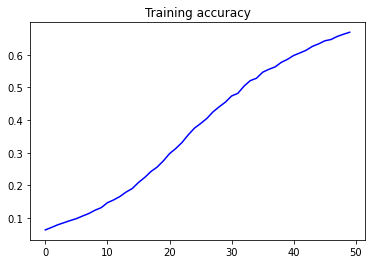
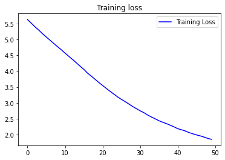

# Creating Poem using Shakespearean Sonnets

This blog is to demonstrate how to use tensorflow to find relationship between words in the article and the categories to which they belong to.

You can use the [.ipnyb notebook](https://github.com/cyriacbijun/Tensorflow_NLP/blob/master/Predicting_Language/Predicting_Language.ipynb) that is given with the repo by downloading and starting a kernel.


*   For local computer, use [jupyter notebook](https://jupyter.org/install)
*   For cloud usage, checkout [Google colab](https://colab.research.google.com/notebooks/intro.ipynb)


First, lets start off by importing the required libraries in python.


```python
from tensorflow.keras.preprocessing.sequence import pad_sequences
from tensorflow.keras.layers import Embedding, LSTM, Dense, Dropout, Bidirectional
from tensorflow.keras.preprocessing.text import Tokenizer
from tensorflow.keras.models import Sequential
from tensorflow.keras.optimizers import Adam
from tensorflow.keras import regularizers
import tensorflow.keras.utils as ku 
import numpy as np 
```


```python
tokenizer = Tokenizer()
!wget --no-check-certificate \
    https://storage.googleapis.com/laurencemoroney-blog.appspot.com/sonnets.txt \
    -O sonnets.txt
data = open('sonnets.txt').read()

corpus = data.lower().split("\n")


tokenizer.fit_on_texts(corpus)
total_words = len(tokenizer.word_index) + 1
```

    --2020-04-21 14:21:44--  https://storage.googleapis.com/laurencemoroney-blog.appspot.com/sonnets.txt
    Resolving storage.googleapis.com (storage.googleapis.com)... 74.125.204.128, 2404:6800:4008:c04::80
    Connecting to storage.googleapis.com (storage.googleapis.com)|74.125.204.128|:443... connected.
    HTTP request sent, awaiting response... 200 OK
    Length: 93578 (91K) [text/plain]
    Saving to: ‘sonnets.txt’
    
    sonnets.txt         100%[===================>]  91.38K  --.-KB/s    in 0.002s  
    
    2020-04-21 14:21:44 (57.9 MB/s) - ‘sonnets.txt’ saved [93578/93578]
    
    

On checking, we see that the total no. of words in this corpus is 3211


```python
print("Total no. of words in corpus " + str(total_words))
print(corpus)
```

    Total no. of words in corpus 3211
    ['from fairest creatures we desire increase,', "that thereby beauty's rose might never die,", 'but as the riper should by time decease,', 'his tender heir might bear his memory:', 'but thou, contracted to thine own bright eyes,', "feed'st thy light'st flame with self-substantial fuel,", 'making a famine where abundance lies,', 'thyself thy foe, to thy sweet self too cruel.', "thou that art now the world's fresh ornament", 'and only herald to the gaudy spring,', 'within thine own bud buriest thy content', 'and, tender churl, makest waste in niggarding.', 'pity the world, or else this glutton be,', "to eat the world's due, by the grave and thee.", 'when forty winters shall beseige thy brow,', "and dig deep trenches in thy beauty's field,", "thy youth's proud livery, so gazed on now,", "will be a tatter'd weed, of small worth held:", "then being ask'd where all thy beauty lies,", 'where all the treasure of thy lusty days,', 'to say, within thine own deep-sunken eyes,', 'were an all-eating shame and thriftless praise.', "how much more praise deserved thy beauty's use,", "if thou couldst answer 'this fair child of mine", "shall sum my count and make my old excuse,'", 'proving his beauty by succession thine!', 'this were to be new made when thou art old,', "and see thy blood warm when thou feel'st it cold.", 'look in thy glass, and tell the face thou viewest', 'now is the time that face should form another;', 'whose fresh repair if now thou not renewest,', 'thou dost beguile the world, unbless some mother.', "for where is she so fair whose unear'd womb", 'disdains the tillage of thy husbandry?', 'or who is he so fond will be the tomb', 'of his self-love, to stop posterity?', "thou art thy mother's glass, and she in thee", 'calls back the lovely april of her prime:', 'so thou through windows of thine age shall see', 'despite of wrinkles this thy golden time.', "but if thou live, remember'd not to be,", 'die single, and thine image dies with thee.', 'unthrifty loveliness, why dost thou spend', "upon thyself thy beauty's legacy?", "nature's bequest gives nothing but doth lend,", 'and being frank she lends to those are free.', 'then, beauteous niggard, why dost thou abuse', 'the bounteous largess given thee to give?', 'profitless usurer, why dost thou use', 'so great a sum of sums, yet canst not live?', 'for having traffic with thyself alone,', 'thou of thyself thy sweet self dost deceive.', 'then how, when nature calls thee to be gone,', 'what acceptable audit canst thou leave?', "thy unused beauty must be tomb'd with thee,", "which, used, lives th' executor to be.", 'those hours, that with gentle work did frame', 'the lovely gaze where every eye doth dwell,', 'will play the tyrants to the very same', 'and that unfair which fairly doth excel:', 'for never-resting time leads summer on', 'to hideous winter and confounds him there;', "sap check'd with frost and lusty leaves quite gone,", "beauty o'ersnow'd and bareness every where:", "then, were not summer's distillation left,", 'a liquid prisoner pent in walls of glass,', "beauty's effect with beauty were bereft,", 'nor it nor no remembrance what it was:', "but flowers distill'd though they with winter meet,", 'leese but their show; their substance still lives sweet.', "then let not winter's ragged hand deface", "in thee thy summer, ere thou be distill'd:", 'make sweet some vial; treasure thou some place', "with beauty's treasure, ere it be self-kill'd.", 'that use is not forbidden usury,', 'which happies those that pay the willing loan;', "that's for thyself to breed another thee,", 'or ten times happier, be it ten for one;', 'ten times thyself were happier than thou art,', 'if ten of thine ten times refigured thee:', 'then what could death do, if thou shouldst depart,', 'leaving thee living in posterity?', "be not self-will'd, for thou art much too fair", "to be death's conquest and make worms thine heir.", 'lo! in the orient when the gracious light', 'lifts up his burning head, each under eye', 'doth homage to his new-appearing sight,', 'serving with looks his sacred majesty;', "and having climb'd the steep-up heavenly hill,", 'resembling strong youth in his middle age,', 'yet mortal looks adore his beauty still,', 'attending on his golden pilgrimage;', 'but when from highmost pitch, with weary car,', 'like feeble age, he reeleth from the day,', "the eyes, 'fore duteous, now converted are", 'from his low tract and look another way:', 'so thou, thyself out-going in thy noon,', "unlook'd on diest, unless thou get a son.", "music to hear, why hear'st thou music sadly?", 'sweets with sweets war not, joy delights in joy.', 'why lovest thou that which thou receivest not gladly,', 'or else receivest with pleasure thine annoy?', 'if the true concord of well-tuned sounds,', 'by unions married, do offend thine ear,', 'they do but sweetly chide thee, who confounds', 'in singleness the parts that thou shouldst bear.', 'mark how one string, sweet husband to another,', 'strikes each in each by mutual ordering,', 'resembling sire and child and happy mother', 'who all in one, one pleasing note do sing:', 'whose speechless song, being many, seeming one,', "sings this to thee: 'thou single wilt prove none.'", "is it for fear to wet a widow's eye", 'that thou consumest thyself in single life?', 'ah! if thou issueless shalt hap to die.', 'the world will wail thee, like a makeless wife;', 'the world will be thy widow and still weep', 'that thou no form of thee hast left behind,', 'when every private widow well may keep', "by children's eyes her husband's shape in mind.", 'look, what an unthrift in the world doth spend', 'shifts but his place, for still the world enjoys it;', "but beauty's waste hath in the world an end,", 'and kept unused, the user so destroys it.', 'no love toward others in that bosom sits', 'that on himself such murderous shame commits.', "for shame! deny that thou bear'st love to any,", 'who for thyself art so unprovident.', 'grant, if thou wilt, thou art beloved of many,', 'but that thou none lovest is most evident;', "for thou art so possess'd with murderous hate", "that 'gainst thyself thou stick'st not to conspire.", 'seeking that beauteous roof to ruinate', 'which to repair should be thy chief desire.', 'o, change thy thought, that i may change my mind!', 'shall hate be fairer lodged than gentle love?', 'be, as thy presence is, gracious and kind,', 'or to thyself at least kind-hearted prove:', 'make thee another self, for love of me,', 'that beauty still may live in thine or thee.', 'as fast as thou shalt wane, so fast thou growest', 'in one of thine, from that which thou departest;', 'and that fresh blood which youngly thou bestowest', 'thou mayst call thine when thou from youth convertest.', 'herein lives wisdom, beauty and increase:', 'without this, folly, age and cold decay:', 'if all were minded so, the times should cease', 'and threescore year would make the world away.', 'let those whom nature hath not made for store,', 'harsh featureless and rude, barrenly perish:', "look, whom she best endow'd she gave the more;", 'which bounteous gift thou shouldst in bounty cherish:', 'she carved thee for her seal, and meant thereby', 'thou shouldst print more, not let that copy die.', 'when i do count the clock that tells the time,', 'and see the brave day sunk in hideous night;', 'when i behold the violet past prime,', "and sable curls all silver'd o'er with white;", 'when lofty trees i see barren of leaves', 'which erst from heat did canopy the herd,', "and summer's green all girded up in sheaves", 'borne on the bier with white and bristly beard,', 'then of thy beauty do i question make,', 'that thou among the wastes of time must go,', 'since sweets and beauties do themselves forsake', 'and die as fast as they see others grow;', "and nothing 'gainst time's scythe can make defence", 'save breed, to brave him when he takes thee hence.', 'o, that you were yourself! but, love, you are', 'no longer yours than you yourself here live:', 'against this coming end you should prepare,', 'and your sweet semblance to some other give.', 'so should that beauty which you hold in lease', 'find no determination: then you were', "yourself again after yourself's decease,", 'when your sweet issue your sweet form should bear.', 'who lets so fair a house fall to decay,', 'which husbandry in honour might uphold', "against the stormy gusts of winter's day", "and barren rage of death's eternal cold?", 'o, none but unthrifts! dear my love, you know', 'you had a father: let your son say so.', 'not from the stars do i my judgment pluck;', 'and yet methinks i have astronomy,', 'but not to tell of good or evil luck,', "of plagues, of dearths, or seasons' quality;", 'nor can i fortune to brief minutes tell,', 'pointing to each his thunder, rain and wind,', 'or say with princes if it shall go well,', 'by oft predict that i in heaven find:', 'but from thine eyes my knowledge i derive,', 'and, constant stars, in them i read such art', 'as truth and beauty shall together thrive,', 'if from thyself to store thou wouldst convert;', 'or else of thee this i prognosticate:', "thy end is truth's and beauty's doom and date.", 'when i consider every thing that grows', 'holds in perfection but a little moment,', 'that this huge stage presenteth nought but shows', 'whereon the stars in secret influence comment;', 'when i perceive that men as plants increase,', "cheered and check'd even by the self-same sky,", 'vaunt in their youthful sap, at height decrease,', 'and wear their brave state out of memory;', 'then the conceit of this inconstant stay', 'sets you most rich in youth before my sight,', 'where wasteful time debateth with decay,', 'to change your day of youth to sullied night;', 'and all in war with time for love of you,', 'as he takes from you, i engraft you new.', 'but wherefore do not you a mightier way', 'make war upon this bloody tyrant, time?', 'and fortify yourself in your decay', 'with means more blessed than my barren rhyme?', 'now stand you on the top of happy hours,', 'and many maiden gardens yet unset', 'with virtuous wish would bear your living flowers,', 'much liker than your painted counterfeit:', 'so should the lines of life that life repair,', "which this, time's pencil, or my pupil pen,", 'neither in inward worth nor outward fair,', 'can make you live yourself in eyes of men.', 'to give away yourself keeps yourself still,', 'and you must live, drawn by your own sweet skill.', 'who will believe my verse in time to come,', "if it were fill'd with your most high deserts?", 'though yet, heaven knows, it is but as a tomb', 'which hides your life and shows not half your parts.', 'if i could write the beauty of your eyes', 'and in fresh numbers number all your graces,', "the age to come would say 'this poet lies:", "such heavenly touches ne'er touch'd earthly faces.'", "so should my papers yellow'd with their age", "be scorn'd like old men of less truth than tongue,", "and your true rights be term'd a poet's rage", 'and stretched metre of an antique song:', 'but were some child of yours alive that time,', 'you should live twice; in it and in my rhyme.', '', 'xviii.', '', "shall i compare thee to a summer's day?", 'thou art more lovely and more temperate:', 'rough winds do shake the darling buds of may,', "and summer's lease hath all too short a date:", 'sometime too hot the eye of heaven shines,', "and often is his gold complexion dimm'd;", 'and every fair from fair sometime declines,', "by chance or nature's changing course untrimm'd;", 'but thy eternal summer shall not fade', 'nor lose possession of that fair thou owest;', "nor shall death brag thou wander'st in his shade,", 'when in eternal lines to time thou growest:', 'so long as men can breathe or eyes can see,', 'so long lives this and this gives life to thee.', "devouring time, blunt thou the lion's paws,", 'and make the earth devour her own sweet brood;', "pluck the keen teeth from the fierce tiger's jaws,", 'and burn the long-lived phoenix in her blood;', 'make glad and sorry seasons as thou fleets,', "and do whate'er thou wilt, swift-footed time,", 'to the wide world and all her fading sweets;', 'but i forbid thee one most heinous crime:', "o, carve not with thy hours my love's fair brow,", 'nor draw no lines there with thine antique pen;', 'him in thy course untainted do allow', "for beauty's pattern to succeeding men.", 'yet, do thy worst, old time: despite thy wrong,', 'my love shall in my verse ever live young.', "a woman's face with nature's own hand painted", 'hast thou, the master-mistress of my passion;', "a woman's gentle heart, but not acquainted", "with shifting change, as is false women's fashion;", 'an eye more bright than theirs, less false in rolling,', 'gilding the object whereupon it gazeth;', "a man in hue, all 'hues' in his controlling,", "much steals men's eyes and women's souls amazeth.", 'and for a woman wert thou first created;', 'till nature, as she wrought thee, fell a-doting,', 'and by addition me of thee defeated,', 'by adding one thing to my purpose nothing.', "but since she prick'd thee out for women's pleasure,", "mine be thy love and thy love's use their treasure.", 'so is it not with me as with that muse', "stirr'd by a painted beauty to his verse,", 'who heaven itself for ornament doth use', 'and every fair with his fair doth rehearse', 'making a couplement of proud compare,', "with sun and moon, with earth and sea's rich gems,", "with april's first-born flowers, and all things rare", "that heaven's air in this huge rondure hems.", "o' let me, true in love, but truly write,", 'and then believe me, my love is as fair', "as any mother's child, though not so bright", "as those gold candles fix'd in heaven's air:", 'let them say more than like of hearsay well;', 'i will not praise that purpose not to sell.', 'my glass shall not persuade me i am old,', 'so long as youth and thou are of one date;', "but when in thee time's furrows i behold,", 'then look i death my days should expiate.', 'for all that beauty that doth cover thee', 'is but the seemly raiment of my heart,', 'which in thy breast doth live, as thine in me:', 'how can i then be elder than thou art?', 'o, therefore, love, be of thyself so wary', 'as i, not for myself, but for thee will;', 'bearing thy heart, which i will keep so chary', 'as tender nurse her babe from faring ill.', 'presume not on thy heart when mine is slain;', 'thou gavest me thine, not to give back again.', 'as an unperfect actor on the stage', 'who with his fear is put besides his part,', 'or some fierce thing replete with too much rage,', "whose strength's abundance weakens his own heart.", 'so i, for fear of trust, forget to say', "the perfect ceremony of love's rite,", "and in mine own love's strength seem to decay,", "o'ercharged with burden of mine own love's might.", 'o, let my books be then the eloquence', 'and dumb presagers of my speaking breast,', 'who plead for love and look for recompense', "more than that tongue that more hath more express'd.", 'o, learn to read what silent love hath writ:', "to hear with eyes belongs to love's fine wit.", "mine eye hath play'd the painter and hath stell'd", "thy beauty's form in table of my heart;", "my body is the frame wherein 'tis held,", "and perspective it is the painter's art.", 'for through the painter must you see his skill,', 'to find where your true image pictured lies;', "which in my bosom's shop is hanging still,", 'that hath his windows glazed with thine eyes.', 'now see what good turns eyes for eyes have done:', 'mine eyes have drawn thy shape, and thine for me', 'are windows to my breast, where-through the sun', 'delights to peep, to gaze therein on thee;', 'yet eyes this cunning want to grace their art;', 'they draw but what they see, know not the heart.', 'let those who are in favour with their stars', 'of public honour and proud titles boast,', 'whilst i, whom fortune of such triumph bars,', "unlook'd for joy in that i honour most.", "great princes' favourites their fair leaves spread", "but as the marigold at the sun's eye,", 'and in themselves their pride lies buried,', 'for at a frown they in their glory die.', 'the painful warrior famoused for fight,', "after a thousand victories once foil'd,", 'is from the book of honour razed quite,', "and all the rest forgot for which he toil'd:", 'then happy i, that love and am beloved', 'where i may not remove nor be removed.', 'ord of my love, to whom in vassalage', 'thy merit hath my duty strongly knit,', 'to thee i send this written embassage,', 'to witness duty, not to show my wit:', 'duty so great, which wit so poor as mine', 'may make seem bare, in wanting words to show it,', 'but that i hope some good conceit of thine', "in thy soul's thought, all naked, will bestow it;", 'till whatsoever star that guides my moving', 'points on me graciously with fair aspect', "and puts apparel on my tatter'd loving,", 'to show me worthy of thy sweet respect:', 'then may i dare to boast how i do love thee;', 'till then not show my head where thou mayst prove me.', 'weary with toil, i haste me to my bed,', 'the dear repose for limbs with travel tired;', 'but then begins a journey in my head,', "to work my mind, when body's work's expired:", 'for then my thoughts, from far where i abide,', 'intend a zealous pilgrimage to thee,', 'and keep my drooping eyelids open wide,', 'looking on darkness which the blind do see', "save that my soul's imaginary sight", 'presents thy shadow to my sightless view,', 'which, like a jewel hung in ghastly night,', 'makes black night beauteous and her old face new.', 'lo! thus, by day my limbs, by night my mind,', 'for thee and for myself no quiet find.', 'ow can i then return in happy plight,', "that am debarr'd the benefit of rest?", "when day's oppression is not eased by night,", "but day by night, and night by day, oppress'd?", "and each, though enemies to either's reign,", 'do in consent shake hands to torture me;', 'the one by toil, the other to complain', 'how far i toil, still farther off from thee.', 'i tell the day, to please them thou art bright', 'and dost him grace when clouds do blot the heaven:', "so flatter i the swart-complexion'd night,", "when sparkling stars twire not thou gild'st the even.", 'but day doth daily draw my sorrows longer', "and night doth nightly make grief's strengthseem stronger.", "when, in disgrace with fortune and men's eyes,", 'i all alone beweep my outcast state', 'and trouble deaf heaven with my bootless cries', 'and look upon myself and curse my fate,', 'wishing me like to one more rich in hope,', "featured like him, like him with friends possess'd,", "desiring this man's art and that man's scope,", 'with what i most enjoy contented least;', 'yet in these thoughts myself almost despising,', 'haply i think on thee, and then my state,', 'like to the lark at break of day arising', "from sullen earth, sings hymns at heaven's gate;", "for thy sweet love remember'd such wealth brings", 'that then i scorn to change my state with kings.', 'when to the sessions of sweet silent thought', 'i summon up remembrance of things past,', 'i sigh the lack of many a thing i sought,', "and with old woes new wail my dear time's waste:", 'then can i drown an eye, unused to flow,', "for precious friends hid in death's dateless night,", "and weep afresh love's long since cancell'd woe,", "and moan the expense of many a vanish'd sight:", 'then can i grieve at grievances foregone,', "and heavily from woe to woe tell o'er", 'the sad account of fore-bemoaned moan,', 'which i new pay as if not paid before.', 'but if the while i think on thee, dear friend,', 'all losses are restored and sorrows end.', 'thy bosom is endeared with all hearts,', 'which i by lacking have supposed dead,', "and there reigns love and all love's loving parts,", 'and all those friends which i thought buried.', 'how many a holy and obsequious tear', "hath dear religious love stol'n from mine eye", 'as interest of the dead, which now appear', 'but things removed that hidden in thee lie!', 'thou art the grave where buried love doth live,', 'hung with the trophies of my lovers gone,', 'who all their parts of me to thee did give;', 'that due of many now is thine alone:', 'their images i loved i view in thee,', 'and thou, all they, hast all the all of me.', 'if thou survive my well-contented day,', 'when that churl death my bones with dust shall cover,', 'and shalt by fortune once more re-survey', 'these poor rude lines of thy deceased lover,', 'compare them with the bettering of the time,', "and though they be outstripp'd by every pen,", 'reserve them for my love, not for their rhyme,', 'exceeded by the height of happier men.', 'o, then vouchsafe me but this loving thought:', "'had my friend's muse grown with this growing age,", 'a dearer birth than this his love had brought,', 'to march in ranks of better equipage:', 'but since he died and poets better prove,', "theirs for their style i'll read, his for his love.'", 'full many a glorious morning have i seen', 'flatter the mountain-tops with sovereign eye,', 'kissing with golden face the meadows green,', 'gilding pale streams with heavenly alchemy;', 'anon permit the basest clouds to ride', 'with ugly rack on his celestial face,', 'and from the forlorn world his visage hide,', 'stealing unseen to west with this disgrace:', 'even so my sun one early morn did shine', 'with all triumphant splendor on my brow;', 'but out, alack! he was but one hour mine;', "the region cloud hath mask'd him from me now.", 'yet him for this my love no whit disdaineth;', "suns of the world may stain when heaven's sun staineth.", 'why didst thou promise such a beauteous day,', 'and make me travel forth without my cloak,', "to let base clouds o'ertake me in my way,", 'hiding thy bravery in their rotten smoke?', "'tis not enough that through the cloud thou break,", 'to dry the rain on my storm-beaten face,', 'for no man well of such a salve can speak', 'that heals the wound and cures not the disgrace:', 'nor can thy shame give physic to my grief;', 'though thou repent, yet i have still the loss:', "the offender's sorrow lends but weak relief", "to him that bears the strong offence's cross.", 'ah! but those tears are pearl which thy love sheds,', 'and they are rich and ransom all ill deeds.', 'no more be grieved at that which thou hast done:', 'roses have thorns, and silver fountains mud;', 'clouds and eclipses stain both moon and sun,', 'and loathsome canker lives in sweetest bud.', 'all men make faults, and even i in this,', 'authorizing thy trespass with compare,', 'myself corrupting, salving thy amiss,', 'excusing thy sins more than thy sins are;', 'for to thy sensual fault i bring in sense--', 'thy adverse party is thy advocate--', "and 'gainst myself a lawful plea commence:", 'such civil war is in my love and hate', 'that i an accessary needs must be', 'to that sweet thief which sourly robs from me.', 'let me confess that we two must be twain,', 'although our undivided loves are one:', 'so shall those blots that do with me remain', 'without thy help by me be borne alone.', 'in our two loves there is but one respect,', 'though in our lives a separable spite,', "which though it alter not love's sole effect,", "yet doth it steal sweet hours from love's delight.", 'i may not evermore acknowledge thee,', 'lest my bewailed guilt should do thee shame,', 'nor thou with public kindness honour me,', 'unless thou take that honour from thy name:', 'but do not so; i love thee in such sort', 'as, thou being mine, mine is thy good report.', 'as a decrepit father takes delight', 'to see his active child do deeds of youth,', "so i, made lame by fortune's dearest spite,", 'take all my comfort of thy worth and truth.', 'for whether beauty, birth, or wealth, or wit,', 'or any of these all, or all, or more,', 'entitled in thy parts do crowned sit,', 'i make my love engrafted to this store:', 'so then i am not lame, poor, nor despised,', 'whilst that this shadow doth such substance give', 'that i in thy abundance am sufficed', 'and by a part of all thy glory live.', 'look, what is best, that best i wish in thee:', 'this wish i have; then ten times happy me!', 'how can my muse want subject to invent,', "while thou dost breathe, that pour'st into my verse", 'thine own sweet argument, too excellent', 'for every vulgar paper to rehearse?', 'o, give thyself the thanks, if aught in me', 'worthy perusal stand against thy sight;', "for who's so dumb that cannot write to thee,", 'when thou thyself dost give invention light?', 'be thou the tenth muse, ten times more in worth', 'than those old nine which rhymers invocate;', 'and he that calls on thee, let him bring forth', 'eternal numbers to outlive long date.', 'if my slight muse do please these curious days,', 'the pain be mine, but thine shall be the praise.', 'o, how thy worth with manners may i sing,', 'when thou art all the better part of me?', 'what can mine own praise to mine own self bring?', "and what is 't but mine own when i praise thee?", 'even for this let us divided live,', 'and our dear love lose name of single one,', 'that by this separation i may give', 'that due to thee which thou deservest alone.', 'o absence, what a torment wouldst thou prove,', 'were it not thy sour leisure gave sweet leave', 'to entertain the time with thoughts of love,', 'which time and thoughts so sweetly doth deceive,', 'and that thou teachest how to make one twain,', 'by praising him here who doth hence remain!', 'take all my loves, my love, yea, take them all;', 'what hast thou then more than thou hadst before?', 'no love, my love, that thou mayst true love call;', 'all mine was thine before thou hadst this more.', 'then if for my love thou my love receivest,', 'i cannot blame thee for my love thou usest;', 'but yet be blamed, if thou thyself deceivest', 'by wilful taste of what thyself refusest.', 'i do forgive thy robbery, gentle thief,', 'although thou steal thee all my poverty;', 'and yet, love knows, it is a greater grief', "to bear love's wrong than hate's known injury.", 'lascivious grace, in whom all ill well shows,', 'kill me with spites; yet we must not be foes.', 'those petty wrongs that liberty commits,', 'when i am sometime absent from thy heart,', 'thy beauty and thy years full well befits,', 'for still temptation follows where thou art.', 'gentle thou art and therefore to be won,', 'beauteous thou art, therefore to be assailed;', "and when a woman woos, what woman's son", 'will sourly leave her till she have prevailed?', 'ay me! but yet thou mightest my seat forbear,', 'and chide thy beauty and thy straying youth,', 'who lead thee in their riot even there', 'where thou art forced to break a twofold truth,', 'hers by thy beauty tempting her to thee,', 'thine, by thy beauty being false to me.', 'that thou hast her, it is not all my grief,', 'and yet it may be said i loved her dearly;', 'that she hath thee, is of my wailing chief,', 'a loss in love that touches me more nearly.', 'loving offenders, thus i will excuse ye:', 'thou dost love her, because thou knowst i love her;', 'and for my sake even so doth she abuse me,', 'suffering my friend for my sake to approve her.', "if i lose thee, my loss is my love's gain,", 'and losing her, my friend hath found that loss;', 'both find each other, and i lose both twain,', 'and both for my sake lay on me this cross:', "but here's the joy; my friend and i are one;", 'sweet flattery! then she loves but me alone.', 'when most i wink, then do mine eyes best see,', 'for all the day they view things unrespected;', 'but when i sleep, in dreams they look on thee,', 'and darkly bright are bright in dark directed.', 'then thou, whose shadow shadows doth make bright,', "how would thy shadow's form form happy show", 'to the clear day with thy much clearer light,', 'when to unseeing eyes thy shade shines so!', 'how would, i say, mine eyes be blessed made', 'by looking on thee in the living day,', 'when in dead night thy fair imperfect shade', 'through heavy sleep on sightless eyes doth stay!', 'all days are nights to see till i see thee,', 'and nights bright days when dreams do show thee me.', 'if the dull substance of my flesh were thought,', 'injurious distance should not stop my way;', 'for then despite of space i would be brought,', 'from limits far remote where thou dost stay.', 'no matter then although my foot did stand', 'upon the farthest earth removed from thee;', 'for nimble thought can jump both sea and land', 'as soon as think the place where he would be.', 'but ah! thought kills me that i am not thought,', 'to leap large lengths of miles when thou art gone,', 'but that so much of earth and water wrought', "i must attend time's leisure with my moan,", 'receiving nought by elements so slow', "but heavy tears, badges of either's woe.", 'the other two, slight air and purging fire,', 'are both with thee, wherever i abide;', 'the first my thought, the other my desire,', 'these present-absent with swift motion slide.', 'for when these quicker elements are gone', 'in tender embassy of love to thee,', 'my life, being made of four, with two alone', "sinks down to death, oppress'd with melancholy;", "until life's composition be recured", "by those swift messengers return'd from thee,", 'who even but now come back again, assured', 'of thy fair health, recounting it to me:', 'this told, i joy; but then no longer glad,', 'i send them back again and straight grow sad.', 'mine eye and heart are at a mortal war', 'how to divide the conquest of thy sight;', "mine eye my heart thy picture's sight would bar,", 'my heart mine eye the freedom of that right.', 'my heart doth plead that thou in him dost lie--', 'a closet never pierced with crystal eyes--', 'but the defendant doth that plea deny', 'and says in him thy fair appearance lies.', "to 'cide this title is impanneled", 'a quest of thoughts, all tenants to the heart,', 'and by their verdict is determined', "the clear eye's moiety and the dear heart's part:", "as thus; mine eye's due is thy outward part,", "and my heart's right thy inward love of heart.", 'betwixt mine eye and heart a league is took,', 'and each doth good turns now unto the other:', "when that mine eye is famish'd for a look,", 'or heart in love with sighs himself doth smother,', "with my love's picture then my eye doth feast", 'and to the painted banquet bids my heart;', "another time mine eye is my heart's guest", 'and in his thoughts of love doth share a part:', 'so, either by thy picture or my love,', 'thyself away art resent still with me;', 'for thou not farther than my thoughts canst move,', 'and i am still with them and they with thee;', 'or, if they sleep, thy picture in my sight', "awakes my heart to heart's and eye's delight.", 'how careful was i, when i took my way,', 'each trifle under truest bars to thrust,', 'that to my use it might unused stay', 'from hands of falsehood, in sure wards of trust!', 'but thou, to whom my jewels trifles are,', 'most worthy of comfort, now my greatest grief,', 'thou, best of dearest and mine only care,', 'art left the prey of every vulgar thief.', "thee have i not lock'd up in any chest,", 'save where thou art not, though i feel thou art,', 'within the gentle closure of my breast,', 'from whence at pleasure thou mayst come and part;', "and even thence thou wilt be stol'n, i fear,", 'for truth proves thievish for a prize so dear.', 'against that time, if ever that time come,', 'when i shall see thee frown on my defects,', 'when as thy love hath cast his utmost sum,', "call'd to that audit by advised respects;", 'against that time when thou shalt strangely pass', 'and scarcely greet me with that sun thine eye,', 'when love, converted from the thing it was,', 'shall reasons find of settled gravity,--', 'against that time do i ensconce me here', 'within the knowledge of mine own desert,', 'and this my hand against myself uprear,', 'to guard the lawful reasons on thy part:', 'to leave poor me thou hast the strength of laws,', 'since why to love i can allege no cause.', 'how heavy do i journey on the way,', "when what i seek, my weary travel's end,", 'doth teach that ease and that repose to say', "'thus far the miles are measured from thy friend!'", 'the beast that bears me, tired with my woe,', 'plods dully on, to bear that weight in me,', 'as if by some instinct the wretch did know', 'his rider loved not speed, being made from thee:', 'the bloody spur cannot provoke him on', 'that sometimes anger thrusts into his hide;', 'which heavily he answers with a groan,', 'more sharp to me than spurring to his side;', 'for that same groan doth put this in my mind;', 'my grief lies onward and my joy behind.', 'thus can my love excuse the slow offence', 'of my dull bearer when from thee i speed:', 'from where thou art why should i haste me thence?', 'till i return, of posting is no need.', 'o, what excuse will my poor beast then find,', 'when swift extremity can seem but slow?', 'then should i spur, though mounted on the wind;', 'in winged speed no motion shall i know:', 'then can no horse with my desire keep pace;', "therefore desire of perfect'st love being made,", 'shall neigh--no dull flesh--in his fiery race;', 'but love, for love, thus shall excuse my jade;', 'since from thee going he went wilful-slow,', "towards thee i'll run, and give him leave to go.", 'so am i as the rich, whose blessed key', 'can bring him to his sweet up-locked treasure,', 'the which he will not every hour survey,', 'for blunting the fine point of seldom pleasure.', 'therefore are feasts so solemn and so rare,', 'since, seldom coming, in the long year set,', 'like stones of worth they thinly placed are,', 'or captain jewels in the carcanet.', 'so is the time that keeps you as my chest,', 'or as the wardrobe which the robe doth hide,', 'to make some special instant special blest,', "by new unfolding his imprison'd pride.", 'blessed are you, whose worthiness gives scope,', "being had, to triumph, being lack'd, to hope.", 'what is your substance, whereof are you made,', 'that millions of strange shadows on you tend?', 'since every one hath, every one, one shade,', 'and you, but one, can every shadow lend.', 'describe adonis, and the counterfeit', 'is poorly imitated after you;', "on helen's cheek all art of beauty set,", 'and you in grecian tires are painted new:', 'speak of the spring and foison of the year;', 'the one doth shadow of your beauty show,', 'the other as your bounty doth appear;', 'and you in every blessed shape we know.', 'in all external grace you have some part,', 'but you like none, none you, for constant heart.', 'o, how much more doth beauty beauteous seem', 'by that sweet ornament which truth doth give!', 'the rose looks fair, but fairer we it deem', 'for that sweet odour which doth in it live.', 'the canker-blooms have full as deep a dye', 'as the perfumed tincture of the roses,', 'hang on such thorns and play as wantonly', "when summer's breath their masked buds discloses:", 'but, for their virtue only is their show,', "they live unwoo'd and unrespected fade,", 'die to themselves. sweet roses do not so;', 'of their sweet deaths are sweetest odours made:', 'and so of you, beauteous and lovely youth,', 'when that shall fade, my verse distills your truth.', 'not marble, nor the gilded monuments', 'of princes, shall outlive this powerful rhyme;', 'but you shall shine more bright in these contents', "than unswept stone besmear'd with sluttish time.", 'when wasteful war shall statues overturn,', 'and broils root out the work of masonry,', "nor mars his sword nor war's quick fire shall burn", 'the living record of your memory.', "'gainst death and all-oblivious enmity", 'shall you pace forth; your praise shall still find room', 'even in the eyes of all posterity', 'that wear this world out to the ending doom.', 'so, till the judgment that yourself arise,', "you live in this, and dwell in lover's eyes.", 'sweet love, renew thy force; be it not said', 'thy edge should blunter be than appetite,', "which but to-day by feeding is allay'd,", "to-morrow sharpen'd in his former might:", 'so, love, be thou; although to-day thou fill', 'thy hungry eyes even till they wink with fullness,', 'to-morrow see again, and do not kill', 'the spirit of love with a perpetual dullness.', 'let this sad interim like the ocean be', 'which parts the shore, where two contracted new', 'come daily to the banks, that, when they see', 'return of love, more blest may be the view;', 'else call it winter, which being full of care', "makes summer's welcome thrice more wish'd, more rare.", 'being your slave, what should i do but tend', 'upon the hours and times of your desire?', 'i have no precious time at all to spend,', 'nor services to do, till you require.', 'nor dare i chide the world-without-end hour', 'whilst i, my sovereign, watch the clock for you,', 'nor think the bitterness of absence sour', 'when you have bid your servant once adieu;', 'nor dare i question with my jealous thought', 'where you may be, or your affairs suppose,', 'but, like a sad slave, stay and think of nought', 'save, where you are how happy you make those.', 'so true a fool is love that in your will,', 'though you do any thing, he thinks no ill.', 'that god forbid that made me first your slave,', 'i should in thought control your times of pleasure,', 'or at your hand the account of hours to crave,', 'being your vassal, bound to stay your leisure!', 'o, let me suffer, being at your beck,', "the imprison'd absence of your liberty;", 'and patience, tame to sufferance, bide each check,', 'without accusing you of injury.', 'be where you list, your charter is so strong', 'that you yourself may privilege your time', 'to what you will; to you it doth belong', 'yourself to pardon of self-doing crime.', 'i am to wait, though waiting so be hell;', 'not blame your pleasure, be it ill or well.', 'if there be nothing new, but that which is', 'hath been before, how are our brains beguiled,', 'which, labouring for invention, bear amiss', 'the second burden of a former child!', 'o, that record could with a backward look,', 'even of five hundred courses of the sun,', 'show me your image in some antique book,', 'since mind at first in character was done!', 'that i might see what the old world could say', 'to this composed wonder of your frame;', 'whether we are mended, or whether better they,', 'or whether revolution be the same.', 'o, sure i am, the wits of former days', 'to subjects worse have given admiring praise.', 'like as the waves make towards the pebbled shore,', 'so do our minutes hasten to their end;', 'each changing place with that which goes before,', 'in sequent toil all forwards do contend.', 'nativity, once in the main of light,', "crawls to maturity, wherewith being crown'd,", "crooked elipses 'gainst his glory fight,", 'and time that gave doth now his gift confound.', 'time doth transfix the flourish set on youth', "and delves the parallels in beauty's brow,", "feeds on the rarities of nature's truth,", 'and nothing stands but for his scythe to mow:', 'and yet to times in hope my verse shall stand,', 'praising thy worth, despite his cruel hand.', 'is it thy will thy image should keep open', 'my heavy eyelids to the weary night?', 'dost thou desire my slumbers should be broken,', 'while shadows like to thee do mock my sight?', "is it thy spirit that thou send'st from thee", 'so far from home into my deeds to pry,', 'to find out shames and idle hours in me,', 'the scope and tenor of thy jealousy?', 'o, no! thy love, though much, is not so great:', 'it is my love that keeps mine eye awake;', 'mine own true love that doth my rest defeat,', 'to play the watchman ever for thy sake:', 'for thee watch i whilst thou dost wake elsewhere,', 'from me far off, with others all too near.', 'sin of self-love possesseth all mine eye', 'and all my soul and all my every part;', 'and for this sin there is no remedy,', 'it is so grounded inward in my heart.', 'methinks no face so gracious is as mine,', 'no shape so true, no truth of such account;', 'and for myself mine own worth do define,', 'as i all other in all worths surmount.', 'but when my glass shows me myself indeed,', "beated and chopp'd with tann'd antiquity,", 'mine own self-love quite contrary i read;', 'self so self-loving were iniquity.', "'tis thee, myself, that for myself i praise,", 'painting my age with beauty of thy days.', 'against my love shall be, as i am now,', "with time's injurious hand crush'd and o'er-worn;", "when hours have drain'd his blood and fill'd his brow", 'with lines and wrinkles; when his youthful morn', "hath travell'd on to age's steepy night,", "and all those beauties whereof now he's king", "are vanishing or vanish'd out of sight,", 'stealing away the treasure of his spring;', 'for such a time do i now fortify', "against confounding age's cruel knife,", 'that he shall never cut from memory', "my sweet love's beauty, though my lover's life:", 'his beauty shall in these black lines be seen,', 'and they shall live, and he in them still green.', "when i have seen by time's fell hand defaced", 'the rich proud cost of outworn buried age;', 'when sometime lofty towers i see down-razed', 'and brass eternal slave to mortal rage;', 'when i have seen the hungry ocean gain', 'advantage on the kingdom of the shore,', 'and the firm soil win of the watery main,', 'increasing store with loss and loss with store;', 'when i have seen such interchange of state,', 'or state itself confounded to decay;', 'ruin hath taught me thus to ruminate,', 'that time will come and take my love away.', 'this thought is as a death, which cannot choose', 'but weep to have that which it fears to lose.', 'since brass, nor stone, nor earth, nor boundless sea,', "but sad mortality o'er-sways their power,", 'how with this rage shall beauty hold a plea,', 'whose action is no stronger than a flower?', "o, how shall summer's honey breath hold out", 'against the wreckful siege of battering days,', 'when rocks impregnable are not so stout,', 'nor gates of steel so strong, but time decays?', 'o fearful meditation! where, alack,', "shall time's best jewel from time's chest lie hid?", 'or what strong hand can hold his swift foot back?', 'or who his spoil of beauty can forbid?', 'o, none, unless this miracle have might,', 'that in black ink my love may still shine bright.', 'tired with all these, for restful death i cry,', 'as, to behold desert a beggar born,', "and needy nothing trimm'd in jollity,", 'and purest faith unhappily forsworn,', 'and guilded honour shamefully misplaced,', 'and maiden virtue rudely strumpeted,', 'and right perfection wrongfully disgraced,', 'and strength by limping sway disabled,', 'and art made tongue-tied by authority,', 'and folly doctor-like controlling skill,', "and simple truth miscall'd simplicity,", 'and captive good attending captain ill:', 'tired with all these, from these would i be gone,', 'save that, to die, i leave my love alone.', 'ah! wherefore with infection should he live,', 'and with his presence grace impiety,', 'that sin by him advantage should achieve', 'and lace itself with his society?', 'why should false painting imitate his cheek', 'and steal dead seeing of his living hue?', 'why should poor beauty indirectly seek', 'roses of shadow, since his rose is true?', 'why should he live, now nature bankrupt is,', "beggar'd of blood to blush through lively veins?", 'for she hath no excheckr now but his,', 'and, proud of many, lives upon his gains.', 'o, him she stores, to show what wealth she had', 'in days long since, before these last so bad.', 'thus is his cheek the map of days outworn,', 'when beauty lived and died as flowers do now,', 'before the bastard signs of fair were born,', 'or durst inhabit on a living brow;', 'before the golden tresses of the dead,', 'the right of sepulchres, were shorn away,', 'to live a second life on second head;', "ere beauty's dead fleece made another gay:", 'in him those holy antique hours are seen,', 'without all ornament, itself and true,', "making no summer of another's green,", 'robbing no old to dress his beauty new;', 'and him as for a map doth nature store,', 'to show false art what beauty was of yore.', "those parts of thee that the world's eye doth view", 'want nothing that the thought of hearts can mend;', 'all tongues, the voice of souls, give thee that due,', 'uttering bare truth, even so as foes commend.', "thy outward thus with outward praise is crown'd;", 'but those same tongues that give thee so thine own', 'in other accents do this praise confound', 'by seeing farther than the eye hath shown.', 'they look into the beauty of thy mind,', 'and that, in guess, they measure by thy deeds;', 'then, churls, their thoughts, although their eyes were kind,', 'to thy fair flower add the rank smell of weeds:', 'but why thy odour matcheth not thy show,', 'the solve is this, that thou dost common grow.', 'that thou art blamed shall not be thy defect,', "for slander's mark was ever yet the fair;", 'the ornament of beauty is suspect,', "a crow that flies in heaven's sweetest air.", 'so thou be good, slander doth but approve', "thy worth the greater, being woo'd of time;", 'for canker vice the sweetest buds doth love,', "and thou present'st a pure unstained prime.", "thou hast pass'd by the ambush of young days,", "either not assail'd or victor being charged;", 'yet this thy praise cannot be so thy praise,', 'to tie up envy evermore enlarged:', "if some suspect of ill mask'd not thy show,", 'then thou alone kingdoms of hearts shouldst owe.', 'no longer mourn for me when i am dead', 'then you shall hear the surly sullen bell', 'give warning to the world that i am fled', 'from this vile world, with vilest worms to dwell:', 'nay, if you read this line, remember not', 'the hand that writ it; for i love you so', 'that i in your sweet thoughts would be forgot', 'if thinking on me then should make you woe.', 'o, if, i say, you look upon this verse', 'when i perhaps compounded am with clay,', 'do not so much as my poor name rehearse.', 'but let your love even with my life decay,', 'lest the wise world should look into your moan', 'and mock you with me after i am gone.', 'o, lest the world should task you to recite', 'what merit lived in me, that you should love', 'after my death, dear love, forget me quite,', 'for you in me can nothing worthy prove;', 'unless you would devise some virtuous lie,', 'to do more for me than mine own desert,', 'and hang more praise upon deceased i', 'than niggard truth would willingly impart:', 'o, lest your true love may seem false in this,', 'that you for love speak well of me untrue,', 'my name be buried where my body is,', 'and live no more to shame nor me nor you.', 'for i am shamed by that which i bring forth,', 'and so should you, to love things nothing worth.', 'that time of year thou mayst in me behold', 'when yellow leaves, or none, or few, do hang', 'upon those boughs which shake against the cold,', "bare ruin'd choirs, where late the sweet birds sang.", 'in me thou seest the twilight of such day', 'as after sunset fadeth in the west,', 'which by and by black night doth take away,', "death's second self, that seals up all in rest.", "in me thou see'st the glowing of such fire", 'that on the ashes of his youth doth lie,', 'as the death-bed whereon it must expire', "consumed with that which it was nourish'd by.", 'this thou perceivest, which makes thy love more strong,', 'to love that well which thou must leave ere long.', 'but be contented: when that fell arrest', 'without all bail shall carry me away,', 'my life hath in this line some interest,', 'which for memorial still with thee shall stay.', 'when thou reviewest this, thou dost review', 'the very part was consecrate to thee:', 'the earth can have but earth, which is his due;', 'my spirit is thine, the better part of me:', 'so then thou hast but lost the dregs of life,', 'the prey of worms, my body being dead,', "the coward conquest of a wretch's knife,", 'too base of thee to be remembered.', 'the worth of that is that which it contains,', 'and that is this, and this with thee remains.', 'so are you to my thoughts as food to life,', "or as sweet-season'd showers are to the ground;", 'and for the peace of you i hold such strife', "as 'twixt a miser and his wealth is found;", 'now proud as an enjoyer and anon', 'doubting the filching age will steal his treasure,', 'now counting best to be with you alone,', "then better'd that the world may see my pleasure;", 'sometime all full with feasting on your sight', 'and by and by clean starved for a look;', 'possessing or pursuing no delight,', 'save what is had or must from you be took.', 'thus do i pine and surfeit day by day,', 'or gluttoning on all, or all away.', 'why is my verse so barren of new pride,', 'so far from variation or quick change?', 'why with the time do i not glance aside', 'to new-found methods and to compounds strange?', 'why write i still all one, ever the same,', 'and keep invention in a noted weed,', 'that every word doth almost tell my name,', 'showing their birth and where they did proceed?', 'o, know, sweet love, i always write of you,', 'and you and love are still my argument;', 'so all my best is dressing old words new,', 'spending again what is already spent:', 'for as the sun is daily new and old,', 'so is my love still telling what is told.', 'thy glass will show thee how thy beauties wear,', 'thy dial how thy precious minutes waste;', "the vacant leaves thy mind's imprint will bear,", 'and of this book this learning mayst thou taste.', 'the wrinkles which thy glass will truly show', 'of mouthed graves will give thee memory;', "thou by thy dial's shady stealth mayst know", "time's thievish progress to eternity.", 'look, what thy memory can not contain', 'commit to these waste blanks, and thou shalt find', "those children nursed, deliver'd from thy brain,", 'to take a new acquaintance of thy mind.', 'these offices, so oft as thou wilt look,', 'shall profit thee and much enrich thy book.', 'so oft have i invoked thee for my muse', 'and found such fair assistance in my verse', 'as every alien pen hath got my use', 'and under thee their poesy disperse.', 'thine eyes that taught the dumb on high to sing', 'and heavy ignorance aloft to fly', "have added feathers to the learned's wing", 'and given grace a double majesty.', 'yet be most proud of that which i compile,', 'whose influence is thine and born of thee:', "in others' works thou dost but mend the style,", 'and arts with thy sweet graces graced be;', 'but thou art all my art and dost advance', 'as high as learning my rude ignorance.', 'whilst i alone did call upon thy aid,', 'my verse alone had all thy gentle grace,', "but now my gracious numbers are decay'd", 'and my sick muse doth give another place.', 'i grant, sweet love, thy lovely argument', 'deserves the travail of a worthier pen,', 'yet what of thee thy poet doth invent', 'he robs thee of and pays it thee again.', 'he lends thee virtue and he stole that word', 'from thy behavior; beauty doth he give', 'and found it in thy cheek; he can afford', 'no praise to thee but what in thee doth live.', 'then thank him not for that which he doth say,', 'since what he owes thee thou thyself dost pay.', 'o, how i faint when i of you do write,', 'knowing a better spirit doth use your name,', 'and in the praise thereof spends all his might,', 'to make me tongue-tied, speaking of your fame!', 'but since your worth, wide as the ocean is,', 'the humble as the proudest sail doth bear,', 'my saucy bark inferior far to his', 'on your broad main doth wilfully appear.', 'your shallowest help will hold me up afloat,', 'whilst he upon your soundless deep doth ride;', "or being wreck'd, i am a worthless boat,", 'he of tall building and of goodly pride:', 'then if he thrive and i be cast away,', 'the worst was this; my love was my decay.', 'or i shall live your epitaph to make,', 'or you survive when i in earth am rotten;', 'from hence your memory death cannot take,', 'although in me each part will be forgotten.', 'your name from hence immortal life shall have,', 'though i, once gone, to all the world must die:', 'the earth can yield me but a common grave,', "when you entombed in men's eyes shall lie.", 'your monument shall be my gentle verse,', "which eyes not yet created shall o'er-read,", 'and tongues to be your being shall rehearse', 'when all the breathers of this world are dead;', 'you still shall live--such virtue hath my pen--', 'where breath most breathes, even in the mouths of men.', 'i grant thou wert not married to my muse', "and therefore mayst without attaint o'erlook", 'the dedicated words which writers use', 'of their fair subject, blessing every book', 'thou art as fair in knowledge as in hue,', 'finding thy worth a limit past my praise,', 'and therefore art enforced to seek anew', 'some fresher stamp of the time-bettering days', 'and do so, love; yet when they have devised', 'what strained touches rhetoric can lend,', 'thou truly fair wert truly sympathized', 'in true plain words by thy true-telling friend;', 'and their gross painting might be better used', 'where cheeks need blood; in thee it is abused.', 'i never saw that you did painting need', 'and therefore to your fair no painting set;', 'i found, or thought i found, you did exceed', "the barren tender of a poet's debt;", 'and therefore have i slept in your report,', 'that you yourself being extant well might show', 'how far a modern quill doth come too short,', 'speaking of worth, what worth in you doth grow.', 'this silence for my sin you did impute,', 'which shall be most my glory, being dumb;', 'for i impair not beauty being mute,', 'when others would give life and bring a tomb.', 'there lives more life in one of your fair eyes', 'than both your poets can in praise devise.', 'who is it that says most? which can say more', 'than this rich praise, that you alone are you?', 'in whose confine immured is the store', 'which should example where your equal grew.', 'lean penury within that pen doth dwell', 'that to his subject lends not some small glory;', 'but he that writes of you, if he can tell', 'that you are you, so dignifies his story,', 'let him but copy what in you is writ,', 'not making worse what nature made so clear,', 'and such a counterpart shall fame his wit,', 'making his style admired every where.', 'you to your beauteous blessings add a curse,', 'being fond on praise, which makes your praises worse.', 'my tongue-tied muse in manners holds her still,', 'while comments of your praise, richly compiled,', 'reserve their character with golden quill', 'and precious phrase by all the muses filed.', 'i think good thoughts whilst other write good words,', "and like unletter'd clerk still cry 'amen'", 'to every hymn that able spirit affords', "in polish'd form of well-refined pen.", "hearing you praised, i say ''tis so, 'tis true,'", 'and to the most of praise add something more;', 'but that is in my thought, whose love to you,', 'though words come hindmost, holds his rank before.', 'then others for the breath of words respect,', 'me for my dumb thoughts, speaking in effect.', 'was it the proud full sail of his great verse,', 'bound for the prize of all too precious you,', 'that did my ripe thoughts in my brain inhearse,', 'making their tomb the womb wherein they grew?', 'was it his spirit, by spirits taught to write', 'above a mortal pitch, that struck me dead?', 'no, neither he, nor his compeers by night', 'giving him aid, my verse astonished.', 'he, nor that affable familiar ghost', 'which nightly gulls him with intelligence', 'as victors of my silence cannot boast;', 'i was not sick of any fear from thence:', "but when your countenance fill'd up his line,", "then lack'd i matter; that enfeebled mine.", 'farewell! thou art too dear for my possessing,', "and like enough thou know'st thy estimate:", 'the charter of thy worth gives thee releasing;', 'my bonds in thee are all determinate.', 'for how do i hold thee but by thy granting?', 'and for that riches where is my deserving?', 'the cause of this fair gift in me is wanting,', 'and so my patent back again is swerving.', 'thyself thou gavest, thy own worth then not knowing,', 'or me, to whom thou gavest it, else mistaking;', 'so thy great gift, upon misprision growing,', 'comes home again, on better judgment making.', 'thus have i had thee, as a dream doth flatter,', 'in sleep a king, but waking no such matter.', 'when thou shalt be disposed to set me light,', 'and place my merit in the eye of scorn,', "upon thy side against myself i'll fight,", 'and prove thee virtuous, though thou art forsworn.', 'with mine own weakness being best acquainted,', 'upon thy part i can set down a story', "of faults conceal'd, wherein i am attainted,", 'that thou in losing me shalt win much glory:', 'and i by this will be a gainer too;', 'for bending all my loving thoughts on thee,', 'the injuries that to myself i do,', 'doing thee vantage, double-vantage me.', 'such is my love, to thee i so belong,', 'that for thy right myself will bear all wrong.', 'say that thou didst forsake me for some fault,', 'and i will comment upon that offence;', 'speak of my lameness, and i straight will halt,', 'against thy reasons making no defence.', 'thou canst not, love, disgrace me half so ill,', 'to set a form upon desired change,', "as i'll myself disgrace: knowing thy will,", 'i will acquaintance strangle and look strange,', 'be absent from thy walks, and in my tongue', 'thy sweet beloved name no more shall dwell,', 'lest i, too much profane, should do it wrong', 'and haply of our old acquaintance tell.', "for thee against myself i'll vow debate,", "for i must ne'er love him whom thou dost hate.", 'then hate me when thou wilt; if ever, now;', 'now, while the world is bent my deeds to cross,', 'join with the spite of fortune, make me bow,', 'and do not drop in for an after-loss:', "ah, do not, when my heart hath 'scoped this sorrow,", "come in the rearward of a conquer'd woe;", 'give not a windy night a rainy morrow,', 'to linger out a purposed overthrow.', 'if thou wilt leave me, do not leave me last,', 'when other petty griefs have done their spite', 'but in the onset come; so shall i taste', "at first the very worst of fortune's might,", 'and other strains of woe, which now seem woe,', 'compared with loss of thee will not seem so.', 'some glory in their birth, some in their skill,', "some in their wealth, some in their bodies' force,", 'some in their garments, though new-fangled ill,', 'some in their hawks and hounds, some in their horse;', 'and every humour hath his adjunct pleasure,', 'wherein it finds a joy above the rest:', 'but these particulars are not my measure;', 'all these i better in one general best.', 'thy love is better than high birth to me,', "richer than wealth, prouder than garments' cost,", 'of more delight than hawks or horses be;', "and having thee, of all men's pride i boast:", 'wretched in this alone, that thou mayst take', 'all this away and me most wretched make.', 'but do thy worst to steal thyself away,', 'for term of life thou art assured mine,', 'and life no longer than thy love will stay,', 'for it depends upon that love of thine.', 'then need i not to fear the worst of wrongs,', 'when in the least of them my life hath end.', 'i see a better state to me belongs', 'than that which on thy humour doth depend;', 'thou canst not vex me with inconstant mind,', 'since that my life on thy revolt doth lie.', 'o, what a happy title do i find,', 'happy to have thy love, happy to die!', "but what's so blessed-fair that fears no blot?", 'thou mayst be false, and yet i know it not.', 'so shall i live, supposing thou art true,', "like a deceived husband; so love's face", "may still seem love to me, though alter'd new;", 'thy looks with me, thy heart in other place:', 'for there can live no hatred in thine eye,', 'therefore in that i cannot know thy change.', "in many's looks the false heart's history", 'is writ in moods and frowns and wrinkles strange,', 'but heaven in thy creation did decree', 'that in thy face sweet love should ever dwell;', "whate'er thy thoughts or thy heart's workings be,", 'thy looks should nothing thence but sweetness tell.', "how like eve's apple doth thy beauty grow,", 'if thy sweet virtue answer not thy show!', 'they that have power to hurt and will do none,', 'that do not do the thing they most do show,', 'who, moving others, are themselves as stone,', 'unmoved, cold, and to temptation slow,', "they rightly do inherit heaven's graces", "and husband nature's riches from expense;", 'they are the lords and owners of their faces,', 'others but stewards of their excellence.', "the summer's flower is to the summer sweet,", 'though to itself it only live and die,', 'but if that flower with base infection meet,', 'the basest weed outbraves his dignity:', 'for sweetest things turn sourest by their deeds;', 'lilies that fester smell far worse than weeds.', 'how sweet and lovely dost thou make the shame', 'which, like a canker in the fragrant rose,', 'doth spot the beauty of thy budding name!', 'o, in what sweets dost thou thy sins enclose!', 'that tongue that tells the story of thy days,', 'making lascivious comments on thy sport,', 'cannot dispraise but in a kind of praise;', 'naming thy name blesses an ill report.', 'o, what a mansion have those vices got', 'which for their habitation chose out thee,', "where beauty's veil doth cover every blot,", 'and all things turn to fair that eyes can see!', 'take heed, dear heart, of this large privilege;', 'the hardest knife ill-used doth lose his edge.', 'some say thy fault is youth, some wantonness;', 'some say thy grace is youth and gentle sport;', 'both grace and faults are loved of more and less;', 'thou makest faults graces that to thee resort.', 'as on the finger of a throned queen', "the basest jewel will be well esteem'd,", 'so are those errors that in thee are seen', "to truths translated and for true things deem'd.", 'how many lambs might the stern wolf betray,', 'if like a lamb he could his looks translate!', 'how many gazers mightst thou lead away,', 'if thou wouldst use the strength of all thy state!', 'but do not so; i love thee in such sort', 'as, thou being mine, mine is thy good report.', 'how like a winter hath my absence been', 'from thee, the pleasure of the fleeting year!', 'what freezings have i felt, what dark days seen!', "what old december's bareness every where!", "and yet this time removed was summer's time,", 'the teeming autumn, big with rich increase,', 'bearing the wanton burden of the prime,', "like widow'd wombs after their lords' decease:", "yet this abundant issue seem'd to me", "but hope of orphans and unfather'd fruit;", 'for summer and his pleasures wait on thee,', 'and, thou away, the very birds are mute;', "or, if they sing, 'tis with so dull a cheer", "that leaves look pale, dreading the winter's near.", 'from you have i been absent in the spring,', "when proud-pied april dress'd in all his trim", 'hath put a spirit of youth in every thing,', "that heavy saturn laugh'd and leap'd with him.", 'yet nor the lays of birds nor the sweet smell', 'of different flowers in odour and in hue', "could make me any summer's story tell,", 'or from their proud lap pluck them where they grew;', "nor did i wonder at the lily's white,", 'nor praise the deep vermilion in the rose;', 'they were but sweet, but figures of delight,', 'drawn after you, you pattern of all those.', "yet seem'd it winter still, and, you away,", 'as with your shadow i with these did play:', 'the forward violet thus did i chide:', 'sweet thief, whence didst thou steal thy sweet that smells,', "if not from my love's breath? the purple pride", 'which on thy soft cheek for complexion dwells', "in my love's veins thou hast too grossly dyed.", 'the lily i condemned for thy hand,', "and buds of marjoram had stol'n thy hair:", 'the roses fearfully on thorns did stand,', 'one blushing shame, another white despair;', "a third, nor red nor white, had stol'n of both", "and to his robbery had annex'd thy breath;", 'but, for his theft, in pride of all his growth', 'a vengeful canker eat him up to death.', 'more flowers i noted, yet i none could see', "but sweet or colour it had stol'n from thee.", "where art thou, muse, that thou forget'st so long", 'to speak of that which gives thee all thy might?', "spend'st thou thy fury on some worthless song,", 'darkening thy power to lend base subjects light?', 'return, forgetful muse, and straight redeem', 'in gentle numbers time so idly spent;', 'sing to the ear that doth thy lays esteem', 'and gives thy pen both skill and argument.', "rise, resty muse, my love's sweet face survey,", 'if time have any wrinkle graven there;', 'if any, be a satire to decay,', "and make time's spoils despised every where.", 'give my love fame faster than time wastes life;', "so thou prevent'st his scythe and crooked knife.", 'o truant muse, what shall be thy amends', 'for thy neglect of truth in beauty dyed?', 'both truth and beauty on my love depends;', 'so dost thou too, and therein dignified.', 'make answer, muse: wilt thou not haply say', "'truth needs no colour, with his colour fix'd;", "beauty no pencil, beauty's truth to lay;", "but best is best, if never intermix'd?'", 'because he needs no praise, wilt thou be dumb?', "excuse not silence so; for't lies in thee", 'to make him much outlive a gilded tomb,', 'and to be praised of ages yet to be.', 'then do thy office, muse; i teach thee how', 'to make him seem long hence as he shows now.', "my love is strengthen'd, though more weak in seeming;", 'i love not less, though less the show appear:', 'that love is merchandized whose rich esteeming', "the owner's tongue doth publish every where.", 'our love was new and then but in the spring', 'when i was wont to greet it with my lays,', "as philomel in summer's front doth sing", 'and stops her pipe in growth of riper days:', 'not that the summer is less pleasant now', 'than when her mournful hymns did hush the night,', 'but that wild music burthens every bough', 'and sweets grown common lose their dear delight.', 'therefore like her i sometime hold my tongue,', 'because i would not dull you with my song.', 'alack, what poverty my muse brings forth,', 'that having such a scope to show her pride,', 'the argument all bare is of more worth', 'than when it hath my added praise beside!', 'o, blame me not, if i no more can write!', 'look in your glass, and there appears a face', 'that over-goes my blunt invention quite,', 'dulling my lines and doing me disgrace.', 'were it not sinful then, striving to mend,', 'to mar the subject that before was well?', 'for to no other pass my verses tend', 'than of your graces and your gifts to tell;', 'and more, much more, than in my verse can sit', 'your own glass shows you when you look in it.', 'to me, fair friend, you never can be old,', 'for as you were when first your eye i eyed,', 'such seems your beauty still. three winters cold', "have from the forests shook three summers' pride,", "three beauteous springs to yellow autumn turn'd", 'in process of the seasons have i seen,', "three april perfumes in three hot junes burn'd,", 'since first i saw you fresh, which yet are green.', 'ah! yet doth beauty, like a dial-hand,', 'steal from his figure and no pace perceived;', 'so your sweet hue, which methinks still doth stand,', 'hath motion and mine eye may be deceived:', 'for fear of which, hear this, thou age unbred;', "ere you were born was beauty's summer dead.", "let not my love be call'd idolatry,", 'nor my beloved as an idol show,', 'since all alike my songs and praises be', 'to one, of one, still such, and ever so.', 'kind is my love to-day, to-morrow kind,', 'still constant in a wondrous excellence;', 'therefore my verse to constancy confined,', 'one thing expressing, leaves out difference.', "'fair, kind and true' is all my argument,", "'fair, kind, and true' varying to other words;", 'and in this change is my invention spent,', 'three themes in one, which wondrous scope affords.', "'fair, kind, and true,' have often lived alone,", 'which three till now never kept seat in one.', 'when in the chronicle of wasted time', 'i see descriptions of the fairest wights,', 'and beauty making beautiful old rhyme', 'in praise of ladies dead and lovely knights,', "then, in the blazon of sweet beauty's best,", 'of hand, of foot, of lip, of eye, of brow,', "i see their antique pen would have express'd", 'even such a beauty as you master now.', 'so all their praises are but prophecies', 'of this our time, all you prefiguring;', "and, for they look'd but with divining eyes,", 'they had not skill enough your worth to sing:', 'for we, which now behold these present days,', 'had eyes to wonder, but lack tongues to praise.', 'not mine own fears, nor the prophetic soul', 'of the wide world dreaming on things to come,', 'can yet the lease of my true love control,', 'supposed as forfeit to a confined doom.', 'the mortal moon hath her eclipse endured', 'and the sad augurs mock their own presage;', 'incertainties now crown themselves assured', 'and peace proclaims olives of endless age.', 'now with the drops of this most balmy time', 'my love looks fresh, and death to me subscribes,', "since, spite of him, i'll live in this poor rhyme,", "while he insults o'er dull and speechless tribes:", 'and thou in this shalt find thy monument,', "when tyrants' crests and tombs of brass are spent.", "what's in the brain that ink may character", 'which hath not figured to thee my true spirit?', "what's new to speak, what new to register,", 'that may express my love or thy dear merit?', 'nothing, sweet boy; but yet, like prayers divine,', "i must, each day say o'er the very same,", 'counting no old thing old, thou mine, i thine,', "even as when first i hallow'd thy fair name.", "so that eternal love in love's fresh case", 'weighs not the dust and injury of age,', 'nor gives to necessary wrinkles place,', 'but makes antiquity for aye his page,', 'finding the first conceit of love there bred', 'where time and outward form would show it dead.', 'o, never say that i was false of heart,', "though absence seem'd my flame to qualify.", 'as easy might i from myself depart', 'as from my soul, which in thy breast doth lie:', 'that is my home of love: if i have ranged,', 'like him that travels i return again,', 'just to the time, not with the time exchanged,', 'so that myself bring water for my stain.', "never believe, though in my nature reign'd", 'all frailties that besiege all kinds of blood,', "that it could so preposterously be stain'd,", 'to leave for nothing all thy sum of good;', 'for nothing this wide universe i call,', 'save thou, my rose; in it thou art my all.', "alas, 'tis true i have gone here and there", 'and made myself a motley to the view,', 'gored mine own thoughts, sold cheap what is most dear,', 'made old offences of affections new;', "most true it is that i have look'd on truth", 'askance and strangely: but, by all above,', 'these blenches gave my heart another youth,', 'and worse essays proved thee my best of love.', 'now all is done, have what shall have no end:', 'mine appetite i never more will grind', 'on newer proof, to try an older friend,', 'a god in love, to whom i am confined.', 'then give me welcome, next my heaven the best,', 'even to thy pure and most most loving breast.', 'o, for my sake do you with fortune chide,', 'the guilty goddess of my harmful deeds,', 'that did not better for my life provide', 'than public means which public manners breeds.', 'thence comes it that my name receives a brand,', 'and almost thence my nature is subdued', "to what it works in, like the dyer's hand:", "pity me then and wish i were renew'd;", 'whilst, like a willing patient, i will drink', "potions of eisel 'gainst my strong infection", 'no bitterness that i will bitter think,', 'nor double penance, to correct correction.', 'pity me then, dear friend, and i assure ye', 'even that your pity is enough to cure me.', 'your love and pity doth the impression fill', "which vulgar scandal stamp'd upon my brow;", 'for what care i who calls me well or ill,', "so you o'er-green my bad, my good allow?", 'you are my all the world, and i must strive', 'to know my shames and praises from your tongue:', 'none else to me, nor i to none alive,', "that my steel'd sense or changes right or wrong.", 'in so profound abysm i throw all care', "of others' voices, that my adder's sense", 'to critic and to flatterer stopped are.', 'mark how with my neglect i do dispense:', 'you are so strongly in my purpose bred', 'that all the world besides methinks are dead.', 'since i left you, mine eye is in my mind;', 'and that which governs me to go about', 'doth part his function and is partly blind,', 'seems seeing, but effectually is out;', 'for it no form delivers to the heart', 'of bird of flower, or shape, which it doth latch:', 'of his quick objects hath the mind no part,', 'nor his own vision holds what it doth catch:', 'for if it see the rudest or gentlest sight,', "the most sweet favour or deformed'st creature,", 'the mountain or the sea, the day or night,', 'the crow or dove, it shapes them to your feature:', 'incapable of more, replete with you,', 'my most true mind thus makes mine eye untrue.', "or whether doth my mind, being crown'd with you,", "drink up the monarch's plague, this flattery?", 'or whether shall i say, mine eye saith true,', 'and that your love taught it this alchemy,', 'to make of monsters and things indigest', 'such cherubins as your sweet self resemble,', 'creating every bad a perfect best,', 'as fast as objects to his beams assemble?', "o,'tis the first; 'tis flattery in my seeing,", 'and my great mind most kingly drinks it up:', "mine eye well knows what with his gust is 'greeing,", 'and to his palate doth prepare the cup:', "if it be poison'd, 'tis the lesser sin", 'that mine eye loves it and doth first begin.', 'those lines that i before have writ do lie,', 'even those that said i could not love you dearer:', 'yet then my judgment knew no reason why', 'my most full flame should afterwards burn clearer.', "but reckoning time, whose million'd accidents", "creep in 'twixt vows and change decrees of kings,", "tan sacred beauty, blunt the sharp'st intents,", 'divert strong minds to the course of altering things;', "alas, why, fearing of time's tyranny,", "might i not then say 'now i love you best,'", "when i was certain o'er incertainty,", 'crowning the present, doubting of the rest?', 'love is a babe; then might i not say so,', 'to give full growth to that which still doth grow?', 'let me not to the marriage of true minds', 'admit impediments. love is not love', 'which alters when it alteration finds,', 'or bends with the remover to remove:', 'o no! it is an ever-fixed mark', 'that looks on tempests and is never shaken;', 'it is the star to every wandering bark,', "whose worth's unknown, although his height be taken.", "love's not time's fool, though rosy lips and cheeks", "within his bending sickle's compass come:", 'love alters not with his brief hours and weeks,', 'but bears it out even to the edge of doom.', 'if this be error and upon me proved,', 'i never writ, nor no man ever loved.', 'accuse me thus: that i have scanted all', 'wherein i should your great deserts repay,', 'forgot upon your dearest love to call,', 'whereto all bonds do tie me day by day;', 'that i have frequent been with unknown minds', 'and given to time your own dear-purchased right', 'that i have hoisted sail to all the winds', 'which should transport me farthest from your sight.', 'book both my wilfulness and errors down', 'and on just proof surmise accumulate;', 'bring me within the level of your frown,', "but shoot not at me in your waken'd hate;", 'since my appeal says i did strive to prove', 'the constancy and virtue of your love.', 'like as, to make our appetites more keen,', 'with eager compounds we our palate urge,', 'as, to prevent our maladies unseen,', 'we sicken to shun sickness when we purge,', "even so, being full of your ne'er-cloying sweetness,", 'to bitter sauces did i frame my feeding', 'and, sick of welfare, found a kind of meetness', 'to be diseased ere that there was true needing.', 'thus policy in love, to anticipate', 'the ills that were not, grew to faults assured', 'and brought to medicine a healthful state', 'which, rank of goodness, would by ill be cured:', 'but thence i learn, and find the lesson true,', 'drugs poison him that so fell sick of you.', 'what potions have i drunk of siren tears,', "distill'd from limbecks foul as hell within,", 'applying fears to hopes and hopes to fears,', 'still losing when i saw myself to win!', 'what wretched errors hath my heart committed,', 'whilst it hath thought itself so blessed never!', 'how have mine eyes out of their spheres been fitted', 'in the distraction of this madding fever!', 'o benefit of ill! now i find true', 'that better is by evil still made better;', "and ruin'd love, when it is built anew,", 'grows fairer than at first, more strong, far greater.', 'so i return rebuked to my content', 'and gain by ill thrice more than i have spent.', 'that you were once unkind befriends me now,', 'and for that sorrow which i then did feel', 'needs must i under my transgression bow,', "unless my nerves were brass or hammer'd steel.", 'for if you were by my unkindness shaken', "as i by yours, you've pass'd a hell of time,", 'and i, a tyrant, have no leisure taken', 'to weigh how once i suffered in your crime.', "o, that our night of woe might have remember'd", 'my deepest sense, how hard true sorrow hits,', "and soon to you, as you to me, then tender'd", 'the humble salve which wounded bosoms fits!', 'but that your trespass now becomes a fee;', 'mine ransoms yours, and yours must ransom me.', "'tis better to be vile than vile esteem'd,", 'when not to be receives reproach of being,', "and the just pleasure lost which is so deem'd", "not by our feeling but by others' seeing:", 'for why should others false adulterate eyes', 'give salutation to my sportive blood?', 'or on my frailties why are frailer spies,', 'which in their wills count bad what i think good?', 'no, i am that i am, and they that level', 'at my abuses reckon up their own:', 'i may be straight, though they themselves be bevel;', 'by their rank thoughts my deeds must not be shown;', 'unless this general evil they maintain,', 'all men are bad, and in their badness reign.', 'thy gift, thy tables, are within my brain', "full character'd with lasting memory,", 'which shall above that idle rank remain', 'beyond all date, even to eternity;', 'or at the least, so long as brain and heart', 'have faculty by nature to subsist;', 'till each to razed oblivion yield his part', "of thee, thy record never can be miss'd.", 'that poor retention could not so much hold,', 'nor need i tallies thy dear love to score;', 'therefore to give them from me was i bold,', 'to trust those tables that receive thee more:', 'to keep an adjunct to remember thee', 'were to import forgetfulness in me.', 'no, time, thou shalt not boast that i do change:', 'thy pyramids built up with newer might', 'to me are nothing novel, nothing strange;', 'they are but dressings of a former sight.', 'our dates are brief, and therefore we admire', 'what thou dost foist upon us that is old,', 'and rather make them born to our desire', 'than think that we before have heard them told.', 'thy registers and thee i both defy,', 'not wondering at the present nor the past,', 'for thy records and what we see doth lie,', 'made more or less by thy continual haste.', 'this i do vow and this shall ever be;', 'i will be true, despite thy scythe and thee.', 'if my dear love were but the child of state,', "it might for fortune's bastard be unfather'd'", "as subject to time's love or to time's hate,", "weeds among weeds, or flowers with flowers gather'd.", 'no, it was builded far from accident;', 'it suffers not in smiling pomp, nor falls', 'under the blow of thralled discontent,', 'whereto the inviting time our fashion calls:', 'it fears not policy, that heretic,', "which works on leases of short-number'd hours,", 'but all alone stands hugely politic,', 'that it nor grows with heat nor drowns with showers.', 'to this i witness call the fools of time,', 'which die for goodness, who have lived for crime.', "were 't aught to me i bore the canopy,", 'with my extern the outward honouring,', 'or laid great bases for eternity,', 'which prove more short than waste or ruining?', 'have i not seen dwellers on form and favour', 'lose all, and more, by paying too much rent,', 'for compound sweet forgoing simple savour,', 'pitiful thrivers, in their gazing spent?', 'no, let me be obsequious in thy heart,', 'and take thou my oblation, poor but free,', "which is not mix'd with seconds, knows no art,", 'but mutual render, only me for thee.', "hence, thou suborn'd informer! a true soul", "when most impeach'd stands least in thy control.", 'o thou, my lovely boy, who in thy power', "dost hold time's fickle glass, his sickle, hour;", "who hast by waning grown, and therein show'st", "thy lovers withering as thy sweet self grow'st;", 'if nature, sovereign mistress over wrack,', 'as thou goest onwards, still will pluck thee back,', 'she keeps thee to this purpose, that her skill', 'may time disgrace and wretched minutes kill.', 'yet fear her, o thou minion of her pleasure!', 'she may detain, but not still keep, her treasure:', "her audit, though delay'd, answer'd must be,", 'and her quietus is to render thee.', 'in the old age black was not counted fair,', "or if it were, it bore not beauty's name;", "but now is black beauty's successive heir,", "and beauty slander'd with a bastard shame:", "for since each hand hath put on nature's power,", "fairing the foul with art's false borrow'd face,", 'sweet beauty hath no name, no holy bower,', 'but is profaned, if not lives in disgrace.', "therefore my mistress' brows are raven black,", 'her eyes so suited, and they mourners seem', 'at such who, not born fair, no beauty lack,', 'slandering creation with a false esteem:', 'yet so they mourn, becoming of their woe,', 'that every tongue says beauty should look so.', "how oft, when thou, my music, music play'st,", 'upon that blessed wood whose motion sounds', "with thy sweet fingers, when thou gently sway'st", 'the wiry concord that mine ear confounds,', 'do i envy those jacks that nimble leap', 'to kiss the tender inward of thy hand,', 'whilst my poor lips, which should that harvest reap,', "at the wood's boldness by thee blushing stand!", 'to be so tickled, they would change their state', 'and situation with those dancing chips,', "o'er whom thy fingers walk with gentle gait,", 'making dead wood more blest than living lips.', 'since saucy jacks so happy are in this,', 'give them thy fingers, me thy lips to kiss.', 'the expense of spirit in a waste of shame', 'is lust in action; and till action, lust', 'is perjured, murderous, bloody, full of blame,', 'savage, extreme, rude, cruel, not to trust,', "enjoy'd no sooner but despised straight,", 'past reason hunted, and no sooner had', "past reason hated, as a swallow'd bait", 'on purpose laid to make the taker mad;', 'mad in pursuit and in possession so;', 'had, having, and in quest to have, extreme;', 'a bliss in proof, and proved, a very woe;', 'before, a joy proposed; behind, a dream.', 'all this the world well knows; yet none knows well', 'to shun the heaven that leads men to this hell.', "my mistress' eyes are nothing like the sun;", "coral is far more red than her lips' red;", 'if snow be white, why then her breasts are dun;', 'if hairs be wires, black wires grow on her head.', "i have seen roses damask'd, red and white,", 'but no such roses see i in her cheeks;', 'and in some perfumes is there more delight', 'than in the breath that from my mistress reeks.', 'i love to hear her speak, yet well i know', 'that music hath a far more pleasing sound;', 'i grant i never saw a goddess go;', 'my mistress, when she walks, treads on the ground:', 'and yet, by heaven, i think my love as rare', 'as any she belied with false compare.', 'thou art as tyrannous, so as thou art,', 'as those whose beauties proudly make them cruel;', "for well thou know'st to my dear doting heart", 'thou art the fairest and most precious jewel.', 'yet, in good faith, some say that thee behold', 'thy face hath not the power to make love groan:', 'to say they err i dare not be so bold,', 'although i swear it to myself alone.', 'and, to be sure that is not false i swear,', 'a thousand groans, but thinking on thy face,', "one on another's neck, do witness bear", "thy black is fairest in my judgment's place.", 'in nothing art thou black save in thy deeds,', 'and thence this slander, as i think, proceeds.', 'thine eyes i love, and they, as pitying me,', 'knowing thy heart torments me with disdain,', 'have put on black and loving mourners be,', 'looking with pretty ruth upon my pain.', 'and truly not the morning sun of heaven', 'better becomes the grey cheeks of the east,', 'nor that full star that ushers in the even', 'doth half that glory to the sober west,', 'as those two mourning eyes become thy face:', 'o, let it then as well beseem thy heart', 'to mourn for me, since mourning doth thee grace,', 'and suit thy pity like in every part.', 'then will i swear beauty herself is black', 'and all they foul that thy complexion lack.', 'beshrew that heart that makes my heart to groan', 'for that deep wound it gives my friend and me!', "is't not enough to torture me alone,", "but slave to slavery my sweet'st friend must be?", 'me from myself thy cruel eye hath taken,', "and my next self thou harder hast engross'd:", 'of him, myself, and thee, i am forsaken;', "a torment thrice threefold thus to be cross'd.", "prison my heart in thy steel bosom's ward,", "but then my friend's heart let my poor heart bail;", "whoe'er keeps me, let my heart be his guard;", 'thou canst not then use rigor in my gaol:', 'and yet thou wilt; for i, being pent in thee,', 'perforce am thine, and all that is in me.', "so, now i have confess'd that he is thine,", 'and i myself am mortgaged to thy will,', "myself i'll forfeit, so that other mine", 'thou wilt restore, to be my comfort still:', 'but thou wilt not, nor he will not be free,', 'for thou art covetous and he is kind;', "he learn'd but surety-like to write for me", 'under that bond that him as fast doth bind.', 'the statute of thy beauty thou wilt take,', "thou usurer, that put'st forth all to use,", 'and sue a friend came debtor for my sake;', 'so him i lose through my unkind abuse.', 'him have i lost; thou hast both him and me:', 'he pays the whole, and yet am i not free.', "whoever hath her wish, thou hast thy 'will,'", "and 'will' to boot, and 'will' in overplus;", 'more than enough am i that vex thee still,', 'to thy sweet will making addition thus.', 'wilt thou, whose will is large and spacious,', 'not once vouchsafe to hide my will in thine?', 'shall will in others seem right gracious,', 'and in my will no fair acceptance shine?', 'the sea all water, yet receives rain still', 'and in abundance addeth to his store;', "so thou, being rich in 'will,' add to thy 'will'", "one will of mine, to make thy large 'will' more.", 'let no unkind, no fair beseechers kill;', "think all but one, and me in that one 'will.'", 'if thy soul check thee that i come so near,', "swear to thy blind soul that i was thy 'will,'", 'and will, thy soul knows, is admitted there;', 'thus far for love my love-suit, sweet, fulfil.', "'will' will fulfil the treasure of thy love,", 'ay, fill it full with wills, and my will one.', 'in things of great receipt with ease we prove', "among a number one is reckon'd none:", 'then in the number let me pass untold,', "though in thy stores' account i one must be;", 'for nothing hold me, so it please thee hold', 'that nothing me, a something sweet to thee:', 'make but my name thy love, and love that still,', "and then thou lovest me, for my name is 'will.'", 'thou blind fool, love, what dost thou to mine eyes,', 'that they behold, and see not what they see?', 'they know what beauty is, see where it lies,', 'yet what the best is take the worst to be.', 'if eyes corrupt by over-partial looks', "be anchor'd in the bay where all men ride,", "why of eyes' falsehood hast thou forged hooks,", 'whereto the judgment of my heart is tied?', 'why should my heart think that a several plot', "which my heart knows the wide world's common place?", 'or mine eyes seeing this, say this is not,', 'to put fair truth upon so foul a face?', 'in things right true my heart and eyes have erred,', "and to this false plague are they now transferr'd.", 'when my love swears that she is made of truth', 'i do believe her, though i know she lies,', "that she might think me some untutor'd youth,", "unlearned in the world's false subtleties.", 'thus vainly thinking that she thinks me young,', 'although she knows my days are past the best,', 'simply i credit her false speaking tongue:', "on both sides thus is simple truth suppress'd.", 'but wherefore says she not she is unjust?', 'and wherefore say not i that i am old?', "o, love's best habit is in seeming trust,", 'and age in love loves not to have years told:', 'therefore i lie with her and she with me,', "and in our faults by lies we flatter'd be.", 'o, call not me to justify the wrong', 'that thy unkindness lays upon my heart;', 'wound me not with thine eye but with thy tongue;', 'use power with power and slay me not by art.', 'tell me thou lovest elsewhere, but in my sight,', 'dear heart, forbear to glance thine eye aside:', "what need'st thou wound with cunning when thy might", "is more than my o'er-press'd defense can bide?", 'let me excuse thee: ah! my love well knows', 'her pretty looks have been mine enemies,', 'and therefore from my face she turns my foes,', 'that they elsewhere might dart their injuries:', 'yet do not so; but since i am near slain,', 'kill me outright with looks and rid my pain.', 'be wise as thou art cruel; do not press', 'my tongue-tied patience with too much disdain;', 'lest sorrow lend me words and words express', 'the manner of my pity-wanting pain.', 'if i might teach thee wit, better it were,', 'though not to love, yet, love, to tell me so;', 'as testy sick men, when their deaths be near,', 'no news but health from their physicians know;', 'for if i should despair, i should grow mad,', 'and in my madness might speak ill of thee:', 'now this ill-wresting world is grown so bad,', 'mad slanderers by mad ears believed be,', 'that i may not be so, nor thou belied,', 'bear thine eyes straight, though thy proud heart go wide.', 'in faith, i do not love thee with mine eyes,', 'for they in thee a thousand errors note;', "but 'tis my heart that loves what they despise,", 'who in despite of view is pleased to dote;', "nor are mine ears with thy tongue's tune delighted,", 'nor tender feeling, to base touches prone,', 'nor taste, nor smell, desire to be invited', 'to any sensual feast with thee alone:', 'but my five wits nor my five senses can', 'dissuade one foolish heart from serving thee,', "who leaves unsway'd the likeness of a man,", 'thy proud hearts slave and vassal wretch to be:', 'only my plague thus far i count my gain,', 'that she that makes me sin awards me pain.', 'love is my sin and thy dear virtue hate,', 'hate of my sin, grounded on sinful loving:', 'o, but with mine compare thou thine own state,', 'and thou shalt find it merits not reproving;', 'or, if it do, not from those lips of thine,', 'that have profaned their scarlet ornaments', "and seal'd false bonds of love as oft as mine,", "robb'd others' beds' revenues of their rents.", 'be it lawful i love thee, as thou lovest those', 'whom thine eyes woo as mine importune thee:', 'root pity in thy heart, that when it grows', 'thy pity may deserve to pitied be.', 'if thou dost seek to have what thou dost hide,', 'by self-example mayst thou be denied!', 'lo! as a careful housewife runs to catch', "one of her feather'd creatures broke away,", 'sets down her babe and makes an swift dispatch', 'in pursuit of the thing she would have stay,', 'whilst her neglected child holds her in chase,', 'cries to catch her whose busy care is bent', 'to follow that which flies before her face,', "not prizing her poor infant's discontent;", "so runn'st thou after that which flies from thee,", 'whilst i thy babe chase thee afar behind;', 'but if thou catch thy hope, turn back to me,', "and play the mother's part, kiss me, be kind:", "so will i pray that thou mayst have thy 'will,'", 'if thou turn back, and my loud crying still.', 'two loves i have of comfort and despair,', 'which like two spirits do suggest me still:', 'the better angel is a man right fair,', "the worser spirit a woman colour'd ill.", 'to win me soon to hell, my female evil', 'tempteth my better angel from my side,', 'and would corrupt my saint to be a devil,', 'wooing his purity with her foul pride.', "and whether that my angel be turn'd fiend", 'suspect i may, but not directly tell;', 'but being both from me, both to each friend,', "i guess one angel in another's hell:", "yet this shall i ne'er know, but live in doubt,", 'till my bad angel fire my good one out.', "those lips that love's own hand did make", "breathed forth the sound that said 'i hate'", "to me that languish'd for her sake;", 'but when she saw my woeful state,', 'straight in her heart did mercy come,', 'chiding that tongue that ever sweet', 'was used in giving gentle doom,', 'and taught it thus anew to greet:', "'i hate' she alter'd with an end,", "that follow'd it as gentle day", 'doth follow night, who like a fiend', 'from heaven to hell is flown away;', "'i hate' from hate away she threw,", "and saved my life, saying 'not you.'", 'poor soul, the centre of my sinful earth,', 'these rebel powers that thee array;', 'why dost thou pine within and suffer dearth,', 'painting thy outward walls so costly gay?', 'why so large cost, having so short a lease,', 'dost thou upon thy fading mansion spend?', 'shall worms, inheritors of this excess,', "eat up thy charge? is this thy body's end?", "then soul, live thou upon thy servant's loss,", 'and let that pine to aggravate thy store;', 'buy terms divine in selling hours of dross;', 'within be fed, without be rich no more:', 'so shalt thou feed on death, that feeds on men,', "and death once dead, there's no more dying then.", 'my love is as a fever, longing still', 'for that which longer nurseth the disease,', 'feeding on that which doth preserve the ill,', 'the uncertain sickly appetite to please.', 'my reason, the physician to my love,', 'angry that his prescriptions are not kept,', 'hath left me, and i desperate now approve', 'desire is death, which physic did except.', 'past cure i am, now reason is past care,', 'and frantic-mad with evermore unrest;', "my thoughts and my discourse as madmen's are,", "at random from the truth vainly express'd;", 'for i have sworn thee fair and thought thee bright,', 'who art as black as hell, as dark as night.', 'o me, what eyes hath love put in my head,', 'which have no correspondence with true sight!', 'or, if they have, where is my judgment fled,', 'that censures falsely what they see aright?', 'if that be fair whereon my false eyes dote,', 'what means the world to say it is not so?', 'if it be not, then love doth well denote', "love's eye is not so true as all men's 'no.'", "how can it? o, how can love's eye be true,", "that is so vex'd with watching and with tears?", 'no marvel then, though i mistake my view;', 'the sun itself sees not till heaven clears.', "o cunning love! with tears thou keep'st me blind,", 'lest eyes well-seeing thy foul faults should find.', 'canst thou, o cruel! say i love thee not,', 'when i against myself with thee partake?', 'do i not think on thee, when i forgot', 'am of myself, all tyrant, for thy sake?', 'who hateth thee that i do call my friend?', "on whom frown'st thou that i do fawn upon?", "nay, if thou lour'st on me, do i not spend", 'revenge upon myself with present moan?', 'what merit do i in myself respect,', 'that is so proud thy service to despise,', 'when all my best doth worship thy defect,', 'commanded by the motion of thine eyes?', 'but, love, hate on, for now i know thy mind;', 'those that can see thou lovest, and i am blind.', 'o, from what power hast thou this powerful might', 'with insufficiency my heart to sway?', 'to make me give the lie to my true sight,', 'and swear that brightness doth not grace the day?', 'whence hast thou this becoming of things ill,', 'that in the very refuse of thy deeds', 'there is such strength and warrantize of skill', 'that, in my mind, thy worst all best exceeds?', 'who taught thee how to make me love thee more', 'the more i hear and see just cause of hate?', 'o, though i love what others do abhor,', 'with others thou shouldst not abhor my state:', 'if thy unworthiness raised love in me,', 'more worthy i to be beloved of thee.', 'love is too young to know what conscience is;', 'yet who knows not conscience is born of love?', 'then, gentle cheater, urge not my amiss,', 'lest guilty of my faults thy sweet self prove:', 'for, thou betraying me, i do betray', "my nobler part to my gross body's treason;", 'my soul doth tell my body that he may', 'triumph in love; flesh stays no father reason;', 'but, rising at thy name, doth point out thee', 'as his triumphant prize. proud of this pride,', 'he is contented thy poor drudge to be,', 'to stand in thy affairs, fall by thy side.', 'no want of conscience hold it that i call', 'her love for whose dear love i rise and fall.', "in loving thee thou know'st i am forsworn,", 'but thou art twice forsworn, to me love swearing,', 'in act thy bed-vow broke and new faith torn,', 'in vowing new hate after new love bearing.', "but why of two oaths' breach do i accuse thee,", 'when i break twenty? i am perjured most;', 'for all my vows are oaths but to misuse thee', 'and all my honest faith in thee is lost,', 'for i have sworn deep oaths of thy deep kindness,', 'oaths of thy love, thy truth, thy constancy,', 'and, to enlighten thee, gave eyes to blindness,', 'or made them swear against the thing they see;', 'for i have sworn thee fair; more perjured eye,', 'to swear against the truth so foul a lie!', 'cupid laid by his brand, and fell asleep:', "a maid of dian's this advantage found,", 'and his love-kindling fire did quickly steep', 'in a cold valley-fountain of that ground;', "which borrow'd from this holy fire of love", 'a dateless lively heat, still to endure,', 'and grew a seething bath, which yet men prove', 'against strange maladies a sovereign cure.', "but at my mistress' eye love's brand new-fired,", 'the boy for trial needs would touch my breast;', 'i, sick withal, the help of bath desired,', "and thither hied, a sad distemper'd guest,", 'but found no cure: the bath for my help lies', "where cupid got new fire--my mistress' eyes.", 'the little love-god lying once asleep', 'laid by his side his heart-inflaming brand,', "whilst many nymphs that vow'd chaste life to keep", 'came tripping by; but in her maiden hand', 'the fairest votary took up that fire', "which many legions of true hearts had warm'd;", 'and so the general of hot desire', "was sleeping by a virgin hand disarm'd.", 'this brand she quenched in a cool well by,', "which from love's fire took heat perpetual,", 'growing a bath and healthful remedy', "for men diseased; but i, my mistress' thrall,", 'came there for cure, and this by that i prove,', "love's fire heats water, water cools not love.", '']
    

Our objective is to predict a word based on the previous occurrence of words. Thus, we need all such sequences when we are creating the `input_sequences`.

`tokenizer.texts_to_sequences([line])[0]` is used because `tokenizer.texts_to_sequences()` returns a 2 D list. We just need the 1st element inside that, thus we need that `[0]`.

The ouput of `input_sequences` will enable to have much more clarity 


```python
# create input sequences using list of tokens
input_sequences = []
for line in corpus:
  token_list = tokenizer.texts_to_sequences([line])[0]
  for i in range(1, len(token_list)):
    n_gram_sequence = token_list[:i+1]
    input_sequences.append(n_gram_sequence)
print(input_sequences)
```

    [[34, 417], [34, 417, 877], [34, 417, 877, 166], [34, 417, 877, 166, 213], [34, 417, 877, 166, 213, 517], [8, 878], [8, 878, 134], [8, 878, 134, 351], [8, 878, 134, 351, 102], [8, 878, 134, 351, 102, 156], [8, 878, 134, 351, 102, 156, 199], [16, 22], [16, 22, 2], [16, 22, 2, 879], [16, 22, 2, 879, 61], [16, 22, 2, 879, 61, 30], [16, 22, 2, 879, 61, 30, 48], [16, 22, 2, 879, 61, 30, 48, 634], [25, 311], [25, 311, 635], [25, 311, 635, 102], [25, 311, 635, 102, 200], [25, 311, 635, 102, 200, 25], [25, 311, 635, 102, 200, 25, 278], [16, 10], [16, 10, 880], [16, 10, 880, 3], [16, 10, 880, 3, 62], [16, 10, 880, 3, 62, 85], [16, 10, 880, 3, 62, 85, 214], [16, 10, 880, 3, 62, 85, 214, 53], [1372, 9], [1372, 9, 1373], [1372, 9, 1373, 636], [1372, 9, 1373, 636, 11], [1372, 9, 1373, 636, 11, 122], [1372, 9, 1373, 636, 11, 122, 1374], [1372, 9, 1373, 636, 11, 122, 1374, 1375], [201, 17], [201, 17, 1376], [201, 17, 1376, 64], [201, 17, 1376, 64, 518], [201, 17, 1376, 64, 518, 202], [118, 9], [118, 9, 1377], [118, 9, 1377, 3], [118, 9, 1377, 3, 9], [118, 9, 1377, 3, 9, 47], [118, 9, 1377, 3, 9, 47, 122], [118, 9, 1377, 3, 9, 47, 122, 135], [118, 9, 1377, 3, 9, 47, 122, 135, 279], [10, 8], [10, 8, 54], [10, 8, 54, 63], [10, 8, 54, 63, 2], [10, 8, 54, 63, 2, 418], [10, 8, 54, 63, 2, 418, 312], [10, 8, 54, 63, 2, 418, 312, 419], [1, 352], [1, 352, 1378], [1, 352, 1378, 3], [1, 352, 1378, 3, 2], [1, 352, 1378, 3, 2, 1379], [1, 352, 1378, 3, 2, 1379, 420], [215, 62], [215, 62, 85], [215, 62, 85, 881], [215, 62, 85, 881, 1380], [215, 62, 85, 881, 1380, 9], [215, 62, 85, 881, 1380, 9, 882], [1, 311], [1, 311, 883], [1, 311, 883, 884], [1, 311, 883, 884, 313], [1, 311, 883, 884, 313, 7], [1, 311, 883, 884, 313, 7, 1381], [257, 2], [257, 2, 94], [257, 2, 94, 36], [257, 2, 94, 36, 353], [257, 2, 94, 36, 353, 29], [257, 2, 94, 36, 353, 29, 1382], [257, 2, 94, 36, 353, 29, 1382, 21], [3, 637], [3, 637, 2], [3, 637, 2, 418], [3, 637, 2, 418, 354], [3, 637, 2, 418, 354, 30], [3, 637, 2, 418, 354, 30, 2], [3, 637, 2, 418, 354, 30, 2, 638], [3, 637, 2, 418, 354, 30, 2, 638, 1], [3, 637, 2, 418, 354, 30, 2, 638, 1, 19], [27, 1383], [27, 1383, 885], [27, 1383, 885, 46], [27, 1383, 885, 46, 1384], [27, 1383, 885, 46, 1384, 9], [27, 1383, 885, 46, 1384, 9, 280], [1, 1385], [1, 1385, 281], [1, 1385, 281, 1386], [1, 1385, 281, 1386, 7], [1, 1385, 281, 1386, 7, 9], [1, 1385, 281, 1386, 7, 9, 134], [1, 1385, 281, 1386, 7, 9, 134, 1387], [9, 1388], [9, 1388, 179], [9, 1388, 179, 1389], [9, 1388, 179, 1389, 20], [9, 1388, 179, 1389, 20, 1390], [9, 1388, 179, 1389, 20, 1390, 35], [9, 1388, 179, 1389, 20, 1390, 35, 63], [49, 21], [49, 21, 17], [49, 21, 17, 886], [49, 21, 17, 886, 639], [49, 21, 17, 886, 639, 4], [49, 21, 17, 886, 639, 4, 887], [49, 21, 17, 886, 639, 4, 887, 126], [49, 21, 17, 886, 639, 4, 887, 126, 888], [38, 81], [38, 81, 1391], [38, 81, 1391, 64], [38, 81, 1391, 64, 23], [38, 81, 1391, 64, 23, 9], [38, 81, 1391, 64, 23, 9, 51], [38, 81, 1391, 64, 23, 9, 51, 202], [64, 23], [64, 23, 2], [64, 23, 2, 258], [64, 23, 2, 258, 4], [64, 23, 2, 258, 4, 9], [64, 23, 2, 258, 4, 9, 889], [64, 23, 2, 258, 4, 9, 889, 145], [3, 95], [3, 95, 215], [3, 95, 215, 62], [3, 95, 215, 62, 85], [3, 95, 215, 62, 85, 281], [3, 95, 215, 62, 85, 281, 1392], [3, 95, 215, 62, 85, 281, 1392, 53], [86, 146], [86, 146, 23], [86, 146, 23, 1393], [86, 146, 23, 1393, 236], [86, 146, 23, 1393, 236, 1], [86, 146, 23, 1393, 236, 1, 1394], [86, 146, 23, 1393, 236, 1, 1394, 96], [71, 136], [71, 136, 43], [71, 136, 43, 96], [71, 136, 43, 96, 1395], [71, 136, 43, 96, 1395, 9], [71, 136, 43, 96, 1395, 9, 134], [71, 136, 43, 96, 1395, 9, 134, 186], [42, 10], [42, 10, 1396], [42, 10, 1396, 640], [42, 10, 1396, 640, 890], [42, 10, 1396, 640, 890, 69], [42, 10, 1396, 640, 890, 69, 282], [42, 10, 1396, 640, 890, 69, 282, 4], [42, 10, 1396, 640, 890, 69, 282, 4, 44], [46, 519], [46, 519, 5], [46, 519, 5, 520], [46, 519, 5, 520, 1], [46, 519, 5, 520, 1, 65], [46, 519, 5, 520, 1, 65, 5], [46, 519, 5, 520, 1, 65, 5, 112], [46, 519, 5, 520, 1, 65, 5, 112, 314], [46, 519, 5, 520, 1, 65, 5, 112, 314, 147], [1397, 25], [1397, 25, 51], [1397, 25, 51, 30], [1397, 25, 51, 30, 1398], [1397, 25, 51, 30, 1398, 62], [29, 86], [29, 86, 3], [29, 86, 3, 21], [29, 86, 3, 21, 98], [29, 86, 3, 21, 98, 127], [29, 86, 3, 21, 98, 127, 27], [29, 86, 3, 21, 98, 127, 27, 10], [29, 86, 3, 21, 98, 127, 27, 10, 54], [29, 86, 3, 21, 98, 127, 27, 10, 54, 112], [1, 76], [1, 76, 9], [1, 76, 9, 283], [1, 76, 9, 283, 1399], [1, 76, 9, 283, 1399, 27], [1, 76, 9, 283, 1399, 27, 10], [1, 76, 9, 283, 1399, 27, 10, 1400], [1, 76, 9, 283, 1399, 27, 10, 1400, 28], [1, 76, 9, 283, 1399, 27, 10, 1400, 28, 315], [113, 7], [113, 7, 9], [113, 7, 9, 237], [113, 7, 9, 237, 1], [113, 7, 9, 237, 1, 167], [113, 7, 9, 237, 1, 167, 2], [113, 7, 9, 237, 1, 167, 2, 128], [113, 7, 9, 237, 1, 167, 2, 128, 10], [113, 7, 9, 237, 1, 167, 2, 128, 10, 1401], [63, 13], [63, 13, 2], [63, 13, 2, 48], [63, 13, 2, 48, 8], [63, 13, 2, 48, 8, 128], [63, 13, 2, 48, 8, 128, 61], [63, 13, 2, 48, 8, 128, 61, 216], [63, 13, 2, 48, 8, 128, 61, 216, 238], [129, 312], [129, 312, 641], [129, 312, 641, 42], [129, 312, 641, 42, 63], [129, 312, 641, 42, 63, 10], [129, 312, 641, 42, 63, 10, 15], [129, 312, 641, 42, 63, 10, 15, 1402], [10, 87], [10, 87, 1403], [10, 87, 1403, 2], [10, 87, 1403, 2, 94], [10, 87, 1403, 2, 94, 1404], [10, 87, 1403, 2, 94, 1404, 82], [10, 87, 1403, 2, 94, 1404, 82, 891], [12, 64], [12, 64, 13], [12, 64, 13, 78], [12, 64, 13, 78, 20], [12, 64, 13, 78, 20, 69], [12, 64, 13, 78, 20, 69, 129], [12, 64, 13, 78, 20, 69, 129, 1405], [12, 64, 13, 78, 20, 69, 129, 1405, 892], [1406, 2], [1406, 2, 1407], [1406, 2, 1407, 4], [1406, 2, 1407, 4, 9], [1406, 2, 1407, 4, 9, 893], [36, 88], [36, 88, 13], [36, 88, 13, 68], [36, 88, 13, 68, 20], [36, 88, 13, 68, 20, 894], [36, 88, 13, 68, 20, 894, 49], [36, 88, 13, 68, 20, 894, 49, 21], [36, 88, 13, 68, 20, 894, 49, 21, 2], [36, 88, 13, 68, 20, 894, 49, 21, 2, 421], [4, 25], [4, 25, 122], [4, 25, 122, 14], [4, 25, 122, 14, 3], [4, 25, 122, 14, 3, 895], [4, 25, 122, 14, 3, 895, 642], [10, 54], [10, 54, 9], [10, 54, 9, 643], [10, 54, 9, 643, 237], [10, 54, 9, 643, 237, 1], [10, 54, 9, 643, 237, 1, 78], [10, 54, 9, 643, 237, 1, 78, 7], [10, 54, 9, 643, 237, 1, 78, 7, 19], [422, 259], [422, 259, 2], [422, 259, 2, 284], [422, 259, 2, 284, 644], [422, 259, 2, 284, 644, 4], [422, 259, 2, 284, 644, 4, 55], [422, 259, 2, 284, 644, 4, 55, 521], [20, 10], [20, 10, 316], [20, 10, 316, 645], [20, 10, 316, 645, 4], [20, 10, 316, 645, 4, 62], [20, 10, 316, 645, 4, 62, 168], [20, 10, 316, 645, 4, 62, 168, 46], [20, 10, 316, 645, 4, 62, 168, 46, 76], [355, 4], [355, 4, 423], [355, 4, 423, 29], [355, 4, 423, 29, 9], [355, 4, 423, 29, 9, 424], [355, 4, 423, 29, 9, 424, 48], [16, 42], [16, 42, 10], [16, 42, 10, 89], [16, 42, 10, 89, 646], [16, 42, 10, 89, 646, 15], [16, 42, 10, 89, 646, 15, 3], [16, 42, 10, 89, 646, 15, 3, 21], [199, 522], [199, 522, 1], [199, 522, 1, 62], [199, 522, 1, 62, 523], [199, 522, 1, 62, 523, 1408], [199, 522, 1, 62, 523, 1408, 11], [199, 522, 1, 62, 523, 1408, 11, 19], [1409, 1410], [1409, 1410, 107], [1409, 1410, 107, 87], [1409, 1410, 107, 87, 10], [1409, 1410, 107, 87, 10, 425], [90, 118], [90, 118, 9], [90, 118, 9, 134], [90, 118, 9, 134, 1411], [356, 1412], [356, 1412, 285], [356, 1412, 285, 130], [356, 1412, 285, 130, 16], [356, 1412, 285, 130, 16, 32], [356, 1412, 285, 130, 16, 32, 426], [1, 81], [1, 81, 1413], [1, 81, 1413, 78], [1, 81, 1413, 78, 524], [1, 81, 1413, 78, 524, 3], [1, 81, 1413, 78, 524, 3, 79], [1, 81, 1413, 78, 524, 3, 79, 41], [1, 81, 1413, 78, 524, 3, 79, 41, 525], [38, 260], [38, 260, 896], [38, 260, 896, 107], [38, 260, 896, 107, 87], [38, 260, 896, 107, 87, 10], [38, 260, 896, 107, 87, 10, 647], [2, 897], [2, 897, 1414], [2, 897, 1414, 526], [2, 897, 1414, 526, 19], [2, 897, 1414, 526, 19, 3], [2, 897, 1414, 526, 19, 3, 99], [1415, 898], [1415, 898, 107], [1415, 898, 107, 87], [1415, 898, 107, 87, 10], [1415, 898, 107, 87, 10, 186], [20, 239], [20, 239, 17], [20, 239, 17, 519], [20, 239, 17, 519, 4], [20, 239, 17, 519, 4, 1416], [20, 239, 17, 519, 4, 1416, 57], [20, 239, 17, 519, 4, 1416, 57, 317], [20, 239, 17, 519, 4, 1416, 57, 317, 15], [20, 239, 17, 519, 4, 1416, 57, 317, 15, 89], [12, 357], [12, 357, 1417], [12, 357, 1417, 11], [12, 357, 1417, 11, 118], [12, 357, 1417, 11, 118, 131], [10, 4], [10, 4, 118], [10, 4, 118, 9], [10, 4, 118, 9, 47], [10, 4, 118, 9, 47, 122], [10, 4, 118, 9, 47, 122, 87], [10, 4, 118, 9, 47, 122, 87, 899], [38, 71], [38, 71, 27], [38, 71, 27, 240], [38, 71, 27, 240, 422], [38, 71, 27, 240, 422, 19], [38, 71, 27, 240, 422, 19, 3], [38, 71, 27, 240, 422, 19, 3, 21], [38, 71, 27, 240, 422, 19, 3, 21, 261], [40, 1418], [40, 1418, 648], [40, 1418, 648, 317], [40, 1418, 648, 317, 10], [40, 1418, 648, 317, 10, 241], [9, 527], [9, 527, 51], [9, 527, 51, 119], [9, 527, 51, 119, 21], [9, 527, 51, 119, 21, 1419], [9, 527, 51, 119, 21, 1419, 11], [9, 527, 51, 119, 21, 1419, 11, 19], [26, 528], [26, 528, 262], [26, 528, 262, 1420], [26, 528, 262, 1420, 1421], [26, 528, 262, 1420, 1421, 3], [26, 528, 262, 1420, 1421, 3, 21], [79, 203], [79, 203, 8], [79, 203, 8, 11], [79, 203, 8, 11, 180], [79, 203, 8, 11, 180, 649], [79, 203, 8, 11, 180, 649, 103], [79, 203, 8, 11, 180, 649, 103, 529], [2, 284], [2, 284, 900], [2, 284, 900, 64], [2, 284, 900, 64, 83], [2, 284, 900, 64, 83, 72], [2, 284, 900, 64, 83, 72, 32], [2, 284, 900, 64, 83, 72, 32, 358], [49, 427], [49, 427, 2], [49, 427, 2, 1422], [49, 427, 2, 1422, 3], [49, 427, 2, 1422, 3, 2], [49, 427, 2, 1422, 3, 2, 318], [49, 427, 2, 1422, 3, 2, 318, 319], [1, 8], [1, 8, 1423], [1, 8, 1423, 26], [1, 8, 1423, 26, 1424], [1, 8, 1423, 26, 1424, 32], [1, 8, 1423, 26, 1424, 32, 1425], [12, 156], [12, 156, 1426], [12, 156, 1426, 48], [12, 156, 1426, 48, 901], [12, 156, 1426, 48, 901, 286], [12, 156, 1426, 48, 901, 286, 35], [3, 902], [3, 902, 428], [3, 902, 428, 1], [3, 902, 428, 1, 650], [3, 902, 428, 1, 650, 73], [3, 902, 428, 1, 650, 73, 137], [903, 904], [903, 904, 11], [903, 904, 11, 1427], [903, 904, 11, 1427, 1], [903, 904, 11, 1427, 1, 889], [903, 904, 11, 1427, 1, 889, 287], [903, 904, 11, 1427, 1, 889, 287, 429], [903, 904, 11, 1427, 1, 889, 287, 429, 261], [51, 1428], [51, 1428, 1], [51, 1428, 1, 905], [51, 1428, 1, 905, 83], [51, 1428, 1, 905, 83, 64], [38, 86], [38, 86, 15], [38, 86, 15, 217], [38, 86, 15, 217, 1429], [38, 86, 15, 217, 1429, 430], [17, 1430], [17, 1430, 1431], [17, 1430, 1431, 906], [17, 1430, 1431, 906, 7], [17, 1430, 1431, 906, 7, 907], [17, 1430, 1431, 906, 7, 907, 4], [17, 1430, 1431, 906, 7, 907, 4, 237], [134, 651], [134, 651, 11], [134, 651, 11, 51], [134, 651, 11, 51, 86], [134, 651, 11, 51, 86, 1432], [52, 28], [52, 28, 52], [52, 28, 52, 37], [52, 28, 52, 37, 908], [52, 28, 52, 37, 908, 40], [52, 28, 52, 37, 908, 40, 28], [52, 28, 52, 37, 908, 40, 28, 91], [16, 288], [16, 288, 652], [16, 288, 652, 80], [16, 288, 652, 80, 50], [16, 288, 652, 80, 50, 11], [16, 288, 652, 80, 50, 11, 428], [16, 288, 652, 80, 50, 11, 428, 909], [1433, 16], [1433, 16, 45], [1433, 16, 45, 110], [1433, 16, 45, 110, 45], [1433, 16, 45, 110, 45, 530], [1433, 16, 45, 110, 45, 530, 70], [1433, 16, 45, 110, 45, 530, 70, 262], [1433, 16, 45, 110, 45, 530, 70, 262, 47], [38, 104], [38, 104, 15], [38, 104, 15, 653], [38, 104, 15, 653, 1434], [38, 104, 15, 653, 1434, 138], [38, 104, 15, 653, 1434, 138, 1435], [7, 19], [7, 19, 9], [7, 19, 9, 286], [7, 19, 9, 286, 359], [7, 19, 9, 286, 359, 10], [7, 19, 9, 286, 359, 10, 21], [7, 19, 9, 286, 359, 10, 21, 652], [65, 47], [65, 47, 82], [65, 47, 82, 1436], [65, 47, 82, 1436, 258], [65, 47, 82, 1436, 258, 10], [65, 47, 82, 1436, 258, 10, 82], [65, 47, 82, 1436, 258, 10, 82, 242], [11, 134], [11, 134, 258], [11, 134, 258, 359], [11, 134, 258, 359, 28], [11, 134, 258, 359, 28, 21], [11, 134, 258, 359, 28, 21, 122], [11, 134, 258, 359, 28, 21, 122, 1437], [8, 186], [8, 186, 13], [8, 186, 13, 15], [8, 186, 13, 15, 1438], [8, 186, 13, 15, 1438, 1439], [26, 1440], [26, 1440, 79], [26, 1440, 79, 8], [26, 1440, 79, 8, 654], [26, 1440, 79, 8, 654, 2], [26, 1440, 79, 8, 654, 2, 910], [26, 1440, 79, 8, 654, 2, 910, 1441], [1442, 12], [1442, 12, 118], [1442, 12, 118, 3], [1442, 12, 118, 3, 911], [1442, 12, 118, 3, 911, 238], [1442, 12, 118, 3, 911, 238, 19], [36, 320], [36, 320, 263], [36, 320, 263, 655], [36, 320, 263, 655, 21], [36, 320, 263, 655, 21, 28], [36, 320, 263, 655, 21, 28, 320], [36, 320, 263, 655, 21, 28, 320, 12], [36, 320, 263, 655, 21, 28, 320, 12, 66], [320, 263], [320, 263, 118], [320, 263, 118, 86], [320, 263, 118, 86, 655], [320, 263, 118, 86, 655, 59], [320, 263, 118, 86, 655, 59, 10], [320, 263, 118, 86, 655, 59, 10, 54], [42, 320], [42, 320, 4], [42, 320, 4, 62], [42, 320, 4, 62, 320], [42, 320, 4, 62, 320, 263], [42, 320, 4, 62, 320, 263, 1443], [42, 320, 4, 62, 320, 263, 1443, 19], [38, 40], [38, 40, 243], [38, 40, 243, 157], [38, 40, 243, 157, 33], [38, 40, 243, 157, 33, 42], [38, 40, 243, 157, 33, 42, 10], [38, 40, 243, 157, 33, 42, 10, 360], [38, 40, 243, 157, 33, 42, 10, 360, 912], [1444, 19], [1444, 19, 321], [1444, 19, 321, 7], [1444, 19, 321, 7, 642], [21, 15], [21, 15, 122], [21, 15, 122, 1445], [21, 15, 122, 1445, 12], [21, 15, 122, 1445, 12, 10], [21, 15, 122, 1445, 12, 10, 54], [21, 15, 122, 1445, 12, 10, 54, 136], [21, 15, 122, 1445, 12, 10, 54, 136, 135], [21, 15, 122, 1445, 12, 10, 54, 136, 135, 69], [3, 21], [3, 21, 531], [3, 21, 531, 656], [3, 21, 531, 656, 1], [3, 21, 531, 656, 1, 65], [3, 21, 531, 656, 1, 65, 532], [3, 21, 531, 656, 1, 65, 532, 62], [3, 21, 531, 656, 1, 65, 532, 62, 635], [657, 7], [657, 7, 2], [657, 7, 2, 1446], [657, 7, 2, 1446, 27], [657, 7, 2, 1446, 27, 2], [657, 7, 2, 1446, 27, 2, 431], [657, 7, 2, 1446, 27, 2, 431, 361], [1447, 148], [1447, 148, 25], [1447, 148, 25, 1448], [1447, 148, 25, 1448, 362], [1447, 148, 25, 1448, 362, 169], [1447, 148, 25, 1448, 362, 169, 363], [1447, 148, 25, 1448, 362, 169, 363, 72], [32, 1449], [32, 1449, 3], [32, 1449, 3, 25], [32, 1449, 3, 25, 98], [32, 1449, 3, 25, 98, 1450], [32, 1449, 3, 25, 98, 1450, 149], [913, 11], [913, 11, 204], [913, 11, 204, 25], [913, 11, 204, 25, 914], [913, 11, 204, 25, 914, 915], [1, 357], [1, 357, 1451], [1, 357, 1451, 2], [1, 357, 1451, 2, 916], [1, 357, 1451, 2, 916, 148], [1, 357, 1451, 2, 916, 148, 658], [1, 357, 1451, 2, 916, 148, 658, 1452], [917, 264], [917, 264, 170], [917, 264, 170, 7], [917, 264, 170, 7, 25], [917, 264, 170, 7, 25, 1453], [917, 264, 170, 7, 25, 1453, 168], [57, 432], [57, 432, 204], [57, 432, 204, 1454], [57, 432, 204, 1454, 25], [57, 432, 204, 1454, 25, 51], [57, 432, 204, 1454, 25, 51, 70], [918, 35], [918, 35, 25], [918, 35, 25, 424], [918, 35, 25, 424, 919], [16, 27], [16, 27, 34], [16, 27, 34, 1455], [16, 27, 34, 1455, 920], [16, 27, 34, 1455, 920, 11], [16, 27, 34, 1455, 920, 11, 533], [16, 27, 34, 1455, 920, 11, 533, 1456], [74, 1457], [74, 1457, 168], [74, 1457, 168, 68], [74, 1457, 168, 68, 1458], [74, 1457, 168, 68, 1458, 34], [74, 1457, 168, 68, 1458, 34, 2], [74, 1457, 168, 68, 1458, 34, 2, 97], [2, 53], [2, 53, 1459], [2, 53, 1459, 1460], [2, 53, 1459, 1460, 63], [2, 53, 1459, 1460, 63, 921], [2, 53, 1459, 1460, 63, 921, 41], [34, 25], [34, 25, 1461], [34, 25, 1461, 1462], [34, 25, 1461, 1462, 1], [34, 25, 1461, 1462, 1, 113], [34, 25, 1461, 1462, 1, 113, 238], [34, 25, 1461, 1462, 1, 113, 238, 364], [20, 10], [20, 10, 118], [20, 10, 118, 150], [20, 10, 118, 150, 922], [20, 10, 118, 150, 922, 7], [20, 10, 118, 150, 922, 7, 9], [20, 10, 118, 150, 922, 7, 9, 1463], [923, 35], [923, 35, 1464], [923, 35, 1464, 365], [923, 35, 1464, 365, 10], [923, 35, 1464, 365, 10, 1465], [923, 35, 1464, 365, 10, 1465, 17], [923, 35, 1464, 365, 10, 1465, 17, 659], [366, 3], [366, 3, 367], [366, 3, 367, 107], [366, 3, 367, 107, 1466], [366, 3, 367, 107, 1466, 10], [366, 3, 367, 107, 1466, 10, 366], [366, 3, 367, 107, 1466, 10, 366, 1467], [368, 11], [368, 11, 368], [368, 11, 368, 369], [368, 11, 368, 369, 15], [368, 11, 368, 369, 15, 289], [368, 11, 368, 369, 15, 289, 924], [368, 11, 368, 369, 15, 289, 924, 7], [368, 11, 368, 369, 15, 289, 924, 7, 289], [107, 370], [107, 370, 10], [107, 370, 10, 8], [107, 370, 10, 8, 26], [107, 370, 10, 8, 26, 10], [107, 370, 10, 8, 26, 10, 660], [107, 370, 10, 8, 26, 10, 660, 15], [107, 370, 10, 8, 26, 10, 660, 15, 1468], [36, 353], [36, 353, 660], [36, 353, 660, 11], [36, 353, 660, 11, 218], [36, 353, 660, 11, 218, 62], [36, 353, 660, 11, 218, 62, 1469], [42, 2], [42, 2, 75], [42, 2, 75, 925], [42, 2, 75, 925, 4], [42, 2, 75, 925, 4, 105], [42, 2, 75, 925, 4, 105, 1470], [42, 2, 75, 925, 4, 105, 1470, 926], [30, 1471], [30, 1471, 927], [30, 1471, 927, 33], [30, 1471, 927, 33, 1472], [30, 1471, 927, 33, 1472, 62], [30, 1471, 927, 33, 1472, 62, 661], [50, 33], [50, 33, 16], [50, 33, 16, 928], [50, 33, 16, 928, 433], [50, 33, 16, 928, 433, 19], [50, 33, 16, 928, 433, 19, 88], [50, 33, 16, 928, 433, 19, 88, 650], [7, 1473], [7, 1473, 2], [7, 1473, 2, 322], [7, 1473, 2, 322, 8], [7, 1473, 2, 322, 8, 10], [7, 1473, 2, 322, 8, 10, 360], [7, 1473, 2, 322, 8, 10, 360, 200], [534, 71], [534, 71, 66], [534, 71, 66, 1474], [534, 71, 66, 1474, 47], [534, 71, 66, 1474, 47, 662], [534, 71, 66, 1474, 47, 662, 3], [534, 71, 66, 1474, 47, 662, 3, 238], [1475, 169], [1475, 169, 7], [1475, 169, 7, 169], [1475, 169, 7, 169, 30], [1475, 169, 7, 169, 30, 929], [1475, 169, 7, 169, 30, 929, 1476], [917, 1477], [917, 1477, 1], [917, 1477, 1, 282], [917, 1477, 1, 282, 1], [917, 1477, 1, 282, 1, 219], [917, 1477, 1, 282, 1, 219, 891], [88, 23], [88, 23, 7], [88, 23, 7, 66], [88, 23, 7, 66, 66], [88, 23, 7, 66, 66, 930], [88, 23, 7, 66, 66, 930, 931], [88, 23, 7, 66, 66, 930, 931, 33], [88, 23, 7, 66, 66, 930, 931, 33, 323], [129, 932], [129, 932, 535], [129, 932, 535, 81], [129, 932, 535, 81, 187], [129, 932, 535, 81, 187, 663], [129, 932, 535, 81, 187, 663, 66], [933, 29], [933, 29, 3], [933, 29, 3, 19], [933, 29, 3, 19, 1478], [933, 29, 3, 19, 1478, 522], [933, 29, 3, 19, 1478, 522, 181], [933, 29, 3, 19, 1478, 522, 181, 188], [933, 29, 3, 19, 1478, 522, 181, 188, 189], [933, 29, 3, 19, 1478, 522, 181, 188, 189, 147], [13, 28], [13, 28, 12], [13, 28, 12, 290], [13, 28, 12, 290, 3], [13, 28, 12, 290, 3, 1479], [13, 28, 12, 290, 3, 1479, 17], [13, 28, 12, 290, 3, 1479, 17, 1480], [13, 28, 12, 290, 3, 1479, 17, 1480, 72], [8, 10], [8, 10, 1481], [8, 10, 1481, 118], [8, 10, 1481, 118, 7], [8, 10, 1481, 118, 7, 522], [8, 10, 1481, 118, 7, 522, 111], [324, 42], [324, 42, 10], [324, 42, 10, 1482], [324, 42, 10, 1482, 220], [324, 42, 10, 1482, 220, 1483], [324, 42, 10, 1482, 220, 1483, 3], [324, 42, 10, 1482, 220, 1483, 3, 199], [2, 94], [2, 94, 49], [2, 94, 49, 934], [2, 94, 49, 934, 19], [2, 94, 49, 934, 19, 74], [2, 94, 49, 934, 19, 74, 17], [2, 94, 49, 934, 19, 74, 17, 1484], [2, 94, 49, 934, 19, 74, 17, 1484, 1485], [2, 94], [2, 94, 49], [2, 94, 49, 21], [2, 94, 49, 21, 9], [2, 94, 49, 21, 9, 935], [2, 94, 49, 21, 9, 935, 1], [2, 94, 49, 21, 9, 935, 1, 70], [2, 94, 49, 21, 9, 935, 1, 70, 664], [8, 10], [8, 10, 37], [8, 10, 37, 216], [8, 10, 37, 216, 4], [8, 10, 37, 216, 4, 19], [8, 10, 37, 216, 4, 19, 151], [8, 10, 37, 216, 4, 19, 151, 430], [8, 10, 37, 216, 4, 19, 151, 430, 536], [27, 83], [27, 83, 1486], [27, 83, 1486, 935], [27, 83, 1486, 935, 105], [27, 83, 1486, 935, 105, 92], [27, 83, 1486, 935, 105, 92, 265], [30, 1487], [30, 1487, 53], [30, 1487, 53, 55], [30, 1487, 53, 55, 1488], [30, 1487, 53, 55, 1488, 434], [30, 1487, 53, 55, 1488, 434, 7], [30, 1487, 53, 55, 1488, 434, 7, 158], [113, 40], [113, 40, 146], [113, 40, 146, 1489], [113, 40, 146, 1489, 7], [113, 40, 146, 1489, 7, 2], [113, 40, 146, 1489, 7, 2, 94], [113, 40, 146, 1489, 7, 2, 94, 32], [113, 40, 146, 1489, 7, 2, 94, 32, 425], [1490, 16], [1490, 16, 25], [1490, 16, 25, 242], [1490, 16, 25, 242, 12], [1490, 16, 25, 242, 12, 70], [1490, 16, 25, 242, 12, 70, 2], [1490, 16, 25, 242, 12, 70, 2, 94], [1490, 16, 25, 242, 12, 70, 2, 94, 1491], [1490, 16, 25, 242, 12, 70, 2, 94, 1491, 28], [16, 134], [16, 134, 313], [16, 134, 313, 67], [16, 134, 313, 67, 7], [16, 134, 313, 67, 7, 2], [16, 134, 313, 67, 7, 2, 94], [16, 134, 313, 67, 7, 2, 94, 146], [16, 134, 313, 67, 7, 2, 94, 146, 221], [1, 665], [1, 665, 527], [1, 665, 527, 2], [1, 665, 527, 2, 1492], [1, 665, 527, 2, 1492, 20], [1, 665, 527, 2, 1492, 20, 1493], [1, 665, 527, 2, 1492, 20, 1493, 28], [37, 14], [37, 14, 1494], [37, 14, 1494, 222], [37, 14, 1494, 222, 7], [37, 14, 1494, 222, 7, 8], [37, 14, 1494, 222, 7, 8, 936], [37, 14, 1494, 222, 7, 8, 936, 1495], [8, 35], [8, 35, 937], [8, 35, 937, 84], [8, 35, 937, 84, 666], [8, 35, 937, 84, 666, 236], [8, 35, 937, 84, 666, 236, 938], [12, 236], [12, 236, 939], [12, 236, 939, 8], [12, 236, 939, 8, 10], [12, 236, 939, 8, 10, 1496], [12, 236, 939, 8, 10, 1496, 14], [12, 236, 939, 8, 10, 1496, 14, 3], [12, 236, 939, 8, 10, 1496, 14, 3, 223], [88, 12], [88, 12, 118], [88, 12, 118, 54], [88, 12, 118, 54, 20], [88, 12, 118, 54, 20, 1497], [537, 42], [537, 42, 10], [537, 42, 10, 181], [537, 42, 10, 181, 10], [537, 42, 10, 181, 10, 54], [537, 42, 10, 181, 10, 54, 435], [537, 42, 10, 181, 10, 54, 435, 4], [537, 42, 10, 181, 10, 54, 435, 4, 187], [16, 8], [16, 8, 10], [16, 8, 10, 189], [16, 8, 10, 189, 370], [16, 8, 10, 189, 370, 13], [16, 8, 10, 189, 370, 13, 100], [16, 8, 10, 189, 370, 13, 100, 1498], [12, 10], [12, 10, 54], [12, 10, 54, 20], [12, 10, 54, 20, 940], [12, 10, 54, 20, 940, 11], [12, 10, 54, 20, 940, 11, 666], [12, 10, 54, 20, 940, 11, 666, 190], [8, 371], [8, 371, 118], [8, 371, 118, 10], [8, 371, 118, 10, 1499], [8, 371, 118, 10, 1499, 15], [8, 371, 118, 10, 1499, 15, 3], [8, 371, 118, 10, 1499, 15, 3, 1500], [1501, 8], [1501, 8, 260], [1501, 8, 260, 1502], [1501, 8, 260, 1502, 3], [1501, 8, 260, 1502, 3, 1503], [26, 3], [26, 3, 641], [26, 3, 641, 61], [26, 3, 641, 61, 21], [26, 3, 641, 61, 21, 9], [26, 3, 641, 61, 21, 9, 941], [26, 3, 641, 61, 21, 9, 941, 213], [58, 205], [58, 205, 9], [58, 205, 9, 139], [58, 205, 9, 139, 8], [58, 205, 9, 139, 8, 6], [58, 205, 9, 139, 8, 6, 92], [58, 205, 9, 139, 8, 6, 92, 205], [58, 205, 9, 139, 8, 6, 92, 205, 5], [58, 205, 9, 139, 8, 6, 92, 205, 5, 158], [46, 190], [46, 190, 21], [46, 190, 21, 667], [46, 190, 21, 667, 1504], [46, 190, 21, 667, 1504, 59], [46, 190, 21, 667, 1504, 59, 180], [46, 190, 21, 667, 1504, 59, 180, 14], [21, 22], [21, 22, 9], [21, 22, 9, 942], [21, 22, 9, 942, 13], [21, 22, 9, 942, 13, 431], [21, 22, 9, 942, 13, 431, 1], [21, 22, 9, 942, 13, 431, 1, 206], [36, 3], [36, 3, 118], [36, 3, 118, 106], [36, 3, 118, 106, 436], [36, 3, 118, 106, 436, 206], [36, 3, 118, 106, 436, 206, 1505], [36, 3, 118, 106, 436, 206, 1505, 188], [65, 19], [65, 19, 238], [65, 19, 238, 122], [65, 19, 238, 122, 12], [65, 19, 238, 122, 12, 14], [65, 19, 238, 122, 12, 14, 4], [65, 19, 238, 122, 12, 14, 4, 18], [8, 51], [8, 51, 70], [8, 51, 70, 92], [8, 51, 70, 92, 89], [8, 51, 70, 92, 89, 7], [8, 51, 70, 92, 89, 7, 62], [8, 51, 70, 92, 89, 7, 62, 36], [8, 51, 70, 92, 89, 7, 62, 36, 19], [22, 437], [22, 437, 22], [22, 437, 22, 10], [22, 437, 22, 10, 220], [22, 437, 22, 10, 220, 1506], [22, 437, 22, 10, 220, 1506, 20], [22, 437, 22, 10, 220, 1506, 20, 437], [22, 437, 22, 10, 220, 1506, 20, 437, 10], [22, 437, 22, 10, 220, 1506, 20, 437, 10, 943], [7, 66], [7, 66, 4], [7, 66, 4, 62], [7, 66, 4, 62, 34], [7, 66, 4, 62, 34, 8], [7, 66, 4, 62, 34, 8, 26], [7, 66, 4, 62, 34, 8, 26, 10], [7, 66, 4, 62, 34, 8, 26, 10, 1507], [1, 8], [1, 8, 312], [1, 8, 312, 283], [1, 8, 312, 283, 26], [1, 8, 312, 283, 26, 1508], [1, 8, 312, 283, 26, 1508, 10], [1, 8, 312, 283, 26, 1508, 10, 1509], [10, 207], [10, 207, 244], [10, 207, 244, 62], [10, 207, 244, 62, 27], [10, 207, 244, 62, 27, 10], [10, 207, 244, 62, 27, 10, 34], [10, 207, 244, 62, 27, 10, 34, 170], [10, 207, 244, 62, 27, 10, 34, 170, 1510], [1511, 262], [1511, 262, 1512], [1511, 262, 1512, 51], [1511, 262, 1512, 51, 1], [1511, 262, 1512, 51, 1, 517], [266, 29], [266, 29, 944], [266, 29, 944, 168], [266, 29, 944, 168, 1], [266, 29, 944, 168, 1, 315], [266, 29, 944, 168, 1, 315, 267], [42, 23], [42, 23, 86], [42, 23, 86, 1513], [42, 23, 86, 1513, 20], [42, 23, 86, 1513, 20, 2], [42, 23, 86, 1513, 20, 2, 263], [42, 23, 86, 1513, 20, 2, 263, 61], [42, 23, 86, 1513, 20, 2, 263, 61, 1514], [1, 1515], [1, 1515, 438], [1, 1515, 438, 120], [1, 1515, 438, 120, 65], [1, 1515, 438, 120, 65, 2], [1, 1515, 438, 120, 65, 2, 94], [1, 1515, 438, 120, 65, 2, 94, 140], [104, 79], [104, 79, 208], [104, 79, 208, 240], [104, 79, 208, 240, 67], [104, 79, 208, 240, 67, 15], [104, 79, 208, 240, 67, 15, 127], [104, 79, 208, 240, 67, 15, 127, 12], [104, 79, 208, 240, 67, 15, 127, 12, 268], [1516, 1517], [1516, 1517, 1], [1516, 1517, 1, 538], [1516, 1517, 1, 538, 1518], [1516, 1517, 1, 538, 1518, 1519], [113, 208], [113, 208, 78], [113, 208, 78, 114], [113, 208, 78, 114, 1520], [113, 208, 78, 114, 1520, 78], [113, 208, 78, 114, 1520, 78, 439], [113, 208, 78, 114, 1520, 78, 439, 2], [113, 208, 78, 114, 1520, 78, 439, 2, 43], [26, 897], [26, 897, 440], [26, 897, 440, 10], [26, 897, 440, 10, 360], [26, 897, 440, 10, 360, 7], [26, 897, 440, 10, 360, 7, 945], [26, 897, 440, 10, 360, 7, 945, 1521], [78, 1522], [78, 1522, 19], [78, 1522, 19, 12], [78, 1522, 19, 12, 55], [78, 1522, 19, 12, 55, 1523], [78, 1522, 19, 12, 55, 1523, 1], [78, 1522, 19, 12, 55, 1523, 1, 1524], [78, 1522, 19, 12, 55, 1523, 1, 1524, 878], [10, 360], [10, 360, 1525], [10, 360, 1525, 43], [10, 360, 1525, 43, 15], [10, 360, 1525, 43, 15, 104], [10, 360, 1525, 43, 15, 104, 8], [10, 360, 1525, 43, 15, 104, 8, 946], [10, 360, 1525, 43, 15, 104, 8, 946, 199], [27, 6], [27, 6, 33], [27, 6, 33, 520], [27, 6, 33, 520, 2], [27, 6, 33, 520, 2, 947], [27, 6, 33, 520, 2, 947, 8], [27, 6, 33, 520, 2, 947, 8, 948], [27, 6, 33, 520, 2, 947, 8, 948, 2], [27, 6, 33, 520, 2, 947, 8, 948, 2, 48], [1, 76], [1, 76, 2], [1, 76, 2, 668], [1, 76, 2, 668, 97], [1, 76, 2, 668, 97, 1526], [1, 76, 2, 668, 97, 1526, 7], [1, 76, 2, 668, 97, 1526, 7, 902], [1, 76, 2, 668, 97, 1526, 7, 902, 115], [27, 6], [27, 6, 325], [27, 6, 325, 2], [27, 6, 325, 2, 949], [27, 6, 325, 2, 949, 269], [27, 6, 325, 2, 949, 269, 521], [1, 1527], [1, 1527, 1528], [1, 1527, 1528, 23], [1, 1527, 1528, 23, 1529], [1, 1527, 1528, 23, 1529, 224], [1, 1527, 1528, 23, 1529, 224, 11], [1, 1527, 1528, 23, 1529, 224, 11, 326], [27, 950], [27, 950, 1530], [27, 950, 1530, 6], [27, 950, 1530, 6, 76], [27, 950, 1530, 6, 76, 441], [27, 950, 1530, 6, 76, 441, 4], [27, 950, 1530, 6, 76, 441, 4, 287], [26, 1531], [26, 1531, 34], [26, 1531, 34, 539], [26, 1531, 34, 539, 103], [26, 1531, 34, 539, 103, 951], [26, 1531, 34, 539, 103, 951, 2], [26, 1531, 34, 539, 103, 951, 2, 1532], [1, 217], [1, 217, 372], [1, 217, 372, 23], [1, 217, 372, 23, 1533], [1, 217, 372, 23, 1533, 148], [1, 217, 372, 23, 1533, 148, 7], [1, 217, 372, 23, 1533, 148, 7, 1534], [952, 35], [952, 35, 2], [952, 35, 2, 1535], [952, 35, 2, 1535, 11], [952, 35, 2, 1535, 11, 326], [952, 35, 2, 1535, 11, 326, 1], [952, 35, 2, 1535, 11, 326, 1, 1536], [952, 35, 2, 1535, 11, 326, 1, 1536, 1537], [38, 4], [38, 4, 9], [38, 4, 9, 51], [38, 4, 9, 51, 33], [38, 4, 9, 51, 33, 6], [38, 4, 9, 51, 33, 6, 953], [38, 4, 9, 51, 33, 6, 953, 65], [8, 10], [8, 10, 669], [8, 10, 669, 2], [8, 10, 669, 2, 954], [8, 10, 669, 2, 954, 4], [8, 10, 669, 2, 954, 4, 48], [8, 10, 669, 2, 954, 4, 48, 119], [8, 10, 669, 2, 954, 4, 48, 119, 373], [108, 368], [108, 368, 1], [108, 368, 1, 540], [108, 368, 1, 540, 33], [108, 368, 1, 540, 33, 374], [108, 368, 1, 540, 33, 374, 955], [1, 199], [1, 199, 22], [1, 199, 22, 437], [1, 199, 22, 437, 22], [1, 199, 22, 437, 22, 50], [1, 199, 22, 437, 22, 50, 76], [1, 199, 22, 437, 22, 50, 76, 222], [1, 199, 22, 437, 22, 50, 76, 222, 291], [1, 130], [1, 130, 371], [1, 130, 371, 159], [1, 130, 371, 159, 541], [1, 130, 371, 159, 541, 60], [1, 130, 371, 159, 541, 60, 65], [1, 130, 371, 159, 541, 60, 65, 956], [292, 911], [292, 911, 3], [292, 911, 3, 668], [292, 911, 3, 668, 73], [292, 911, 3, 668, 73, 27], [292, 911, 3, 668, 73, 27, 68], [292, 911, 3, 668, 73, 27, 68, 670], [292, 911, 3, 668, 73, 27, 68, 670, 19], [292, 911, 3, 668, 73, 27, 68, 670, 19, 375], [58, 8], [58, 8, 24], [58, 8, 24, 86], [58, 8, 24, 86, 225], [58, 8, 24, 86, 225, 16], [58, 8, 24, 86, 225, 16, 14], [58, 8, 24, 86, 225, 16, 14, 24], [58, 8, 24, 86, 225, 16, 14, 24, 41], [37, 376], [37, 376, 442], [37, 376, 442, 59], [37, 376, 442, 59, 24], [37, 376, 442, 59, 24, 225], [37, 376, 442, 59, 24, 225, 542], [37, 376, 442, 59, 24, 225, 542, 89], [141, 29], [141, 29, 957], [141, 29, 957, 221], [141, 29, 957, 221, 24], [141, 29, 957, 221, 24, 61], [141, 29, 957, 221, 24, 61, 958], [1, 31], [1, 31, 47], [1, 31, 47, 1538], [1, 31, 47, 1538, 3], [1, 31, 47, 1538, 3, 82], [1, 31, 47, 1538, 3, 82, 160], [1, 31, 47, 1538, 3, 82, 160, 99], [20, 61], [20, 61, 8], [20, 61, 8, 51], [20, 61, 8, 51, 26], [20, 61, 8, 51, 26, 24], [20, 61, 8, 51, 26, 24, 191], [20, 61, 8, 51, 26, 24, 191, 7], [20, 61, 8, 51, 26, 24, 191, 7, 543], [161, 37], [161, 37, 1539], [161, 37, 1539, 38], [161, 37, 1539, 38, 24], [161, 37, 1539, 38, 24, 86], [225, 245], [225, 245, 226], [225, 245, 226, 1540], [225, 245, 226, 1540, 634], [27, 31], [27, 31, 47], [27, 31, 47, 959], [27, 31, 47, 959, 31], [27, 31, 47, 959, 31, 47], [27, 31, 47, 959, 31, 47, 216], [27, 31, 47, 959, 31, 47, 216, 61], [27, 31, 47, 959, 31, 47, 216, 61, 200], [88, 1541], [88, 1541, 20], [88, 1541, 20, 69], [88, 1541, 20, 69, 17], [88, 1541, 20, 69, 17, 1542], [88, 1541, 20, 69, 17, 1542, 671], [88, 1541, 20, 69, 17, 1542, 671, 3], [88, 1541, 20, 69, 17, 1542, 671, 3, 267], [26, 893], [26, 893, 7], [26, 893, 7, 327], [26, 893, 7, 327, 102], [26, 893, 7, 327, 102, 1543], [141, 2], [141, 2, 1544], [141, 2, 1544, 1545], [141, 2, 1544, 1545, 4], [141, 2, 1544, 1545, 4, 653], [141, 2, 1544, 1545, 4, 653, 97], [1, 441], [1, 441, 443], [1, 441, 443, 4], [1, 441, 443, 4, 531], [1, 441, 443, 4, 531, 377], [1, 441, 443, 4, 531, 377, 315], [58, 189], [58, 189, 16], [58, 189, 16, 1546], [58, 189, 16, 1546, 116], [58, 189, 16, 1546, 116, 5], [58, 189, 16, 1546, 116, 5, 14], [58, 189, 16, 1546, 116, 5, 14, 24], [58, 189, 16, 1546, 116, 5, 14, 24, 152], [24, 162], [24, 162, 17], [24, 162, 17, 672], [24, 162, 17, 672, 104], [24, 162, 17, 672, 104, 31], [24, 162, 17, 672, 104, 31, 659], [24, 162, 17, 672, 104, 31, 659, 95], [24, 162, 17, 672, 104, 31, 659, 95, 20], [15, 34], [15, 34, 2], [15, 34, 2, 444], [15, 34, 2, 444, 33], [15, 34, 2, 444, 33, 6], [15, 34, 2, 444, 33, 6, 5], [15, 34, 2, 444, 33, 6, 5, 378], [15, 34, 2, 444, 33, 6, 5, 378, 544], [1, 57], [1, 57, 545], [1, 57, 545, 6], [1, 57, 545, 6, 39], [1, 57, 545, 6, 39, 1547], [16, 15], [16, 15, 3], [16, 15, 3, 167], [16, 15, 3, 167, 4], [16, 15, 3, 167, 4, 171], [16, 15, 3, 167, 4, 171, 36], [16, 15, 3, 167, 4, 171, 36, 546], [16, 15, 3, 167, 4, 171, 36, 546, 1548], [4, 1549], [4, 1549, 4], [4, 1549, 4, 1550], [4, 1549, 4, 1550, 36], [4, 1549, 4, 1550, 36, 1551], [4, 1549, 4, 1550, 36, 1551, 1552], [52, 60], [52, 60, 6], [52, 60, 6, 379], [52, 60, 6, 379, 3], [52, 60, 6, 379, 3, 673], [52, 60, 6, 379, 3, 673, 547], [52, 60, 6, 379, 3, 673, 547, 167], [1553, 3], [1553, 3, 169], [1553, 3, 169, 25], [1553, 3, 169, 25, 1554], [1553, 3, 169, 25, 1554, 674], [1553, 3, 169, 25, 1554, 674, 1], [1553, 3, 169, 25, 1554, 674, 1, 960], [36, 95], [36, 95, 11], [36, 95, 11, 961], [36, 95, 11, 961, 42], [36, 95, 11, 961, 42, 28], [36, 95, 11, 961, 42, 28, 46], [36, 95, 11, 961, 42, 28, 46, 373], [36, 95, 11, 961, 42, 28, 46, 373, 105], [30, 445], [30, 445, 1555], [30, 445, 1555, 8], [30, 445, 1555, 8, 6], [30, 445, 1555, 8, 6, 7], [30, 445, 1555, 8, 6, 7, 192], [30, 445, 1555, 8, 6, 7, 192, 161], [16, 34], [16, 34, 62], [16, 34, 62, 53], [16, 34, 62, 53, 5], [16, 34, 62, 53, 5, 675], [16, 34, 62, 53, 5, 675, 6], [16, 34, 62, 53, 5, 675, 6, 1556], [1, 676], [1, 676, 444], [1, 676, 444, 7], [1, 676, 444, 7, 142], [1, 676, 444, 7, 142, 6], [1, 676, 444, 7, 142, 6, 380], [1, 676, 444, 7, 142, 6, 380, 84], [1, 676, 444, 7, 142, 6, 380, 84, 54], [22, 117], [22, 117, 1], [22, 117, 1, 51], [22, 117, 1, 51, 46], [22, 117, 1, 51, 46, 1557], [22, 117, 1, 51, 46, 1557, 962], [42, 34], [42, 34, 118], [42, 34, 118, 3], [42, 34, 118, 3, 268], [42, 34, 118, 3, 268, 10], [42, 34, 118, 3, 268, 10, 677], [42, 34, 118, 3, 268, 10, 677, 1558], [36, 353], [36, 353, 4], [36, 353, 4, 19], [36, 353, 4, 19, 29], [36, 353, 4, 19, 29, 6], [36, 353, 4, 19, 29, 6, 1559], [9, 221], [9, 221, 13], [9, 221, 13, 1560], [9, 221, 13, 1560, 1], [9, 221, 13, 1560, 1, 134], [9, 221, 13, 1560, 1, 134, 446], [9, 221, 13, 1560, 1, 134, 446, 1], [9, 221, 13, 1560, 1, 134, 446, 1, 447], [27, 6], [27, 6, 1561], [27, 6, 1561, 83], [27, 6, 1561, 83, 209], [27, 6, 1561, 83, 209, 8], [27, 6, 1561, 83, 209, 8, 548], [448, 7], [448, 7, 963], [448, 7, 963, 16], [448, 7, 963, 16, 17], [448, 7, 963, 16, 17, 964], [448, 7, 963, 16, 17, 964, 1562], [8, 29], [8, 29, 965], [8, 29, 965, 966], [8, 29, 965, 966, 1563], [8, 29, 965, 966, 1563, 678], [8, 29, 965, 966, 1563, 678, 16], [8, 29, 965, 966, 1563, 678, 16, 381], [679, 2], [679, 2, 444], [679, 2, 444, 7], [679, 2, 444, 7, 1564], [679, 2, 444, 7, 1564, 967], [679, 2, 444, 7, 1564, 967, 968], [27, 6], [27, 6, 1565], [27, 6, 1565, 8], [27, 6, 1565, 8, 172], [27, 6, 1565, 8, 172, 22], [27, 6, 1565, 8, 172, 22, 1566], [27, 6, 1565, 8, 172, 22, 1566, 517], [1567, 1], [1567, 1, 904], [1567, 1, 904, 109], [1567, 1, 904, 109, 30], [1567, 1, 904, 109, 30, 2], [1567, 1, 904, 109, 30, 2, 122], [1567, 1, 904, 109, 30, 2, 122, 319], [1567, 1, 904, 109, 30, 2, 122, 319, 1568], [1569, 7], [1569, 7, 45], [1569, 7, 45, 969], [1569, 7, 45, 969, 903], [1569, 7, 45, 969, 903, 106], [1569, 7, 45, 969, 903, 106, 680], [1569, 7, 45, 969, 903, 106, 680, 1570], [1, 681], [1, 681, 45], [1, 681, 45, 668], [1, 681, 45, 668, 182], [1, 681, 45, 668, 182, 150], [1, 681, 45, 668, 182, 150, 4], [1, 681, 45, 668, 182, 150, 4, 278], [38, 2], [38, 2, 682], [38, 2, 682, 4], [38, 2, 682, 4, 29], [38, 2, 682, 4, 29, 970], [38, 2, 682, 4, 29, 970, 270], [971, 24], [971, 24, 100], [971, 24, 100, 227], [971, 24, 100, 227, 7], [971, 24, 100, 227, 7, 170], [971, 24, 100, 227, 7, 170, 173], [971, 24, 100, 227, 7, 170, 173, 5], [971, 24, 100, 227, 7, 170, 173, 5, 149], [64, 972], [64, 972, 48], [64, 972, 48, 1571], [64, 972, 48, 1571, 11], [64, 972, 48, 1571, 11, 267], [3, 205], [3, 205, 31], [3, 205, 31, 97], [3, 205, 31, 97, 4], [3, 205, 31, 97, 4, 170], [3, 205, 31, 97, 4, 170, 3], [3, 205, 31, 97, 4, 170, 3, 1572], [3, 205, 31, 97, 4, 170, 3, 1572, 115], [1, 23], [1, 23, 7], [1, 23, 7, 369], [1, 23, 7, 369, 11], [1, 23, 7, 369, 11, 48], [1, 23, 7, 369, 11, 48, 12], [1, 23, 7, 369, 11, 48, 12, 14], [1, 23, 7, 369, 11, 48, 12, 14, 4], [1, 23, 7, 369, 11, 48, 12, 14, 4, 24], [22, 68], [22, 68, 670], [22, 68, 670, 34], [22, 68, 670, 34, 24], [22, 68, 670, 34, 24, 6], [22, 68, 670, 34, 24, 6, 1573], [22, 68, 670, 34, 24, 6, 1573, 24], [22, 68, 670, 34, 24, 6, 1573, 24, 98], [16, 549], [16, 549, 33], [16, 549, 33, 15], [16, 549, 33, 15, 24], [16, 549, 33, 15, 24, 17], [16, 549, 33, 15, 24, 17, 1574], [16, 549, 33, 15, 24, 17, 1574, 364], [65, 369], [65, 369, 90], [65, 369, 90, 29], [65, 369, 90, 29, 683], [65, 369, 90, 29, 683, 684], [65, 369, 90, 29, 683, 684, 48], [1, 973], [1, 973, 225], [1, 973, 225, 7], [1, 973, 225, 7, 31], [1, 973, 225, 7, 31, 267], [11, 685], [11, 685, 43], [11, 685, 43, 293], [11, 685, 43, 293, 59], [11, 685, 43, 293, 59, 5], [11, 685, 43, 293, 59, 5, 441], [11, 685, 43, 293, 59, 5, 441, 382], [63, 294], [63, 294, 24], [63, 294, 24, 35], [63, 294, 24, 35, 2], [63, 294, 24, 35, 2, 1575], [63, 294, 24, 35, 2, 1575, 4], [63, 294, 24, 35, 2, 1575, 4, 219], [63, 294, 24, 35, 2, 1575, 4, 219, 203], [1, 187], [1, 187, 686], [1, 187, 686, 1576], [1, 187, 686, 1576, 57], [1, 187, 686, 1576, 57, 1577], [11, 687], [11, 687, 449], [11, 687, 449, 120], [11, 687, 449, 120, 200], [11, 687, 449, 120, 200, 31], [11, 687, 449, 120, 200, 31, 321], [11, 687, 449, 120, 200, 31, 321, 288], [136, 1578], [136, 1578, 59], [136, 1578, 59, 31], [136, 1578, 59, 31, 450], [136, 1578, 59, 31, 450, 974], [20, 61], [20, 61, 2], [20, 61, 2, 295], [20, 61, 2, 295, 4], [20, 61, 2, 295, 4, 111], [20, 61, 2, 295, 4, 111, 8], [20, 61, 2, 295, 4, 111, 8, 111], [20, 61, 2, 295, 4, 111, 8, 111, 641], [26, 29], [26, 29, 159], [26, 29, 159, 975], [26, 29, 159, 975, 36], [26, 29, 159, 975, 36, 5], [26, 29, 159, 975, 36, 5, 1579], [26, 29, 159, 975, 36, 5, 1579, 246], [976, 7], [976, 7, 550], [976, 7, 550, 126], [976, 7, 550, 126, 52], [976, 7, 550, 126, 52, 328], [976, 7, 550, 126, 52, 328, 69], [60, 65], [60, 65, 24], [60, 65, 24, 89], [60, 65, 24, 89, 225], [60, 65, 24, 89, 225, 7], [60, 65, 24, 89, 225, 7, 53], [60, 65, 24, 89, 225, 7, 53, 4], [60, 65, 24, 89, 225, 7, 53, 4, 172], [3, 99], [3, 99, 140], [3, 99, 140, 225], [3, 99, 140, 225, 451], [3, 99, 140, 225, 451, 225], [3, 99, 140, 225, 451, 225, 70], [1, 24], [1, 24, 119], [1, 24, 119, 89], [1, 24, 119, 89, 688], [1, 24, 119, 89, 688, 30], [1, 24, 119, 89, 688, 30, 31], [1, 24, 119, 89, 688, 30, 31, 85], [1, 24, 119, 89, 688, 30, 31, 85, 47], [1, 24, 119, 89, 688, 30, 31, 85, 47, 296], [88, 49], [88, 49, 551], [88, 49, 551, 5], [88, 49, 551, 5, 174], [88, 49, 551, 5, 174, 7], [88, 49, 551, 5, 174, 7, 48], [88, 49, 551, 5, 174, 7, 48, 3], [88, 49, 551, 5, 174, 7, 48, 3, 175], [42, 28], [42, 28, 86], [42, 28, 86, 689], [42, 28, 86, 689, 11], [42, 28, 86, 689, 11, 31], [42, 28, 86, 689, 11, 31, 100], [42, 28, 86, 689, 11, 31, 100, 552], [42, 28, 86, 689, 11, 31, 100, 552, 977], [80, 57], [80, 57, 192], [80, 57, 192, 228], [80, 57, 192, 228, 28], [80, 57, 192, 228, 28, 13], [80, 57, 192, 228, 28, 13, 16], [80, 57, 192, 228, 28, 13, 16, 22], [80, 57, 192, 228, 28, 13, 16, 22, 17], [80, 57, 192, 228, 28, 13, 16, 22, 17, 421], [26, 1580], [26, 1580, 31], [26, 1580, 31, 111], [26, 1580, 31, 111, 1], [26, 1580, 31, 111, 1, 381], [26, 1580, 31, 111, 1, 381, 15], [26, 1580, 31, 111, 1, 381, 15, 690], [26, 1580, 31, 111, 1, 381, 15, 690, 31], [26, 1580, 31, 111, 1, 381, 15, 690, 31, 322], [42, 6], [42, 6, 243], [42, 6, 243, 247], [42, 6, 243, 247, 2], [42, 6, 243, 247, 2, 51], [42, 6, 243, 247, 2, 51, 4], [42, 6, 243, 247, 2, 51, 4, 31], [42, 6, 243, 247, 2, 51, 4, 31, 53], [1, 7], [1, 7, 312], [1, 7, 312, 553], [1, 7, 312, 553, 691], [1, 7, 312, 553, 691, 23], [1, 7, 312, 553, 691, 23, 31], [1, 7, 312, 553, 691, 23, 31, 452], [2, 168], [2, 168, 3], [2, 168, 3, 175], [2, 168, 3, 175, 120], [2, 168, 3, 175, 120, 95], [2, 168, 3, 175, 120, 95, 890], [2, 168, 3, 175, 120, 95, 890, 978], [2, 168, 3, 175, 120, 95, 890, 978, 202], [84, 658], [84, 658, 554], [84, 658, 554, 555], [84, 658, 554, 555, 1581], [84, 658, 554, 555, 1581, 1582], [84, 658, 554, 555, 1581, 1582, 979], [84, 658, 554, 555, 1581, 1582, 979, 147], [20, 61], [20, 61, 5], [20, 61, 5, 1583], [20, 61, 5, 1583, 1584], [20, 61, 5, 1583, 1584, 11], [20, 61, 5, 1583, 1584, 11, 45], [20, 61, 5, 1583, 1584, 11, 45, 168], [21, 1585], [21, 1585, 74], [21, 1585, 74, 112], [21, 1585, 74, 112, 172], [21, 1585, 74, 112, 172, 4], [21, 1585, 74, 112, 172, 4, 329], [21, 1585, 74, 112, 172, 4, 329, 117], [21, 1585, 74, 112, 172, 4, 329, 117, 59], [21, 1585, 74, 112, 172, 4, 329, 117, 59, 176], [1, 31], [1, 31, 75], [1, 31, 75, 1586], [1, 31, 75, 1586, 21], [1, 31, 75, 1586, 21, 1587], [1, 31, 75, 1586, 21, 1587, 17], [1, 31, 75, 1586, 21, 1587, 17, 980], [1, 31, 75, 1586, 21, 1587, 17, 980, 443], [1, 1588], [1, 1588, 1589], [1, 1588, 1589, 4], [1, 1588, 1589, 4, 146], [1, 1588, 1589, 4, 146, 453], [1, 1588, 1589, 4, 146, 453, 535], [16, 86], [16, 86, 82], [16, 86, 82, 282], [16, 86, 82, 282, 4], [16, 86, 82, 282, 4, 442], [16, 86, 82, 282, 4, 442, 981], [16, 86, 82, 282, 4, 442, 981, 8], [16, 86, 82, 282, 4, 442, 981, 8, 48], [24, 61], [24, 61, 89], [24, 61, 89, 982], [24, 61, 89, 982, 7], [24, 61, 89, 982, 7, 28], [24, 61, 89, 982, 7, 28, 1], [24, 61, 89, 982, 7, 28, 1, 7], [24, 61, 89, 982, 7, 28, 1, 7, 5], [24, 61, 89, 982, 7, 28, 1, 7, 5, 382], [46, 6], [46, 6, 383], [46, 6, 383, 19], [46, 6, 383, 19, 3], [46, 6, 383, 19, 3, 17], [46, 6, 383, 19, 3, 17, 217], [46, 6, 383, 19, 3, 17, 217, 97], [10, 54], [10, 54, 43], [10, 54, 43, 284], [10, 54, 43, 284, 1], [10, 54, 43, 284, 1, 43], [10, 54, 43, 284, 1, 43, 1591], [1592, 983], [1592, 983, 33], [1592, 983, 33, 692], [1592, 983, 33, 692, 2], [1592, 983, 33, 692, 2, 1593], [1592, 983, 33, 692, 2, 1593, 556], [1592, 983, 33, 692, 2, 1593, 556, 4], [1592, 983, 33, 692, 2, 1593, 556, 4, 92], [1, 217], [1, 217, 543], [1, 217, 543, 67], [1, 217, 543, 67, 23], [1, 217, 543, 67, 23, 135], [1, 217, 543, 67, 23, 135, 454], [1, 217, 543, 67, 23, 135, 454, 17], [1, 217, 543, 67, 23, 135, 454, 17, 447], [384, 135], [384, 135, 693], [384, 135, 693, 2], [384, 135, 693, 2, 72], [384, 135, 693, 2, 72, 4], [384, 135, 693, 2, 72, 4, 192], [384, 135, 693, 2, 72, 4, 192, 984], [1, 985], [1, 985, 13], [1, 985, 13, 25], [1, 985, 13, 25, 986], [1, 985, 13, 25, 986, 694], [1, 985, 13, 25, 986, 694, 1594], [1, 83], [1, 83, 69], [1, 83, 69, 34], [1, 83, 69, 34, 69], [1, 83, 69, 34, 69, 384], [1, 83, 69, 34, 69, 384, 1595], [30, 1596], [30, 1596, 36], [30, 1596, 36, 356], [30, 1596, 36, 356, 987], [30, 1596, 36, 356, 987, 695], [30, 1596, 36, 356, 987, 695, 1597], [16, 9], [16, 9, 377], [16, 9, 377, 286], [16, 9, 377, 286, 46], [16, 9, 377, 286, 46, 15], [16, 9, 377, 286, 46, 15, 696], [52, 271], [52, 271, 988], [52, 271, 988, 4], [52, 271, 988, 4, 8], [52, 271, 988, 4, 8, 69], [52, 271, 988, 4, 8, 69, 10], [52, 271, 988, 4, 8, 69, 10, 1598], [52, 46], [52, 46, 157], [52, 46, 157, 1599], [52, 46, 157, 1599, 10], [52, 46, 157, 1599, 10, 1600], [52, 46, 157, 1599, 10, 1600, 7], [52, 46, 157, 1599, 10, 1600, 7, 25], [52, 46, 157, 1599, 10, 1600, 7, 25, 557], [27, 7], [27, 7, 377], [27, 7, 377, 295], [27, 7, 377, 295, 3], [27, 7, 377, 295, 3, 48], [27, 7, 377, 295, 3, 48, 10], [27, 7, 377, 295, 3, 48, 10, 943], [20, 210], [20, 210, 22], [20, 210, 22, 172], [20, 210, 22, 172, 60], [20, 210, 22, 172, 60, 989], [20, 210, 22, 172, 60, 989, 36], [20, 210, 22, 172, 60, 989, 36, 53], [20, 210, 22, 172, 60, 989, 36, 53, 60], [20, 210, 22, 172, 60, 989, 36, 53, 60, 76], [20, 210], [20, 210, 262], [20, 210, 262, 29], [20, 210, 262, 29, 1], [20, 210, 262, 29, 1, 29], [20, 210, 262, 29, 1, 29, 285], [20, 210, 262, 29, 1, 29, 285, 111], [20, 210, 262, 29, 1, 29, 285, 111, 3], [20, 210, 262, 29, 1, 29, 285, 111, 3, 19], [1601, 48], [1601, 48, 697], [1601, 48, 697, 10], [1601, 48, 697, 10, 2], [1601, 48, 697, 10, 2, 1602], [1601, 48, 697, 10, 2, 1602, 1603], [1, 65], [1, 65, 2], [1, 65, 2, 229], [1, 65, 2, 229, 1604], [1, 65, 2, 229, 1604, 55], [1, 65, 2, 229, 1604, 55, 85], [1, 65, 2, 229, 1604, 55, 85, 47], [1, 65, 2, 229, 1604, 55, 85, 47, 1605], [544, 2], [544, 2, 990], [544, 2, 990, 1606], [544, 2, 990, 1606, 34], [544, 2, 990, 1606, 34, 2], [544, 2, 990, 1606, 34, 2, 991], [544, 2, 990, 1606, 34, 2, 991, 1607], [544, 2, 990, 1606, 34, 2, 991, 1607, 1608], [1, 698], [1, 698, 2], [1, 698, 2, 210], [1, 698, 2, 210, 455], [1, 698, 2, 210, 455, 1609], [1, 698, 2, 210, 455, 1609, 7], [1, 698, 2, 210, 455, 1609, 7, 55], [1, 698, 2, 210, 455, 1609, 7, 55, 283], [65, 992], [65, 992, 1], [65, 992, 1, 1610], [65, 992, 1, 1610, 993], [65, 992, 1, 1610, 993, 22], [65, 992, 1, 1610, 993, 22, 10], [65, 992, 1, 1610, 993, 22, 10, 1611], [1, 33], [1, 33, 994], [1, 33, 994, 10], [1, 33, 994, 10, 181], [1, 33, 994, 10, 181, 385], [1, 33, 994, 10, 181, 385, 1612], [1, 33, 994, 10, 181, 385, 1612, 48], [3, 2], [3, 2, 330], [3, 2, 330, 94], [3, 2, 330, 94, 1], [3, 2, 330, 94, 1, 23], [3, 2, 330, 94, 1, 23, 55], [3, 2, 330, 94, 1, 23, 55, 995], [3, 2, 330, 94, 1, 23, 55, 995, 368], [16, 6], [16, 6, 699], [16, 6, 699, 19], [16, 6, 699, 19, 66], [16, 6, 699, 19, 66, 100], [16, 6, 699, 19, 66, 100, 1613], [16, 6, 699, 19, 66, 100, 1613, 558], [58, 1614], [58, 1614, 15], [58, 1614, 15, 11], [58, 1614, 15, 11, 9], [58, 1614, 15, 11, 9, 203], [58, 1614, 15, 11, 9, 203, 5], [58, 1614, 15, 11, 9, 203, 5, 101], [58, 1614, 15, 11, 9, 203, 5, 101, 69], [58, 1614, 15, 11, 9, 203, 5, 101, 69, 280], [52, 700], [52, 700, 37], [52, 700, 37, 295], [52, 700, 37, 295, 137], [52, 700, 37, 295, 137, 11], [52, 700, 37, 295, 137, 11, 62], [52, 700, 37, 295, 137, 11, 62, 453], [52, 700, 37, 295, 137, 11, 62, 453, 246], [73, 7], [73, 7, 9], [73, 7, 9, 695], [73, 7, 9, 695, 1615], [73, 7, 9, 695, 1615, 33], [73, 7, 9, 695, 1615, 33, 996], [12, 134], [12, 134, 997], [12, 134, 997, 3], [12, 134, 997, 3, 1616], [12, 134, 997, 3, 1616, 172], [57, 33], [57, 33, 9], [57, 33, 9, 331], [57, 33, 9, 331, 112], [57, 33, 9, 331, 112, 48], [57, 33, 9, 331, 112, 48, 355], [57, 33, 9, 331, 112, 48, 355, 9], [57, 33, 9, 331, 112, 48, 355, 9, 386], [5, 14], [5, 14, 46], [5, 14, 46, 7], [5, 14, 46, 7, 5], [5, 14, 46, 7, 5, 174], [5, 14, 46, 7, 5, 174, 211], [5, 14, 46, 7, 5, 174, 211, 89], [5, 14, 46, 7, 5, 174, 211, 89, 559], [17, 701], [17, 701, 128], [17, 701, 128, 11], [17, 701, 128, 11, 356], [17, 701, 128, 11, 356, 85], [17, 701, 128, 11, 356, 85, 138], [17, 701, 128, 11, 356, 85, 138, 450], [151, 10], [151, 10, 2], [151, 10, 2, 998], [151, 10, 2, 998, 560], [151, 10, 2, 998, 560, 4], [151, 10, 2, 998, 560, 4, 5], [151, 10, 2, 998, 560, 4, 5, 1617], [17, 701], [17, 701, 180], [17, 701, 180, 56], [17, 701, 180, 56, 16], [17, 701, 180, 56, 16, 15], [17, 701, 180, 56, 16, 15, 999], [11, 1618], [11, 1618, 205], [11, 1618, 205, 22], [11, 1618, 205, 22, 13], [11, 1618, 205, 22, 13, 132], [11, 1618, 205, 22, 13, 132, 702], [11, 1618, 205, 22, 13, 132, 702, 1000], [146, 72], [146, 72, 43], [146, 72, 43, 214], [146, 72, 43, 214, 59], [146, 72, 43, 214, 59, 1001], [146, 72, 43, 214, 59, 1001, 329], [146, 72, 43, 214, 59, 1001, 329, 132], [146, 72, 43, 214, 59, 1001, 329, 132, 7], [146, 72, 43, 214, 59, 1001, 329, 132, 7, 1619], [1002, 2], [1002, 2, 1620], [1002, 2, 1620, 1621], [1002, 2, 1620, 1621, 28], [1002, 2, 1620, 1621, 28, 1622], [17, 456], [17, 456, 7], [17, 456, 7, 457], [17, 456, 7, 457, 23], [17, 456, 7, 457, 23, 1623], [17, 456, 7, 457, 23, 1623, 7], [17, 456, 7, 457, 23, 1623, 7, 25], [17, 456, 7, 457, 23, 1623, 7, 25, 1003], [136, 1624], [136, 1624, 458], [136, 1624, 458, 53], [136, 1624, 458, 53, 1], [136, 1624, 458, 53, 1, 702], [136, 1624, 458, 53, 1, 702, 1004], [136, 1624, 458, 53, 1, 702, 1004, 1625], [1, 12], [1, 12, 17], [1, 12, 17, 703], [1, 12, 17, 703, 704], [1, 12, 17, 703, 704, 10], [1, 12, 17, 703, 704, 10, 193], [1, 12, 17, 703, 704, 10, 193, 1005], [183, 240], [183, 240, 22], [183, 240, 22, 78], [183, 240, 22, 78, 1006], [183, 240, 22, 78, 1006, 19], [183, 240, 22, 78, 1006, 19, 459], [183, 240, 22, 78, 1006, 19, 459, 17], [183, 240, 22, 78, 1006, 19, 459, 17, 1007], [1, 30], [1, 30, 1008], [1, 30, 1008, 18], [1, 30, 1008, 18, 4], [1, 30, 1008, 18, 4, 19], [1, 30, 1008, 18, 4, 19, 1626], [30, 1627], [30, 1627, 66], [30, 1627, 66, 209], [30, 1627, 66, 209, 3], [30, 1627, 66, 209, 3, 5], [30, 1627, 66, 209, 3, 5, 460], [30, 1627, 66, 209, 3, 5, 460, 130], [16, 108], [16, 108, 78], [16, 108, 78, 1628], [16, 108, 78, 1628, 19], [16, 108, 78, 1628, 19, 150], [16, 108, 78, 1628, 19, 150, 12], [16, 108, 78, 1628, 19, 150, 12, 702], [16, 108, 78, 1628, 19, 150, 12, 702, 218], [44, 21], [44, 21, 9], [44, 21, 9, 14], [44, 21, 9, 14, 1], [44, 21, 9, 14, 1, 9], [44, 21, 9, 14, 1, 9, 101], [44, 21, 9, 14, 1, 9, 101, 186], [44, 21, 9, 14, 1, 9, 101, 186, 45], [44, 21, 9, 14, 1, 9, 101, 186, 45, 258], [20, 13], [20, 13, 28], [20, 13, 28, 15], [20, 13, 28, 15, 11], [20, 13, 28, 15, 11, 18], [20, 13, 28, 15, 11, 18, 22], [20, 13, 28, 15, 11, 18, 22, 11], [20, 13, 28, 15, 11, 18, 22, 11, 8], [20, 13, 28, 15, 11, 18, 22, 11, 8, 163], [1629, 30], [1629, 30, 17], [1629, 30, 17, 450], [1629, 30, 17, 450, 51], [1629, 30, 17, 450, 51, 3], [1629, 30, 17, 450, 51, 3, 25], [1629, 30, 17, 450, 51, 3, 25, 174], [88, 192], [88, 192, 332], [88, 192, 332, 12], [88, 192, 332, 12, 419], [88, 192, 332, 12, 419, 32], [88, 192, 332, 12, 419, 32, 186], [1, 83], [1, 83, 69], [1, 83, 69, 11], [1, 83, 69, 11, 25], [1, 83, 69, 11, 25, 69], [1, 83, 69, 11, 25, 69, 32], [1, 83, 69, 11, 25, 69, 32, 561], [201, 17], [201, 17, 1630], [201, 17, 1630, 4], [201, 17, 1630, 4, 179], [201, 17, 1630, 4, 179, 383], [11, 230], [11, 230, 1], [11, 230, 1, 705], [11, 230, 1, 705, 11], [11, 230, 1, 705, 11, 229], [11, 230, 1, 705, 11, 229, 1], [11, 230, 1, 705, 11, 229, 1, 1631], [11, 230, 1, 705, 11, 229, 1, 1631, 227], [11, 230, 1, 705, 11, 229, 1, 1631, 227, 1632], [11, 1633], [11, 1633, 193], [11, 1633, 193, 297], [11, 1633, 193, 297, 288], [11, 1633, 193, 297, 288, 1], [11, 1633, 193, 297, 288, 1, 23], [11, 1633, 193, 297, 288, 1, 23, 184], [11, 1633, 193, 297, 288, 1, 23, 184, 562], [8, 387], [8, 387, 563], [8, 387, 563, 7], [8, 387, 563, 7, 29], [8, 387, 563, 7, 29, 965], [8, 387, 563, 7, 29, 965, 1634], [8, 387, 563, 7, 29, 965, 1634, 1635], [1636, 104], [1636, 104, 18], [1636, 104, 18, 75], [1636, 104, 18, 75, 7], [1636, 104, 18, 75, 7, 14], [1636, 104, 18, 75, 7, 14, 16], [1636, 104, 18, 75, 7, 14, 16, 461], [1636, 104, 18, 75, 7, 14, 16, 461, 247], [1, 38], [1, 38, 551], [1, 38, 551, 18], [1, 38, 551, 18, 5], [1, 38, 551, 18, 5, 14], [1, 38, 551, 18, 5, 14, 13], [1, 38, 551, 18, 5, 14, 13, 22], [1, 38, 551, 18, 5, 14, 13, 22, 69], [22, 223], [22, 223, 643], [22, 223, 643, 282], [22, 223, 643, 282, 80], [22, 223, 643, 282, 80, 15], [22, 223, 643, 282, 80, 15, 20], [22, 223, 643, 282, 80, 15, 20, 214], [22, 79], [22, 79, 986], [22, 79, 986, 1637], [22, 79, 986, 1637, 1009], [22, 79, 986, 1637, 1009, 7], [22, 79, 986, 1637, 1009, 7, 387], [22, 79, 986, 1637, 1009, 7, 387, 563], [104, 142], [104, 142, 95], [104, 142, 95, 43], [104, 142, 95, 43, 59], [104, 142, 95, 43, 59, 74], [104, 142, 95, 43, 59, 74, 4], [104, 142, 95, 43, 59, 74, 4, 1638], [104, 142, 95, 43, 59, 74, 4, 1638, 105], [6, 49], [6, 49, 15], [6, 49, 15, 96], [6, 49, 15, 96, 8], [6, 49, 15, 96, 8, 460], [6, 49, 15, 96, 8, 460, 15], [6, 49, 15, 96, 8, 460, 15, 3], [6, 49, 15, 96, 8, 460, 15, 3, 1639], [5, 237], [5, 237, 46], [5, 237, 46, 15], [5, 237, 46, 15, 1640], [5, 237, 46, 15, 1640, 18], [5, 237, 46, 15, 1640, 18, 6], [5, 237, 46, 15, 1640, 18, 6, 77], [5, 237, 46, 15, 1640, 18, 6, 77, 112], [20, 210], [20, 210, 22], [20, 210, 22, 170], [20, 210, 22, 170, 1], [20, 210, 22, 170, 1, 10], [20, 210, 22, 170, 1, 10, 41], [20, 210, 22, 170, 1, 10, 41, 4], [20, 210, 22, 170, 1, 10, 41, 4, 66], [20, 210, 22, 170, 1, 10, 41, 4, 66, 447], [16, 27], [16, 27, 7], [16, 27, 7, 19], [16, 27, 7, 19, 159], [16, 27, 7, 19, 159, 1641], [16, 27, 7, 19, 159, 1641, 6], [16, 27, 7, 19, 159, 1641, 6, 325], [38, 113], [38, 113, 6], [38, 113, 6, 157], [38, 113, 6, 157, 5], [38, 113, 6, 157, 5, 145], [38, 113, 6, 157, 5, 145, 61], [38, 113, 6, 157, 5, 145, 61, 1642], [12, 23], [12, 23, 8], [12, 23, 8, 51], [12, 23, 8, 51, 8], [12, 23, 8, 51, 8, 32], [12, 23, 8, 51, 8, 32, 706], [12, 23, 8, 51, 8, 32, 706, 19], [13, 16], [13, 16, 2], [13, 16, 2, 1643], [13, 16, 2, 1643, 1644], [13, 16, 2, 1643, 1644, 4], [13, 16, 2, 1643, 1644, 4, 5], [13, 16, 2, 1643, 1644, 4, 5, 56], [26, 7], [26, 7, 9], [26, 7, 9, 333], [26, 7, 9, 333, 32], [26, 7, 9, 333, 32, 89], [26, 7, 9, 333, 32, 89, 22], [26, 7, 9, 333, 32, 89, 22, 62], [26, 7, 9, 333, 32, 89, 22, 62, 7], [26, 7, 9, 333, 32, 89, 22, 62, 7, 18], [71, 60], [71, 60, 6], [71, 60, 6, 38], [71, 60, 6, 38, 21], [71, 60, 6, 38, 21, 1645], [71, 60, 6, 38, 21, 1645, 59], [71, 60, 6, 38, 21, 1645, 59, 10], [71, 60, 6, 38, 21, 1645, 59, 10, 54], [58, 153], [58, 153, 14], [58, 153, 14, 21], [58, 153, 14, 21, 4], [58, 153, 14, 21, 4, 118], [58, 153, 14, 21, 4, 118, 20], [58, 153, 14, 21, 4, 118, 20, 1646], [22, 6], [22, 6, 15], [22, 6, 15, 12], [22, 6, 15, 12, 93], [22, 6, 15, 12, 93, 16], [22, 6, 15, 12, 93, 16, 12], [22, 6, 15, 12, 93, 16, 12, 19], [22, 6, 15, 12, 93, 16, 12, 19, 49], [707, 9], [707, 9, 56], [707, 9, 56, 26], [707, 9, 56, 26, 6], [707, 9, 56, 26, 6, 49], [707, 9, 56, 26, 6, 49, 265], [707, 9, 56, 26, 6, 49, 265, 20], [707, 9, 56, 26, 6, 49, 265, 20, 1647], [22, 311], [22, 311, 1648], [22, 311, 1648, 55], [22, 311, 1648, 55, 564], [22, 311, 1648, 55, 564, 34], [22, 311, 1648, 55, 564, 34, 1649], [22, 311, 1648, 55, 564, 34, 1649, 123], [1650, 15], [1650, 15, 35], [1650, 15, 35, 9], [1650, 15, 35, 9, 56], [1650, 15, 35, 9, 56, 27], [1650, 15, 35, 9, 56, 27, 44], [1650, 15, 35, 9, 56, 27, 44, 13], [1650, 15, 35, 9, 56, 27, 44, 13, 1010], [10, 708], [10, 708, 18], [10, 708, 18, 62], [10, 708, 18, 62, 15], [10, 708, 18, 62, 15, 3], [10, 708, 18, 62, 15, 3, 99], [10, 708, 18, 62, 15, 3, 99, 259], [10, 708, 18, 62, 15, 3, 99, 259, 245], [22, 146], [22, 146, 1651], [22, 146, 1651, 1652], [22, 146, 1651, 1652, 35], [22, 146, 1651, 1652, 35, 2], [22, 146, 1651, 1652, 35, 2, 966], [88, 11], [88, 11, 25], [88, 11, 25, 290], [88, 11, 25, 290, 13], [88, 11, 25, 290, 13, 334], [88, 11, 25, 290, 13, 334, 1011], [88, 11, 25, 290, 13, 334, 1011, 25], [88, 11, 25, 290, 13, 334, 1011, 25, 124], [36, 82], [36, 82, 991], [36, 82, 991, 209], [36, 82, 991, 209, 1012], [36, 82, 991, 209, 1012, 11], [36, 82, 991, 209, 1012, 11, 135], [36, 82, 991, 209, 1012, 11, 135, 136], [36, 82, 991, 209, 1012, 11, 135, 136, 443], [129, 1653], [129, 1653, 518], [129, 1653, 518, 1654], [129, 1653, 518, 1654, 25], [129, 1653, 518, 1654, 25, 85], [129, 1653, 518, 1654, 25, 85, 56], [20, 6], [20, 6, 12], [20, 6, 12, 290], [20, 6, 12, 290, 4], [20, 6, 12, 290, 4, 462], [20, 6, 12, 290, 4, 462, 1013], [20, 6, 12, 290, 4, 462, 1013, 3], [20, 6, 12, 290, 4, 462, 1013, 3, 95], [2, 1014], [2, 1014, 1655], [2, 1014, 1655, 4], [2, 1014, 1655, 4, 101], [2, 1014, 1655, 4, 101, 1656], [1, 7], [1, 7, 44], [1, 7, 44, 85], [1, 7, 44, 85, 101], [1, 7, 44, 85, 101, 463], [1, 7, 44, 85, 101, 463, 231], [1, 7, 44, 85, 101, 463, 231, 3], [1, 7, 44, 85, 101, 463, 231, 3, 267], [1657, 11], [1657, 11, 709], [1657, 11, 709, 4], [1657, 11, 709, 4, 44], [1657, 11, 709, 4, 44, 85], [1657, 11, 709, 4, 44, 85, 101], [1657, 11, 709, 4, 44, 85, 101, 102], [58, 104], [58, 104, 5], [58, 104, 5, 1658], [58, 104, 5, 1658, 21], [58, 104, 5, 1658, 21, 38], [58, 104, 5, 1658, 21, 38, 2], [58, 104, 5, 1658, 21, 38, 2, 1659], [1, 388], [1, 388, 1660], [1, 388, 1660, 4], [1, 388, 1660, 4, 5], [1, 388, 1660, 4, 5, 464], [1, 388, 1660, 4, 5, 464, 333], [88, 1015], [88, 1015, 12], [88, 1015, 12, 14], [88, 1015, 12, 14, 1], [88, 1015, 12, 14, 1, 113], [88, 1015, 12, 14, 1, 113, 12], [88, 1015, 12, 14, 1, 113, 12, 1661], [43, 59], [43, 59, 8], [43, 59, 8, 176], [43, 59, 8, 176, 8], [43, 59, 8, 176, 8, 43], [43, 59, 8, 176, 8, 43, 67], [43, 59, 8, 176, 8, 43, 67, 43], [43, 59, 8, 176, 8, 43, 67, 43, 710], [58, 1016], [58, 1016, 3], [58, 1016, 3, 380], [58, 1016, 3, 380, 40], [58, 1016, 3, 380, 40, 1017], [58, 1016, 3, 380, 40, 1017, 14], [58, 1016, 3, 380, 40, 1017, 14, 67], [58, 1016, 3, 380, 40, 1017, 14, 67, 389], [3, 367], [3, 367, 11], [3, 367, 11, 53], [3, 367, 11, 53, 1018], [3, 367, 11, 53, 1018, 3], [3, 367, 11, 53, 1018, 3, 101], [3, 367, 11, 53, 1018, 3, 101, 1019], [3, 367, 11, 53, 1018, 3, 101, 1019, 390], [44, 72], [44, 72, 67], [44, 72, 67, 1662], [44, 72, 67, 1662, 2], [44, 72, 67, 1662, 2, 1020], [44, 72, 67, 1662, 2, 1020, 1], [44, 72, 67, 1662, 2, 1020, 1, 67], [44, 72, 67, 1662, 2, 1020, 1, 67, 1663], [9, 134], [9, 134, 216], [9, 134, 216, 7], [9, 134, 216, 7, 1664], [9, 134, 216, 7, 1664, 4], [9, 134, 216, 7, 1664, 4, 5], [9, 134, 216, 7, 1664, 4, 5, 56], [5, 565], [5, 565, 13], [5, 565, 13, 2], [5, 565, 13, 2, 529], [5, 565, 13, 2, 529, 465], [5, 565, 13, 2, 529, 465, 232], [5, 565, 13, 2, 529, 465, 232, 888], [1, 1665], [1, 1665, 28], [1, 1665, 28, 13], [1, 1665, 28, 13, 2], [1, 1665, 28, 13, 2, 1666], [1, 1665, 28, 13, 2, 1666, 54], [12, 316], [12, 316, 2], [12, 316, 2, 1020], [12, 316, 2, 1020, 119], [12, 316, 2, 1020, 119, 24], [12, 316, 2, 1020, 119, 24, 76], [12, 316, 2, 1020, 119, 24, 76, 25], [12, 316, 2, 1020, 119, 24, 76, 25, 296], [3, 161], [3, 161, 64], [3, 161, 64, 31], [3, 161, 64, 31, 75], [3, 161, 64, 31, 75, 523], [3, 161, 64, 31, 75, 523, 1667], [3, 161, 64, 31, 75, 523, 1667, 202], [26, 7], [26, 7, 5], [26, 7, 5, 1021], [26, 7, 5, 1021, 1668], [26, 7, 5, 1021, 1668, 13], [26, 7, 5, 1021, 1668, 13, 1669], [26, 7, 5, 1021, 1668, 13, 1669, 70], [8, 67], [8, 67, 25], [8, 67, 25, 645], [8, 67, 25, 645, 1670], [8, 67, 25, 645, 1670, 11], [8, 67, 25, 645, 1670, 11, 62], [8, 67, 25, 645, 1670, 11, 62, 53], [63, 76], [63, 76, 40], [63, 76, 40, 171], [63, 76, 40, 171, 711], [63, 76, 40, 171, 711, 53], [63, 76, 40, 171, 711, 53, 12], [63, 76, 40, 171, 711, 53, 12, 53], [63, 76, 40, 171, 711, 53, 12, 53, 39], [63, 76, 40, 171, 711, 53, 12, 53, 39, 466], [44, 53], [44, 53, 39], [44, 53, 39, 688], [44, 53, 39, 688, 9], [44, 53, 39, 688, 9, 434], [44, 53, 39, 688, 9, 434, 1], [44, 53, 39, 688, 9, 434, 1, 62], [44, 53, 39, 688, 9, 434, 1, 62, 12], [44, 53, 39, 688, 9, 434, 1, 62, 12, 18], [41, 645], [41, 645, 3], [41, 645, 3, 5], [41, 645, 3, 5, 333], [41, 645, 3, 5, 333, 64], [41, 645, 3, 5, 333, 64, 316], [41, 645, 3, 5, 333, 64, 316, 2], [41, 645, 3, 5, 333, 64, 316, 2, 230], [924, 3], [924, 3, 1671], [924, 3, 1671, 3], [924, 3, 1671, 3, 900], [924, 3, 1671, 3, 900, 712], [924, 3, 1671, 3, 900, 712, 35], [924, 3, 1671, 3, 900, 712, 35, 19], [57, 53], [57, 53, 29], [57, 53, 29, 713], [57, 53, 29, 713, 566], [57, 53, 29, 713, 566, 3], [57, 53, 29, 713, 566, 3, 233], [57, 53, 29, 713, 566, 3, 233, 45], [57, 53, 29, 713, 566, 3, 233, 45, 54], [50, 700], [50, 700, 16], [50, 700, 16, 40], [50, 700, 16, 40, 50], [50, 700, 16, 40, 50, 76], [50, 700, 16, 40, 50, 76, 152], [50, 700, 16, 40, 50, 76, 152, 15], [50, 700, 16, 40, 50, 76, 152, 15, 2], [50, 700, 16, 40, 50, 76, 152, 15, 2, 56], [104, 79], [104, 79, 88], [104, 79, 88, 41], [104, 79, 88, 41, 7], [104, 79, 88, 41, 7, 714], [104, 79, 88, 41, 7, 714, 11], [104, 79, 88, 41, 7, 714, 11, 45], [104, 79, 88, 41, 7, 714, 11, 45, 444], [4, 567], [4, 567, 327], [4, 567, 327, 1], [4, 567, 327, 1, 179], [4, 567, 327, 1, 179, 1672], [4, 567, 327, 1, 179, 1672, 467], [194, 6], [194, 6, 208], [194, 6, 208, 379], [194, 6, 208, 379, 4], [194, 6, 208, 379, 4, 84], [194, 6, 208, 379, 4, 84, 715], [194, 6, 208, 379, 4, 84, 715, 1022], [923, 12], [923, 12, 289], [923, 12, 289, 7], [923, 12, 289, 7, 8], [923, 12, 289, 7, 8, 6], [923, 12, 289, 7, 8, 6, 327], [923, 12, 289, 7, 8, 6, 327, 100], [239, 1673], [239, 1673, 1674], [239, 1673, 1674, 45], [239, 1673, 1674, 45, 69], [239, 1673, 1674, 45, 69, 287], [239, 1673, 1674, 45, 69, 287, 1675], [16, 22], [16, 22, 2], [16, 22, 2, 1676], [16, 22, 2, 1676, 106], [16, 22, 2, 1676, 106, 2], [16, 22, 2, 1676, 106, 2, 1677], [16, 22, 2, 1676, 106, 2, 1677, 72], [1, 7], [1, 7, 374], [1, 7, 374, 45], [1, 7, 374, 45, 234], [1, 7, 374, 45, 234, 202], [1, 7, 374, 45, 234, 202, 468], [12, 106], [12, 106, 17], [12, 106, 17, 716], [12, 106, 17, 716, 50], [12, 106, 17, 716, 50, 7], [12, 106, 17, 716, 50, 7, 45], [12, 106, 17, 716, 50, 7, 45, 298], [12, 106, 17, 716, 50, 7, 45, 298, 199], [2, 1678], [2, 1678, 1679], [2, 1678, 1679, 1680], [2, 1678, 1679, 1680, 12], [2, 1678, 1679, 1680, 12, 717], [226, 17], [226, 17, 718], [226, 17, 718, 1681], [226, 17, 718, 1681, 248], [226, 17, 718, 1681, 248, 1682], [13, 34], [13, 34, 2], [13, 34, 2, 391], [13, 34, 2, 391, 4], [13, 34, 2, 391, 4, 327], [13, 34, 2, 391, 4, 327, 719], [13, 34, 2, 391, 4, 327, 719, 429], [1, 23], [1, 23, 2], [1, 23, 2, 392], [1, 23, 2, 392, 568], [1, 23, 2, 392, 568, 12], [1, 23, 2, 392, 568, 12, 26], [1, 23, 2, 392, 568, 12, 26, 68], [1, 23, 2, 392, 568, 12, 26, 68, 1683], [38, 219], [38, 219, 6], [38, 219, 6, 8], [38, 219, 6, 8, 14], [38, 219, 6, 8, 14, 1], [38, 219, 6, 8, 14, 1, 77], [38, 219, 6, 8, 14, 1, 77, 435], [64, 6], [64, 6, 92], [64, 6, 92, 15], [64, 6, 92, 15, 1023], [64, 6, 92, 15, 1023, 52], [64, 6, 92, 15, 1023, 52, 21], [64, 6, 92, 15, 1023, 52, 21, 569], [1684, 4], [1684, 4, 5], [1684, 4, 5, 14], [1684, 4, 5, 14, 3], [1684, 4, 5, 14, 3, 208], [1684, 4, 5, 14, 3, 208, 7], [1684, 4, 5, 14, 3, 208, 7, 1685], [9, 469], [9, 469, 67], [9, 469, 67, 5], [9, 469, 67, 5, 720], [9, 469, 67, 5, 720, 1024], [9, 469, 67, 5, 720, 1024, 1686], [3, 19], [3, 19, 6], [3, 19, 6, 1025], [3, 19, 6, 1025, 29], [3, 19, 6, 1025, 29, 1687], [3, 19, 6, 1025, 29, 1687, 1688], [3, 721], [3, 721, 720], [3, 721, 720, 15], [3, 721, 720, 15, 3], [3, 721, 720, 15, 3, 110], [3, 721, 720, 15, 3, 110, 5], [3, 721, 720, 15, 3, 110, 5, 390], [720, 20], [720, 20, 239], [720, 20, 239, 26], [720, 20, 239, 26, 390], [720, 20, 239, 26, 390, 20], [720, 20, 239, 26, 390, 20, 177], [720, 20, 239, 26, 390, 20, 177, 22], [720, 20, 239, 26, 390, 20, 177, 22, 44], [92, 65], [92, 65, 231], [92, 65, 231, 570], [92, 65, 231, 570, 7], [92, 65, 231, 570, 7, 722], [92, 65, 231, 570, 7, 722, 249], [92, 65, 231, 570, 7, 722, 249, 3], [92, 65, 231, 570, 7, 722, 249, 3, 110], [92, 65, 231, 570, 7, 722, 249, 3, 110, 28], [16, 8], [16, 8, 6], [16, 8, 6, 393], [16, 8, 6, 393, 82], [16, 8, 6, 393, 82, 171], [16, 8, 6, 393, 82, 171, 682], [16, 8, 6, 393, 82, 171, 682, 4], [16, 8, 6, 393, 82, 171, 682, 4, 62], [7, 9], [7, 9, 1026], [7, 9, 1026, 139], [7, 9, 1026, 139, 23], [7, 9, 1026, 139, 23, 1689], [7, 9, 1026, 139, 23, 1689, 49], [7, 9, 1026, 139, 23, 1689, 49, 1690], [7, 9, 1026, 139, 23, 1689, 49, 1690, 28], [183, 1691], [183, 1691, 723], [183, 1691, 723, 8], [183, 1691, 723, 8, 1692], [183, 1691, 723, 8, 1692, 5], [183, 1691, 723, 8, 1692, 5, 1027], [1693, 35], [1693, 35, 18], [1693, 35, 18, 1694], [1693, 35, 18, 1694, 11], [1693, 35, 18, 1694, 11, 69], [1693, 35, 18, 1694, 11, 69, 1695], [1, 1696], [1, 1696, 1697], [1, 1696, 1697, 35], [1, 1696, 1697, 35, 5], [1, 1696, 1697, 35, 5, 886], [1, 1696, 1697, 35, 5, 886, 250], [3, 110], [3, 110, 18], [3, 110, 18, 470], [3, 110, 18, 470, 4], [3, 110, 18, 470, 4, 9], [3, 110, 18, 470, 4, 9, 47], [3, 110, 18, 470, 4, 9, 47, 571], [38, 92], [38, 92, 6], [38, 92, 6, 572], [38, 92, 6, 572, 3], [38, 92, 6, 572, 3, 467], [38, 92, 6, 572, 3, 467, 71], [38, 92, 6, 572, 3, 467, 71, 6], [38, 92, 6, 572, 3, 467, 71, 6, 33], [38, 92, 6, 572, 3, 467, 71, 6, 33, 14], [38, 92, 6, 572, 3, 467, 71, 6, 33, 14, 19], [183, 38], [183, 38, 15], [183, 38, 15, 110], [183, 38, 15, 110, 5], [183, 38, 15, 110, 5, 362], [183, 38, 15, 110, 5, 362, 64], [183, 38, 15, 110, 5, 362, 64, 10], [183, 38, 15, 110, 5, 362, 64, 10, 207], [183, 38, 15, 110, 5, 362, 64, 10, 207, 188], [183, 38, 15, 110, 5, 362, 64, 10, 207, 188, 18], [533, 11], [533, 11, 573], [533, 11, 573, 6], [533, 11, 573, 6, 724], [533, 11, 573, 6, 724, 18], [533, 11, 573, 6, 724, 18, 3], [533, 11, 573, 6, 724, 18, 3, 5], [533, 11, 573, 6, 724, 18, 3, 5, 725], [2, 116], [2, 116, 1028], [2, 116, 1028, 12], [2, 116, 1028, 12, 1029], [2, 116, 1028, 12, 1029, 11], [2, 116, 1028, 12, 1029, 11, 1030], [2, 116, 1028, 12, 1029, 11, 1030, 574], [16, 38], [16, 38, 1698], [16, 38, 1698, 17], [16, 38, 1698, 17, 1031], [16, 38, 1698, 17, 1031, 7], [16, 38, 1698, 17, 1031, 7, 5], [16, 38, 1698, 17, 1031, 7, 5, 362], [3, 649], [3, 649, 5], [3, 649, 5, 158], [3, 649, 5, 158, 27], [3, 649, 5, 158, 27, 726], [3, 649, 5, 158, 27, 726, 1699], [3, 649, 5, 158, 27, 726, 1699, 1700], [12, 38], [12, 38, 5], [12, 38, 5, 143], [12, 38, 5, 143, 34], [12, 38, 5, 143, 34, 164], [12, 38, 5, 143, 34, 164, 64], [12, 38, 5, 143, 34, 164, 64, 6], [12, 38, 5, 143, 34, 164, 64, 6, 1032], [1701, 17], [1701, 17, 1702], [1701, 17, 1702, 919], [1701, 17, 1702, 919, 3], [1701, 17, 1702, 919, 3, 19], [1, 265], [1, 265, 5], [1, 265, 5, 1703], [1, 265, 5, 1703, 1033], [1, 265, 5, 1703, 1033, 1034], [1, 265, 5, 1703, 1033, 1034, 330], [727, 35], [727, 35, 1704], [727, 35, 1704, 26], [727, 35, 1704, 26, 2], [727, 35, 1704, 26, 2, 394], [727, 35, 1704, 26, 2, 394, 33], [727, 35, 1704, 26, 2, 394, 33, 76], [292, 8], [292, 8, 5], [292, 8, 5, 1026], [292, 8, 5, 1026, 1705], [292, 8, 5, 1026, 1705, 149], [1706, 9], [1706, 9, 335], [1706, 9, 335, 3], [1706, 9, 335, 3, 5], [1706, 9, 335, 3, 5, 1035], [1706, 9, 335, 3, 5, 1035, 299], [26, 74], [26, 74, 17], [26, 74, 17, 575], [26, 74, 17, 575, 1036], [26, 74, 17, 575, 1036, 7], [26, 74, 17, 575, 1036, 7, 1707], [26, 74, 17, 575, 1036, 7, 1707, 115], [272, 195], [272, 195, 115], [272, 195, 115, 260], [272, 195, 115, 260, 1], [272, 195, 115, 260, 1, 55], [272, 195, 115, 260, 1, 55, 112], [272, 195, 115, 260, 1, 55, 112, 128], [272, 195, 115, 260, 1, 55, 112, 128, 98], [657, 121], [657, 121, 30], [657, 121, 30, 97], [657, 121, 30, 97, 5], [657, 121, 30, 97, 5, 1029], [657, 121, 30, 97, 5, 1029, 30], [657, 121, 30, 97, 5, 1029, 30, 115], [657, 121, 30, 97, 5, 1029, 30, 115, 5], [657, 121, 30, 97, 5, 1029, 30, 115, 5, 158], [12, 19], [12, 19, 1], [12, 19, 1, 12], [12, 19, 1, 12, 93], [12, 19, 1, 12, 93, 37], [12, 19, 1, 12, 93, 37, 1708], [12, 19, 1, 12, 93, 37, 1708, 161], [1709, 60], [1709, 60, 6], [1709, 60, 6, 38], [1709, 60, 6, 38, 395], [1709, 60, 6, 38, 395, 7], [1709, 60, 6, 38, 395, 7, 219], [1709, 60, 6, 38, 395, 7, 219, 1710], [8, 77], [8, 77, 1711], [8, 77, 1711, 2], [8, 77, 1711, 2, 1037], [8, 77, 1711, 2, 1037, 4], [8, 77, 1711, 2, 1037, 4, 392], [27, 1712], [27, 1712, 1713], [27, 1712, 1713, 13], [27, 1712, 1713, 13, 15], [27, 1712, 1713, 13, 15, 1714], [27, 1712, 1713, 13, 15, 1714, 30], [27, 1712, 1713, 13, 15, 1714, 30, 115], [16, 97], [16, 97, 30], [16, 97, 30, 115], [16, 97, 30, 115, 1], [16, 97, 30, 115, 1, 115], [16, 97, 30, 115, 1, 115, 30], [16, 97, 30, 115, 1, 115, 30, 97], [16, 97, 30, 115, 1, 115, 30, 97, 1038], [1, 169], [1, 169, 80], [1, 169, 80, 1039], [1, 169, 80, 1039, 3], [1, 169, 80, 1039, 3, 1040], [1, 169, 80, 1039, 3, 1040, 1041], [33, 7], [33, 7, 1715], [33, 7, 1715, 692], [33, 7, 1715, 692, 1042], [33, 7, 1715, 692, 1042, 3], [33, 7, 1715, 692, 1042, 3, 1043], [33, 7, 1715, 692, 1042, 3, 1043, 18], [2, 66], [2, 66, 30], [2, 66, 30, 573], [2, 66, 30, 573, 2], [2, 66, 30, 573, 2, 160], [2, 66, 30, 573, 2, 160, 3], [2, 66, 30, 573, 2, 160, 3, 1716], [71, 164], [71, 164, 6], [71, 164, 6, 573], [71, 164, 6, 573, 70], [71, 164, 6, 573, 70, 728], [71, 164, 6, 573, 70, 728, 1044], [71, 164, 6, 573, 70, 728, 1044, 34], [71, 164, 6, 573, 70, 728, 1044, 34, 19], [6, 167], [6, 167, 2], [6, 167, 2, 97], [6, 167, 2, 97, 3], [6, 167, 2, 97, 3, 576], [6, 167, 2, 97, 3, 576, 142], [6, 167, 2, 97, 3, 576, 142, 10], [6, 167, 2, 97, 3, 576, 142, 10, 54], [6, 167, 2, 97, 3, 576, 142, 10, 54, 214], [1, 87], [1, 87, 73], [1, 87, 73, 233], [1, 87, 73, 233, 27], [1, 87, 73, 233, 27, 577], [1, 87, 73, 233, 27, 577, 33], [1, 87, 73, 233, 27, 577, 33, 729], [1, 87, 73, 233, 27, 577, 33, 729, 2], [1, 87, 73, 233, 27, 577, 33, 729, 2, 192], [20, 730], [20, 730, 6], [20, 730, 6, 2], [20, 730, 6, 2, 1717], [20, 730, 6, 2, 1717, 1718], [20, 730, 6, 2, 1717, 1718, 115], [27, 1719], [27, 1719, 444], [27, 1719, 444, 1720], [27, 1719, 444, 1720, 15], [27, 1719, 444, 1720, 15, 10], [27, 1719, 444, 1720, 15, 10, 1721], [27, 1719, 444, 1720, 15, 10, 1721, 2], [27, 1719, 444, 1720, 15, 10, 1721, 2, 109], [16, 97], [16, 97, 32], [16, 97, 32, 731], [16, 97, 32, 731, 700], [16, 97, 32, 731, 700, 5], [16, 97, 32, 731, 700, 5, 1045], [16, 97, 32, 731, 700, 5, 1045, 376], [1, 115], [1, 115, 32], [1, 115, 32, 1046], [1, 115, 32, 1046, 65], [1, 115, 32, 1046, 65, 1722], [1, 115, 32, 1046, 65, 1722, 1723], [1, 115, 32, 1046, 65, 1722, 1723, 1047], [27, 7], [27, 7, 300], [27, 7, 300, 11], [27, 7, 300, 11, 379], [27, 7, 300, 11, 379, 1], [27, 7, 300, 11, 379, 1, 458], [27, 7, 300, 11, 379, 1, 458, 53], [6, 23], [6, 23, 131], [6, 23, 131, 1724], [6, 23, 131, 1724, 5], [6, 23, 131, 1724, 5, 1725], [6, 23, 131, 1724, 5, 1725, 182], [1, 1726], [1, 1726, 1727], [1, 1726, 1727, 192], [1, 1726, 1727, 192, 11], [1, 1726, 1727, 192, 11, 5], [1, 1726, 1727, 192, 11, 5, 1728], [1, 1726, 1727, 192, 11, 5, 1728, 1048], [1, 113], [1, 113, 90], [1, 113, 90, 93], [1, 113, 90, 93, 1], [1, 113, 90, 93, 1, 1049], [1, 113, 90, 93, 1, 1049, 5], [1, 113, 90, 93, 1, 1049, 5, 1729], [1730, 18], [1730, 18, 74], [1730, 18, 74, 3], [1730, 18, 74, 3, 66], [1730, 18, 74, 3, 66, 43], [1730, 18, 74, 3, 66, 43, 227], [1730, 18, 74, 3, 66, 43, 227, 7], [1730, 18, 74, 3, 66, 43, 227, 7, 393], [1731, 74], [1731, 74, 73], [1731, 74, 73, 74], [1731, 74, 73, 74, 73], [1731, 74, 73, 74, 73, 11], [1731, 74, 73, 74, 73, 11, 732], [1731, 74, 73, 74, 73, 11, 732, 940], [1732, 29], [1732, 29, 1050], [1732, 29, 1050, 54], [1732, 29, 1050, 54, 1], [1732, 29, 1050, 54, 1, 8], [1732, 29, 1050, 54, 1, 8, 1050], [1732, 29, 1050, 54, 1, 8, 1050, 471], [11, 40], [11, 40, 6], [11, 40, 6, 100], [11, 40, 6, 100, 1733], [11, 40, 6, 100, 1733, 578], [11, 40, 6, 100, 1733, 578, 436], [57, 7], [57, 7, 125], [57, 7, 125, 143], [57, 7, 125, 143, 93], [57, 7, 125, 143, 93, 733], [57, 7, 125, 143, 93, 733, 1734], [734, 6], [734, 6, 178], [734, 6, 178, 35], [734, 6, 178, 35, 19], [734, 6, 178, 35, 19, 1], [734, 6, 178, 35, 19, 1, 38], [734, 6, 178, 35, 19, 1, 38, 5], [734, 6, 178, 35, 19, 1, 38, 5, 182], [74, 3], [74, 3, 2], [74, 3, 2, 1735], [74, 3, 2, 1735, 106], [74, 3, 2, 1735, 106, 579], [74, 3, 2, 1735, 106, 579, 4], [74, 3, 2, 1735, 106, 579, 4, 97], [74, 3, 2, 1735, 106, 579, 4, 97, 1736], [34, 1051], [34, 1051, 229], [34, 1051, 229, 933], [34, 1051, 229, 933, 1052], [34, 1051, 229, 933, 1052, 106], [34, 1051, 229, 933, 1052, 106, 387], [34, 1051, 229, 933, 1052, 106, 387, 1737], [12, 9], [12, 9, 47], [12, 9, 47, 14], [12, 9, 47, 14, 646], [12, 9, 47, 14, 646, 84], [12, 9, 47, 14, 646, 84, 396], [12, 9, 47, 14, 646, 84, 396, 1053], [8, 38], [8, 38, 6], [8, 38, 6, 1054], [8, 38, 6, 1054, 3], [8, 38, 6, 1054, 3, 205], [8, 38, 6, 1054, 3, 205, 5], [8, 38, 6, 1054, 3, 205, 5, 182], [8, 38, 6, 1054, 3, 205, 5, 182, 11], [8, 38, 6, 1054, 3, 205, 5, 182, 11, 1055], [27, 3], [27, 3, 2], [27, 3, 2, 1738], [27, 3, 2, 1738, 4], [27, 3, 2, 1738, 4, 47], [27, 3, 2, 1738, 4, 47, 1017], [27, 3, 2, 1738, 4, 47, 1017, 139], [6, 1739], [6, 1739, 148], [6, 1739, 148, 908], [6, 1739, 148, 908, 4], [6, 1739, 148, 908, 4, 184], [6, 1739, 148, 908, 4, 184, 269], [6, 1740], [6, 1740, 2], [6, 1740, 2, 580], [6, 1740, 2, 580, 4], [6, 1740, 2, 580, 4, 187], [6, 1740, 2, 580, 4, 187, 17], [6, 1740, 2, 580, 4, 187, 17, 209], [6, 1740, 2, 580, 4, 187, 17, 209, 6], [6, 1740, 2, 580, 4, 187, 17, 209, 6, 1741], [1, 11], [1, 11, 112], [1, 11, 112, 1742], [1, 11, 112, 1742, 98], [1, 11, 112, 1742, 98, 934], [1, 11, 112, 1742, 98, 934, 5], [1, 11, 112, 1742, 98, 934, 5, 116], [1, 11, 112, 1742, 98, 934, 5, 116, 159], [1, 11, 112, 1742, 98, 934, 5, 116, 159, 313], [38, 60], [38, 60, 6], [38, 60, 6, 1743], [38, 60, 6, 1743, 146], [38, 60, 6, 1743, 146, 72], [38, 60, 6, 1743, 146, 72, 527], [38, 60, 6, 1743, 146, 72, 527, 3], [38, 60, 6, 1743, 146, 72, 527, 3, 1744], [12, 397], [12, 397, 732], [12, 397, 732, 1056], [12, 397, 732, 1056, 7], [12, 397, 732, 1056, 7, 531], [12, 397, 732, 1056, 7, 531, 1057], [12, 397, 732, 1056, 7, 531, 1057, 115], [1, 664], [1, 664, 1745], [1, 664, 1745, 101], [1, 664, 1745, 101, 210], [1, 664, 1745, 101, 210, 108], [1, 664, 1745, 101, 210, 108, 1746], [1, 664, 1745, 101, 210, 108, 1746, 212], [1, 472], [1, 472, 2], [1, 472, 2, 735], [1, 472, 2, 735, 4], [1, 472, 2, 735, 4, 187], [1, 472, 2, 735, 4, 187, 17], [1, 472, 2, 735, 4, 187, 17, 1058], [1, 472, 2, 735, 4, 187, 17, 1058, 149], [38, 60], [38, 60, 6], [38, 60, 6, 1747], [38, 60, 6, 1747, 106], [38, 60, 6, 1747, 106, 1748], [38, 60, 6, 1747, 106, 1748, 1749], [1, 1059], [1, 1059, 34], [1, 1059, 34, 212], [1, 1059, 34, 212, 3], [1, 1059, 34, 212, 3, 212], [1, 1059, 34, 212, 3, 212, 167], [1, 1059, 34, 212, 3, 212, 167, 224], [2, 336], [2, 336, 581], [2, 336, 581, 4], [2, 336, 581, 4, 1750], [2, 336, 581, 4, 1750, 1751], [2, 336, 581, 4, 1750, 1751, 472], [26, 6], [26, 6, 98], [26, 6, 98, 654], [26, 6, 98, 654, 22], [26, 6, 98, 654, 22, 42], [26, 6, 98, 654, 22, 42, 15], [26, 6, 98, 654, 22, 42, 15, 1752], [26, 6, 98, 654, 22, 42, 15, 1752, 173], [16, 42], [16, 42, 2], [16, 42, 2, 398], [16, 42, 2, 398, 6], [16, 42, 2, 398, 6, 178], [16, 42, 2, 398, 6, 178, 35], [16, 42, 2, 398, 6, 178, 35, 19], [16, 42, 2, 398, 6, 178, 35, 19, 116], [16, 42, 2, 398, 6, 178, 35, 19, 116, 185], [23, 1753], [23, 1753, 41], [23, 1753, 41, 1754], [23, 1753, 41, 1754, 1], [23, 1753, 41, 1754, 1, 1045], [23, 1753, 41, 1754, 1, 1045, 221], [9, 936], [9, 936, 13], [9, 936, 13, 1755], [9, 936, 13, 1755, 11], [9, 936, 13, 1755, 11, 23], [9, 936, 13, 1755, 11, 23, 473], [26, 6], [26, 6, 30], [26, 6, 30, 1756], [26, 6, 30, 1756, 39], [26, 6, 30, 1756, 39, 1060], [26, 6, 30, 1756, 39, 1060, 165], [1, 137], [1, 137, 1757], [1, 137, 1757, 14], [1, 137, 1757, 14, 1], [1, 137, 1757, 14, 1, 23], [1, 137, 1757, 14, 1, 23, 101], [1, 137, 1757, 14, 1, 23, 101, 250], [1, 137, 1757, 14, 1, 23, 101, 250, 322], [1, 23], [1, 23, 79], [1, 23, 79, 732], [1, 23, 79, 732, 26], [1, 23, 79, 732, 26, 6], [1, 23, 79, 732, 26, 6, 139], [1, 23, 79, 732, 26, 6, 139, 468], [71, 187], [71, 187, 17], [71, 187, 17, 582], [71, 187, 17, 582, 1], [71, 187, 17, 582, 1, 1061], [71, 187, 17, 582, 1, 1061, 1758], [67, 116], [67, 116, 1759], [67, 116, 1759, 14], [67, 116, 1759, 14, 474], [67, 116, 1759, 14, 474, 34], [67, 116, 1759, 14, 474, 34, 44], [67, 116, 1759, 14, 474, 34, 44, 72], [22, 1062], [22, 1062, 4], [22, 1062, 4, 2], [22, 1062, 4, 2, 165], [22, 1062, 4, 2, 165, 26], [22, 1062, 4, 2, 165, 26, 63], [22, 1062, 4, 2, 165, 26, 63, 583], [16, 184], [16, 184, 569], [16, 184, 569, 8], [16, 184, 569, 8, 1760], [16, 184, 569, 8, 1760, 7], [16, 184, 569, 8, 1760, 7, 19], [16, 184, 569, 8, 1760, 7, 19, 196], [10, 54], [10, 54, 2], [10, 54, 2, 638], [10, 54, 2, 638, 64], [10, 54, 2, 638, 64, 468], [10, 54, 2, 638, 64, 468, 14], [10, 54, 2, 638, 64, 468, 14, 32], [10, 54, 2, 638, 64, 468, 14, 32, 89], [1036, 11], [1036, 11, 2], [1036, 11, 2, 1761], [1036, 11, 2, 1761, 4], [1036, 11, 2, 1761, 4, 5], [1036, 11, 2, 1761, 4, 5, 1063], [1036, 11, 2, 1761, 4, 5, 1063, 261], [88, 23], [88, 23, 45], [88, 23, 45, 322], [88, 23, 45, 322, 4], [88, 23, 45, 322, 4, 18], [88, 23, 45, 322, 4, 18, 3], [88, 23, 45, 322, 4, 18, 3, 19], [88, 23, 45, 322, 4, 18, 3, 19, 103], [88, 23, 45, 322, 4, 18, 3, 19, 103, 99], [8, 354], [8, 354, 4], [8, 354, 4, 187], [8, 354, 4, 187, 63], [8, 354, 4, 187, 63, 13], [8, 354, 4, 187, 63, 13, 62], [8, 354, 4, 187, 63, 13, 62, 131], [45, 1762], [45, 1762, 6], [45, 1762, 6, 475], [45, 1762, 6, 475, 6], [45, 1762, 6, 475, 6, 299], [45, 1762, 6, 475, 6, 299, 7], [45, 1762, 6, 475, 6, 299, 7, 19], [1, 10], [1, 10, 23], [1, 10, 23, 50], [1, 10, 23, 50, 151], [1, 10, 23, 50, 151, 23], [1, 10, 23, 50, 151, 23, 2], [1, 10, 23, 50, 151, 23, 2, 23], [1, 10, 23, 50, 151, 23, 2, 23, 4], [1, 10, 23, 50, 151, 23, 2, 23, 4, 18], [42, 10], [42, 10, 1064], [42, 10, 1064, 5], [42, 10, 1064, 5, 105], [42, 10, 1064, 5, 105, 578], [42, 10, 1064, 5, 105, 578, 97], [27, 8], [27, 8, 883], [27, 8, 883, 157], [27, 8, 883, 157, 5], [27, 8, 883, 157, 5, 1763], [27, 8, 883, 157, 5, 1763, 11], [27, 8, 883, 157, 5, 1763, 11, 1065], [27, 8, 883, 157, 5, 1763, 11, 1065, 46], [27, 8, 883, 157, 5, 1763, 11, 1065, 46, 706], [1, 220], [1, 220, 30], [1, 220, 30, 379], [1, 220, 30, 379, 248], [1, 220, 30, 379, 248, 43], [1, 220, 30, 379, 248, 43, 1764], [1, 220, 30, 379, 248, 43, 1764, 736], [125, 177], [125, 177, 538], [125, 177, 538, 295], [125, 177, 538, 295, 4], [125, 177, 538, 295, 4, 9], [125, 177, 538, 295, 4, 9, 1066], [125, 177, 538, 295, 4, 9, 1066, 1765], [383, 142], [383, 142, 11], [383, 142, 11, 2], [383, 142, 11, 2, 1067], [383, 142, 11, 2, 1067, 4], [383, 142, 11, 2, 1067, 4, 2], [383, 142, 11, 2, 1067, 4, 2, 48], [1, 80], [1, 80, 50], [1, 80, 50, 21], [1, 80, 50, 21, 1766], [1, 80, 50, 21, 1766, 30], [1, 80, 50, 21, 1766, 30, 83], [1, 80, 50, 21, 1766, 30, 83, 246], [1068, 142], [1068, 142, 12], [1068, 142, 12, 5], [1068, 142, 12, 5, 14], [1068, 142, 12, 5, 14, 15], [1068, 142, 12, 5, 14, 15, 12], [1068, 142, 12, 5, 14, 15, 12, 45], [1068, 142, 12, 5, 14, 15, 12, 45, 382], [1767, 30], [1767, 30, 2], [1767, 30, 2, 680], [1767, 30, 2, 680, 4], [1767, 30, 2, 680, 4, 655], [1767, 30, 2, 680, 4, 655, 172], [58, 38], [58, 38, 1069], [58, 38, 1069, 18], [58, 38, 1069, 18, 16], [58, 38, 1069, 18, 16, 29], [58, 38, 1069, 18, 16, 29, 250], [58, 38, 1069, 18, 16, 29, 250, 139], [1768, 5], [1768, 5, 1070], [1768, 5, 1070, 163], [1768, 5, 1070, 163, 584], [1768, 5, 1070, 163, 584, 11], [1768, 5, 1070, 163, 584, 11, 29], [1768, 5, 1070, 163, 584, 11, 29, 737], [1768, 5, 1070, 163, 584, 11, 29, 737, 168], [17, 1071], [17, 1071, 476], [17, 1071, 476, 59], [17, 1071, 476, 59, 29], [17, 1071, 476, 59, 29, 25], [17, 1071, 476, 59, 29, 25, 14], [17, 1071, 476, 59, 29, 25, 14, 162], [17, 1071, 476, 59, 29, 25, 14, 162, 738], [3, 1769], [3, 1769, 7], [3, 1769, 7, 1770], [3, 1769, 7, 1770, 4], [3, 1769, 7, 1770, 4, 133], [3, 1769, 7, 1770, 4, 133, 1771], [16, 108], [16, 108, 68], [16, 108, 68, 1072], [16, 108, 68, 1072, 1], [16, 108, 68, 1072, 1, 1073], [16, 108, 68, 1072, 1, 1073, 133], [16, 108, 68, 1072, 1, 1073, 133, 188], [1001, 12], [1001, 12, 45], [1001, 12, 45, 739], [1001, 12, 45, 739, 337], [1001, 12, 45, 739, 337, 380], [1001, 12, 45, 739, 337, 380, 25], [1001, 12, 45, 739, 337, 380, 25, 12], [1001, 12, 45, 739, 337, 380, 25, 12, 25], [1001, 12, 45, 739, 337, 380, 25, 12, 25, 14], [1001, 12, 45, 739, 337, 380, 25, 12, 25, 14, 147], [197, 187], [197, 187, 17], [197, 187, 17, 1772], [197, 187, 17, 1772, 1074], [197, 187, 17, 1772, 1074, 39], [197, 187, 17, 1772, 1074, 39, 6], [197, 187, 17, 1772, 1074, 39, 6, 235], [730, 2], [730, 2, 1075], [730, 2, 1075, 1773], [730, 2, 1075, 1773, 11], [730, 2, 1075, 1773, 11, 585], [730, 2, 1075, 1773, 11, 585, 72], [1774, 11], [1774, 11, 424], [1774, 11, 424, 128], [1774, 11, 424, 128, 2], [1774, 11, 424, 128, 2, 1775], [1774, 11, 424, 128, 2, 1775, 372], [1002, 1076], [1002, 1076, 1776], [1002, 1076, 1776, 11], [1002, 1076, 1776, 11, 658], [1002, 1076, 1776, 11, 658, 1077], [1078, 1777], [1078, 1777, 2], [1078, 1777, 2, 740], [1078, 1777, 2, 740, 577], [1078, 1777, 2, 740, 577, 3], [1078, 1777, 2, 740, 577, 3, 741], [11, 1778], [11, 1778, 1779], [11, 1778, 1779, 35], [11, 1778, 1779, 35, 25], [11, 1778, 1779, 35, 25, 1780], [11, 1778, 1779, 35, 25, 1780, 128], [1, 34], [1, 34, 2], [1, 34, 2, 1781], [1, 34, 2, 1781, 94], [1, 34, 2, 1781, 94, 25], [1, 34, 2, 1781, 94, 25, 1782], [1, 34, 2, 1781, 94, 25, 1782, 477], [1079, 1080], [1079, 1080, 3], [1079, 1080, 3, 742], [1079, 1080, 3, 742, 11], [1079, 1080, 3, 742, 11, 29], [1079, 1080, 3, 742, 11, 29, 300], [109, 20], [109, 20, 5], [109, 20, 5, 230], [109, 20, 5, 230, 66], [109, 20, 5, 230, 66, 1783], [109, 20, 5, 230, 66, 1783, 1081], [109, 20, 5, 230, 66, 1783, 1081, 103], [109, 20, 5, 230, 66, 1783, 1081, 103, 586], [11, 23], [11, 23, 1082], [11, 23, 1082, 1784], [11, 23, 1082, 1784, 35], [11, 23, 1082, 1784, 35, 5], [11, 23, 1082, 1784, 35, 5, 280], [16, 150], [16, 150, 743], [16, 150, 743, 68], [16, 150, 743, 68, 91], [16, 150, 743, 68, 91, 16], [16, 150, 743, 68, 91, 16, 66], [16, 150, 743, 68, 91, 16, 66, 587], [16, 150, 743, 68, 91, 16, 66, 587, 44], [2, 1785], [2, 1785, 1083], [2, 1785, 1083, 67], [2, 1785, 1083, 67, 1084], [2, 1785, 1083, 67, 1084, 73], [2, 1785, 1083, 67, 1084, 73, 34], [2, 1785, 1083, 67, 1084, 73, 34, 18], [2, 1785, 1083, 67, 1084, 73, 34, 18, 63], [57, 73], [57, 73, 12], [57, 73, 12, 29], [57, 73, 12, 29, 5], [57, 73, 12, 29, 5, 14], [57, 73, 12, 29, 5, 14, 37], [57, 73, 12, 29, 5, 14, 37, 1786], [57, 73, 12, 29, 5, 14, 37, 1786, 1787], [1788, 4], [1788, 4, 2], [1788, 4, 2, 94], [1788, 4, 2, 94, 92], [1788, 4, 2, 94, 92, 744], [1788, 4, 2, 94, 92, 744, 27], [1788, 4, 2, 94, 92, 744, 27, 387], [1788, 4, 2, 94, 92, 744, 27, 387, 230], [1788, 4, 2, 94, 92, 744, 27, 387, 230, 1789], [107, 745], [107, 745, 10], [107, 745, 10, 1790], [107, 745, 10, 1790, 84], [107, 745, 10, 1790, 84, 17], [107, 745, 10, 1790, 84, 17, 260], [107, 745, 10, 1790, 84, 17, 260, 97], [1, 65], [1, 65, 18], [1, 65, 18, 1030], [1, 65, 18, 1030, 338], [1, 65, 18, 1030, 338, 266], [1, 65, 18, 1030, 338, 266, 5], [1, 65, 18, 1030, 338, 266, 5, 1791], [3, 104], [3, 104, 478], [3, 104, 478, 577], [3, 104, 478, 577, 1792], [3, 104, 478, 577, 1792, 18], [3, 104, 478, 577, 1792, 18, 7], [3, 104, 478, 577, 1792, 18, 7, 5], [3, 104, 478, 577, 1792, 18, 7, 5, 364], [1793, 9], [1793, 9, 1794], [1793, 9, 1794, 7], [1793, 9, 1794, 7, 45], [1793, 9, 1794, 7, 45, 1085], [1793, 9, 1794, 7, 45, 1085, 1795], [232, 15], [232, 15, 399], [232, 15, 399, 8], [232, 15, 399, 8, 316], [232, 15, 399, 8, 316, 2], [232, 15, 399, 8, 316, 2, 1083], [232, 15, 399, 8, 316, 2, 1083, 10], [232, 15, 399, 8, 316, 2, 1083, 10, 579], [3, 1796], [3, 1796, 2], [3, 1796, 2, 674], [3, 1796, 2, 674, 35], [3, 1796, 2, 674, 35, 5], [3, 1796, 2, 674, 35, 5, 1797], [3, 1796, 2, 674, 35, 5, 1797, 1798], [3, 1796, 2, 674, 35, 5, 1797, 1798, 128], [12, 37], [12, 37, 456], [12, 37, 456, 105], [12, 37, 456, 105, 4], [12, 37, 456, 105, 4, 84], [12, 37, 456, 105, 4, 84, 17], [12, 37, 456, 105, 4, 84, 17, 1086], [12, 37, 456, 105, 4, 84, 17, 1086, 60], [12, 37, 456, 105, 4, 84, 17, 1086, 60, 301], [8, 1799], [8, 1799, 2], [8, 1799, 2, 588], [8, 1799, 2, 588, 1], [8, 1799, 2, 588, 1, 1800], [8, 1799, 2, 588, 1, 1800, 15], [8, 1799, 2, 588, 1, 1800, 15, 2], [8, 1799, 2, 588, 1, 1800, 15, 2, 300], [52, 60], [52, 60, 9], [52, 60, 9, 236], [52, 60, 9, 236, 99], [52, 60, 9, 236, 99, 1087], [52, 60, 9, 236, 99, 1087, 3], [52, 60, 9, 236, 99, 1087, 3, 5], [52, 60, 9, 236, 99, 1087, 3, 5, 479], [80, 10], [80, 10, 1801], [80, 10, 1801, 57], [80, 10, 1801, 57, 6], [80, 10, 1801, 57, 6, 39], [80, 10, 1801, 57, 6, 39, 70], [80, 10, 1801, 57, 6, 39, 70, 2], [80, 10, 1801, 57, 6, 39, 70, 2, 273], [2, 1802], [2, 1802, 480], [2, 1802, 480, 524], [2, 1802, 480, 524, 16], [2, 1802, 480, 524, 16, 1088], [2, 1802, 480, 524, 16, 1088, 1803], [3, 73], [3, 73, 8], [3, 73, 8, 746], [3, 73, 8, 746, 2], [3, 73, 8, 746, 2, 264], [3, 73, 8, 746, 2, 264, 1804], [3, 73, 8, 746, 2, 264, 1804, 747], [324, 16], [324, 16, 79], [324, 16, 79, 481], [324, 16, 79, 481, 41], [324, 16, 79, 481, 41, 1805], [324, 16, 79, 481, 41, 1805, 26], [324, 16, 79, 481, 41, 1805, 26, 9], [324, 16, 79, 481, 41, 1805, 26, 9, 14], [324, 16, 79, 481, 41, 1805, 26, 9, 14, 1806], [1, 50], [1, 50, 41], [1, 50, 41, 227], [1, 50, 41, 227, 1], [1, 50, 41, 227, 1, 1089], [1, 50, 41, 227, 1, 1089, 23], [1, 50, 41, 227, 1, 1089, 23, 123], [1, 50, 41, 227, 1, 1089, 23, 123, 251], [37, 43], [37, 43, 21], [37, 43, 21, 1807], [37, 43, 21, 1807, 106], [37, 43, 21, 1807, 106, 8], [37, 43, 21, 1807, 106, 8, 26], [37, 43, 21, 1807, 106, 8, 26, 10], [37, 43, 21, 1807, 106, 8, 26, 10, 151], [37, 43, 21, 1807, 106, 8, 26, 10, 151, 466], [339, 39], [339, 39, 748], [339, 39, 748, 1], [339, 39, 748, 1, 1808], [339, 39, 748, 1, 1808, 1809], [339, 39, 748, 1, 1808, 1809, 1810], [577, 1], [577, 1, 1811], [577, 1, 1811, 744], [577, 1, 1811, 744, 154], [577, 1, 1811, 744, 154, 705], [577, 1, 1811, 744, 154, 705, 1], [577, 1, 1811, 744, 154, 705, 1, 230], [1, 1812], [1, 1812, 482], [1, 1812, 482, 262], [1, 1812, 482, 262, 7], [1, 1812, 482, 262, 7, 483], [1, 1812, 482, 262, 7, 483, 881], [23, 172], [23, 172, 65], [23, 172, 65, 302], [23, 172, 65, 302, 1], [23, 172, 65, 302, 1, 109], [23, 172, 65, 302, 1, 109, 6], [23, 172, 65, 302, 1, 109, 6, 7], [23, 172, 65, 302, 1, 109, 6, 7, 29], [1813, 9], [1813, 9, 1090], [1813, 9, 1090, 11], [1813, 9, 1090, 11, 383], [93, 1814], [93, 1814, 1815], [93, 1814, 1815, 9], [93, 1814, 1815, 9, 749], [1816, 9], [1816, 9, 750], [1816, 9, 750, 43], [1816, 9, 750, 43, 59], [1816, 9, 750, 43, 59, 9], [1816, 9, 750, 43, 59, 9, 750], [1816, 9, 750, 43, 59, 9, 750, 41], [12, 3], [12, 3, 9], [12, 3, 9, 1091], [12, 3, 9, 1091, 751], [12, 3, 9, 1091, 751, 6], [12, 3, 9, 1091, 751, 6, 303], [12, 3, 9, 1091, 751, 6, 303, 7], [12, 3, 9, 1091, 751, 6, 303, 7, 589], [9, 1817], [9, 1817, 1818], [9, 1817, 1818, 13], [9, 1817, 1818, 13, 9], [9, 1817, 1818, 13, 9, 1819], [1, 371], [1, 371, 93], [1, 371, 93, 17], [1, 371, 93, 17, 752], [1, 371, 93, 17, 752, 753], [1, 371, 93, 17, 752, 753, 1820], [84, 1821], [84, 1821, 369], [84, 1821, 369, 13], [84, 1821, 369, 13, 7], [84, 1821, 369, 13, 7, 5], [84, 1821, 369, 13, 7, 5, 14], [84, 1821, 369, 13, 7, 5, 14, 1], [84, 1821, 369, 13, 7, 5, 14, 1, 190], [8, 6], [8, 6, 146], [8, 6, 146, 1822], [8, 6, 146, 1822, 484], [8, 6, 146, 1822, 484, 119], [8, 6, 146, 1822, 484, 119, 21], [3, 8], [3, 8, 47], [3, 8, 47, 590], [3, 8, 47, 590, 26], [3, 8, 47, 590, 26, 1092], [3, 8, 47, 590, 26, 1092, 1093], [3, 8, 47, 590, 26, 1092, 1093, 34], [3, 8, 47, 590, 26, 1092, 1093, 34, 18], [104, 18], [104, 18, 1823], [104, 18, 1823, 8], [104, 18, 1823, 8, 166], [104, 18, 1823, 8, 166, 274], [104, 18, 1823, 8, 166, 274, 119], [104, 18, 1823, 8, 166, 274, 119, 21], [104, 18, 1823, 8, 166, 274, 119, 21, 754], [275, 144], [275, 144, 1824], [275, 144, 1824, 304], [275, 144, 1824, 304, 41], [275, 144, 1824, 304, 41, 66], [20, 46], [20, 46, 79], [20, 46, 79, 1825], [20, 46, 79, 1825, 8], [20, 46, 79, 1825, 8, 33], [20, 46, 79, 1825, 8, 33, 11], [20, 46, 79, 1825, 8, 33, 11, 18], [20, 46, 79, 1825, 8, 33, 11, 18, 755], [266, 9], [266, 9, 591], [266, 9, 591, 30], [266, 9, 591, 30, 18], [266, 9, 591, 30, 18, 21], [266, 9, 591, 30, 18, 21, 952], [266, 9, 591, 30, 18, 21, 952, 131], [7, 144], [7, 144, 274], [7, 144, 274, 304], [7, 144, 274, 304, 137], [7, 144, 274, 304, 137, 13], [7, 144, 274, 304, 137, 13, 16], [7, 144, 274, 304, 137, 13, 16, 66], [7, 144, 274, 304, 137, 13, 16, 66, 571], [80, 7], [80, 7, 144], [80, 7, 144, 262], [80, 7, 144, 262, 17], [80, 7, 144, 262, 17, 1826], [80, 7, 144, 262, 17, 1826, 485], [26, 80], [26, 80, 28], [26, 80, 28, 1827], [26, 80, 28, 1827, 15], [26, 80, 28, 1827, 15, 101], [26, 80, 28, 1827, 15, 101, 1828], [26, 80, 28, 1827, 15, 101, 1828, 651], [57, 32], [57, 32, 28], [57, 32, 28, 340], [57, 32, 28, 340, 47], [57, 32, 28, 340, 47, 203], [57, 32, 28, 340, 47, 203, 34], [57, 32, 28, 340, 47, 203, 34, 101], [57, 32, 28, 340, 47, 203, 34, 101, 305], [6, 92], [6, 92, 15], [6, 92, 15, 756], [6, 92, 15, 756, 1829], [6, 92, 15, 756, 1829, 19], [306, 5], [306, 5, 1830], [306, 5, 1830, 1831], [306, 5, 1830, 1831, 61], [306, 5, 1830, 1831, 61, 33], [306, 5, 1830, 1831, 61, 33, 19], [306, 5, 1830, 1831, 61, 33, 19, 236], [52, 10], [52, 10, 11], [52, 10, 11, 567], [52, 10, 11, 567, 1094], [52, 10, 11, 567, 1094, 327], [52, 10, 11, 567, 1094, 327, 18], [365, 10], [365, 10, 198], [365, 10, 198, 8], [365, 10, 198, 8, 327], [365, 10, 198, 8, 327, 34], [365, 10, 198, 8, 327, 34, 9], [365, 10, 198, 8, 327, 34, 9, 155], [16, 33], [16, 33, 15], [16, 33, 15, 20], [16, 33, 15, 20, 6], [16, 33, 15, 20, 6, 14], [16, 33, 15, 20, 6, 14, 19], [16, 33, 15, 20, 6, 14, 19, 7], [16, 33, 15, 20, 6, 14, 19, 7, 84], [16, 33, 15, 20, 6, 14, 19, 7, 84, 1095], [22, 10], [22, 10, 81], [22, 10, 81, 44], [22, 10, 81, 44, 44], [22, 10, 81, 44, 44, 13], [22, 10, 81, 44, 44, 13, 9], [22, 10, 81, 44, 44, 13, 9, 171], [22, 10, 81, 44, 44, 13, 9, 171, 592], [22, 17], [22, 17, 1832], [22, 17, 1832, 672], [22, 17, 1832, 672, 670], [22, 17, 1832, 672, 670, 305], [3, 76], [3, 76, 25], [3, 76, 25, 1833], [3, 76, 25, 1833, 282], [3, 76, 25, 1833, 282, 33], [3, 76, 25, 1833, 282, 33, 251], [3, 76, 25, 1833, 282, 33, 251, 4], [3, 76, 25, 1833, 282, 33, 251, 4, 170], [20, 6], [20, 6, 127], [20, 6, 127, 1096], [20, 6, 127, 1096, 30], [20, 6, 127, 1096, 30, 757], [20, 6, 127, 1096, 30, 757, 758], [20, 6, 127, 1096, 30, 757, 758, 485], [198, 23], [198, 23, 5], [198, 23, 5, 593], [198, 23, 5, 593, 4], [198, 23, 5, 593, 4, 9], [198, 23, 5, 593, 4, 9, 126], [198, 23, 5, 593, 4, 9, 126, 1], [198, 23, 5, 593, 4, 9, 126, 1, 117], [12, 341], [12, 341, 51], [12, 341, 51, 476], [12, 341, 51, 476, 36], [12, 341, 51, 476, 36, 396], [12, 341, 51, 476, 36, 396, 36], [12, 341, 51, 476, 36, 396, 36, 390], [36, 223], [36, 223, 4], [36, 223, 4, 125], [36, 223, 4, 125, 23], [36, 223, 4, 125, 23, 36], [36, 223, 4, 125, 23, 36, 23], [36, 223, 4, 125, 23, 36, 23, 36], [36, 223, 4, 125, 23, 36, 23, 36, 43], [1834, 7], [1834, 7, 9], [1834, 7, 9, 322], [1834, 7, 9, 322, 33], [1834, 7, 9, 322, 33, 1835], [1834, 7, 9, 322, 33, 1835, 1097], [6, 65], [6, 65, 5], [6, 65, 5, 14], [6, 65, 5, 14, 1836], [6, 65, 5, 14, 1836, 3], [6, 65, 5, 14, 1836, 3, 29], [6, 65, 5, 14, 1836, 3, 29, 268], [20, 38], [20, 38, 6], [20, 38, 6, 77], [20, 38, 6, 77, 15], [20, 38, 6, 77, 15, 1096], [20, 38, 6, 77, 15, 1096, 177], [20, 38, 6, 77, 15, 1096, 177, 52], [20, 38, 6, 77, 15, 1096, 177, 52, 759], [194, 8], [194, 8, 29], [194, 8, 29, 335], [194, 8, 29, 335, 32], [194, 8, 29, 335, 32, 84], [194, 8, 29, 335, 32, 84, 530], [194, 8, 29, 335, 32, 84, 530, 99], [8, 6], [8, 6, 7], [8, 6, 7, 9], [8, 6, 7, 9, 518], [8, 6, 7, 9, 518, 77], [8, 6, 7, 9, 518, 77, 1837], [1, 30], [1, 30, 17], [1, 30, 17, 124], [1, 30, 17, 124, 4], [1, 30, 17, 124, 4, 23], [1, 30, 17, 124, 4, 23, 9], [1, 30, 17, 124, 4, 23, 9, 298], [1, 30, 17, 124, 4, 23, 9, 298, 89], [113, 40], [113, 40, 13], [113, 40, 13, 114], [113, 40, 13, 114, 8], [113, 40, 13, 114, 8, 114], [113, 40, 13, 114, 8, 114, 6], [113, 40, 13, 114, 8, 114, 6, 449], [113, 40, 13, 114, 8, 114, 6, 449, 7], [113, 40, 13, 114, 8, 114, 6, 449, 7, 19], [29, 449], [29, 449, 6], [29, 449, 6, 39], [29, 449, 6, 39, 38], [29, 449, 6, 39, 38, 320], [29, 449, 6, 39, 38, 320, 263], [29, 449, 6, 39, 38, 320, 263, 219], [29, 449, 6, 39, 38, 320, 263, 219, 18], [71, 60], [71, 60, 5], [71, 60, 5, 163], [71, 60, 5, 163, 566], [71, 60, 5, 163, 566, 486], [71, 60, 5, 163, 566, 486, 3], [71, 60, 5, 163, 566, 486, 3, 1098], [398, 10], [398, 10, 87], [398, 10, 87, 989], [398, 10, 87, 989, 8], [398, 10, 87, 989, 8, 1838], [398, 10, 87, 989, 8, 1838, 487], [398, 10, 87, 989, 8, 1838, 487, 5], [398, 10, 87, 989, 8, 1838, 487, 5, 174], [62, 85], [62, 85, 47], [62, 85, 47, 400], [62, 85, 47, 400, 135], [62, 85, 47, 400, 135, 1839], [12, 83], [12, 83, 760], [12, 83, 760, 1840], [12, 83, 760, 1840, 3], [12, 83, 760, 1840, 3, 561], [58, 99], [58, 99, 118], [58, 99, 118, 2], [58, 99, 118, 2, 1841], [58, 99, 118, 2, 1841, 42], [58, 99, 118, 2, 1841, 42, 1099], [58, 99, 118, 2, 1841, 42, 1099, 7], [58, 99, 118, 2, 1841, 42, 1099, 7, 18], [470, 1842], [470, 1842, 294], [470, 1842, 294, 141], [470, 1842, 294, 141, 9], [470, 1842, 294, 141, 9, 149], [12, 1843], [12, 1843, 20], [12, 1843, 20, 388], [12, 1843, 20, 388, 8], [12, 1843, 20, 388, 8, 276], [12, 1843, 20, 388, 8, 276, 247], [12, 1843, 20, 388, 8, 276, 247, 3], [12, 1843, 20, 388, 8, 276, 247, 3, 19], [27, 10], [27, 10, 118], [27, 10, 118, 87], [27, 10, 118, 87, 99], [27, 10, 118, 87, 99, 488], [27, 10, 118, 87, 99, 488, 361], [21, 10], [21, 10, 2], [21, 10, 2, 1844], [21, 10, 2, 1844, 163], [21, 10, 2, 1844, 163, 320], [21, 10, 2, 1844, 163, 320, 263], [21, 10, 2, 1844, 163, 320, 263, 43], [21, 10, 2, 1844, 163, 320, 263, 43, 7], [21, 10, 2, 1844, 163, 320, 263, 43, 7, 126], [59, 79], [59, 79, 112], [59, 79, 112, 1845], [59, 79, 112, 1845, 26], [59, 79, 112, 1845, 26, 1846], [59, 79, 112, 1845, 26, 1846, 1847], [1, 68], [1, 68, 8], [1, 68, 8, 422], [1, 68, 8, 422, 35], [1, 68, 8, 422, 35, 19], [1, 68, 8, 422, 35, 19, 104], [1, 68, 8, 422, 35, 19, 104, 73], [1, 68, 8, 422, 35, 19, 104, 73, 303], [1, 68, 8, 422, 35, 19, 104, 73, 303, 338], [377, 553], [377, 553, 3], [377, 553, 3, 761], [377, 553, 3, 761, 210], [377, 553, 3, 761, 210, 447], [42, 5], [42, 5, 1100], [42, 5, 1100, 163], [42, 5, 1100, 163, 33], [42, 5, 1100, 163, 33, 576], [42, 5, 1100, 163, 33, 576, 125], [42, 5, 1100, 163, 33, 576, 125, 1848], [42, 5, 1100, 163, 33, 576, 125, 1848, 145], [2, 489], [2, 489, 21], [2, 489, 21, 44], [2, 489, 21, 44, 16], [2, 489, 21, 44, 16, 62], [2, 489, 21, 44, 16, 62, 46], [2, 489, 21, 44, 16, 62, 46, 21], [2, 489, 21, 44, 16, 62, 46, 21, 2], [2, 489, 21, 44, 16, 62, 46, 21, 2, 96], [58, 71], [58, 71, 9], [58, 71, 9, 126], [58, 71, 9, 126, 11], [58, 71, 9, 126, 11, 762], [58, 71, 9, 126, 11, 762, 92], [58, 71, 9, 126, 11, 762, 92, 6], [58, 71, 9, 126, 11, 762, 92, 6, 323], [27, 10], [27, 10, 54], [27, 10, 54, 23], [27, 10, 54, 23, 2], [27, 10, 54, 23, 2, 133], [27, 10, 54, 23, 2, 133, 124], [27, 10, 54, 23, 2, 133, 124, 4], [27, 10, 54, 23, 2, 133, 124, 4, 18], [40, 60], [40, 60, 44], [40, 60, 44, 85], [40, 60, 44, 85, 96], [40, 60, 44, 85, 96, 3], [40, 60, 44, 85, 96, 3, 44], [40, 60, 44, 85, 96, 3, 44, 85], [40, 60, 44, 85, 96, 3, 44, 85, 122], [40, 60, 44, 85, 96, 3, 44, 85, 122, 303], [1, 40], [1, 40, 13], [1, 40, 13, 1101], [1, 40, 13, 1101, 16], [1, 40, 13, 1101, 16, 44], [1, 40, 13, 1101, 16, 44, 85], [1, 40, 13, 1101, 16, 44, 85, 27], [1, 40, 13, 1101, 16, 44, 85, 27, 6], [1, 40, 13, 1101, 16, 44, 85, 27, 6, 96], [1, 40, 13, 1101, 16, 44, 85, 27, 6, 96, 19], [109, 12], [109, 12, 29], [109, 12, 29, 104], [109, 12, 29, 104, 1102], [109, 12, 29, 104, 1102, 1849], [109, 12, 29, 104, 1102, 1849, 89], [1, 144], [1, 144, 116], [1, 144, 116, 14], [1, 144, 116, 14, 271], [1, 144, 116, 14, 271, 155], [1, 144, 116, 14, 271, 155, 4], [1, 144, 116, 14, 271, 155, 4, 522], [1, 144, 116, 14, 271, 155, 4, 522, 66], [8, 30], [8, 30, 29], [8, 30, 29, 1850], [8, 30, 29, 1850, 6], [8, 30, 29, 1850, 6, 92], [8, 30, 29, 1850, 6, 92, 99], [8, 354], [8, 354, 3], [8, 354, 3, 19], [8, 354, 3, 19, 26], [8, 354, 3, 19, 26, 10], [8, 354, 3, 19, 26, 10, 1851], [8, 354, 3, 19, 26, 10, 1851, 131], [58, 490], [58, 490, 40], [58, 490, 40, 17], [58, 490, 40, 17, 1103], [58, 490, 40, 17, 1103, 677], [58, 490, 40, 17, 1103, 677, 10], [58, 490, 40, 17, 1103, 677, 10, 188], [86, 28], [86, 28, 15], [86, 28, 15, 9], [86, 28, 15, 9, 1104], [86, 28, 15, 9, 1104, 594], [86, 28, 15, 9, 1104, 594, 439], [86, 28, 15, 9, 1104, 594, 439, 47], [86, 28, 15, 9, 1104, 594, 439, 47, 241], [3, 1852], [3, 1852, 2], [3, 1852, 2, 48], [3, 1852, 2, 48, 11], [3, 1852, 2, 48, 11, 143], [3, 1852, 2, 48, 11, 143, 4], [3, 1852, 2, 48, 11, 143, 4, 14], [26, 48], [26, 48, 1], [26, 48, 1, 143], [26, 48, 1, 143, 20], [26, 48, 1, 143, 20, 928], [26, 48, 1, 143, 20, 928, 32], [26, 48, 1, 143, 20, 928, 32, 899], [1, 8], [1, 8, 10], [1, 8, 10, 1853], [1, 8, 10, 1853, 71], [1, 8, 10, 1853, 71, 3], [1, 8, 10, 1853, 71, 3, 65], [1, 8, 10, 1853, 71, 3, 65, 66], [1, 8, 10, 1853, 71, 3, 65, 66, 754], [30, 1105], [30, 1105, 73], [30, 1105, 73, 542], [30, 1105, 73, 542, 88], [30, 1105, 73, 542, 88, 32], [30, 1105, 73, 542, 88, 32, 375], [30, 1105, 73, 542, 88, 32, 375, 755], [198, 23], [198, 23, 5], [198, 23, 5, 304], [198, 23, 5, 304, 5], [198, 23, 5, 304, 5, 14], [198, 23, 5, 304, 5, 14, 1854], [198, 23, 5, 304, 5, 14, 1854, 198], [198, 23, 5, 304, 5, 14, 1854, 198, 142], [198, 23, 5, 304, 5, 14, 1854, 198, 142, 23], [40, 151], [40, 151, 10], [40, 151, 10, 38], [40, 151, 10, 38, 43], [40, 151, 10, 38, 43, 59], [40, 151, 10, 38, 43, 59, 10], [40, 151, 10, 38, 43, 59, 10, 1106], [40, 151, 10, 38, 43, 59, 10, 1106, 173], [37, 14], [37, 14, 5], [37, 14, 5, 14], [37, 14, 5, 14, 8], [37, 14, 5, 14, 8, 10], [37, 14, 5, 14, 8, 10, 207], [37, 14, 5, 14, 8, 10, 207, 75], [37, 14, 5, 14, 8, 10, 207, 75, 14], [37, 14, 5, 14, 8, 10, 207, 75, 14, 244], [23, 44], [23, 44, 91], [23, 44, 91, 62], [23, 44, 91, 62, 173], [23, 44, 91, 62, 173, 10], [23, 44, 91, 62, 173, 10, 1106], [23, 44, 91, 62, 173, 10, 1106, 29], [23, 44, 91, 62, 173, 10, 1106, 29, 43], [38, 42], [38, 42, 12], [38, 42, 12, 5], [38, 42, 12, 5, 14], [38, 42, 12, 5, 14, 10], [38, 42, 12, 5, 14, 10, 5], [38, 42, 12, 5, 14, 10, 5, 14], [38, 42, 12, 5, 14, 10, 5, 14, 660], [6, 276], [6, 276, 595], [6, 276, 595, 19], [6, 276, 595, 19, 12], [6, 276, 595, 19, 12, 5], [6, 276, 595, 19, 12, 5, 14], [6, 276, 595, 19, 12, 5, 14, 10], [6, 276, 595, 19, 12, 5, 14, 10, 1855], [16, 57], [16, 57, 21], [16, 57, 21, 1107], [16, 57, 21, 1107, 42], [16, 57, 21, 1107, 42, 10], [16, 57, 21, 1107, 42, 10, 118], [16, 57, 21, 1107, 42, 10, 118, 1856], [30, 1108], [30, 1108, 596], [30, 1108, 596, 4], [30, 1108, 596, 4, 40], [30, 1108, 596, 4, 40, 118], [30, 1108, 596, 4, 40, 118, 1857], [6, 33], [6, 33, 1858], [6, 33, 1858, 9], [6, 33, 1858, 9, 1109], [6, 33, 1858, 9, 1109, 180], [6, 33, 1858, 9, 1109, 180, 590], [275, 10], [275, 10, 340], [275, 10, 340, 19], [275, 10, 340, 19, 23], [275, 10, 340, 19, 23, 5], [275, 10, 340, 19, 23, 5, 1110], [1, 57], [1, 57, 14], [1, 57, 14, 228], [1, 57, 14, 228, 28], [1, 57, 14, 228, 28, 13], [1, 57, 14, 228, 28, 13, 17], [1, 57, 14, 228, 28, 13, 17, 763], [1, 57, 14, 228, 28, 13, 17, 763, 479], [3, 200], [3, 200, 101], [3, 200, 101, 386], [3, 200, 101, 386, 59], [3, 200, 101, 386, 59, 1859], [3, 200, 101, 386, 59, 1859, 1860], [3, 200, 101, 386, 59, 1859, 1860, 764], [1111, 233], [1111, 233, 7], [1111, 233, 7, 208], [1111, 233, 7, 208, 23], [1111, 233, 7, 208, 23, 123], [1111, 233, 7, 208, 23, 123, 105], [1111, 233, 7, 208, 23, 123, 105, 381], [491, 18], [491, 18, 11], [491, 18, 11, 1861], [491, 18, 11, 1861, 57], [491, 18, 11, 1861, 57, 166], [491, 18, 11, 1861, 57, 166, 119], [491, 18, 11, 1861, 57, 166, 119, 15], [491, 18, 11, 1861, 57, 166, 119, 15, 21], [491, 18, 11, 1861, 57, 166, 119, 15, 21, 765], [79, 1112], [79, 1112, 1113], [79, 1112, 1113, 8], [79, 1112, 1113, 8, 1114], [79, 1112, 1113, 8, 1114, 938], [27, 6], [27, 6, 77], [27, 6, 77, 384], [27, 6, 77, 384, 597], [27, 6, 77, 384, 597, 34], [27, 6, 77, 384, 597, 34, 9], [27, 6, 77, 384, 597, 34, 9, 56], [9, 51], [9, 51, 1], [9, 51, 1, 9], [9, 51, 1, 9, 1115], [9, 51, 1, 9, 1115, 197], [9, 51, 1, 9, 1115, 197, 105], [9, 51, 1, 9, 1115, 197, 105, 1862], [12, 70], [12, 70, 1116], [12, 70, 1116, 1863], [12, 70, 1116, 1863, 64], [12, 70, 1116, 1863, 64, 10], [12, 70, 1116, 1863, 64, 10, 54], [180, 10], [180, 10, 54], [180, 10, 54, 1], [180, 10, 54, 1, 153], [180, 10, 54, 1, 153, 3], [180, 10, 54, 1, 153, 3, 21], [180, 10, 54, 1, 153, 3, 21, 1864], [260, 10], [260, 10, 54], [260, 10, 54, 153], [260, 10, 54, 153, 3], [260, 10, 54, 153, 3, 21], [260, 10, 54, 153, 3, 21, 1865], [1, 27], [1, 27, 17], [1, 27, 17, 703], [1, 27, 17, 703, 1866], [1, 27, 17, 703, 1866, 40], [1, 27, 17, 703, 1866, 40, 701], [1, 27, 17, 703, 1866, 40, 701, 659], [49, 1092], [49, 1092, 241], [49, 1092, 241, 55], [49, 1092, 241, 55, 183], [49, 1092, 241, 55, 183, 78], [49, 1092, 241, 55, 183, 78, 39], [49, 1092, 241, 55, 183, 78, 39, 1867], [1117, 18], [1117, 18, 16], [1117, 18, 16, 57], [1117, 18, 16, 57, 10], [1117, 18, 16, 57, 10, 1868], [1117, 18, 16, 57, 10, 1868, 5], [1117, 18, 16, 57, 10, 1868, 5, 1118], [1117, 18, 16, 57, 10, 1868, 5, 1118, 1119], [1, 433], [1, 433, 9], [1, 433, 9, 51], [1, 433, 9, 51, 1], [1, 433, 9, 51, 1, 9], [1, 433, 9, 51, 1, 9, 1869], [1, 433, 9, 51, 1, 9, 1869, 170], [88, 1120], [88, 1120, 19], [88, 1120, 19, 7], [88, 1120, 19, 7, 45], [88, 1120, 19, 7, 45, 1870], [88, 1120, 19, 7, 45, 1870, 109], [88, 1120, 19, 7, 45, 1870, 109, 137], [64, 10], [64, 10, 54], [64, 10, 54, 1871], [64, 10, 54, 1871, 3], [64, 10, 54, 1871, 3, 579], [64, 10, 54, 1871, 3, 579, 17], [64, 10, 54, 1871, 3, 579, 17, 1872], [64, 10, 54, 1871, 3, 579, 17, 1872, 117], [1873, 30], [1873, 30, 9], [1873, 30, 9, 51], [1873, 30, 9, 51, 1874], [1873, 30, 9, 51, 1874, 55], [1873, 30, 9, 51, 1874, 55, 3], [1873, 30, 9, 51, 1874, 55, 3, 19], [62, 30], [62, 30, 9], [62, 30, 9, 51], [62, 30, 9, 51, 81], [62, 30, 9, 51, 81, 132], [62, 30, 9, 51, 81, 132, 3], [62, 30, 9, 51, 81, 132, 3, 18], [8, 10], [8, 10, 151], [8, 10, 151, 55], [8, 10, 151, 55, 28], [8, 10, 151, 55, 28, 13], [8, 10, 151, 55, 28, 13, 15], [8, 10, 151, 55, 28, 13, 15, 23], [8, 10, 151, 55, 28, 13, 15, 23, 5], [8, 10, 151, 55, 28, 13, 15, 23, 5, 479], [1, 57], [1, 57, 28], [1, 57, 28, 92], [1, 57, 28, 92, 21], [1, 57, 28, 92, 21, 598], [1, 57, 28, 92, 21, 598, 6], [1, 57, 28, 92, 21, 598, 6, 475], [1, 57, 28, 92, 21, 598, 6, 475, 55], [1, 57, 28, 92, 21, 598, 6, 475, 55, 1875], [8, 78], [8, 78, 67], [8, 78, 67, 19], [8, 78, 67, 19, 13], [8, 78, 67, 19, 13, 4], [8, 78, 67, 19, 13, 4, 5], [8, 78, 67, 19, 13, 4, 5, 1876], [8, 78, 67, 19, 13, 4, 5, 1876, 941], [17, 273], [17, 273, 7], [17, 273, 7, 14], [17, 273, 7, 14, 8], [17, 273, 7, 14, 8, 554], [17, 273, 7, 14, 8, 554, 18], [17, 273, 7, 14, 8, 554, 18, 43], [17, 273, 7, 14, 8, 554, 18, 43, 1877], [250, 1878], [250, 1878, 121], [250, 1878, 121, 6], [250, 1878, 121, 6, 49], [250, 1878, 121, 6, 49, 314], [250, 1878, 121, 6, 49, 314, 1121], [10, 87], [10, 87, 14], [10, 87, 14, 55], [10, 87, 14, 55, 766], [10, 87, 14, 55, 766, 10], [10, 87, 14, 55, 766, 10, 1879], [10, 87, 14, 55, 766, 10, 1879, 6], [10, 87, 14, 55, 766, 10, 1879, 6, 14], [10, 87, 14, 55, 766, 10, 1879, 6, 14, 55], [1, 12], [1, 12, 5], [1, 12, 5, 307], [1, 12, 5, 307, 109], [1, 12, 5, 307, 109, 20], [1, 12, 5, 307, 109, 20, 32], [1, 12, 5, 307, 109, 20, 32, 78], [1, 12, 5, 307, 109, 20, 32, 78, 647], [1, 12, 5, 307, 109, 20, 32, 78, 647, 18], [1880, 5], [1880, 5, 185], [1880, 5, 185, 12], [1880, 5, 185, 12, 5], [1880, 5, 185, 12, 5, 307], [1880, 5, 185, 12, 5, 307, 3], [1880, 5, 185, 12, 5, 307, 3, 767], [1880, 5, 185, 12, 5, 307, 3, 767, 55], [42, 6], [42, 6, 271], [42, 6, 271, 19], [42, 6, 271, 19, 5], [42, 6, 271, 19, 5, 273], [42, 6, 271, 19, 5, 273, 13], [42, 6, 271, 19, 5, 273, 13, 5], [42, 6, 271, 19, 5, 273, 13, 5, 101], [42, 6, 271, 19, 5, 273, 13, 5, 101, 599], [1, 768], [1, 768, 55], [1, 768, 55, 5], [1, 768, 55, 5, 185], [1, 768, 55, 5, 185, 67], [1, 768, 55, 5, 185, 67, 252], [1, 768, 55, 5, 185, 67, 252, 8], [1, 768, 55, 5, 185, 67, 252, 8, 273], [154, 161], [154, 161, 169], [154, 161, 169, 160], [154, 161, 169, 160, 1], [154, 161, 169, 160, 1, 6], [154, 161, 169, 160, 1, 6, 271], [154, 161, 169, 160, 1, 6, 271, 154], [154, 161, 169, 160, 1, 6, 271, 154, 754], [1, 154], [1, 154, 12], [1, 154, 12, 5], [1, 154, 12, 5, 307], [1, 154, 12, 5, 307, 1122], [1, 154, 12, 5, 307, 1122, 35], [1, 154, 12, 5, 307, 1122, 35, 18], [1, 154, 12, 5, 307, 1122, 35, 18, 29], [1, 154, 12, 5, 307, 1122, 35, 18, 29, 747], [16, 1881], [16, 1881, 2], [16, 1881, 2, 289], [16, 1881, 2, 289, 5], [16, 1881, 2, 289, 5, 185], [16, 1881, 2, 289, 5, 185, 1], [16, 1881, 2, 289, 5, 185, 1, 6], [16, 1881, 2, 289, 5, 185, 1, 6, 41], [16, 1881, 2, 289, 5, 185, 1, 6, 41, 66], [47, 769], [47, 769, 38], [47, 769, 38, 78], [47, 769, 38, 78, 304], [47, 769, 38, 78, 304, 16], [47, 769, 38, 78, 304, 16, 18], [47, 769, 38, 78, 304, 16, 18, 131], [27, 100], [27, 100, 6], [27, 100, 6, 1123], [27, 100, 6, 1123, 38], [27, 100, 6, 1123, 38, 33], [27, 100, 6, 1123, 38, 33, 44], [27, 100, 6, 1123, 38, 33, 44, 53], [27, 100, 6, 1123, 38, 33, 44, 53, 114], [27, 100, 6, 1123, 38, 33, 44, 53, 114, 76], [12, 23], [12, 23, 2], [12, 23, 2, 97], [12, 23, 2, 97, 50], [12, 23, 2, 97, 50, 299], [12, 23, 2, 97, 50, 299, 184], [12, 23, 2, 97, 50, 299, 184, 1124], [16, 27], [16, 27, 6], [16, 27, 6, 600], [16, 27, 6, 600, 7], [16, 27, 6, 600, 7, 1125], [16, 27, 6, 600, 7, 1125, 50], [16, 27, 6, 600, 7, 1125, 50, 113], [16, 27, 6, 600, 7, 1125, 50, 113, 35], [16, 27, 6, 600, 7, 1125, 50, 113, 35, 19], [1, 1882], [1, 1882, 214], [1, 1882, 214, 41], [1, 1882, 214, 41, 214], [1, 1882, 214, 41, 214, 7], [1, 1882, 214, 41, 214, 7, 770], [1, 1882, 214, 41, 214, 7, 770, 1883], [38, 10], [38, 10, 129], [38, 10, 129, 335], [38, 10, 129, 335, 771], [38, 10, 129, 335, 771, 32], [38, 10, 129, 335, 771, 32, 65], [38, 10, 129, 335, 771, 32, 65, 214], [71, 120], [71, 120, 9], [71, 120, 9, 1884], [71, 120, 9, 1884, 216], [71, 120, 9, 1884, 216, 216], [71, 120, 9, 1884, 216, 216, 219], [71, 120, 9, 1884, 216, 216, 219, 110], [3, 2], [3, 2, 772], [3, 2, 772, 97], [3, 2, 772, 97, 11], [3, 2, 772, 97, 11, 9], [3, 2, 772, 97, 11, 9, 136], [3, 2, 772, 97, 11, 9, 136, 1126], [3, 2, 772, 97, 11, 9, 136, 1126, 361], [27, 3], [27, 3, 1885], [27, 3, 1885, 53], [27, 3, 1885, 53, 9], [27, 3, 1885, 53, 9, 557], [27, 3, 1885, 53, 9, 557, 984], [27, 3, 1885, 53, 9, 557, 984, 20], [71, 120], [71, 120, 6], [71, 120, 6, 95], [71, 120, 6, 95, 44], [71, 120, 6, 95, 44, 53], [71, 120, 6, 95, 44, 53, 21], [71, 120, 6, 95, 44, 53, 21, 293], [71, 120, 6, 95, 44, 53, 21, 293, 127], [30, 727], [30, 727, 35], [30, 727, 35, 19], [30, 727, 35, 19, 7], [30, 727, 35, 19, 7, 2], [30, 727, 35, 19, 7, 2, 321], [30, 727, 35, 19, 7, 2, 321, 97], [27, 7], [27, 7, 165], [27, 7, 165, 115], [27, 7, 165, 115, 9], [27, 7, 165, 115, 9, 69], [27, 7, 165, 115, 9, 69, 1886], [27, 7, 165, 115, 9, 69, 1886, 557], [316, 401], [316, 401, 600], [316, 401, 600, 35], [316, 401, 600, 35, 1035], [316, 401, 600, 35, 1035, 53], [316, 401, 600, 35, 1035, 53, 32], [316, 401, 600, 35, 1035, 53, 32, 270], [23, 145], [23, 145, 41], [23, 145, 41, 1127], [23, 145, 41, 1127, 3], [23, 145, 41, 1127, 3, 76], [23, 145, 41, 1127, 3, 76, 183], [23, 145, 41, 1127, 3, 76, 183, 6], [23, 145, 41, 1127, 3, 76, 183, 6, 76], [23, 145, 41, 1127, 3, 76, 183, 6, 76, 19], [1, 1127], [1, 1127, 214], [1, 1127, 214, 145], [1, 1127, 214, 145, 27], [1, 1127, 214, 145, 27, 1125], [1, 1127, 214, 145, 27, 1125, 33], [1, 1127, 214, 145, 27, 1125, 33, 110], [1, 1127, 214, 145, 27, 1125, 33, 110, 19], [1, 1127, 214, 145, 27, 1125, 33, 110, 19, 18], [42, 2], [42, 2, 402], [42, 2, 402, 530], [42, 2, 402, 530, 4], [42, 2, 402, 530, 4, 5], [42, 2, 402, 530, 4, 5, 773], [42, 2, 402, 530, 4, 5, 773, 86], [42, 2, 402, 530, 4, 5, 773, 86, 139], [1128, 1887], [1128, 1887, 61], [1128, 1887, 61, 15], [1128, 1887, 61, 15, 895], [1128, 1887, 61, 15, 895, 5], [1128, 1887, 61, 15, 895, 5, 364], [12, 38], [12, 38, 355], [12, 38, 355, 4], [12, 38, 355, 4, 1888], [12, 38, 355, 4, 1888, 6], [12, 38, 355, 4, 1888, 6, 120], [12, 38, 355, 4, 1888, 6, 120, 21], [12, 38, 355, 4, 1888, 6, 120, 21, 738], [34, 1889], [34, 1889, 164], [34, 1889, 164, 1890], [34, 1889, 164, 1890, 64], [34, 1889, 164, 1890, 64, 10], [34, 1889, 164, 1890, 64, 10, 87], [34, 1889, 164, 1890, 64, 10, 87, 270], [37, 774], [37, 774, 38], [37, 774, 38, 275], [37, 774, 38, 275, 5], [37, 774, 38, 275, 5, 775], [37, 774, 38, 275, 5, 775, 103], [37, 774, 38, 275, 5, 775, 103, 294], [90, 2], [90, 2, 1129], [90, 2, 1129, 229], [90, 2, 1129, 229, 569], [90, 2, 1129, 229, 569, 34], [90, 2, 1129, 229, 569, 34, 19], [12, 1130], [12, 1130, 139], [12, 1130, 139, 60], [12, 1130, 139, 60, 1891], [12, 1130, 139, 60, 1891, 154], [12, 1130, 139, 60, 1891, 154, 601], [12, 1130, 139, 60, 1891, 154, 601, 1], [12, 1130, 139, 60, 1891, 154, 601, 1, 1892], [22, 776], [22, 776, 22], [22, 776, 22, 178], [22, 776, 22, 178, 2], [22, 776, 22, 178, 2, 242], [22, 776, 22, 178, 2, 242, 64], [22, 776, 22, 178, 2, 242, 64, 68], [22, 776, 22, 178, 2, 242, 64, 68, 120], [22, 776, 22, 178, 2, 242, 64, 68, 120, 21], [16, 324], [16, 324, 139], [16, 324, 139, 1893], [16, 324, 139, 1893, 18], [16, 324, 139, 1893, 18, 8], [16, 324, 139, 1893, 18, 8, 6], [16, 324, 139, 1893, 18, 8, 6, 77], [16, 324, 139, 1893, 18, 8, 6, 77, 15], [16, 324, 139, 1893, 18, 8, 6, 77, 15, 139], [3, 1131], [3, 1131, 492], [3, 1131, 492, 1894], [3, 1131, 492, 1894, 4], [3, 1131, 492, 1894, 4, 1132], [3, 1131, 492, 1894, 4, 1132, 27], [3, 1131, 492, 1894, 4, 1132, 27, 10], [3, 1131, 492, 1894, 4, 1132, 27, 10, 54], [3, 1131, 492, 1894, 4, 1132, 27, 10, 54, 261], [16, 8], [16, 8, 20], [16, 8, 20, 136], [16, 8, 20, 136, 4], [16, 8, 20, 136, 4, 229], [16, 8, 20, 136, 4, 229, 1], [16, 8, 20, 136, 4, 229, 1, 493], [16, 8, 20, 136, 4, 229, 1, 493, 1006], [6, 119], [6, 119, 1895], [6, 119, 1895, 159], [6, 119, 1895, 159, 594], [6, 119, 1895, 159, 594, 11], [6, 119, 1895, 159, 594, 11, 5], [6, 119, 1895, 159, 594, 11, 5, 472], [1896, 678], [1896, 678, 30], [1896, 678, 30, 1133], [1896, 678, 30, 1133, 20], [1896, 678, 30, 1133, 20, 494], [16, 401], [16, 401, 481], [16, 401, 481, 1897], [16, 401, 481, 1897, 4], [16, 401, 481, 1897, 4, 1040], [16, 401, 481, 1897, 4, 1040, 212], [2, 160], [2, 160, 274], [2, 160, 274, 1100], [2, 160, 274, 1100, 563], [2, 160, 274, 1100, 563, 1], [2, 160, 274, 1100, 563, 1, 1898], [2, 160, 274, 1100, 563, 1, 1898, 253], [41, 154], [41, 154, 11], [41, 154, 11, 19], [41, 154, 11, 19, 1899], [41, 154, 11, 19, 1899, 6], [41, 154, 11, 19, 1899, 6, 1032], [2, 193], [2, 193, 5], [2, 193, 5, 139], [2, 193, 5, 139, 2], [2, 193, 5, 139, 2, 160], [2, 193, 5, 139, 2, 160, 5], [2, 193, 5, 139, 2, 160, 5, 213], [125, 495], [125, 495, 597], [125, 495, 597, 11], [125, 495, 597, 11, 385], [125, 495, 597, 11, 385, 496], [125, 495, 597, 11, 385, 496, 1900], [12, 27], [12, 27, 125], [12, 27, 125, 1901], [12, 27, 125, 1901, 1133], [12, 27, 125, 1901, 1133, 41], [12, 27, 125, 1901, 1133, 41, 261], [7, 311], [7, 311, 1902], [7, 311, 1902, 4], [7, 311, 1902, 4, 14], [7, 311, 1902, 4, 14, 3], [7, 311, 1902, 4, 14, 3, 19], [5, 111], [5, 111, 81], [5, 111, 81, 127], [5, 111, 81, 127, 4], [5, 111, 81, 127, 4, 1903], [5, 111, 81, 127, 4, 1903, 11], [5, 111, 81, 127, 4, 1903, 11, 274], [5, 111, 81, 127, 4, 1903, 11, 274, 131], [1904, 497], [1904, 497, 3], [1904, 497, 3, 157], [1904, 497, 3, 157, 1038], [1904, 497, 3, 157, 1038, 11], [1904, 497, 3, 157, 1038, 11, 1905], [1906, 1907], [1906, 1907, 1908], [1906, 1907, 1908, 21], [1906, 1907, 1908, 21, 1909], [30, 79], [30, 79, 385], [30, 79, 385, 1910], [30, 79, 385, 1910, 1911], [30, 79, 385, 1910, 1911, 34], [30, 79, 385, 1910, 1911, 34, 19], [88, 109], [88, 109, 16], [88, 109, 16, 63], [88, 109, 16, 63, 175], [88, 109, 16, 63, 175, 259], [88, 109, 16, 63, 175, 259, 245], [88, 109, 16, 63, 175, 259, 245, 602], [4, 9], [4, 9, 69], [4, 9, 69, 1134], [4, 9, 69, 1134, 1912], [4, 9, 69, 1134, 1912, 28], [4, 9, 69, 1134, 1912, 28, 3], [4, 9, 69, 1134, 1912, 28, 3, 18], [29, 603], [29, 603, 6], [29, 603, 6, 289], [29, 603, 6, 289, 16], [29, 603, 6, 289, 16, 38], [29, 603, 6, 289, 16, 38, 37], [29, 603, 6, 289, 16, 38, 37, 376], [29, 603, 6, 289, 16, 38, 37, 376, 992], [6, 1025], [6, 1025, 142], [6, 1025, 142, 259], [6, 1025, 142, 259, 245], [6, 1025, 142, 259, 245, 1], [6, 1025, 142, 259, 245, 1, 342], [6, 1025, 142, 259, 245, 1, 342, 291], [6, 1025, 142, 259, 245, 1, 342, 291, 336], [44, 72], [44, 72, 1], [44, 72, 1, 56], [44, 72, 1, 56, 41], [44, 72, 1, 56, 41, 106], [44, 72, 1, 56, 41, 106, 17], [44, 72, 1, 56, 41, 106, 17, 432], [44, 72, 1, 56, 41, 106, 17, 432, 369], [71, 3], [71, 3, 1913], [71, 3, 1913, 2], [71, 3, 1913, 2, 656], [71, 3, 1913, 2, 656, 4], [71, 3, 1913, 2, 656, 4, 9], [71, 3, 1913, 2, 656, 4, 9, 149], [44, 72], [44, 72, 5], [44, 72, 5, 56], [44, 72, 5, 56, 9], [44, 72, 5, 56, 9, 1914], [44, 72, 5, 56, 9, 1914, 149], [44, 72, 5, 56, 9, 1914, 149, 120], [44, 72, 5, 56, 9, 1914, 149, 120, 1915], [5, 56], [5, 56, 44], [5, 56, 44, 72], [5, 56, 44, 72, 2], [5, 56, 44, 72, 2, 1916], [5, 56, 44, 72, 2, 1916, 4], [5, 56, 44, 72, 2, 1916, 4, 8], [5, 56, 44, 72, 2, 1916, 4, 8, 254], [5, 56], [5, 56, 32], [5, 56, 32, 1015], [5, 56, 32, 1015, 8], [5, 56, 32, 1015, 8, 10], [5, 56, 32, 1015, 8, 10, 7], [5, 56, 32, 1015, 8, 10, 7, 73], [5, 56, 32, 1015, 8, 10, 7, 73, 87], [5, 56, 32, 1015, 8, 10, 7, 73, 87, 196], [17, 1917], [17, 1917, 156], [17, 1917, 156, 1918], [17, 1917, 156, 1918, 11], [17, 1917, 156, 1918, 11, 1919], [17, 1917, 156, 1918, 11, 1919, 53], [16, 2], [16, 2, 1920], [16, 2, 1920, 32], [16, 2, 1920, 32, 8], [16, 2, 1920, 32, 8, 753], [16, 2, 1920, 32, 8, 753, 939], [1, 498], [1, 498, 7], [1, 498, 7, 73], [1, 498, 7, 73, 9], [1, 498, 7, 73, 9, 69], [1, 498, 7, 73, 9, 69, 1921], [1, 498, 7, 73, 9, 69, 1921, 202], [3, 1922], [3, 1922, 29], [3, 1922, 29, 1135], [3, 1922, 29, 1135, 13], [3, 1922, 29, 1135, 13, 1923], [17, 1136], [17, 1136, 4], [17, 1136, 4, 143], [17, 1136, 4, 143, 23], [17, 1136, 4, 143, 23, 1924], [17, 1136, 4, 143, 23, 1924, 3], [17, 1136, 4, 143, 23, 1924, 3, 2], [17, 1136, 4, 143, 23, 1924, 3, 2, 56], [1, 30], [1, 30, 45], [1, 30, 45, 1925], [1, 30, 45, 1925, 13], [1, 30, 45, 1925, 13, 1926], [2, 772], [2, 772, 777], [2, 772, 777, 1927], [2, 772, 777, 1927, 1], [2, 772, 777, 1927, 1, 2], [2, 772, 777, 1927, 1, 2, 116], [2, 772, 777, 1927, 1, 2, 116, 403], [2, 772, 777, 1927, 1, 2, 116, 403, 124], [22, 121], [22, 121, 44], [22, 121, 44, 777], [22, 121, 44, 777, 354], [22, 121, 44, 777, 354, 13], [22, 121, 44, 777, 354, 13, 9], [22, 121, 44, 777, 354, 13, 9, 328], [22, 121, 44, 777, 354, 13, 9, 328, 124], [1, 5], [1, 5, 403], [1, 5, 403, 254], [1, 5, 403, 254, 9], [1, 5, 403, 254, 9, 550], [1, 5, 403, 254, 9, 550, 14], [1, 5, 403, 254, 9, 550, 14, 4], [1, 5, 403, 254, 9, 550, 14, 4, 56], [1928, 44], [1928, 44, 72], [1928, 44, 72, 1], [1928, 44, 72, 1, 56], [1928, 44, 72, 1, 56, 17], [1928, 44, 72, 1, 56, 17, 1929], [1928, 44, 72, 1, 56, 17, 1929, 13], [1928, 44, 72, 1, 56, 17, 1929, 13, 499], [1, 169], [1, 169, 32], [1, 169, 32, 171], [1, 169, 32, 171, 711], [1, 169, 32, 171, 711, 63], [1, 169, 32, 171, 711, 63, 1930], [1, 169, 32, 171, 711, 63, 1930, 2], [1, 169, 32, 171, 711, 63, 1930, 2, 160], [27, 8], [27, 8, 44], [27, 8, 44, 72], [27, 8, 44, 72, 13], [27, 8, 44, 72, 13, 1931], [27, 8, 44, 72, 13, 1931, 12], [27, 8, 44, 72, 13, 1931, 12, 17], [27, 8, 44, 72, 13, 1931, 12, 17, 113], [36, 56], [36, 56, 7], [36, 56, 7, 14], [36, 56, 7, 14, 11], [36, 56, 7, 14, 11, 1932], [36, 56, 7, 14, 11, 1932, 937], [36, 56, 7, 14, 11, 1932, 937, 32], [36, 56, 7, 14, 11, 1932, 937, 32, 1933], [11, 5], [11, 5, 101], [11, 5, 101, 778], [11, 5, 101, 778, 38], [11, 5, 101, 778, 38, 5], [11, 5, 101, 778, 38, 5, 72], [11, 5, 101, 778, 38, 5, 72, 32], [11, 5, 101, 778, 38, 5, 72, 32, 1137], [1, 3], [1, 3, 2], [1, 3, 2, 450], [1, 3, 2, 450, 1934], [1, 3, 2, 450, 1934, 1935], [1, 3, 2, 450, 1934, 1935, 5], [1, 3, 2, 450, 1934, 1935, 5, 56], [238, 48], [238, 48, 44], [238, 48, 44, 72], [238, 48, 44, 72, 13], [238, 48, 44, 72, 13, 5], [238, 48, 44, 72, 13, 5, 403], [238, 48, 44, 72, 13, 5, 403, 1138], [1, 7], [1, 7, 25], [1, 7, 25, 143], [1, 7, 25, 143, 4], [1, 7, 25, 143, 4, 14], [1, 7, 25, 143, 4, 14, 32], [1, 7, 25, 143, 4, 14, 32, 1936], [1, 7, 25, 143, 4, 14, 32, 1936, 17], [1, 7, 25, 143, 4, 14, 32, 1936, 17, 124], [20, 1139], [20, 1139, 30], [20, 1139, 30, 9], [20, 1139, 30, 9, 778], [20, 1139, 30, 9, 778, 36], [20, 1139, 30, 9, 778, 36, 5], [20, 1139, 30, 9, 778, 36, 5, 14], [118, 140], [118, 140, 54], [118, 140, 54, 1937], [118, 140, 54, 1937, 70], [118, 140, 54, 1937, 70, 11], [118, 140, 54, 1937, 70, 11, 18], [12, 10], [12, 10, 15], [12, 10, 15, 728], [12, 10, 15, 728, 59], [12, 10, 15, 728, 59, 5], [12, 10, 15, 728, 59, 5, 143], [12, 10, 15, 728, 59, 5, 143, 317], [12, 10, 15, 728, 59, 5, 143, 317, 1938], [1, 6], [1, 6, 77], [1, 6, 77, 70], [1, 6, 77, 70, 11], [1, 6, 77, 70, 11, 142], [1, 6, 77, 70, 11, 142, 1], [1, 6, 77, 70, 11, 142, 1, 50], [1, 6, 77, 70, 11, 142, 1, 50, 11], [1, 6, 77, 70, 11, 142, 1, 50, 11, 19], [36, 42], [36, 42, 50], [36, 42, 50, 600], [36, 42, 50, 600, 9], [36, 42, 50, 600, 9, 778], [36, 42, 50, 600, 9, 778, 7], [36, 42, 50, 600, 9, 778, 7, 5], [36, 42, 50, 600, 9, 778, 7, 5, 149], [1939, 5], [1939, 5, 56], [1939, 5, 56, 3], [1939, 5, 56, 3, 403], [1939, 5, 56, 3, 403, 1], [1939, 5, 56, 3, 403, 1, 777], [1939, 5, 56, 3, 403, 1, 777, 305], [71, 1140], [71, 1140, 91], [71, 1140, 91, 6], [71, 1140, 91, 6, 27], [71, 1140, 91, 6, 27, 6], [71, 1140, 91, 6, 27, 6, 499], [71, 1140, 91, 6, 27, 6, 499, 5], [71, 1140, 91, 6, 27, 6, 499, 5, 364], [169, 1940], [169, 1940, 363], [169, 1940, 363, 1941], [169, 1940, 363, 1941, 1022], [169, 1940, 363, 1941, 1022, 3], [169, 1940, 363, 1941, 1022, 3, 1942], [8, 3], [8, 3, 5], [8, 3, 5, 186], [8, 3, 5, 186, 28], [8, 3, 5, 186, 28, 102], [8, 3, 5, 186, 28, 102, 527], [8, 3, 5, 186, 28, 102, 527, 270], [34, 1042], [34, 1042, 4], [34, 1042, 4, 1141], [34, 1042, 4, 1141, 7], [34, 1042, 4, 1141, 7, 779], [34, 1042, 4, 1141, 7, 779, 1943], [34, 1042, 4, 1141, 7, 779, 1943, 4], [34, 1042, 4, 1141, 7, 779, 1943, 4, 462], [16, 10], [16, 10, 3], [16, 10, 3, 208], [16, 10, 3, 208, 5], [16, 10, 3, 208, 5, 1142], [16, 10, 3, 208, 5, 1142, 1944], [16, 10, 3, 208, 5, 1142, 1944, 41], [100, 470], [100, 470, 4], [100, 470, 4, 593], [100, 470, 4, 593, 63], [100, 470, 4, 593, 63, 5], [100, 470, 4, 593, 63, 5, 1945], [100, 470, 4, 593, 63, 5, 1945, 479], [10, 114], [10, 114, 4], [10, 114, 4, 758], [10, 114, 4, 758, 1], [10, 114, 4, 758, 1, 44], [10, 114, 4, 758, 1, 44, 352], [10, 114, 4, 758, 1, 44, 352, 404], [54, 430], [54, 430, 2], [54, 430, 2, 1143], [54, 430, 2, 1143, 4], [54, 430, 2, 1143, 4, 83], [54, 430, 2, 1143, 4, 83, 760], [54, 430, 2, 1143, 4, 83, 760, 590], [19, 39], [19, 39, 6], [19, 39, 6, 15], [19, 39, 6, 15, 1946], [19, 39, 6, 15, 1946, 148], [19, 39, 6, 15, 1946, 148, 7], [19, 39, 6, 15, 1946, 148, 7, 223], [19, 39, 6, 15, 1946, 148, 7, 223, 780], [292, 64], [292, 64, 10], [292, 64, 10, 54], [292, 64, 10, 54, 15], [292, 64, 10, 54, 15, 80], [292, 64, 10, 54, 15, 80, 6], [292, 64, 10, 54, 15, 80, 6, 1144], [292, 64, 10, 54, 15, 80, 6, 1144, 10], [292, 64, 10, 54, 15, 80, 6, 1144, 10, 54], [215, 2], [215, 2, 180], [215, 2, 180, 1947], [215, 2, 180, 1947, 4], [215, 2, 180, 1947, 4, 5], [215, 2, 180, 1947, 4, 5, 333], [34, 781], [34, 781, 106], [34, 781, 106, 218], [34, 781, 106, 218, 10], [34, 781, 106, 218, 10, 207], [34, 781, 106, 218, 10, 207, 175], [34, 781, 106, 218, 10, 207, 175, 1], [34, 781, 106, 218, 10, 207, 175, 1, 124], [1, 109], [1, 109, 308], [1, 109, 308, 10], [1, 109, 308, 10, 181], [1, 109, 308, 10, 181, 21], [1, 109, 308, 10, 181, 21, 474], [1, 109, 308, 10, 181, 21, 474, 6], [1, 109, 308, 10, 181, 21, 474, 6, 290], [12, 117], [12, 117, 1948], [12, 117, 1948, 1145], [12, 117, 1948, 1145, 12], [12, 117, 1948, 1145, 12, 17], [12, 117, 1948, 1145, 12, 17, 782], [12, 117, 1948, 1145, 12, 17, 782, 20], [12, 117, 1948, 1145, 12, 17, 782, 20, 116], [141, 8], [141, 8, 48], [141, 8, 48, 42], [141, 8, 48, 42, 211], [141, 8, 48, 42, 211, 8], [141, 8, 48, 42, 211, 8, 48], [141, 8, 48, 42, 211, 8, 48, 175], [27, 6], [27, 6, 46], [27, 6, 46, 76], [27, 6, 46, 76, 19], [27, 6, 46, 76, 19, 716], [27, 6, 46, 76, 19, 716, 35], [27, 6, 46, 76, 19, 716, 35, 5], [27, 6, 46, 76, 19, 716, 35, 5, 1949], [27, 22], [27, 22, 9], [27, 22, 9, 14], [27, 22, 9, 14, 67], [27, 22, 9, 14, 67, 1146], [27, 22, 9, 14, 67, 1146, 25], [27, 22, 9, 14, 67, 1146, 25, 1950], [27, 22, 9, 14, 67, 1146, 25, 1950, 519], [1147, 3], [1147, 3, 8], [1147, 3, 8, 648], [1147, 3, 8, 648, 30], [1147, 3, 8, 648, 30, 1951], [1147, 3, 8, 648, 30, 1951, 1952], [141, 8], [141, 8, 48], [141, 8, 48, 27], [141, 8, 48, 27, 10], [141, 8, 48, 27, 10, 220], [141, 8, 48, 27, 10, 220, 1148], [141, 8, 48, 27, 10, 220, 1148, 783], [1, 1953], [1, 1953, 784], [1, 1953, 784, 18], [1, 1953, 784, 18, 11], [1, 1953, 784, 18, 11, 8], [1, 1953, 784, 18, 11, 8, 230], [1, 1953, 784, 18, 11, 8, 230, 62], [1, 1953, 784, 18, 11, 8, 230, 62, 72], [27, 14], [27, 14, 921], [27, 14, 921, 34], [27, 14, 921, 34, 2], [27, 14, 921, 34, 2, 209], [27, 14, 921, 34, 2, 209, 28], [27, 14, 921, 34, 2, 209, 28, 91], [46, 785], [46, 785, 161], [46, 785, 161, 4], [46, 785, 161, 4, 1954], [46, 785, 161, 4, 1954, 1955], [141, 8], [141, 8, 48], [141, 8, 48, 33], [141, 8, 48, 33, 6], [141, 8, 48, 33, 6, 1956], [141, 8, 48, 33, 6, 1956, 18], [141, 8, 48, 33, 6, 1956, 18, 542], [215, 2], [215, 2, 675], [215, 2, 675, 4], [215, 2, 675, 4, 44], [215, 2, 675, 4, 44, 85], [215, 2, 675, 4, 44, 85, 786], [1, 29], [1, 29, 5], [1, 29, 5, 138], [1, 29, 5, 138, 141], [1, 29, 5, 138, 141, 93], [1, 29, 5, 138, 141, 93, 1957], [3, 1149], [3, 1149, 2], [3, 1149, 2, 752], [3, 1149, 2, 752, 785], [3, 1149, 2, 752, 785, 35], [3, 1149, 2, 752, 785, 35, 9], [3, 1149, 2, 752, 785, 35, 9, 124], [3, 241], [3, 241, 177], [3, 241, 177, 18], [3, 241, 177, 18, 10], [3, 241, 177, 18, 10, 151], [3, 241, 177, 18, 10, 151, 2], [3, 241, 177, 18, 10, 151, 2, 463], [3, 241, 177, 18, 10, 151, 2, 463, 4], [3, 241, 177, 18, 10, 151, 2, 463, 4, 1958], [108, 107], [108, 107, 3], [108, 107, 3, 14], [108, 107, 3, 14, 6], [108, 107, 3, 14, 6, 60], [108, 107, 3, 14, 6, 60, 1959], [108, 107, 3, 14, 6, 60, 1959, 37], [108, 107, 3, 14, 6, 60, 1959, 37, 787], [71, 401], [71, 401, 33], [71, 401, 33, 6], [71, 401, 33, 6, 1031], [71, 401, 33, 6, 1031, 35], [71, 401, 33, 6, 1031, 35, 2], [71, 401, 33, 6, 1031, 35, 2, 364], [27, 40], [27, 40, 6], [27, 40, 6, 604], [27, 40, 6, 604, 5], [27, 40, 6, 604, 5, 533], [27, 40, 6, 604, 5, 533, 1960], [27, 40, 6, 604, 5, 533, 1960, 221], [32, 788], [32, 788, 8], [32, 788, 8, 1150], [32, 788, 8, 1150, 1], [32, 788, 8, 1150, 1, 8], [32, 788, 8, 1150, 1, 8, 1028], [32, 788, 8, 1150, 1, 8, 1028, 3], [32, 788, 8, 1150, 1, 8, 1028, 3, 95], [1961, 164], [1961, 164, 2], [1961, 164, 2, 1132], [1961, 164, 2, 1132, 41], [1961, 164, 2, 1132, 41, 1962], [1961, 164, 2, 1132, 41, 1962, 34], [1961, 164, 2, 1132, 41, 1962, 34, 9], [1961, 164, 2, 1132, 41, 1962, 34, 9, 185], [1961, 164, 2, 1132, 41, 1962, 34, 9, 185, 147], [2, 1151], [2, 1151, 8], [2, 1151, 8, 746], [2, 1151, 8, 746, 18], [2, 1151, 8, 746, 18, 574], [2, 1151, 8, 746, 18, 574, 11], [2, 1151, 8, 746, 18, 574, 11, 5], [2, 1151, 8, 746, 18, 574, 11, 5, 212], [1963, 1964], [1963, 1964, 35], [1963, 1964, 35, 3], [1963, 1964, 35, 3, 200], [1963, 1964, 35, 3, 200, 8], [1963, 1964, 35, 3, 200, 8, 1965], [1963, 1964, 35, 3, 200, 8, 1965, 7], [1963, 1964, 35, 3, 200, 8, 1965, 7, 18], [22, 42], [22, 42, 30], [22, 42, 30, 82], [22, 42, 30, 82, 1966], [22, 42, 30, 82, 1966, 2], [22, 42, 30, 82, 1966, 2, 1152], [22, 42, 30, 82, 1966, 2, 1152, 103], [22, 42, 30, 82, 1966, 2, 1152, 103, 152], [25, 1967], [25, 1967, 475], [25, 1967, 475, 15], [25, 1967, 475, 15, 789], [25, 1967, 475, 15, 789, 81], [25, 1967, 475, 15, 789, 81, 127], [25, 1967, 475, 15, 789, 81, 127, 34], [25, 1967, 475, 15, 789, 81, 127, 34, 19], [2, 683], [2, 683, 1153], [2, 683, 1153, 276], [2, 683, 1153, 276, 1968], [2, 683, 1153, 276, 1968, 73], [2, 683, 1153, 276, 1968, 73, 35], [8, 1969], [8, 1969, 1970], [8, 1969, 1970, 1971], [8, 1969, 1970, 1971, 487], [8, 1969, 1970, 1971, 487, 25], [8, 1969, 1970, 1971, 487, 25, 477], [26, 1059], [26, 1059, 68], [26, 1059, 68, 1972], [26, 1059, 68, 1972, 11], [26, 1059, 68, 1972, 11, 17], [26, 1059, 68, 1972, 11, 17, 605], [43, 1973], [43, 1973, 3], [43, 1973, 3, 18], [43, 1973, 3, 18, 59], [43, 1973, 3, 18, 59, 1974], [43, 1973, 3, 18, 59, 1974, 3], [43, 1973, 3, 18, 59, 1974, 3, 25], [43, 1973, 3, 18, 59, 1974, 3, 25, 500], [12, 8], [12, 8, 319], [12, 8, 319, 605], [12, 8, 319, 605, 32], [12, 8, 319, 605, 32, 334], [12, 8, 319, 605, 32, 334, 29], [12, 8, 319, 605, 32, 334, 29, 7], [12, 8, 319, 605, 32, 334, 29, 7, 5], [12, 8, 319, 605, 32, 334, 29, 7, 5, 158], [5, 479], [5, 479, 202], [5, 479, 202, 1975], [5, 479, 202, 1975, 1], [5, 479, 202, 1975, 1, 5], [5, 479, 202, 1975, 1, 5, 289], [5, 479, 202, 1975, 1, 5, 289, 536], [121, 60], [121, 60, 5], [121, 60, 5, 14], [121, 60, 5, 14, 314], [121, 60, 5, 14, 314, 2], [121, 60, 5, 14, 314, 2, 494], [121, 60, 5, 14, 314, 2, 494, 1154], [4, 5], [4, 5, 402], [4, 5, 402, 1976], [4, 5, 402, 1976, 27], [4, 5, 402, 1976, 27, 34], [4, 5, 402, 1976, 27, 34, 19], [4, 5, 402, 1976, 27, 34, 19, 6], [4, 5, 402, 1976, 27, 34, 19, 6, 789], [34, 64], [34, 64, 10], [34, 64, 10, 54], [34, 64, 10, 54, 107], [34, 64, 10, 54, 107, 61], [34, 64, 10, 54, 107, 61, 6], [34, 64, 10, 54, 107, 61, 6, 724], [34, 64, 10, 54, 107, 61, 6, 724, 18], [34, 64, 10, 54, 107, 61, 6, 724, 18, 308], [183, 6], [183, 6, 395], [183, 6, 395, 4], [183, 6, 395, 4, 1977], [183, 6, 395, 4, 1977, 13], [183, 6, 395, 4, 1977, 13, 37], [183, 6, 395, 4, 1977, 13, 37, 501], [58, 40], [58, 40, 314], [58, 40, 314, 49], [58, 40, 314, 49, 5], [58, 40, 314, 49, 5, 177], [58, 40, 314, 49, 5, 177, 1151], [58, 40, 314, 49, 5, 177, 1151, 38], [58, 40, 314, 49, 5, 177, 1151, 38, 161], [27, 385], [27, 385, 1978], [27, 385, 1978, 60], [27, 385, 1978, 60, 231], [27, 385, 1978, 60, 231, 16], [27, 385, 1978, 60, 231, 16, 494], [38, 61], [38, 61, 6], [38, 61, 6, 1153], [38, 61, 6, 1153, 80], [38, 61, 6, 1153, 80, 1979], [38, 61, 6, 1153, 80, 1979, 35], [38, 61, 6, 1153, 80, 1979, 35, 2], [38, 61, 6, 1153, 80, 1979, 35, 2, 960], [7, 1980], [7, 1980, 789], [7, 1980, 789, 37], [7, 1980, 789, 37, 496], [7, 1980, 789, 37, 496, 46], [7, 1980, 789, 37, 496, 46, 6], [7, 1980, 789, 37, 496, 46, 6, 152], [38, 60], [38, 60, 37], [38, 60, 37, 1155], [38, 60, 37, 1155, 11], [38, 60, 37, 1155, 11, 5], [38, 60, 37, 1155, 11, 5, 213], [38, 60, 37, 1155, 11, 5, 213, 265], [38, 60, 37, 1155, 11, 5, 213, 265, 790], [153, 213], [153, 213, 4], [153, 213, 4, 1981], [153, 213, 4, 1981, 14], [153, 213, 4, 1981, 14, 81], [153, 213, 4, 1981, 14, 81, 127], [46, 1982], [46, 1982, 37], [46, 1982, 37, 402], [46, 1982, 37, 402, 773], [46, 1982, 37, 402, 773, 7], [46, 1982, 37, 402, 773, 7, 25], [46, 1982, 37, 402, 773, 7, 25, 1983], [46, 1982, 37, 402, 773, 7, 25, 1983, 1984], [16, 14], [16, 14, 12], [16, 14, 12, 14], [16, 14, 12, 14, 121], [16, 14, 12, 14, 121, 46], [16, 14, 12, 14, 121, 46, 314], [16, 14, 12, 14, 121, 46, 314, 5], [16, 14, 12, 14, 121, 46, 314, 5, 1985], [108, 34], [108, 34, 19], [108, 34, 19, 922], [108, 34, 19, 922, 68], [108, 34, 19, 922, 68, 1986], [108, 34, 19, 922, 68, 1986, 1108], [108, 34, 19, 922, 68, 1986, 1108, 494], [1156, 19], [1156, 19, 337], [1156, 19, 337, 1987], [1156, 19, 337, 1987, 1], [1156, 19, 337, 1987, 1, 99], [1156, 19, 337, 1987, 1, 99, 73], [1156, 19, 337, 1987, 1, 99, 73, 241], [1156, 19, 337, 1987, 1, 99, 73, 241, 3], [1156, 19, 337, 1987, 1, 99, 73, 241, 3, 373], [20, 77], [20, 77, 6], [20, 77, 6, 22], [20, 77, 6, 22, 2], [20, 77, 6, 22, 2, 227], [20, 77, 6, 22, 2, 227, 129], [20, 77, 6, 22, 2, 227, 129, 293], [20, 77, 6, 22, 2, 227, 129, 293, 1988], [60, 303], [60, 303, 73], [60, 303, 73, 3], [60, 303, 73, 3, 25], [60, 303, 73, 3, 25, 47], [60, 303, 73, 3, 25, 47, 148], [60, 303, 73, 3, 25, 47, 148, 1989], [60, 303, 73, 3, 25, 47, 148, 1989, 258], [2, 26], [2, 26, 68], [2, 26, 68, 49], [2, 26, 68, 49, 15], [2, 26, 68, 49, 15, 83], [2, 26, 68, 49, 15, 83, 587], [2, 26, 68, 49, 15, 83, 587, 736], [12, 1990], [12, 1990, 2], [12, 1990, 2, 1019], [12, 1990, 2, 1019, 1157], [12, 1990, 2, 1019, 1157, 4], [12, 1990, 2, 1019, 1157, 4, 1158], [12, 1990, 2, 1019, 1157, 4, 1158, 218], [153, 41], [153, 41, 1991], [153, 41, 1991, 20], [153, 41, 1991, 20, 1992], [153, 41, 1991, 20, 1992, 1], [153, 41, 1991, 20, 1992, 1, 20], [153, 41, 1991, 20, 1992, 1, 20, 562], [108, 1158], [108, 1158, 957], [108, 1158, 957, 7], [108, 1158, 957, 7, 2], [108, 1158, 957, 7, 2, 210], [108, 1158, 957, 7, 2, 210, 438], [108, 1158, 957, 7, 2, 210, 438, 343], [74, 1993], [74, 1993, 4], [74, 1993, 4, 126], [74, 1993, 4, 126, 50], [74, 1993, 4, 126, 50, 1994], [74, 1993, 4, 126, 50, 1994, 1995], [74, 1993, 4, 126, 50, 1994, 1995, 41], [36, 1159], [36, 1159, 1142], [36, 1159, 1142, 7], [36, 1159, 1142, 7, 2], [36, 1159, 1142, 7, 2, 1996], [20, 13], [20, 13, 2], [20, 13, 2, 48], [20, 13, 2, 48, 8], [20, 13, 2, 48, 8, 451], [20, 13, 2, 48, 8, 451, 24], [20, 13, 2, 48, 8, 451, 24, 22], [20, 13, 2, 48, 8, 451, 24, 22, 5], [20, 13, 2, 48, 8, 451, 24, 22, 5, 780], [36, 22], [36, 22, 2], [36, 22, 2, 1997], [36, 22, 2, 1997, 26], [36, 22, 2, 1997, 26, 2], [36, 22, 2, 1997, 26, 2, 1998], [36, 22, 2, 1997, 26, 2, 1998, 32], [36, 22, 2, 1997, 26, 2, 1998, 32, 477], [3, 65], [3, 65, 82], [3, 65, 82, 1160], [3, 65, 82, 1160, 1999], [3, 65, 82, 1160, 1999, 1160], [3, 65, 82, 1160, 1999, 1160, 791], [30, 98], [30, 98, 2000], [30, 98, 2000, 25], [30, 98, 2000, 25, 1161], [30, 98, 2000, 25, 1161, 234], [293, 41], [293, 41, 24], [293, 41, 24, 129], [293, 41, 24, 129, 2001], [293, 41, 24, 129, 2001, 285], [293, 41, 24, 129, 2001, 285, 471], [81, 162], [81, 162, 3], [81, 162, 3, 715], [81, 162, 3, 715, 81], [81, 162, 3, 715, 81, 1162], [81, 162, 3, 715, 81, 1162, 3], [81, 162, 3, 715, 81, 1162, 3, 393], [40, 13], [40, 13, 31], [40, 13, 31, 530], [40, 13, 31, 530, 1163], [40, 13, 31, 530, 1163, 41], [40, 13, 31, 530, 1163, 41, 24], [40, 13, 31, 530, 1163, 41, 24, 127], [8, 2002], [8, 2002, 4], [8, 2002, 4, 405], [8, 2002, 4, 405, 771], [8, 2002, 4, 405, 771, 35], [8, 2002, 4, 405, 771, 35, 24], [8, 2002, 4, 405, 771, 35, 24, 792], [108, 83], [108, 83, 66], [108, 83, 66, 67], [108, 83, 66, 67, 83], [108, 83, 66, 67, 83, 66], [108, 83, 66, 67, 83, 66, 66], [108, 83, 66, 67, 83, 66, 66, 557], [1, 24], [1, 24, 16], [1, 24, 16, 66], [1, 24, 16, 66, 60], [1, 24, 16, 66, 60, 83], [1, 24, 16, 66, 60, 83, 335], [1, 24, 16, 66, 60, 83, 335, 426], [2003, 2004], [2003, 2004, 1], [2003, 2004, 1, 2], [2003, 2004, 1, 2, 974], [13, 2005], [13, 2005, 2006], [13, 2005, 2006, 226], [13, 2005, 2006, 226, 24], [35, 2007], [35, 2007, 502], [35, 2007, 502, 23], [35, 2007, 502, 23, 54], [35, 2007, 502, 23, 54, 4], [35, 2007, 502, 23, 54, 4, 51], [35, 2007, 502, 23, 54, 4, 51, 343], [1, 24], [1, 24, 7], [1, 24, 7, 2008], [1, 24, 7, 2008, 2009], [1, 24, 7, 2008, 2009, 41], [1, 24, 7, 2008, 2009, 41, 450], [1, 24, 7, 2008, 2009, 41, 450, 98], [301, 4], [301, 4, 2], [301, 4, 2, 420], [301, 4, 2, 420, 1], [301, 4, 2, 420, 1, 2010], [301, 4, 2, 420, 1, 2010, 4], [301, 4, 2, 420, 1, 2010, 4, 2], [301, 4, 2, 420, 1, 2010, 4, 2, 438], [2, 66], [2, 66, 32], [2, 66, 32, 335], [2, 66, 32, 335, 4], [2, 66, 32, 335, 4, 31], [2, 66, 32, 335, 4, 31, 51], [2, 66, 32, 335, 4, 31, 51, 110], [2, 160], [2, 160, 22], [2, 160, 22, 31], [2, 160, 22, 31, 945], [2, 160, 22, 31, 945, 32], [2, 160, 22, 31, 945, 32, 583], [1, 24], [1, 24, 7], [1, 24, 7, 83], [1, 24, 7, 83, 293], [1, 24, 7, 83, 293, 434], [1, 24, 7, 83, 293, 434, 166], [1, 24, 7, 83, 293, 434, 166, 152], [7, 23], [7, 23, 2011], [7, 23, 2011, 233], [7, 23, 2011, 233, 24], [7, 23, 2011, 233, 24, 39], [7, 23, 2011, 233, 24, 39, 82], [7, 23, 2011, 233, 24, 39, 82, 124], [16, 24], [16, 24, 74], [16, 24, 74, 189], [16, 24, 74, 189, 189], [16, 24, 74, 189, 189, 24], [16, 24, 74, 189, 189, 24, 12], [16, 24, 74, 189, 189, 24, 12, 676], [16, 24, 74, 189, 189, 24, 12, 676, 56], [58, 71], [58, 71, 136], [58, 71, 136, 43], [58, 71, 136, 43, 32], [58, 71, 136, 43, 32, 51], [58, 71, 136, 43, 32, 51, 260], [58, 71, 136, 43, 32, 51, 260, 231], [30, 8], [30, 8, 47], [30, 8, 47, 419], [30, 8, 47, 419, 26], [30, 8, 47, 419, 26, 117], [30, 8, 47, 419, 26, 117, 32], [30, 8, 47, 419, 26, 117, 32, 99], [2, 351], [2, 351, 204], [2, 351, 204, 69], [2, 351, 204, 69, 16], [2, 351, 204, 69, 16, 667], [2, 351, 204, 69, 16, 667, 166], [2, 351, 204, 69, 16, 667, 166, 28], [2, 351, 204, 69, 16, 667, 166, 28, 2012], [12, 8], [12, 8, 47], [12, 8, 47, 793], [12, 8, 47, 793, 26], [12, 8, 47, 793, 26, 32], [12, 8, 47, 793, 26, 32, 7], [12, 8, 47, 793, 26, 32, 7, 28], [12, 8, 47, 793, 26, 32, 7, 28, 89], [2, 482], [2, 482, 2013], [2, 482, 2013, 39], [2, 482, 2013, 39, 197], [2, 482, 2013, 39, 197, 22], [2, 482, 2013, 39, 197, 22, 281], [2, 482, 2013, 39, 197, 22, 281, 17], [2, 482, 2013, 39, 197, 22, 281, 17, 2014], [22, 2], [22, 2, 2015], [22, 2, 2015, 2016], [22, 2, 2015, 2016, 4], [22, 2, 2015, 2016, 4, 2], [22, 2, 2015, 2016, 4, 2, 339], [794, 35], [794, 35, 84], [794, 35, 84, 748], [794, 35, 84, 748, 1], [794, 35, 84, 748, 1, 427], [794, 35, 84, 748, 1, 427, 22], [794, 35, 84, 748, 1, 427, 22, 2017], [27, 217], [27, 217, 344], [27, 217, 344, 45], [27, 217, 344, 45, 2018], [27, 217, 344, 45, 2018, 556], [27, 217, 344, 45, 2018, 556, 2019], [16, 12], [16, 12, 45], [16, 12, 45, 345], [16, 12, 45, 345, 352], [16, 12, 45, 345, 352, 13], [16, 12, 45, 345, 352, 13, 45], [16, 12, 45, 345, 352, 13, 45, 110], [50, 89], [50, 89, 2020], [50, 89, 2020, 1], [50, 89, 2020, 1, 1124], [50, 89, 2020, 1, 1124, 696], [199, 3], [199, 3, 374], [199, 3, 374, 47], [199, 3, 374, 47, 339], [199, 3, 374, 47, 339, 33], [199, 3, 374, 47, 339, 33, 15], [199, 3, 374, 47, 339, 33, 15, 20], [4, 45], [4, 45, 47], [4, 45, 47, 1164], [4, 45, 47, 1164, 41], [4, 45, 47, 1164, 41, 483], [4, 45, 47, 1164, 41, 483, 2021], [4, 45, 47, 1164, 41, 483, 2021, 127], [1, 20], [1, 20, 4], [1, 20, 4, 24], [1, 20, 4, 24, 260], [1, 20, 4, 24, 260, 1], [1, 20, 4, 24, 260, 1, 284], [1, 20, 4, 24, 260, 1, 284, 170], [27, 8], [27, 8, 46], [27, 8, 46, 696], [27, 8, 46, 696, 5], [27, 8, 46, 696, 5, 174], [27, 8, 46, 696, 5, 174, 2022], [27, 8, 46, 696, 5, 174, 2022, 31], [27, 8, 46, 696, 5, 174, 2022, 31, 117], [15, 2023], [15, 2023, 52], [15, 2023, 52, 2], [15, 2023, 52, 2, 1165], [15, 2023, 52, 2, 1165, 2024], [4, 961], [4, 961, 46], [4, 961, 46, 761], [4, 961, 46, 761, 29], [4, 961, 46, 761, 29, 1166], [4, 961, 46, 761, 29, 1166, 382], [16, 24], [16, 24, 46], [16, 24, 46, 586], [16, 24, 46, 586, 43], [16, 24, 46, 586, 43, 214], [16, 24, 46, 586, 43, 214, 7], [16, 24, 46, 586, 43, 214, 7, 125], [16, 24, 46, 586, 43, 214, 7, 125, 2025], [59, 2026], [59, 2026, 795], [59, 2026, 795, 2027], [59, 2026, 795, 2027, 11], [59, 2026, 795, 2027, 11, 2028], [59, 2026, 795, 2027, 11, 2028, 48], [27, 972], [27, 972, 369], [27, 972, 369, 46], [27, 972, 369, 46, 2029], [27, 972, 369, 46, 2029, 2030], [1, 2031], [1, 2031, 1167], [1, 2031, 1167, 150], [1, 2031, 1167, 150, 2], [1, 2031, 1167, 150, 2, 649], [1, 2031, 1167, 150, 2, 649, 4], [1, 2031, 1167, 150, 2, 649, 4, 2032], [52, 2033], [52, 2033, 25], [52, 2033, 25, 2034], [52, 2033, 25, 2034, 52], [52, 2033, 25, 2034, 52, 2035], [52, 2033, 25, 2034, 52, 2035, 796], [52, 2033, 25, 2034, 52, 2035, 796, 253], [52, 2033, 25, 2034, 52, 2035, 796, 253, 46], [52, 2033, 25, 2034, 52, 2035, 796, 253, 46, 698], [2, 321], [2, 321, 797], [2, 321, 797, 4], [2, 321, 797, 4, 31], [2, 321, 797, 4, 31, 278], [371, 157], [371, 157, 1], [371, 157, 1, 23], [371, 157, 1, 23, 2036], [371, 157, 1, 23, 2036, 2037], [46, 24], [46, 24, 790], [46, 24, 790, 338], [46, 24, 790, 338, 31], [46, 24, 790, 338, 31, 96], [46, 24, 790, 338, 31, 96, 46], [46, 24, 790, 338, 31, 96, 46, 70], [46, 24, 790, 338, 31, 96, 46, 70, 161], [46, 24, 790, 338, 31, 96, 46, 70, 161, 2038], [109, 7], [109, 7, 2], [109, 7, 2, 53], [109, 7, 2, 53, 4], [109, 7, 2, 53, 4, 23], [109, 7, 2, 53, 4, 23, 642], [8, 681], [8, 681, 29], [8, 681, 29, 94], [8, 681, 29, 94, 150], [8, 681, 29, 94, 150, 3], [8, 681, 29, 94, 150, 3, 2], [8, 681, 29, 94, 150, 3, 2, 2039], [8, 681, 29, 94, 150, 3, 2, 2039, 446], [20, 183], [20, 183, 2], [20, 183, 2, 378], [20, 183, 2, 378, 8], [20, 183, 2, 378, 8, 225], [20, 183, 2, 378, 8, 225, 2040], [24, 89], [24, 89, 7], [24, 89, 7, 29], [24, 89, 7, 29, 1], [24, 89, 7, 29, 1, 358], [24, 89, 7, 29, 1, 358, 7], [24, 89, 7, 29, 1, 358, 7, 1168], [24, 89, 7, 29, 1, 358, 7, 1168, 53], [47, 14], [47, 14, 2041], [47, 14, 2041, 9], [47, 14, 2041, 9, 1169], [47, 14, 2041, 9, 1169, 21], [47, 14, 2041, 9, 1169, 21, 28], [47, 14, 2041, 9, 1169, 21, 28, 15], [47, 14, 2041, 9, 1169, 21, 28, 15, 598], [9, 798], [9, 798, 61], [9, 798, 61, 2042], [9, 798, 61, 2042, 21], [9, 798, 61, 2042, 21, 59], [9, 798, 61, 2042, 21, 59, 799], [26, 16], [26, 16, 3], [26, 16, 3, 97], [26, 16, 3, 97, 30], [26, 16, 3, 97, 30, 800], [26, 16, 3, 97, 30, 800, 13], [26, 16, 3, 97, 30, 800, 13, 2043], [3, 606], [3, 606, 2044], [3, 606, 2044, 7], [3, 606, 2044, 7, 25], [3, 606, 2044, 7, 25, 607], [3, 606, 2044, 7, 25, 607, 102], [20, 14], [20, 14, 21], [20, 14, 21, 10], [20, 14, 21, 10, 275], [20, 14, 21, 10, 275, 3], [20, 14, 21, 10, 275, 3, 97], [20, 14, 21, 10, 275, 3, 97, 10], [20, 14, 21, 10, 275, 3, 97, 10, 801], [9, 1170], [9, 1170, 53], [9, 1170, 53, 109], [9, 1170, 53, 109, 183], [9, 1170, 53, 109, 183, 50], [9, 1170, 53, 109, 183, 50, 1123], [9, 1170, 53, 109, 183, 50, 1123, 11], [9, 1170, 53, 109, 183, 50, 1123, 11, 2045], [3, 606], [3, 606, 76], [3, 606, 76, 245], [3, 606, 76, 245, 1], [3, 606, 76, 245, 1, 33], [3, 606, 76, 245, 1, 33, 15], [3, 606, 76, 245, 1, 33, 15, 491], [2, 255], [2, 255, 4], [2, 255, 4, 14], [2, 255, 4, 14, 11], [2, 255, 4, 14, 11, 17], [2, 255, 4, 14, 11, 17, 1171], [2, 255, 4, 14, 11, 17, 1171, 2046], [104, 29], [104, 29, 336], [104, 29, 336, 2047], [104, 29, 336, 2047, 74], [104, 29, 336, 2047, 74, 2], [104, 29, 336, 2047, 74, 2, 802], [104, 29, 336, 2047, 74, 2, 802, 21], [26, 322], [26, 322, 2], [26, 322, 2, 803], [26, 322, 2, 803, 64], [26, 322, 2, 803, 64, 274], [26, 322, 2, 803, 64, 274, 880], [26, 322, 2, 803, 64, 274, 880, 98], [175, 731], [175, 731, 3], [175, 731, 3, 2], [175, 731, 3, 2, 2048], [175, 731, 3, 2, 2048, 8], [175, 731, 3, 2, 2048, 8, 27], [175, 731, 3, 2, 2048, 8, 27, 50], [175, 731, 3, 2, 2048, 8, 27, 50, 76], [395, 4], [395, 4, 14], [395, 4, 14, 43], [395, 4, 14, 43, 791], [395, 4, 14, 43, 791, 92], [395, 4, 14, 43, 791, 92, 21], [395, 4, 14, 43, 791, 92, 21, 2], [395, 4, 14, 43, 791, 92, 21, 2, 299], [353, 244], [353, 244, 28], [353, 244, 28, 428], [353, 244, 28, 428, 26], [353, 244, 28, 428, 26, 81], [353, 244, 28, 428, 26, 81, 197], [353, 244, 28, 428, 26, 81, 197, 4], [353, 244, 28, 428, 26, 81, 197, 4, 404], [272, 217], [272, 217, 1172], [272, 217, 1172, 804], [272, 217, 1172, 804, 43], [272, 217, 1172, 804, 43, 2049], [272, 217, 1172, 804, 43, 2049, 43], [272, 217, 1172, 804, 43, 2049, 43, 562], [81, 31], [81, 31, 406], [81, 31, 406, 40], [81, 31, 406, 40, 61], [81, 31, 406, 40, 61, 6], [81, 31, 406, 40, 61, 6, 33], [81, 31, 406, 40, 61, 6, 33, 16], [81, 31, 406, 40, 61, 6, 33, 16, 792], [90, 2], [90, 2, 203], [90, 2, 203, 1], [90, 2, 203, 1, 263], [90, 2, 203, 1, 263, 4], [90, 2, 203, 1, 263, 4, 31], [90, 2, 203, 1, 263, 4, 31, 213], [6, 39], [6, 39, 37], [6, 39, 37, 397], [6, 39, 37, 397, 48], [6, 39, 37, 397, 48, 106], [6, 39, 37, 397, 48, 106, 23], [6, 39, 37, 397, 48, 106, 23, 3], [6, 39, 37, 397, 48, 106, 23, 3, 425], [52, 2050], [52, 2050, 3], [52, 2050, 3, 33], [52, 2050, 3, 33, 183], [52, 2050, 3, 33, 183, 24], [52, 2050, 3, 33, 183, 24, 2051], [52, 572], [52, 572, 6], [52, 572, 6, 433], [52, 572, 6, 433, 2], [52, 572, 6, 433, 2, 94], [52, 572, 6, 433, 2, 94, 266], [52, 572, 6, 433, 2, 94, 266, 221], [52, 572, 6, 433, 2, 94, 266, 221, 587], [194, 6], [194, 6, 5], [194, 6, 5, 585], [194, 6, 5, 585, 1173], [194, 6, 5, 585, 1173, 2], [194, 6, 5, 585, 1173, 2, 947], [194, 6, 5, 585, 1173, 2, 947, 12], [194, 6, 5, 585, 1173, 2, 947, 12, 24], [52, 178], [52, 178, 2], [52, 178, 2, 1174], [52, 178, 2, 1174, 4], [52, 178, 2, 1174, 4, 490], [52, 178, 2, 1174, 4, 490, 1104], [27, 24], [27, 24, 39], [27, 24, 39, 2052], [27, 24, 39, 2052, 31], [27, 24, 39, 2052, 31, 2053], [27, 24, 39, 2052, 31, 2053, 248], [27, 24, 39, 2052, 31, 2053, 248, 2054], [52, 572], [52, 572, 6], [52, 572, 6, 953], [52, 572, 6, 953, 11], [52, 572, 6, 953, 11, 5], [52, 572, 6, 953, 11, 5, 2055], [52, 572, 6, 953, 11, 5, 2055, 139], [64, 24], [64, 24, 92], [64, 24, 92, 21], [64, 24, 92, 21, 36], [64, 24, 92, 21, 36, 31], [64, 24, 92, 21, 36, 31, 1175], [64, 24, 92, 21, 36, 31, 1175, 2056], [16, 74], [16, 74, 17], [16, 74, 17, 336], [16, 74, 17, 336, 406], [16, 74, 17, 336, 406, 270], [16, 74, 17, 336, 406, 270, 1], [16, 74, 17, 336, 406, 270, 1, 178], [16, 74, 17, 336, 406, 270, 1, 178, 4], [16, 74, 17, 336, 406, 270, 1, 178, 4, 678], [292, 64], [292, 64, 24], [292, 64, 24, 41], [292, 64, 24, 41, 71], [292, 64, 24, 41, 71, 219], [292, 64, 24, 41, 71, 219, 24], [292, 64, 24, 41, 71, 219, 24, 65], [292, 64, 24, 41, 71, 219, 24, 65, 79], [20, 75], [20, 75, 17], [20, 75, 17, 805], [20, 75, 17, 805, 13], [20, 75, 17, 805, 13, 14], [20, 75, 17, 805, 13, 14, 8], [20, 75, 17, 805, 13, 14, 8, 7], [20, 75, 17, 805, 13, 14, 8, 7, 31], [20, 75, 17, 805, 13, 14, 8, 7, 31, 49], [80, 24], [80, 24, 33], [80, 24, 33, 223], [80, 24, 33, 223, 209], [80, 24, 33, 223, 209, 68], [80, 24, 33, 223, 209, 68, 1176], [80, 24, 33, 223, 209, 68, 1176, 37], [80, 24, 33, 223, 209, 68, 1176, 37, 123], [8, 806], [8, 806, 699], [8, 806, 699, 8], [8, 806, 699, 8, 127], [8, 806, 699, 8, 127, 18], [8, 806, 699, 8, 127, 18, 193], [8, 806, 699, 8, 127, 18, 193, 31], [8, 806, 699, 8, 127, 18, 193, 31, 406], [6, 61], [6, 61, 7], [6, 61, 7, 139], [6, 61, 7, 139, 807], [6, 61, 7, 139, 807, 31], [6, 61, 7, 139, 807, 31, 263], [6, 61, 7, 139, 807, 31, 263, 4], [6, 61, 7, 139, 807, 31, 263, 4, 218], [36, 106], [36, 106, 31], [36, 106, 31, 138], [36, 106, 31, 138, 2], [36, 106, 31, 138, 2, 581], [36, 106, 31, 138, 2, 581, 4], [36, 106, 31, 138, 2, 581, 4, 203], [36, 106, 31, 138, 2, 581, 4, 203, 3], [36, 106, 31, 138, 2, 581, 4, 203, 3, 2057], [81, 31], [81, 31, 1177], [81, 31, 1177, 1178], [81, 31, 1177, 1178, 3], [81, 31, 1177, 1178, 3, 270], [81, 31, 1177, 1178, 3, 270, 31], [81, 31, 1177, 1178, 3, 270, 31, 594], [58, 104], [58, 104, 18], [58, 104, 18, 1179], [58, 104, 18, 1179, 81], [58, 104, 18, 1179, 81, 106], [58, 104, 18, 1179, 81, 106, 31], [58, 104, 18, 1179, 81, 106, 31, 2058], [2, 1161], [2, 1161, 490], [2, 1161, 490, 4], [2, 1161, 490, 4, 31], [2, 1161, 490, 4, 31, 1114], [1, 1180], [1, 1180, 2059], [1, 1180, 2059, 3], [1, 1180, 2059, 3, 2060], [1, 1180, 2059, 3, 2060, 1181], [1, 1180, 2059, 3, 2060, 1181, 169], [1, 1180, 2059, 3, 2060, 1181, 169, 1182], [266, 2061], [266, 2061, 24], [266, 2061, 24, 4], [266, 2061, 24, 4, 764], [21, 64], [21, 64, 24], [21, 64, 24, 2062], [21, 64, 24, 2062, 31], [21, 64, 24, 2062, 31, 1183], [21, 64, 24, 2062, 31, 1183, 13], [21, 64, 24, 2062, 31, 1183, 13, 20], [21, 64, 24, 2062, 31, 1183, 13, 20, 264], [8, 24], [8, 24, 225], [8, 24, 225, 92], [8, 24, 225, 92, 1184], [8, 24, 225, 92, 1184, 31], [8, 24, 225, 92, 1184, 31, 48], [3, 40], [3, 40, 24], [3, 40, 24, 49], [3, 40, 24, 49, 3], [3, 40, 24, 49, 3, 24], [3, 40, 24, 49, 3, 24, 28], [3, 40, 24, 49, 3, 24, 28, 32], [3, 40, 24, 49, 3, 24, 28, 32, 1185], [225, 3], [225, 3, 2063], [225, 3, 2063, 4], [225, 3, 2063, 4, 122], [225, 3, 2063, 4, 122, 808], [225, 3, 2063, 4, 122, 808, 558], [6, 77], [6, 77, 3], [6, 77, 3, 1186], [6, 77, 3, 1186, 80], [6, 77, 3, 1186, 80, 2064], [6, 77, 3, 1186, 80, 2064, 20], [6, 77, 3, 1186, 80, 2064, 20, 21], [6, 77, 3, 1186, 80, 2064, 20, 21, 309], [15, 595], [15, 595, 31], [15, 595, 31, 218], [15, 595, 31, 218, 21], [15, 595, 31, 218, 21, 28], [15, 595, 31, 218, 21, 28, 123], [15, 595, 31, 218, 21, 28, 123, 36], [15, 595, 31, 218, 21, 28, 123, 36, 105], [42, 137], [42, 137, 21], [42, 137, 21, 130], [42, 137, 21, 130, 98], [42, 137, 21, 130, 98, 16], [42, 137, 21, 130, 98, 16, 8], [42, 137, 21, 130, 98, 16, 8, 26], [42, 137, 21, 130, 98, 16, 8, 26, 13], [67, 407], [67, 407, 173], [67, 407, 173, 71], [67, 407, 173, 71, 41], [67, 407, 173, 71, 41, 144], [67, 407, 173, 71, 41, 144, 2065], [67, 407, 173, 71, 41, 144, 2065, 2066], [26, 2067], [26, 2067, 12], [26, 2067, 12, 488], [26, 2067, 12, 488, 200], [26, 2067, 12, 488, 200, 749], [2, 608], [2, 608, 709], [2, 608, 709, 4], [2, 608, 709, 4, 17], [2, 608, 709, 4, 17, 607], [2, 608, 709, 4, 17, 607, 282], [58, 8], [58, 8, 797], [58, 8, 797, 243], [58, 8, 797, 243, 11], [58, 8, 797, 243, 11, 17], [58, 8, 797, 243, 11, 17, 2068], [58, 8, 797, 243, 11, 17, 2068, 113], [109, 4], [109, 4, 809], [109, 4, 809, 2069], [109, 4, 809, 2069, 2070], [109, 4, 809, 2069, 2070, 4], [109, 4, 809, 2069, 2070, 4, 2], [109, 4, 809, 2069, 2070, 4, 2, 230], [110, 18], [110, 18, 31], [110, 18, 31, 523], [110, 18, 31, 523, 7], [110, 18, 31, 523, 7, 82], [110, 18, 31, 523, 7, 82, 453], [110, 18, 31, 523, 7, 82, 453, 391], [108, 158], [108, 158, 106], [108, 158, 106, 193], [108, 158, 106, 193, 7], [108, 158, 106, 193, 7, 810], [108, 158, 106, 193, 7, 810, 91], [108, 158, 106, 193, 7, 810, 91, 466], [8, 6], [8, 6, 102], [8, 6, 102, 76], [8, 6, 102, 76, 40], [8, 6, 102, 76, 40, 2], [8, 6, 102, 76, 40, 2, 112], [8, 6, 102, 76, 40, 2, 112, 94], [8, 6, 102, 76, 40, 2, 112, 94, 243], [8, 6, 102, 76, 40, 2, 112, 94, 243, 95], [3, 29], [3, 29, 2071], [3, 29, 2071, 811], [3, 29, 2071, 811, 4], [3, 29, 2071, 811, 4, 31], [3, 29, 2071, 811, 4, 31, 529], [341, 166], [341, 166, 41], [341, 166, 41, 2072], [341, 166, 41, 2072, 36], [341, 166, 41, 2072, 36, 341], [341, 166, 41, 2072, 36, 341, 133], [341, 166, 41, 2072, 36, 341, 133, 50], [36, 341], [36, 341, 2073], [36, 341, 2073, 21], [36, 341, 2073, 21, 2], [36, 341, 2073, 21, 2, 319], [58, 779], [58, 779, 6], [58, 779, 6, 77], [58, 779, 6, 77, 2], [58, 779, 6, 77, 2, 1187], [58, 779, 6, 77, 2, 1187, 4], [58, 779, 6, 77, 2, 1187, 4, 607], [58, 779, 6, 77, 2, 1187, 4, 607, 145], [3, 1188], [3, 1188, 503], [3, 1188, 503, 39], [3, 1188, 503, 39, 526], [3, 1188, 503, 39, 526, 2074], [3, 1188, 503, 39, 526, 2074, 96], [74, 22], [74, 22, 2], [74, 22, 2, 2075], [74, 22, 2, 2075, 65], [74, 22, 2, 2075, 65, 1156], [74, 22, 2, 2075, 65, 1156, 2], [74, 22, 2, 2075, 65, 1156, 2, 2076], [74, 22, 2, 2075, 65, 1156, 2, 2076, 803], [20, 33], [20, 33, 144], [20, 33, 144, 547], [20, 33, 144, 547, 2077], [20, 33, 144, 547, 2077, 3], [20, 33, 144, 547, 2077, 3, 45], [20, 33, 144, 547, 2077, 3, 45, 221], [169, 987], [169, 987, 242], [169, 987, 242, 11], [169, 987, 242, 11, 8], [169, 987, 242, 11, 8, 26], [169, 987, 242, 11, 8, 26, 1189], [169, 987, 242, 11, 8, 26, 1189, 173], [7, 2078], [7, 2078, 573], [7, 2078, 573, 23], [7, 2078, 573, 23, 2079], [7, 2078, 573, 23, 2079, 33], [7, 2078, 573, 23, 2079, 33, 2080], [2081, 248], [2081, 248, 7], [2081, 248, 7, 2], [2081, 248, 7, 2, 812], [2081, 248, 7, 2, 812, 4], [2081, 248, 7, 2, 812, 4, 361], [2082, 3], [2082, 3, 2083], [2082, 3, 2083, 2084], [2082, 3, 2083, 2084, 81], [2082, 3, 2083, 2084, 81, 813], [1190, 2085], [1190, 2085, 371], [1190, 2085, 371, 25], [1190, 2085, 371, 25, 298], [1190, 2085, 371, 25, 298, 717], [1, 48], [1, 48, 8], [1, 48, 8, 439], [1, 48, 8, 439, 32], [1, 48, 8, 439, 32, 63], [1, 48, 8, 439, 32, 63, 25], [1, 48, 8, 439, 32, 63, 25, 440], [1, 48, 8, 439, 32, 63, 25, 440, 1191], [48, 32], [48, 32, 2086], [48, 32, 2086, 2], [48, 32, 2086, 2, 2087], [48, 32, 2086, 2, 2087, 343], [48, 32, 2086, 2, 2087, 343, 35], [48, 32, 2086, 2, 2087, 343, 35, 170], [1, 2088], [1, 2088, 2], [1, 2088, 2, 2089], [1, 2088, 2, 2089, 7], [1, 2088, 2, 2089, 7, 134], [1, 2088, 2, 2089, 7, 134, 280], [1192, 35], [1192, 35, 2], [1192, 35, 2, 2090], [1192, 35, 2, 2090, 4], [1192, 35, 2, 2090, 4, 356], [1192, 35, 2, 2090, 4, 356, 117], [1, 130], [1, 130, 814], [1, 130, 814, 16], [1, 130, 814, 16, 12], [1, 130, 814, 16, 12, 25], [1, 130, 814, 16, 12, 25, 541], [1, 130, 814, 16, 12, 25, 541, 3], [1, 130, 814, 16, 12, 25, 541, 3, 2091], [1, 57], [1, 57, 3], [1, 57, 3, 263], [1, 57, 3, 263, 7], [1, 57, 3, 263, 7, 393], [1, 57, 3, 263, 7, 393, 5], [1, 57, 3, 263, 7, 393, 5, 174], [1, 57, 3, 263, 7, 393, 5, 174, 46], [1, 57, 3, 263, 7, 393, 5, 174, 46, 294], [1105, 9], [1105, 9, 126], [1105, 9, 126, 355], [1105, 9, 126, 355, 25], [1105, 9, 126, 355, 25, 279], [1105, 9, 126, 355, 25, 279, 138], [13, 28], [13, 28, 9], [13, 28, 9, 49], [13, 28, 9, 49, 9], [13, 28, 9, 49, 9, 523], [13, 28, 9, 49, 9, 523, 61], [13, 28, 9, 49, 9, 523, 61, 265], [13, 28, 9, 49, 9, 523, 61, 265, 1034], [5, 401], [5, 401, 1033], [5, 401, 1033, 3], [5, 401, 1033, 3, 2], [5, 401, 1033, 3, 2, 533], [5, 401, 1033, 3, 2, 533, 115], [87, 10], [87, 10, 213], [87, 10, 213, 5], [87, 10, 213, 5, 2092], [87, 10, 213, 5, 2092, 61], [87, 10, 213, 5, 2092, 61, 21], [87, 10, 213, 5, 2092, 61, 21, 2093], [398, 771], [398, 771, 74], [398, 771, 74, 3], [398, 771, 74, 3, 19], [398, 771, 74, 3, 19, 33], [398, 771, 74, 3, 19, 33, 815], [398, 771, 74, 3, 19, 33, 815, 5], [398, 771, 74, 3, 19, 33, 815, 5, 149], [13, 28], [13, 28, 9], [13, 28, 9, 255], [13, 28, 9, 255, 8], [13, 28, 9, 255, 8, 10], [13, 28, 9, 255, 8, 10, 2094], [13, 28, 9, 255, 8, 10, 2094, 34], [13, 28, 9, 255, 8, 10, 2094, 34, 19], [20, 164], [20, 164, 34], [20, 164, 34, 816], [20, 164, 34, 816, 487], [20, 164, 34, 816, 487, 5], [20, 164, 34, 816, 487, 5, 251], [20, 164, 34, 816, 487, 5, 251, 3], [20, 164, 34, 816, 487, 5, 251, 3, 2095], [3, 161], [3, 161, 150], [3, 161, 150, 1193], [3, 161, 150, 1193, 1], [3, 161, 150, 1193, 1, 1194], [3, 161, 150, 1193, 1, 1194, 203], [3, 161, 150, 1193, 1, 1194, 203, 7], [3, 161, 150, 1193, 1, 1194, 203, 7, 18], [2, 471], [2, 471, 1], [2, 471, 1, 2096], [2, 471, 1, 2096, 4], [2, 471, 1, 2096, 4, 9], [2, 471, 1, 2096, 4, 9, 2097], [58, 37], [58, 37, 9], [58, 37, 9, 14], [58, 37, 9, 14, 80], [58, 37, 9, 14, 80, 136], [58, 37, 9, 14, 80, 136, 13], [58, 37, 9, 14, 80, 136, 13, 15], [58, 37, 9, 14, 80, 136, 13, 15, 20], [58, 37, 9, 14, 80, 136, 13, 15, 20, 239], [28, 13], [28, 13, 5], [28, 13, 5, 14], [28, 13, 5, 14, 8], [28, 13, 5, 14, 8, 451], [28, 13, 5, 14, 8, 451, 44], [28, 13, 5, 14, 8, 451, 44, 72], [28, 13, 5, 14, 8, 451, 44, 72, 2098], [44, 85], [44, 85, 75], [44, 85, 75, 14], [44, 85, 75, 14, 8], [44, 85, 75, 14, 8, 32], [44, 85, 75, 14, 8, 32, 5], [44, 85, 75, 14, 8, 32, 5, 392], [44, 85, 75, 14, 8, 32, 5, 392, 2099], [3, 427], [3, 427, 2], [3, 427, 2, 2100], [3, 427, 2, 2100, 211], [3, 427, 2, 2100, 211, 12], [3, 427, 2, 2100, 211, 12, 9], [3, 427, 2, 2100, 211, 12, 9, 307], [12, 19], [12, 19, 1173], [12, 19, 1173, 6], [12, 19, 1173, 6, 194], [12, 19, 1173, 6, 194, 10], [12, 19, 1173, 6, 194, 10, 87], [12, 19, 1173, 6, 194, 10, 87, 2101], [12, 19, 1173, 6, 194, 10, 87, 2101, 817], [34, 18], [34, 18, 164], [34, 18, 164, 1044], [34, 18, 164, 1044, 11], [34, 18, 164, 1044, 11, 222], [34, 18, 164, 1044, 11, 222, 23], [34, 18, 164, 1044, 11, 222, 23, 135], [34, 18, 164, 1044, 11, 222, 23, 135, 504], [310, 4], [310, 4, 122], [310, 4, 122, 14], [310, 4, 122, 14, 2102], [310, 4, 122, 14, 2102, 23], [310, 4, 122, 14, 2102, 23, 44], [310, 4, 122, 14, 2102, 23, 44, 72], [1, 23], [1, 23, 5], [1, 23, 5, 256], [1, 23, 5, 256, 1], [1, 23, 5, 256, 1, 23], [1, 23, 5, 256, 1, 23, 5], [1, 23, 5, 256, 1, 23, 5, 83], [1, 23, 5, 256, 1, 23, 5, 83, 124], [1, 12], [1, 12, 29], [1, 12, 29, 310], [1, 12, 29, 310, 137], [1, 12, 29, 310, 137, 13], [1, 12, 29, 310, 137, 13, 37], [1, 12, 29, 310, 137, 13, 37, 1195], [28, 13], [28, 13, 20], [28, 13, 20, 1196], [28, 13, 20, 1196, 550], [28, 13, 20, 1196, 550, 7], [28, 13, 20, 1196, 550, 7, 5], [28, 13, 20, 1196, 550, 7, 5, 56], [545, 37], [545, 37, 128], [545, 37, 128, 20], [545, 37, 128, 20, 431], [545, 37, 128, 20, 431, 13], [545, 37, 128, 20, 431, 13, 22], [545, 37, 128, 20, 431, 13, 22, 44], [37, 434], [37, 434, 20], [37, 434, 20, 75], [37, 434, 20, 75, 37], [37, 434, 20, 75, 37, 117], [37, 434, 20, 75, 37, 117, 4], [37, 434, 20, 75, 37, 117, 4, 84], [37, 434, 20, 75, 37, 117, 4, 84, 581], [1, 12], [1, 12, 93], [1, 12, 93, 44], [1, 12, 93, 44, 85], [1, 12, 93, 44, 85, 126], [1, 12, 93, 44, 85, 126, 33], [1, 12, 93, 44, 85, 126, 33, 2103], [22, 6], [22, 6, 23], [22, 6, 23, 160], [22, 6, 23, 160, 7], [22, 6, 23, 160, 7, 23], [22, 6, 23, 160, 7, 23, 2104], [22, 6, 23, 160, 7, 23, 2104, 2105], [16, 27], [16, 27, 5], [16, 27, 5, 237], [16, 27, 5, 237, 381], [16, 27, 5, 237, 381, 18], [16, 27, 5, 237, 381, 18, 93], [16, 27, 5, 237, 381, 18, 93, 2106], [2107, 1], [2107, 1, 2108], [2107, 1, 2108, 11], [2107, 1, 2108, 11, 2109], [2107, 1, 2108, 11, 2109, 1197], [44, 85], [44, 85, 122], [44, 85, 122, 14], [44, 85, 122, 14, 429], [44, 85, 122, 14, 429, 2110], [44, 85, 122, 14, 429, 2110, 6], [44, 85, 122, 14, 429, 2110, 6, 380], [122, 20], [122, 20, 122], [122, 20, 122, 250], [122, 20, 122, 250, 86], [122, 20, 122, 250, 86, 2111], [232, 19], [232, 19, 93], [232, 19, 93, 8], [232, 19, 93, 8, 12], [232, 19, 93, 8, 12, 93], [232, 19, 93, 8, 12, 93, 6], [232, 19, 93, 8, 12, 93, 6, 96], [408, 5], [408, 5, 168], [408, 5, 168, 11], [408, 5, 168, 11, 51], [408, 5, 168, 11, 51, 4], [408, 5, 168, 11, 51, 4, 9], [408, 5, 168, 11, 51, 4, 9, 145], [141, 5], [141, 5, 14], [141, 5, 14, 46], [141, 5, 14, 46, 21], [141, 5, 14, 46, 21, 22], [141, 5, 14, 46, 21, 22, 6], [141, 5, 14, 46, 21, 22, 6, 77], [141, 5, 14, 46, 21, 22, 6, 77, 63], [11, 159], [11, 159, 1128], [11, 159, 1128, 138], [11, 159, 1128, 138, 2112], [11, 159, 1128, 138, 2112, 1], [11, 159, 1128, 138, 2112, 1, 224], [11, 159, 1128, 138, 2112, 1, 224, 2113], [27, 203], [27, 203, 39], [27, 203, 39, 2114], [27, 203, 39, 2114, 25], [27, 203, 39, 2114, 25, 283], [27, 203, 39, 2114, 25, 283, 1], [27, 203, 39, 2114, 25, 283, 1, 689], [27, 203, 39, 2114, 25, 283, 1, 689, 25], [27, 203, 39, 2114, 25, 283, 1, 689, 25, 280], [11, 295], [11, 295, 1], [11, 295, 1, 423], [11, 295, 1, 423, 27], [11, 295, 1, 423, 27, 25], [11, 295, 1, 423, 27, 25, 969], [11, 295, 1, 423, 27, 25, 969, 1081], [67, 2115], [67, 2115, 35], [67, 2115, 35, 3], [67, 2115, 35, 3, 1198], [67, 2115, 35, 3, 1198, 2116], [67, 2115, 35, 3, 1198, 2116, 115], [1, 23], [1, 23, 79], [1, 23, 79, 540], [1, 23, 79, 540, 1163], [1, 23, 79, 540, 1163, 63], [1, 23, 79, 540, 1163, 63, 2117], [1, 23, 79, 540, 1163, 63, 2117, 1199], [41, 2118], [41, 2118, 36], [41, 2118, 36, 1058], [41, 2118, 36, 1058, 150], [41, 2118, 36, 1058, 150, 4], [41, 2118, 36, 1058, 150, 4, 149], [1079, 140], [1079, 140, 2], [1079, 140, 2, 258], [1079, 140, 2, 258, 4], [1079, 140, 2, 258, 4, 25], [1079, 140, 2, 258, 4, 25, 420], [12, 84], [12, 84, 17], [12, 84, 17, 48], [12, 84, 17, 48, 33], [12, 84, 17, 48, 33, 6], [12, 84, 17, 48, 33, 6, 63], [12, 84, 17, 48, 33, 6, 63, 973], [141, 2119], [141, 2119, 1198], [141, 2119, 1198, 279], [141, 2119, 1198, 279, 609], [8, 68], [8, 68, 46], [8, 68, 46, 156], [8, 68, 46, 156, 2120], [8, 68, 46, 156, 2120, 34], [8, 68, 46, 156, 2120, 34, 278], [5, 47], [5, 47, 101], [5, 47, 101, 51], [5, 47, 101, 51, 80], [5, 47, 101, 51, 80, 5], [5, 47, 101, 51, 80, 5, 1168], [5, 47, 101, 51, 80, 5, 1168, 111], [25, 51], [25, 51, 46], [25, 51, 46, 7], [25, 51, 46, 7, 125], [25, 51, 46, 7, 125, 195], [25, 51, 46, 7, 125, 195, 295], [25, 51, 46, 7, 125, 195, 295, 21], [25, 51, 46, 7, 125, 195, 295, 21, 235], [1, 50], [1, 50, 46], [1, 50, 46, 89], [1, 50, 46, 89, 1], [1, 50, 46, 89, 1, 68], [1, 50, 46, 89, 1, 68, 7], [1, 50, 46, 89, 1, 68, 7, 142], [1, 50, 46, 89, 1, 68, 7, 142, 70], [1, 50, 46, 89, 1, 68, 7, 142, 70, 372], [27, 6], [27, 6, 39], [27, 6, 39, 235], [27, 6, 39, 235, 30], [27, 6, 39, 235, 30, 159], [27, 6, 39, 235, 30, 159, 459], [27, 6, 39, 235, 30, 159, 459, 138], [27, 6, 39, 235, 30, 159, 459, 138, 2121], [2, 227], [2, 227, 179], [2, 227, 179, 818], [2, 227, 179, 818, 4], [2, 227, 179, 818, 4, 1200], [2, 227, 179, 818, 4, 1200, 468], [2, 227, 179, 818, 4, 1200, 468, 168], [27, 384], [27, 384, 950], [27, 384, 950, 2122], [27, 384, 950, 2122, 6], [27, 384, 950, 2122, 6, 76], [27, 384, 950, 2122, 6, 76, 497], [27, 384, 950, 2122, 6, 76, 497, 719], [1, 610], [1, 610, 377], [1, 610, 377, 406], [1, 610, 377, 406, 3], [1, 610, 377, 406, 3, 432], [1, 610, 377, 406, 3, 432, 443], [27, 6], [27, 6, 39], [27, 6, 39, 235], [27, 6, 39, 235, 2], [27, 6, 39, 235, 2, 1170], [27, 6, 39, 235, 2, 1170, 802], [27, 6, 39, 235, 2, 1170, 802, 599], [819, 35], [819, 35, 2], [819, 35, 2, 2123], [819, 35, 2, 2123, 4], [819, 35, 2, 2123, 4, 2], [819, 35, 2, 2123, 4, 2, 803], [1, 2], [1, 2, 2124], [1, 2, 2124, 2125], [1, 2, 2124, 2125, 611], [1, 2, 2124, 2125, 611, 4], [1, 2, 2124, 2125, 611, 4, 2], [1, 2, 2124, 2125, 611, 4, 2, 2126], [1, 2, 2124, 2125, 611, 4, 2, 2126, 812], [2127, 268], [2127, 268, 11], [2127, 268, 11, 273], [2127, 268, 11, 273, 1], [2127, 268, 11, 273, 1, 273], [2127, 268, 11, 273, 1, 273, 11], [2127, 268, 11, 273, 1, 273, 11, 268], [27, 6], [27, 6, 39], [27, 6, 39, 235], [27, 6, 39, 235, 84], [27, 6, 39, 235, 84, 2128], [27, 6, 39, 235, 84, 2128, 4], [27, 6, 39, 235, 84, 2128, 4, 182], [36, 182], [36, 182, 332], [36, 182, 332, 2129], [36, 182, 332, 2129, 3], [36, 182, 332, 2129, 3, 267], [2130, 67], [2130, 67, 409], [2130, 67, 409, 18], [2130, 67, 409, 18, 121], [2130, 67, 409, 18, 121, 3], [2130, 67, 409, 18, 121, 3, 2131], [8, 48], [8, 48, 49], [8, 48, 49, 175], [8, 48, 49, 175, 1], [8, 48, 49, 175, 1, 198], [8, 48, 49, 175, 1, 198, 5], [8, 48, 49, 175, 1, 198, 5, 14], [8, 48, 49, 175, 1, 198, 5, 14, 140], [29, 139], [29, 139, 13], [29, 139, 13, 22], [29, 139, 13, 22, 17], [29, 139, 13, 22, 17, 157], [29, 139, 13, 22, 17, 157, 26], [29, 139, 13, 22, 17, 157, 26, 276], [29, 139, 13, 22, 17, 157, 26, 276, 2132], [16, 664], [16, 664, 3], [16, 664, 3, 39], [16, 664, 3, 39, 8], [16, 664, 3, 39, 8, 26], [16, 664, 3, 39, 8, 26, 28], [16, 664, 3, 39, 8, 26, 28, 410], [16, 664, 3, 39, 8, 26, 28, 410, 3], [16, 664, 3, 39, 8, 26, 28, 410, 3, 271], [108, 610], [108, 610, 52], [108, 610, 52, 795], [108, 610, 52, 795, 52], [108, 610, 52, 795, 52, 229], [108, 610, 52, 795, 52, 229, 52], [108, 610, 52, 795, 52, 229, 52, 2133], [108, 610, 52, 795, 52, 229, 52, 2133, 601], [16, 336], [16, 336, 2134], [16, 336, 2134, 224], [16, 336, 2134, 224, 2135], [16, 336, 2134, 224, 2135, 45], [16, 336, 2134, 224, 2135, 45, 277], [71, 11], [71, 11, 29], [71, 11, 29, 443], [71, 11, 29, 443, 46], [71, 11, 29, 443, 46, 51], [71, 11, 29, 443, 46, 51, 191], [71, 11, 29, 443, 46, 51, 191, 17], [71, 11, 29, 443, 46, 51, 191, 17, 753], [129, 820], [129, 820, 13], [129, 820, 13, 37], [129, 820, 13, 37, 1047], [129, 820, 13, 37, 1047, 59], [129, 820, 13, 37, 1047, 59, 17], [129, 820, 13, 37, 1047, 59, 17, 505], [58, 71], [58, 71, 46], [58, 71, 46, 217], [58, 71, 46, 217, 2136], [58, 71, 46, 217, 2136, 344], [58, 71, 46, 217, 2136, 344, 191], [58, 71, 46, 217, 2136, 344, 191, 150], [141, 2], [141, 2, 2137], [141, 2, 2137, 2138], [141, 2, 2137, 2138, 4], [141, 2, 2137, 2138, 4, 2139], [141, 2, 2137, 2138, 4, 2139, 145], [27, 2140], [27, 2140, 2141], [27, 2140, 2141, 41], [27, 2140, 2141, 41, 15], [27, 2140, 2141, 41, 15, 20], [27, 2140, 2141, 41, 15, 20, 2142], [52, 2143], [52, 2143, 4], [52, 2143, 4, 821], [52, 2143, 4, 821, 20], [52, 2143, 4, 821, 20, 264], [52, 2143, 4, 821, 20, 264, 16], [52, 2143, 4, 821, 20, 264, 16, 48], [52, 2143, 4, 821, 20, 264, 16, 48, 2144], [58, 2145], [58, 2145, 2146], [58, 2145, 2146, 64], [58, 2145, 2146, 64, 743], [46, 159], [46, 159, 114], [46, 159, 114, 575], [46, 159, 114, 575, 34], [46, 159, 114, 575, 34, 159], [46, 159, 114, 575, 34, 159, 780], [46, 159, 114, 575, 34, 159, 780, 196], [46, 159, 114, 575, 34, 159, 780, 196, 1056], [36, 40], [36, 40, 264], [36, 40, 264, 138], [36, 40, 264, 138, 60], [36, 40, 264, 138, 60, 191], [36, 40, 264, 138, 60, 191, 25], [36, 40, 264, 138, 60, 191, 25, 385], [36, 40, 264, 138, 60, 191, 25, 385, 775], [36, 40, 264, 138, 60, 191, 25, 385, 775, 259], [36, 88], [36, 88, 25], [36, 88, 25, 2147], [36, 88, 25, 2147, 4], [36, 88, 25, 2147, 4, 51], [36, 88, 25, 2147, 4, 51, 60], [36, 88, 25, 2147, 4, 51, 60, 699], [58, 189], [58, 189, 365], [58, 189, 365, 29], [58, 189, 365, 29, 2148], [58, 189, 365, 29, 2148, 39], [58, 189, 365, 29, 2148, 39, 102], [8, 7], [8, 7, 195], [8, 7, 195, 1201], [8, 7, 195, 1201, 5], [8, 7, 195, 1201, 5, 14], [8, 7, 195, 1201, 5, 14, 92], [8, 7, 195, 1201, 5, 14, 92, 70], [8, 7, 195, 1201, 5, 14, 92, 70, 586], [8, 7, 195, 1201, 5, 14, 92, 70, 586, 214], [574, 11], [574, 11, 23], [574, 11, 23, 125], [574, 11, 23, 125, 12], [574, 11, 23, 125, 12, 2149], [574, 11, 23, 125, 12, 2149, 157], [574, 11, 23, 125, 12, 2149, 157, 6], [574, 11, 23, 125, 12, 2149, 157, 6, 1202], [22, 3], [22, 3, 325], [22, 3, 325, 786], [22, 3, 325, 786, 17], [22, 3, 325, 786, 17, 2150], [22, 3, 325, 786, 17, 2150, 297], [1, 2151], [1, 2151, 130], [1, 2151, 130, 2152], [1, 2151, 130, 2152, 7], [1, 2151, 130, 2152, 7, 2153], [1, 2154], [1, 2154, 506], [1, 2154, 506, 2155], [1, 2154, 506, 2155, 612], [1, 2156], [1, 2156, 327], [1, 2156, 327, 2157], [1, 2156, 327, 2157, 2158], [1, 686], [1, 686, 345], [1, 686, 345, 2159], [1, 686, 345, 2159, 2160], [1, 254], [1, 254, 963], [1, 254, 963, 2161], [1, 254, 963, 2161, 2162], [1, 463], [1, 463, 30], [1, 463, 30, 2163], [1, 463, 30, 2163, 1203], [1, 463, 30, 2163, 1203, 2164], [1, 54], [1, 54, 127], [1, 54, 127, 176], [1, 54, 127, 176, 507], [1, 54, 127, 176, 507, 30], [1, 54, 127, 176, 507, 30, 2165], [1, 944], [1, 944, 2166], [1, 944, 2166, 74], [1, 944, 2166, 74, 1003], [1, 944, 2166, 74, 1003, 296], [1, 822], [1, 822, 117], [1, 822, 117, 2167], [1, 822, 117, 2167, 2168], [1, 2169], [1, 2169, 171], [1, 2169, 171, 918], [1, 2169, 171, 918, 1159], [1, 2169, 171, 918, 1159, 123], [574, 11], [574, 11, 23], [574, 11, 23, 125], [574, 11, 23, 125, 34], [574, 11, 23, 125, 34, 125], [574, 11, 23, 125, 34, 125, 120], [574, 11, 23, 125, 34, 125, 120, 6], [574, 11, 23, 125, 34, 125, 120, 6, 21], [574, 11, 23, 125, 34, 125, 120, 6, 21, 261], [292, 8], [292, 8, 3], [292, 8, 3, 199], [292, 8, 3, 199, 6], [292, 8, 3, 199, 6, 241], [292, 8, 3, 199, 6, 241, 5], [292, 8, 3, 199, 6, 241, 5, 14], [292, 8, 3, 199, 6, 241, 5, 14, 131], [324, 549], [324, 549, 11], [324, 549, 11, 823], [324, 549, 11, 823, 61], [324, 549, 11, 823, 61, 68], [324, 549, 11, 823, 61, 68, 89], [1, 11], [1, 11, 25], [1, 11, 25, 942], [1, 11, 25, 942, 233], [1, 11, 25, 942, 233, 2170], [8, 310], [8, 310, 30], [8, 310, 30, 73], [8, 310, 30, 73, 819], [8, 310, 30, 73, 819, 61], [8, 310, 30, 73, 819, 61, 2171], [1, 2172], [1, 2172, 332], [1, 2172, 332, 11], [1, 2172, 332, 11, 25], [1, 2172, 332, 11, 25, 2173], [107, 61], [107, 61, 132], [107, 61, 132, 408], [107, 61, 132, 408, 2174], [107, 61, 132, 408, 2174, 25], [107, 61, 132, 408, 2174, 25, 502], [1, 340], [1, 340, 165], [1, 340, 165, 346], [1, 340, 165, 346, 4], [1, 340, 165, 346, 4, 25], [1, 340, 165, 346, 4, 25, 321], [1, 340, 165, 346, 4, 25, 321, 457], [107, 61], [107, 61, 177], [107, 61, 177, 51], [107, 61, 177, 51, 2175], [107, 61, 177, 51, 2175, 604], [339, 4], [339, 4, 335], [339, 4, 335, 108], [339, 4, 335, 108, 25], [339, 4, 335, 108, 25, 351], [339, 4, 335, 108, 25, 351, 13], [339, 4, 335, 108, 25, 351, 13, 75], [107, 61], [107, 61, 68], [107, 61, 68, 89], [107, 61, 68, 89, 63], [107, 61, 68, 89, 63, 240], [107, 61, 68, 89, 63, 240, 2176], [107, 61, 68, 89, 63, 240, 2176, 13], [2177, 4], [2177, 4, 283], [2177, 4, 283, 3], [2177, 4, 283, 3, 2178], [2177, 4, 283, 3, 2178, 316], [2177, 4, 283, 3, 2178, 316, 1204], [2177, 4, 283, 3, 2178, 316, 1204, 1205], [12, 78], [12, 78, 67], [12, 78, 67, 37], [12, 78, 67, 37, 2179], [12, 78, 67, 37, 2179, 63], [12, 78, 67, 37, 2179, 63, 16], [12, 78, 67, 37, 2179, 63, 16, 25], [1, 179], [1, 179, 4], [1, 179, 4, 187], [1, 179, 4, 187, 262], [1, 179, 4, 187, 262, 90], [1, 179, 4, 187, 262, 90, 25], [1, 179, 4, 187, 262, 90, 25, 2180], [58, 73], [58, 73, 78], [58, 73, 78, 2181], [58, 73, 78, 2181, 3], [58, 73, 78, 2181, 3, 110], [58, 73, 78, 2181, 3, 110, 40], [58, 73, 78, 2181, 3, 110, 40, 396], [58, 73, 78, 2181, 3, 110, 40, 396, 78], [58, 73, 78, 2181, 3, 110, 40, 396, 78, 162], [7, 145], [7, 145, 210], [7, 145, 210, 108], [7, 145, 210, 108, 173], [7, 145, 210, 108, 173, 125], [7, 145, 210, 108, 173, 125, 1206], [7, 145, 210, 108, 173, 125, 1206, 20], [7, 145, 210, 108, 173, 125, 1206, 20, 347], [121, 13], [121, 13, 25], [121, 13, 25, 502], [121, 13, 25, 502, 2], [121, 13, 25, 502, 2, 1207], [121, 13, 25, 502, 2, 1207, 4], [121, 13, 25, 502, 2, 1207, 4, 145], [121, 13, 25, 502, 2, 1207, 4, 145, 1200], [27, 51], [27, 51, 455], [27, 51, 455, 1], [27, 51, 455, 1, 1072], [27, 51, 455, 1, 1072, 22], [27, 51, 455, 1, 1072, 22, 288], [27, 51, 455, 1, 1072, 22, 288, 33], [27, 51, 455, 1, 1072, 22, 288, 33, 63], [173, 2], [173, 2, 824], [173, 2, 824, 2182], [173, 2, 824, 2182, 4], [173, 2, 824, 2182, 4, 69], [173, 2, 824, 2182, 4, 69, 86], [173, 2, 824, 2182, 4, 69, 86, 297], [36, 2183], [36, 2183, 2184], [36, 2183, 2184, 35], [36, 2183, 2184, 35, 17], [36, 2183, 2184, 35, 17, 321], [36, 2183, 2184, 35, 17, 321, 280], [173, 2], [173, 2, 424], [173, 2, 424, 2185], [173, 2, 424, 2185, 4], [173, 2, 424, 2185, 4, 2], [173, 2, 424, 2185, 4, 2, 165], [2, 254], [2, 254, 4], [2, 254, 4, 2186], [2, 254, 4, 2186, 86], [2, 254, 4, 2186, 86, 2187], [2, 254, 4, 2186, 86, 2187, 140], [3, 89], [3, 89, 17], [3, 89, 17, 608], [3, 89, 17, 608, 111], [3, 89, 17, 608, 111, 35], [3, 89, 17, 608, 111, 35, 608], [3, 89, 17, 608, 111, 35, 608, 362], [359, 134], [359, 134, 165], [359, 134, 165, 2188], [359, 134, 165, 2188, 127], [359, 134, 165, 2188, 127, 238], [359, 134, 165, 2188, 127, 238, 1208], [7, 73], [7, 73, 79], [7, 73, 79, 582], [7, 73, 79, 582, 453], [7, 73, 79, 582, 453, 203], [7, 73, 79, 582, 453, 203, 41], [7, 73, 79, 582, 453, 203, 41, 235], [266, 23], [266, 23, 419], [266, 23, 419, 332], [266, 23, 419, 332, 1], [266, 23, 419, 332, 1, 75], [201, 37], [201, 37, 286], [201, 37, 286, 4], [201, 37, 286, 4, 825], [201, 37, 286, 4, 825, 372], [2189, 37], [2189, 37, 112], [2189, 37, 112, 3], [2189, 37, 112, 3, 2190], [2189, 37, 112, 3, 2190, 25], [2189, 37, 112, 3, 2190, 25, 51], [2189, 37, 112, 3, 2190, 25, 51, 98], [1, 73], [1, 73, 22], [1, 73, 22, 12], [1, 73, 22, 12, 17], [1, 73, 22, 12, 17, 1207], [1, 73, 22, 12, 17, 1207, 32], [1, 73, 22, 12, 17, 1207, 32, 240], [1, 73, 22, 12, 17, 1207, 32, 240, 268], [3, 110], [3, 110, 132], [3, 110, 132, 54], [3, 110, 132, 54, 40], [3, 110, 132, 54, 40, 51], [3, 110, 132, 54, 40, 51, 91], [3, 110, 132, 54, 40, 51, 91, 4], [3, 110, 132, 54, 40, 51, 91, 4, 2191], [79, 322], [79, 322, 4], [79, 322, 4, 19], [79, 322, 4, 19, 8], [79, 322, 4, 19, 8, 2], [79, 322, 4, 19, 8, 2, 418], [79, 322, 4, 19, 8, 2, 418, 72], [79, 322, 4, 19, 8, 2, 418, 72, 32], [79, 322, 4, 19, 8, 2, 418, 72, 32, 299], [566, 130], [566, 130, 8], [566, 130, 8, 2], [566, 130, 8, 2, 139], [566, 130, 8, 2, 139, 4], [566, 130, 8, 2, 139, 4, 473], [566, 130, 8, 2, 139, 4, 473, 60], [566, 130, 8, 2, 139, 4, 473, 60, 826], [23, 613], [23, 613, 2], [23, 613, 2, 2192], [23, 613, 2, 2192, 4], [23, 613, 2, 2192, 4, 1004], [23, 613, 2, 2192, 4, 1004, 99], [23, 613, 2, 2192, 4, 1004, 99, 19], [23, 613, 2, 2192, 4, 1004, 99, 19, 8], [23, 613, 2, 2192, 4, 1004, 99, 19, 8, 354], [2193, 570], [2193, 570, 117], [2193, 570, 117, 109], [2193, 570, 117, 109, 20], [2193, 570, 117, 109, 20, 22], [2193, 570, 117, 109, 20, 22, 765], [2193, 570, 117, 109, 20, 22, 765, 2194], [9, 328], [9, 328, 121], [9, 328, 121, 11], [9, 328, 121, 11, 328], [9, 328, 121, 11, 328, 96], [9, 328, 121, 11, 328, 96, 13], [9, 328, 121, 11, 328, 96, 13, 813], [16, 79], [16, 79, 319], [16, 79, 319, 613], [16, 79, 319, 613, 8], [16, 79, 319, 613, 8, 99], [16, 79, 319, 613, 8, 99, 19], [16, 79, 319, 613, 8, 99, 19, 20], [16, 79, 319, 613, 8, 99, 19, 20, 62], [16, 79, 319, 613, 8, 99, 19, 20, 62, 85], [7, 160], [7, 160, 2195], [7, 160, 2195, 33], [7, 160, 2195, 33, 29], [7, 160, 2195, 33, 29, 96], [7, 160, 2195, 33, 29, 96, 1191], [30, 346], [30, 346, 728], [30, 346, 728, 59], [30, 346, 728, 59, 2], [30, 346, 728, 59, 2, 72], [30, 346, 728, 59, 2, 72, 67], [30, 346, 728, 59, 2, 72, 67, 1209], [50, 113], [50, 113, 487], [50, 113, 487, 2], [50, 113, 487, 2, 51], [50, 113, 487, 2, 51, 4], [50, 113, 487, 2, 51, 4, 9], [50, 113, 487, 2, 51, 4, 9, 158], [1, 8], [1, 8, 7], [1, 8, 7, 1210], [1, 8, 7, 1210, 50], [1, 8, 7, 1210, 50, 1211], [1, 8, 7, 1210, 50, 1211, 30], [1, 8, 7, 1210, 50, 1211, 30, 9], [1, 8, 7, 1210, 50, 1211, 30, 9, 251], [38, 2196], [38, 2196, 45], [38, 2196, 45, 143], [38, 2196, 45, 143, 275], [38, 2196, 45, 143, 275, 45], [38, 2196, 45, 143, 275, 45, 53], [38, 2196, 45, 143, 275, 45, 53, 86], [38, 2196, 45, 143, 275, 45, 53, 86, 206], [3, 9], [3, 9, 69], [3, 9, 69, 505], [3, 9, 69, 505, 614], [3, 9, 69, 505, 614, 2], [3, 9, 69, 505, 614, 2, 508], [3, 9, 69, 505, 614, 2, 508, 615], [3, 9, 69, 505, 614, 2, 508, 615, 4], [3, 9, 69, 505, 614, 2, 508, 615, 4, 616], [16, 107], [16, 107, 9], [16, 107, 9, 793], [16, 107, 9, 793, 2197], [16, 107, 9, 793, 2197, 15], [16, 107, 9, 793, 2197, 15, 9], [16, 107, 9, 793, 2197, 15, 9, 110], [2, 2198], [2, 2198, 13], [2, 2198, 13, 29], [2, 2198, 13, 29, 8], [2, 2198, 13, 29, 8, 10], [2, 2198, 13, 29, 8, 10, 87], [2, 2198, 13, 29, 8, 10, 87, 617], [2, 2198, 13, 29, 8, 10, 87, 617, 291], [8, 10], [8, 10, 54], [8, 10, 54, 1107], [8, 10, 54, 1107, 46], [8, 10, 54, 1107, 46, 15], [8, 10, 54, 1107, 46, 15, 21], [8, 10, 54, 1107, 46, 15, 21, 9], [8, 10, 54, 1107, 46, 15, 21, 9, 1212], [12, 2199], [12, 2199, 534], [12, 2199, 534, 91], [12, 2199, 534, 91, 211], [12, 2199, 534, 91, 211, 57], [12, 2199, 534, 91, 211, 57, 2], [12, 2199, 534, 91, 211, 57, 2, 69], [2, 419], [2, 419, 4], [2, 419, 4, 51], [2, 419, 4, 51, 13], [2, 419, 4, 51, 13, 827], [17, 1213], [17, 1213, 8], [17, 1213, 8, 828], [17, 1213, 8, 828, 7], [17, 1213, 8, 828, 7, 387], [17, 1213, 8, 828, 7, 387, 483], [17, 1213, 8, 828, 7, 387, 483, 563], [20, 10], [20, 10, 21], [20, 10, 21, 171], [20, 10, 21, 171, 1214], [20, 10, 21, 171, 1214, 32], [20, 10, 21, 171, 1214, 32, 16], [20, 10, 21, 171, 1214, 32, 16, 767], [9, 126], [9, 126, 2], [9, 126, 2, 763], [9, 126, 2, 763, 81], [9, 126, 2, 763, 81, 2200], [9, 126, 2, 763, 81, 2200, 4], [9, 126, 2, 763, 81, 2200, 4, 48], [12, 482], [12, 482, 2201], [12, 482, 2201, 2], [12, 482, 2201, 2, 483], [12, 482, 2201, 2, 483, 556], [12, 482, 2201, 2, 483, 556, 32], [12, 482, 2201, 2, 483, 556, 32, 14], [1, 10], [1, 10, 2202], [1, 10, 2202, 17], [1, 10, 2202, 17, 1215], [1, 10, 2202, 17, 1215, 2203], [1, 10, 2202, 17, 1215, 2203, 521], [10, 151], [10, 151, 1216], [10, 151, 1216, 30], [10, 151, 1216, 30, 2], [10, 151, 1216, 30, 2, 2204], [10, 151, 1216, 30, 2, 2204, 4], [10, 151, 1216, 30, 2, 2204, 4, 559], [10, 151, 1216, 30, 2, 2204, 4, 559, 145], [1139, 15], [1139, 15, 2205], [1139, 15, 2205, 36], [1139, 15, 2205, 36, 2206], [1139, 15, 2205, 36, 2206, 81], [1139, 15, 2205, 36, 2206, 81, 2207], [57, 29], [57, 29, 9], [57, 29, 9, 96], [57, 29, 9, 96, 276], [57, 29, 9, 96, 276, 21], [57, 29, 9, 96, 276, 21, 20], [57, 29, 9, 96, 276, 21, 20, 9], [57, 29, 9, 96, 276, 21, 20, 9, 96], [3, 1217], [3, 1217, 148], [3, 1217, 148, 1218], [3, 1217, 148, 1218, 756], [3, 1217, 148, 1218, 756, 2208], [42, 82], [42, 82, 827], [42, 82, 827, 4], [42, 82, 827, 4, 123], [42, 82, 827, 4, 123, 1084], [42, 82, 827, 4, 123, 1084, 15], [42, 82, 827, 4, 123, 1084, 15, 9], [42, 82, 827, 4, 123, 1084, 15, 9, 110], [38, 10], [38, 10, 131], [38, 10, 131, 2209], [38, 10, 131, 2209, 4], [38, 10, 131, 2209, 4, 473], [38, 10, 131, 2209, 4, 473, 360], [38, 10, 131, 2209, 4, 473, 360, 2210], [37, 376], [37, 376, 829], [37, 376, 829, 12], [37, 376, 829, 12, 18], [37, 376, 829, 12, 18, 27], [37, 376, 829, 12, 18, 27, 6], [37, 376, 829, 12, 18, 27, 6, 77], [37, 376, 829, 12, 18, 27, 6, 77, 165], [38, 24], [38, 24, 46], [38, 24, 46, 367], [38, 24, 46, 367, 2], [38, 24, 46, 367, 2, 2211], [38, 24, 46, 367, 2, 2211, 1051], [38, 24, 46, 367, 2, 2211, 1051, 2212], [99, 2213], [99, 2213, 3], [99, 2213, 3, 2], [99, 2213, 3, 2, 94], [99, 2213, 3, 2, 94, 8], [99, 2213, 3, 2, 94, 8, 6], [99, 2213, 3, 2, 94, 8, 6, 77], [99, 2213, 3, 2, 94, 8, 6, 77, 1219], [34, 29], [34, 29, 830], [34, 29, 830, 94], [34, 29, 830, 94, 11], [34, 29, 830, 94, 11, 2214], [34, 29, 830, 94, 11, 2214, 532], [34, 29, 830, 94, 11, 2214, 532, 3], [34, 29, 830, 94, 11, 2214, 532, 3, 358], [1220, 42], [1220, 42, 24], [1220, 42, 24, 380], [1220, 42, 24, 380, 29], [1220, 42, 24, 380, 29, 831], [1220, 42, 24, 380, 29, 831, 1221], [1220, 42, 24, 380, 29, 831, 1221, 15], [2, 138], [2, 138, 8], [2, 138, 8, 389], [2, 138, 8, 389, 28], [2, 138, 8, 389, 28, 12], [2, 138, 8, 389, 28, 12, 6], [2, 138, 8, 389, 28, 12, 6, 14], [2, 138, 8, 389, 28, 12, 6, 14, 24], [2, 138, 8, 389, 28, 12, 6, 14, 24, 20], [8, 6], [8, 6, 7], [8, 6, 7, 31], [8, 6, 7, 31, 47], [8, 6, 7, 31, 47, 143], [8, 6, 7, 31, 47, 143, 120], [8, 6, 7, 31, 47, 143, 120, 21], [8, 6, 7, 31, 47, 143, 120, 21, 568], [42, 832], [42, 832, 35], [42, 832, 35, 18], [42, 832, 35, 18, 38], [42, 832, 35, 18, 38, 61], [42, 832, 35, 18, 38, 61, 65], [42, 832, 35, 18, 38, 61, 65, 24], [42, 832, 35, 18, 38, 61, 65, 24, 212], [58, 42], [58, 42, 6], [58, 42, 6, 95], [58, 42, 6, 95, 24], [58, 42, 6, 95, 24, 113], [58, 42, 6, 95, 24, 113, 90], [58, 42, 6, 95, 24, 113, 90, 29], [58, 42, 6, 95, 24, 113, 90, 29, 174], [27, 6], [27, 6, 2215], [27, 6, 2215, 2216], [27, 6, 2215, 2216, 77], [27, 6, 2215, 2216, 77, 11], [27, 6, 2215, 2216, 77, 11, 2217], [33, 15], [33, 15, 20], [33, 15, 20, 136], [33, 15, 20, 136, 22], [33, 15, 20, 136, 22, 5], [33, 15, 20, 136, 22, 5, 177], [33, 15, 20, 136, 22, 5, 177, 155], [33, 15, 20, 136, 22, 5, 177, 155, 561], [16, 104], [16, 104, 31], [16, 104, 31, 14], [16, 104, 31, 14, 109], [16, 104, 31, 14, 109, 11], [16, 104, 31, 14, 109, 11, 5], [16, 104, 31, 14, 109, 11, 5, 111], [16, 104, 31, 14, 109, 11, 5, 111, 267], [306, 2], [306, 2, 1222], [306, 2, 1222, 94], [306, 2, 1222, 94, 61], [306, 2, 1222, 94, 61, 113], [306, 2, 1222, 94, 61, 113, 487], [306, 2, 1222, 94, 61, 113, 487, 31], [306, 2, 1222, 94, 61, 113, 487, 31, 472], [1, 815], [1, 815, 24], [1, 815, 24, 11], [1, 815, 24, 11, 18], [1, 815, 24, 11, 18, 226], [1, 815, 24, 11, 18, 226, 6], [1, 815, 24, 11, 18, 226, 6, 77], [1, 815, 24, 11, 18, 226, 6, 77, 261], [58, 306], [58, 306, 2], [58, 306, 2, 94], [58, 306, 2, 94, 61], [58, 306, 2, 94, 61, 2218], [58, 306, 2, 94, 61, 2218, 24], [58, 306, 2, 94, 61, 2218, 24, 3], [58, 306, 2, 94, 61, 2218, 24, 3, 2219], [40, 469], [40, 469, 455], [40, 469, 455, 7], [40, 469, 455, 7, 18], [40, 469, 455, 7, 18, 8], [40, 469, 455, 7, 18, 8, 24], [40, 469, 455, 7, 18, 8, 24, 61], [40, 469, 455, 7, 18, 8, 24, 61, 14], [226, 5], [226, 5, 157], [226, 5, 157, 116], [226, 5, 157, 116, 14], [226, 5, 157, 116, 14, 1013], [226, 5, 157, 116, 14, 1013, 18], [226, 5, 157, 116, 14, 1013, 18, 429], [12, 24], [12, 24, 7], [12, 24, 7, 18], [12, 24, 7, 18, 60], [12, 24, 7, 18, 60, 130], [12, 24, 7, 18, 60, 130, 470], [12, 24, 7, 18, 60, 130, 470, 188], [365, 24], [365, 24, 120], [365, 24, 120, 1223], [365, 24, 120, 1223, 82], [365, 24, 120, 1223, 82, 687], [365, 24, 120, 1223, 82, 687, 196], [3, 33], [3, 33, 43], [3, 33, 43, 12], [3, 33, 43, 12, 18], [3, 33, 43, 12, 18, 59], [3, 33, 43, 12, 18, 59, 44], [3, 33, 43, 12, 18, 59, 44, 85], [3, 33, 43, 12, 18, 59, 44, 85, 786], [1, 794], [1, 794, 43], [1, 794, 43, 96], [1, 794, 43, 96, 90], [1, 794, 43, 96, 90, 1066], [1, 794, 43, 96, 90, 1066, 6], [59, 896], [59, 896, 117], [59, 896, 117, 120], [59, 896, 117, 120, 2220], [59, 896, 117, 120, 2220, 2221], [58, 306], [58, 306, 31], [58, 306, 31, 75], [58, 306, 31, 75, 14], [58, 306, 31, 75, 14, 92], [58, 306, 31, 75, 14, 92, 231], [58, 306, 31, 75, 14, 92, 231, 132], [58, 306, 31, 75, 14, 92, 231, 132, 7], [58, 306, 31, 75, 14, 92, 231, 132, 7, 29], [8, 24], [8, 24, 12], [8, 24, 12, 14], [8, 24, 12, 14, 301], [8, 24, 12, 14, 301, 105], [8, 24, 12, 14, 301, 105, 4], [8, 24, 12, 14, 301, 105, 4, 18], [8, 24, 12, 14, 301, 105, 4, 18, 1224], [5, 155], [5, 155, 21], [5, 155, 21, 468], [5, 155, 21, 468, 64], [5, 155, 21, 468, 64, 5], [5, 155, 21, 468, 64, 5, 565], [5, 155, 21, 468, 64, 5, 565, 13], [1, 89], [1, 89, 37], [1, 89, 37, 43], [1, 89, 37, 43, 3], [1, 89, 37, 43, 3, 236], [1, 89, 37, 43, 3, 236, 52], [1, 89, 37, 43, 3, 236, 52, 18], [1, 89, 37, 43, 3, 236, 52, 18, 52], [1, 89, 37, 43, 3, 236, 52, 18, 52, 24], [12, 6], [12, 6, 77], [12, 6, 77, 2222], [12, 6, 77, 2222, 30], [12, 6, 77, 2222, 30, 8], [12, 6, 77, 2222, 30, 8, 26], [12, 6, 77, 2222, 30, 8, 26, 6], [12, 6, 77, 2222, 30, 8, 26, 6, 303], [12, 6, 77, 2222, 30, 8, 26, 6, 303, 338], [1, 20], [1, 20, 61], [1, 20, 61, 24], [1, 20, 61, 24, 3], [1, 20, 61, 24, 3, 14], [1, 20, 61, 24, 3, 14, 184], [1, 20, 61, 24, 3, 14, 184, 130], [1, 20, 61, 24, 3, 14, 184, 130, 126], [8, 48], [8, 48, 4], [8, 48, 4, 438], [8, 48, 4, 438, 10], [8, 48, 4, 438, 10, 207], [8, 48, 4, 438, 10, 207, 7], [8, 48, 4, 438, 10, 207, 7, 18], [8, 48, 4, 438, 10, 207, 7, 18, 325], [27, 1225], [27, 1225, 287], [27, 1225, 287, 36], [27, 1225, 287, 36, 189], [27, 1225, 287, 36, 189, 36], [27, 1225, 287, 36, 189, 36, 2223], [27, 1225, 287, 36, 189, 36, 2223, 33], [27, 1225, 287, 36, 189, 36, 2223, 33, 794], [90, 79], [90, 79, 2224], [90, 79, 2224, 26], [90, 79, 2224, 26, 692], [90, 79, 2224, 26, 692, 141], [90, 79, 2224, 26, 692, 141, 2], [90, 79, 2224, 26, 692, 141, 2, 315], [570, 1226], [570, 1226, 2225], [570, 1226, 2225, 64], [570, 1226, 2225, 64, 2226], [570, 1226, 2225, 64, 2226, 2], [570, 1226, 2225, 64, 2226, 2, 47], [570, 1226, 2225, 64, 2226, 2, 47, 833], [570, 1226, 2225, 64, 2226, 2, 47, 833, 2227], [7, 18], [7, 18, 10], [7, 18, 10, 2228], [7, 18, 10, 2228, 2], [7, 18, 10, 2228, 2, 2229], [7, 18, 10, 2228, 2, 2229, 4], [7, 18, 10, 2228, 2, 2229, 4, 84], [7, 18, 10, 2228, 2, 2229, 4, 84, 97], [22, 226], [22, 226, 2230], [22, 226, 2230, 2231], [22, 226, 2230, 2231, 7], [22, 226, 2230, 2231, 7, 2], [22, 226, 2230, 2231, 7, 2, 742], [26, 30], [26, 30, 1], [26, 30, 1, 30], [26, 30, 1, 30, 195], [26, 30, 1, 30, 195, 115], [26, 30, 1, 30, 195, 115, 32], [26, 30, 1, 30, 195, 115, 32, 198], [26, 30, 1, 30, 195, 115, 32, 198, 140], [531, 608], [531, 608, 122], [531, 608, 122, 8], [531, 608, 122, 8, 2232], [531, 608, 122, 8, 2232, 148], [531, 608, 122, 8, 2232, 148, 23], [531, 608, 122, 8, 2232, 148, 23, 7], [531, 608, 122, 8, 2232, 148, 23, 7, 392], [7, 18], [7, 18, 10], [7, 18, 10, 2233], [7, 18, 10, 2233, 2], [7, 18, 10, 2233, 2, 2234], [7, 18, 10, 2233, 2, 2234, 4], [7, 18, 10, 2233, 2, 2234, 4, 84], [7, 18, 10, 2233, 2, 2234, 4, 84, 253], [8, 35], [8, 35, 2], [8, 35, 2, 2235], [8, 35, 2, 2235, 4], [8, 35, 2, 2235, 4, 25], [8, 35, 2, 2235, 4, 25, 170], [8, 35, 2, 2235, 4, 25, 170, 32], [8, 35, 2, 2235, 4, 25, 170, 32, 196], [22, 2], [22, 2, 157], [22, 2, 157, 725], [22, 2, 157, 725, 679], [22, 2, 157, 725, 679, 28], [22, 2, 157, 725, 679, 28, 119], [22, 2, 157, 725, 679, 28, 119, 2236], [2237, 11], [2237, 11, 8], [2237, 11, 8, 26], [2237, 11, 8, 26, 28], [2237, 11, 8, 26, 28, 91], [2237, 11, 8, 26, 28, 91, 2238], [2237, 11, 8, 26, 28, 91, 2238, 30], [29, 10], [29, 10, 2239], [29, 10, 2239, 26], [29, 10, 2239, 26, 272], [29, 10, 2239, 26, 272, 9], [29, 10, 2239, 26, 272, 9, 14], [29, 10, 2239, 26, 272, 9, 14, 43], [29, 10, 2239, 26, 272, 9, 14, 43, 264], [3, 14], [3, 14, 8], [3, 14, 8, 105], [3, 14, 8, 105, 26], [3, 14, 8, 105, 26, 10], [3, 14, 8, 105, 26, 10, 119], [3, 14, 8, 105, 26, 10, 119, 241], [3, 14, 8, 105, 26, 10, 119, 241, 359], [3, 14, 8, 105, 26, 10, 119, 241, 359, 210], [16, 21], [16, 21, 578], [16, 21, 578, 27], [16, 21, 578, 27, 8], [16, 21, 578, 27, 8, 459], [16, 21, 578, 27, 8, 459, 2240], [266, 23], [266, 23, 1227], [266, 23, 1227, 46], [266, 23, 1227, 46, 2241], [266, 23, 1227, 46, 2241, 18], [266, 23, 1227, 46, 2241, 18, 140], [5, 111], [5, 111, 67], [5, 111, 67, 7], [5, 111, 67, 7, 29], [5, 111, 67, 7, 29, 831], [5, 111, 67, 7, 29, 831, 82], [5, 111, 67, 7, 29, 831, 82, 1062], [26, 12], [26, 12, 2242], [26, 12, 2242, 70], [26, 12, 2242, 70, 11], [26, 12, 2242, 70, 11, 19], [26, 12, 2242, 70, 11, 19, 46], [26, 12, 2242, 70, 11, 19, 46, 270], [27, 10], [27, 10, 2243], [27, 10, 2243, 29], [27, 10, 2243, 29, 10], [27, 10, 2243, 29, 10, 87], [27, 10, 2243, 29, 10, 87, 2244], [2, 318], [2, 318, 124], [2, 318, 124, 91], [2, 318, 124, 91, 2245], [2, 318, 124, 91, 2245, 3], [2, 318, 124, 91, 2245, 3, 19], [2, 229], [2, 229, 60], [2, 229, 60, 39], [2, 229, 60, 39, 16], [2, 229, 60, 39, 16, 229], [2, 229, 60, 39, 16, 229, 26], [2, 229, 60, 39, 16, 229, 26, 13], [2, 229, 60, 39, 16, 229, 26, 13, 25], [2, 229, 60, 39, 16, 229, 26, 13, 25, 354], [5, 255], [5, 255, 13], [5, 255, 13, 62], [5, 255, 13, 62, 2], [5, 255, 13, 62, 2, 133], [5, 255, 13, 62, 2, 133, 124], [5, 255, 13, 62, 2, 133, 124, 4], [5, 255, 13, 62, 2, 133, 124, 4, 18], [20, 38], [20, 38, 10], [20, 38, 10, 151], [20, 38, 10, 151, 16], [20, 38, 10, 151, 16, 618], [20, 38, 10, 151, 16, 618, 2], [20, 38, 10, 151, 16, 618, 2, 2246], [20, 38, 10, 151, 16, 618, 2, 2246, 4], [20, 38, 10, 151, 16, 618, 2, 2246, 4, 111], [2, 1143], [2, 1143, 4], [2, 1143, 4, 532], [2, 1143, 4, 532, 5], [2, 1143, 4, 532, 5, 565], [2, 1143, 4, 532, 5, 565, 81], [2, 1143, 4, 532, 5, 565, 81, 165], [2, 2247], [2, 2247, 656], [2, 2247, 656, 4], [2, 2247, 656, 4, 17], [2, 2247, 656, 4, 17, 2248], [2, 2247, 656, 4, 17, 2248, 609], [135, 478], [135, 478, 4], [135, 478, 4, 19], [135, 478, 4, 19, 3], [135, 478, 4, 19, 3, 21], [135, 478, 4, 19, 3, 21, 2249], [2, 126], [2, 126, 4], [2, 126, 4, 8], [2, 126, 4, 8, 13], [2, 126, 4, 8, 13, 8], [2, 126, 4, 8, 13, 8, 26], [2, 126, 4, 8, 13, 8, 26, 28], [2, 126, 4, 8, 13, 8, 26, 28, 2250], [1, 8], [1, 8, 13], [1, 8, 13, 29], [1, 8, 13, 29, 1], [1, 8, 13, 29, 1, 29], [1, 8, 13, 29, 1, 29, 11], [1, 8, 13, 29, 1, 29, 11, 19], [1, 8, 13, 29, 1, 29, 11, 19, 2251], [20, 41], [20, 41, 24], [20, 41, 24, 3], [20, 41, 24, 3, 5], [20, 41, 24, 3, 5, 143], [20, 41, 24, 3, 5, 143, 22], [20, 41, 24, 3, 5, 143, 22, 2252], [20, 41, 24, 3, 5, 143, 22, 2252, 3], [20, 41, 24, 3, 5, 143, 22, 2252, 3, 111], [36, 22], [36, 22, 47], [36, 22, 47, 2253], [36, 22, 47, 2253, 1228], [36, 22, 47, 2253, 1228, 41], [36, 22, 47, 2253, 1228, 41, 3], [36, 22, 47, 2253, 1228, 41, 3, 2], [36, 22, 47, 2253, 1228, 41, 3, 2, 834], [1, 12], [1, 12, 2], [1, 12, 2, 1229], [1, 12, 2, 1229, 4], [1, 12, 2, 1229, 4, 24], [1, 12, 2, 1229, 4, 24, 6], [1, 12, 2, 1229, 4, 24, 6, 191], [1, 12, 2, 1229, 4, 24, 6, 191, 84], [1, 12, 2, 1229, 4, 24, 6, 191, 84, 2254], [22, 1230], [22, 1230, 17], [22, 1230, 17, 2255], [22, 1230, 17, 2255, 1], [22, 1230, 17, 2255, 1, 25], [22, 1230, 17, 2255, 1, 25, 396], [22, 1230, 17, 2255, 1, 25, 396, 13], [22, 1230, 17, 2255, 1, 25, 396, 13, 252], [63, 179], [63, 179, 22], [63, 179, 22, 146], [63, 179, 22, 146, 2256], [63, 179, 22, 146, 2256, 1], [63, 179, 22, 146, 2256, 1, 1078], [1231, 2], [1231, 2, 2257], [1231, 2, 2257, 168], [1231, 2, 2257, 168, 49], [1231, 2, 2257, 168, 49, 340], [1231, 2, 2257, 168, 49, 340, 25], [1231, 2, 2257, 168, 49, 340, 25, 258], [63, 1232], [63, 1232, 114], [63, 1232, 114, 3], [63, 1232, 114, 3, 21], [63, 1232, 114, 3, 21, 11], [63, 1232, 114, 3, 21, 11, 24], [63, 1232, 114, 3, 21, 11, 24, 131], [38, 2258], [38, 2258, 8], [38, 2258, 8, 2], [38, 2258, 8, 2, 94], [38, 2258, 8, 2, 94, 92], [38, 2258, 8, 2, 94, 92, 76], [38, 2258, 8, 2, 94, 92, 76, 5], [38, 2258, 8, 2, 94, 92, 76, 5, 218], [384, 23], [384, 23, 197], [384, 23, 197, 11], [384, 23, 197, 11, 2259], [384, 23, 197, 11, 2259, 35], [384, 23, 197, 11, 2259, 35, 31], [384, 23, 197, 11, 2259, 35, 31, 149], [1, 30], [1, 30, 1], [1, 30, 1, 30], [1, 30, 1, 30, 2260], [1, 30, 1, 30, 2260, 2261], [1, 30, 1, 30, 2260, 2261, 12], [1, 30, 1, 30, 2260, 2261, 12, 17], [1, 30, 1, 30, 2260, 2261, 12, 17, 113], [1233, 36], [1233, 36, 2262], [1233, 36, 2262, 37], [1233, 36, 2262, 37, 305], [292, 40], [292, 40, 13], [292, 40, 13, 162], [292, 40, 13, 162, 36], [292, 40, 13, 162, 36, 119], [292, 40, 13, 162, 36, 119, 34], [292, 40, 13, 162, 36, 119, 34, 24], [292, 40, 13, 162, 36, 119, 34, 24, 21], [292, 40, 13, 162, 36, 119, 34, 24, 21, 499], [121, 33], [121, 33, 6], [121, 33, 6, 835], [121, 33, 6, 835, 1], [121, 33, 6, 835, 1, 2263], [121, 33, 6, 835, 1, 2263, 97], [121, 33, 6, 835, 1, 2263, 97, 30], [121, 33, 6, 835, 1, 2263, 97, 30, 97], [36, 2264], [36, 2264, 35], [36, 2264, 35, 23], [36, 2264, 35, 23, 36], [36, 2264, 35, 23, 36, 23], [36, 2264, 35, 23, 36, 23, 140], [107, 13], [107, 13, 5], [107, 13, 5, 174], [107, 13, 5, 174, 20], [107, 13, 5, 174, 20, 441], [107, 13, 5, 174, 20, 441, 4], [107, 13, 5, 174, 20, 441, 4, 98], [107, 13, 5, 174, 20, 441, 4, 98, 234], [20, 164], [20, 164, 34], [20, 164, 34, 2265], [20, 164, 34, 2265, 36], [20, 164, 34, 2265, 36, 796], [20, 164, 34, 2265, 36, 796, 205], [107, 11], [107, 11, 2], [107, 11, 2, 48], [107, 11, 2, 48, 33], [107, 11, 2, 48, 33, 6], [107, 11, 2, 48, 33, 6, 15], [107, 11, 2, 48, 33, 6, 15, 1234], [107, 11, 2, 48, 33, 6, 15, 1234, 1235], [3, 98], [3, 98, 252], [3, 98, 252, 2266], [3, 98, 252, 2266, 1], [3, 98, 252, 2266, 1, 3], [3, 98, 252, 2266, 1, 3, 1236], [3, 98, 252, 2266, 1, 3, 1236, 405], [107, 247], [107, 247, 6], [107, 247, 6, 70], [107, 247, 6, 70, 23], [107, 247, 6, 70, 23, 66], [107, 247, 6, 70, 23, 66, 211], [107, 247, 6, 70, 23, 66, 211, 2], [107, 247, 6, 70, 23, 66, 211, 2, 319], [1, 265], [1, 265, 488], [1, 265, 488, 7], [1, 265, 488, 7, 17], [1, 265, 488, 7, 17, 1237], [1, 265, 488, 7, 17, 1237, 639], [8, 83], [8, 83, 1238], [8, 83, 1238, 32], [8, 83, 1238, 32, 733], [8, 83, 1238, 32, 733, 167], [8, 83, 1238, 32, 733, 167, 5], [8, 83, 1238, 32, 733, 167, 5, 155], [2267, 45], [2267, 45, 476], [2267, 45, 476, 1], [2267, 45, 476, 1, 64], [2267, 45, 476, 1, 64, 50], [2267, 45, 476, 1, 64, 50, 103], [2267, 45, 476, 1, 64, 50, 103, 2268], [58, 152], [58, 152, 47], [58, 152, 47, 14], [58, 152, 47, 14, 6], [58, 152, 47, 14, 6, 2269], [58, 152, 47, 14, 6, 2269, 247], [58, 152, 47, 14, 6, 2269, 247, 4], [58, 152, 47, 14, 6, 2269, 247, 4, 24], [1, 24], [1, 24, 1], [1, 24, 1, 14], [1, 24, 1, 14, 41], [1, 24, 1, 14, 41, 70], [1, 24, 1, 14, 41, 70, 5], [1, 24, 1, 14, 41, 70, 5, 400], [20, 23], [20, 23, 5], [20, 23, 5, 114], [20, 23, 5, 114, 13], [20, 23, 5, 114, 13, 2270], [20, 23, 5, 114, 13, 2270, 112], [20, 23, 5, 114, 13, 2270, 112, 249], [20, 23, 5, 114, 13, 2270, 112, 249, 98], [2271, 245], [2271, 245, 40], [2271, 245, 40, 13], [2271, 245, 40, 13, 2272], [2271, 245, 40, 13, 2272, 411], [12, 22], [12, 22, 2], [12, 22, 2, 230], [12, 22, 2, 230, 13], [12, 22, 2, 230, 13, 731], [12, 22, 2, 230, 13, 731, 98], [12, 22, 2, 230, 13, 731, 98, 1], [12, 22, 2, 230, 13, 731, 98, 1, 112], [20, 13], [20, 13, 5], [20, 13, 5, 14], [20, 13, 5, 14, 70], [20, 13, 5, 14, 70, 1239], [20, 13, 5, 14, 70, 1239, 40], [20, 13, 5, 14, 70, 1239, 40, 13], [20, 13, 5, 14, 70, 1239, 40, 13, 603], [9, 237], [9, 237, 49], [9, 237, 49, 110], [9, 237, 49, 110, 19], [9, 237, 49, 110, 19, 71], [9, 237, 49, 110, 19, 71, 9], [9, 237, 49, 110, 19, 71, 9, 540], [9, 237, 49, 110, 19, 71, 9, 540, 681], [9, 1240], [9, 1240, 71], [9, 1240, 71, 9], [9, 1240, 71, 9, 397], [9, 1240, 71, 9, 397, 547], [9, 1240, 71, 9, 397, 547, 313], [2, 2273], [2, 2273, 287], [2, 2273, 287, 9], [2, 2273, 287, 9, 2274], [2, 2273, 287, 9, 2274, 2275], [2, 2273, 287, 9, 2274, 2275, 49], [2, 2273, 287, 9, 2274, 2275, 49, 200], [1, 4], [1, 4, 29], [1, 4, 29, 391], [1, 4, 29, 391, 29], [1, 4, 29, 391, 29, 1241], [1, 4, 29, 391, 29, 1241, 207], [1, 4, 29, 391, 29, 1241, 207, 10], [1, 4, 29, 391, 29, 1241, 207, 10, 596], [2, 423], [2, 423, 26], [2, 423, 26, 9], [2, 423, 26, 9, 237], [2, 423, 26, 9, 237, 49], [2, 423, 26, 9, 237, 49, 461], [2, 423, 26, 9, 237, 49, 461, 110], [4, 2276], [4, 2276, 2277], [4, 2276, 2277, 49], [4, 2276, 2277, 49, 99], [4, 2276, 2277, 49, 99, 19], [4, 2276, 2277, 49, 99, 19, 278], [10, 30], [10, 30, 9], [10, 30, 9, 2278], [10, 30, 9, 2278, 2279], [10, 30, 9, 2278, 2279, 2280], [10, 30, 9, 2278, 2279, 2280, 207], [10, 30, 9, 2278, 2279, 2280, 207, 152], [159, 1145], [159, 1145, 2281], [159, 1145, 2281, 3], [159, 1145, 2281, 3, 836], [113, 40], [113, 40, 9], [113, 40, 9, 278], [113, 40, 9, 278, 60], [113, 40, 9, 278, 60, 15], [113, 40, 9, 278, 60, 15, 2282], [2283, 3], [2283, 3, 125], [2283, 3, 125, 313], [2283, 3, 125, 313, 2284], [2283, 3, 125, 313, 2284, 1], [2283, 3, 125, 313, 2284, 1, 10], [2283, 3, 125, 313, 2284, 1, 10, 220], [2283, 3, 125, 313, 2284, 1, 10, 220, 161], [79, 2285], [79, 2285, 2286], [79, 2285, 2286, 2287], [79, 2285, 2286, 2287, 34], [79, 2285, 2286, 2287, 34, 9], [79, 2285, 2286, 2287, 34, 9, 509], [3, 198], [3, 198, 17], [3, 198, 17, 98], [3, 198, 17, 98, 837], [3, 198, 17, 98, 837, 4], [3, 198, 17, 98, 837, 4, 9], [3, 198, 17, 98, 837, 4, 9, 158], [125, 2288], [125, 2288, 20], [125, 2288, 20, 445], [125, 2288, 20, 445, 22], [125, 2288, 20, 445, 22, 10], [125, 2288, 20, 445, 22, 10, 181], [125, 2288, 20, 445, 22, 10, 181, 113], [46, 2289], [46, 2289, 19], [46, 2289, 19, 1], [46, 2289, 19, 1, 136], [46, 2289, 19, 1, 136, 2290], [46, 2289, 19, 1, 136, 2290, 9], [46, 2289, 19, 1, 136, 2290, 9, 391], [20, 445], [20, 445, 39], [20, 445, 39, 6], [20, 445, 39, 6, 2291], [20, 445, 39, 6, 2291, 19], [20, 445, 39, 6, 2291, 19, 12], [20, 445, 39, 6, 2291, 19, 12, 5], [20, 445, 39, 6, 2291, 19, 12, 5, 163], [1, 252], [1, 252, 84], [1, 252, 84, 69], [1, 252, 84, 69, 2292], [1, 252, 84, 69, 2292, 7], [1, 252, 84, 69, 2292, 7, 5], [1, 252, 84, 69, 2292, 7, 5, 174], [22, 83], [22, 83, 2293], [22, 83, 2293, 246], [22, 83, 2293, 246, 67], [22, 83, 2293, 246, 67, 838], [22, 83, 2293, 246, 67, 838, 5], [22, 83, 2293, 246, 67, 838, 5, 186], [1, 363], [1, 363, 19], [1, 363, 19, 45], [1, 363, 19, 45, 2294], [1, 363, 19, 45, 2294, 2295], [62, 53], [62, 53, 8], [62, 53, 8, 409], [62, 53, 8, 409, 2], [62, 53, 8, 409, 2, 388], [62, 53, 8, 409, 2, 388, 35], [62, 53, 8, 409, 2, 388, 35, 552], [62, 53, 8, 409, 2, 388, 35, 552, 3], [62, 53, 8, 409, 2, 388, 35, 552, 3, 323], [1, 401], [1, 401, 1242], [1, 401, 1242, 2296], [1, 401, 1242, 2296, 3], [1, 401, 1242, 2296, 3, 2297], [39, 1243], [39, 1243, 2298], [39, 1243, 2298, 3], [39, 1243, 2298, 3, 2], [39, 1243, 2298, 3, 2, 2299], [39, 1243, 2298, 3, 2, 2299, 2300], [1, 526], [1, 526, 233], [1, 526, 233, 17], [1, 526, 233, 17, 839], [1, 526, 233, 17, 839, 915], [57, 21], [57, 21, 100], [57, 21, 100, 179], [57, 21, 100, 179, 4], [57, 21, 100, 179, 4, 8], [57, 21, 100, 179, 4, 8, 26], [57, 21, 100, 179, 4, 8, 26, 6], [57, 21, 100, 179, 4, 8, 26, 6, 2301], [129, 967], [129, 967, 13], [129, 967, 13, 62], [129, 967, 13, 62, 1], [129, 967, 13, 62, 1, 297], [129, 967, 13, 62, 1, 297, 4], [129, 967, 13, 62, 1, 297, 4, 19], [7, 619], [7, 619, 840], [7, 619, 840, 10], [7, 619, 840, 10, 87], [7, 619, 840, 10, 87, 16], [7, 619, 840, 10, 87, 16, 826], [7, 619, 840, 10, 87, 16, 826, 2], [7, 619, 840, 10, 87, 16, 826, 2, 739], [1, 2302], [1, 2302, 11], [1, 2302, 11, 9], [1, 2302, 11, 9, 47], [1, 2302, 11, 9, 47, 452], [1, 2302, 11, 9, 47, 452, 2303], [1, 2302, 11, 9, 47, 452, 2303, 21], [16, 10], [16, 10, 54], [16, 10, 54, 23], [16, 10, 54, 23, 5], [16, 10, 54, 23, 5, 54], [16, 10, 54, 23, 5, 54, 1], [16, 10, 54, 23, 5, 54, 1, 87], [16, 10, 54, 23, 5, 54, 1, 87, 2304], [22, 552], [22, 552, 22], [22, 552, 22, 1241], [22, 552, 22, 1241, 5], [22, 552, 22, 1241, 5, 538], [22, 552, 22, 1241, 5, 538, 1242], [194, 6], [194, 6, 131], [194, 6, 131, 103], [194, 6, 131, 103, 244], [194, 6, 131, 103, 244, 90], [194, 6, 131, 103, 244, 90, 9], [194, 6, 131, 103, 244, 90, 9, 1244], [5, 174], [5, 174, 131], [5, 174, 131, 162], [5, 174, 131, 162, 23], [5, 174, 131, 162, 23, 9], [5, 174, 131, 162, 23, 9, 180], [5, 174, 131, 162, 23, 9, 180, 233], [16, 63], [16, 63, 5], [16, 63, 5, 431], [16, 63, 5, 431, 553], [16, 63, 5, 431, 553, 41], [16, 63, 5, 431, 553, 41, 2305], [1, 5], [1, 5, 412], [1, 5, 412, 163], [1, 5, 412, 163, 32], [1, 5, 412, 163, 32, 99], [1, 5, 412, 163, 32, 99, 238], [1, 5, 412, 163, 32, 99, 238, 242], [6, 537], [6, 537, 47], [6, 537, 47, 14], [6, 537, 47, 14, 9], [6, 537, 47, 14, 9, 284], [6, 537, 47, 14, 9, 284, 400], [2306, 2], [2306, 2, 2307], [2306, 2, 2307, 4], [2306, 2, 2307, 4, 17], [2306, 2, 2307, 4, 17, 2308], [2306, 2, 2307, 4, 17, 2308, 246], [57, 40], [57, 40, 4], [57, 40, 4, 19], [57, 40, 4, 19, 9], [57, 40, 4, 19, 9, 978], [57, 40, 4, 19, 9, 978, 32], [57, 40, 4, 19, 9, 978, 32, 1098], [68, 1093], [68, 1093, 19], [68, 1093, 19, 4], [68, 1093, 19, 4, 1], [68, 1093, 19, 4, 1, 1245], [68, 1093, 19, 4, 1, 1245, 28], [68, 1093, 19, 4, 1, 1245, 28, 19], [68, 1093, 19, 4, 1, 1245, 28, 19, 245], [68, 524], [68, 524, 19], [68, 524, 19, 345], [68, 524, 19, 345, 1], [68, 524, 19, 345, 1, 68], [68, 524, 19, 345, 1, 68, 2309], [68, 524, 19, 345, 1, 68, 2309, 8], [68, 524, 19, 345, 1, 68, 2309, 8, 1238], [34, 9], [34, 9, 2310], [34, 9, 2310, 51], [34, 9, 2310, 51, 32], [34, 9, 2310, 51, 32, 68], [34, 9, 2310, 51, 32, 68, 99], [1, 252], [1, 252, 28], [1, 252, 28, 7], [1, 252, 28, 7, 9], [1, 252, 28, 7, 9, 502], [1, 252, 28, 7, 9, 502, 68], [1, 252, 28, 7, 9, 502, 68, 60], [1, 252, 28, 7, 9, 502, 68, 60, 2311], [37, 96], [37, 96, 3], [37, 96, 3, 19], [37, 96, 3, 19, 16], [37, 96, 3, 19, 16, 40], [37, 96, 3, 19, 16, 40, 7], [37, 96, 3, 19, 16, 40, 7, 19], [37, 96, 3, 19, 16, 40, 7, 19, 32], [37, 96, 3, 19, 16, 40, 7, 19, 32, 89], [38, 2312], [38, 2312, 73], [38, 2312, 73, 15], [38, 2312, 73, 15, 12], [38, 2312, 73, 15, 12, 8], [38, 2312, 73, 15, 12, 8, 26], [38, 2312, 73, 15, 12, 8, 26, 68], [38, 2312, 73, 15, 12, 8, 26, 68, 32], [38, 2312, 73, 15, 12, 8, 26, 68, 32, 95], [108, 40], [108, 40, 68], [108, 40, 68, 2313], [108, 40, 68, 2313, 19], [108, 40, 68, 2313, 19, 10], [108, 40, 68, 2313, 19, 10, 118], [108, 40, 68, 2313, 19, 10, 118, 87], [108, 40, 68, 2313, 19, 10, 118, 87, 654], [58, 71], [58, 71, 6], [58, 71, 6, 2314], [58, 71, 6, 2314, 27], [58, 71, 6, 2314, 27, 6], [58, 71, 6, 2314, 27, 6, 4], [58, 71, 6, 2314, 27, 6, 4, 24], [58, 71, 6, 2314, 27, 6, 4, 24, 33], [58, 71, 6, 2314, 27, 6, 4, 24, 33, 247], [620, 17], [620, 17, 133], [620, 17, 133, 255], [620, 17, 133, 255, 32], [620, 17, 133, 255, 32, 186], [620, 17, 133, 255, 32, 186, 31], [620, 17, 133, 255, 32, 186, 31, 155], [1, 7], [1, 7, 2], [1, 7, 2, 96], [1, 7, 2, 96, 2315], [1, 7, 2, 96, 2315, 2316], [1, 7, 2, 96, 2315, 2316, 23], [1, 7, 2, 96, 2315, 2316, 23, 25], [1, 7, 2, 96, 2315, 2316, 23, 25, 102], [3, 65], [3, 65, 18], [3, 65, 18, 176], [3, 65, 18, 176, 507], [3, 65, 18, 176, 507, 464], [3, 65, 18, 176, 507, 464, 4], [3, 65, 18, 176, 507, 464, 4, 31], [3, 65, 18, 176, 507, 464, 4, 31, 841], [16, 108], [16, 108, 31], [16, 108, 31, 126], [16, 108, 31, 126, 330], [16, 108, 31, 126, 330, 22], [16, 108, 31, 126, 330, 22, 2], [16, 108, 31, 126, 330, 22, 2, 802], [16, 108, 31, 126, 330, 22, 2, 802, 13], [2, 1246], [2, 1246, 22], [2, 1246, 22, 2], [2, 1246, 22, 2, 2317], [2, 1246, 22, 2, 2317, 842], [2, 1246, 22, 2, 2317, 842, 32], [2, 1246, 22, 2, 2317, 842, 32, 200], [5, 1247], [5, 1247, 1248], [5, 1247, 1248, 2318], [5, 1247, 1248, 2318, 164], [5, 1247, 1248, 2318, 164, 3], [5, 1247, 1248, 2318, 164, 3, 25], [35, 31], [35, 31, 2319], [35, 31, 2319, 812], [35, 31, 2319, 812, 32], [35, 31, 2319, 812, 32, 2320], [35, 31, 2319, 812, 32, 2320, 583], [31, 2321], [31, 2321, 591], [31, 2321, 591, 49], [31, 2321, 591, 49, 191], [31, 2321, 591, 49, 191, 18], [31, 2321, 591, 49, 191, 18, 148], [31, 2321, 591, 49, 191, 18, 148, 2322], [194, 68], [194, 68, 90], [194, 68, 90, 31], [194, 68, 90, 31, 2323], [194, 68, 90, 31, 2323, 281], [194, 68, 90, 31, 2323, 281, 32], [194, 68, 90, 31, 2323, 281, 32, 741], [36, 81], [36, 81, 2324], [36, 81, 2324, 6], [36, 81, 2324, 6, 77], [36, 81, 2324, 6, 77, 17], [36, 81, 2324, 6, 77, 17, 1249], [36, 81, 2324, 6, 77, 17, 1249, 2325], [68, 4], [68, 4, 2326], [68, 4, 2326, 2327], [68, 4, 2326, 2327, 1], [68, 4, 2326, 2327, 1, 4], [68, 4, 2326, 2327, 1, 4, 2328], [68, 4, 2326, 2327, 1, 4, 2328, 234], [38, 42], [38, 42, 68], [38, 42, 68, 962], [38, 42, 68, 962, 1], [38, 42, 68, 962, 1, 6], [38, 42, 68, 962, 1, 6, 21], [38, 42, 68, 962, 1, 6, 21, 1146], [38, 42, 68, 962, 1, 6, 21, 1146, 140], [2, 331], [2, 331, 91], [2, 331, 91, 29], [2, 331, 91, 29, 5], [2, 331, 91, 29, 5, 14], [2, 331, 91, 29, 5, 14, 91], [2, 331, 91, 29, 5, 14, 91, 5], [2, 331, 91, 29, 5, 14, 91, 5, 267], [36, 6], [36, 6, 46], [36, 6, 46, 89], [36, 6, 46, 89, 31], [36, 6, 46, 89, 31, 2329], [36, 6, 46, 89, 31, 2329, 3], [36, 6, 46, 89, 31, 2329, 3, 65], [36, 24], [36, 24, 1064], [36, 24, 1064, 27], [36, 24, 1064, 27, 6], [36, 24, 1064, 27, 6, 7], [36, 24, 1064, 27, 6, 7, 229], [36, 24, 1064, 27, 6, 7, 229, 77], [36, 24, 1064, 27, 6, 7, 229, 77, 1085], [34, 375], [34, 375, 31], [34, 375, 31, 278], [34, 375, 31, 278, 157], [34, 375, 31, 278, 157, 276], [34, 375, 31, 278, 157, 276, 198], [275, 7], [275, 7, 18], [275, 7, 18, 169], [275, 7, 18, 169, 124], [275, 7, 18, 169, 124, 49], [275, 7, 18, 169, 124, 49, 21], [275, 7, 18, 169, 124, 49, 21, 2330], [31, 155], [31, 155, 34], [31, 155, 34, 375], [31, 155, 34, 375, 2331], [31, 155, 34, 375, 2331, 111], [31, 155, 34, 375, 2331, 111, 46], [31, 155, 34, 375, 2331, 111, 46, 39], [80, 6], [80, 6, 248], [80, 6, 248, 261], [80, 6, 248, 261, 3], [80, 6, 248, 261, 3, 23], [80, 6, 248, 261, 3, 23, 2], [80, 6, 248, 261, 3, 23, 2, 94], [80, 6, 248, 261, 3, 23, 2, 94, 119], [80, 6, 248, 261, 3, 23, 2, 94, 119, 199], [2, 229], [2, 229, 60], [2, 229, 60, 1250], [2, 229, 60, 1250, 18], [2, 229, 60, 1250, 18, 16], [2, 229, 60, 1250, 18, 16, 17], [2, 229, 60, 1250, 18, 16, 17, 617], [2, 229, 60, 1250, 18, 16, 17, 617, 638], [27, 24], [27, 24, 2332], [27, 24, 2332, 7], [27, 24, 2332, 7, 458], [27, 24, 2332, 7, 458, 53], [27, 24, 2332, 7, 458, 53, 46], [27, 24, 2332, 7, 458, 53, 46, 196], [31, 1251], [31, 1251, 46], [31, 1251, 46, 21], [31, 1251, 46, 21, 5], [31, 1251, 46, 21, 5, 180], [31, 1251, 46, 21, 5, 180, 174], [26, 53], [26, 53, 15], [26, 53, 15, 57], [26, 53, 15, 57, 1005], [26, 53, 15, 57, 1005, 46], [26, 53, 15, 57, 1005, 46, 224], [26, 53, 15, 57, 1005, 46, 224, 380], [1, 613], [1, 613, 3], [1, 613, 3, 21], [1, 613, 3, 21, 31], [1, 613, 3, 21, 31, 81], [1, 613, 3, 21, 31, 81, 46], [1, 613, 3, 21, 31, 81, 46, 561], [27, 23], [27, 23, 2], [27, 23, 2, 2333], [27, 23, 2, 2333, 4], [27, 23, 2, 2333, 4, 29], [27, 23, 2, 2333, 4, 29, 94], [27, 23, 2, 2333, 4, 29, 94, 41], [27, 23, 2, 2333, 4, 29, 94, 41, 165], [24, 70], [24, 70, 46], [24, 70, 46, 89], [24, 70, 46, 89, 84], [24, 70, 46, 89, 84, 345], [24, 70, 46, 89, 84, 345, 67], [24, 70, 46, 89, 84, 345, 67, 5], [24, 70, 46, 89, 84, 345, 67, 5, 246], [64, 344], [64, 344, 100], [64, 344, 100, 2334], [64, 344, 100, 2334, 109], [64, 344, 100, 2334, 109, 7], [64, 344, 100, 2334, 109, 7, 2], [64, 344, 100, 2334, 109, 7, 2, 2335], [64, 344, 100, 2334, 109, 7, 2, 2335, 4], [64, 344, 100, 2334, 109, 7, 2, 2335, 4, 172], [6, 537], [6, 537, 10], [6, 537, 10, 704], [6, 537, 10, 704, 15], [6, 537, 10, 704, 15, 927], [6, 537, 10, 704, 15, 927, 3], [6, 537, 10, 704, 15, 927, 3, 5], [6, 537, 10, 704, 15, 927, 3, 5, 163], [1, 153], [1, 153, 207], [1, 153, 207, 266], [1, 153, 207, 266, 2336], [1, 153, 207, 266, 2336, 2337], [2, 2338], [2, 2338, 249], [2, 2338, 249, 26], [2, 2338, 249, 26, 2339], [2, 2338, 249, 26, 2339, 186], [4, 45], [4, 45, 69], [4, 45, 69, 486], [4, 45, 69, 486, 2340], [4, 45, 69, 486, 2340, 83], [4, 45, 69, 486, 2340, 83, 391], [10, 54], [10, 54, 22], [10, 54, 22, 69], [10, 54, 22, 69, 7], [10, 54, 22, 69, 7, 675], [10, 54, 22, 69, 7, 675, 22], [10, 54, 22, 69, 7, 675, 22, 7], [10, 54, 22, 69, 7, 675, 22, 7, 457], [1252, 9], [1252, 9, 126], [1252, 9, 126, 17], [1252, 9, 126, 17, 2341], [1252, 9, 126, 17, 2341, 269], [1252, 9, 126, 17, 2341, 269, 5], [1252, 9, 126, 17, 2341, 269, 5, 96], [1, 153], [1, 153, 54], [1, 153, 54, 2342], [1, 153, 54, 2342, 3], [1, 153, 54, 2342, 3, 604], [1, 153, 54, 2342, 3, 604, 843], [82, 2343], [82, 2343, 2344], [82, 2343, 2344, 4], [82, 2343, 2344, 4, 2], [82, 2343, 2344, 4, 2, 48], [82, 2343, 2344, 4, 2, 48, 1067], [82, 2343, 2344, 4, 2, 48, 1067, 145], [1, 33], [1, 33, 20], [1, 33, 20, 14], [1, 33, 20, 14, 57], [1, 33, 20, 14, 57, 27], [1, 33, 20, 14, 57, 27, 50], [1, 33, 20, 14, 57, 27, 50, 39], [1, 33, 20, 14, 57, 27, 50, 39, 2345], [40, 2346], [40, 2346, 554], [40, 2346, 554, 2347], [40, 2346, 554, 2347, 60], [40, 2346, 554, 2347, 60, 426], [10, 461], [10, 461, 69], [10, 461, 69, 704], [10, 461, 69, 704, 461], [10, 461, 69, 704, 461, 2348], [7, 75], [7, 75, 2349], [7, 75, 2349, 249], [7, 75, 2349, 249, 30], [7, 75, 2349, 249, 30, 9], [7, 75, 2349, 249, 30, 9, 75], [7, 75, 2349, 249, 30, 9, 75, 1239], [7, 75, 2349, 249, 30, 9, 75, 1239, 185], [1, 45], [1, 45, 1253], [1, 45, 1253, 408], [1, 45, 1253, 408, 102], [1, 45, 1253, 408, 102, 21], [1, 45, 1253, 408, 102, 21, 133], [1, 45, 1253, 408, 102, 21, 133, 528], [64, 621], [64, 621, 501], [64, 621, 501, 283], [64, 621, 501, 283, 7], [64, 621, 501, 283, 7, 19], [64, 621, 501, 283, 7, 19, 28], [64, 621, 501, 283, 7, 19, 28, 13], [64, 621, 501, 283, 7, 19, 28, 13, 2350], [6, 156], [6, 156, 510], [6, 156, 510, 8], [6, 156, 510, 8, 24], [6, 156, 510, 8, 24, 103], [6, 156, 510, 8, 24, 103, 408], [6, 156, 510, 8, 24, 103, 408, 501], [1, 153], [1, 153, 3], [1, 153, 3, 31], [1, 153, 3, 31, 69], [1, 153, 3, 31, 69, 37], [1, 153, 3, 31, 69, 37, 408], [1, 153, 3, 31, 69, 37, 408, 343], [6, 252], [6, 252, 36], [6, 252, 36, 139], [6, 252, 36, 139, 6], [6, 252, 36, 139, 6, 252], [6, 252, 36, 139, 6, 252, 24], [6, 252, 36, 139, 6, 252, 24, 103], [6, 252, 36, 139, 6, 252, 24, 103, 2351], [2, 441], [2, 441, 311], [2, 441, 311, 4], [2, 441, 311, 4, 17], [2, 441, 311, 4, 17, 980], [2, 441, 311, 4, 17, 980, 2352], [1, 153], [1, 153, 39], [1, 153, 39, 6], [1, 153, 39, 6, 2353], [1, 153, 39, 6, 2353, 7], [1, 153, 39, 6, 2353, 7, 31], [1, 153, 39, 6, 2353, 7, 31, 592], [8, 24], [8, 24, 225], [8, 24, 225, 81], [8, 24, 225, 81, 2354], [8, 24, 225, 81, 2354, 105], [8, 24, 225, 81, 2354, 105, 102], [8, 24, 225, 81, 2354, 105, 102, 110], [71, 164], [71, 164, 17], [71, 164, 17, 2355], [71, 164, 17, 2355, 1254], [71, 164, 17, 2355, 1254, 32], [71, 164, 17, 2355, 1254, 32, 175], [71, 164, 17, 2355, 1254, 32, 175, 135], [71, 164, 17, 2355, 1254, 32, 175, 135, 454], [464, 4], [464, 4, 126], [464, 4, 126, 40], [464, 4, 126, 40, 126], [464, 4, 126, 40, 126, 7], [464, 4, 126, 40, 126, 7, 24], [464, 4, 126, 40, 126, 7, 24, 32], [464, 4, 126, 40, 126, 7, 24, 32, 291], [29, 844], [29, 844, 12], [29, 844, 12, 5], [29, 844, 12, 5, 310], [29, 844, 12, 5, 310, 24], [29, 844, 12, 5, 310, 24, 103], [29, 844, 12, 5, 310, 24, 103, 2356], [26, 46], [26, 46, 21], [26, 46, 21, 100], [26, 46, 21, 100, 5], [26, 46, 21, 100, 5, 298], [26, 46, 21, 100, 5, 298, 81], [26, 46, 21, 100, 5, 298, 81, 388], [12, 6], [12, 6, 2357], [12, 6, 2357, 15], [12, 6, 2357, 15, 51], [12, 6, 2357, 15, 51, 81], [12, 6, 2357, 15, 51, 81, 1255], [27, 222], [27, 222, 120], [27, 222, 120, 99], [27, 222, 120, 99, 111], [27, 222, 120, 99, 111, 1], [27, 222, 120, 99, 111, 1, 303], [27, 222, 120, 99, 111, 1, 303, 17], [27, 222, 120, 99, 111, 1, 303, 17, 421], [137, 262], [137, 262, 43], [137, 262, 43, 111], [137, 262, 43, 111, 7], [137, 262, 43, 111, 7, 66], [137, 262, 43, 111, 7, 66, 4], [137, 262, 43, 111, 7, 66, 4, 31], [137, 262, 43, 111, 7, 66, 4, 31, 69], [137, 262, 43, 111, 7, 66, 4, 31, 69, 53], [59, 154], [59, 154, 31], [59, 154, 31, 1073], [59, 154, 31, 1073, 60], [59, 154, 31, 1073, 60, 7], [59, 154, 31, 1073, 60, 7, 96], [59, 154, 31, 1073, 60, 7, 96, 1223], [88, 13], [88, 13, 28], [88, 13, 28, 8], [88, 13, 28, 8, 498], [88, 13, 28, 8, 498, 100], [88, 13, 28, 8, 498, 100, 26], [88, 13, 28, 8, 498, 100, 26, 60], [88, 13, 28, 8, 498, 100, 26, 60, 95], [88, 13, 28, 8, 498, 100, 26, 60, 95, 43], [59, 29], [59, 29, 227], [59, 29, 227, 96], [59, 29, 227, 96, 8], [59, 29, 227, 96, 8, 24], [59, 29, 227, 96, 8, 24, 131], [59, 29, 227, 96, 8, 24, 131, 41], [59, 29, 227, 96, 8, 24, 131, 41, 24], [7, 129], [7, 129, 2358], [7, 129, 2358, 2359], [7, 129, 2358, 2359, 13], [7, 129, 2358, 2359, 13, 2], [7, 129, 2358, 2359, 13, 2, 268], [26, 61], [26, 61, 1256], [26, 61, 1256, 64], [26, 61, 1256, 64, 31], [26, 61, 1256, 64, 31, 2360], [26, 61, 1256, 64, 31, 2360, 511], [2361, 2362], [2361, 2362, 215], [2361, 2362, 215, 8], [2361, 2362, 215, 8, 246], [2361, 2362, 215, 8, 246, 32], [2361, 2362, 215, 8, 246, 32, 358], [8, 3], [8, 3, 25], [8, 3, 25, 486], [8, 3, 25, 486, 524], [8, 3, 25, 486, 524, 15], [8, 3, 25, 486, 524, 15, 82], [8, 3, 25, 486, 524, 15, 82, 887], [8, 3, 25, 486, 524, 15, 82, 887, 298], [16, 68], [16, 68, 8], [16, 68, 8, 2363], [16, 68, 8, 2363, 4], [16, 68, 8, 2363, 4, 24], [16, 68, 8, 2363, 4, 24, 42], [16, 68, 8, 2363, 4, 24, 42, 68], [16, 68, 8, 2363, 4, 24, 42, 68, 60], [16, 68, 8, 2363, 4, 24, 42, 68, 60, 167], [8, 24], [8, 24, 41], [8, 24, 41, 24], [8, 24, 41, 24, 20], [8, 24, 41, 24, 20, 2364], [8, 24, 41, 24, 20, 2364, 25], [8, 24, 41, 24, 20, 2364, 25, 622], [104, 73], [104, 73, 16], [104, 73, 16, 946], [104, 73, 16, 946, 40], [104, 73, 16, 946, 40, 7], [104, 73, 16, 946, 40, 7, 24], [104, 73, 16, 946, 40, 7, 24, 13], [104, 73, 16, 946, 40, 7, 24, 13, 389], [15, 201], [15, 201, 503], [15, 201, 503, 40], [15, 201, 503, 40, 240], [15, 201, 503, 40, 240, 127], [15, 201, 503, 40, 240, 127, 20], [15, 201, 503, 40, 240, 127, 20, 772], [1, 84], [1, 84, 17], [1, 84, 17, 2365], [1, 84, 17, 2365, 46], [1, 84, 17, 2365, 46, 841], [1, 84, 17, 2365, 46, 841, 25], [1, 84, 17, 2365, 46, 841, 25, 390], [201, 25], [201, 25, 739], [201, 25, 739, 2366], [201, 25, 739, 2366, 83], [201, 25, 739, 2366, 83, 64], [24, 3], [24, 3, 31], [24, 3, 31, 260], [24, 3, 31, 260, 2367], [24, 3, 31, 260, 2367, 614], [24, 3, 31, 260, 2367, 614, 17], [24, 3, 31, 260, 2367, 614, 17, 1049], [81, 894], [81, 894, 35], [81, 894, 35, 96], [81, 894, 35, 96, 26], [81, 894, 35, 96, 26, 272], [81, 894, 35, 96, 26, 272, 31], [81, 894, 35, 96, 26, 272, 31, 623], [81, 894, 35, 96, 26, 272, 31, 623, 503], [5, 176], [5, 176, 507], [5, 176, 507, 163], [5, 176, 507, 163, 7], [5, 176, 507, 163, 7, 762], [5, 176, 507, 163, 7, 762, 448], [5, 176, 507, 163, 7, 762, 448, 55], [5, 176, 507, 163, 7, 762, 448, 55, 70], [398, 1257], [398, 1257, 4], [398, 1257, 4, 31], [398, 1257, 4, 31, 96], [398, 1257, 4, 31, 96, 2368], [398, 1257, 4, 31, 96, 2368, 2369], [1068, 45], [1068, 45, 810], [1068, 45, 810, 11], [1068, 45, 810, 11, 424], [1068, 45, 810, 11, 424, 1254], [1, 397], [1, 397, 2370], [1, 397, 2370, 30], [1, 397, 2370, 30, 23], [1, 397, 2370, 30, 23, 2], [1, 397, 2370, 30, 23, 2, 2371], [1, 397, 2370, 30, 23, 2, 2371, 2372], [6, 178], [6, 178, 171], [6, 178, 171, 143], [6, 178, 171, 143, 194], [6, 178, 171, 143, 194, 160], [6, 178, 171, 143, 194, 160, 247], [6, 178, 171, 143, 194, 160, 247, 171], [6, 178, 171, 143, 194, 160, 247, 171, 249], [1, 74], [1, 74, 2373], [1, 74, 2373, 2374], [1, 74, 2373, 2374, 70], [1, 74, 2373, 2374, 70, 1202], [1, 74, 2373, 2374, 70, 1202, 2375], [3, 83], [3, 83, 2376], [3, 83, 2376, 8], [3, 83, 2376, 8, 2377], [3, 83, 2376, 8, 2377, 255], [3, 83, 2376, 8, 2377, 255, 1258], [7, 2378], [7, 2378, 216], [7, 2378, 216, 4], [7, 2378, 216, 4, 105], [7, 2378, 216, 4, 105, 2379], [7, 2378, 216, 4, 105, 2379, 246], [2380, 24], [2380, 24, 1259], [2380, 24, 1259, 6], [2380, 24, 1259, 6, 95], [2380, 24, 1259, 6, 95, 2381], [2380, 24, 1259, 6, 95, 2381, 20], [2380, 24, 1259, 6, 95, 2381, 20, 232], [2380, 24, 1259, 6, 95, 2381, 20, 232, 75], [2380, 24, 1259, 6, 95, 2381, 20, 232, 75, 147], [1, 3], [1, 3, 2], [1, 3, 2, 100], [1, 3, 2, 100, 4], [1, 3, 2, 100, 4, 96], [1, 3, 2, 100, 4, 96, 614], [1, 3, 2, 100, 4, 96, 614, 1260], [1, 3, 2, 100, 4, 96, 614, 1260, 43], [16, 8], [16, 8, 13], [16, 8, 13, 7], [16, 8, 13, 7, 5], [16, 8, 13, 7, 5, 139], [16, 8, 13, 7, 5, 139, 129], [16, 8, 13, 7, 5, 139, 129, 14], [16, 8, 13, 7, 5, 139, 129, 14, 3], [16, 8, 13, 7, 5, 139, 129, 14, 3, 24], [80, 249], [80, 249, 175], [80, 249, 175, 2382], [80, 249, 175, 2382, 448], [80, 249, 175, 2382, 448, 25], [80, 249, 175, 2382, 448, 25, 508], [80, 249, 175, 2382, 448, 25, 508, 173], [38, 222], [38, 222, 12], [38, 222, 12, 2], [38, 222, 12, 2, 344], [38, 222, 12, 2, 344, 4], [38, 222, 12, 2, 344, 4, 249], [38, 222, 12, 2, 344, 4, 249, 571], [18, 12], [18, 12, 5], [18, 12, 5, 388], [18, 12, 5, 388, 143], [18, 12, 5, 388, 143, 464], [18, 12, 5, 388, 143, 464, 7], [18, 12, 5, 388, 143, 464, 7, 651], [91, 28], [91, 28, 2], [91, 28, 2, 179], [91, 28, 2, 179, 197], [91, 28, 2, 179, 197, 842], [91, 28, 2, 179, 197, 842, 4], [91, 28, 2, 179, 197, 842, 4, 25], [91, 28, 2, 179, 197, 842, 4, 25, 239], [91, 28, 2, 179, 197, 842, 4, 25, 239, 174], [1178, 12], [1178, 12, 2], [1178, 12, 2, 782], [1178, 12, 2, 782, 4], [1178, 12, 2, 782, 4, 23], [1178, 12, 2, 782, 4, 23, 135], [1178, 12, 2, 782, 4, 23, 135, 397], [1178, 12, 2, 782, 4, 23, 135, 397, 24], [8, 103], [8, 103, 5], [8, 103, 5, 2383], [8, 103, 5, 2383, 143], [8, 103, 5, 2383, 143, 7], [8, 103, 5, 2383, 143, 7, 5], [8, 103, 5, 2383, 143, 7, 5, 509], [8, 103, 5, 2383, 143, 7, 5, 509, 2384], [201, 45], [201, 45, 421], [201, 45, 421, 2], [201, 45, 421, 2, 892], [201, 45, 421, 2, 892, 465], [201, 45, 421, 2, 892, 465, 50], [201, 45, 421, 2, 892, 465, 50, 511], [91, 28], [91, 28, 25], [91, 28, 25, 255], [91, 28, 25, 255, 30], [91, 28, 25, 255, 30, 1261], [91, 28, 25, 255, 30, 1261, 409], [91, 28, 25, 255, 30, 1261, 409, 3], [91, 28, 25, 255, 30, 1261, 409, 3, 247], [624, 17], [624, 17, 432], [624, 17, 432, 920], [624, 17, 432, 920, 8], [624, 17, 432, 920, 8, 2385], [624, 17, 432, 920, 8, 2385, 18], [624, 17, 432, 920, 8, 2385, 18, 165], [37, 976], [37, 976, 68], [37, 976, 68, 52], [37, 976, 68, 52, 25], [37, 976, 68, 52, 25, 2386], [37, 976, 68, 52, 25, 2386, 30], [37, 976, 68, 52, 25, 2386, 30, 115], [1262, 73], [1262, 73, 1244], [1262, 73, 1244, 5], [1262, 73, 1244, 5, 174], [1262, 73, 1244, 5, 174, 2387], [68, 52], [68, 52, 8], [68, 52, 8, 2388], [68, 52, 8, 2388, 2389], [68, 52, 8, 2388, 2389, 2390], [26, 1046], [26, 1046, 2391], [26, 1046, 2391, 73], [26, 1046, 2391, 73, 11], [26, 1046, 2391, 73, 11, 2392], [22, 2393], [22, 2393, 4], [22, 2393, 4, 5], [22, 2393, 4, 5, 844], [22, 2393, 4, 5, 844, 276], [22, 2393, 4, 5, 844, 276, 467], [6, 91], [6, 91, 15], [6, 91, 15, 412], [6, 91, 15, 412, 4], [6, 91, 15, 412, 4, 223], [6, 91, 15, 412, 4, 223, 290], [6, 91, 15, 412, 4, 223, 290, 34], [6, 91, 15, 412, 4, 223, 290, 34, 308], [16, 27], [16, 27, 31], [16, 27, 31, 2394], [16, 27, 31, 2394, 689], [16, 27, 31, 2394, 689, 148], [16, 27, 31, 2394, 689, 148, 25], [16, 27, 31, 2394, 689, 148, 25, 831], [38, 1162], [38, 1162, 6], [38, 1162, 6, 774], [38, 1162, 6, 774, 8], [38, 1162, 6, 774, 8, 2395], [38, 1162, 6, 774, 8, 2395, 44], [2396, 10], [2396, 10, 54], [2396, 10, 54, 135], [2396, 10, 54, 135, 116], [2396, 10, 54, 135, 116, 12], [2396, 10, 54, 135, 116, 12, 5], [2396, 10, 54, 135, 116, 12, 5, 1233], [1, 74], [1, 74, 399], [1, 74, 399, 10], [1, 74, 399, 10, 845], [1, 74, 399, 10, 845, 9], [1, 74, 399, 10, 845, 9, 2397], [2, 1183], [2, 1183, 4], [2, 1183, 4, 9], [2, 1183, 4, 9, 126], [2, 1183, 4, 9, 126, 285], [2, 1183, 4, 9, 126, 285, 19], [2, 1183, 4, 9, 126, 285, 19, 2398], [5, 846], [5, 846, 7], [5, 846, 7, 19], [5, 846, 7, 19, 41], [5, 846, 7, 19, 41, 23], [5, 846, 7, 19, 41, 23, 2399], [12, 71], [12, 71, 33], [12, 71, 33, 6], [12, 71, 33, 6, 191], [12, 71, 33, 6, 191, 19], [12, 71, 33, 6, 191, 19, 16], [12, 71, 33, 6, 191, 19, 16, 30], [12, 71, 33, 6, 191, 19, 16, 30, 9], [12, 71, 33, 6, 191, 19, 16, 30, 9, 2400], [1, 12], [1, 12, 8], [1, 12, 8, 1263], [1, 12, 8, 1263, 64], [1, 12, 8, 1263, 64, 13], [1, 12, 8, 1263, 64, 13, 5], [1, 12, 8, 1263, 64, 13, 5, 2401], [2, 787], [2, 787, 4], [2, 787, 4, 29], [2, 787, 4, 29, 69], [2, 787, 4, 29, 69, 440], [2, 787, 4, 29, 69, 440, 7], [2, 787, 4, 29, 69, 440, 7, 18], [2, 787, 4, 29, 69, 440, 7, 18, 13], [2, 787, 4, 29, 69, 440, 7, 18, 13, 722], [1, 20], [1, 20, 5], [1, 20, 5, 2402], [1, 20, 5, 2402, 259], [1, 20, 5, 2402, 259, 245], [1, 20, 5, 2402, 259, 245, 13], [1, 20, 5, 2402, 259, 245, 13, 2403], [118, 10], [118, 10, 708], [118, 10, 708, 9], [118, 10, 708, 9, 85], [118, 10, 708, 9, 85, 126], [118, 10, 708, 9, 85, 126, 38], [118, 10, 708, 9, 85, 126, 38, 15], [118, 10, 708, 9, 85, 126, 38, 15, 620], [36, 18], [36, 18, 3], [36, 18, 3, 208], [36, 18, 3, 208, 10], [36, 18, 3, 208, 10, 708], [36, 18, 3, 208, 10, 708, 28], [36, 18, 3, 208, 10, 708, 28, 353], [36, 18, 3, 208, 10, 708, 28, 353, 2404], [20, 9], [20, 9, 239], [20, 9, 239, 440], [20, 9, 239, 440, 90], [20, 9, 239, 440, 90, 2405], [20, 9, 239, 440, 90, 2405, 737], [1264, 816], [1264, 816, 245], [1264, 816, 245, 35], [1264, 816, 245, 35, 133], [1264, 816, 245, 35, 133, 378], [1264, 816, 245, 35, 133, 378, 201], [121, 39], [121, 39, 6], [121, 39, 6, 162], [121, 39, 6, 162, 19], [121, 39, 6, 162, 19, 22], [121, 39, 6, 162, 19, 22, 17], [121, 39, 6, 162, 19, 22, 17, 1265], [121, 39, 6, 162, 19, 22, 17, 1265, 32], [121, 39, 6, 162, 19, 22, 17, 1265, 32, 730], [7, 600], [7, 600, 17], [7, 600, 17, 1199], [7, 600, 17, 1199, 16], [7, 600, 17, 1199, 16, 2406], [7, 600, 17, 1199, 16, 2406, 37], [7, 600, 17, 1199, 16, 2406, 37, 84], [7, 600, 17, 1199, 16, 2406, 37, 84, 774], [27, 10], [27, 10, 220], [27, 10, 220, 21], [27, 10, 220, 21, 2407], [27, 10, 220, 21, 2407, 3], [27, 10, 220, 21, 2407, 3, 343], [27, 10, 220, 21, 2407, 3, 343, 18], [27, 10, 220, 21, 2407, 3, 343, 18, 361], [1, 242], [1, 242, 5], [1, 242, 5, 469], [1, 242, 5, 469, 7], [1, 242, 5, 469, 7, 2], [1, 242, 5, 469, 7, 2, 72], [1, 242, 5, 469, 7, 2, 72, 4], [1, 242, 5, 469, 7, 2, 72, 4, 1054], [90, 9], [90, 9, 500], [90, 9, 500, 141], [90, 9, 500, 141, 93], [90, 9, 500, 141, 93, 337], [90, 9, 500, 141, 93, 337, 717], [1, 188], [1, 188, 19], [1, 188, 19, 687], [1, 188, 19, 687, 80], [1, 188, 19, 687, 80, 10], [1, 188, 19, 687, 80, 10, 54], [1, 188, 19, 687, 80, 10, 54, 612], [11, 44], [11, 44, 85], [11, 44, 85, 2408], [11, 44, 85, 2408, 81], [11, 44, 85, 2408, 81, 114], [11, 44, 85, 2408, 81, 114, 999], [90, 9], [90, 9, 124], [90, 9, 124, 6], [90, 9, 124, 6, 60], [90, 9, 124, 6, 60, 343], [90, 9, 124, 6, 60, 343, 497], [90, 9, 124, 6, 60, 343, 497, 17], [90, 9, 124, 6, 60, 343, 497, 17, 622], [4, 302], [4, 302, 2409], [4, 302, 2409, 465], [4, 302, 2409, 465, 6], [4, 302, 2409, 465, 6, 77], [4, 302, 2409, 465, 6, 77, 2410], [8, 10], [8, 10, 7], [8, 10, 7, 768], [8, 10, 7, 768, 18], [8, 10, 7, 768, 18, 220], [8, 10, 7, 768, 18, 220, 611], [8, 10, 7, 768, 18, 220, 611, 136], [8, 10, 7, 768, 18, 220, 611, 136, 298], [1, 6], [1, 6, 30], [1, 6, 30, 29], [1, 6, 30, 29, 49], [1, 6, 30, 29, 49, 21], [1, 6, 30, 29, 49, 21, 17], [1, 6, 30, 29, 49, 21, 17, 2411], [1, 6, 30, 29, 49, 21, 17, 2411, 135], [12, 1266], [12, 1266, 23], [12, 1266, 23, 5], [12, 1266, 23, 5, 250], [12, 1266, 23, 5, 250, 143], [12, 1266, 23, 5, 250, 143, 35], [12, 1266, 23, 5, 250, 143, 35, 19], [2, 1267], [2, 1267, 8], [2, 1267, 8, 3], [2, 1267, 8, 3, 93], [2, 1267, 8, 3, 93, 6], [2, 1267, 8, 3, 93, 6, 33], [808, 19], [808, 19, 1268], [808, 19, 1268, 839], [808, 19, 1268, 839, 1268], [808, 19, 1268, 839, 1268, 18], [84, 13], [84, 13, 5], [84, 13, 5, 14], [84, 13, 5, 14, 3], [84, 13, 5, 14, 3, 19], [84, 13, 5, 14, 3, 19, 6], [84, 13, 5, 14, 3, 19, 6, 20], [84, 13, 5, 14, 3, 19, 6, 20, 1185], [8, 12], [8, 12, 9], [8, 12, 9, 254], [8, 12, 9, 254, 93], [8, 12, 9, 254, 93, 49], [8, 12, 9, 254, 93, 49, 200], [8, 12, 9, 254, 93, 49, 200, 23], [8, 12, 9, 254, 93, 49, 200, 23, 386], [95, 8], [95, 8, 10], [95, 8, 10, 745], [95, 8, 10, 745, 955], [95, 8, 10, 745, 955, 18], [95, 8, 10, 745, 955, 18, 12], [95, 8, 10, 745, 955, 18, 12, 82], [95, 8, 10, 745, 955, 18, 12, 82, 751], [1, 6], [1, 6, 49], [1, 6, 49, 968], [1, 6, 49, 968, 90], [1, 6, 49, 968, 90, 8], [1, 6, 49, 968, 90, 8, 1154], [301, 4], [301, 4, 5], [301, 4, 5, 2412], [301, 4, 5, 2412, 1], [301, 4, 5, 2412, 1, 6], [301, 4, 5, 2412, 1, 6, 342], [301, 4, 5, 2412, 1, 6, 342, 49], [301, 4, 5, 2412, 1, 6, 342, 49, 2413], [141, 9], [141, 9, 785], [141, 9, 785, 201], [141, 9, 785, 201, 37], [141, 9, 785, 201, 37, 956], [10, 317], [10, 317, 15], [10, 317, 15, 14], [10, 317, 15, 14, 300], [10, 317, 15, 14, 300, 18], [10, 317, 15, 14, 300, 18, 690], [10, 317, 15, 14, 300, 18, 690, 20], [10, 317, 15, 14, 300, 18, 690, 20, 123], [3, 343], [3, 343, 17], [3, 343, 17, 216], [3, 343, 17, 216, 90], [3, 343, 17, 216, 90, 1269], [3, 343, 17, 216, 90, 1269, 205], [22, 337], [22, 337, 93], [22, 337, 93, 300], [22, 337, 93, 300, 620], [22, 337, 93, 300, 620, 9], [22, 337, 93, 300, 620, 9, 49], [6, 49], [6, 49, 837], [6, 49, 837, 2414], [6, 49, 837, 2414, 1], [6, 49, 837, 2414, 1, 113], [6, 49, 837, 2414, 1, 113, 405], [21, 597], [21, 597, 34], [21, 597, 34, 9], [21, 597, 34, 9, 1270], [21, 597, 34, 9, 1270, 1], [21, 597, 34, 9, 1270, 1, 7], [21, 597, 34, 9, 1270, 1, 7, 5], [21, 597, 34, 9, 1270, 1, 7, 5, 176], [9, 47], [9, 47, 435], [9, 47, 435, 155], [9, 47, 435, 155, 37], [9, 47, 435, 155, 37, 43], [9, 47, 435, 155, 37, 43, 46], [9, 47, 435, 155, 37, 43, 46, 358], [306, 6], [306, 6, 135], [306, 6, 135, 136], [306, 6, 135, 136, 2415], [306, 6, 135, 136, 2415, 61], [306, 6, 135, 136, 2415, 61, 33], [306, 6, 135, 136, 2415, 61, 33, 28], [306, 6, 135, 136, 2415, 61, 33, 28, 386], [1, 734], [1, 734, 4], [1, 734, 4, 144], [1, 734, 4, 144, 112], [1, 734, 4, 144, 112, 837], [1, 734, 4, 144, 112, 837, 167], [12, 19], [12, 19, 141], [12, 19, 141, 93], [12, 19, 141, 93, 337], [12, 19, 141, 93, 337, 847], [12, 19, 141, 93, 337, 847, 2416], [12, 6], [12, 6, 119], [12, 6, 119, 555], [12, 6, 119, 555, 14], [12, 6, 119, 555, 14, 73], [12, 6, 119, 555, 14, 73, 208], [12, 6, 119, 555, 14, 73, 208, 10], [12, 6, 119, 555, 14, 73, 208, 10, 87], [12, 6, 119, 555, 14, 73, 208, 10, 87, 190], [38, 190], [38, 190, 18], [38, 190, 18, 27], [38, 190, 18, 27, 10], [38, 190, 18, 27, 10, 181], [38, 190, 18, 27, 10, 181, 42], [38, 190, 18, 27, 10, 181, 42, 211], [38, 190, 18, 27, 10, 181, 42, 211, 63], [63, 398], [63, 398, 2], [63, 398, 2, 94], [63, 398, 2, 94, 13], [63, 398, 2, 94, 13, 1271], [63, 398, 2, 94, 13, 1271, 5], [63, 398, 2, 94, 13, 1271, 5, 251], [63, 398, 2, 94, 13, 1271, 5, 251, 3], [63, 398, 2, 94, 13, 1271, 5, 251, 3, 747], [2417, 11], [2417, 11, 2], [2417, 11, 2, 485], [2417, 11, 2, 485, 4], [2417, 11, 2, 485, 4, 379], [2417, 11, 2, 485, 4, 379, 65], [2417, 11, 2, 485, 4, 379, 65, 18], [2417, 11, 2, 485, 4, 379, 65, 18, 1272], [1, 33], [1, 33, 15], [1, 33, 15, 2418], [1, 33, 15, 2418, 7], [1, 33, 15, 2418, 7, 12], [1, 33, 15, 2418, 7, 12, 146], [1, 33, 15, 2418, 7, 12, 146, 226], [1, 33, 15, 2418, 7, 12, 146, 226, 273], [324, 33], [324, 33, 15], [324, 33, 15, 27], [324, 33, 15, 27, 5], [324, 33, 15, 27, 5, 56], [324, 33, 15, 27, 5, 56, 67], [324, 33, 15, 27, 5, 56, 67, 2419], [324, 33, 15, 27, 5, 56, 67, 2419, 29], [324, 33, 15, 27, 5, 56, 67, 2419, 29, 480], [175, 7], [175, 7, 2], [175, 7, 2, 2420], [175, 7, 2, 2420, 4], [175, 7, 2, 2420, 4, 17], [175, 7, 2, 2420, 4, 17, 2421], [175, 7, 2, 2420, 4, 17, 2421, 212], [99, 15], [99, 15, 17], [99, 15, 17, 2422], [99, 15, 17, 2422, 115], [99, 15, 17, 2422, 115, 17], [99, 15, 17, 2422, 115, 17, 2423], [99, 15, 17, 2422, 115, 17, 2423, 606], [3, 2424], [3, 2424, 150], [3, 2424, 150, 17], [3, 2424, 150, 17, 2425], [3, 2424, 150, 17, 2425, 2426], [42, 10], [42, 10, 181], [42, 10, 181, 241], [42, 10, 181, 241, 18], [42, 10, 181, 241, 18, 33], [42, 10, 181, 241, 18, 33, 15], [42, 10, 181, 241, 18, 33, 15, 241], [42, 10, 181, 241, 18, 33, 15, 241, 18], [42, 10, 181, 241, 18, 33, 15, 241, 18, 1206], [27, 160], [27, 160, 1112], [27, 160, 1112, 2427], [27, 160, 1112, 2427, 39], [27, 160, 1112, 2427, 39, 466], [27, 160, 1112, 2427, 39, 466, 45], [27, 160, 1112, 2427, 39, 466, 45, 485], [16, 7], [16, 7, 2], [16, 7, 2, 2428], [16, 7, 2, 2428, 175], [16, 7, 2, 2428, 175, 20], [16, 7, 2, 2428, 175, 20, 46], [16, 7, 2, 2428, 175, 20, 46, 6], [16, 7, 2, 2428, 175, 20, 46, 6, 596], [106, 193], [106, 193, 2], [106, 193, 2, 318], [106, 193, 2, 318, 331], [106, 193, 2, 318, 331, 4], [106, 193, 2, 318, 331, 4, 757], [106, 193, 2, 318, 331, 4, 757, 102], [1, 160], [1, 160, 2429], [1, 160, 2429, 4], [1, 160, 2429, 4, 212], [1, 160, 2429, 4, 212, 26], [1, 160, 2429, 4, 212, 26, 63], [1, 160, 2429, 4, 212, 26, 63, 231], [1, 160, 2429, 4, 212, 26, 63, 231, 212], [2430, 11], [2430, 11, 273], [2430, 11, 273, 4], [2430, 11, 273, 4, 19], [2430, 11, 273, 4, 19, 49], [2430, 11, 273, 4, 19, 49, 15], [2430, 11, 273, 4, 19, 49, 15, 231], [2430, 11, 273, 4, 19, 49, 15, 231, 20], [82, 298], [82, 298, 7], [82, 298, 7, 45], [82, 298, 7, 45, 476], [82, 298, 7, 45, 476, 82], [82, 298, 7, 45, 476, 82, 7], [82, 298, 7, 45, 476, 82, 7, 45], [82, 298, 7, 45, 476, 82, 7, 45, 296], [82, 7], [82, 7, 45], [82, 7, 45, 396], [82, 7, 45, 396, 82], [82, 7, 45, 396, 82, 7], [82, 7, 45, 396, 82, 7, 45], [82, 7, 45, 396, 82, 7, 45, 2431], [82, 7, 45, 396, 82, 7, 45, 2431, 1169], [82, 7], [82, 7, 45], [82, 7, 45, 2432], [82, 7, 45, 2432, 80], [82, 7, 45, 2432, 80, 98], [82, 7, 45, 2432, 80, 98, 2433], [82, 7, 45, 2432, 80, 98, 2433, 123], [82, 7], [82, 7, 45], [82, 7, 45, 1273], [82, 7, 45, 1273, 1], [82, 7, 45, 1273, 1, 2434], [82, 7, 45, 1273, 1, 2434, 82], [82, 7, 45, 1273, 1, 2434, 82, 7], [82, 7, 45, 1273, 1, 2434, 82, 7, 45], [82, 7, 45, 1273, 1, 2434, 82, 7, 45, 1155], [1, 83], [1, 83, 1274], [1, 83, 1274, 67], [1, 83, 1274, 67, 25], [1, 83, 1274, 67, 25, 1275], [1, 83, 1274, 67, 25, 1275, 218], [465, 28], [465, 28, 1276], [465, 28, 1276, 17], [465, 28, 1276, 17, 289], [465, 28, 1276, 17, 289, 624], [465, 28, 1276, 17, 289, 624, 2], [465, 28, 1276, 17, 289, 624, 2, 392], [16, 125], [16, 125, 2435], [16, 125, 2435, 41], [16, 125, 2435, 41, 15], [16, 125, 2435, 41, 15, 5], [16, 125, 2435, 41, 15, 5, 1211], [23, 125], [23, 125, 6], [23, 125, 6, 133], [23, 125, 6, 133, 7], [23, 125, 6, 133, 7, 66], [23, 125, 6, 133, 7, 66, 848], [23, 125, 6, 133, 7, 66, 848, 114], [9, 14], [9, 14, 13], [9, 14, 13, 133], [9, 14, 13, 133, 59], [9, 14, 13, 133, 59, 552], [9, 14, 13, 133, 59, 552, 476], [9, 14, 13, 133, 59, 552, 476, 3], [9, 14, 13, 133, 59, 552, 476, 3, 18], [2436, 59], [2436, 59, 396], [2436, 59, 396, 2437], [2436, 59, 396, 2437, 59], [2436, 59, 396, 2437, 59, 2438], [2436, 59, 396, 2437, 59, 2438, 818], [4, 43], [4, 43, 305], [4, 43, 305, 59], [4, 43, 305, 59, 1273], [4, 43, 305, 59, 1273, 36], [4, 43, 305, 59, 1273, 36, 2439], [4, 43, 305, 59, 1273, 36, 2439, 21], [1, 357], [1, 357, 19], [1, 357, 19, 4], [1, 357, 19, 4, 23], [1, 357, 19, 4, 23, 458], [1, 357, 19, 4, 23, 458, 234], [1, 357, 19, 4, 23, 458, 234, 6], [1, 357, 19, 4, 23, 458, 234, 6, 467], [625, 7], [625, 7, 29], [625, 7, 29, 131], [625, 7, 29, 131, 8], [625, 7, 29, 131, 8, 10], [625, 7, 29, 131, 8, 10, 207], [625, 7, 29, 131, 8, 10, 207, 198], [23, 29], [23, 29, 140], [23, 29, 140, 1], [23, 29, 140, 1, 18], [23, 29, 140, 1, 18, 100], [23, 29, 140, 1, 18, 100, 625], [23, 29, 140, 1, 18, 100, 625, 65], [16, 33], [16, 33, 9], [16, 33, 9, 331], [16, 33, 9, 331, 3], [16, 33, 9, 331, 3, 340], [16, 33, 9, 331, 3, 340, 118], [16, 33, 9, 331, 3, 340, 118, 140], [12, 2440], [12, 2440, 4], [12, 2440, 4, 111], [12, 2440, 4, 111, 10], [12, 2440, 4, 111, 10, 54], [12, 2440, 4, 111, 10, 54, 602], [12, 2440, 4, 111, 10, 54, 602, 44], [1, 111], [1, 111, 37], [1, 111, 37, 376], [1, 111, 37, 376, 59], [1, 111, 37, 376, 59, 9], [1, 111, 37, 376, 59, 9, 14], [1, 111, 37, 376, 59, 9, 14, 49], [1, 111, 37, 376, 59, 9, 14, 49, 270], [12, 28], [12, 28, 1277], [12, 28, 1277, 90], [12, 28, 1277, 90, 8], [12, 28, 1277, 90, 8, 14], [12, 28, 1277, 90, 8, 14, 4], [12, 28, 1277, 90, 8, 14, 4, 62], [38, 501], [38, 501, 6], [38, 501, 6, 15], [38, 501, 6, 15, 3], [38, 501, 6, 15, 3, 290], [38, 501, 6, 15, 3, 290, 2], [38, 501, 6, 15, 3, 290, 2, 331], [38, 501, 6, 15, 3, 290, 2, 331, 4], [38, 501, 6, 15, 3, 290, 2, 331, 4, 1113], [27, 7], [27, 7, 2], [27, 7, 2, 436], [27, 7, 2, 436, 4], [27, 7, 2, 436, 4, 142], [27, 7, 2, 436, 4, 142, 5], [27, 7, 2, 436, 4, 142, 5, 111], [27, 7, 2, 436, 4, 142, 5, 111, 67], [27, 7, 2, 436, 4, 142, 5, 111, 67, 221], [6, 76], [6, 76, 17], [6, 76, 17, 133], [6, 76, 17, 133, 182], [6, 76, 17, 133, 182, 3], [6, 76, 17, 133, 182, 3, 18], [6, 76, 17, 133, 182, 3, 18, 1018], [59, 8], [59, 8, 26], [59, 8, 26, 35], [59, 8, 26, 35, 9], [59, 8, 26, 35, 9, 1274], [59, 8, 26, 35, 9, 1274, 32], [59, 8, 26, 35, 9, 1274, 32, 2441], [10, 317], [10, 317, 15], [10, 317, 15, 1278], [10, 317, 15, 1278, 18], [10, 317, 15, 1278, 18, 11], [10, 317, 15, 1278, 18, 11, 970], [10, 317, 15, 1278, 18, 11, 970, 158], [108, 8], [108, 8, 5], [108, 8, 5, 111], [108, 8, 5, 111, 35], [108, 8, 5, 111, 35, 9], [108, 8, 5, 111, 35, 9, 2442], [108, 8, 5, 111, 35, 9, 2442, 32], [108, 8, 5, 111, 35, 9, 2442, 32, 196], [58, 40], [58, 40, 17], [58, 40, 17, 219], [58, 40, 17, 219, 1135], [58, 40, 17, 219, 1135, 33], [58, 40, 17, 219, 1135, 33, 6], [58, 40, 17, 219, 1135, 33, 6, 161], [219, 3], [219, 3, 39], [219, 3, 39, 9], [219, 3, 39, 9, 14], [219, 3, 39, 9, 14, 219], [219, 3, 39, 9, 14, 219, 3], [219, 3, 39, 9, 14, 219, 3, 199], [16, 849], [16, 849, 20], [16, 849, 20, 293], [16, 849, 20, 293, 69], [16, 849, 20, 293, 69, 8], [16, 849, 20, 293, 69, 8, 410], [16, 849, 20, 293, 69, 8, 410, 37], [16, 849, 20, 293, 69, 8, 410, 37, 729], [10, 207], [10, 207, 21], [10, 207, 21, 132], [10, 207, 21, 132, 1], [10, 207, 21, 132, 1, 57], [10, 207, 21, 132, 1, 57, 6], [10, 207, 21, 132, 1, 57, 6, 152], [10, 207, 21, 132, 1, 57, 6, 152, 28], [10, 207, 21, 132, 1, 57, 6, 152, 28, 15], [20, 46], [20, 46, 6], [20, 46, 6, 89], [20, 46, 6, 89, 2443], [20, 46, 6, 89, 2443, 10], [20, 46, 6, 89, 2443, 10, 54], [20, 46, 6, 89, 2443, 10, 54, 75], [74, 17], [74, 17, 1279], [74, 17, 1279, 662], [74, 17, 1279, 662, 20], [74, 17, 1279, 662, 20, 101], [74, 17, 1279, 662, 20, 101, 128], [92, 70], [92, 70, 231], [92, 70, 231, 14], [92, 70, 231, 14, 3], [92, 70, 231, 14, 3, 18], [92, 70, 231, 14, 3, 18, 80], [92, 70, 231, 14, 3, 18, 80, 1280], [92, 70, 231, 14, 3, 18, 80, 1280, 98], [9, 204], [9, 204, 11], [9, 204, 11, 18], [9, 204, 11, 18, 9], [9, 204, 11, 18, 9, 56], [9, 204, 11, 18, 9, 56, 7], [9, 204, 11, 18, 9, 56, 7, 160], [9, 204, 11, 18, 9, 56, 7, 160, 242], [12, 137], [12, 137, 60], [12, 137, 60, 89], [12, 137, 60, 89, 37], [12, 137, 60, 89, 37, 2444], [12, 137, 60, 89, 37, 2444, 7], [12, 137, 60, 89, 37, 2444, 7, 62], [12, 137, 60, 89, 37, 2444, 7, 62, 72], [153, 7], [153, 7, 8], [153, 7, 8, 6], [153, 7, 8, 6, 276], [153, 7, 8, 6, 276, 152], [153, 7, 8, 6, 276, 152, 9], [153, 7, 8, 6, 276, 152, 9, 205], [7, 2445], [7, 2445, 204], [7, 2445, 204, 2], [7, 2445, 204, 2, 132], [7, 2445, 204, 2, 132, 403], [7, 2445, 204, 2, 132, 403, 2446], [13, 389], [13, 389, 7], [13, 389, 7, 2447], [13, 389, 7, 2447, 1], [13, 389, 7, 2447, 1, 2448], [13, 389, 7, 2447, 1, 2448, 1], [13, 389, 7, 2447, 1, 2448, 1, 423], [13, 389, 7, 2447, 1, 2448, 1, 423, 405], [16, 192], [16, 192, 7], [16, 192, 7, 9], [16, 192, 7, 9, 1281], [16, 192, 7, 9, 1281, 103], [16, 192, 7, 9, 1281, 103, 2449], [8, 7], [8, 7, 9], [8, 7, 9, 128], [8, 7, 9, 128, 47], [8, 7, 9, 128, 47, 14], [8, 7, 9, 128, 47, 14, 61], [8, 7, 9, 128, 47, 14, 61, 211], [8, 7, 9, 128, 47, 14, 61, 211, 358], [994, 9], [994, 9, 143], [994, 9, 143, 36], [994, 9, 143, 36, 9], [994, 9, 143, 36, 9, 403], [994, 9, 143, 36, 9, 403, 2450], [994, 9, 143, 36, 9, 403, 2450, 21], [9, 204], [9, 204, 61], [9, 204, 61, 130], [9, 204, 61, 130, 308], [9, 204, 61, 130, 308, 16], [9, 204, 61, 130, 308, 16, 1282], [9, 204, 61, 130, 308, 16, 1282, 167], [71, 74], [71, 74, 2451], [71, 74, 2451, 2452], [71, 74, 2451, 2452, 32], [71, 74, 2451, 2452, 32, 9], [71, 74, 2451, 2452, 32, 9, 51], [71, 74, 2451, 2452, 32, 9, 51, 291], [42, 9], [42, 9, 47], [42, 9, 47, 345], [42, 9, 47, 345, 640], [42, 9, 47, 345, 640, 15], [42, 9, 47, 345, 640, 15, 9], [42, 9, 47, 345, 640, 15, 9, 110], [50, 8], [50, 8, 39], [50, 8, 39, 277], [50, 8, 39, 277, 3], [50, 8, 39, 277, 3, 2453], [50, 8, 39, 277, 3, 2453, 1], [50, 8, 39, 277, 3, 2453, 1, 49], [50, 8, 39, 277, 3, 2453, 1, 49, 33], [50, 8, 39, 277, 3, 2453, 1, 49, 33, 189], [8, 33], [8, 33, 15], [8, 33, 15, 33], [8, 33, 15, 33, 2], [8, 33, 15, 33, 2, 209], [8, 33, 15, 33, 2, 209, 50], [8, 33, 15, 33, 2, 209, 50, 100], [8, 33, 15, 33, 2, 209, 50, 100, 33], [8, 33, 15, 33, 2, 209, 50, 100, 33, 110], [88, 1027], [88, 1027, 222], [88, 1027, 222, 41], [88, 1027, 222, 41, 374], [88, 1027, 222, 41, 374, 22], [88, 1027, 222, 41, 374, 22, 795], [2454, 315], [2454, 315, 1], [2454, 315, 1, 3], [2454, 315, 1, 3, 1116], [2454, 315, 1, 3, 1116, 494], [50, 2455], [50, 2455, 33], [50, 2455, 33, 2456], [50, 2455, 33, 2456, 387], [50, 2455, 33, 2456, 387, 452], [1, 662], [1, 662, 356], [1, 662, 356, 1263], [1, 662, 356, 1263, 34], [1, 662, 356, 1263, 34, 735], [50, 41], [50, 41, 2], [50, 41, 2, 2457], [50, 41, 2, 2457, 1], [50, 41, 2, 2457, 1, 2458], [50, 41, 2, 2457, 1, 2458, 4], [50, 41, 2, 2457, 1, 2458, 4, 45], [50, 41, 2, 2457, 1, 2458, 4, 45, 979], [222, 16], [222, 16, 2459], [222, 16, 2459, 4], [222, 16, 2459, 4, 45], [222, 16, 2459, 4, 45, 1283], [2, 217], [2, 217, 505], [2, 217, 505, 13], [2, 217, 505, 13, 3], [2, 217, 505, 13, 3, 2], [2, 217, 505, 13, 3, 2, 286], [2, 217, 505, 13, 3, 2, 286, 47], [80, 3], [80, 3, 332], [80, 3, 332, 28], [80, 3, 332, 28, 352], [80, 3, 332, 28, 352, 89], [80, 3, 332, 28, 352, 89, 1], [80, 3, 332, 28, 352, 89, 1, 199], [16, 42], [16, 42, 8], [16, 42, 8, 505], [16, 42, 8, 505, 11], [16, 42, 8, 505, 11, 478], [16, 42, 8, 505, 11, 478, 823], [16, 42, 8, 505, 11, 478, 823, 909], [2, 740], [2, 740, 639], [2, 740, 639, 2460], [2, 740, 639, 2460, 25], [2, 740, 639, 2460, 25, 2461], [12, 483], [12, 483, 184], [12, 483, 184, 626], [12, 483, 184, 626, 2462], [12, 483, 184, 626, 2462, 30], [12, 483, 184, 626, 2462, 30, 45], [12, 483, 184, 626, 2462, 30, 45, 251], [2463, 8], [2463, 8, 2464], [2463, 8, 2464, 615], [2463, 8, 2464, 615, 164], [2463, 8, 2464, 615, 164, 503], [2463, 8, 2464, 615, 164, 503, 59], [2463, 8, 2464, 615, 164, 503, 59, 616], [71, 47], [71, 47, 1], [71, 47, 1, 284], [71, 47, 1, 284, 87], [71, 47, 1, 284, 87, 10], [71, 47, 1, 284, 87, 10, 65], [71, 47, 1, 284, 87, 10, 65, 2], [71, 47, 1, 284, 87, 10, 65, 2, 236], [26, 74], [26, 74, 17], [26, 74, 17, 482], [26, 74, 17, 482, 7], [26, 74, 17, 482, 7, 2], [26, 74, 17, 482, 7, 2, 2465], [26, 74, 17, 482, 7, 2, 2465, 351], [32, 2466], [32, 2466, 2], [32, 2466, 2, 51], [32, 2466, 2, 51, 4], [32, 2466, 2, 51, 4, 9], [32, 2466, 2, 51, 4, 9, 2467], [32, 2466, 2, 51, 4, 9, 2467, 155], [58, 7], [58, 7, 40], [58, 7, 40, 368], [58, 7, 40, 368, 87], [58, 7, 40, 368, 87, 10], [58, 7, 40, 368, 87, 10, 9], [58, 7, 40, 368, 87, 10, 9, 750], [58, 7, 40, 368, 87, 10, 9, 750, 2468], [8, 176], [8, 176, 8], [8, 176, 8, 948], [8, 176, 8, 948, 2], [8, 176, 8, 948, 2, 622], [8, 176, 8, 948, 2, 622, 4], [8, 176, 8, 948, 2, 622, 4, 9], [8, 176, 8, 948, 2, 622, 4, 9, 145], [201, 1111], [201, 1111, 1257], [201, 1111, 1257, 35], [201, 1111, 1257, 35, 9], [201, 1111, 1257, 35, 9, 1284], [276, 2469], [276, 2469, 16], [276, 2469, 16, 7], [276, 2469, 16, 7, 17], [276, 2469, 16, 7, 17, 206], [276, 2469, 16, 7, 17, 206, 4], [276, 2469, 16, 7, 17, 206, 4, 96], [2470, 9], [2470, 9, 155], [2470, 9, 155, 2471], [2470, 9, 155, 2471, 146], [2470, 9, 155, 2471, 146, 123], [2470, 9, 155, 2471, 146, 123, 592], [58, 40], [58, 40, 17], [58, 40, 17, 1285], [58, 40, 17, 1285, 39], [58, 40, 17, 1285, 39, 79], [58, 40, 17, 1285, 39, 79, 2472], [58, 40, 17, 1285, 39, 79, 2472, 838], [26, 12], [26, 12, 45], [26, 12, 45, 2473], [26, 12, 45, 2473, 2474], [26, 12, 45, 2473, 2474, 150], [26, 12, 45, 2473, 2474, 150, 19], [64, 134], [64, 134, 2475], [64, 134, 2475, 32], [64, 134, 2475, 32, 706], [64, 134, 2475, 32, 706, 83], [64, 134, 2475, 32, 706, 83, 729], [1, 23], [1, 23, 184], [1, 23, 184, 626], [1, 23, 184, 626, 3], [1, 23, 184, 626, 3, 69], [1, 23, 184, 626, 3, 69, 8], [1, 23, 184, 626, 3, 69, 8, 53], [1, 23, 184, 626, 3, 69, 8, 53, 60], [1, 23, 184, 626, 3, 69, 8, 53, 60, 76], [198, 2476], [198, 2476, 116], [198, 2476, 116, 56], [198, 2476, 116, 56, 4], [198, 2476, 116, 56, 4, 29], [198, 2476, 116, 56, 4, 29, 492], [198, 2476, 116, 56, 4, 29, 492, 1184], [2, 2477], [2, 2477, 609], [2, 2477, 609, 123], [2, 2477, 609, 123, 528], [2, 2477, 609, 123, 528, 32], [2, 2477, 609, 123, 528, 32, 271], [2, 2477, 609, 123, 528, 32, 271, 25], [2, 2477, 609, 123, 528, 32, 271, 25, 798], [82, 95], [82, 95, 9], [82, 95, 9, 751], [82, 95, 9, 751, 13], [82, 95, 9, 751, 13, 170], [82, 95, 9, 751, 13, 170, 82], [82, 95, 9, 751, 13, 170, 82, 2478], [82, 95], [82, 95, 9], [82, 95, 9, 233], [82, 95, 9, 233, 13], [82, 95, 9, 233, 13, 170], [82, 95, 9, 233, 13, 170, 1], [82, 95, 9, 233, 13, 170, 1, 180], [82, 95, 9, 233, 13, 170, 1, 180, 1284], [154, 233], [154, 233, 1], [154, 233, 1, 302], [154, 233, 1, 302, 41], [154, 233, 1, 302, 41, 475], [154, 233, 1, 302, 41, 475, 4], [154, 233, 1, 302, 41, 475, 4, 43], [154, 233, 1, 302, 41, 475, 4, 43, 1], [154, 233, 1, 302, 41, 475, 4, 43, 1, 329], [10, 884], [10, 884, 302], [10, 884, 302, 452], [10, 884, 302, 452, 8], [10, 884, 302, 452, 8, 3], [10, 884, 302, 452, 8, 3, 19], [10, 884, 302, 452, 8, 3, 19, 2479], [22, 35], [22, 35, 2], [22, 35, 2, 2480], [22, 35, 2, 2480, 4], [22, 35, 2, 2480, 4, 17], [22, 35, 2, 2480, 4, 17, 2481], [22, 35, 2, 2480, 4, 17, 2481, 2482], [2, 740], [2, 740, 575], [2, 740, 575, 49], [2, 740, 575, 49, 21], [2, 740, 575, 49, 21, 105], [2, 740, 575, 49, 21, 105, 1286], [20, 41], [20, 41, 79], [20, 41, 79, 627], [20, 41, 79, 627, 8], [20, 41, 79, 627, 8, 7], [20, 41, 79, 627, 8, 7, 19], [20, 41, 79, 627, 8, 7, 19, 41], [20, 41, 79, 627, 8, 7, 19, 41, 235], [3, 2483], [3, 2483, 2484], [3, 2483, 2484, 1], [3, 2483, 2484, 1, 12], [3, 2483, 2484, 1, 12, 75], [3, 2483, 2484, 1, 12, 75, 184], [3, 2483, 2484, 1, 12, 75, 184, 1287], [71, 187], [71, 187, 2485], [71, 187, 2485, 102], [71, 187, 2485, 102, 2], [71, 187, 2485, 102, 2, 2486], [71, 187, 2485, 102, 2, 2486, 2487], [71, 187, 2485, 102, 2, 2486, 2487, 1288], [42, 74], [42, 74, 17], [42, 74, 17, 2488], [42, 74, 17, 2488, 68], [42, 74, 17, 2488, 68, 243], [42, 74, 17, 2488, 68, 243, 25], [42, 74, 17, 2488, 68, 243, 25, 204], [42, 74, 17, 2488, 68, 243, 25, 204, 2489], [71, 187], [71, 187, 2490], [71, 187, 2490, 2491], [71, 187, 2490, 2491, 10], [71, 187, 2490, 2491, 10, 1120], [71, 187, 2490, 2491, 10, 1120, 140], [42, 10], [42, 10, 677], [42, 10, 677, 186], [42, 10, 677, 186, 2], [42, 10, 677, 186, 2, 463], [42, 10, 677, 186, 2, 463, 4], [42, 10, 677, 186, 2, 463, 4, 23], [42, 10, 677, 186, 2, 463, 4, 23, 9], [42, 10, 677, 186, 2, 463, 4, 23, 9, 182], [16, 33], [16, 33, 15], [16, 33, 15, 20], [16, 33, 15, 20, 6], [16, 33, 15, 20, 6, 14], [16, 33, 15, 20, 6, 14, 19], [16, 33, 15, 20, 6, 14, 19, 7], [16, 33, 15, 20, 6, 14, 19, 7, 84], [16, 33, 15, 20, 6, 14, 19, 7, 84, 1095], [22, 10], [22, 10, 81], [22, 10, 81, 44], [22, 10, 81, 44, 44], [22, 10, 81, 44, 44, 13], [22, 10, 81, 44, 44, 13, 9], [22, 10, 81, 44, 44, 13, 9, 171], [22, 10, 81, 44, 44, 13, 9, 171, 592], [71, 74], [71, 74, 17], [71, 74, 17, 428], [71, 74, 17, 428, 67], [71, 74, 17, 428, 67, 5], [71, 74, 17, 428, 67, 5, 490], [71, 74, 17, 428, 67, 5, 490, 407], [34, 19], [34, 19, 2], [34, 19, 2, 218], [34, 19, 2, 218, 4], [34, 19, 2, 218, 4, 2], [34, 19, 2, 218, 4, 2, 2492], [34, 19, 2, 218, 4, 2, 2492, 438], [40, 2493], [40, 2493, 39], [40, 2493, 39, 6], [40, 2493, 39, 6, 2494], [40, 2493, 39, 6, 2494, 40], [40, 2493, 39, 6, 2494, 40, 770], [40, 2493, 39, 6, 2494, 40, 770, 145], [40, 2493, 39, 6, 2494, 40, 770, 145, 235], [40, 112], [40, 112, 2495], [40, 112, 2495, 905], [40, 112, 2495, 905, 83], [40, 112, 2495, 905, 83, 64], [1, 57], [1, 57, 29], [1, 57, 29, 48], [1, 57, 29, 48, 569], [1, 57, 29, 48, 569, 91], [1, 57, 29, 48, 569, 91, 217], [1, 57, 29, 48, 569, 91, 217, 48], [2, 2496], [2, 2496, 1289], [2, 2496, 1289, 2497], [2, 2496, 1289, 2497, 11], [2, 2496, 1289, 2497, 11, 227], [2, 2496, 1289, 2497, 11, 227, 517], [707, 2], [707, 2, 2498], [707, 2, 2498, 709], [707, 2, 2498, 709, 4], [707, 2, 2498, 709, 4, 2], [707, 2, 2498, 709, 4, 2, 521], [74, 2499], [74, 2499, 2500], [74, 2499, 2500, 226], [74, 2499, 2500, 226, 45], [74, 2499, 2500, 226, 45, 2501], [74, 2499, 2500, 226, 45, 2501, 634], [57, 29], [57, 29, 2502], [57, 29, 2502, 959], [57, 29, 2502, 959, 850], [57, 29, 2502, 959, 850, 3], [57, 29, 2502, 959, 850, 3, 18], [16, 393], [16, 393, 4], [16, 393, 4, 2503], [16, 393, 4, 2503, 1], [16, 393, 4, 2503, 1, 2504], [16, 393, 4, 2503, 1, 2504, 2505], [12, 286], [12, 286, 1], [12, 286, 1, 25], [12, 286, 1, 25, 2506], [12, 286, 1, 25, 2506, 1186], [12, 286, 1, 25, 2506, 1186, 35], [12, 286, 1, 25, 2506, 1186, 35, 19], [1, 10], [1, 10, 140], [1, 10, 140, 2], [1, 10, 140, 2, 318], [1, 10, 140, 2, 318, 833], [1, 10, 140, 2, 318, 833, 41], [1, 10, 140, 2, 318, 833, 41, 1255], [36, 42], [36, 42, 50], [36, 42, 50, 323], [36, 42, 50, 323, 232], [36, 42, 50, 323, 232, 11], [36, 42, 50, 323, 232, 11, 20], [36, 42, 50, 323, 232, 11, 20, 402], [36, 42, 50, 323, 232, 11, 20, 402, 17], [36, 42, 50, 323, 232, 11, 20, 402, 17, 2507], [8, 287], [8, 287, 113], [8, 287, 113, 1076], [8, 287, 113, 1076, 2508], [8, 287, 113, 1076, 2508, 2], [8, 287, 113, 1076, 2508, 2, 653], [8, 287, 113, 1076, 2508, 2, 653, 504], [34, 24], [34, 24, 39], [34, 24, 39, 6], [34, 24, 39, 6, 407], [34, 24, 39, 6, 407, 597], [34, 24, 39, 6, 407, 597, 7], [34, 24, 39, 6, 407, 597, 7, 2], [34, 24, 39, 6, 407, 597, 7, 2, 420], [27, 179], [27, 179, 2509], [27, 179, 2509, 644], [27, 179, 2509, 644, 2510], [27, 179, 2509, 644, 2510, 7], [27, 179, 2509, 644, 2510, 7, 23], [27, 179, 2509, 644, 2510, 7, 23, 25], [27, 179, 2509, 644, 2510, 7, 23, 25, 2511], [67, 334], [67, 334, 17], [67, 334, 17, 255], [67, 334, 17, 255, 4], [67, 334, 17, 255, 4, 170], [67, 334, 17, 255, 4, 170, 7], [67, 334, 17, 255, 4, 170, 7, 83], [67, 334, 17, 255, 4, 170, 7, 83, 209], [8, 401], [8, 401, 2512], [8, 401, 2512, 2513], [8, 401, 2512, 2513, 1], [8, 401, 2512, 2513, 1, 2514], [8, 401, 2512, 2513, 1, 2514, 11], [8, 401, 2512, 2513, 1, 2514, 11, 73], [57, 52], [57, 52, 2], [57, 52, 2, 628], [57, 52, 2, 628, 4], [57, 52, 2, 628, 4, 833], [57, 52, 2, 628, 4, 833, 52], [57, 52, 2, 628, 4, 833, 52, 2], [57, 52, 2, 628, 4, 833, 52, 2, 47], [57, 52, 2, 628, 4, 833, 52, 2, 47, 615], [4, 2515], [4, 2515, 288], [4, 2515, 288, 7], [4, 2515, 288, 7, 793], [4, 2515, 288, 7, 793, 1], [4, 2515, 288, 7, 793, 1, 7], [4, 2515, 288, 7, 793, 1, 7, 457], [243, 65], [243, 65, 18], [243, 65, 18, 223], [243, 65, 18, 223, 217], [243, 65, 18, 223, 217, 622], [243, 65, 18, 223, 217, 622, 167], [36, 34], [36, 34, 45], [36, 34, 45, 179], [36, 34, 45, 179, 2516], [36, 34, 45, 179, 2516, 544], [36, 34, 45, 179, 2516, 544, 142], [36, 34, 45, 179, 2516, 544, 142, 64], [36, 34, 45, 179, 2516, 544, 142, 64, 50], [36, 34, 45, 179, 2516, 544, 142, 64, 50, 511], [52, 103], [52, 103, 6], [52, 103, 6, 811], [52, 103, 6, 811, 106], [52, 103, 6, 811, 106, 2], [52, 103, 6, 811, 106, 2, 2517], [52, 103, 6, 811, 106, 2, 2517, 326], [52, 96], [52, 96, 2], [52, 96, 2, 281], [52, 96, 2, 281, 2518], [52, 96, 2, 281, 2518, 7], [52, 96, 2, 281, 2518, 7, 2], [52, 96, 2, 281, 2518, 7, 2, 351], [50, 86], [50, 86, 16], [50, 86, 16, 47], [50, 86, 16, 47, 16], [50, 86, 16, 47, 16, 2519], [50, 86, 16, 47, 16, 2519, 4], [50, 86, 16, 47, 16, 2519, 4, 305], [688, 226], [688, 226, 24], [688, 226, 24, 24], [688, 226, 24, 24, 997], [688, 226, 24, 24, 997, 4], [688, 226, 24, 24, 997, 4, 23], [688, 226, 24, 24, 997, 4, 23, 79], [57, 850], [57, 850, 28], [57, 850, 28, 428], [57, 850, 28, 428, 70], [57, 850, 28, 428, 70, 1], [57, 850, 28, 428, 70, 1, 24], [57, 850, 28, 428, 70, 1, 24, 140], [22, 11], [22, 11, 31], [22, 11, 31, 335], [22, 11, 31, 335, 6], [22, 11, 31, 335, 6, 11], [22, 11, 31, 335, 6, 11, 125], [22, 11, 31, 335, 6, 11, 125, 103], [22, 11, 31, 335, 6, 11, 125, 103, 427], [2, 2520], [2, 2520, 949], [2, 2520, 949, 121], [2, 2520, 949, 121, 103], [2, 2520, 949, 121, 103, 6], [2, 2520, 949, 121, 103, 6, 433], [47, 590], [47, 590, 781], [47, 590, 781, 745], [47, 590, 781, 745, 10], [47, 590, 781, 745, 10, 340], [47, 590, 781, 745, 10, 340, 9], [47, 590, 781, 745, 10, 340, 9, 47], [47, 590, 781, 745, 10, 340, 9, 47, 8], [47, 590, 781, 745, 10, 340, 9, 47, 8, 2521], [42, 15], [42, 15, 34], [42, 15, 34, 5], [42, 15, 34, 5, 101], [42, 15, 34, 5, 101, 344], [42, 15, 34, 5, 101, 344, 2], [42, 15, 34, 5, 101, 344, 2, 2522], [42, 15, 34, 5, 101, 344, 2, 2522, 234], [26, 35], [26, 35, 9], [26, 35, 9, 2523], [26, 35, 9, 2523, 502], [26, 35, 9, 2523, 502, 12], [26, 35, 9, 2523, 502, 12, 694], [26, 35, 9, 2523, 502, 12, 694, 2524], [7, 5], [7, 5, 101], [7, 5, 101, 1205], [7, 5, 101, 1205, 10], [7, 5, 101, 1205, 10, 151], [7, 5, 101, 1205, 10, 151, 135], [7, 5, 101, 1205, 10, 151, 135, 2525], [7, 5, 101, 1205, 10, 151, 135, 2525, 1290], [2, 2526], [2, 2526, 6], [2, 2526, 6, 2527], [2, 2526, 6, 2527, 12], [2, 2526, 6, 2527, 12, 9], [2, 2526, 6, 2527, 12, 9, 138], [1, 556], [1, 556, 4], [1, 556, 4, 2528], [1, 556, 4, 2528, 162], [1, 556, 4, 2528, 162, 474], [1, 556, 4, 2528, 162, 474, 9], [1, 556, 4, 2528, 162, 474, 9, 2529], [2, 339], [2, 339, 2530], [2, 339, 2530, 35], [2, 339, 2530, 35, 748], [2, 339, 2530, 35, 748, 103], [2, 339, 2530, 35, 748, 103, 294], [66, 1291], [66, 1291, 236], [66, 1291, 236, 238], [66, 1291, 236, 238, 326], [66, 1291, 236, 238, 326, 851], [17, 2531], [17, 2531, 52], [17, 2531, 52, 629], [17, 2531, 52, 629, 52], [17, 2531, 52, 629, 52, 326], [17, 2531, 52, 629, 52, 326, 162], [17, 2531, 52, 629, 52, 326, 162, 474], [17, 2531, 52, 629, 52, 326, 162, 474, 4], [17, 2531, 52, 629, 52, 326, 162, 474, 4, 154], [1, 3], [1, 3, 25], [1, 3, 25, 1109], [1, 3, 25, 1109, 162], [1, 3, 25, 1109, 162, 2532], [1, 3, 25, 1109, 162, 2532, 9], [1, 3, 25, 1109, 162, 2532, 9, 344], [16, 12], [16, 12, 25], [16, 12, 25, 2533], [16, 12, 25, 2533, 7], [16, 12, 25, 2533, 7, 234], [16, 12, 25, 2533, 7, 234, 4], [16, 12, 25, 2533, 7, 234, 4, 23], [16, 12, 25, 2533, 7, 234, 4, 23, 25], [16, 12, 25, 2533, 7, 234, 4, 23, 25, 852], [17, 2534], [17, 2534, 482], [17, 2534, 482, 637], [17, 2534, 482, 637, 73], [17, 2534, 482, 637, 73, 148], [17, 2534, 482, 637, 73, 148, 3], [17, 2534, 482, 637, 73, 148, 3, 157], [43, 288], [43, 288, 6], [43, 288, 6, 1237], [43, 288, 6, 1237, 57], [43, 288, 6, 1237, 57, 6], [43, 288, 6, 1237, 57, 6, 189], [43, 288, 6, 1237, 57, 6, 189, 243], [43, 288, 6, 1237, 57, 6, 189, 243, 76], [16, 47], [16, 47, 36], [16, 47, 36, 853], [16, 47, 36, 853, 28], [16, 47, 36, 853, 28, 162], [16, 47, 36, 853, 28, 162, 474], [16, 47, 36, 853, 28, 162, 474, 34], [16, 47, 36, 853, 28, 162, 474, 34, 19], [64, 54], [64, 54, 10], [64, 54, 10, 163], [64, 54, 10, 163, 8], [64, 54, 10, 163, 8, 10], [64, 54, 10, 163, 8, 10, 2535], [64, 54, 10, 163, 8, 10, 2535, 20], [64, 54, 10, 163, 8, 10, 2535, 20, 210], [3, 301], [3, 301, 4], [3, 301, 4, 8], [3, 301, 4, 8, 26], [3, 301, 4, 8, 26, 285], [3, 301, 4, 8, 26, 285, 19], [3, 301, 4, 8, 26, 285, 19, 23], [3, 301, 4, 8, 26, 285, 19, 23, 9], [3, 301, 4, 8, 26, 285, 19, 23, 9, 102], [2536, 10], [2536, 10, 9], [2536, 10, 9, 2537], [2536, 10, 9, 2537, 35], [2536, 10, 9, 2537, 35, 82], [2536, 10, 9, 2537, 35, 82, 1249], [2536, 10, 9, 2537, 35, 82, 1249, 535], [2538, 9], [2538, 9, 277], [2538, 9, 277, 3], [2538, 9, 277, 3, 426], [2538, 9, 277, 3, 426, 478], [2538, 9, 277, 3, 426, 478, 1188], [2538, 9, 277, 3, 426, 478, 1188, 361], [395, 2539], [395, 2539, 163], [395, 2539, 163, 1], [395, 2539, 163, 1, 342], [395, 2539, 163, 1, 342, 2540], [7, 180], [7, 180, 553], [7, 180, 553, 48], [7, 180, 553, 48, 20], [7, 180, 553, 48, 20, 2541], [7, 180, 553, 48, 20, 2541, 411], [323, 3], [323, 3, 2], [323, 3, 2, 661], [323, 3, 2, 661, 8], [323, 3, 2, 661, 8, 32], [323, 3, 2, 661, 8, 32, 9], [323, 3, 2, 661, 8, 32, 9, 628], [323, 3, 2, 661, 8, 32, 9, 628, 1292], [1, 285], [1, 285, 9], [1, 285, 9, 246], [1, 285, 9, 246, 154], [1, 285, 9, 246, 154, 296], [1, 285, 9, 246, 154, 296, 1], [1, 285, 9, 246, 154, 296, 1, 400], [1293, 2542], [1293, 2542, 163], [1293, 2542, 163, 5], [1293, 2542, 163, 5, 101], [1293, 2542, 163, 5, 101, 47], [1293, 2542, 163, 5, 101, 47, 128], [1293, 2542, 163, 5, 101, 47, 128, 736], [42, 48], [42, 48, 39], [42, 48, 39, 223], [42, 48, 39, 223, 2543], [42, 48, 39, 223, 2543, 2544], [42, 48, 39, 223, 2543, 2544, 137], [42, 223], [42, 223, 21], [42, 223, 21, 17], [42, 223, 21, 17, 2545], [42, 223, 21, 17, 2545, 3], [42, 223, 21, 17, 2545, 3, 267], [1, 65], [1, 65, 159], [1, 65, 159, 2546], [1, 65, 159, 2546, 759], [1, 65, 159, 2546, 759, 83], [1, 65, 159, 2546, 759, 83, 64], [99, 5], [99, 5, 14], [99, 5, 14, 841], [99, 5, 14, 841, 2547], [99, 5, 14, 841, 2547, 59], [99, 5, 14, 841, 2547, 59, 48], [99, 5, 14, 841, 2547, 59, 48, 954], [99, 5, 14, 841, 2547, 59, 48, 954, 111], [20, 10], [20, 10, 2548], [20, 10, 2548, 25], [20, 10, 2548, 25, 541], [20, 10, 2548, 25, 541, 1], [20, 10, 2548, 25, 541, 1, 1190], [20, 10, 2548, 25, 541, 1, 1190, 609], [58, 2549], [58, 2549, 163], [58, 2549, 163, 40], [58, 2549, 163, 40, 46], [58, 2549, 163, 40, 46, 21], [58, 2549, 163, 40, 46, 21, 9], [58, 2549, 163, 40, 46, 21, 9, 2550], [12, 9], [12, 9, 1294], [12, 9, 1294, 4], [12, 9, 1294, 4, 117], [12, 9, 1294, 4, 117, 7], [12, 9, 1294, 4, 117, 7, 51], [12, 9, 1294, 4, 117, 7, 51, 1290], [154, 117], [154, 117, 1], [154, 117, 1, 51], [154, 117, 1, 51, 35], [154, 117, 1, 51, 35, 5], [154, 117, 1, 51, 35, 5, 14], [154, 117, 1, 51, 35, 5, 14, 1277], [20, 87], [20, 87, 10], [20, 87, 10, 135], [20, 87, 10, 135, 1], [20, 87, 10, 135, 1, 712], [20, 87, 10, 135, 1, 712, 2551], [65, 640], [65, 640, 163], [65, 640, 163, 181], [65, 640, 163, 181, 10], [65, 640, 163, 181, 10, 15], [65, 640, 163, 181, 10, 15, 734], [65, 640, 163, 181, 10, 15, 734, 95], [2552, 484], [2552, 484, 37], [2552, 484, 37, 853], [2552, 484, 37, 853, 11], [2552, 484, 37, 853, 11, 25], [2552, 484, 37, 853, 11, 25, 853], [2552, 484, 37, 853, 11, 25, 853, 1009], [51, 37], [51, 37, 975], [51, 37, 975, 134], [51, 37, 975, 134, 117], [51, 37, 975, 134, 117, 3], [51, 37, 975, 134, 117, 3, 1122], [16, 114], [16, 114, 13], [16, 114, 13, 114], [16, 114, 13, 114, 42], [16, 114, 13, 114, 42, 156], [16, 114, 13, 114, 42, 156, 2553], [16, 114, 13, 114, 42, 156, 2553, 147], [766, 68], [766, 68, 484], [766, 68, 484, 37], [766, 68, 484, 37, 96], [766, 68, 484, 37, 96, 181], [766, 68, 484, 37, 96, 181, 10], [766, 68, 484, 37, 96, 181, 10, 21], [766, 68, 484, 37, 96, 181, 10, 21, 388], [314, 15], [314, 15, 844], [314, 15, 844, 20], [314, 15, 844, 20, 2554], [314, 15, 844, 20, 2554, 202], [314, 15, 844, 20, 2554, 202, 7], [314, 15, 844, 20, 2554, 202, 7, 19], [3, 65], [3, 65, 73], [3, 65, 73, 136], [3, 65, 73, 136, 761], [3, 65, 73, 136, 761, 17], [3, 65, 73, 136, 761, 17, 1165], [3, 65, 73, 136, 761, 17, 1165, 421], [1, 3], [1, 3, 21], [1, 3, 21, 1259], [1, 3, 21, 1259, 4], [1, 3, 21, 1259, 4, 2555], [1, 3, 21, 1259, 4, 2555, 57], [1, 3, 21, 1259, 4, 2555, 57, 3], [1, 3, 21, 1259, 4, 2555, 57, 3, 21], [38, 33], [38, 33, 9], [38, 33, 9, 2556], [38, 33, 9, 2556, 163], [38, 33, 9, 2556, 163, 6], [38, 33, 9, 2556, 163, 6, 788], [38, 33, 9, 2556, 163, 6, 788, 19], [38, 33, 9, 2556, 163, 6, 788, 19, 71], [3, 65], [3, 65, 73], [3, 65, 73, 231], [3, 65, 73, 231, 210], [3, 65, 73, 231, 210, 375], [3, 65, 73, 231, 210, 375, 22], [3, 65, 73, 231, 210, 375, 22, 68], [3, 65, 73, 231, 210, 375, 22, 68, 381], [3, 65, 73, 231, 210, 375, 22, 68, 381, 63], [5, 14], [5, 14, 13], [5, 14, 13, 2557], [5, 14, 13, 2557, 80], [5, 14, 13, 2557, 80, 43], [5, 14, 13, 2557, 80, 43, 1088], [5, 14, 13, 2557, 80, 43, 1088, 7], [5, 14, 13, 2557, 80, 43, 1088, 7, 663], [6, 14], [6, 14, 15], [6, 14, 15, 329], [6, 14, 15, 329, 80], [6, 14, 15, 329, 80, 329], [6, 14, 15, 329, 80, 329, 2], [6, 14, 15, 329, 80, 329, 2, 110], [6, 14, 15, 329, 80, 329, 2, 110, 583], [8, 14], [8, 14, 13], [8, 14, 13, 2558], [8, 14, 13, 2558, 129], [8, 14, 13, 2558, 129, 227], [8, 14, 13, 2558, 129, 227, 2559], [2, 2560], [2, 2560, 176], [2, 2560, 176, 32], [2, 2560, 176, 32, 2561], [2, 2560, 176, 32, 2561, 83], [2, 2560, 176, 32, 2561, 83, 64], [144, 14], [144, 14, 91], [144, 14, 91, 98], [144, 14, 91, 98, 1], [144, 14, 91, 98, 1, 38], [144, 14, 91, 98, 1, 38, 16], [144, 14, 91, 98, 1, 38, 16, 7], [144, 14, 91, 98, 1, 38, 16, 7, 2], [144, 14, 91, 98, 1, 38, 16, 7, 2, 420], [27, 6], [27, 6, 91], [27, 6, 91, 2562], [27, 6, 91, 2562, 3], [27, 6, 91, 2562, 3, 784], [27, 6, 91, 2562, 3, 784, 28], [27, 6, 91, 2562, 3, 784, 28, 11], [27, 6, 91, 2562, 3, 784, 28, 11, 5], [27, 6, 91, 2562, 3, 784, 28, 11, 5, 628], [22, 2563], [22, 2563, 7], [22, 2563, 7, 217], [22, 2563, 7, 217, 2564], [22, 2563, 7, 217, 2564, 32], [22, 2563, 7, 217, 2564, 32, 323], [1, 2565], [1, 2565, 55], [1, 2565, 55, 2566], [1, 2565, 55, 2566, 7], [1, 2565, 55, 2566, 7, 852], [1, 2565, 55, 2566, 7, 852, 4], [1, 2565, 55, 2566, 7, 852, 4, 879], [1, 2565, 55, 2566, 7, 852, 4, 879, 145], [15, 8], [15, 8, 2], [15, 8, 2, 286], [15, 8, 2, 286, 13], [15, 8, 2, 286, 13, 329], [15, 8, 2, 286, 13, 329, 2567], [15, 8, 2, 286, 13, 329, 2567, 63], [59, 27], [59, 27, 55], [59, 27, 55, 2568], [59, 27, 55, 2568, 1052], [59, 27, 55, 2568, 1052, 103], [59, 27, 55, 2568, 1052, 103, 2569], [59, 27, 55, 2568, 1052, 103, 2569, 2], [59, 27, 55, 2568, 1052, 103, 2569, 2, 115], [16, 8], [16, 8, 2570], [16, 8, 2570, 366], [16, 8, 2570, 366, 2571], [16, 8, 2570, 366, 2571, 83], [16, 8, 2570, 366, 2571, 83, 2572], [1, 368], [1, 368, 584], [1, 368, 584, 617], [1, 368, 584, 617, 271], [1, 368, 584, 617, 271, 45], [1, 368, 584, 617, 271, 45, 116], [1, 368, 584, 617, 271, 45, 116, 305], [153, 74], [153, 74, 55], [153, 74, 55, 6], [153, 74, 55, 6, 384], [153, 74, 55, 6, 384, 191], [153, 74, 55, 6, 384, 191, 5], [153, 74, 55, 6, 384, 191, 5, 176], [766, 6], [766, 6, 120], [766, 6, 120, 15], [766, 6, 120, 15, 402], [766, 6, 120, 15, 402, 24], [766, 6, 120, 15, 402, 24, 11], [766, 6, 120, 15, 402, 24, 11, 5], [766, 6, 120, 15, 402, 24, 11, 5, 535], [743, 40], [743, 40, 1110], [743, 40, 1110, 5], [743, 40, 1110, 5, 163], [743, 40, 1110, 5, 163, 1053], [743, 40, 1110, 5, 163, 1053, 338], [8, 357], [8, 357, 84], [8, 357, 84, 17], [8, 357, 84, 17, 471], [8, 357, 84, 17, 471, 3], [8, 357, 84, 17, 471, 3, 110], [8, 357, 84, 17, 471, 3, 110, 55], [8, 357, 84, 17, 471, 3, 110, 55, 234], [2, 400], [2, 400, 23], [2, 400, 23, 570], [2, 400, 23, 570, 13], [2, 400, 23, 570, 13, 4], [2, 400, 23, 570, 13, 4, 43], [2, 400, 23, 570, 13, 4, 43, 126], [59, 27], [59, 27, 28], [59, 27, 28, 67], [59, 27, 28, 67, 5], [59, 27, 28, 67, 5, 1243], [59, 27, 28, 67, 5, 1243, 96], [59, 27, 28, 67, 5, 1243, 96, 2573], [58, 595], [58, 595, 18], [58, 595, 18, 15], [58, 595, 18, 15, 42], [58, 595, 18, 15, 42, 6], [58, 595, 18, 15, 42, 6, 37], [58, 595, 18, 15, 42, 6, 37, 43], [58, 595, 18, 15, 42, 6, 37, 43, 60], [58, 595, 18, 15, 42, 6, 37, 43, 60, 247], [113, 7], [113, 7, 31], [113, 7, 31, 237], [113, 7, 31, 237, 1], [113, 7, 31, 237, 1, 137], [113, 7, 31, 237, 1, 137, 2574], [113, 7, 31, 237, 1, 137, 2574, 17], [113, 7, 31, 237, 1, 137, 2574, 17, 128], [8, 854], [8, 854, 1189], [8, 854, 1189, 5], [8, 854, 1189, 5, 697], [8, 854, 1189, 5, 697, 488], [8, 854, 1189, 5, 697, 488, 429], [2575, 5], [2575, 5, 295], [2575, 5, 295, 1], [2575, 5, 295, 1, 808], [2575, 5, 295, 1, 808, 18], [2575, 5, 295, 1, 808, 18, 300], [86, 28], [86, 28, 15], [86, 28, 15, 855], [86, 28, 15, 855, 38], [86, 28, 15, 855, 38, 2576], [86, 28, 15, 855, 38, 2576, 3], [86, 28, 15, 855, 38, 2576, 3, 826], [3, 2577], [3, 2577, 2], [3, 2577, 2, 486], [3, 2577, 2, 486, 8], [3, 2577, 2, 486, 8, 173], [3, 2577, 2, 486, 8, 173, 91], [3, 2577, 2, 486, 8, 173, 91, 105], [12, 3], [12, 3, 37], [12, 3, 37, 160], [12, 3, 37, 160, 783], [12, 3, 37, 160, 783, 5], [12, 3, 37, 160, 783, 5, 2578], [12, 3, 37, 160, 783, 5, 2578, 792], [59, 4], [59, 4, 31], [59, 4, 31, 452], [59, 4, 31, 452, 1], [59, 4, 31, 452, 1, 31], [59, 4, 31, 452, 1, 31, 2579], [59, 4, 31, 452, 1, 31, 2579, 3], [59, 4, 31, 452, 1, 31, 2579, 3, 167], [1, 43], [1, 43, 136], [1, 43, 136, 43], [1, 43, 136, 43, 59], [1, 43, 136, 43, 59, 7], [1, 43, 136, 43, 59, 7, 5], [1, 43, 136, 43, 59, 7, 5, 174], [1, 43, 136, 43, 59, 7, 5, 174, 60], [1, 43, 136, 43, 59, 7, 5, 174, 60, 1097], [31, 85], [31, 85, 237], [31, 85, 237, 381], [31, 85, 237, 381, 24], [31, 85, 237, 381, 24, 27], [31, 85, 237, 381, 24, 27, 24], [31, 85, 237, 381, 24, 27, 24, 113], [31, 85, 237, 381, 24, 27, 24, 113, 7], [31, 85, 237, 381, 24, 27, 24, 113, 7, 28], [3, 18], [3, 18, 69], [3, 18, 69, 185], [3, 18, 69, 185, 24], [3, 18, 69, 185, 24, 156], [3, 18, 69, 185, 24, 156, 60], [3, 18, 69, 185, 24, 156, 60, 21], [3, 18, 69, 185, 24, 156, 60, 21, 112], [12, 22], [12, 22, 24], [12, 22, 24, 86], [12, 22, 24, 86, 27], [12, 22, 24, 86, 27, 193], [12, 22, 24, 86, 27, 193, 31], [12, 22, 24, 86, 27, 193, 31, 72], [12, 22, 24, 86, 27, 193, 31, 72, 6], [12, 22, 24, 86, 27, 193, 31, 72, 6, 2580], [84, 1295], [84, 1295, 31], [84, 1295, 31, 51], [84, 1295, 31, 51, 70], [84, 1295, 31, 51, 70, 348], [84, 1295, 31, 51, 70, 348, 885], [84, 1295, 31, 51, 70, 348, 885, 315], [39, 34], [39, 34, 2], [39, 34, 2, 2581], [39, 34, 2, 2581, 2582], [39, 34, 2, 2581, 2582, 348], [39, 34, 2, 2581, 2582, 348, 2583], [39, 34, 2, 2581, 2582, 348, 2583, 234], [348, 260], [348, 260, 2584], [348, 260, 2584, 3], [348, 260, 2584, 3, 1225], [348, 260, 2584, 3, 1225, 1289], [348, 260, 2584, 3, 1225, 1289, 1296], [7, 2585], [7, 2585, 4], [7, 2585, 4, 2], [7, 2585, 4, 2, 993], [7, 2585, 4, 2, 993, 39], [7, 2585, 4, 2, 993, 39, 6], [7, 2585, 4, 2, 993, 39, 6, 235], [348, 644], [348, 644, 1297], [348, 644, 1297, 7], [348, 644, 1297, 7, 348], [348, 644, 1297, 7, 348, 693], [348, 644, 1297, 7, 348, 693, 2586], [348, 644, 1297, 7, 348, 693, 2586, 2587], [108, 193], [108, 193, 6], [108, 193, 6, 510], [108, 193, 6, 510, 24], [108, 193, 6, 510, 24, 312], [108, 193, 6, 510, 24, 312, 26], [108, 193, 6, 510, 24, 312, 26, 57], [108, 193, 6, 510, 24, 312, 26, 57, 41], [108, 193, 6, 510, 24, 312, 26, 57, 41, 372], [324, 57], [324, 57, 32], [324, 57, 32, 51], [324, 57, 32, 51, 74], [324, 57, 32, 51, 74, 17], [324, 57, 32, 51, 74, 17, 1240], [324, 57, 32, 51, 74, 17, 1240, 138], [340, 34], [340, 34, 25], [340, 34, 25, 2588], [340, 34, 25, 2588, 1], [340, 34, 25, 2588, 1, 37], [340, 34, 25, 2588, 1, 37, 790], [340, 34, 25, 2588, 1, 37, 790, 2589], [20, 31], [20, 31, 47], [20, 31, 47, 457], [20, 31, 47, 457, 26], [20, 31, 47, 457, 26, 545], [20, 31, 47, 457, 26, 545, 70], [20, 31, 47, 457, 26, 545, 70, 32], [20, 31, 47, 457, 26, 545, 70, 32, 294], [67, 496], [67, 496, 1], [67, 496, 1, 44], [67, 496, 1, 44, 72], [67, 496, 1, 44, 72, 92], [67, 496, 1, 44, 72, 92, 21], [67, 496, 1, 44, 72, 92, 21, 1279], [12, 290], [12, 290, 4], [12, 290, 4, 26], [12, 290, 4, 26, 367], [12, 290, 4, 26, 367, 29], [12, 290, 4, 26, 367, 29, 10], [12, 290, 4, 26, 367, 29, 10, 168], [12, 290, 4, 26, 367, 29, 10, 168, 2590], [359, 24], [359, 24, 86], [359, 24, 86, 297], [359, 24, 86, 297, 91], [359, 24, 86, 297, 91, 134], [359, 24, 86, 297, 91, 134, 286], [359, 24, 86, 297, 91, 134, 286, 165], [104, 15], [104, 15, 5], [104, 15, 5, 14], [104, 15, 5, 14, 21], [104, 15, 5, 14, 21, 1147], [104, 15, 5, 14, 21, 1147, 2591], [52, 5], [52, 5, 435], [52, 5, 435, 22], [52, 5, 435, 22, 146], [52, 5, 435, 22, 146, 2592], [52, 5, 435, 22, 146, 2592, 110], [108, 23], [108, 23, 2593], [108, 23, 2593, 5], [108, 23, 2593, 5, 2594], [108, 23, 2593, 5, 2594, 1], [108, 23, 2593, 5, 2594, 1, 623], [108, 23, 2593, 5, 2594, 1, 623, 21], [3, 66], [3, 66, 4], [3, 66, 4, 66], [3, 66, 4, 66, 70], [3, 66, 4, 66, 70, 84], [3, 66, 4, 66, 70, 84, 1], [3, 66, 4, 66, 70, 84, 1, 211], [3, 66, 4, 66, 70, 84, 1, 211, 20], [206, 13], [206, 13, 5], [206, 13, 5, 14], [206, 13, 5, 14, 3], [206, 13, 5, 14, 3, 97], [206, 13, 5, 14, 3, 97, 3], [206, 13, 5, 14, 3, 97, 3, 606], [206, 13, 5, 14, 3, 97, 3, 606, 206], [70, 676], [70, 676, 7], [70, 676, 7, 17], [70, 676, 7, 17, 1298], [70, 676, 7, 17, 1298, 1283], [153, 5], [153, 5, 174], [153, 5, 174, 3], [153, 5, 174, 3, 856], [153, 5, 174, 3, 856, 857], [66, 209], [66, 209, 2595], [66, 209, 2595, 287], [66, 209, 2595, 287, 150], [66, 209, 2595, 287, 150, 2596], [858, 206], [858, 206, 1], [858, 206, 1, 1299], [858, 206, 1, 1299, 13], [858, 206, 1, 1299, 13, 23], [858, 206, 1, 1299, 13, 23, 5], [858, 206, 1, 1299, 13, 23, 5, 400], [858, 206], [858, 206, 1], [858, 206, 1, 1299], [858, 206, 1, 1299, 2597], [858, 206, 1, 1299, 2597, 3], [858, 206, 1, 1299, 2597, 3, 160], [858, 206, 1, 1299, 2597, 3, 160, 249], [1, 7], [1, 7, 29], [1, 7, 29, 205], [1, 7, 29, 205, 13], [1, 7, 29, 205, 13, 5], [1, 7, 29, 205, 13, 5, 488], [1, 7, 29, 205, 13, 5, 488, 411], [348, 2598], [348, 2598, 7], [348, 2598, 7, 66], [348, 2598, 7, 66, 26], [348, 2598, 7, 66, 26, 1298], [348, 2598, 7, 66, 26, 1298, 471], [348, 2598, 7, 66, 26, 1298, 471, 1258], [858, 206], [858, 206, 1], [858, 206, 1, 75], [858, 206, 1, 75, 147], [858, 206, 1, 75, 147, 39], [858, 206, 1, 75, 147, 39, 985], [858, 206, 1, 75, 147, 39, 985, 455], [858, 206, 1, 75, 147, 39, 985, 455, 131], [26, 348], [26, 348, 183], [26, 348, 183, 63], [26, 348, 183, 63, 156], [26, 348, 183, 63, 156, 665], [26, 348, 183, 63, 156, 665, 1118], [26, 348, 183, 63, 156, 665, 1118, 7], [26, 348, 183, 63, 156, 665, 1118, 7, 66], [27, 7], [27, 7, 2], [27, 7, 2, 2599], [27, 7, 2, 2599, 4], [27, 7, 2, 2599, 4, 2600], [27, 7, 2, 2599, 4, 2600, 48], [6, 76], [6, 76, 2601], [6, 76, 2601, 4], [6, 76, 2601, 4, 2], [6, 76, 2601, 4, 2, 417], [6, 76, 2601, 4, 2, 417, 2602], [1, 51], [1, 51, 201], [1, 51, 201, 2603], [1, 51, 201, 2603, 112], [1, 51, 201, 2603, 112, 382], [7, 96], [7, 96, 4], [7, 96, 4, 2604], [7, 96, 4, 2604, 165], [7, 96, 4, 2604, 165, 1], [7, 96, 4, 2604, 165, 1, 284], [7, 96, 4, 2604, 165, 1, 284, 2605], [38, 7], [38, 7, 2], [38, 7, 2, 2606], [38, 7, 2, 2606, 4], [38, 7, 2, 2606, 4, 47], [38, 7, 2, 2606, 4, 47, 134], [38, 7, 2, 2606, 4, 47, 134, 114], [4, 138], [4, 138, 4], [4, 138, 4, 775], [4, 138, 4, 775, 4], [4, 138, 4, 775, 4, 2607], [4, 138, 4, 775, 4, 2607, 4], [4, 138, 4, 775, 4, 2607, 4, 72], [4, 138, 4, 775, 4, 2607, 4, 72, 4], [4, 138, 4, 775, 4, 2607, 4, 72, 4, 280], [6, 76], [6, 76, 45], [6, 76, 45, 453], [6, 76, 45, 453, 246], [6, 76, 45, 453, 246, 120], [6, 76, 45, 453, 246, 120, 39], [6, 76, 45, 453, 246, 120, 39, 710], [109, 84], [109, 84, 17], [109, 84, 17, 51], [109, 84, 17, 51, 22], [109, 84, 17, 51, 22, 24], [109, 84, 17, 51, 22, 24, 998], [109, 84, 17, 51, 22, 24, 998, 63], [20, 23], [20, 23, 45], [20, 23, 45, 623], [20, 23, 45, 623, 41], [20, 23, 45, 623, 41, 16], [20, 23, 45, 623, 41, 16, 2608], [4, 29], [4, 29, 144], [4, 29, 144, 48], [4, 29, 144, 48, 23], [4, 29, 144, 48, 23, 24], [4, 29, 144, 48, 23, 24, 2609], [1, 12], [1, 12, 50], [1, 12, 50, 1300], [1, 12, 50, 1300, 16], [1, 12, 50, 1300, 16, 11], [1, 12, 50, 1300, 16, 11, 2610], [1, 12, 50, 1300, 16, 11, 2610, 53], [50, 162], [50, 162, 15], [50, 162, 15, 296], [50, 162, 15, 296, 399], [50, 162, 15, 296, 399, 31], [50, 162, 15, 296, 399, 31, 126], [50, 162, 15, 296, 399, 31, 126, 3], [50, 162, 15, 296, 399, 31, 126, 3, 323], [12, 166], [12, 166, 26], [12, 166, 26, 63], [12, 166, 26, 63, 325], [12, 166, 26, 63, 325, 125], [12, 166, 26, 63, 325, 125, 495], [12, 166, 26, 63, 325, 125, 495, 145], [162, 53], [162, 53, 3], [162, 53, 3, 811], [162, 53, 3, 811, 16], [162, 53, 3, 811, 16, 580], [162, 53, 3, 811, 16, 580, 613], [162, 53, 3, 811, 16, 580, 613, 3], [162, 53, 3, 811, 16, 580, 613, 3, 96], [15, 44], [15, 44, 85], [15, 44, 85, 410], [15, 44, 85, 410, 52], [15, 44, 85, 410, 52, 2], [15, 44, 85, 410, 52, 2, 2611], [15, 44, 85, 410, 52, 2, 2611, 256], [4, 2], [4, 2, 330], [4, 2, 330, 94], [4, 2, 330, 94, 2612], [4, 2, 330, 94, 2612, 35], [4, 2, 330, 94, 2612, 35, 184], [4, 2, 330, 94, 2612, 35, 184, 3], [4, 2, 330, 94, 2612, 35, 184, 3, 175], [60, 57], [60, 57, 2], [60, 57, 2, 543], [60, 57, 2, 543, 4], [60, 57, 2, 543, 4, 5], [60, 57, 2, 543, 4, 5, 75], [60, 57, 2, 543, 4, 5, 75, 14], [60, 57, 2, 543, 4, 5, 75, 14, 807], [1060, 22], [1060, 22, 1301], [1060, 22, 1301, 3], [1060, 22, 1301, 3, 17], [1060, 22, 1301, 3, 17, 857], [1060, 22, 1301, 3, 17, 857, 446], [2, 432], [2, 432, 705], [2, 432, 705, 67], [2, 432, 705, 67, 55], [2, 432, 705, 67, 55, 2613], [2, 432, 705, 67, 55, 2613, 2614], [1, 2], [1, 2, 336], [1, 2, 336, 2615], [1, 2, 336, 2615, 815], [1, 2, 336, 2615, 815, 45], [1, 2, 336, 2615, 815, 45, 85], [1, 2, 336, 2615, 815, 45, 85, 2616], [2617, 63], [2617, 63, 2618], [2617, 63, 2618, 374], [2617, 63, 2618, 374, 602], [1, 1229], [1, 1229, 2619], [1, 1229, 2619, 2620], [1, 1229, 2619, 2620, 4], [1, 1229, 2619, 2620, 4, 2621], [1, 1229, 2619, 2620, 4, 2621, 168], [63, 11], [63, 11, 2], [63, 11, 2, 2622], [63, 11, 2, 2622, 4], [63, 11, 2, 2622, 4, 29], [63, 11, 2, 2622, 4, 29, 100], [63, 11, 2, 2622, 4, 29, 100, 2623], [63, 11, 2, 2622, 4, 29, 100, 2623, 48], [5, 14], [5, 14, 204], [5, 14, 204, 312], [5, 14, 204, 312, 1], [5, 14, 204, 312, 1, 157], [5, 14, 204, 312, 1, 157, 3], [5, 14, 204, 312, 1, 157, 3, 18], [5, 14, 204, 312, 1, 157, 3, 18, 2624], [108, 485], [108, 485, 4], [108, 485, 4, 73], [108, 485, 4, 73, 337], [108, 485, 4, 73, 337, 89], [108, 485, 4, 73, 337, 89, 7], [108, 485, 4, 73, 337, 89, 7, 29], [108, 485, 4, 73, 337, 89, 7, 29, 177], [108, 485, 4, 73, 337, 89, 7, 29, 177, 382], [398, 68], [398, 68, 2625], [398, 68, 2625, 224], [398, 68, 2625, 224, 402], [398, 68, 2625, 224, 402, 1], [398, 68, 2625, 224, 402, 1, 932], [398, 68, 2625, 224, 402, 1, 932, 2626], [1, 10], [1, 10, 7], [1, 10, 7, 29], [1, 10, 7, 29, 220], [1, 10, 7, 29, 220, 161], [1, 10, 7, 29, 220, 161, 9], [1, 10, 7, 29, 220, 161, 9, 1251], [27, 2627], [27, 2627, 2628], [27, 2627, 2628, 1], [27, 2627, 2628, 1, 2629], [27, 2627, 2628, 1, 2629, 4], [27, 2627, 2628, 1, 2629, 4, 610], [27, 2627, 2628, 1, 2629, 4, 610, 41], [27, 2627, 2628, 1, 2629, 4, 610, 41, 411], [849, 7], [849, 7, 2], [849, 7, 2, 509], [849, 7, 2, 509, 8], [849, 7, 2, 509, 8, 1201], [849, 7, 2, 509, 8, 1201, 92], [849, 7, 2, 509, 8, 1201, 92, 810], [26, 67], [26, 67, 15], [26, 67, 15, 2630], [26, 67, 15, 2630, 3], [26, 67, 15, 2630, 3, 19], [26, 67, 15, 2630, 3, 19, 5], [26, 67, 15, 2630, 3, 19, 5, 75], [26, 67, 15, 2630, 3, 19, 5, 75, 255], [849, 98], [849, 98, 3], [849, 98, 3, 301], [849, 98, 3, 301, 40], [849, 98, 3, 301, 40, 98], [849, 98, 3, 301, 40, 98, 3], [849, 98, 3, 301, 40, 98, 3, 2631], [8, 92], [8, 92, 1302], [8, 92, 1302, 5], [8, 92, 1302, 5, 14], [8, 92, 1302, 5, 14, 36], [8, 92, 1302, 5, 14, 36, 9], [8, 92, 1302, 5, 14, 36, 9, 116], [8, 92, 1302, 5, 14, 36, 9, 116, 469], [130, 47], [130, 47, 859], [130, 47, 859, 16], [130, 47, 859, 16, 57], [130, 47, 859, 16, 57, 74], [130, 47, 859, 16, 57, 74, 2632], [130, 47, 859, 16, 57, 74, 2632, 1303], [6, 119], [6, 119, 169], [6, 119, 169, 97], [6, 119, 169, 97, 95], [6, 119, 169, 97, 95, 224], [6, 119, 169, 97, 95, 224, 2], [6, 119, 169, 97, 95, 224, 2, 318], [6, 119, 169, 97, 95, 224, 2, 318, 319], [1232, 37], [1232, 37, 112], [1232, 37, 112, 209], [1232, 37, 112, 209, 112], [1232, 37, 112, 209, 112, 10], [1232, 37, 112, 209, 112, 10, 44], [1232, 37, 112, 209, 112, 10, 44, 6], [1232, 37, 112, 209, 112, 10, 44, 6, 62], [109, 22], [109, 22, 27], [109, 22, 27, 193], [109, 22, 27, 193, 6], [109, 22, 27, 193, 6, 2633], [109, 22, 27, 193, 6, 2633, 9], [109, 22, 27, 193, 6, 2633, 9, 69], [109, 22, 27, 193, 6, 2633, 9, 69, 155], [20, 8], [20, 8, 377], [20, 8, 377, 14], [20, 8, 377, 14, 7], [20, 8, 377, 14, 7, 101], [20, 8, 377, 14, 7, 101, 312], [20, 8, 377, 14, 7, 101, 312, 2634], [2635, 15], [2635, 15, 2], [2635, 15, 2, 1065], [2635, 15, 2, 1065, 1], [2635, 15, 2, 1065, 1, 764], [2635, 15, 2, 1065, 1, 764, 4], [2635, 15, 2, 1065, 1, 764, 4, 168], [52, 285], [52, 285, 3], [52, 285, 3, 2636], [52, 285, 3, 2636, 423], [52, 285, 3, 2636, 423, 242], [16, 272], [16, 272, 1197], [16, 272, 1197, 12], [16, 272, 1197, 12, 2637], [16, 272, 1197, 12, 2637, 25], [16, 272, 1197, 12, 2637, 25, 2638], [1252, 2], [1252, 2, 193], [1252, 2, 193, 682], [1252, 2, 193, 682, 4], [1252, 2, 193, 682, 4, 14], [1252, 2, 193, 682, 4, 14, 137], [1252, 2, 193, 682, 4, 14, 137, 1304], [64, 48], [64, 48, 1], [64, 48, 1, 328], [64, 48, 1, 328, 216], [64, 48, 1, 328, 216, 120], [64, 48, 1, 328, 216, 120, 110], [64, 48, 1, 328, 216, 120, 110, 28], [64, 48, 1, 328, 216, 120, 110, 28, 165], [58, 156], [58, 156, 95], [58, 156, 95, 8], [58, 156, 95, 8, 6], [58, 156, 95, 8, 6, 91], [58, 156, 95, 8, 6, 91, 132], [58, 156, 95, 8, 6, 91, 132, 4], [58, 156, 95, 8, 6, 91, 132, 4, 56], [80, 490], [80, 490, 850], [80, 490, 850, 5], [80, 490, 850, 5, 636], [80, 490, 850, 5, 636, 3], [80, 490, 850, 5, 636, 3, 2639], [22, 2640], [22, 2640, 102], [22, 2640, 102, 6], [22, 2640, 102, 6, 34], [22, 2640, 102, 6, 34, 93], [22, 2640, 102, 6, 34, 93, 912], [22, 34], [22, 34, 5], [22, 34, 5, 256], [22, 34, 5, 256, 26], [22, 34, 5, 256, 26, 7], [22, 34, 5, 256, 26, 7, 9], [22, 34, 5, 256, 26, 7, 9, 333], [22, 34, 5, 256, 26, 7, 9, 333, 32], [22, 34, 5, 256, 26, 7, 9, 333, 32, 196], [8, 13], [8, 13, 5], [8, 13, 5, 816], [8, 13, 5, 816, 4], [8, 13, 5, 816, 4, 14], [8, 13, 5, 816, 4, 14, 42], [8, 13, 5, 816, 4, 14, 42, 6], [8, 13, 5, 816, 4, 14, 42, 6, 39], [8, 13, 5, 816, 4, 14, 42, 6, 39, 2641], [74, 73], [74, 73, 8], [74, 73, 8, 2642], [74, 73, 8, 2642, 6], [74, 73, 8, 2642, 6, 395], [74, 73, 8, 2642, 6, 395, 245], [630, 3], [630, 3, 2], [630, 3, 2, 48], [630, 3, 2, 48, 15], [630, 3, 2, 48, 15, 11], [630, 3, 2, 48, 15, 11, 2], [630, 3, 2, 48, 15, 11, 2, 48], [630, 3, 2, 48, 15, 11, 2, 48, 2643], [20, 8], [20, 8, 93], [20, 8, 93, 303], [20, 8, 93, 303, 493], [20, 8, 93, 303, 493, 12], [20, 8, 93, 303, 493, 12, 5], [20, 8, 93, 303, 493, 12, 5, 744], [156, 551], [156, 551, 80], [156, 551, 80, 7], [156, 551, 80, 7, 5], [156, 551, 80, 7, 5, 240], [156, 551, 80, 7, 5, 240, 2644], [23, 1305], [23, 1305, 8], [23, 1305, 8, 2645], [23, 1305, 8, 2645, 23], [23, 1305, 8, 2645, 23, 2646], [23, 1305, 8, 2645, 23, 2646, 4], [23, 1305, 8, 2645, 23, 2646, 4, 283], [8, 28], [8, 28, 243], [8, 28, 243, 20], [8, 28, 243, 20, 2647], [8, 28, 243, 20, 2647, 21], [8, 28, 243, 20, 2647, 21, 2648], [3, 241], [3, 241, 12], [3, 241, 12, 130], [3, 241, 12, 130, 23], [3, 241, 12, 130, 23, 9], [3, 241, 12, 130, 23, 9, 519], [3, 241, 12, 130, 23, 9, 519, 4], [3, 241, 12, 130, 23, 9, 519, 4, 171], [12, 130], [12, 130, 29], [12, 130, 29, 330], [12, 130, 29, 330, 2649], [12, 130, 29, 330, 2649, 6], [12, 130, 29, 330, 2649, 6, 244], [292, 10], [292, 10, 5], [292, 10, 5, 351], [292, 10, 5, 351, 7], [292, 10, 5, 351, 7, 28], [292, 10, 5, 351, 7, 28, 10], [292, 10, 5, 351, 7, 28, 10, 54], [292, 10, 5, 351, 7, 28, 10, 54, 5], [292, 10, 5, 351, 7, 28, 10, 54, 5, 23], [1306, 232], [1306, 232, 75], [1306, 232, 75, 6], [1306, 232, 75, 6, 39], [1306, 232, 75, 6, 39, 261], [1306, 232, 75, 6, 39, 261, 542], [1306, 232, 75, 6, 39, 261, 542, 1], [1306, 232, 75, 6, 39, 261, 542, 1, 137], [1, 127], [1, 127, 93], [1, 127, 93, 17], [1, 127, 93, 17, 2650], [1, 127, 93, 17, 2650, 3], [1, 127, 93, 17, 2650, 3, 2], [1, 127, 93, 17, 2650, 3, 2, 299], [2651, 44], [2651, 44, 85], [2651, 44, 85, 143], [2651, 44, 85, 143, 2652], [2651, 44, 85, 143, 2652, 2653], [2651, 44, 85, 143, 2652, 2653, 40], [2651, 44, 85, 143, 2652, 2653, 40, 13], [2651, 44, 85, 143, 2652, 2653, 40, 13, 100], [2651, 44, 85, 143, 2652, 2653, 40, 13, 100, 116], [127, 112], [127, 112, 2654], [127, 112, 2654, 4], [127, 112, 2654, 4, 2655], [127, 112, 2654, 4, 2655, 98], [100, 75], [100, 75, 28], [100, 75, 28, 13], [100, 75, 28, 13, 8], [100, 75, 28, 13, 8, 6], [100, 75, 28, 13, 8, 6, 39], [100, 75, 28, 13, 8, 6, 39, 1300], [100, 75, 28, 13, 8, 6, 39, 1300, 35], [100, 75, 28, 13, 8, 6, 39, 1300, 35, 117], [2656, 1], [2656, 1, 1148], [2656, 1, 1148, 16], [2656, 1, 1148, 16, 30], [2656, 1, 1148, 16, 30, 23], [2656, 1, 1148, 16, 30, 23, 624], [125, 2657], [125, 2657, 439], [125, 2657, 439, 5], [125, 2657, 439, 5, 56], [125, 2657, 439, 5, 56, 238], [125, 2657, 439, 5, 56, 238, 170], [1, 503], [1, 503, 2658], [1, 503, 2658, 860], [1, 503, 2658, 860, 19], [1, 503, 2658, 860, 19, 5], [1, 503, 2658, 860, 19, 5, 114], [1, 503, 2658, 860, 19, 5, 114, 4], [1, 503, 2658, 860, 19, 5, 114, 4, 14], [63, 23], [63, 23, 13], [63, 23, 13, 466], [63, 23, 13, 466, 39], [63, 23, 13, 466, 39, 40], [63, 23, 13, 466, 39, 40, 46], [63, 23, 13, 466, 39, 40, 46, 39], [63, 23, 13, 466, 39, 40, 46, 39, 37], [63, 23, 13, 466, 39, 40, 46, 39, 37, 221], [44, 799], [44, 799, 6], [44, 799, 6, 156], [44, 799, 6, 156, 43], [44, 799, 6, 156, 43, 49], [44, 799, 6, 156, 43, 49, 2659], [35, 1307], [35, 1307, 861], [35, 1307, 861, 3], [35, 1307, 861, 3, 2660], [35, 1307, 861, 3, 2660, 146], [35, 1307, 861, 3, 2660, 146, 2661], [35, 1307, 861, 3, 2660, 146, 2661, 185], [17, 806], [17, 806, 7], [17, 806, 7, 14], [17, 806, 7, 14, 3], [17, 806, 7, 14, 3, 208], [17, 806, 7, 14, 3, 208, 6], [17, 806, 7, 14, 3, 208, 6, 77], [17, 806, 7, 14, 3, 208, 6, 77, 857], [38, 99], [38, 99, 18], [38, 99, 18, 1172], [38, 99, 18, 1172, 1308], [38, 99, 18, 1172, 1308, 5], [38, 99, 18, 1172, 1308, 5, 192], [38, 99, 18, 1172, 1308, 5, 192, 2], [38, 99, 18, 1172, 1308, 5, 192, 2, 114], [109, 3], [109, 3, 9], [109, 3, 9, 1215], [109, 3, 9, 1215, 1], [109, 3, 9, 1215, 1, 100], [109, 3, 9, 1215, 1, 100, 100], [109, 3, 9, 1215, 1, 100, 100, 250], [109, 3, 9, 1215, 1, 100, 100, 250, 333], [58, 12], [58, 12, 5], [58, 12, 5, 307], [58, 12, 5, 307, 33], [58, 12, 5, 307, 33, 24], [58, 12, 5, 307, 33, 24, 11], [58, 12, 5, 307, 33, 24, 11, 379], [58, 12, 5, 307, 33, 24, 11, 379, 433], [2, 1309], [2, 1309, 1310], [2, 1309, 1310, 4], [2, 1309, 1310, 4, 5], [2, 1309, 1310, 4, 5, 2662], [2, 1309, 1310, 4, 5, 2662, 251], [8, 103], [8, 103, 15], [8, 103, 15, 133], [8, 103, 15, 133, 12], [8, 103, 15, 133, 12, 5], [8, 103, 15, 133, 12, 5, 111], [8, 103, 15, 133, 12, 5, 111, 2663], [59, 567], [59, 567, 685], [59, 567, 685, 26], [59, 567, 685, 26, 567], [59, 567, 685, 26, 567, 762], [59, 567, 685, 26, 567, 762, 2664], [308, 1264], [308, 1264, 28], [308, 1264, 28, 8], [308, 1264, 28, 8, 5], [308, 1264, 28, 8, 5, 155], [308, 1264, 28, 8, 5, 155, 862], [308, 1264, 28, 8, 5, 155, 862, 17], [308, 1264, 28, 8, 5, 155, 862, 17, 512], [1, 733], [1, 733, 308], [1, 733, 308, 5], [1, 733, 308, 5, 240], [1, 733, 308, 5, 240, 13], [1, 733, 308, 5, 240, 13, 2665], [3, 40], [3, 40, 28], [3, 40, 28, 840], [3, 40, 28, 840, 7], [3, 40, 28, 840, 7, 74], [3, 40, 28, 840, 7, 74, 2], [3, 40, 28, 840, 7, 74, 2, 2666], [3, 40, 28, 840, 7, 74, 2, 2666, 138], [257, 18], [257, 18, 38], [257, 18, 38, 1], [257, 18, 38, 1, 449], [257, 18, 38, 1, 449, 6], [257, 18, 38, 1, 449, 6, 86], [257, 18, 38, 1, 449, 6, 86, 2667], [194, 74], [194, 74, 17], [194, 74, 17, 910], [194, 74, 17, 910, 2668], [194, 74, 17, 910, 2668, 6], [194, 74, 17, 910, 2668, 6, 49], [194, 74, 17, 910, 2668, 6, 49, 1311], [1312, 4], [1312, 4, 2669], [1312, 4, 2669, 371], [1312, 4, 2669, 371, 5], [1312, 4, 2669, 371, 5, 264], [1312, 4, 2669, 371, 5, 264, 823], [37, 1174], [37, 1174, 8], [37, 1174, 8, 6], [37, 1174, 8, 6, 49], [37, 1174, 8, 6, 49, 1313], [37, 1174, 8, 6, 49, 1313, 178], [52, 839], [52, 839, 2670], [52, 839, 2670, 3], [52, 839, 2670, 3, 2671], [52, 839, 2670, 3, 2671, 2672], [257, 18], [257, 18, 38], [257, 18, 38, 116], [257, 18, 38, 116, 185], [257, 18, 38, 116, 185, 1], [257, 18, 38, 116, 185, 1, 6], [257, 18, 38, 116, 185, 1, 6, 2673], [257, 18, 38, 116, 185, 1, 6, 2673, 1121], [109, 8], [109, 8, 31], [109, 8, 31, 257], [109, 8, 31, 257, 13], [109, 8, 31, 257, 13, 399], [109, 8, 31, 257, 13, 399, 3], [109, 8, 31, 257, 13, 399, 3, 513], [109, 8, 31, 257, 13, 399, 3, 513, 18], [31, 14], [31, 14, 1], [31, 14, 1, 257], [31, 14, 1, 257, 32], [31, 14, 1, 257, 32, 2], [31, 14, 1, 257, 32, 2, 2674], [31, 14, 1, 257, 32, 2, 2674, 801], [26, 760], [26, 760, 2675], [26, 760, 2675, 2676], [26, 760, 2675, 2676, 90], [26, 760, 2675, 2676, 90, 5], [26, 760, 2675, 2676, 90, 5, 280], [12, 40], [12, 40, 404], [12, 40, 404, 6], [12, 40, 404, 6, 88], [12, 40, 404, 6, 88, 422], [12, 40, 404, 6, 88, 422, 18], [12, 40, 404, 6, 88, 422, 18, 105], [12, 40, 404, 6, 88, 422, 18, 105, 36], [12, 40, 404, 6, 88, 422, 18, 105, 36, 123], [20, 24], [20, 24, 224], [20, 24, 224, 372], [20, 24, 224, 372, 5], [20, 24, 224, 372, 5, 347], [20, 24, 224, 372, 5, 347, 5], [20, 24, 224, 372, 5, 347, 5, 171], [20, 24, 224, 372, 5, 347, 5, 171, 996], [24, 41], [24, 41, 5], [24, 41, 5, 23], [24, 41, 5, 23, 2], [24, 41, 5, 23, 2, 94], [24, 41, 5, 23, 2, 94, 1], [24, 41, 5, 23, 2, 94, 1, 6], [24, 41, 5, 23, 2, 94, 1, 6, 119], [24, 41, 5, 23, 2, 94, 1, 6, 119, 1314], [3, 152], [3, 152, 5], [3, 152, 5, 1193], [3, 152, 5, 1193, 1], [3, 152, 5, 1193, 1, 623], [3, 152, 5, 1193, 1, 623, 34], [3, 152, 5, 1193, 1, 623, 34, 31], [3, 152, 5, 1193, 1, 623, 34, 31, 176], [189, 353], [189, 353, 3], [189, 353, 3, 18], [189, 353, 3, 18, 52], [189, 353, 3, 18, 52, 6], [189, 353, 3, 18, 52, 6, 3], [189, 353, 3, 18, 52, 6, 3, 189], [189, 353, 3, 18, 52, 6, 3, 189, 981], [8, 5], [8, 5, 2677], [8, 5, 2677, 589], [8, 5, 2677, 589, 36], [8, 5, 2677, 589, 36, 2678], [8, 5, 2677, 589, 36, 2678, 254], [8, 5, 2677, 589, 36, 2678, 254, 36], [8, 5, 2677, 589, 36, 2678, 254, 36, 386], [7, 20], [7, 20, 2679], [7, 20, 2679, 2680], [7, 20, 2679, 2680, 6], [7, 20, 2679, 2680, 6, 2681], [7, 20, 2679, 2680, 6, 2681, 23], [7, 20, 2679, 2680, 6, 2681, 23, 404], [4, 619], [4, 619, 2682], [4, 619, 2682, 8], [4, 619, 2682, 8, 5], [4, 619, 2682, 8, 5, 2683], [4, 619, 2682, 8, 5, 2683, 589], [3, 2684], [3, 2684, 1], [3, 2684, 1, 3], [3, 2684, 1, 3, 2685], [3, 2684, 1, 3, 2685, 2686], [3, 2684, 1, 3, 2685, 2686, 41], [534, 71], [534, 71, 11], [534, 71, 11, 5], [534, 71, 11, 5, 1294], [534, 71, 11, 5, 1294, 6], [534, 71, 11, 5, 1294, 6, 33], [534, 71, 11, 5, 1294, 6, 33, 2687], [24, 41], [24, 41, 20], [24, 41, 20, 1024], [24, 41, 20, 1024, 7], [24, 41, 20, 1024, 7, 5], [24, 41, 20, 1024, 7, 5, 460], [24, 41, 20, 1024, 7, 5, 460, 1304], [8, 23], [8, 23, 2], [8, 23, 2, 94], [8, 23, 2, 94, 1011], [8, 23, 2, 94, 1011, 545], [8, 23, 2, 94, 1011, 545, 41], [8, 23, 2, 94, 1011, 545, 41, 165], [108, 6], [108, 6, 430], [108, 6, 430, 24], [108, 6, 430, 24, 44], [108, 6, 430, 24, 44, 72], [108, 6, 430, 24, 44, 72, 13], [108, 6, 430, 24, 44, 72, 13, 7], [108, 6, 430, 24, 44, 72, 13, 7, 5], [108, 6, 430, 24, 44, 72, 13, 7, 5, 158], [1, 8], [1, 8, 26], [1, 8, 26, 2688], [1, 8, 26, 2688, 18], [1, 8, 26, 2688, 18, 3], [1, 8, 26, 2688, 18, 3, 373], [1, 8, 26, 2688, 18, 3, 373, 2689], [32, 124], [32, 124, 25], [32, 124, 25, 2690], [32, 124, 25, 2690, 1], [32, 124, 25, 2690, 1, 13], [32, 124, 25, 2690, 1, 13, 2691], [32, 124, 25, 2690, 1, 13, 2691, 394], [1295, 346], [1295, 346, 16], [1295, 346, 16, 2692], [1295, 346, 16, 2692, 13], [1295, 346, 16, 2692, 13, 150], [12, 28], [12, 28, 37], [12, 28, 37, 216], [12, 28, 37, 216, 2693], [12, 28, 37, 216, 2693, 3], [12, 28, 37, 216, 2693, 3, 2], [12, 28, 37, 216, 2693, 3, 2, 56], [4, 2694], [4, 2694, 4], [4, 2694, 4, 505], [4, 2694, 4, 505, 36], [4, 2694, 4, 505, 36, 434], [4, 2694, 4, 505, 36, 434, 26], [4, 2694, 4, 505, 36, 434, 26, 28], [4, 2694, 4, 505, 36, 434, 26, 28, 32], [4, 2694, 4, 505, 36, 434, 26, 28, 32, 2695], [4, 25], [4, 25, 796], [4, 25, 796, 1315], [4, 25, 796, 1315, 67], [4, 25, 796, 1315, 67, 2], [4, 25, 796, 1315, 67, 2, 158], [4, 25, 796, 1315, 67, 2, 158, 37], [4, 25, 796, 1315, 67, 2, 158, 37, 124], [52, 25], [52, 25, 85], [52, 25, 85, 2696], [52, 25, 85, 2696, 448], [52, 25, 85, 2696, 448, 40], [52, 25, 85, 2696, 448, 40, 28], [52, 25, 85, 2696, 448, 40, 28, 32], [52, 25, 85, 2696, 448, 40, 28, 32, 631], [12, 42], [12, 42, 28], [12, 42, 28, 76], [12, 42, 28, 76, 2], [12, 42, 28, 76, 2, 2697], [12, 42, 28, 76, 2, 2697, 36], [12, 42, 28, 76, 2, 2697, 36, 2698], [12, 42, 28, 76, 2, 2697, 36, 2698, 149], [2, 100], [2, 100, 47], [2, 100, 47, 714], [2, 100, 47, 714, 36], [2, 100, 47, 714, 36, 2699], [2, 100, 47, 714, 36, 2699, 2700], [2, 1075], [2, 1075, 36], [2, 1075, 36, 2], [2, 1075, 36, 2, 601], [2, 1075, 36, 2, 601, 2], [2, 1075, 36, 2, 601, 2, 97], [2, 1075, 36, 2, 601, 2, 97, 36], [2, 1075, 36, 2, 601, 2, 97, 36, 115], [2, 1213], [2, 1213, 36], [2, 1213, 36, 2701], [2, 1213, 36, 2701, 28], [2, 1213, 36, 2701, 28, 2702], [2, 1213, 36, 2701, 28, 2702, 142], [2, 1213, 36, 2701, 28, 2702, 142, 3], [2, 1213, 36, 2701, 28, 2702, 142, 3, 31], [2, 1213, 36, 2701, 28, 2702, 142, 3, 31, 2703], [2704, 4], [2704, 4, 43], [2704, 4, 43, 1012], [2704, 4, 43, 1012, 11], [2704, 4, 43, 1012, 11, 24], [5, 100], [5, 100, 75], [5, 100, 75, 158], [5, 100, 75, 158, 121], [5, 100, 75, 158, 121, 272], [5, 100, 75, 158, 121, 272, 44], [5, 100, 75, 158, 121, 272, 44, 72], [5, 100, 75, 158, 121, 272, 44, 72, 1224], [36, 341], [36, 341, 32], [36, 341, 32, 5], [36, 341, 32, 5, 158], [36, 341, 32, 5, 158, 81], [36, 341, 32, 5, 158, 81, 813], [36, 341, 32, 5, 158, 81, 813, 11], [36, 341, 32, 5, 158, 81, 813, 11, 24], [1311, 148], [1311, 148, 2], [1311, 148, 2, 2705], [1311, 148, 2, 2705, 863], [1311, 148, 2, 2705, 863, 29], [1311, 148, 2, 2705, 863, 29, 769], [36, 341], [36, 341, 46], [36, 341, 46, 6], [36, 341, 46, 6, 95], [36, 341, 46, 6, 95, 44], [36, 341, 46, 6, 95, 44, 72], [36, 341, 46, 6, 95, 44, 72, 2706], [36, 341, 46, 6, 95, 44, 72, 2706, 75], [1, 8], [1, 8, 31], [1, 8, 31, 14], [1, 8, 31, 14, 409], [1, 8, 31, 14, 409, 28], [1, 8, 31, 14, 409, 28, 29], [1, 8, 31, 14, 409, 28, 29, 1077], [3, 65], [3, 65, 4], [3, 65, 4, 2707], [3, 65, 4, 2707, 1], [3, 65, 4, 2707, 1, 184], [3, 65, 4, 2707, 1, 184, 2708], [84, 2709], [84, 2709, 22], [84, 2709, 22, 31], [84, 2709, 22, 31, 47], [84, 2709, 22, 31, 47, 122], [84, 2709, 22, 31, 47, 122, 2710], [2711, 83], [2711, 83, 347], [2711, 83, 347, 17], [2711, 83, 347, 17, 1014], [2711, 83, 347, 17, 1014, 114], [22, 437], [22, 437, 22], [22, 437, 22, 1315], [22, 437, 22, 1315, 3], [22, 437, 22, 1315, 3, 25], [22, 437, 22, 1315, 3, 25, 2712], [22, 437, 22, 1315, 3, 25, 2712, 2713], [58, 232], [58, 232, 2], [58, 232, 2, 193], [58, 232, 2, 193, 232], [58, 232, 2, 193, 232, 769], [58, 232, 2, 193, 232, 769, 7], [58, 232, 2, 193, 232, 769, 7, 5], [58, 232, 2, 193, 232, 769, 7, 5, 346], [1, 5], [1, 5, 239], [1, 5, 239, 158], [1, 5, 239, 158, 100], [1, 5, 239, 158, 100, 2714], [1, 5, 239, 158, 100, 2714, 2715], [1, 5, 239, 158, 100, 2714, 2715, 28], [1, 5, 239, 158, 100, 2714, 2715, 28, 148], [44, 72], [44, 72, 105], [44, 72, 105, 228], [44, 72, 105, 228, 40], [44, 72, 105, 228, 40, 11], [44, 72, 105, 228, 40, 11, 25], [44, 72, 105, 228, 40, 11, 25, 2716], [44, 72, 105, 228, 40, 11, 25, 2716, 13], [44, 72, 105, 228, 40, 11, 25, 2716, 13, 2717], [1, 3], [1, 3, 25], [1, 3, 25, 1316], [1, 3, 25, 1316, 32], [1, 3, 25, 1316, 32, 958], [1, 3, 25, 1316, 32, 958, 2], [1, 3, 25, 1316, 32, 958, 2, 2718], [42, 28], [42, 28, 21], [42, 28, 21, 2719], [42, 28, 21, 2719, 232], [42, 28, 21, 2719, 232, 2], [42, 28, 21, 2719, 232, 2, 2720], [42, 28, 21, 2719, 232, 2, 2720, 310], [8, 44], [8, 44, 72], [8, 44, 72, 304], [8, 44, 72, 304, 28], [8, 44, 72, 304, 28, 1], [8, 44, 72, 304, 28, 1, 32], [8, 44, 72, 304, 28, 1, 32, 193], [8, 44, 72, 304, 28, 1, 32, 193, 2721], [79, 295], [79, 295, 8], [79, 295, 8, 6], [79, 295, 8, 6, 173], [79, 295, 8, 6, 173, 39], [79, 295, 8, 6, 173, 39, 389], [79, 295, 8, 6, 173, 39, 389, 33], [79, 295, 8, 6, 173, 39, 389, 33, 196], [109, 79], [109, 79, 8], [109, 79, 8, 598], [109, 79, 8, 598, 6], [109, 79, 8, 598, 6, 243], [109, 79, 8, 598, 6, 243, 15], [109, 79, 8, 598, 6, 243, 15, 14], [109, 79, 8, 598, 6, 243, 15, 14, 24], [109, 79, 8, 598, 6, 243, 15, 14, 24, 1071], [57, 38], [57, 38, 5], [57, 38, 5, 378], [57, 38, 5, 378, 2722], [57, 38, 5, 378, 2722, 37], [57, 38, 5, 378, 2722, 37, 413], [57, 38, 5, 378, 2722, 37, 413, 107], [5, 100], [5, 100, 197], [5, 100, 197, 636], [5, 100, 197, 636, 61], [5, 100, 197, 636, 61, 2723], [5, 100, 197, 636, 61, 2723, 698], [5, 100, 197, 636, 61, 2723, 698, 1126], [16, 2724], [16, 2724, 48], [16, 2724, 48, 129], [16, 2724, 48, 129, 2725], [16, 2724, 48, 129, 2725, 2726], [2727, 7], [2727, 7, 1230], [2727, 7, 1230, 1317], [2727, 7, 1230, 1317, 1], [2727, 7, 1230, 1317, 1, 205], [2727, 7, 1230, 1317, 1, 205, 2728], [2727, 7, 1230, 1317, 1, 205, 2728, 4], [2727, 7, 1230, 1317, 1, 205, 2728, 4, 1055], [2729, 914], [2729, 914, 51], [2729, 914, 51, 697], [2729, 914, 51, 697, 2], [2729, 914, 51, 697, 2, 2730], [2729, 914, 51, 697, 2, 2730, 2731], [2732, 264], [2732, 264, 864], [2732, 264, 864, 3], [2732, 264, 864, 3, 2], [2732, 264, 864, 3, 2, 695], [2732, 264, 864, 3, 2, 695, 4], [2732, 264, 864, 3, 2, 695, 4, 2733], [2732, 264, 864, 3, 2, 695, 4, 2733, 184], [1306, 107], [1306, 107, 2734], [1306, 107, 2734, 4], [1306, 107, 2734, 4, 159], [1306, 107, 2734, 4, 159, 2735], [102, 6], [102, 6, 15], [102, 6, 15, 38], [102, 6, 15, 38, 95], [102, 6, 15, 38, 95, 2736], [102, 6, 15, 38, 95, 2736, 6], [102, 6, 15, 38, 95, 2736, 6, 14], [102, 6, 15, 38, 95, 2736, 6, 14, 24], [102, 6, 15, 38, 95, 2736, 6, 14, 24, 114], [102, 6, 15, 38, 95, 2736, 6, 14, 24, 114, 147], [27, 6], [27, 6, 91], [27, 6, 91, 2737], [27, 6, 91, 2737, 224], [27, 6, 91, 2737, 224, 2738], [2739, 2], [2739, 2, 495], [2739, 2, 495, 1231], [2739, 2, 495, 1231, 4], [2739, 2, 495, 1231, 4, 2], [2739, 2, 495, 1231, 4, 2, 392], [14, 13], [14, 13, 17], [14, 13, 17, 564], [14, 13, 17, 564, 38], [14, 13, 17, 564, 38, 102], [14, 13, 17, 564, 38, 102, 6], [14, 13, 17, 564, 38, 102, 6, 15], [14, 13, 17, 564, 38, 102, 6, 15, 95], [14, 13, 17, 564, 38, 102, 6, 15, 95, 20], [3, 99], [3, 99, 197], [3, 99, 197, 852], [3, 99, 197, 852, 3], [3, 99, 197, 852, 3, 8], [3, 99, 197, 852, 3, 8, 26], [3, 99, 197, 852, 3, 8, 26, 70], [3, 99, 197, 852, 3, 8, 26, 70, 32], [3, 99, 197, 852, 3, 8, 26, 70, 32, 291], [104, 18], [104, 18, 15], [104, 18, 15, 3], [104, 18, 15, 3, 2], [104, 18, 15, 3, 2, 2740], [104, 18, 15, 3, 2, 2740, 4], [104, 18, 15, 3, 2, 2740, 4, 75], [104, 18, 15, 3, 2, 2740, 4, 75, 864], [2741, 2742], [2741, 2742, 14], [2741, 2742, 14, 13], [2741, 2742, 14, 13, 15], [2741, 2742, 14, 13, 15, 14], [26, 1318], [26, 1318, 27], [26, 1318, 27, 28], [26, 1318, 27, 28, 2743], [26, 1318, 27, 28, 2743, 1276], [36, 2744], [36, 2744, 11], [36, 2744, 11, 2], [36, 2744, 11, 2, 2745], [36, 2744, 11, 2, 2745, 3], [36, 2744, 11, 2, 2745, 3, 1023], [58, 37], [58, 37, 28], [58, 37, 28, 13], [58, 37, 28, 13, 146], [58, 37, 28, 13, 146, 211], [58, 37, 28, 13, 146, 211, 2746], [58, 37, 28, 13, 146, 211, 2746, 534], [8, 204], [8, 204, 35], [8, 204, 35, 2747], [8, 204, 35, 2747, 1], [8, 204, 35, 2747, 1, 13], [8, 204, 35, 2747, 1, 13, 156], [8, 204, 35, 2747, 1, 13, 156, 1319], [28, 13], [28, 13, 2], [28, 13, 2, 723], [28, 13, 2, 723, 3], [28, 13, 2, 723, 3, 83], [28, 13, 2, 723, 3, 83, 2748], [28, 13, 2, 723, 3, 83, 2748, 1248], [129, 2749], [129, 2749, 1320], [129, 2749, 1320, 275], [129, 2749, 1320, 275, 25], [129, 2749, 1320, 275, 25, 680], [129, 2749, 1320, 275, 25, 680, 21], [129, 2749, 1320, 275, 25, 680, 21, 865], [101, 15], [101, 15, 159], [101, 15, 159, 805], [101, 15, 159, 805, 80], [101, 15, 159, 805, 80, 2750], [101, 15, 159, 805, 80, 2750, 414], [101, 15, 159, 805, 80, 2750, 414, 1], [101, 15, 159, 805, 80, 2750, 414, 1, 621], [215, 25], [215, 25, 1266], [215, 25, 1266, 2751], [215, 25, 1266, 2751, 2752], [215, 25, 1266, 2751, 2752, 175], [14, 1318], [14, 1318, 15], [14, 1318, 15, 11], [14, 1318, 15, 11, 25], [14, 1318, 15, 11, 25, 673], [14, 1318, 15, 11, 25, 673, 203], [14, 1318, 15, 11, 25, 673, 203, 1], [14, 1318, 15, 11, 25, 673, 203, 1, 2753], [16, 746], [16, 746, 28], [16, 746, 28, 150], [16, 746, 28, 150, 109], [16, 746, 28, 150, 109, 3], [16, 746, 28, 150, 109, 3, 2], [16, 746, 28, 150, 109, 3, 2, 798], [16, 746, 28, 150, 109, 3, 2, 798, 4], [16, 746, 28, 150, 109, 3, 2, 798, 4, 446], [42, 29], [42, 29, 21], [42, 29, 21, 2754], [42, 29, 21, 2754, 1], [42, 29, 21, 2754, 1, 90], [42, 29, 21, 2754, 1, 90, 18], [42, 29, 21, 2754, 1, 90, 18, 860], [6, 156], [6, 156, 389], [6, 156, 389, 52], [6, 156, 389, 52, 37], [6, 156, 389, 52, 37, 456], [6, 156, 389, 52, 37, 456, 211], [6, 156, 389, 52, 37, 456, 211, 475], [1321, 18], [1321, 18, 121], [1321, 18, 121, 8], [1321, 18, 121, 8, 6], [1321, 18, 121, 8, 6, 39], [1321, 18, 121, 8, 6, 39, 2755], [1321, 18, 121, 8, 6, 39, 2755, 23], [465, 6], [465, 6, 61], [465, 6, 61, 31], [465, 6, 61, 31, 239], [465, 6, 61, 31, 239, 977], [465, 6, 61, 31, 239, 977, 2756], [568, 90], [568, 90, 31], [568, 90, 31, 758], [568, 90, 31, 758, 14], [568, 90, 31, 758, 14, 3], [568, 90, 31, 758, 14, 3, 244], [866, 23], [866, 23, 846], [866, 23, 846, 33], [866, 23, 846, 33, 1217], [866, 23, 846, 33, 1217, 18], [866, 23, 846, 33, 1217, 18, 97], [866, 23, 846, 33, 1217, 18, 97, 30], [866, 23, 846, 33, 1217, 18, 97, 30, 97], [8, 6], [8, 6, 39], [8, 6, 39, 2757], [8, 6, 39, 2757, 407], [8, 6, 39, 2757, 407, 11], [8, 6, 39, 2757, 407, 11, 1320], [8, 6, 39, 2757, 407, 11, 1320, 864], [1, 526], [1, 526, 3], [1, 526, 3, 48], [1, 526, 3, 48, 31], [1, 526, 3, 48, 31, 85], [1, 526, 3, 48, 31, 85, 116], [1, 526, 3, 48, 31, 85, 116, 2758], [1, 526, 3, 48, 31, 85, 116, 2758, 254], [8, 6], [8, 6, 39], [8, 6, 39, 2759], [8, 6, 39, 2759, 842], [8, 6, 39, 2759, 842, 3], [8, 6, 39, 2759, 842, 3, 23], [8, 6, 39, 2759, 842, 3, 23, 2], [8, 6, 39, 2759, 842, 3, 23, 2, 983], [26, 61], [26, 61, 2760], [26, 61, 2760, 18], [26, 61, 2760, 18, 1129], [26, 61, 2760, 18, 1129, 34], [26, 61, 2760, 18, 1129, 34, 31], [26, 61, 2760, 18, 1129, 34, 31, 149], [391, 154], [391, 154, 5], [391, 154, 5, 2761], [391, 154, 5, 2761, 1], [391, 154, 5, 2761, 1, 627], [391, 154, 5, 2761, 1, 627, 497], [1, 35], [1, 35, 630], [1, 35, 630, 861], [1, 35, 630, 861, 2762], [1, 35, 630, 861, 2762, 2763], [303, 18], [303, 18, 215], [303, 18, 215, 2], [303, 18, 215, 2, 1322], [303, 18, 215, 2, 1322, 4], [303, 18, 215, 2, 1322, 4, 31], [303, 18, 215, 2, 1322, 4, 31, 716], [16, 2764], [16, 2764, 15], [16, 2764, 15, 106], [16, 2764, 15, 106, 18], [16, 2764, 15, 106, 18, 7], [16, 2764, 15, 106, 18, 7, 31], [16, 2764, 15, 106, 18, 7, 31, 2765], [16, 2764, 15, 106, 18, 7, 31, 2765, 190], [108, 5], [108, 5, 2766], [108, 5, 2766, 498], [108, 5, 2766, 498, 6], [108, 5, 2766, 498, 6, 103], [108, 5, 2766, 498, 6, 103, 1314], [108, 5, 2766, 498, 6, 103, 1314, 3], [108, 5, 2766, 498, 6, 103, 1314, 3, 188], [2, 856], [2, 856, 1], [2, 856, 1, 345], [2, 856, 1, 345, 4], [2, 856, 1, 345, 4, 31], [2, 856, 1, 345, 4, 31, 14], [74, 22], [74, 22, 3], [74, 22, 3, 65], [74, 22, 3, 65, 144], [74, 22, 3, 65, 144, 2767], [74, 22, 3, 65, 144, 2767, 43], [74, 22, 3, 65, 144, 2767, 43, 990], [11, 2768], [11, 2768, 1236], [11, 2768, 1236, 166], [11, 2768, 1236, 166, 144], [11, 2768, 1236, 166, 144, 1316], [11, 2768, 1236, 166, 144, 1316, 1323], [22, 3], [22, 3, 2769], [22, 3, 2769, 144], [22, 3, 2769, 144, 1324], [22, 3, 2769, 144, 1324, 1080], [166, 2770], [166, 2770, 3], [166, 2770, 3, 1325], [166, 2770, 3, 1325, 2771], [166, 2770, 3, 1325, 2771, 27], [166, 2770, 3, 1325, 2771, 27, 166], [166, 2770, 3, 1325, 2771, 27, 166, 2772], [109, 20], [109, 20, 81], [109, 20, 81, 197], [109, 20, 81, 197, 4], [109, 20, 81, 197, 4, 31], [109, 20, 81, 197, 4, 31, 555], [109, 20, 81, 197, 4, 31, 555, 2773], [109, 20, 81, 197, 4, 31, 555, 2773, 1282], [3, 1313], [3, 1313, 2774], [3, 1313, 2774, 103], [3, 1313, 2774, 103, 6], [3, 1313, 2774, 103, 6, 529], [3, 1313, 2774, 103, 6, 529, 5], [3, 1313, 2774, 103, 6, 529, 5, 800], [1, 412], [1, 412, 4], [1, 412, 4, 2775], [1, 412, 4, 2775, 252], [1, 412, 4, 2775, 252, 17], [1, 412, 4, 2775, 252, 17, 206], [1, 412, 4, 2775, 252, 17, 206, 4], [1, 412, 4, 2775, 252, 17, 206, 4, 2776], [3, 21], [3, 21, 1326], [3, 21, 1326, 359], [3, 21, 1326, 359, 8], [3, 21, 1326, 359, 8, 137], [3, 21, 1326, 359, 8, 137, 91], [3, 21, 1326, 359, 8, 137, 91, 75], [3, 21, 1326, 359, 8, 137, 91, 75, 2777], [121, 1327], [121, 1327, 7], [121, 1327, 7, 14], [121, 1327, 7, 14, 3], [121, 1327, 7, 14, 3, 2778], [2, 2779], [2, 2779, 8], [2, 2779, 8, 86], [2, 2779, 8, 86, 15], [2, 2779, 8, 86, 15, 511], [2, 2779, 8, 86, 15, 511, 3], [2, 2779, 8, 86, 15, 511, 3, 302], [2, 2779, 8, 86, 15, 511, 3, 302, 602], [1, 738], [1, 738, 3], [1, 738, 3, 2780], [1, 738, 3, 2780, 17], [1, 738, 3, 2780, 17, 1328], [1, 738, 3, 2780, 17, 1328, 182], [26, 508], [26, 508, 4], [26, 508, 4, 1329], [26, 508, 4, 1329, 120], [26, 508, 4, 1329, 120, 30], [26, 508, 4, 1329, 120, 30, 123], [26, 508, 4, 1329, 120, 30, 123, 21], [26, 508, 4, 1329, 120, 30, 123, 21, 2781], [16, 308], [16, 308, 6], [16, 308, 6, 1016], [16, 308, 6, 1016, 1], [16, 308, 6, 1016, 1, 161], [16, 308, 6, 1016, 1, 161, 2], [16, 308, 6, 1016, 1, 161, 2, 2782], [16, 308, 6, 1016, 1, 161, 2, 2782, 75], [2783, 2784], [2783, 2784, 73], [2783, 2784, 73, 8], [2783, 2784, 73, 8, 20], [2783, 2784, 73, 8, 20, 459], [2783, 2784, 73, 8, 20, 459, 412], [2783, 2784, 73, 8, 20, 459, 412, 4], [2783, 2784, 73, 8, 20, 459, 412, 4, 24], [40, 1312], [40, 1312, 39], [40, 1312, 39, 6], [40, 1312, 39, 6, 2785], [40, 1312, 39, 6, 2785, 4], [40, 1312, 39, 6, 2785, 4, 2786], [40, 1312, 39, 6, 2785, 4, 2786, 481], [652, 34], [652, 34, 2787], [652, 34, 2787, 349], [652, 34, 2787, 349, 22], [652, 34, 2787, 349, 22, 309], [652, 34, 2787, 349, 22, 309, 215], [2788, 410], [2788, 410, 3], [2788, 410, 3, 1330], [2788, 410, 3, 1330, 1], [2788, 410, 3, 1330, 1, 1330], [2788, 410, 3, 1330, 1, 1330, 3], [2788, 410, 3, 1330, 1, 1330, 3, 410], [70, 768], [70, 768, 27], [70, 768, 27, 6], [70, 768, 27, 6, 510], [70, 768, 27, 6, 510, 93], [70, 768, 27, 6, 510, 93, 3], [70, 768, 27, 6, 510, 93, 3, 611], [40, 625], [40, 625, 627], [40, 625, 627, 67], [40, 625, 627, 67, 5], [40, 625, 627, 67, 5, 56], [40, 625, 627, 67, 5, 56, 2789], [194, 28], [194, 28, 67], [194, 28, 67, 139], [194, 28, 67, 139, 332], [194, 28, 67, 139, 332, 20], [194, 28, 67, 139, 332, 20, 293], [194, 28, 67, 139, 332, 20, 293, 156], [71, 39], [71, 39, 44], [71, 39, 44, 53], [71, 39, 44, 53, 150], [71, 39, 44, 53, 150, 4], [71, 39, 44, 53, 150, 4, 45], [71, 39, 44, 53, 150, 4, 45, 2790], [71, 39, 44, 53, 150, 4, 45, 2790, 407], [71, 39, 44, 53, 150, 4, 45, 2790, 407, 2791], [7, 2], [7, 2, 2792], [7, 2, 2792, 4], [7, 2, 2792, 4, 29], [7, 2, 2792, 4, 29, 2793], [7, 2, 2792, 4, 29, 2793, 1331], [58, 1037], [58, 1037, 4], [58, 1037, 4, 123], [58, 1037, 4, 123, 63], [58, 1037, 4, 123, 63, 6], [58, 1037, 4, 123, 63, 6, 161], [58, 1037, 4, 123, 63, 6, 161, 75], [8, 133], [8, 133, 13], [8, 133, 13, 30], [8, 133, 13, 30, 546], [8, 133, 13, 30, 546, 70], [8, 133, 13, 30, 546, 70, 127], [8, 133, 13, 30, 546, 70, 127, 133], [1, 1226], [1, 1226, 14], [1, 1226, 14, 27], [1, 1226, 14, 27, 28], [1, 1226, 14, 27, 28, 13], [1, 1226, 14, 27, 28, 13, 1332], [1, 1226, 14, 27, 28, 13, 1332, 843], [548, 667], [548, 667, 59], [548, 667, 59, 106], [548, 667, 59, 106, 193], [548, 667, 59, 106, 193, 43], [548, 667, 59, 106, 193, 43, 264], [548, 667, 59, 106, 193, 43, 264, 164], [548, 667, 59, 106, 193, 43, 264, 164, 763], [20, 6], [20, 6, 395], [20, 6, 395, 2794], [20, 6, 395, 2794, 3], [20, 6, 395, 2794, 3, 5], [20, 6, 395, 2794, 3, 5, 882], [1, 599], [1, 599, 30], [1, 599, 30, 123], [1, 599, 30, 123, 804], [1, 599, 30, 123, 804, 43], [1, 599, 30, 123, 804, 43, 59], [1, 599, 30, 123, 804, 43, 59, 6], [1, 599, 30, 123, 804, 43, 59, 6, 39], [1, 599, 30, 123, 804, 43, 59, 6, 39, 411], [8, 24], [8, 24, 86], [8, 24, 86, 248], [8, 24, 86, 248, 867], [8, 24, 86, 248, 867, 2795], [8, 24, 86, 248, 867, 2795, 18], [8, 24, 86, 248, 867, 2795, 18, 63], [1, 12], [1, 12, 8], [1, 12, 8, 480], [1, 12, 8, 480, 26], [1, 12, 8, 480, 26, 6], [1, 12, 8, 480, 26, 6, 38], [1, 12, 8, 480, 26, 6, 38, 103], [1, 12, 8, 480, 26, 6, 38, 103, 1144], [484, 119], [484, 119, 6], [484, 119, 6, 363], [484, 119, 6, 363, 5], [484, 119, 6, 363, 5, 2796], [484, 119, 6, 363, 5, 2796, 1272], [365, 5], [365, 5, 2797], [365, 5, 2797, 86], [365, 5, 2797, 86, 610], [365, 5, 2797, 86, 610, 36], [365, 5, 2797, 86, 610, 36, 2798], [365, 5, 2797, 86, 610, 36, 2798, 821], [12, 42], [12, 42, 24], [12, 42, 24, 86], [12, 42, 24, 86, 30], [12, 42, 24, 86, 30, 5], [12, 42, 24, 86, 30, 5, 1333], [12, 42, 24, 86, 30, 5, 1333, 1319], [22, 6], [22, 6, 30], [22, 6, 30, 442], [22, 6, 30, 442, 2799], [22, 6, 30, 442, 2799, 1216], [22, 6, 30, 442, 2799, 1216, 17], [22, 6, 30, 442, 2799, 1216, 17, 309], [22, 6, 30, 442, 2799, 1216, 17, 309, 4], [22, 6, 30, 442, 2799, 1216, 17, 309, 4, 48], [1, 6], [1, 6, 17], [1, 6, 17, 684], [1, 6, 17, 684, 39], [1, 6, 17, 684, 39, 37], [1, 6, 17, 684, 39, 37, 594], [1, 6, 17, 684, 39, 37, 594, 865], [3, 2800], [3, 2800, 71], [3, 2800, 71, 248], [3, 2800, 71, 248, 6], [3, 2800, 71, 248, 6, 2801], [3, 2800, 71, 248, 6, 2801, 7], [3, 2800, 71, 248, 6, 2801, 7, 31], [3, 2800, 71, 248, 6, 2801, 7, 31, 558], [58, 8], [58, 8, 144], [58, 8, 144, 115], [58, 8, 144, 115, 4], [58, 8, 144, 115, 4, 212], [58, 8, 144, 115, 4, 212, 102], [58, 8, 144, 115, 4, 212, 102, 39], [58, 8, 144, 115, 4, 212, 102, 39, 646], [5, 2802], [5, 2802, 589], [5, 2802, 589, 71], [5, 2802, 589, 71, 2803], [5, 2802, 589, 71, 2803, 75], [5, 2802, 589, 71, 2803, 75, 480], [5, 2802, 589, 71, 2803, 75, 480, 2804], [1, 776], [1, 776, 3], [1, 776, 3, 24], [1, 776, 3, 24, 22], [1, 776, 3, 24, 22, 24], [1, 776, 3, 24, 22, 24, 3], [1, 776, 3, 24, 22, 24, 3, 18], [1, 776, 3, 24, 22, 24, 3, 18, 38], [1, 776, 3, 24, 22, 24, 3, 18, 38, 2805], [2, 1246], [2, 1246, 1086], [2, 1246, 1086, 26], [2, 1246, 1086, 26, 2806], [2, 1246, 1086, 26, 2806, 2807], [2, 1246, 1086, 26, 2806, 2807, 2808], [16, 8], [16, 8, 31], [16, 8, 31, 1090], [16, 8, 31, 1090, 63], [16, 8, 31, 1090, 63, 1334], [16, 8, 31, 1090, 63, 1334, 17], [16, 8, 31, 1090, 63, 1334, 17, 2809], [44, 2810], [44, 2810, 442], [44, 2810, 442, 1], [44, 2810, 442, 1, 442], [44, 2810, 442, 1, 442, 119], [44, 2810, 442, 1, 442, 119, 1089], [44, 2810, 442, 1, 442, 119, 1089, 18], [232, 133], [232, 133, 3], [232, 133, 3, 21], [232, 133, 3, 21, 830], [232, 133, 3, 21, 830, 59], [232, 133, 3, 21, 830, 59, 830], [232, 133, 3, 21, 830, 59, 830, 1286], [27, 15], [27, 15, 3], [27, 15, 3, 21], [27, 15, 3, 21, 862], [27, 15, 3, 21, 862, 2811], [27, 15, 3, 21, 862, 2811, 4], [27, 15, 3, 21, 862, 2811, 4, 81], [1, 2], [1, 2, 630], [1, 2, 630, 218], [1, 2, 630, 218, 618], [1, 2, 630, 218, 618, 26], [1, 2, 630, 218, 618, 26, 13], [1, 2, 630, 218, 618, 26, 13, 20], [1, 2, 630, 218, 618, 26, 13, 20, 1287], [15, 30], [15, 30, 144], [15, 30, 144, 1335], [15, 30, 144, 1335, 16], [15, 30, 144, 1335, 16, 30], [15, 30, 144, 1335, 16, 30, 619], [15, 30, 144, 1335, 16, 30, 619, 346], [12, 107], [12, 107, 61], [12, 107, 61, 222], [12, 107, 61, 222, 132], [12, 107, 61, 222, 132, 2812], [12, 107, 61, 222, 132, 2812, 53], [99, 2813], [99, 2813, 3], [99, 2813, 3, 5], [99, 2813, 3, 5, 2814], [99, 2813, 3, 5, 2814, 283], [36, 35], [36, 35, 5], [36, 35, 5, 1305], [36, 35, 5, 1305, 107], [36, 35, 5, 1305, 107, 41], [36, 35, 5, 1305, 107, 41, 2815], [36, 35, 5, 1305, 107, 41, 2815, 2816], [26, 7], [26, 7, 45], [26, 7, 45, 1336], [26, 7, 45, 1336, 520], [26, 7, 45, 1336, 520, 347], [26, 7, 45, 1336, 520, 347, 40], [26, 7, 45, 1336, 520, 347, 40, 6], [26, 7, 45, 1336, 520, 347, 40, 6, 178], [26, 7, 45, 1336, 520, 347, 40, 6, 178, 171], [37, 6], [37, 6, 77], [37, 6, 77, 8], [37, 6, 77, 8, 6], [37, 6, 77, 8, 6, 77], [37, 6, 77, 8, 6, 77, 1], [37, 6, 77, 8, 6, 77, 1, 50], [37, 6, 77, 8, 6, 77, 1, 50, 8], [37, 6, 77, 8, 6, 77, 1, 50, 8, 1322], [106, 5], [106, 5, 2817], [106, 5, 2817, 2818], [106, 5, 2817, 2818, 148], [106, 5, 2817, 2818, 148, 45], [106, 5, 2817, 2818, 148, 45, 85], [6, 92], [6, 92, 21], [6, 92, 21, 342], [6, 92, 21, 342, 80], [6, 92, 21, 342, 80, 50], [6, 92, 21, 342, 80, 50, 374], [6, 92, 21, 342, 80, 50, 374, 21], [6, 92, 21, 342, 80, 50, 374, 21, 2819], [30, 45], [30, 45, 508], [30, 45, 508, 143], [30, 45, 508, 143, 5], [30, 45, 508, 143, 5, 251], [30, 45, 508, 143, 5, 251, 119], [30, 45, 508, 143, 5, 251, 119, 15], [30, 45, 508, 143, 5, 251, 119, 15, 21], [30, 45, 508, 143, 5, 251, 119, 15, 21, 1209], [365, 29], [365, 29, 848], [365, 29, 848, 546], [365, 29, 848, 546, 50], [365, 29, 848, 546, 50, 2820], [23, 172], [23, 172, 41], [23, 172, 41, 347], [23, 172, 41, 347, 1], [23, 172, 41, 347, 1, 7], [23, 172, 41, 347, 1, 7, 45], [23, 172, 41, 347, 1, 7, 45, 2821], [23, 172, 41, 347, 1, 7, 45, 2821, 1041], [9, 440], [9, 440, 9], [9, 440, 9, 1337], [9, 440, 9, 1337, 41], [9, 440, 9, 1337, 41, 215], [9, 440, 9, 1337, 41, 215, 5], [9, 440, 9, 1337, 41, 215, 5, 509], [197, 2822], [197, 2822, 11], [197, 2822, 11, 2823], [197, 2822, 11, 2823, 278], [26, 46], [26, 46, 624], [26, 46, 624, 8], [26, 46, 624, 8, 1194], [26, 46, 624, 8, 1194, 508], [26, 46, 624, 8, 1194, 508, 755], [2824, 23], [2824, 23, 447], [2824, 23, 447, 109], [2824, 23, 447, 109, 3], [2824, 23, 447, 109, 3, 836], [36, 106], [36, 106, 2], [36, 106, 2, 436], [36, 106, 2, 436, 20], [36, 106, 2, 436, 20, 210], [36, 106, 2, 436, 20, 210, 22], [36, 106, 2, 436, 20, 210, 22, 509], [36, 106, 2, 436, 20, 210, 22, 509, 1], [36, 106, 2, 436, 20, 210, 22, 509, 1, 56], [39, 2825], [39, 2825, 30], [39, 2825, 30, 240], [39, 2825, 30, 240, 3], [39, 2825, 30, 240, 3, 2826], [183, 169], [183, 169, 3], [183, 169, 3, 719], [183, 169, 3, 719, 2827], [183, 169, 3, 719, 2827, 1250], [183, 169, 3, 719, 2827, 1250, 25], [183, 169, 3, 719, 2827, 1250, 25, 124], [4, 19], [4, 19, 9], [4, 19, 9, 797], [4, 19, 9, 797, 156], [4, 19, 9, 797, 156, 60], [4, 19, 9, 797, 156, 60, 21], [4, 19, 9, 797, 156, 60, 21, 2828], [8, 177], [8, 177, 2829], [8, 177, 2829, 243], [8, 177, 2829, 243, 15], [8, 177, 2829, 243, 15, 20], [8, 177, 2829, 243, 15, 20, 136], [8, 177, 2829, 243, 15, 20, 136, 191], [52, 501], [52, 501, 6], [52, 501, 6, 2830], [52, 501, 6, 2830, 9], [52, 501, 6, 2830, 9, 116], [52, 501, 6, 2830, 9, 116, 14], [52, 501, 6, 2830, 9, 116, 14, 3], [52, 501, 6, 2830, 9, 116, 14, 3, 2831], [153, 3], [153, 3, 99], [153, 3, 99, 142], [153, 3, 99, 142, 34], [153, 3, 99, 142, 34, 18], [153, 3, 99, 142, 34, 18, 91], [153, 3, 99, 142, 34, 18, 91, 6], [153, 3, 99, 142, 34, 18, 91, 6, 1338], [3, 462], [3, 462, 79], [3, 462, 79, 1337], [3, 462, 79, 1337, 8], [3, 462, 79, 1337, 8, 2832], [3, 462, 79, 1337, 8, 2832, 19], [3, 462, 79, 1337, 8, 2832, 19, 43], [3, 265], [3, 265, 146], [3, 265, 146, 1275], [3, 265, 146, 1275, 3], [3, 265, 146, 1275, 3, 1221], [3, 265, 146, 1275, 3, 1221, 19], [86, 3], [86, 3, 2833], [86, 3, 2833, 2834], [86, 3, 2833, 2834, 7], [86, 3, 2833, 2834, 7, 18], [37, 48], [37, 48, 10], [37, 48, 10, 220], [37, 48, 10, 220, 15], [37, 48, 10, 220, 15, 467], [37, 48, 10, 220, 15, 467, 8], [37, 48, 10, 220, 15, 467, 8, 6], [37, 48, 10, 220, 15, 467, 8, 6, 33], [37, 48, 10, 220, 15, 467, 8, 6, 33, 205], [9, 2835], [9, 2835, 1332], [9, 2835, 1332, 148], [9, 2835, 1332, 148, 11], [9, 2835, 1332, 148, 11, 1307], [9, 2835, 1332, 148, 11, 1307, 102], [3, 18], [3, 18, 41], [3, 18, 41, 130], [3, 18, 41, 130, 2836], [3, 18, 41, 130, 2836, 130], [3, 18, 41, 130, 2836, 130, 405], [50, 41], [50, 41, 16], [50, 41, 16, 2837], [50, 41, 16, 2837, 4], [50, 41, 16, 2837, 4, 17], [50, 41, 16, 2837, 4, 17, 607], [50, 41, 16, 2837, 4, 17, 607, 149], [144, 2838], [144, 2838, 41], [144, 2838, 41, 673], [144, 2838, 41, 673, 1], [144, 2838, 41, 673, 1, 153], [144, 2838, 41, 673, 1, 153, 166], [144, 2838, 41, 673, 1, 153, 166, 2839], [40, 10], [40, 10, 87], [40, 10, 87, 2840], [40, 10, 87, 2840, 90], [40, 10, 87, 2840, 90, 1102], [40, 10, 87, 2840, 90, 1102, 8], [40, 10, 87, 2840, 90, 1102, 8, 13], [40, 10, 87, 2840, 90, 1102, 8, 13, 112], [1, 2841], [1, 2841, 65], [1, 2841, 65, 142], [1, 2841, 65, 142, 297], [1, 2841, 65, 142, 297, 3], [1, 2841, 65, 142, 297, 3, 144], [1, 2841, 65, 142, 297, 3, 144, 213], [59, 178], [59, 178, 8], [59, 178, 8, 166], [59, 178, 8, 166, 173], [59, 178, 8, 166, 173, 39], [59, 178, 8, 166, 173, 39, 2842], [59, 178, 8, 166, 173, 39, 2842, 142], [59, 178, 8, 166, 173, 39, 2842, 142, 603], [9, 2843], [9, 2843, 1], [9, 2843, 1, 19], [9, 2843, 1, 19, 6], [9, 2843, 1, 19, 6, 154], [9, 2843, 1, 19, 6, 154, 2844], [15, 2845], [15, 2845, 106], [15, 2845, 106, 2], [15, 2845, 106, 2, 495], [15, 2845, 106, 2, 495, 52], [15, 2845, 106, 2, 495, 52, 2], [15, 2845, 106, 2, 495, 52, 2, 269], [12, 9], [12, 9, 2846], [12, 9, 2846, 1], [12, 9, 2846, 1, 40], [12, 9, 2846, 1, 40, 166], [12, 9, 2846, 1, 40, 166, 76], [12, 9, 2846, 1, 40, 166, 76, 32], [12, 9, 2846, 1, 40, 166, 76, 32, 196], [127, 43], [127, 43, 36], [127, 43, 36, 329], [127, 43, 36, 329, 30], [127, 43, 36, 329, 30, 9], [127, 43, 36, 329, 30, 9, 2847], [127, 43, 36, 329, 30, 9, 2847, 724], [29, 6], [29, 6, 33], [29, 6, 33, 847], [29, 6, 33, 847, 1], [29, 6, 33, 847, 1, 29], [29, 6, 33, 847, 1, 29, 46], [29, 6, 33, 847, 1, 29, 46, 211], [29, 6, 33, 847, 1, 29, 46, 211, 21], [6, 49], [6, 49, 21], [6, 49, 21, 75], [6, 49, 21, 75, 355], [6, 49, 21, 75, 355, 9], [6, 49, 21, 75, 355, 9, 541], [6, 49, 21, 75, 355, 9, 541, 1], [6, 49, 21, 75, 355, 9, 541, 1, 19], [42, 5], [42, 5, 116], [42, 5, 116, 14], [42, 5, 116, 14, 86], [42, 5, 116, 14, 86, 16], [42, 5, 116, 14, 86, 16, 2], [42, 5, 116, 14, 86, 16, 2, 282], [42, 5, 116, 14, 86, 16, 2, 282, 4], [42, 5, 116, 14, 86, 16, 2, 282, 4, 182], [28, 102], [28, 102, 12], [28, 102, 12, 757], [28, 102, 12, 757, 824], [28, 102, 12, 757, 824, 21], [28, 102, 12, 757, 824, 21, 2848], [22, 486], [22, 486, 3], [22, 486, 3, 159], [22, 486, 3, 159, 14], [22, 486, 3, 159, 14, 36], [22, 486, 3, 159, 14, 36, 3], [22, 486, 3, 159, 14, 36, 3, 159], [22, 486, 3, 159, 14, 36, 3, 159, 190], [616, 669], [616, 669, 616], [616, 669, 616, 36], [616, 669, 616, 36, 288], [616, 669, 616, 36, 288, 11], [616, 669, 616, 36, 288, 11, 288], [616, 669, 616, 36, 288, 11, 288, 2849], [37, 28], [37, 28, 91], [37, 28, 91, 2850], [37, 28, 91, 2850, 164], [37, 28, 91, 2850, 164, 34], [37, 28, 91, 2850, 164, 34, 2851], [28, 2852], [28, 2852, 15], [28, 2852, 15, 7], [28, 2852, 15, 7, 2853], [28, 2852, 15, 7, 2853, 2854], [28, 2852, 15, 7, 2853, 2854, 52], [28, 2852, 15, 7, 2853, 2854, 52, 2855], [363, 2], [363, 2, 2856], [363, 2, 2856, 4], [363, 2, 2856, 4, 2857], [363, 2, 2856, 4, 2857, 1339], [866, 2], [866, 2, 2858], [866, 2, 2858, 48], [866, 2, 2858, 48, 144], [866, 2, 2858, 48, 144, 1000], [866, 2, 2858, 48, 144, 1000, 422], [28, 410], [28, 410, 15], [28, 410, 15, 1327], [28, 410, 15, 1327, 8], [28, 410, 15, 1327, 8, 2859], [26, 840], [26, 840, 35], [26, 840, 35, 2860], [26, 840, 35, 2860, 4], [26, 840, 35, 2860, 4, 454], [26, 840, 35, 2860, 4, 454, 2861], [26, 840, 35, 2860, 4, 454, 2861, 203], [16, 23], [16, 23, 131], [16, 23, 131, 814], [16, 23, 131, 814, 2862], [16, 23, 131, 814, 2862, 2863], [8, 28], [8, 28, 52], [8, 28, 52, 548], [8, 28, 52, 548, 11], [8, 28, 52, 548, 11, 539], [8, 28, 52, 548, 11, 539, 52], [8, 28, 52, 548, 11, 539, 52, 2864], [8, 28, 52, 548, 11, 539, 52, 2864, 11], [8, 28, 52, 548, 11, 539, 52, 2864, 11, 1228], [3, 29], [3, 29, 6], [3, 29, 6, 721], [3, 29, 6, 721, 244], [3, 29, 6, 721, 244, 2], [3, 29, 6, 721, 244, 2, 2865], [3, 29, 6, 721, 244, 2, 2865, 4], [3, 29, 6, 721, 244, 2, 2865, 4, 48], [26, 199], [26, 199, 12], [26, 199, 12, 1329], [26, 199, 12, 1329, 88], [26, 199, 12, 1329, 88, 39], [26, 199, 12, 1329, 88, 39, 455], [26, 199, 12, 1329, 88, 39, 455, 12], [26, 199, 12, 1329, 88, 39, 455, 12, 558], [86, 1101], [86, 1101, 1099], [86, 1101, 1099, 3], [86, 1101, 1099, 3, 18], [86, 1101, 1099, 3, 18, 6], [86, 1101, 1099, 3, 18, 6, 1340], [86, 1101, 1099, 3, 18, 6, 1340, 2], [86, 1101, 1099, 3, 18, 6, 1340, 2, 951], [11, 5], [11, 5, 2866], [11, 5, 2866, 2], [11, 5, 2866, 2, 328], [11, 5, 2866, 2, 328, 2867], [36, 632], [36, 632, 239], [36, 632, 239, 2868], [36, 632, 239, 2868, 12], [36, 632, 239, 2868, 12, 836], [26, 188], [26, 188, 43], [26, 188, 43, 454], [26, 188, 43, 454, 59], [26, 188, 43, 454, 59, 313], [26, 188, 43, 454, 59, 313, 36], [26, 188, 43, 454, 59, 313, 36, 2869], [39, 6], [39, 6, 15], [39, 6, 15, 235], [39, 6, 15, 235, 2870], [39, 6, 15, 235, 2870, 35], [39, 6, 15, 235, 2870, 35, 216], [39, 6, 15, 235, 2870, 35, 216, 1], [39, 6, 15, 235, 2870, 35, 216, 1, 714], [271, 23], [271, 23, 1], [271, 23, 1, 43], [271, 23, 1, 43, 30], [271, 23, 1, 43, 30, 2871], [271, 23, 1, 43, 30, 2871, 135], [271, 23, 1, 43, 30, 2871, 135, 136], [271, 23, 1, 43, 30, 2871, 135, 136, 2872], [12, 2873], [12, 2873, 47], [12, 2873, 47, 2874], [12, 2873, 47, 2874, 822], [12, 2873, 47, 2874, 822, 2875], [2876, 2877], [2876, 2877, 7], [2876, 2877, 7, 45], [2876, 2877, 7, 45, 2878], [2876, 2877, 7, 45, 2878, 411], [37, 104], [37, 104, 18], [37, 104, 18, 21], [37, 104, 18, 21, 1061], [37, 104, 18, 21, 1061, 7], [37, 104, 18, 21, 1061, 7, 9], [37, 104, 18, 21, 1061, 7, 9, 56], [1, 198], [1, 198, 10], [1, 198, 10, 5], [1, 198, 10, 5, 2879], [1, 198, 10, 5, 2879, 177], [1, 198, 10, 5, 2879, 177, 16], [1, 198, 10, 5, 2879, 177, 16, 525], [26, 13], [26, 13, 15], [26, 13, 15, 2880], [26, 13, 15, 2880, 11], [26, 13, 15, 2880, 11, 2881], [26, 13, 15, 2880, 11, 2881, 228], [26, 13, 15, 2880, 11, 2881, 228, 37], [26, 13, 15, 2880, 11, 2881, 228, 37, 54], [16, 929], [16, 929, 1341], [16, 929, 1341, 352], [16, 929, 1341, 352, 18], [16, 929, 1341, 352, 18, 12], [16, 929, 1341, 352, 18, 12, 19], [375, 10], [375, 10, 2882], [375, 10, 2882, 2883], [375, 10, 2882, 2883, 17], [375, 10, 2882, 2883, 17, 75], [375, 10, 2882, 2883, 17, 75, 256], [27, 100], [27, 100, 2884], [27, 100, 2884, 814], [27, 100, 2884, 814, 436], [27, 100, 2884, 814, 436, 7], [27, 100, 2884, 814, 436, 7, 9], [27, 100, 2884, 814, 436, 7, 9, 807], [58, 10], [58, 10, 5], [58, 10, 5, 284], [58, 10, 5, 284, 859], [58, 10, 5, 284, 859, 88], [58, 10, 5, 284, 859, 88, 7], [58, 10, 5, 284, 859, 88, 7, 9], [58, 10, 5, 284, 859, 88, 7, 9, 277], [87, 191], [87, 191, 159], [87, 191, 159, 2885], [87, 191, 159, 2885, 237], [87, 191, 159, 2885, 237, 25], [87, 191, 159, 2885, 237, 25, 2886], [87, 191, 159, 2885, 237, 25, 2886, 587], [88, 151], [88, 151, 30], [88, 151, 30, 2887], [88, 151, 30, 2887, 584], [88, 151, 30, 2887, 584, 1], [88, 151, 30, 2887, 584, 1, 712], [88, 151, 30, 2887, 584, 1, 712, 2888], [9, 1063], [9, 1063, 2889], [9, 1063, 2889, 22], [9, 1063, 2889, 22, 9], [9, 1063, 2889, 22, 9, 47], [9, 1063, 2889, 22, 9, 47, 122], [9, 1063, 2889, 22, 9, 47, 122, 2890], [42, 240], [42, 240, 585], [42, 240, 585, 560], [42, 240, 585, 560, 854], [42, 240, 585, 560, 854, 2891], [22, 10], [22, 10, 2892], [22, 10, 2892, 2893], [22, 10, 2892, 2893, 70], [22, 10, 2892, 2893, 70, 49], [22, 10, 2892, 2893, 70, 49, 544], [22, 10, 2892, 2893, 70, 49, 544, 19], [22, 10, 2892, 2893, 70, 49, 544, 19, 259], [78, 451], [78, 451, 19], [78, 451, 19, 3], [78, 451, 19, 3, 29], [78, 451, 19, 3, 29, 460], [78, 451, 19, 3, 29, 460, 8], [78, 451, 19, 3, 29, 460, 8, 55], [78, 451, 19, 3, 29, 460, 8, 55, 296], [92, 48], [92, 48, 300], [92, 48, 300, 1], [92, 48, 300, 1, 625], [92, 48, 300, 1, 625, 547], [92, 48, 300, 1, 625, 547, 491], [57, 290], [57, 290, 55], [57, 290, 55, 58], [57, 290, 55, 58, 10], [57, 290, 55, 58, 10, 2894], [57, 290, 55, 58, 10, 2894, 4], [57, 290, 55, 58, 10, 2894, 4, 55], [57, 290, 55, 58, 10, 2894, 4, 55, 218], [78, 92], [78, 92, 2895], [78, 92, 2895, 16], [78, 92, 2895, 16, 15], [78, 92, 2895, 16, 15, 70], [78, 92, 2895, 16, 15, 70, 265], [78, 92, 2895, 16, 15, 70, 265, 55], [78, 92, 2895, 16, 15, 70, 265, 55, 258], [55, 648], [55, 648, 80], [55, 648, 80, 2896], [55, 648, 80, 2896, 2897], [55, 648, 80, 2896, 2897, 119], [55, 648, 80, 2896, 2897, 119, 21], [1, 55], [1, 55, 2898], [1, 55, 2898, 13], [1, 55, 2898, 13, 3], [1, 55, 2898, 13, 3, 1341], [1, 55, 2898, 13, 3, 1341, 19], [7, 2], [7, 2, 112], [7, 2, 112, 168], [7, 2, 112, 168, 195], [7, 2, 112, 168, 195, 91], [7, 2, 112, 168, 195, 91, 15], [7, 2, 112, 168, 195, 91, 15, 2899], [7, 2, 112, 168, 195, 91, 15, 2899, 69], [36, 42], [36, 42, 28], [36, 42, 28, 86], [36, 42, 28, 86, 28], [36, 42, 28, 86, 28, 1340], [36, 42, 28, 86, 28, 1340, 15], [36, 42, 28, 86, 28, 1340, 15, 134], [36, 42, 28, 86, 28, 1340, 15, 134, 155], [16, 63], [16, 63, 13], [16, 63, 13, 195], [16, 63, 13, 195, 134], [16, 63, 13, 195, 134, 2900], [16, 63, 13, 195, 134, 2900, 635], [1, 51], [1, 51, 2901], [1, 51, 2901, 11], [1, 51, 2901, 11, 17], [1, 51, 2901, 11, 17, 824], [1, 51, 2901, 11, 17, 824, 236], [12, 108], [12, 108, 169], [12, 108, 169, 138], [12, 108, 169, 138, 67], [12, 108, 169, 138, 67, 334], [12, 108, 169, 138, 67, 334, 35], [12, 108, 169, 138, 67, 334, 35, 356], [12, 108, 169, 138, 67, 334, 35, 356, 277], [2902, 2], [2902, 2, 349], [2902, 2, 349, 11], [2902, 2, 349, 11, 2903], [2902, 2, 349, 11, 2903, 132], [2902, 2, 349, 11, 2903, 132, 1342], [2902, 2, 349, 11, 2903, 132, 1342, 128], [47, 51], [47, 51, 67], [47, 51, 67, 37], [47, 51, 67, 37, 155], [47, 51, 67, 37, 155, 37], [47, 51, 67, 37, 155, 37, 582], [47, 51, 67, 37, 155, 37, 582, 2904], [16, 13], [16, 13, 1343], [16, 13, 1343, 42], [16, 13, 1343, 42, 15], [16, 13, 1343, 42, 15, 262], [16, 13, 1343, 42, 15, 262, 7], [16, 13, 1343, 42, 15, 262, 7, 300], [153, 5], [153, 5, 514], [153, 5, 514, 2905], [153, 5, 514, 2905, 41], [153, 5, 514, 2905, 41, 2906], [153, 5, 514, 2905, 41, 2906, 195], [55, 53], [55, 53, 20], [55, 53, 20, 2907], [55, 53, 20, 2907, 1], [55, 53, 20, 2907, 1, 50], [55, 53, 20, 2907, 1, 50, 1344], [55, 53, 20, 2907, 1, 50, 1344, 231], [106, 84], [106, 84, 88], [106, 84, 88, 15], [106, 84, 88, 15, 297], [106, 84, 88, 15, 297, 69], [106, 84, 88, 15, 297, 69, 37], [106, 84, 88, 15, 297, 69, 37, 51], [106, 84, 88, 15, 297, 69, 37, 51, 580], [2908, 1281], [2908, 1281, 11], [2908, 1281, 11, 17], [2908, 1281, 11, 17, 132], [2908, 1281, 11, 17, 132, 1292], [57, 20], [57, 20, 50], [57, 20, 50, 829], [57, 20, 50, 829, 1345], [57, 20, 50, 829, 1345, 4], [57, 20, 50, 829, 1345, 4, 45], [57, 20, 50, 829, 1345, 4, 45, 212], [8, 83], [8, 83, 176], [8, 83, 176, 498], [8, 83, 176, 498, 51], [8, 83, 176, 498, 51, 61], [8, 83, 176, 498, 51, 61, 113], [8, 83, 176, 498, 51, 61, 113, 20], [71, 445], [71, 445, 27], [71, 445, 27, 10], [71, 445, 27, 10, 5], [71, 445, 27, 10, 5, 366], [71, 445, 27, 10, 5, 366, 366], [71, 445, 27, 10, 5, 366, 366, 2909], [90, 8], [90, 8, 293], [90, 8, 293, 1346], [90, 8, 293, 1346, 129], [90, 8, 293, 1346, 129, 496], [90, 8, 293, 1346, 129, 496, 926], [11, 9], [11, 9, 47], [11, 9, 47, 868], [11, 9, 47, 868, 27], [11, 9, 47, 868, 27, 10], [11, 9, 47, 868, 27, 10, 2910], [11, 9, 47, 868, 27, 10, 2910, 2911], [2, 2912], [2, 2912, 925], [2, 2912, 925, 8], [2, 2912, 925, 8, 44], [2, 2912, 925, 8, 44, 661], [2, 2912, 925, 8, 44, 661, 650], [33, 6], [33, 6, 1218], [33, 6, 1218, 79], [33, 6, 1218, 79, 1347], [33, 6, 1218, 79, 1347, 8], [33, 6, 1218, 79, 1347, 8, 1130], [33, 6, 1218, 79, 1347, 8, 1130, 1131], [3, 869], [3, 869, 2], [3, 869, 2, 311], [3, 869, 2, 311, 550], [3, 869, 2, 311, 550, 4], [3, 869, 2, 311, 550, 4, 9], [3, 869, 2, 311, 550, 4, 9, 138], [194, 5], [194, 5, 177], [194, 5, 177, 414], [194, 5, 177, 414, 26], [194, 5, 177, 414, 26, 61], [194, 5, 177, 414, 26, 61, 8], [194, 5, 177, 414, 26, 61, 8, 2913], [194, 5, 177, 414, 26, 61, 8, 2913, 2914], [106, 2], [106, 2, 2915], [106, 2, 2915, 2916], [106, 2, 2915, 2916, 30], [106, 2, 2915, 2916, 30, 19], [106, 2, 2915, 2916, 30, 19, 1291], [106, 2, 2915, 2916, 30, 19, 1291, 294], [3, 21], [3, 21, 20], [3, 21, 20, 2917], [3, 21, 20, 2917, 50], [3, 21, 20, 2917, 50, 120], [3, 21, 20, 2917, 50, 120, 205], [3, 21, 20, 2917, 50, 120, 205, 45], [3, 21, 20, 2917, 50, 120, 205, 45, 182], [1, 2918], [1, 2918, 11], [1, 2918, 11, 79], [1, 2918, 11, 79, 2919], [1, 2918, 11, 79, 2919, 2920], [224, 208], [224, 208, 9], [224, 208, 9, 868], [224, 208, 9, 868, 2921], [224, 208, 9, 868, 2921, 11], [224, 208, 9, 868, 2921, 11, 180], [224, 208, 9, 868, 2921, 11, 180, 2922], [201, 165], [201, 165, 1346], [201, 165, 1346, 43], [201, 165, 1346, 43, 791], [201, 165, 1346, 43, 791, 59], [201, 165, 1346, 43, 791, 59, 321], [201, 165, 1346, 43, 791, 59, 321, 414], [108, 1247], [108, 1247, 1347], [108, 1247, 1347, 20], [108, 1247, 1347, 20, 219], [108, 1247, 1347, 20, 219, 41], [108, 1247, 1347, 20, 219, 41, 7], [108, 1247, 1347, 20, 219, 41, 7, 29], [99, 142], [99, 142, 9], [99, 142, 9, 868], [99, 142, 9, 868, 18], [99, 142, 9, 868, 18, 9], [99, 142, 9, 868, 18, 9, 414], [99, 142, 9, 868, 18, 9, 414, 3], [99, 142, 9, 868, 18, 9, 414, 3, 869], [2, 735], [2, 735, 4], [2, 735, 4, 255], [2, 735, 4, 255, 7], [2, 735, 4, 255, 7, 17], [2, 735, 4, 255, 7, 17, 313], [2, 735, 4, 255, 7, 17, 313, 4], [2, 735, 4, 255, 7, 17, 313, 4, 236], [13, 1348], [13, 1348, 7], [13, 1348, 7, 820], [13, 1348, 7, 820, 1], [13, 1348, 7, 820, 1, 183], [13, 1348, 7, 820, 1, 183, 820], [13, 1348, 7, 820, 1, 183, 820, 1348], [13, 870], [13, 870, 666], [13, 870, 666, 683], [13, 870, 666, 683, 197], [13, 870, 666, 683, 197, 4], [13, 870, 666, 683, 197, 4, 595], [2923, 1349], [2923, 1349, 538], [2923, 1349, 538, 279], [2923, 1349, 538, 279, 15], [2923, 1349, 538, 279, 15, 3], [2923, 1349, 538, 279, 15, 3, 462], [2924, 37], [2924, 37, 1350], [2924, 37, 1350, 16], [2924, 37, 1350, 16, 759], [2924, 37, 1350, 16, 759, 342], [269, 413], [269, 413, 2925], [269, 413, 2925, 1], [269, 413, 2925, 1, 37], [269, 413, 2925, 1, 37, 1350], [269, 413, 2925, 1, 37, 1350, 162], [269, 413], [269, 413, 2926], [269, 413, 2926, 22], [269, 413, 2926, 22, 17], [269, 413, 2926, 22, 17, 2927], [269, 413, 2926, 22, 17, 2927, 2928], [35, 460], [35, 460, 632], [35, 460, 632, 3], [35, 460, 632, 3, 65], [35, 460, 632, 3, 65, 2], [35, 460, 632, 3, 65, 2, 2929], [35, 460, 632, 3, 65, 2, 2929, 415], [415, 7], [415, 7, 1351], [415, 7, 1351, 1], [415, 7, 1351, 1, 7], [415, 7, 1351, 1, 7, 988], [415, 7, 1351, 1, 7, 988, 20], [162, 357], [162, 357, 1], [162, 357, 1, 7], [162, 357, 1, 7, 1136], [162, 357, 1, 7, 1136, 3], [162, 357, 1, 7, 1136, 3, 39], [162, 357, 1, 7, 1136, 3, 39, 1349], [17, 2930], [17, 2930, 7], [17, 2930, 7, 861], [17, 2930, 7, 861, 1], [17, 2930, 7, 861, 1, 860], [17, 2930, 7, 861, 1, 860, 17], [17, 2930, 7, 861, 1, 860, 17, 318], [17, 2930, 7, 861, 1, 860, 17, 318, 212], [173, 17], [173, 17, 289], [173, 17, 289, 2931], [173, 17, 289, 2931, 536], [173, 17, 289, 2931, 536, 17], [173, 17, 289, 2931, 536, 17, 1265], [23, 29], [23, 29, 2], [23, 29, 2, 94], [23, 29, 2, 94, 105], [23, 29, 2, 94, 105, 228], [23, 29, 2, 94, 105, 228, 57], [23, 29, 2, 94, 105, 228, 57, 189], [23, 29, 2, 94, 105, 228, 57, 189, 228], [23, 29, 2, 94, 105, 228, 57, 189, 228, 105], [3, 1325], [3, 1325, 2], [3, 1325, 2, 192], [3, 1325, 2, 192, 8], [3, 1325, 2, 192, 8, 901], [3, 1325, 2, 192, 8, 901, 172], [3, 1325, 2, 192, 8, 901, 172, 3], [3, 1325, 2, 192, 8, 901, 172, 3, 29], [3, 1325, 2, 192, 8, 901, 172, 3, 29, 309], [5, 514], [5, 514, 53], [5, 514, 53, 41], [5, 514, 53, 41, 130], [5, 514, 53, 41, 130, 74], [5, 514, 53, 41, 130, 74, 2], [5, 514, 53, 41, 130, 74, 2, 230], [2932, 13], [2932, 13, 164], [2932, 13, 164, 43], [2932, 13, 164, 43, 629], [2932, 13, 164, 43, 629, 59], [2932, 13, 164, 43, 629, 59, 55], [2932, 13, 164, 43, 629, 59, 55, 2933], [2932, 13, 164, 43, 629, 59, 55, 2933, 629], [42, 2934], [42, 2934, 21], [42, 2934, 21, 326], [42, 2934, 21, 326, 107], [42, 2934, 21, 326, 107, 38], [42, 2934, 21, 326, 107, 38, 55], [42, 2934, 21, 326, 107, 38, 55, 2935], [42, 2934, 21, 326, 107, 38, 55, 2935, 41], [42, 2934, 21, 326, 107, 38, 55, 2935, 41, 2936], [42, 2937], [42, 2937, 21], [42, 2937, 21, 1352], [42, 2937, 21, 1352, 195], [42, 2937, 21, 1352, 195, 1352], [42, 2937, 21, 1352, 195, 1352, 291], [42, 2937, 21, 1352, 195, 1352, 291, 35], [42, 2937, 21, 1352, 195, 1352, 291, 35, 55], [42, 2937, 21, 1352, 195, 1352, 291, 35, 55, 362], [6, 39], [6, 39, 235], [6, 39, 235, 339], [6, 39, 235, 339, 2938], [6, 39, 235, 339, 2938, 629], [6, 39, 235, 339, 2938, 629, 1], [6, 39, 235, 339, 2938, 629, 1, 326], [16, 37], [16, 37, 84], [16, 37, 84, 339], [16, 37, 84, 339, 76], [16, 37, 84, 339, 76, 6], [16, 37, 84, 339, 76, 6, 7], [16, 37, 84, 339, 76, 6, 7, 55], [16, 37, 84, 339, 76, 6, 7, 55, 621], [1, 7], [1, 7, 82], [1, 7, 82, 1297], [1, 7, 82, 1297, 13], [1, 7, 82, 1297, 13, 137], [1, 7, 82, 1297, 13, 137, 43], [1, 7, 82, 1297, 13, 137, 43, 305], [59, 7], [59, 7, 2], [59, 7, 2, 344], [59, 7, 2, 344, 8], [59, 7, 2, 344, 8, 34], [59, 7, 2, 344, 8, 34, 5], [59, 7, 2, 344, 8, 34, 5, 560], [59, 7, 2, 344, 8, 34, 5, 560, 2939], [6, 14], [6, 14, 3], [6, 14, 3, 367], [6, 14, 3, 367, 55], [6, 14, 3, 367, 55, 301], [6, 14, 3, 367, 55, 301, 57], [6, 14, 3, 367, 55, 301, 57, 105], [6, 14, 3, 367, 55, 301, 57, 105, 6], [6, 14, 3, 367, 55, 301, 57, 105, 6, 152], [8, 366], [8, 366, 67], [8, 366, 67, 17], [8, 366, 67, 17, 164], [8, 366, 67, 17, 164, 43], [8, 366, 67, 17, 164, 43, 930], [8, 366, 67, 17, 164, 43, 930, 1353], [6, 537], [6, 537, 6], [6, 537, 6, 156], [6, 537, 6, 156, 510], [6, 537, 6, 156, 510, 17], [6, 537, 6, 156, 510, 17, 1310], [6, 537, 6, 156, 510, 17, 1310, 373], [5, 560], [5, 560, 27], [5, 560, 27, 78], [5, 560, 27, 78, 1270], [5, 560, 27, 78, 1270, 2940], [5, 560, 27, 78, 1270, 2940, 35], [5, 560, 27, 78, 1270, 2940, 35, 2], [5, 560, 27, 78, 1270, 2940, 35, 2, 834], [1, 57], [1, 57, 30], [1, 57, 30, 192], [1, 57, 30, 192, 6], [1, 57, 30, 192, 6, 178], [1, 57, 30, 192, 6, 178, 5], [1, 57, 30, 192, 6, 178, 5, 14], [1, 57, 30, 192, 6, 178, 5, 14, 22], [1, 57, 30, 192, 6, 178, 5, 14, 22, 562], [22, 223], [22, 223, 78], [22, 223, 78, 1354], [22, 223, 78, 1354, 11], [22, 223, 78, 1354, 11, 132], [22, 223, 78, 1354, 11, 132, 383], [10, 54], [10, 54, 22], [10, 54, 22, 2941], [10, 54, 22, 2941, 20], [10, 54, 22, 2941, 20, 22], [10, 54, 22, 2941, 20, 22, 10], [10, 54, 22, 2941, 20, 22, 10, 54], [22, 79], [22, 79, 129], [22, 79, 129, 540], [22, 79, 129, 540, 2942], [22, 79, 129, 540, 2942, 65], [22, 79, 129, 540, 2942, 65, 142], [22, 79, 129, 540, 2942, 65, 142, 279], [12, 105], [12, 105, 10], [12, 105, 10, 845], [12, 105, 10, 845, 3], [12, 105, 10, 845, 3, 5], [12, 105, 10, 845, 3, 5, 116], [12, 105, 10, 845, 3, 5, 116, 1007], [12, 105, 10, 845, 3, 5, 116, 1007, 56], [10, 54], [10, 54, 2], [10, 54, 2, 417], [10, 54, 2, 417, 1], [10, 54, 2, 417, 1, 100], [10, 54, 2, 417, 1, 100, 397], [10, 54, 2, 417, 1, 100, 397, 575], [57, 7], [57, 7, 171], [57, 7, 171, 506], [57, 7, 171, 506, 82], [57, 7, 171, 506, 82, 95], [57, 7, 171, 506, 82, 95, 8], [57, 7, 171, 506, 82, 95, 8, 19], [57, 7, 171, 506, 82, 95, 8, 19, 325], [9, 128], [9, 128, 67], [9, 128, 67, 15], [9, 128, 67, 15, 2], [9, 128, 67, 15, 2, 277], [9, 128, 67, 15, 2, 277, 3], [9, 128, 67, 15, 2, 277, 3, 65], [9, 128, 67, 15, 2, 277, 3, 65, 14], [9, 128, 67, 15, 2, 277, 3, 65, 14, 605], [3, 95], [3, 95, 50], [3, 95, 50, 2943], [3, 95, 50, 2943, 6], [3, 95, 50, 2943, 6, 572], [3, 95, 50, 2943, 6, 572, 15], [3, 95, 50, 2943, 6, 572, 15, 21], [3, 95, 50, 2943, 6, 572, 15, 21, 20], [3, 95, 50, 2943, 6, 572, 15, 21, 20, 1338], [275, 6], [275, 6, 350], [275, 6, 350, 28], [275, 6, 350, 28, 3], [275, 6, 350, 28, 3, 93], [275, 6, 350, 28, 3, 93, 131], [1, 3], [1, 3, 21], [1, 3, 21, 779], [1, 3, 21, 779, 8], [1, 3, 21, 779, 8, 13], [1, 3, 21, 779, 8, 13, 15], [1, 3, 21, 779, 8, 13, 15, 132], [1, 3, 21, 779, 8, 13, 15, 132, 6], [1, 3, 21, 779, 8, 13, 15, 132, 6, 350], [17, 718], [17, 718, 2944], [17, 718, 2944, 16], [17, 718, 2944, 16, 832], [17, 718, 2944, 16, 832, 35], [17, 718, 2944, 16, 832, 35, 9], [17, 718, 2944, 16, 832, 35, 9, 128], [66, 35], [66, 35, 825], [66, 35, 825, 2945], [66, 35, 825, 2945, 33], [66, 35, 825, 2945, 33, 721], [66, 35, 825, 2945, 33, 721, 200], [9, 195], [9, 195, 13], [9, 195, 13, 417], [9, 195, 13, 417, 7], [9, 195, 13, 417, 7, 5], [9, 195, 13, 417, 7, 5, 2946], [9, 195, 13, 417, 7, 5, 2946, 242], [7, 130], [7, 130, 54], [7, 130, 54, 10], [7, 130, 54, 10, 195], [7, 130, 54, 10, 195, 292], [7, 130, 54, 10, 195, 292, 7], [7, 130, 54, 10, 195, 292, 7, 9], [7, 130, 54, 10, 195, 292, 7, 9, 251], [1, 308], [1, 308, 29], [1, 308, 29, 1214], [1, 308, 29, 1214, 22], [1, 308, 29, 1214, 22, 6], [1, 308, 29, 1214, 22, 6, 178], [1, 308, 29, 1214, 22, 6, 178, 2947], [62, 53], [62, 53, 6], [62, 53, 6, 14], [62, 53, 6, 14, 1], [62, 53, 6, 14, 1, 50], [62, 53, 6, 14, 1, 50, 22], [62, 53, 6, 14, 1, 50, 22, 2948], [62, 53, 6, 14, 1, 50, 22, 2948, 18], [620, 9], [620, 9, 56], [620, 9, 56, 2949], [620, 9, 56, 2949, 18], [620, 9, 56, 2949, 18, 11], [620, 9, 56, 2949, 18, 11, 1355], [39, 334], [39, 334, 35], [39, 334, 35, 195], [39, 334, 35, 195, 1], [39, 334, 35, 195, 1, 250], [39, 334, 35, 195, 1, 250, 1344], [39, 334, 35, 195, 1, 250, 1344, 21], [727, 11], [727, 11, 1356], [727, 11, 1356, 2950], [727, 11, 1356, 2950, 90], [727, 11, 1356, 2950, 90, 5], [727, 11, 1356, 2950, 90, 5, 489], [1, 461], [1, 461, 15], [1, 461, 15, 2], [1, 461, 15, 2, 1074], [1, 461, 15, 2, 1074, 230], [1, 461, 15, 2, 1074, 230, 4], [1, 461, 15, 2, 1074, 230, 4, 192], [133, 1334], [133, 1334, 2], [133, 1334, 2, 2951], [133, 1334, 2, 2951, 621], [133, 1334, 2, 2951, 621, 4], [133, 1334, 2, 2951, 621, 4, 2], [133, 1334, 2, 2951, 621, 4, 2, 2952], [52, 8], [52, 8, 197], [52, 8, 197, 723], [52, 8, 197, 723, 8], [52, 8, 197, 723, 8, 2953], [52, 8, 197, 723, 8, 2953, 7], [52, 8, 197, 723, 8, 2953, 7, 2], [52, 8, 197, 723, 8, 2953, 7, 2, 109], [32, 690], [32, 690, 8], [32, 690, 8, 298], [32, 690, 8, 298, 3], [32, 690, 8, 298, 3, 2], [32, 690, 8, 298, 3, 2, 2954], [32, 690, 8, 298, 3, 2, 2954, 742], [22, 79], [22, 79, 274], [22, 79, 274, 1357], [22, 79, 274, 1357, 53], [22, 79, 274, 1357, 53, 2955], [22, 79, 274, 1357, 53, 2955, 9], [22, 79, 274, 1357, 53, 2955, 9, 128], [58, 104], [58, 104, 28], [58, 104, 28, 38], [58, 104, 28, 38, 22], [58, 104, 28, 38, 22, 105], [58, 104, 28, 38, 22, 105, 2956], [58, 104, 28, 38, 22, 105, 2956, 9], [58, 104, 28, 38, 22, 105, 2956, 9, 56], [3, 829], [3, 829, 12], [3, 829, 12, 18], [3, 829, 12, 18, 108], [3, 829, 12, 18, 108, 1357], [3, 829, 12, 18, 108, 1357, 32], [3, 829, 12, 18, 108, 1357, 32, 19], [3, 829, 12, 18, 108, 1357, 32, 19, 233], [1, 1358], [1, 1358, 9], [1, 1358, 9, 257], [1, 1358, 9, 257, 74], [1, 1358, 9, 257, 74, 7], [1, 1358, 9, 257, 74, 7, 83], [1, 1358, 9, 257, 74, 7, 83, 124], [38, 49], [38, 49, 6], [38, 49, 6, 350], [38, 49, 6, 350, 51], [38, 49, 6, 350, 51, 2957], [38, 49, 6, 350, 51, 2957, 13], [38, 49, 6, 350, 51, 2957, 13, 195], [1, 23], [1, 23, 50], [1, 23, 50, 349], [1, 23, 50, 349, 8], [1, 23, 50, 349, 8, 9], [1, 23, 50, 349, 8, 9, 694], [1, 23, 50, 349, 8, 9, 694, 580], [2958, 8], [2958, 8, 56], [2958, 8, 56, 8], [2958, 8, 56, 8, 272], [2958, 8, 56, 8, 272, 5], [2958, 8, 56, 8, 272, 5, 56], [2958, 8, 56, 8, 272, 5, 56, 3], [2958, 8, 56, 8, 272, 5, 56, 3, 605], [12, 8], [12, 8, 281], [12, 8, 281, 588], [12, 8, 281, 588, 28], [12, 8, 281, 588, 28, 285], [12, 8, 281, 588, 28, 285, 5], [12, 8, 281, 588, 28, 285, 5, 185], [12, 8, 281, 588, 28, 285, 5, 185, 1], [12, 8, 281, 588, 28, 285, 5, 185, 1, 18], [2959, 15], [2959, 15, 399], [2959, 15, 399, 3], [2959, 15, 399, 3, 1043], [2959, 15, 399, 3, 1043, 18], [2959, 15, 399, 3, 1043, 18, 131], [16, 406], [16, 406, 3], [16, 406, 3, 2960], [16, 406, 3, 2960, 5], [16, 406, 3, 2960, 5, 2961], [16, 406, 3, 2960, 5, 2961, 185], [16, 406, 3, 2960, 5, 2961, 185, 119], [16, 406, 3, 2960, 5, 2961, 185, 119, 21], [18, 34], [18, 34, 93], [18, 34, 93, 9], [18, 34, 93, 9, 279], [18, 34, 93, 9, 279, 72], [18, 34, 93, 9, 279, 72, 67], [18, 34, 93, 9, 279, 72, 67, 865], [1, 5], [1, 5, 1308], [1, 5, 1308, 122], [1, 5, 1308, 122, 10], [1, 5, 1308, 122, 10, 2962], [1, 5, 1308, 122, 10, 2962, 151], [1, 5, 1308, 122, 10, 2962, 151, 2963], [4, 73], [4, 73, 93], [4, 73, 93, 1], [4, 73, 93, 1, 19], [4, 73, 93, 1, 19, 6], [4, 73, 93, 1, 19, 6, 77], [4, 73, 93, 1, 19, 6, 77, 2964], [17, 1103], [17, 1103, 804], [17, 1103, 804, 2965], [17, 1103, 804, 2965, 121], [17, 1103, 804, 2965, 121, 3], [17, 1103, 804, 2965, 121, 3, 21], [17, 1103, 804, 2965, 121, 3, 21, 2966], [2967, 5], [2967, 5, 56], [2967, 5, 56, 7], [2967, 5, 56, 7, 9], [2967, 5, 56, 7, 9, 821], [2967, 5, 56, 7, 9, 821, 1021], [2967, 5, 56, 7, 9, 821, 1021, 2968], [16, 38], [16, 38, 5], [16, 38, 5, 1070], [16, 38, 5, 1070, 56], [16, 38, 5, 1070, 56, 104], [16, 38, 5, 1070, 56, 104, 5], [16, 38, 5, 1070, 56, 104, 5, 177], [16, 38, 5, 1070, 56, 104, 5, 177, 56], [16, 38, 5, 1070, 56, 104, 5, 177, 56, 1227], [2969, 451], [2969, 451, 18], [2969, 451, 18, 104], [2969, 451, 18, 104, 5], [2969, 451, 18, 104, 5, 56], [2969, 451, 18, 104, 5, 56, 21], [2969, 451, 18, 104, 5, 56, 21, 25], [2969, 451, 18, 104, 5, 56, 21, 25, 1149], [10, 317], [10, 317, 15], [10, 317, 15, 38], [10, 317, 15, 38, 186], [10, 317, 15, 38, 186, 2970], [10, 317, 15, 38, 186, 2970, 7], [10, 317, 15, 38, 186, 2970, 7, 5], [10, 317, 15, 38, 186, 2970, 7, 5, 2971], [1, 57], [1, 57, 10], [1, 57, 10, 181], [1, 57, 10, 181, 12], [1, 57, 10, 181, 12, 6], [1, 57, 10, 181, 12, 6, 81], [1, 57, 10, 181, 12, 6, 81, 906], [1, 57, 10, 181, 12, 6, 81, 906, 7], [1, 57, 10, 181, 12, 6, 81, 906, 7, 19], [2972, 77], [2972, 77, 62], [2972, 77, 62, 1], [2972, 77, 62, 1, 23], [2972, 77, 62, 1, 23, 8], [2972, 77, 62, 1, 23, 8, 13], [2972, 77, 62, 1, 23, 8, 13, 7], [2972, 77, 62, 1, 23, 8, 13, 7, 18], [20, 63], [20, 63, 6], [20, 63, 6, 39], [20, 63, 6, 39, 2973], [20, 63, 6, 39, 2973, 8], [20, 63, 6, 39, 2973, 8, 68], [20, 63, 6, 39, 2973, 8, 68, 13], [20, 63, 6, 39, 2973, 8, 68, 13, 62], [1, 6], [1, 6, 93], [1, 6, 93, 77], [1, 6, 93, 77, 2974], [1, 6, 93, 77, 2974, 3], [1, 6, 93, 77, 2974, 3, 9], [1, 6, 93, 77, 2974, 3, 9, 49], [93, 337], [93, 337, 1301], [93, 337, 1301, 20], [93, 337, 1301, 20, 8], [93, 337, 1301, 20, 8, 160], [93, 337, 1301, 20, 8, 160, 44], [10, 181], [10, 181, 2975], [10, 181, 2975, 3], [10, 181, 2975, 3, 21], [10, 181, 2975, 3, 21, 5], [10, 181, 2975, 3, 21, 5, 593], [10, 181, 2975, 3, 21, 5, 593, 70], [16, 10], [16, 10, 181], [16, 10, 181, 15], [16, 10, 181, 15, 52], [16, 10, 181, 15, 52, 68], [16, 10, 181, 15, 52, 68, 49], [16, 10, 181, 15, 52, 68, 49, 15], [16, 10, 181, 15, 52, 68, 49, 15, 21], [16, 10, 181, 15, 52, 68, 49, 15, 21, 525], [12, 10], [12, 10, 54], [12, 10, 54, 2976], [12, 10, 54, 2976, 1], [12, 10, 54, 2976, 1, 68], [12, 10, 54, 2976, 1, 68, 13], [12, 10, 54, 2976, 1, 68, 13, 206], [68, 2977], [68, 2977, 16], [68, 2977, 16, 2978], [68, 2977, 16, 2978, 74], [68, 2977, 16, 2978, 74, 3], [68, 2977, 16, 2978, 74, 3, 247], [68, 2977, 16, 2978, 74, 3, 247, 12], [68, 2977, 16, 2978, 74, 3, 247, 12, 18], [363, 8], [363, 8, 2979], [363, 8, 2979, 8], [363, 8, 2979, 8, 73], [363, 8, 2979, 8, 73, 22], [363, 8, 2979, 8, 73, 22, 437], [363, 8, 2979, 8, 73, 22, 437, 32], [363, 8, 2979, 8, 73, 22, 437, 32, 2980], [2, 2981], [2, 2981, 4], [2, 2981, 4, 9], [2, 2981, 4, 9, 51], [2, 2981, 4, 9, 51, 10], [2, 2981, 4, 9, 51, 10, 181], [2, 2981, 4, 9, 51, 10, 181, 198], [10, 898], [10, 898, 8], [10, 898, 8, 2982], [10, 898, 8, 2982, 338], [10, 898, 8, 2982, 338, 23], [10, 898, 8, 2982, 338, 23, 3], [10, 898, 8, 2982, 338, 23, 3, 186], [1, 2983], [1, 2983, 17], [1, 2983, 17, 185], [1, 2983, 17, 185, 871], [1, 2983, 17, 185, 871, 2984], [1, 2983, 17, 185, 871, 2984, 12], [1, 2983, 17, 185, 871, 2984, 12, 5], [1, 2983, 17, 185, 871, 2984, 12, 5, 307], [20, 73], [20, 73, 6], [20, 73, 6, 271], [20, 73, 6, 271, 316], [20, 73, 6, 271, 316, 5], [20, 73, 6, 271, 316, 5, 867], [20, 73, 6, 271, 316, 5, 867, 647], [73, 39], [73, 39, 6], [73, 39, 6, 618], [73, 39, 6, 618, 10], [73, 39, 6, 618, 10, 151], [73, 39, 6, 618, 10, 151, 154], [73, 39, 6, 618, 10, 151, 154, 73], [73, 39, 6, 618, 10, 151, 154, 73, 1], [73, 39, 6, 618, 10, 151, 154, 73, 1, 18], [68, 1245], [68, 1245, 2], [68, 1245, 2, 2985], [68, 1245, 2, 2985, 1], [68, 1245, 2, 2985, 1, 57], [68, 1245, 2, 2985, 1, 57, 77], [68, 1245, 2, 2985, 1, 57, 77, 6], [68, 1245, 2, 2985, 1, 57, 77, 6, 15], [68, 1245, 2, 2985, 1, 57, 77, 6, 15, 525], [2986, 67], [2986, 67, 55], [2986, 67, 55, 449], [2986, 67, 55, 449, 10], [2986, 67, 55, 449, 10, 151], [2986, 67, 55, 449, 10, 151, 9], [2986, 67, 55, 449, 10, 151, 9, 416], [2986, 67, 55, 449, 10, 151, 9, 416, 147], [1, 515], [1, 515, 3], [1, 515, 3, 2987], [1, 515, 3, 2987, 1], [1, 515, 3, 2987, 1, 515], [1, 515, 3, 2987, 1, 515, 7], [1, 515, 3, 2987, 1, 515, 7, 2988], [43, 59], [43, 59, 399], [43, 59, 399, 77], [43, 59, 399, 77, 6], [43, 59, 399, 77, 6, 8], [43, 59, 399, 77, 6, 8, 1278], [43, 59, 399, 77, 6, 8, 1278, 19], [43, 59, 399, 77, 6, 8, 1278, 19, 70], [3, 9], [3, 9, 47], [3, 9, 47, 49], [3, 9, 47, 49, 201], [3, 9, 47, 49, 201, 1008], [3, 9, 47, 49, 201, 1008, 121], [181, 10], [181, 10, 129], [181, 10, 129, 49], [181, 10, 129, 49, 13], [181, 10, 129, 49, 13, 492], [181, 10, 129, 49, 13, 492, 1], [181, 10, 129, 49, 13, 492, 1, 2989], [15, 248], [15, 248, 1069], [15, 248, 1069, 3], [15, 248, 1069, 3, 477], [15, 248, 1069, 3, 477, 5], [15, 248, 1069, 3, 477, 5, 49], [15, 248, 1069, 3, 477, 5, 49, 7], [15, 248, 1069, 3, 477, 5, 49, 7, 62], [46, 49], [46, 49, 7], [46, 49, 7, 222], [46, 49, 7, 222, 231], [46, 49, 7, 222, 231, 254], [46, 49, 7, 222, 231, 254, 431], [1, 7], [1, 7, 5], [1, 7, 5, 49], [1, 7, 5, 49, 37], [1, 7, 5, 49, 37, 69], [1, 7, 5, 49, 37, 69, 2990], [1, 7, 5, 49, 37, 69, 2990, 586], [2, 601], [2, 601, 23], [2, 601, 23, 493], [2, 601, 23, 493, 57], [2, 601, 23, 493, 57, 862], [2, 601, 23, 493, 57, 862, 674], [2, 601, 23, 493, 57, 862, 674, 70], [1, 7], [1, 7, 518], [1, 7, 518, 2991], [1, 7, 518, 2991, 3], [1, 7, 518, 2991, 3, 25], [1, 7, 518, 2991, 3, 25, 268], [20, 10], [20, 10, 81], [20, 10, 81, 227], [20, 10, 81, 227, 7], [20, 10, 81, 227, 7, 416], [20, 10, 81, 227, 7, 416, 147], [20, 10, 81, 227, 7, 416, 147, 614], [20, 10, 81, 227, 7, 416, 147, 614, 3], [20, 10, 81, 227, 7, 416, 147, 614, 3, 9], [20, 10, 81, 227, 7, 416, 147, 614, 3, 9, 515], [66, 49], [66, 49, 4], [66, 49, 4, 44], [66, 49, 4, 44, 3], [66, 49, 4, 44, 3, 65], [66, 49, 4, 44, 3, 65, 9], [66, 49, 4, 44, 3, 65, 9, 492], [66, 49, 4, 44, 3, 65, 9, 492, 515], [66, 49, 4, 44, 3, 65, 9, 492, 515, 43], [104, 37], [104, 37, 867], [104, 37, 867, 37], [104, 37, 867, 37, 69], [104, 37, 867, 37, 69, 2992], [104, 37, 867, 37, 69, 2992, 491], [178, 23], [178, 23, 16], [178, 23, 16, 66], [178, 23, 16, 66, 1], [178, 23, 16, 66, 1, 18], [178, 23, 16, 66, 1, 18, 7], [178, 23, 16, 66, 1, 18, 7, 8], [178, 23, 16, 66, 1, 18, 7, 8, 66], [178, 23, 16, 66, 1, 18, 7, 8, 66, 416], [178, 23, 16, 66, 1, 18, 7, 8, 66, 416, 147], [42, 9], [42, 9, 256], [42, 9, 256, 1182], [42, 9, 256, 1182, 19], [42, 9, 256, 1182, 19, 8], [42, 9, 256, 1182, 19, 8, 6], [42, 9, 256, 1182, 19, 8, 6, 175], [42, 9, 256, 1182, 19, 8, 6, 175, 20], [42, 9, 256, 1182, 19, 8, 6, 175, 20, 504], [350, 3], [350, 3, 9], [350, 3, 9, 394], [350, 3, 9, 394, 256], [350, 3, 9, 394, 256, 8], [350, 3, 9, 394, 256, 8, 6], [350, 3, 9, 394, 256, 8, 6, 91], [350, 3, 9, 394, 256, 8, 6, 91, 9], [350, 3, 9, 394, 256, 8, 6, 91, 9, 416], [350, 3, 9, 394, 256, 8, 6, 91, 9, 416, 147], [1, 49], [1, 49, 9], [1, 49, 9, 256], [1, 49, 9, 256, 228], [1, 49, 9, 256, 228, 13], [1, 49, 9, 256, 228, 13, 2993], [1, 49, 9, 256, 228, 13, 2993, 137], [121, 164], [121, 164, 12], [121, 164, 12, 14], [121, 164, 12, 14, 5], [121, 164, 12, 14, 5, 14], [121, 164, 12, 14, 5, 14, 1358], [121, 164, 12, 14, 5, 14, 1358, 47], [121, 164, 12, 14, 5, 14, 1358, 47, 1359], [515, 49], [515, 49, 1359], [515, 49, 1359, 2], [515, 49, 1359, 2, 258], [515, 49, 1359, 2, 258, 4], [515, 49, 1359, 2, 258, 4, 9], [515, 49, 1359, 2, 258, 4, 9, 14], [1117, 801], [1117, 801, 28], [1117, 801, 28, 197], [1117, 801, 28, 197, 11], [1117, 801, 28, 197, 11, 1336], [1117, 801, 28, 197, 11, 1336, 1], [1117, 801, 28, 197, 11, 1336, 1, 5], [1117, 801, 28, 197, 11, 1336, 1, 5, 49], [1117, 801, 28, 197, 11, 1336, 1, 5, 49, 66], [7, 184], [7, 184, 4], [7, 184, 4, 239], [7, 184, 4, 239, 2994], [7, 184, 4, 239, 2994, 11], [7, 184, 4, 239, 2994, 11, 1150], [7, 184, 4, 239, 2994, 11, 1150, 166], [7, 184, 4, 239, 2994, 11, 1150, 166, 188], [669, 17], [669, 17, 691], [669, 17, 691, 66], [669, 17, 691, 66, 13], [669, 17, 691, 66, 13, 2995], [669, 17, 691, 66, 13, 2995, 189], [38, 7], [38, 7, 2], [38, 7, 2, 691], [38, 7, 2, 691, 104], [38, 7, 2, 691, 104, 18], [38, 7, 2, 691, 104, 18, 783], [38, 7, 2, 691, 104, 18, 783, 2996], [80, 7], [80, 7, 9], [80, 7, 9, 2997], [80, 7, 9, 2997, 581], [80, 7, 9, 2997, 581, 6], [80, 7, 9, 2997, 581, 6, 66], [80, 7, 9, 2997, 581, 6, 66, 119], [80, 7, 9, 2997, 581, 6, 66, 119, 21], [12, 130], [12, 130, 191], [12, 130, 191, 18], [12, 130, 191, 18, 20], [12, 130, 191, 18, 20, 28], [12, 130, 191, 18, 20, 28, 576], [12, 130, 191, 18, 20, 28, 576, 19], [12, 130, 191, 18, 20, 28, 576, 19, 191], [8, 130], [8, 130, 18], [8, 130, 18, 17], [8, 130, 18, 17, 1260], [8, 130, 18, 17, 1260, 47], [8, 130, 18, 17, 1260, 47, 3], [8, 130, 18, 17, 1260, 47, 3, 19], [65, 16], [65, 16, 5], [65, 16, 5, 155], [65, 16, 5, 155, 9], [65, 16, 5, 155, 9, 14], [65, 16, 5, 155, 9, 14, 1], [65, 16, 5, 155, 9, 14, 1, 14], [65, 16, 5, 155, 9, 14, 1, 14, 8], [65, 16, 5, 155, 9, 14, 1, 14, 8, 70], [1, 38], [1, 38, 10], [1, 38, 10, 370], [1, 38, 10, 370, 18], [1, 38, 10, 370, 18, 12], [1, 38, 10, 370, 18, 12, 5], [1, 38, 10, 370, 18, 12, 5, 155], [1, 38, 10, 370, 18, 12, 5, 155, 13], [1, 38, 10, 370, 18, 12, 5, 155, 13, 416], [1, 38, 10, 370, 18, 12, 5, 155, 13, 416, 147], [10, 394], [10, 394, 805], [10, 394, 805, 14], [10, 394, 805, 14, 40], [10, 394, 805, 14, 40, 87], [10, 394, 805, 14, 40, 87, 10], [10, 394, 805, 14, 40, 87, 10, 3], [10, 394, 805, 14, 40, 87, 10, 3, 44], [10, 394, 805, 14, 40, 87, 10, 3, 44, 53], [8, 50], [8, 50, 325], [8, 50, 325, 1], [8, 50, 325, 1, 76], [8, 50, 325, 1, 76, 15], [8, 50, 325, 1, 76, 15, 40], [8, 50, 325, 1, 76, 15, 40, 50], [8, 50, 325, 1, 76, 15, 40, 50, 76], [50, 152], [50, 152, 40], [50, 152, 40, 51], [50, 152, 40, 51, 13], [50, 152, 40, 51, 13, 76], [50, 152, 40, 51, 13, 76, 64], [50, 152, 40, 51, 13, 76, 64, 28], [50, 152, 40, 51, 13, 76, 64, 28, 202], [57, 40], [57, 40, 2], [57, 40, 2, 114], [57, 40, 2, 114, 13], [57, 40, 2, 114, 13, 198], [57, 40, 2, 114, 13, 198, 2], [57, 40, 2, 114, 13, 198, 2, 331], [57, 40, 2, 114, 13, 198, 2, 331, 3], [57, 40, 2, 114, 13, 198, 2, 331, 3, 21], [42, 53], [42, 53, 1360], [42, 53, 1360, 30], [42, 53, 1360, 30, 854], [42, 53, 1360, 30, 854, 2998], [42, 53, 1360, 30, 854, 2998, 204], [21, 2999], [21, 2999, 7], [21, 2999, 7, 2], [21, 2999, 7, 2, 3000], [21, 2999, 7, 2, 3000, 64], [21, 2999, 7, 2, 3000, 64, 23], [21, 2999, 7, 2, 3000, 64, 23, 172], [21, 2999, 7, 2, 3000, 64, 23, 172, 741], [107, 4], [107, 4, 3001], [107, 4, 3001, 1141], [107, 4, 3001, 1141, 151], [107, 4, 3001, 1141, 151, 10], [107, 4, 3001, 1141, 151, 10, 3002], [107, 4, 3001, 1141, 151, 10, 3002, 3003], [866, 2], [866, 2, 378], [866, 2, 378, 4], [866, 2, 378, 4, 5], [866, 2, 378, 4, 5, 56], [866, 2, 378, 4, 5, 56, 13], [866, 2, 378, 4, 5, 56, 13, 507], [107, 61], [107, 61, 5], [107, 61, 5, 56], [107, 61, 5, 56, 178], [107, 61, 5, 56, 178, 8], [107, 61, 5, 56, 178, 8, 17], [107, 61, 5, 56, 178, 8, 17, 3004], [107, 61, 5, 56, 178, 8, 17, 3004, 3005], [26, 5], [26, 5, 56], [26, 5, 56, 228], [26, 5, 56, 228, 2], [26, 5, 56, 228, 2, 330], [26, 5, 56, 228, 2, 330, 418], [26, 5, 56, 228, 2, 330, 418, 617], [26, 5, 56, 228, 2, 330, 418, 617, 242], [36, 44], [36, 44, 53], [36, 44, 53, 346], [36, 44, 53, 346, 29], [36, 44, 53, 346, 29, 95], [36, 44, 53, 346, 29, 95, 29], [36, 44, 53, 346, 29, 95, 29, 13], [36, 44, 53, 346, 29, 95, 29, 13, 15], [3, 334], [3, 334, 69], [3, 334, 69, 117], [3, 334, 69, 117, 90], [3, 334, 69, 117, 90, 20], [3, 334, 69, 117, 90, 20, 349], [3, 334, 69, 117, 90, 20, 349, 17], [3, 334, 69, 117, 90, 20, 349, 17, 128], [7, 184], [7, 184, 254], [7, 184, 254, 75], [7, 184, 254, 75, 5], [7, 184, 254, 75, 5, 56], [7, 184, 254, 75, 5, 56, 1], [7, 184, 254, 75, 5, 56, 1, 53], [7, 184, 254, 75, 5, 56, 1, 53, 39], [7, 184, 254, 75, 5, 56, 1, 53, 39, 3006], [1, 3], [1, 3, 29], [1, 3, 29, 132], [1, 3, 29, 132, 863], [1, 3, 29, 132, 863, 41], [1, 3, 29, 132, 863, 41, 50], [1, 3, 29, 132, 863, 41, 50, 63], [1, 3, 29, 132, 863, 41, 50, 63, 3007], [27, 5], [27, 5, 14], [27, 5, 14, 3008], [27, 5, 14, 3008, 8], [27, 5, 14, 3008, 8, 78], [27, 5, 14, 3008, 8, 78, 13], [27, 5, 14, 3008, 8, 78, 13, 127], [27, 5, 14, 3008, 8, 78, 13, 127, 4], [27, 5, 14, 3008, 8, 78, 13, 127, 4, 117], [6, 33], [6, 33, 551], [6, 33, 551, 55], [6, 33, 551, 55, 80], [6, 33, 551, 55, 80, 6], [6, 33, 551, 55, 80, 6, 152], [6, 33, 551, 55, 80, 6, 152, 78], [6, 33, 551, 55, 80, 6, 152, 78, 202], [8, 78], [8, 78, 102], [8, 78, 102, 178], [8, 78, 102, 178, 18], [8, 78, 102, 178, 18, 82], [8, 78, 102, 178, 18, 82, 3009], [8, 78, 102, 178, 18, 82, 3009, 170], [3010, 7], [3010, 7, 2], [3010, 7, 2, 418], [3010, 7, 2, 418, 132], [3010, 7, 2, 418, 132, 3011], [121, 1361], [121, 1361, 832], [121, 1361, 832, 8], [121, 1361, 832, 8, 78], [121, 1361, 832, 8, 78, 1176], [121, 1361, 832, 8, 78, 1176, 18], [121, 1361, 832, 8, 78, 1176, 18, 559], [275, 78], [275, 78, 228], [275, 78, 228, 5], [275, 78, 228, 5, 145], [275, 78, 228, 5, 145, 41], [275, 78, 228, 5, 145, 41, 269], [275, 78, 228, 5, 145, 41, 269, 2], [275, 78, 228, 5, 145, 41, 269, 2, 114], [3012, 6], [3012, 6, 3013], [3012, 6, 3013, 55], [3012, 6, 3013, 55, 132], [3012, 6, 3013, 55, 132, 464], [3012, 6, 3013, 55, 132, 464, 176], [35, 154], [35, 154, 3014], [35, 154, 3014, 121], [35, 154, 3014, 121, 13], [35, 154, 3014, 121, 13, 822], [35, 154, 3014, 121, 13, 822, 117], [35, 154, 3014, 121, 13, 822, 117, 3015], [16, 549], [16, 549, 498], [16, 549, 498, 78], [16, 549, 498, 78, 15], [16, 549, 498, 78, 15, 78], [16, 549, 498, 78, 15, 78, 13], [16, 549, 498, 78, 15, 78, 13, 3016], [1, 549], [1, 549, 95], [1, 549, 95, 15], [1, 549, 95, 15, 6], [1, 549, 95, 15, 6, 8], [1, 549, 95, 15, 6, 8, 6], [1, 549, 95, 15, 6, 8, 6, 77], [1, 549, 95, 15, 6, 8, 6, 77, 112], [58, 101], [58, 101, 114], [58, 101, 114, 3017], [58, 101, 114, 3017, 13], [58, 101, 114, 3017, 13, 7], [58, 101, 114, 3017, 13, 7, 663], [58, 101, 114, 3017, 13, 7, 663, 462], [1, 168], [1, 168, 7], [1, 168, 7, 14], [1, 168, 7, 14, 304], [1, 168, 7, 14, 304, 15], [1, 168, 7, 14, 304, 15, 3], [1, 168, 7, 14, 304, 15, 3, 39], [1, 168, 7, 14, 304, 15, 3, 39, 1115], [1, 168, 7, 14, 304, 15, 3, 39, 1115, 603], [153, 6], [153, 6, 196], [153, 6, 196, 11], [153, 6, 196, 11, 55], [153, 6, 196, 11, 55, 1], [153, 6, 196, 11, 55, 1, 78], [153, 6, 196, 11, 55, 1, 78, 11], [153, 6, 196, 11, 55, 1, 78, 11, 18], [1, 7], [1, 7, 144], [1, 7, 144, 302], [1, 7, 144, 302, 30], [1, 7, 144, 302, 30, 202], [1, 7, 144, 302, 30, 202, 166], [1, 7, 144, 302, 30, 202, 166, 3018], [1, 7, 144, 302, 30, 202, 166, 3018, 21], [58, 244], [58, 244, 15], [58, 244, 15, 18], [58, 244, 15, 18, 3], [58, 244, 15, 18, 3, 3019], [58, 244, 15, 18, 3, 3019, 2], [58, 244, 15, 18, 3, 3019, 2, 386], [8, 9], [8, 9, 1333], [8, 9, 1333, 628], [8, 9, 1333, 628, 90], [8, 9, 1333, 628, 90, 5], [8, 9, 1333, 628, 90, 5, 56], [588, 18], [588, 18, 15], [588, 18, 15, 11], [588, 18, 15, 11, 62], [588, 18, 15, 11, 62, 72], [588, 18, 15, 11, 62, 72, 16], [588, 18, 15, 11, 62, 72, 16, 11], [588, 18, 15, 11, 62, 72, 16, 11, 9], [588, 18, 15, 11, 62, 72, 16, 11, 9, 176], [186, 277], [186, 277, 11], [186, 277, 11, 277], [186, 277, 11, 277, 1], [186, 277, 11, 277, 1, 3020], [186, 277, 11, 277, 1, 3020, 18], [186, 277, 11, 277, 1, 3020, 18, 15], [186, 277, 11, 277, 1, 3020, 18, 15, 30], [186, 277, 11, 277, 1, 3020, 18, 15, 30, 54], [167, 18], [167, 18, 10], [167, 18, 10, 370], [167, 18, 10, 370, 817], [167, 18, 10, 370, 817, 16], [167, 18, 10, 370, 817, 16, 7], [167, 18, 10, 370, 817, 16, 7, 5], [167, 18, 10, 370, 817, 16, 7, 5, 149], [116, 56], [116, 56, 1119], [116, 56, 1119, 3], [116, 56, 1119, 3, 1234], [116, 56, 1119, 3, 1234, 62], [116, 56, 1119, 3, 1234, 62, 72], [116, 56, 1119, 3, 1234, 62, 72, 1235], [40, 3021], [40, 3021, 10], [40, 3021, 10, 588], [40, 3021, 10, 588, 11], [40, 3021, 10, 588, 11, 713], [40, 3021, 10, 588, 11, 713, 27], [40, 3021, 10, 588, 11, 713, 27, 9], [40, 3021, 10, 588, 11, 713, 27, 9, 102], [13, 43], [13, 43, 59], [13, 43, 59, 5], [13, 43, 59, 5, 224], [13, 43, 59, 5, 224, 3022], [13, 43, 59, 5, 224, 3022, 3023], [13, 43, 59, 5, 224, 3022, 3023, 60], [13, 43, 59, 5, 224, 3022, 3023, 60, 1181], [104, 18], [104, 18, 314], [104, 18, 314, 19], [104, 18, 314, 19, 324], [104, 18, 314, 19, 324, 5], [104, 18, 314, 19, 324, 5, 14], [104, 18, 314, 19, 324, 5, 14, 105], [104, 18, 314, 19, 324, 5, 14, 105, 228], [55, 1356], [55, 1356, 204], [55, 1356, 204, 39], [55, 1356, 204, 39, 407], [55, 1356, 204, 39, 407, 44], [55, 1356, 204, 39, 407, 44, 1039], [1, 153], [1, 153, 34], [1, 153, 34, 5], [1, 153, 34, 5, 128], [1, 153, 34, 5, 128, 78], [1, 153, 34, 5, 128, 78, 711], [1, 153, 34, 5, 128, 78, 711, 5], [1, 153, 34, 5, 128, 78, 711, 5, 765], [8, 50], [8, 50, 817], [8, 50, 817, 102], [8, 50, 817, 102, 3024], [8, 50, 817, 102, 3024, 45], [8, 50, 817, 102, 3024, 45, 1267], [57, 33], [57, 33, 15], [57, 33, 15, 20], [57, 33, 15, 20, 16], [57, 33, 15, 20, 16, 108], [57, 33, 15, 20, 16, 108, 6], [57, 33, 15, 20, 16, 108, 6, 77], [57, 33, 15, 20, 16, 108, 6, 77, 504], [57, 33, 15, 20, 16, 108, 6, 77, 504, 1010], [491, 18], [491, 18, 3025], [491, 18, 3025, 11], [491, 18, 3025, 11, 204], [491, 18, 3025, 11, 204, 1], [491, 18, 3025, 11, 204, 1, 3026], [491, 18, 3025, 11, 204, 1, 3026, 5], [491, 18, 3025, 11, 204, 1, 3026, 5, 489], [21, 1222], [21, 1222, 22], [21, 1222, 22, 10], [21, 1222, 22, 10, 54], [21, 1222, 22, 10, 54, 279], [21, 1222, 22, 10, 54, 279, 33], [21, 1222, 22, 10, 54, 279, 33, 15], [21, 1222, 22, 10, 54, 279, 33, 15, 3027], [5, 176], [5, 176, 507], [5, 176, 507, 1180], [5, 176, 507, 1180, 11], [5, 176, 507, 1180, 11, 135], [5, 176, 507, 1180, 11, 135, 136], [5, 176, 507, 1180, 11, 135, 136, 1355], [306, 480], [306, 480, 426], [306, 480, 426, 18], [306, 480, 426, 18, 249], [306, 480, 426, 18, 249, 1], [306, 480, 426, 18, 249, 1, 249], [306, 480, 426, 18, 249, 1, 249, 1302], [2, 3028], [2, 3028, 4], [2, 3028, 4, 5], [2, 3028, 4, 5, 257], [2, 3028, 4, 5, 257, 722], [2, 3028, 4, 5, 257, 722, 489], [42, 6], [42, 6, 102], [42, 6, 102, 788], [42, 6, 102, 788, 19], [42, 6, 102, 788, 19, 390], [42, 6, 102, 788, 19, 390, 133], [42, 6, 102, 788, 19, 390, 133, 28], [42, 6, 102, 788, 19, 390, 133, 28, 86], [80, 15], [80, 15, 3], [80, 15, 3, 14], [80, 15, 3, 14, 57], [80, 15, 3, 14, 57, 14], [80, 15, 3, 14, 57, 14, 3], [80, 15, 3, 14, 57, 14, 3, 167], [80, 15, 3, 14, 57, 14, 3, 167, 18], [80, 15, 3, 14, 57, 14, 3, 167, 18, 20], [22, 3029], [22, 3029, 412], [22, 3029, 412, 172], [22, 3029, 412, 172, 27], [22, 3029, 412, 172, 27, 45], [22, 3029, 412, 172, 27, 45, 1164], [22, 3029, 412, 172, 27, 45, 1164, 21], [22, 3029, 412, 172, 27, 45, 1164, 21, 504], [37, 3030], [37, 3030, 16], [37, 3030, 16, 1134], [37, 3030, 16, 1134, 34], [37, 3030, 16, 1134, 34, 45], [37, 3030, 16, 1134, 34, 45, 3031], [37, 3030, 16, 1134, 34, 45, 3031, 152], [12, 42], [12, 42, 6], [12, 42, 6, 61], [12, 42, 6, 61, 851], [12, 42, 6, 61, 851, 6], [12, 42, 6, 61, 851, 6, 61], [12, 42, 6, 61, 851, 6, 61, 291], [12, 42, 6, 61, 851, 6, 61, 291, 415], [1, 7], [1, 7, 5], [1, 7, 5, 3032], [1, 7, 5, 3032, 102], [1, 7, 5, 3032, 102, 301], [1, 7, 5, 3032, 102, 301, 123], [1, 7, 5, 3032, 102, 301, 123, 4], [1, 7, 5, 3032, 102, 301, 123, 4, 19], [63, 29], [63, 29, 123], [63, 29, 123, 3033], [63, 29, 123, 3033, 94], [63, 29, 123, 3033, 94, 13], [63, 29, 123, 3033, 94, 13, 584], [63, 29, 123, 3033, 94, 13, 584, 20], [63, 29, 123, 3033, 94, 13, 584, 20, 347], [415, 3034], [415, 3034, 30], [415, 3034, 30, 415], [415, 3034, 30, 415, 1362], [415, 3034, 30, 415, 1362, 3035], [415, 3034, 30, 415, 1362, 3035, 21], [8, 6], [8, 6, 92], [8, 6, 92, 15], [8, 6, 92, 15, 21], [8, 6, 92, 15, 21, 20], [8, 6, 92, 15, 21, 20, 52], [8, 6, 92, 15, 21, 20, 52, 10], [8, 6, 92, 15, 21, 20, 52, 10, 1354], [200, 62], [200, 62, 53], [200, 62, 53, 342], [200, 62, 53, 342, 80], [200, 62, 53, 342, 80, 9], [200, 62, 53, 342, 80, 9, 179], [200, 62, 53, 342, 80, 9, 179, 56], [200, 62, 53, 342, 80, 9, 179, 56, 373], [200, 62, 53, 342, 80, 9, 179, 56, 373, 330], [7, 506], [7, 506, 6], [7, 506, 6, 33], [7, 506, 6, 33, 15], [7, 506, 6, 33, 15, 14], [7, 506, 6, 33, 15, 14, 19], [7, 506, 6, 33, 15, 14, 19, 11], [7, 506, 6, 33, 15, 14, 19, 11, 44], [7, 506, 6, 33, 15, 14, 19, 11, 44, 53], [12, 50], [12, 50, 7], [12, 50, 7, 19], [12, 50, 7, 19, 17], [12, 50, 7, 19, 17, 718], [12, 50, 7, 19, 17, 718, 627], [12, 50, 7, 19, 17, 718, 627, 931], [16, 232], [16, 232, 5], [16, 232, 5, 56], [16, 232, 5, 56, 8], [16, 232, 5, 56, 8, 304], [16, 232, 5, 56, 8, 304, 40], [16, 232, 5, 56, 8, 304, 40, 50], [16, 232, 5, 56, 8, 304, 40, 50, 1363], [88, 7], [88, 7, 355], [88, 7, 355, 4], [88, 7, 355, 4, 299], [88, 7, 355, 4, 299, 13], [88, 7, 355, 4, 299, 13, 3036], [88, 7, 355, 4, 299, 13, 3036, 3], [88, 7, 355, 4, 299, 13, 3036, 3, 1364], [52, 41], [52, 41, 44], [52, 41, 44, 1362], [52, 41, 44, 1362, 11], [52, 41, 44, 1362, 11, 9], [52, 41, 44, 1362, 11, 9, 3037], [52, 41, 44, 1362, 11, 9, 3037, 3038], [52, 41, 44, 1362, 11, 9, 3037, 3038, 3039], [52, 311], [52, 311, 1335], [52, 311, 1335, 3], [52, 311, 1335, 3, 478], [52, 311, 1335, 3, 478, 554], [52, 311, 1335, 3, 478, 554, 3040], [52, 596], [52, 596, 52], [52, 596, 52, 615], [52, 596, 52, 615, 213], [52, 596, 52, 615, 213, 3], [52, 596, 52, 615, 213, 3, 21], [52, 596, 52, 615, 213, 3, 21, 3041], [3, 223], [3, 223, 1091], [3, 223, 1091, 1137], [3, 223, 1091, 1137, 11], [3, 223, 1091, 1137, 11, 19], [3, 223, 1091, 1137, 11, 19, 131], [16, 5], [16, 5, 809], [16, 5, 809, 1187], [16, 5, 809, 1187, 52], [16, 5, 809, 1187, 52, 5], [16, 5, 809, 1187, 52, 5, 809], [16, 5, 809, 1187, 52, 5, 809, 3042], [16, 5, 809, 1187, 52, 5, 809, 3042, 60], [3043, 66], [3043, 66, 3044], [3043, 66, 3044, 56], [3043, 66, 3044, 56, 34], [3043, 66, 3044, 56, 34, 913], [3043, 66, 3044, 56, 34, 913, 19], [88, 287], [88, 287, 3045], [88, 287, 3045, 2], [88, 287, 3045, 2, 3046], [88, 287, 3045, 2, 3046, 4], [88, 287, 3045, 2, 3046, 4, 17], [88, 287, 3045, 2, 3046, 4, 17, 456], [9, 179], [9, 179, 473], [9, 179, 473, 406], [9, 179, 473, 406, 1], [9, 179, 473, 406, 1, 1177], [9, 179, 473, 406, 1, 1177, 1152], [9, 179, 473, 406, 1, 1177, 1152, 3], [9, 179, 473, 406, 1, 1177, 1152, 3, 21], [352, 5], [352, 5, 863], [352, 5, 863, 121], [352, 5, 863, 121, 164], [352, 5, 863, 121, 164, 6], [352, 5, 863, 121, 164, 6, 520], [352, 5, 863, 121, 164, 6, 520, 5], [352, 5, 863, 121, 164, 6, 520, 5, 599], [8, 78], [8, 78, 8], [8, 78, 8, 272], [8, 78, 8, 272, 18], [8, 78, 8, 272, 18, 310], [8, 78, 8, 272, 18, 310, 3047], [8, 78, 8, 272, 18, 310, 3047, 18], [8, 78, 8, 272, 18, 310, 3047, 18, 489], [14, 13], [14, 13, 5], [14, 13, 5, 310], [14, 13, 5, 310, 1], [14, 13, 5, 310, 1, 9], [14, 13, 5, 310, 1, 9, 116], [14, 13, 5, 310, 1, 9, 116, 345], [14, 13, 5, 310, 1, 9, 116, 345, 190], [190, 4], [190, 4, 5], [190, 4, 5, 310], [190, 4, 5, 310, 1196], [190, 4, 5, 310, 1196, 35], [190, 4, 5, 310, 1196, 35, 855], [190, 4, 5, 310, 1196, 35, 855, 250], [58, 16], [58, 16, 11], [58, 16, 11, 44], [58, 16, 11, 44, 383], [58, 16, 11, 44, 383, 10], [58, 16, 11, 44, 383, 10, 62], [58, 16, 11, 44, 383, 10, 62, 85], [58, 16, 11, 44, 383, 10, 62, 85, 182], [1, 10], [1, 10, 220], [1, 10, 220, 161], [1, 10, 220, 161, 28], [1, 10, 220, 161, 28, 3048], [1, 10, 220, 161, 28, 3048, 15], [1, 10, 220, 161, 28, 3048, 15, 3049], [36, 42], [36, 42, 28], [36, 42, 28, 33], [36, 42, 28, 33, 15], [36, 42, 28, 33, 15, 34], [36, 42, 28, 33, 15, 34, 79], [36, 42, 28, 33, 15, 34, 79, 414], [36, 42, 28, 33, 15, 34, 79, 414, 4], [36, 42, 28, 33, 15, 34, 79, 414, 4, 62], [8, 39], [8, 39, 1343], [8, 39, 1343, 45], [8, 39, 1343, 45, 3050], [8, 39, 1343, 45, 3050, 3051], [1, 3052], [1, 3052, 132], [1, 3052, 132, 846], [1, 3052, 132, 846, 4], [1, 3052, 132, 846, 4, 14], [1, 3052, 132, 846, 4, 14, 22], [1, 3052, 132, 846, 4, 14, 22, 445], [1, 3052, 132, 846, 4, 14, 22, 445, 22], [1, 3052, 132, 846, 4, 14, 22, 445, 22, 44], [3053, 619], [3053, 619, 3054], [3053, 619, 3054, 3055], [3053, 619, 3054, 3055, 4], [3053, 619, 3054, 3055, 4, 45], [3053, 619, 3054, 3055, 4, 45, 3056], [21, 28], [21, 28, 752], [21, 28, 752, 6], [21, 28, 752, 6, 14], [21, 28, 752, 6, 14, 19], [21, 28, 752, 6, 14, 19, 22], [21, 28, 752, 6, 14, 19, 22, 10], [21, 28, 752, 6, 14, 19, 22, 10, 370], [21, 28, 752, 6, 14, 19, 22, 10, 370, 79], [208, 62], [208, 62, 53], [208, 62, 53, 3057], [208, 62, 53, 3057, 22], [208, 62, 53, 3057, 22, 44], [208, 62, 53, 3057, 22, 44, 3058], [208, 62, 53, 3057, 22, 44, 3058, 19], [1167, 257], [1167, 257, 7], [1167, 257, 7, 9], [1167, 257, 7, 9, 56], [1167, 257, 7, 9, 56, 8], [1167, 257, 7, 9, 56, 8, 27], [1167, 257, 7, 9, 56, 8, 27, 28], [1167, 257, 7, 9, 56, 8, 27, 28, 548], [9, 257], [9, 257, 92], [9, 257, 92, 3059], [9, 257, 92, 3059, 3], [9, 257, 92, 3059, 3, 3060], [9, 257, 92, 3059, 3, 3060, 21], [42, 10], [42, 10, 87], [42, 10, 87, 604], [42, 10, 87, 604, 3], [42, 10, 87, 604, 3, 39], [42, 10, 87, 604, 3, 39, 40], [42, 10, 87, 604, 3, 39, 40, 10], [42, 10, 87, 604, 3, 39, 40, 10, 87], [42, 10, 87, 604, 3, 39, 40, 10, 87, 477], [30, 122], [30, 122, 1256], [30, 122, 1256, 207], [30, 122, 1256, 207, 10], [30, 122, 1256, 207, 10, 21], [30, 122, 1256, 207, 10, 21, 3061], [657, 22], [657, 22, 17], [657, 22, 17, 1140], [657, 22, 17, 1140, 3062], [657, 22, 17, 1140, 3062, 3063], [657, 22, 17, 1140, 3062, 3063, 3], [657, 22, 17, 1140, 3062, 3063, 3, 631], [66, 4], [66, 4, 55], [66, 4, 55, 3064], [66, 4, 55, 3064, 877], [66, 4, 55, 3064, 877, 1365], [66, 4, 55, 3064, 877, 1365, 140], [971, 497], [971, 497, 55], [971, 497, 55, 564], [971, 497, 55, 564, 1], [971, 497, 55, 564, 1, 272], [971, 497, 55, 564, 1, 272, 146], [971, 497, 55, 564, 1, 272, 146, 385], [971, 497, 55, 564, 1, 272, 146, 385, 3065], [7, 1351], [7, 1351, 4], [7, 1351, 4, 2], [7, 1351, 4, 2, 209], [7, 1351, 4, 2, 209, 78], [7, 1351, 4, 2, 209, 78, 120], [7, 1351, 4, 2, 209, 78, 120, 39], [7, 1351, 4, 2, 209, 78, 120, 39, 270], [194, 55], [194, 55, 3066], [194, 55, 3066, 282], [194, 55, 3066, 282, 448], [194, 55, 3066, 282, 448, 55], [194, 55, 3066, 282, 448, 55, 7], [194, 55, 3066, 282, 448, 55, 7, 1366], [1048, 3], [1048, 3, 631], [1048, 3, 631, 55], [1048, 3, 631, 55, 129], [1048, 3, 631, 55, 129, 3067], [1048, 3, 631, 55, 129, 3067, 404], [1048, 3, 631, 55, 129, 3067, 404, 13], [1048, 3, 631, 55, 129, 3067, 404, 13, 1271], [3, 1367], [3, 1367, 8], [3, 1367, 8, 26], [3, 1367, 8, 26, 828], [3, 1367, 8, 26, 828, 173], [3, 1367, 8, 26, 828, 173, 55], [3, 1367, 8, 26, 828, 173, 55, 128], [15, 3068], [15, 3068, 55], [15, 3068, 55, 177], [15, 3068, 55, 177, 3069], [15, 3068, 55, 177, 3069, 1339], [20, 3070], [20, 3070, 10], [20, 3070, 10, 226], [20, 3070, 10, 226, 8], [20, 3070, 10, 226, 8, 26], [20, 3070, 10, 226, 8, 26, 828], [20, 3070, 10, 226, 8, 26, 828, 34], [20, 3070, 10, 226, 8, 26, 828, 34, 19], [194, 6], [194, 6, 9], [194, 6, 9, 564], [194, 6, 9, 564, 1366], [194, 6, 9, 564, 1366, 19], [194, 6, 9, 564, 1366, 19, 3071], [194, 6, 9, 564, 1366, 19, 3071, 536], [16, 42], [16, 42, 10], [16, 42, 10, 631], [16, 42, 10, 631, 9], [16, 42, 10, 631, 9, 393], [16, 42, 10, 631, 9, 393, 626], [16, 42, 10, 631, 9, 393, 626, 259], [16, 42, 10, 631, 9, 393, 626, 259, 3], [16, 42, 10, 631, 9, 393, 626, 259, 3, 18], [1, 427], [1, 427, 2], [1, 427, 2, 643], [1, 427, 2, 643, 124], [1, 427, 2, 643, 124, 869], [1, 427, 2, 643, 124, 869, 18], [1, 427, 2, 643, 124, 869, 18, 21], [1, 427, 2, 643, 124, 869, 18, 21, 206], [20, 49], [20, 49, 6], [20, 49, 6, 3072], [20, 49, 6, 3072, 8], [20, 49, 6, 3072, 8, 10], [20, 49, 6, 3072, 8, 10, 207], [20, 49, 6, 3072, 8, 10, 207, 39], [20, 49, 6, 3072, 8, 10, 207, 39, 9], [20, 49, 6, 3072, 8, 10, 207, 39, 9, 416], [20, 49, 6, 3072, 8, 10, 207, 39, 9, 416, 147], [42, 10], [42, 10, 626], [42, 10, 626, 259], [42, 10, 626, 259, 1], [42, 10, 626, 259, 1, 5], [42, 10, 626, 259, 1, 5, 3073], [42, 10, 626, 259, 1, 5, 3073, 3074], [42, 10, 626, 259, 1, 5, 3073, 3074, 70], [274, 304], [274, 304, 6], [274, 304, 6, 39], [274, 304, 6, 39, 4], [274, 304, 6, 39, 4, 593], [274, 304, 6, 39, 4, 593, 1], [274, 304, 6, 39, 4, 593, 1, 851], [26, 74], [26, 74, 274], [26, 74, 274, 1261], [26, 74, 274, 1261, 33], [26, 74, 274, 1261, 33, 3075], [26, 74, 274, 1261, 33, 3075, 18], [26, 74, 274, 1261, 33, 3075, 18, 70], [2, 133], [2, 133, 516], [2, 133, 516, 13], [2, 133, 516, 13, 17], [2, 133, 516, 13, 17, 456], [2, 133, 516, 13, 17, 456, 254], [2, 133, 516, 13, 17, 456, 254, 69], [2, 3076], [2, 3076, 255], [2, 3076, 255, 17], [2, 3076, 255, 17, 703], [2, 3076, 255, 17, 703, 3077], [2, 3076, 255, 17, 703, 3077, 123], [3, 611], [3, 611, 18], [3, 611, 18, 776], [3, 611, 18, 776, 3], [3, 611, 18, 776, 3, 309], [3, 611, 18, 776, 3, 309, 5], [3, 611, 18, 776, 3, 309, 5, 3078], [3, 611, 18, 776, 3, 309, 5, 3078, 546], [3079, 5], [3079, 5, 133], [3079, 5, 133, 516], [3079, 5, 133, 516, 34], [3079, 5, 133, 516, 34, 5], [3079, 5, 133, 516, 34, 5, 500], [1, 120], [1, 120, 1360], [1, 120, 1360, 5], [1, 120, 1360, 5, 3080], [1, 120, 1360, 5, 3080, 3], [1, 120, 1360, 5, 3080, 3, 21], [1, 120, 1360, 5, 3080, 3, 21, 17], [1, 120, 1360, 5, 3080, 3, 21, 17, 3081], [3082, 25], [3082, 25, 3083], [3082, 25, 3083, 11], [3082, 25, 3083, 11, 55], [3082, 25, 3083, 11, 55, 349], [3082, 25, 3083, 11, 55, 349, 234], [1, 341], [1, 341, 8], [1, 341, 8, 5], [1, 341, 8, 5, 516], [1, 341, 8, 5, 516, 21], [1, 341, 8, 5, 516, 21, 1296], [1, 341, 8, 5, 516, 21, 1296, 1368], [827, 6], [827, 6, 92], [827, 6, 92, 16], [827, 6, 92, 16, 15], [827, 6, 92, 16, 15, 3084], [827, 6, 92, 16, 15, 3084, 167], [16, 81], [16, 81, 154], [16, 81, 154, 34], [16, 81, 154, 34, 18], [16, 81, 154, 34, 18, 154], [16, 81, 154, 34, 18, 154, 3], [16, 81, 154, 34, 18, 154, 3, 169], [16, 81, 154, 34, 18, 154, 3, 169, 185], [6, 1210], [6, 1210, 66], [6, 1210, 66, 516], [6, 1210, 66, 516, 7], [6, 1210, 66, 516, 7, 825], [6, 1210, 66, 516, 7, 825, 309], [57, 29], [57, 29, 46], [57, 29, 46, 6], [57, 29, 46, 6, 555], [57, 29, 46, 6, 555, 152], [57, 29, 46, 6, 555, 152, 16], [57, 29, 46, 6, 555, 152, 16, 89], [57, 29, 46, 6, 555, 152, 16, 89, 7], [57, 29, 46, 6, 555, 152, 16, 89, 7, 3085], [183, 5], [183, 5, 347], [183, 5, 347, 516], [183, 5, 347, 516, 253], [183, 5, 347, 516, 253, 5], [183, 5, 347, 516, 253, 5, 171], [183, 5, 347, 516, 253, 5, 171, 66], [183, 5, 347, 516, 253, 5, 171, 66, 150], [79, 414], [79, 414, 8], [79, 414, 8, 101], [79, 414, 8, 101, 85], [79, 414, 8, 101, 85, 138], [79, 414, 8, 101, 85, 138, 103], [79, 414, 8, 101, 85, 138, 103, 65], [3086, 338], [3086, 338, 2], [3086, 338, 2, 1353], [3086, 338, 2, 1353, 8], [3086, 338, 2, 1353, 8, 598], [3086, 338, 2, 1353, 8, 598, 872], [3086, 338, 2, 1353, 8, 598, 872, 873], [3, 18], [3, 18, 8], [3, 18, 8, 3087], [3, 18, 8, 3087, 12], [3, 18, 8, 3087, 12, 55], [3, 18, 8, 3087, 12, 55, 307], [16, 27], [16, 27, 78], [16, 27, 78, 510], [16, 27, 78, 510, 5], [16, 27, 78, 510, 5, 3088], [16, 27, 78, 510, 5, 3088, 182], [342, 7], [342, 7, 55], [342, 7, 55, 56], [342, 7, 55, 56, 103], [342, 7, 55, 56, 103, 3089], [342, 7, 55, 56, 103, 3089, 175], [3090, 8], [3090, 8, 176], [3090, 8, 176, 8], [3090, 8, 176, 8, 211], [3090, 8, 176, 8, 211, 47], [91, 528], [91, 528, 7], [91, 528, 7, 1262], [91, 528, 7, 1262, 180], [91, 528, 7, 1262, 180, 446], [1, 409], [1, 409, 28], [1, 409, 28, 121], [1, 409, 28, 121, 843], [1, 409, 28, 121, 843, 3], [1, 409, 28, 121, 843, 3, 784], [872, 873], [872, 873, 78], [872, 873, 78, 1280], [872, 873, 78, 1280, 11], [872, 873, 78, 1280, 11, 146], [872, 873, 78, 1280, 11, 146, 221], [8, 3091], [8, 3091, 28], [8, 3091, 28, 22], [8, 3091, 28, 22, 180], [8, 3091, 28, 22, 180, 97], [32, 1367], [32, 1367, 115], [32, 1367, 115, 88], [32, 1367, 115, 88, 74], [32, 1367, 115, 88, 74, 17], [32, 1367, 115, 88, 74, 17, 1368], [34, 192], [34, 192, 3], [34, 192, 3, 309], [34, 192, 3, 309, 13], [34, 192, 3, 309, 13, 3092], [34, 192, 3, 309, 13, 3092, 140], [872, 873], [872, 873, 34], [872, 873, 34, 190], [872, 873, 34, 190, 140], [872, 873, 34, 190, 140, 78], [872, 873, 34, 190, 140, 78, 3093], [1, 3094], [1, 3094, 5], [1, 3094, 5, 111], [1, 3094, 5, 111, 3095], [1, 3094, 5, 111, 3095, 3096], [1, 3094, 5, 111, 3095, 3096, 24], [1, 3094, 5, 111, 3095, 3096, 24, 147], [177, 256], [177, 256, 2], [177, 256, 2, 3097], [177, 256, 2, 3097, 4], [177, 256, 2, 3097, 4, 5], [177, 256, 2, 3097, 4, 5, 855], [177, 256, 2, 3097, 4, 5, 855, 229], [125, 3098], [125, 3098, 3099], [125, 3098, 3099, 8], [125, 3098, 3099, 8, 19], [125, 3098, 3099, 8, 19, 3100], [107, 87], [107, 87, 10], [107, 87, 10, 835], [107, 87, 10, 835, 215], [107, 87, 10, 835, 215, 1], [107, 87, 10, 835, 215, 1, 1179], [107, 87, 10, 835, 215, 1, 1179, 3101], [408, 9], [408, 9, 328], [408, 9, 328, 907], [408, 9, 328, 907, 20], [408, 9, 328, 907, 20, 3102], [408, 9, 328, 907, 20, 3102, 1208], [107, 20], [107, 20, 492], [107, 20, 492, 818], [107, 20, 492, 818, 357], [107, 20, 492, 818, 357, 20], [107, 20, 492, 818, 357, 20, 454], [107, 20, 492, 818, 357, 20, 454, 17], [107, 20, 492, 818, 357, 20, 454, 17, 543], [87, 10], [87, 10, 90], [87, 10, 90, 9], [87, 10, 90, 9, 995], [87, 10, 90, 9, 995, 1285], [87, 10, 90, 9, 995, 1285, 425], [46, 532], [46, 532, 3103], [46, 532, 3103, 4], [46, 532, 3103, 4, 29], [46, 532, 3103, 4, 29, 3104], [637, 148], [637, 148, 9], [637, 148, 9, 3105], [637, 148, 9, 3105, 13], [637, 148, 9, 3105, 13, 29], [637, 148, 9, 3105, 13, 29, 9], [637, 148, 9, 3105, 13, 29, 9, 726], [637, 148, 9, 3105, 13, 29, 9, 726, 221], [38, 256], [38, 256, 89], [38, 256, 89, 10], [38, 256, 89, 10, 90], [38, 256, 89, 10, 90, 9], [38, 256, 89, 10, 90, 9, 3106], [38, 256, 89, 10, 90, 9, 3106, 273], [1, 104], [1, 104, 8], [1, 104, 8, 835], [1, 104, 8, 835, 3], [1, 104, 8, 835, 3, 3107], [1, 104, 8, 835, 3, 3107, 9], [1, 104, 8, 835, 3, 3107, 9, 268], [3108, 3109], [3108, 3109, 1303], [3108, 3109, 1303, 7], [3108, 3109, 1303, 7, 3110], [3108, 3109, 1303, 7, 3110, 203], [3108, 3109, 1303, 7, 3110, 203, 4], [3108, 3109, 1303, 7, 3110, 203, 4, 3111], [215, 21], [215, 21, 3112], [215, 21, 3112, 266], [215, 21, 3112, 266, 21], [215, 21, 3112, 266, 21, 227], [215, 21, 3112, 266, 21, 227, 37], [215, 21, 3112, 266, 21, 227, 37, 43], [20, 220], [20, 220, 10], [20, 220, 10, 3113], [20, 220, 10, 3113, 35], [20, 220, 10, 3113, 35, 157], [20, 220, 10, 3113, 35, 157, 8], [20, 220, 10, 3113, 35, 157, 8, 1192], [20, 220, 10, 3113, 35, 157, 8, 1192, 35], [20, 220, 10, 3113, 35, 157, 8, 1192, 35, 172], [1, 157], [1, 157, 248], [1, 157, 248, 165], [1, 157, 248, 165, 3114], [1, 157, 248, 165, 3114, 37], [1, 157, 248, 165, 3114, 37, 43], [1, 157, 248, 165, 3114, 37, 43, 3115], [1, 157, 248, 165, 3114, 37, 43, 3115, 38], [5, 14], [5, 14, 13], [5, 14, 13, 22], [5, 14, 13, 22, 17], [5, 14, 13, 22, 17, 1331], [5, 14, 13, 22, 17, 1331, 3116], [5, 14, 13, 22, 17, 1331, 3116, 70], [12, 8], [12, 8, 26], [12, 8, 26, 376], [12, 8, 26, 376, 3117], [12, 8, 26, 376, 3117, 2], [12, 8, 26, 376, 3117, 2, 3118], [800, 35], [800, 35, 8], [800, 35, 8, 26], [800, 35, 8, 26, 32], [800, 35, 8, 26, 32, 3119], [800, 35, 8, 26, 32, 3119, 2], [800, 35, 8, 26, 32, 3119, 2, 123], [2, 3120], [2, 3120, 3121], [2, 3120, 3121, 799], [2, 3120, 3121, 799, 3], [2, 3120, 3121, 799, 3, 576], [5, 413], [5, 413, 2], [5, 413, 2, 3122], [5, 413, 2, 3122, 3], [5, 413, 2, 3122, 3, 5], [5, 413, 2, 3122, 3, 5, 14], [3123, 8], [3123, 8, 25], [3123, 8, 25, 3124], [3123, 8, 25, 3124, 41], [3123, 8, 25, 3124, 41, 15], [3123, 8, 25, 3124, 41, 15, 665], [67, 430], [67, 430, 18], [67, 430, 18, 1], [67, 430, 18, 1, 6], [67, 430, 18, 1, 6, 3125], [67, 430, 18, 1, 6, 3125, 63], [67, 430, 18, 1, 6, 3125, 63, 767], [213, 13], [213, 13, 157], [213, 13, 157, 26], [213, 13, 157, 26, 1087], [213, 13, 157, 26, 1087, 103], [213, 13, 157, 26, 1087, 103, 3126], [269, 513], [269, 513, 6], [269, 513, 6, 77], [269, 513, 6, 77, 63], [269, 513, 6, 77, 63, 413], [269, 513, 6, 77, 63, 413, 13], [269, 513, 6, 77, 63, 413, 13, 269], [269, 513, 6, 77, 63, 413, 13, 269, 404], [1, 3127], [1, 3127, 415], [1, 3127, 415, 11], [1, 3127, 415, 11, 756], [1, 3127, 415, 11, 756, 3128], [5, 143], [5, 143, 1], [5, 143, 1, 5], [5, 143, 1, 5, 3129], [5, 143, 1, 5, 3129, 22], [5, 143, 1, 5, 3129, 22, 3130], [5, 143, 1, 5, 3129, 22, 3130, 41], [106, 3131], [106, 3131, 34], [106, 3131, 34, 2], [106, 3131, 34, 2, 117], [106, 3131, 34, 2, 117, 1361], [106, 3131, 34, 2, 117, 1361, 710], [12, 6], [12, 6, 39], [12, 6, 39, 874], [12, 6, 39, 874, 19], [12, 6, 39, 874, 19, 69], [12, 6, 39, 874, 19, 69, 1], [12, 6, 39, 874, 19, 69, 1, 139], [12, 6, 39, 874, 19, 69, 1, 139, 19], [12, 6, 39, 874, 19, 69, 1, 139, 19, 214], [88, 54], [88, 54, 22], [88, 54, 22, 195], [88, 54, 22, 195, 22], [88, 54, 22, 195, 22, 309], [88, 54, 22, 195, 22, 309, 22], [88, 54, 22, 195, 22, 309, 22, 770], [88, 54, 22, 195, 22, 309, 22, 770, 22], [88, 54, 22, 195, 22, 309, 22, 770, 22, 115], [58, 18], [58, 18, 40], [58, 18, 40, 53], [58, 18, 40, 53, 67], [58, 18, 40, 53, 67, 14], [58, 18, 40, 53, 67, 14, 334], [58, 18, 40, 53, 67, 14, 334, 7], [58, 18, 40, 53, 67, 14, 334, 7, 5], [58, 18, 40, 53, 67, 14, 334, 7, 5, 362], [26, 39], [26, 39, 37], [26, 39, 37, 3132], [26, 39, 37, 3132, 11], [26, 39, 37, 3132, 11, 75], [26, 39, 37, 3132, 11, 75, 149], [36, 42], [36, 42, 50], [36, 42, 50, 39], [36, 42, 50, 39, 64], [36, 42, 50, 39, 64, 13], [36, 42, 50, 39, 64, 13, 5], [36, 42, 50, 39, 64, 13, 5, 378], [36, 42, 50, 39, 64, 13, 5, 378, 1219], [8, 3133], [8, 3133, 3134], [8, 3133, 3134, 40], [8, 3133, 3134, 40, 50], [8, 3133, 3134, 40, 50, 76], [8, 3133, 3134, 40, 50, 76, 3135], [42, 8], [42, 8, 21], [42, 8, 21, 69], [42, 8, 21, 69, 679], [42, 8, 21, 69, 679, 5], [42, 8, 21, 69, 679, 5, 132], [42, 8, 21, 69, 679, 5, 132, 53], [42, 8, 21, 69, 679, 5, 132, 53, 1364], [40, 685], [40, 685, 2], [40, 685, 2, 94], [40, 685, 2, 94, 3], [40, 685, 2, 94, 3, 95], [40, 685, 2, 94, 3, 95, 28], [40, 685, 2, 94, 3, 95, 28, 13], [40, 685, 2, 94, 3, 95, 28, 13, 15], [40, 685, 2, 94, 3, 95, 28, 13, 15, 20], [42, 28], [42, 28, 21], [42, 28, 21, 15], [42, 28, 21, 15, 38], [42, 28, 21, 15, 38, 14], [42, 28, 21, 15, 38, 14, 32], [42, 28, 21, 15, 38, 14, 32, 105], [42, 28, 21, 15, 38, 14, 32, 105, 3136], [101, 72], [101, 72, 13], [101, 72, 13, 15], [101, 72, 13, 15, 20], [101, 72, 13, 15, 20, 75], [101, 72, 13, 15, 20, 75, 22], [101, 72, 13, 15, 20, 75, 22, 23], [101, 72, 13, 15, 20, 75, 22, 23, 458], [101, 72, 13, 15, 20, 75, 22, 23, 458, 3137], [101, 72, 13, 15, 20, 75, 22, 23, 458, 3137, 147], [71, 60], [71, 60, 28], [71, 60, 28, 58], [71, 60, 28, 58, 71], [71, 60, 28, 58, 71, 60], [71, 60, 28, 58, 71, 60, 101], [71, 60, 28, 58, 71, 60, 101, 72], [71, 60, 28, 58, 71, 60, 101, 72, 21], [71, 60, 28, 58, 71, 60, 101, 72, 21, 75], [8, 13], [8, 13, 20], [8, 13, 20, 3138], [8, 13, 20, 3138, 11], [8, 13, 20, 3138, 11, 3139], [8, 13, 20, 3138, 11, 3139, 1], [8, 13, 20, 3138, 11, 3139, 1, 11], [8, 13, 20, 3138, 11, 3139, 1, 11, 481], [37, 3140], [37, 3140, 38], [37, 3140, 38, 80], [37, 3140, 38, 80, 6], [37, 3140, 38, 80, 6, 3141], [37, 3140, 38, 80, 6, 3141, 5], [37, 3140, 38, 80, 6, 3141, 5, 299], [2, 230], [2, 230, 332], [2, 230, 332, 3142], [2, 230, 332, 3142, 15], [2, 230, 332, 3142, 15, 183], [2, 230, 332, 3142, 15, 183, 192], [2, 230, 332, 3142, 15, 183, 192, 3143], [58, 713], [58, 713, 14], [58, 713, 14, 11], [58, 713, 14, 11, 481], [58, 713, 14, 11, 481, 10], [58, 713, 14, 11, 481, 10, 3144], [58, 713, 14, 11, 481, 10, 3144, 18], [58, 713, 14, 11, 481, 10, 3144, 18, 394], [306, 53], [306, 53, 105], [306, 53, 105, 346], [306, 53, 105, 346, 9], [306, 53, 105, 346, 9, 349], [306, 53, 105, 346, 9, 349, 302], [306, 53, 105, 346, 9, 349, 302, 61], [306, 53, 105, 346, 9, 349, 302, 61, 161], [317, 10], [317, 10, 58], [317, 10, 58, 279], [317, 10, 58, 279, 95], [317, 10, 58, 279, 95, 6], [317, 10, 58, 279, 95, 6, 14], [317, 10, 58, 279, 95, 6, 14, 19], [317, 10, 58, 279, 95, 6, 14, 19, 15], [27, 6], [27, 6, 141], [27, 6, 141, 93], [27, 6, 141, 93, 11], [27, 6, 141, 93, 11, 19], [27, 6, 141, 93, 11, 19, 3145], [33, 6], [33, 6, 15], [33, 6, 15, 178], [33, 6, 15, 178, 35], [33, 6, 15, 178, 35, 19], [33, 6, 15, 178, 35, 19, 27], [33, 6, 15, 178, 35, 19, 27, 6], [33, 6, 15, 178, 35, 19, 27, 6, 568], [77, 4], [77, 4, 93], [77, 4, 93, 23], [77, 4, 93, 23, 684], [77, 4, 93, 23, 684, 12], [77, 4, 93, 23, 684, 12, 9], [77, 4, 93, 23, 684, 12, 9, 307], [88, 3146], [88, 3146, 19], [88, 3146, 19, 8], [88, 3146, 19, 8, 6], [88, 3146, 19, 8, 6, 33], [88, 3146, 19, 8, 6, 33, 244], [88, 3146, 19, 8, 6, 33, 244, 5], [88, 3146, 19, 8, 6, 33, 244, 5, 185], [35, 208], [35, 208, 3147], [35, 208, 3147, 10], [35, 208, 3147, 10, 8], [35, 208, 3147, 10, 8, 6], [35, 208, 3147, 10, 8, 6, 33], [35, 208, 3147, 10, 8, 6, 33, 3148], [35, 208, 3147, 10, 8, 6, 33, 3148, 90], [1220, 42], [1220, 42, 10], [1220, 42, 10, 3149], [1220, 42, 10, 3149, 35], [1220, 42, 10, 3149, 35, 18], [1220, 42, 10, 3149, 35, 18, 33], [1220, 42, 10, 3149, 35, 18, 33, 6], [1220, 42, 10, 3149, 35, 18, 33, 6, 15], [1220, 42, 10, 3149, 35, 18, 33, 6, 15, 425], [3150, 90], [3150, 90, 93], [3150, 90, 93, 11], [3150, 90, 93, 11, 495], [3150, 90, 93, 11, 495, 472], [40, 469], [40, 469, 33], [40, 469, 33, 6], [40, 469, 33, 6, 7], [40, 469, 33, 6, 7, 93], [40, 469, 33, 6, 7, 93, 571], [8, 13], [8, 13, 20], [8, 13, 20, 179], [8, 13, 20, 179, 9], [8, 13, 20, 179, 9, 3151], [8, 13, 20, 179, 9, 3151, 3], [8, 13, 20, 179, 9, 3151, 3, 1363], [27, 23], [27, 23, 5], [27, 23, 5, 114], [27, 23, 5, 114, 32], [27, 23, 5, 114, 32, 3152], [27, 23, 5, 114, 32, 3152, 9], [27, 23, 5, 114, 32, 3152, 9, 1212], [3153, 30], [3153, 30, 2], [3153, 30, 2, 496], [3153, 30, 2, 496, 4], [3153, 30, 2, 496, 4, 62], [3153, 30, 2, 496, 4, 62, 53], [16, 14], [16, 14, 190], [16, 14, 190, 35], [16, 14, 190, 35, 12], [16, 14, 190, 35, 12, 63], [16, 14, 190, 35, 12, 63, 6], [16, 14, 190, 35, 12, 63, 6, 152], [16, 14, 190, 35, 12, 63, 6, 152, 9], [16, 14, 190, 35, 12, 63, 6, 152, 9, 158], [79, 8], [79, 8, 60], [79, 8, 60, 76], [79, 8, 60, 76, 10], [79, 8, 60, 76, 10, 370], [79, 8, 60, 76, 10, 370, 1], [79, 8, 60, 76, 10, 370, 1, 6], [79, 8, 60, 76, 10, 370, 1, 6, 77], [79, 8, 60, 76, 10, 370, 1, 6, 77, 394], [58, 34], [58, 34, 40], [58, 34, 40, 277], [58, 34, 40, 277, 151], [58, 34, 40, 277, 151, 10], [58, 34, 40, 277, 151, 10, 29], [58, 34, 40, 277, 151, 10, 29, 1166], [58, 34, 40, 277, 151, 10, 29, 1166, 102], [11, 3154], [11, 3154, 5], [11, 3154, 5, 56], [11, 3154, 5, 56, 3], [11, 3154, 5, 56, 3, 1203], [3, 65], [3, 65, 18], [3, 65, 18, 99], [3, 65, 18, 99, 2], [3, 65, 18, 99, 2, 196], [3, 65, 18, 99, 2, 196, 3], [3, 65, 18, 99, 2, 196, 3, 5], [3, 65, 18, 99, 2, 196, 3, 5, 75], [3, 65, 18, 99, 2, 196, 3, 5, 75, 149], [1, 350], [1, 350, 8], [1, 350, 8, 3155], [1, 350, 8, 3155, 32], [1, 350, 8, 3155, 32, 15], [1, 350, 8, 3155, 32, 15, 233], [1, 350, 8, 3155, 32, 15, 233, 2], [1, 350, 8, 3155, 32, 15, 233, 2, 97], [781, 151], [781, 151, 10], [781, 151, 10, 29], [781, 151, 10, 29, 1345], [781, 151, 10, 29, 1345, 4], [781, 151, 10, 29, 1345, 4, 184], [781, 151, 10, 29, 1345, 4, 184, 123], [8, 7], [8, 7, 2], [8, 7, 2, 318], [8, 7, 2, 318, 3156], [8, 7, 2, 318, 3156, 4], [8, 7, 2, 318, 3156, 4, 9], [8, 7, 2, 318, 3156, 4, 9, 251], [137, 13], [137, 13, 84], [137, 13, 84, 463], [137, 13, 84, 463, 1], [137, 13, 84, 463, 1, 3157], [137, 13, 84, 463, 1, 3157, 4], [137, 13, 84, 463, 1, 3157, 4, 296], [8, 7], [8, 7, 5], [8, 7, 5, 158], [8, 7, 5, 158, 9], [8, 7, 5, 158, 9, 331], [8, 7, 5, 158, 9, 331, 23], [8, 7, 5, 158, 9, 331, 23, 114], [8, 7, 5, 158, 9, 331, 23, 114, 3158], [88, 409], [88, 409, 19], [88, 409, 19, 71], [88, 409, 19, 71, 3], [88, 409, 19, 71, 3, 65], [88, 409, 19, 71, 3, 65, 18], [88, 409, 19, 71, 3, 65, 18, 14], [88, 409, 19, 71, 3, 65, 18, 14, 19], [88, 409, 19, 71, 3, 65, 18, 14, 19, 43], [2, 43], [2, 43, 6], [2, 43, 6, 367], [2, 43, 6, 367, 1], [2, 43, 6, 367, 1, 76], [2, 43, 6, 367, 1, 76, 630], [2, 43, 6, 367, 1, 76, 630, 787], [2, 43, 6, 367, 1, 76, 630, 787, 4], [2, 43, 6, 367, 1, 76, 630, 787, 4, 190], [58, 80], [58, 80, 6], [58, 80, 6, 14], [58, 80, 6, 14, 40], [58, 80, 6, 14, 40, 222], [58, 80, 6, 14, 40, 222, 33], [58, 80, 6, 14, 40, 222, 33, 1369], [11, 222], [11, 222, 10], [11, 222, 10, 360], [11, 222, 10, 360, 15], [11, 222, 10, 360, 15, 1369], [11, 222, 10, 360, 15, 1369, 5], [11, 222, 10, 360, 15, 1369, 5, 182], [42, 9], [42, 9, 3159], [42, 9, 3159, 3160], [42, 9, 3159, 3160, 14], [42, 9, 3159, 3160, 14, 7], [42, 9, 3159, 3160, 14, 7, 18], [43, 470], [43, 470, 6], [43, 470, 6, 3], [43, 470, 6, 3, 21], [43, 470, 6, 3, 21, 435], [43, 470, 6, 3, 21, 435, 4], [43, 470, 6, 3, 21, 435, 4, 19], [14, 13], [14, 13, 135], [14, 13, 135, 559], [14, 13, 135, 559, 3], [14, 13, 135, 559, 3, 152], [14, 13, 135, 559, 3, 152, 40], [14, 13, 135, 559, 3, 152, 40, 875], [14, 13, 135, 559, 3, 152, 40, 875, 13], [57, 88], [57, 88, 228], [57, 88, 228, 15], [57, 88, 228, 15, 875], [57, 88, 228, 15, 875, 13], [57, 88, 228, 15, 875, 13, 297], [57, 88, 228, 15, 875, 13, 297, 4], [57, 88, 228, 15, 875, 13, 297, 4, 14], [38, 180], [38, 180, 3161], [38, 180, 3161, 1323], [38, 180, 3161, 1323, 15], [38, 180, 3161, 1323, 15, 5], [38, 180, 3161, 1323, 15, 5, 749], [306, 1309], [306, 1309, 4], [306, 1309, 4, 5], [306, 1309, 4, 5, 302], [306, 1309, 4, 5, 302, 9], [306, 1309, 4, 5, 302, 9, 47], [306, 1309, 4, 5, 302, 9, 47, 122], [306, 1309, 4, 5, 302, 9, 47, 122, 188], [12, 10], [12, 10, 3162], [12, 10, 3162, 18], [12, 10, 3162, 18, 6], [12, 10, 3162, 18, 6, 33], [12, 10, 3162, 18, 6, 33, 1288], [5, 3163], [5, 3163, 124], [5, 3163, 124, 3], [5, 3163, 124, 3, 5], [5, 3163, 124, 3, 5, 1253], [5, 3163, 124, 3, 5, 1253, 726], [5, 3163, 124, 3, 5, 1253, 726, 3164], [5, 256], [5, 256, 32], [5, 256, 32, 167], [5, 256, 32, 167, 5], [5, 256, 32, 167, 5, 565], [5, 256, 32, 167, 5, 565, 8], [5, 256, 32, 167, 5, 565, 8, 68], [5, 256, 32, 167, 5, 565, 8, 68, 92], [715, 7], [715, 7, 14], [715, 7, 14, 773], [715, 7, 14, 773, 3165], [715, 7, 14, 773, 3165, 37], [715, 7, 14, 773, 3165, 37, 672], [715, 7, 14, 773, 3165, 37, 672, 413], [16, 3166], [16, 3166, 106], [16, 3166, 106, 9], [16, 3166, 106, 9, 155], [16, 3166, 106, 9, 155, 32], [16, 3166, 106, 9, 155, 32, 1157], [16, 3166, 106, 9, 155, 32, 1157, 150], [16, 3166, 106, 9, 155, 32, 1157, 150, 19], [22, 25], [22, 25, 1082], [22, 25, 1082, 782], [22, 25, 1082, 782, 179], [22, 25, 1082, 782, 179, 4], [22, 25, 1082, 782, 179, 4, 29], [22, 25, 1082, 782, 179, 4, 29, 234], [68, 13], [68, 13, 578], [68, 13, 578, 9], [68, 13, 578, 9, 177], [68, 13, 578, 9, 177, 3167], [68, 13, 578, 9, 177, 3167, 3], [68, 13, 578, 9, 177, 3167, 3, 21], [3, 294], [3, 294, 7], [3, 294, 7, 9], [3, 294, 7, 9, 1175], [3, 294, 7, 9, 1175, 671], [3, 294, 7, 9, 1175, 671, 30], [3, 294, 7, 9, 1175, 671, 30, 9], [3, 294, 7, 9, 1175, 671, 30, 9, 500], [37, 566], [37, 566, 4], [37, 566, 4, 875], [37, 566, 4, 875, 191], [37, 566, 4, 875, 191, 28], [37, 566, 4, 875, 191, 28, 8], [37, 566, 4, 875, 191, 28, 8, 6], [37, 566, 4, 875, 191, 28, 8, 6, 244], [55, 14], [55, 14, 12], [55, 14, 12, 129], [55, 14, 12, 129, 116], [55, 14, 12, 129, 116, 14], [55, 14, 12, 129, 116, 14, 6], [55, 14, 12, 129, 116, 14, 6, 1293], [55, 14, 12, 129, 116, 14, 6, 1293, 1], [55, 14, 12, 129, 116, 14, 6, 1293, 1, 671], [7, 250], [7, 250, 19], [7, 250, 19, 10], [7, 250, 19, 10, 845], [7, 250, 19, 10, 845, 6], [7, 250, 19, 10, 845, 6, 77], [7, 250, 19, 10, 845, 6, 77, 612], [16, 10], [16, 10, 54], [16, 10, 54, 982], [16, 10, 54, 982, 612], [16, 10, 54, 982, 612, 3], [16, 10, 54, 982, 612, 3, 18], [16, 10, 54, 982, 612, 3, 18, 14], [16, 10, 54, 982, 612, 3, 18, 14, 3168], [7, 3169], [7, 3169, 9], [7, 3169, 9, 725], [7, 3169, 9, 725, 847], [7, 3169, 9, 725, 847, 1365], [7, 3169, 9, 725, 847, 1365, 1], [7, 3169, 9, 725, 847, 1365, 1, 98], [7, 3169, 9, 725, 847, 1365, 1, 98, 506], [7, 3169, 9, 725, 847, 1365, 1, 98, 506, 3170], [7, 3171], [7, 3171, 98], [7, 3171, 98, 190], [7, 3171, 98, 190, 226], [7, 3171, 98, 190, 226, 98], [7, 3171, 98, 190, 226, 98, 14], [7, 3171, 98, 190, 226, 98, 14, 707], [16, 107], [16, 107, 4], [16, 107, 4, 274], [16, 107, 4, 274, 3172], [16, 107, 4, 274, 3172, 3173], [16, 107, 4, 274, 3172, 3173, 33], [16, 107, 4, 274, 3172, 3173, 33, 6], [16, 107, 4, 274, 3172, 3173, 33, 6, 1321], [16, 107, 4, 274, 3172, 3173, 33, 6, 1321, 19], [27, 6], [27, 6, 579], [27, 6, 579, 3174], [27, 6, 579, 3174, 6], [27, 6, 579, 3174, 6, 77], [27, 6, 579, 3174, 6, 77, 870], [27, 6, 579, 3174, 6, 77, 870, 100], [12, 23], [12, 23, 5], [12, 23, 5, 1317], [12, 23, 5, 1317, 41], [12, 23, 5, 1317, 41, 876], [12, 23, 5, 1317, 41, 876, 16], [12, 23, 5, 1317, 41, 876, 16, 3], [12, 23, 5, 1317, 41, 876, 16, 3, 3175], [12, 23, 5, 1317, 41, 876, 16, 3, 3175, 19], [1, 23], [1, 23, 5], [1, 23, 5, 3176], [1, 23, 5, 3176, 506], [1, 23, 5, 3176, 506, 7], [1, 23, 5, 3176, 506, 7, 19], [1, 23, 5, 3176, 506, 7, 19, 13], [1, 23, 5, 3176, 506, 7, 19, 13, 618], [12, 6], [12, 6, 39], [12, 6, 39, 874], [12, 6, 39, 874, 281], [12, 6, 39, 874, 281, 876], [12, 6, 39, 874, 281, 876, 4], [12, 6, 39, 874, 281, 876, 4, 9], [12, 6, 39, 874, 281, 876, 4, 9, 281], [12, 6, 39, 874, 281, 876, 4, 9, 281, 1094], [876, 4], [876, 4, 9], [876, 4, 9, 14], [876, 4, 9, 14, 9], [876, 4, 9, 14, 9, 117], [876, 4, 9, 14, 9, 117, 9], [876, 4, 9, 14, 9, 117, 9, 856], [1, 3], [1, 3, 3177], [1, 3, 3177, 19], [1, 3, 3177, 19, 439], [1, 3, 3177, 19, 439, 53], [1, 3, 3177, 19, 439, 53, 3], [1, 3, 3177, 19, 439, 53, 3, 3178], [36, 127], [36, 127, 142], [36, 127, 142, 350], [36, 127, 142, 350, 141], [36, 127, 142, 350, 141, 2], [36, 127, 142, 350, 141, 2, 209], [36, 127, 142, 350, 141, 2, 209, 50], [36, 127, 142, 350, 141, 2, 209, 50, 76], [12, 6], [12, 6, 39], [12, 6, 39, 874], [12, 6, 39, 874, 19], [12, 6, 39, 874, 19, 69], [12, 6, 39, 874, 19, 69, 43], [12, 6, 39, 874, 19, 69, 43, 870], [12, 6, 39, 874, 19, 69, 43, 870, 72], [3, 350], [3, 350, 141], [3, 350, 141, 2], [3, 350, 141, 2, 117], [3, 350, 141, 2, 117, 20], [3, 350, 141, 2, 117, 20, 349], [3, 350, 141, 2, 117, 20, 349, 17], [3, 350, 141, 2, 117, 20, 349, 17, 196], [1370, 632], [1370, 632, 30], [1370, 632, 30, 25], [1370, 632, 30, 25, 512], [1370, 632, 30, 25, 512, 1], [1370, 632, 30, 25, 512, 1, 459], [1370, 632, 30, 25, 512, 1, 459, 1371], [17, 3179], [17, 3179, 4], [17, 3179, 4, 3180], [17, 3179, 4, 3180, 29], [17, 3179, 4, 3180, 29, 819], [17, 3179, 4, 3180, 29, 819, 252], [1, 25], [1, 25, 14], [1, 25, 14, 3181], [1, 25, 14, 3181, 253], [1, 25, 14, 3181, 253, 103], [1, 25, 14, 3181, 253, 103, 3182], [1, 25, 14, 3181, 253, 103, 3182, 916], [7, 17], [7, 17, 315], [7, 17, 315, 3183], [7, 17, 315, 3183, 3184], [7, 17, 315, 3183, 3184, 4], [7, 17, 315, 3183, 3184, 4, 8], [7, 17, 315, 3183, 3184, 4, 8, 834], [26, 1342], [26, 1342, 34], [26, 1342, 34, 29], [26, 1342, 34, 29, 582], [26, 1342, 34, 29, 582, 253], [26, 1342, 34, 29, 582, 253, 4], [26, 1342, 34, 29, 582, 253, 4, 14], [17, 1057], [17, 1057, 1204], [17, 1057, 1204, 539], [17, 1057, 1204, 539, 70], [17, 1057, 1204, 539, 70, 3], [17, 1057, 1204, 539, 70, 3, 3185], [1, 511], [1, 511, 17], [1, 511, 17, 3186], [1, 511, 17, 3186, 633], [1, 511, 17, 3186, 633, 26], [1, 511, 17, 3186, 633, 26, 57], [1, 511, 17, 3186, 633, 26, 57, 172], [1, 511, 17, 3186, 633, 26, 57, 172, 188], [141, 405], [141, 405, 1324], [141, 405, 1324, 17], [141, 405, 1324, 17, 585], [141, 405, 1324, 17, 585, 513], [16, 106], [16, 106, 5], [16, 106, 5, 514], [16, 106, 5, 514, 72], [16, 106, 5, 514, 72, 101], [16, 106, 5, 514, 72, 101, 512], [16, 106, 5, 514, 72, 101, 512, 98], [16, 106, 5, 514, 72, 101, 512, 98, 3187], [2, 859], [2, 859, 12], [2, 859, 12, 3188], [2, 859, 12, 3188, 484], [2, 859, 12, 3188, 484, 120], [2, 859, 12, 3188, 484, 120, 3189], [2, 859, 12, 3188, 484, 120, 3189, 5], [2, 859, 12, 3188, 484, 120, 3189, 5, 333], [6, 412], [6, 412, 3190], [6, 412, 3190, 2], [6, 412, 3190, 2, 591], [6, 412, 3190, 2, 591, 4], [6, 412, 3190, 2, 591, 4, 633], [6, 412, 3190, 2, 591, 4, 633, 1269], [1, 3191], [1, 3191, 3192], [1, 3191, 3192, 17], [1, 3191, 3192, 17, 336], [1, 3191, 3192, 17, 336, 3193], [1, 3191, 3192, 17, 336, 3193, 1138], [16, 252], [16, 252, 37], [16, 252, 37, 513], [16, 252, 37, 513, 2], [16, 252, 37, 513, 2, 633], [16, 252, 37, 513, 2, 633, 12], [16, 252, 37, 513, 2, 633, 12, 5], [16, 252, 37, 513, 2, 633, 12, 5, 591], [16, 252, 37, 513, 2, 633, 12, 5, 591, 202], [64, 1370], [64, 1370, 838], [64, 1370, 838, 98], [64, 1370, 838, 98, 253], [64, 1370, 838, 98, 253, 5], [64, 1370, 838, 98, 253, 5, 514], [64, 1370, 838, 98, 253, 5, 514, 53], [2, 964], [2, 964, 14], [2, 964, 14, 806], [2, 964, 14, 806, 3194], [2, 964, 14, 806, 3194, 248], [2, 964, 14, 806, 3194, 248, 1371], [632, 30], [632, 30, 25], [632, 30, 25, 500], [632, 30, 25, 500, 25], [632, 30, 25, 500, 25, 56], [632, 30, 25, 500, 25, 56, 3195], [632, 30, 25, 500, 25, 56, 3195, 512], [194, 187], [194, 187, 3196], [194, 187, 3196, 8], [194, 187, 3196, 8, 3197], [194, 187, 3196, 8, 3197, 3198], [194, 187, 3196, 8, 3197, 3198, 111], [194, 187, 3196, 8, 3197, 3198, 111, 3], [194, 187, 3196, 8, 3197, 3198, 111, 3, 265], [871, 3199], [871, 3199, 30], [871, 3199, 30, 16], [871, 3199, 30, 16, 7], [871, 3199, 30, 16, 7, 55], [871, 3199, 30, 16, 7, 55, 686], [871, 3199, 30, 16, 7, 55, 686, 138], [2, 417], [2, 417, 3200], [2, 417, 3200, 499], [2, 417, 3200, 499, 148], [2, 417, 3200, 499, 148, 8], [2, 417, 3200, 499, 148, 8, 253], [26, 187], [26, 187, 3201], [26, 187, 3201, 4], [26, 187, 3201, 4, 75], [26, 187, 3201, 4, 75, 473], [26, 187, 3201, 4, 75, 473, 162], [26, 187, 3201, 4, 75, 473, 162, 3202], [1, 20], [1, 20, 2], [1, 20, 2, 848], [1, 20, 2, 848, 4], [1, 20, 2, 848, 4, 693], [1, 20, 2, 848, 4, 693, 213], [91, 3203], [91, 3203, 30], [91, 3203, 30, 17], [91, 3203, 30, 17, 3204], [91, 3203, 30, 17, 3204, 138], [91, 3203, 30, 17, 3204, 138, 3205], [29, 512], [29, 512, 78], [29, 512, 78, 3206], [29, 512, 78, 3206, 7], [29, 512, 78, 3206, 7, 17], [29, 512, 78, 3206, 7, 17, 3207], [29, 512, 78, 3206, 7, 17, 3207, 105], [29, 512, 78, 3206, 7, 17, 3207, 105, 30], [26, 34], [26, 34, 101], [26, 34, 101, 253], [26, 34, 101, 253, 499], [26, 34, 101, 253, 499, 539], [26, 34, 101, 253, 499, 539, 1171], [737, 17], [737, 17, 633], [737, 17, 633, 1], [737, 17, 633, 1, 1328], [737, 17, 633, 1, 1328, 1195], [12, 172], [12, 172, 1326], [12, 172, 1326, 16], [12, 172, 1326, 16, 6], [12, 172, 1326, 16, 6, 5], [12, 172, 1326, 16, 6, 5, 514], [12, 172, 1326, 16, 6, 5, 514, 3208], [871, 137], [871, 137, 12], [871, 137, 12, 513], [871, 137, 12, 513, 1], [871, 137, 12, 513, 1, 29], [871, 137, 12, 513, 1, 29, 30], [871, 137, 12, 513, 1, 29, 30, 8], [871, 137, 12, 513, 1, 29, 30, 8, 6], [871, 137, 12, 513, 1, 29, 30, 8, 6, 188], [101, 253], [101, 253, 3209], [101, 253, 3209, 493], [101, 253, 3209, 493, 493], [101, 253, 3209, 493, 493, 3210], [101, 253, 3209, 493, 493, 3210, 15], [101, 253, 3209, 493, 493, 3210, 15, 14]]
    

`predictors` contains all the tokens except for the last token in that list. Thus, we get label containing the last token in a given list. Since the label contains only numbers,we cannot use it for training. We need to one hot encode it. 

The one-hot encoding is done by the `tensorflow.keras.utils.to_categorical()` function. Thus each label will have size equal to `total_words`


```python
# pad sequences 
max_sequence_len = max([len(x) for x in input_sequences])
input_sequences = np.array(pad_sequences(input_sequences, maxlen=max_sequence_len, padding='pre'))

# create predictors and label
predictors, label = input_sequences[:,:-1],input_sequences[:,-1]

label = ku.to_categorical(label, num_classes=total_words)
```


```python
print(label[0].shape)
```

    (3211,)
    

The specs of the model was taken from the Coursera tutorial.


```python
model = Sequential()
model.add(Embedding(total_words, 100, input_length=max_sequence_len-1))
model.add(Bidirectional(LSTM(150, return_sequences = True)))
model.add(Dropout(0.2))
model.add(LSTM(100))
model.add(Dense(total_words/2, activation='relu', kernel_regularizer=regularizers.l2(0.01)))
model.add(Dense(total_words, activation='softmax'))
model.compile(loss='categorical_crossentropy', optimizer='adam', metrics=['accuracy'])
print(model.summary())
```

    Model: "sequential"
    _________________________________________________________________
    Layer (type)                 Output Shape              Param #   
    =================================================================
    embedding (Embedding)        (None, 10, 100)           321100    
    _________________________________________________________________
    bidirectional (Bidirectional (None, 10, 300)           301200    
    _________________________________________________________________
    dropout (Dropout)            (None, 10, 300)           0         
    _________________________________________________________________
    lstm_1 (LSTM)                (None, 100)               160400    
    _________________________________________________________________
    dense (Dense)                (None, 1605)              162105    
    _________________________________________________________________
    dense_1 (Dense)              (None, 3211)              5156866   
    =================================================================
    Total params: 6,101,671
    Trainable params: 6,101,671
    Non-trainable params: 0
    _________________________________________________________________
    None
    


```python
 history = model.fit(predictors, label, epochs=50, verbose=1)
```

    Epoch 1/50
    484/484 [==============================] - 50s 104ms/step - loss: 5.6321 - accuracy: 0.0630
    Epoch 2/50
    484/484 [==============================] - 50s 104ms/step - loss: 5.5188 - accuracy: 0.0706
    Epoch 3/50
    484/484 [==============================] - 50s 104ms/step - loss: 5.4016 - accuracy: 0.0786
    Epoch 4/50
    484/484 [==============================] - 50s 104ms/step - loss: 5.2987 - accuracy: 0.0851
    Epoch 5/50
    484/484 [==============================] - 50s 104ms/step - loss: 5.1858 - accuracy: 0.0916
    Epoch 6/50
    484/484 [==============================] - 50s 104ms/step - loss: 5.0813 - accuracy: 0.0975
    Epoch 7/50
    484/484 [==============================] - 50s 104ms/step - loss: 4.9792 - accuracy: 0.1056
    Epoch 8/50
    484/484 [==============================] - 50s 104ms/step - loss: 4.8760 - accuracy: 0.1132
    Epoch 9/50
    484/484 [==============================] - 50s 103ms/step - loss: 4.7752 - accuracy: 0.1234
    Epoch 10/50
    484/484 [==============================] - 50s 103ms/step - loss: 4.6770 - accuracy: 0.1312
    Epoch 11/50
    484/484 [==============================] - 50s 103ms/step - loss: 4.5717 - accuracy: 0.1464
    Epoch 12/50
    484/484 [==============================] - 50s 104ms/step - loss: 4.4700 - accuracy: 0.1550
    Epoch 13/50
    484/484 [==============================] - 50s 103ms/step - loss: 4.3704 - accuracy: 0.1653
    Epoch 14/50
    484/484 [==============================] - 50s 103ms/step - loss: 4.2665 - accuracy: 0.1790
    Epoch 15/50
    484/484 [==============================] - 50s 103ms/step - loss: 4.1596 - accuracy: 0.1899
    Epoch 16/50
    484/484 [==============================] - 50s 103ms/step - loss: 4.0582 - accuracy: 0.2085
    Epoch 17/50
    484/484 [==============================] - 50s 103ms/step - loss: 3.9371 - accuracy: 0.2238
    Epoch 18/50
    484/484 [==============================] - 50s 103ms/step - loss: 3.8439 - accuracy: 0.2419
    Epoch 19/50
    484/484 [==============================] - 50s 103ms/step - loss: 3.7438 - accuracy: 0.2557
    Epoch 20/50
    484/484 [==============================] - 50s 103ms/step - loss: 3.6429 - accuracy: 0.2746
    Epoch 21/50
    484/484 [==============================] - 50s 104ms/step - loss: 3.5488 - accuracy: 0.2970
    Epoch 22/50
    484/484 [==============================] - 50s 103ms/step - loss: 3.4552 - accuracy: 0.3126
    Epoch 23/50
    484/484 [==============================] - 50s 103ms/step - loss: 3.3627 - accuracy: 0.3310
    Epoch 24/50
    484/484 [==============================] - 50s 103ms/step - loss: 3.2769 - accuracy: 0.3543
    Epoch 25/50
    484/484 [==============================] - 50s 103ms/step - loss: 3.1868 - accuracy: 0.3750
    Epoch 26/50
    484/484 [==============================] - 50s 103ms/step - loss: 3.1098 - accuracy: 0.3893
    Epoch 27/50
    484/484 [==============================] - 50s 103ms/step - loss: 3.0393 - accuracy: 0.4048
    Epoch 28/50
    484/484 [==============================] - 50s 104ms/step - loss: 2.9620 - accuracy: 0.4251
    Epoch 29/50
    484/484 [==============================] - 50s 103ms/step - loss: 2.8850 - accuracy: 0.4408
    Epoch 30/50
    484/484 [==============================] - 50s 103ms/step - loss: 2.8165 - accuracy: 0.4551
    Epoch 31/50
    484/484 [==============================] - 50s 103ms/step - loss: 2.7479 - accuracy: 0.4739
    Epoch 32/50
    484/484 [==============================] - 50s 103ms/step - loss: 2.6899 - accuracy: 0.4821
    Epoch 33/50
    484/484 [==============================] - 50s 103ms/step - loss: 2.6150 - accuracy: 0.5042
    Epoch 34/50
    484/484 [==============================] - 50s 103ms/step - loss: 2.5530 - accuracy: 0.5210
    Epoch 35/50
    484/484 [==============================] - 50s 103ms/step - loss: 2.4959 - accuracy: 0.5283
    Epoch 36/50
    484/484 [==============================] - 50s 103ms/step - loss: 2.4349 - accuracy: 0.5468
    Epoch 37/50
    484/484 [==============================] - 50s 103ms/step - loss: 2.3865 - accuracy: 0.5557
    Epoch 38/50
    484/484 [==============================] - 50s 103ms/step - loss: 2.3438 - accuracy: 0.5631
    Epoch 39/50
    484/484 [==============================] - 50s 104ms/step - loss: 2.2927 - accuracy: 0.5771
    Epoch 40/50
    484/484 [==============================] - 50s 103ms/step - loss: 2.2421 - accuracy: 0.5865
    Epoch 41/50
    484/484 [==============================] - 50s 103ms/step - loss: 2.1837 - accuracy: 0.5983
    Epoch 42/50
    484/484 [==============================] - 50s 104ms/step - loss: 2.1492 - accuracy: 0.6060
    Epoch 43/50
    484/484 [==============================] - 50s 103ms/step - loss: 2.1118 - accuracy: 0.6142
    Epoch 44/50
    484/484 [==============================] - 50s 104ms/step - loss: 2.0617 - accuracy: 0.6261
    Epoch 45/50
    484/484 [==============================] - 50s 104ms/step - loss: 2.0231 - accuracy: 0.6337
    Epoch 46/50
    484/484 [==============================] - 51s 105ms/step - loss: 1.9860 - accuracy: 0.6432
    Epoch 47/50
    484/484 [==============================] - 51s 105ms/step - loss: 1.9557 - accuracy: 0.6471
    Epoch 48/50
    484/484 [==============================] - 50s 104ms/step - loss: 1.9186 - accuracy: 0.6566
    Epoch 49/50
    484/484 [==============================] - 51s 105ms/step - loss: 1.8763 - accuracy: 0.6632
    Epoch 50/50
    484/484 [==============================] - 51s 104ms/step - loss: 1.8469 - accuracy: 0.6694
    


```python
import matplotlib.pyplot as plt
acc = history.history['accuracy']
loss = history.history['loss']

epochs = range(len(acc))

plt.plot(epochs, acc, 'b', label='Training accuracy')
plt.title('Training accuracy')

plt.figure()

plt.plot(epochs, loss, 'b', label='Training Loss')
plt.title('Training loss')
plt.legend()

plt.show()
```








Now, we are going to provide a seed_text(something to start off with), you can use your own. `"All the love in the world,where art thou love"` sentence is my own creation, so not recommended. Running the below cell gives us 100 predicted words, following the seed_text


```python
seed_text = "All the love in the world,where art thou love"
next_words = 100
  
for _ in range(next_words):
	token_list = tokenizer.texts_to_sequences([seed_text])[0]
	token_list = pad_sequences([token_list], maxlen=max_sequence_len-1, padding='pre')
	predicted = model.predict_classes(token_list, verbose=0)
	output_word = ""
	for word, index in tokenizer.word_index.items():
		if index == predicted:
			output_word = word
			break
	seed_text += " " + output_word
print(seed_text)
```
    All the love in the world,where art thou love lend hate hate hate die die prove twain twain twain twain ' be twain be twain hate on thee as i say see thee twain foes twain lie on me new green my love new 'will ' be so mother so part me so new dearer part ' ' go new new part me be new new new near spend ' prove ' still so hell new lend thee climb'd me defeated 'will ' prove ' be new new mad so made so new part me new green new ground speechless rhyme ' go cured express'd young new hate prove
    
