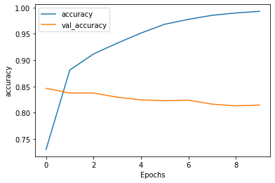
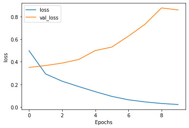
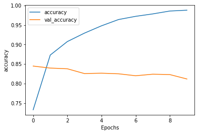
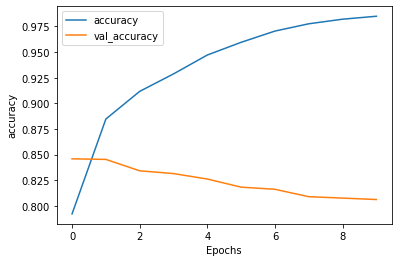
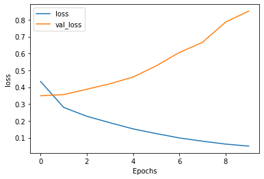

# Comparison of imdb_dataset with different types of Layers after Embedding Layer

### The python notebook of this blog can be found at: [.ipynb notebook](https://github.com/cyriacbijun/Tensorflow_NLP/blob/master/imdb_review/imdb_review.md)

### Here, we compare :
#### 1. Gated Recurrent Units(GRU)
#### 2. Long short-term memory (LSTM)
#### 3. Convolutional Layer


```python
import tensorflow as tf
print(tf.__version__)

# !pip install -q tensorflow-datasets
```

    2.2.0-rc3
    


```python
import tensorflow_datasets as tfds
imdb, info = tfds.load("imdb_reviews", with_info=True, as_supervised=True)

```


```python
import numpy as np

train_data, test_data = imdb['train'], imdb['test']

training_sentences = []
training_labels = []

testing_sentences = []
testing_labels = []

# str(s.tonumpy()) is needed in Python3 instead of just s.numpy()
for s,l in train_data:
  training_sentences.append(str(s.numpy()))
  training_labels.append(l.numpy())
  
for s,l in test_data:
  testing_sentences.append(str(s.numpy()))
  testing_labels.append(l.numpy())
  
training_labels_final = np.array(training_labels)
testing_labels_final = np.array(testing_labels)
```


```python
vocab_size = 10000
embedding_dim = 16
max_length = 120
trunc_type='post'
oov_tok = "<OOV>"


from tensorflow.keras.preprocessing.text import Tokenizer
from tensorflow.keras.preprocessing.sequence import pad_sequences

tokenizer = Tokenizer(num_words = vocab_size, oov_token=oov_tok)
tokenizer.fit_on_texts(training_sentences)
word_index = tokenizer.word_index
sequences = tokenizer.texts_to_sequences(training_sentences)
padded = pad_sequences(sequences,maxlen=max_length, truncating=trunc_type)

testing_sequences = tokenizer.texts_to_sequences(testing_sentences)
testing_padded = pad_sequences(testing_sequences,maxlen=max_length)

```


```python
reverse_word_index = dict([(value, key) for (key, value) in word_index.items()])

def decode_review(text):
    return ' '.join([reverse_word_index.get(i, '?') for i in text])

print(decode_review(padded[1]))
print(training_sentences[1])
```

    ? ? ? ? ? ? ? b'i have been known to fall asleep during films but this is usually due to a combination of things including really tired being warm and comfortable on the <OOV> and having just eaten a lot however on this occasion i fell asleep because the film was rubbish the plot development was constant constantly slow and boring things seemed to happen but with no explanation of what was causing them or why i admit i may have missed part of the film but i watched the majority of it and everything just seemed to happen of its own <OOV> without any real concern for anything else i cant recommend this film at all '
    b'I have been known to fall asleep during films, but this is usually due to a combination of things including, really tired, being warm and comfortable on the sette and having just eaten a lot. However on this occasion I fell asleep because the film was rubbish. The plot development was constant. Constantly slow and boring. Things seemed to happen, but with no explanation of what was causing them or why. I admit, I may have missed part of the film, but i watched the majority of it and everything just seemed to happen of its own accord without any real concern for anything else. I cant recommend this film at all.'
    

First, we will test out using Gated Recurrent Units(GRU) bidirectional Layer after the embedding Layer.


```python
model_gru = tf.keras.Sequential([
    tf.keras.layers.Embedding(vocab_size, embedding_dim, input_length=max_length),
    tf.keras.layers.Bidirectional(tf.keras.layers.GRU(32)),
    tf.keras.layers.Dense(6, activation='relu'),
    tf.keras.layers.Dense(1, activation='sigmoid')
])
model_gru.compile(loss='binary_crossentropy',optimizer='adam',metrics=['accuracy'])
model_gru.summary()
```

    Model: "sequential"
    _________________________________________________________________
    Layer (type)                 Output Shape              Param #   
    =================================================================
    embedding (Embedding)        (None, 120, 16)           160000    
    _________________________________________________________________
    bidirectional (Bidirectional (None, 64)                9600      
    _________________________________________________________________
    dense (Dense)                (None, 6)                 390       
    _________________________________________________________________
    dense_1 (Dense)              (None, 1)                 7         
    =================================================================
    Total params: 169,997
    Trainable params: 169,997
    Non-trainable params: 0
    _________________________________________________________________
    


```python
num_epochs = 10
history = model_gru.fit(padded, training_labels_final, epochs=num_epochs, validation_data=(testing_padded, testing_labels_final))
```

    Epoch 1/10
    782/782 [==============================] - 17s 22ms/step - loss: 0.4978 - accuracy: 0.7300 - val_loss: 0.3500 - val_accuracy: 0.8463
    Epoch 2/10
    782/782 [==============================] - 16s 20ms/step - loss: 0.2923 - accuracy: 0.8811 - val_loss: 0.3666 - val_accuracy: 0.8374
    Epoch 3/10
    782/782 [==============================] - 16s 21ms/step - loss: 0.2280 - accuracy: 0.9118 - val_loss: 0.3881 - val_accuracy: 0.8373
    Epoch 4/10
    782/782 [==============================] - 16s 20ms/step - loss: 0.1807 - accuracy: 0.9323 - val_loss: 0.4202 - val_accuracy: 0.8294
    Epoch 5/10
    782/782 [==============================] - 16s 20ms/step - loss: 0.1354 - accuracy: 0.9515 - val_loss: 0.4989 - val_accuracy: 0.8244
    Epoch 6/10
    782/782 [==============================] - 16s 20ms/step - loss: 0.0936 - accuracy: 0.9683 - val_loss: 0.5298 - val_accuracy: 0.8228
    Epoch 7/10
    782/782 [==============================] - 16s 21ms/step - loss: 0.0637 - accuracy: 0.9776 - val_loss: 0.6262 - val_accuracy: 0.8238
    Epoch 8/10
    782/782 [==============================] - 16s 20ms/step - loss: 0.0449 - accuracy: 0.9853 - val_loss: 0.7312 - val_accuracy: 0.8161
    Epoch 9/10
    782/782 [==============================] - 16s 20ms/step - loss: 0.0311 - accuracy: 0.9898 - val_loss: 0.8760 - val_accuracy: 0.8130
    Epoch 10/10
    782/782 [==============================] - 16s 20ms/step - loss: 0.0218 - accuracy: 0.9928 - val_loss: 0.8586 - val_accuracy: 0.8145
    

As you can see, the training accuracy is 99.36% while validation accuarcy is 81.82% on 10 epochs. The graph shows possible overfitting.


```python
import matplotlib.pyplot as plt


def plot_graphs(history, string):
  plt.plot(history.history[string])
  plt.plot(history.history['val_'+string])
  plt.xlabel("Epochs")
  plt.ylabel(string)
  plt.legend([string, 'val_'+string])
  plt.show()

plot_graphs(history, 'accuracy')
plot_graphs(history, 'loss')
```








Next, we try out Long short-term memory (LSTM).


```python
# Model Definition with LSTM
model_ltsm = tf.keras.Sequential([
    tf.keras.layers.Embedding(vocab_size, embedding_dim, input_length=max_length),
    tf.keras.layers.Bidirectional(tf.keras.layers.LSTM(32)),
    tf.keras.layers.Dense(6, activation='relu'),
    tf.keras.layers.Dense(1, activation='sigmoid')
])
model_ltsm.compile(loss='binary_crossentropy',optimizer='adam',metrics=['accuracy'])
model_ltsm.summary()
```

    Model: "sequential_1"
    _________________________________________________________________
    Layer (type)                 Output Shape              Param #   
    =================================================================
    embedding_1 (Embedding)      (None, 120, 16)           160000    
    _________________________________________________________________
    bidirectional_1 (Bidirection (None, 64)                12544     
    _________________________________________________________________
    dense_2 (Dense)              (None, 6)                 390       
    _________________________________________________________________
    dense_3 (Dense)              (None, 1)                 7         
    =================================================================
    Total params: 172,941
    Trainable params: 172,941
    Non-trainable params: 0
    _________________________________________________________________
    


```python
num_epochs = 10
history_ltsm = model_ltsm.fit(padded, training_labels_final, epochs=num_epochs, validation_data=(testing_padded, testing_labels_final))
```

    Epoch 1/10
    782/782 [==============================] - 18s 23ms/step - loss: 0.5173 - accuracy: 0.7327 - val_loss: 0.3658 - val_accuracy: 0.8448
    Epoch 2/10
    782/782 [==============================] - 17s 22ms/step - loss: 0.3067 - accuracy: 0.8731 - val_loss: 0.3583 - val_accuracy: 0.8397
    Epoch 3/10
    782/782 [==============================] - 17s 22ms/step - loss: 0.2392 - accuracy: 0.9076 - val_loss: 0.3788 - val_accuracy: 0.8379
    Epoch 4/10
    782/782 [==============================] - 17s 22ms/step - loss: 0.1893 - accuracy: 0.9293 - val_loss: 0.4417 - val_accuracy: 0.8256
    Epoch 5/10
    782/782 [==============================] - 17s 22ms/step - loss: 0.1481 - accuracy: 0.9481 - val_loss: 0.4967 - val_accuracy: 0.8266
    Epoch 6/10
    782/782 [==============================] - 17s 22ms/step - loss: 0.1044 - accuracy: 0.9642 - val_loss: 0.5683 - val_accuracy: 0.8250
    Epoch 7/10
    782/782 [==============================] - 17s 22ms/step - loss: 0.0814 - accuracy: 0.9724 - val_loss: 0.5909 - val_accuracy: 0.8200
    Epoch 8/10
    782/782 [==============================] - 17s 22ms/step - loss: 0.0638 - accuracy: 0.9786 - val_loss: 0.6782 - val_accuracy: 0.8240
    Epoch 9/10
    782/782 [==============================] - 17s 22ms/step - loss: 0.0438 - accuracy: 0.9860 - val_loss: 0.8530 - val_accuracy: 0.8230
    Epoch 10/10
    782/782 [==============================] - 17s 22ms/step - loss: 0.0364 - accuracy: 0.9881 - val_loss: 0.8708 - val_accuracy: 0.8117
    

As you can see, the training accuracy is 98.61% while validation accuarcy is 80.94% on 10 epochs. The loss is also slightly more here.


```python
plot_graphs(history_ltsm, 'accuracy')
plot_graphs(history_ltsm, 'loss')
```





Lastly, we have Convolutional Layer to check


```python
# Model Definition with Conv1D
model_conv = tf.keras.Sequential([
    tf.keras.layers.Embedding(vocab_size, embedding_dim, input_length=max_length),
    tf.keras.layers.Conv1D(128, 5, activation='relu'),
    tf.keras.layers.GlobalAveragePooling1D(),
    tf.keras.layers.Dense(6, activation='relu'),
    tf.keras.layers.Dense(1, activation='sigmoid')
])
model_conv.compile(loss='binary_crossentropy',optimizer='adam',metrics=['accuracy'])
model_conv.summary()
```

    Model: "sequential_2"
    _________________________________________________________________
    Layer (type)                 Output Shape              Param #   
    =================================================================
    embedding_2 (Embedding)      (None, 120, 16)           160000    
    _________________________________________________________________
    conv1d (Conv1D)              (None, 116, 128)          10368     
    _________________________________________________________________
    global_average_pooling1d (Gl (None, 128)               0         
    _________________________________________________________________
    dense_4 (Dense)              (None, 6)                 774       
    _________________________________________________________________
    dense_5 (Dense)              (None, 1)                 7         
    =================================================================
    Total params: 171,149
    Trainable params: 171,149
    Non-trainable params: 0
    _________________________________________________________________
    


```python
num_epochs = 10
history_conv = model_conv.fit(padded, training_labels_final, epochs=num_epochs, validation_data=(testing_padded, testing_labels_final))
```

    Epoch 1/10
    782/782 [==============================] - 7s 9ms/step - loss: 0.4338 - accuracy: 0.7921 - val_loss: 0.3494 - val_accuracy: 0.8458
    Epoch 2/10
    782/782 [==============================] - 7s 8ms/step - loss: 0.2798 - accuracy: 0.8847 - val_loss: 0.3558 - val_accuracy: 0.8453
    Epoch 3/10
    782/782 [==============================] - 7s 8ms/step - loss: 0.2273 - accuracy: 0.9117 - val_loss: 0.3875 - val_accuracy: 0.8342
    Epoch 4/10
    782/782 [==============================] - 7s 9ms/step - loss: 0.1891 - accuracy: 0.9287 - val_loss: 0.4201 - val_accuracy: 0.8314
    Epoch 5/10
    782/782 [==============================] - 7s 9ms/step - loss: 0.1525 - accuracy: 0.9472 - val_loss: 0.4600 - val_accuracy: 0.8261
    Epoch 6/10
    782/782 [==============================] - 7s 9ms/step - loss: 0.1249 - accuracy: 0.9596 - val_loss: 0.5263 - val_accuracy: 0.8182
    Epoch 7/10
    782/782 [==============================] - 7s 8ms/step - loss: 0.0988 - accuracy: 0.9705 - val_loss: 0.6055 - val_accuracy: 0.8161
    Epoch 8/10
    782/782 [==============================] - 7s 9ms/step - loss: 0.0796 - accuracy: 0.9776 - val_loss: 0.6659 - val_accuracy: 0.8089
    Epoch 9/10
    782/782 [==============================] - 7s 9ms/step - loss: 0.0624 - accuracy: 0.9821 - val_loss: 0.7859 - val_accuracy: 0.8075
    Epoch 10/10
    782/782 [==============================] - 7s 9ms/step - loss: 0.0501 - accuracy: 0.9850 - val_loss: 0.8513 - val_accuracy: 0.8061
    

As you can see, the training accuracy is 98.71% while validation accuarcy is 80.09% on 10 epochs. The loss is slightly less here.


```python
plot_graphs(history_conv, 'accuracy')
plot_graphs(history_conv, 'loss')
```







